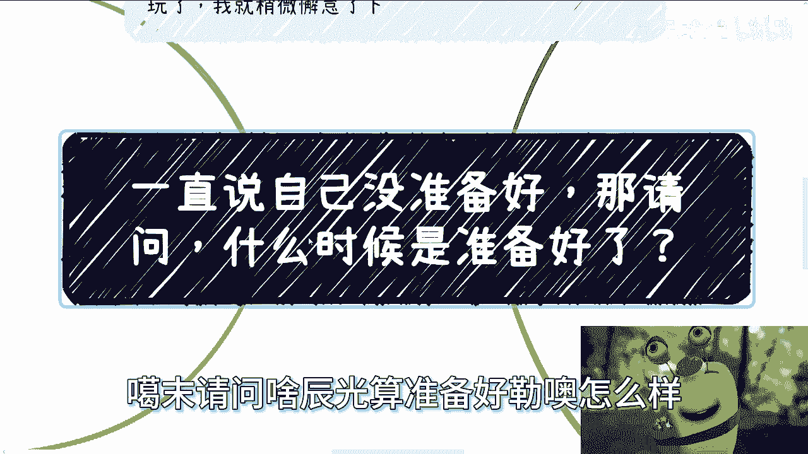
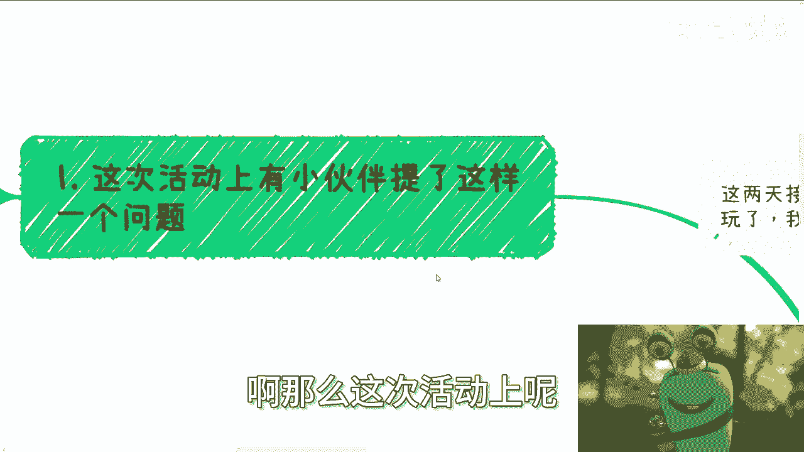
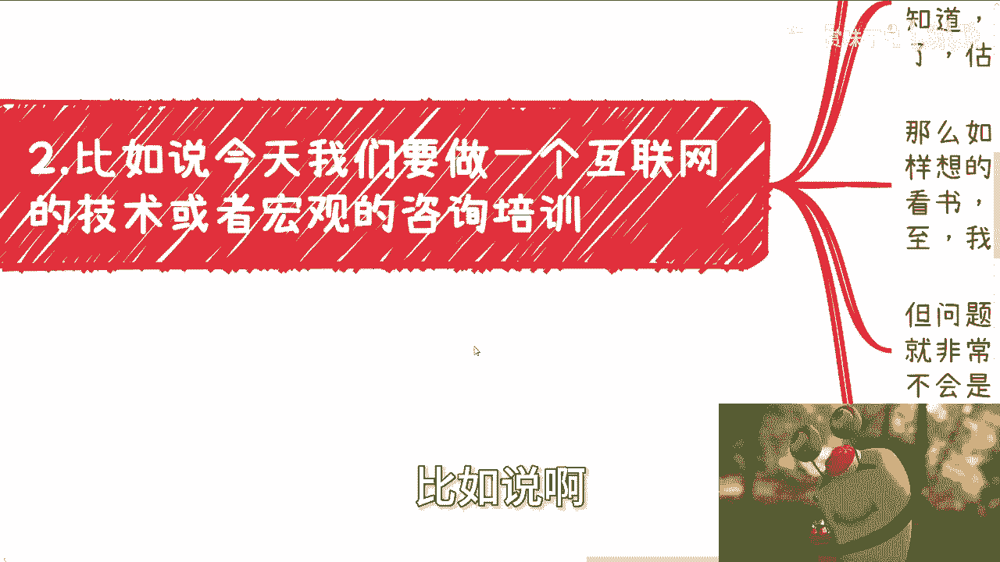
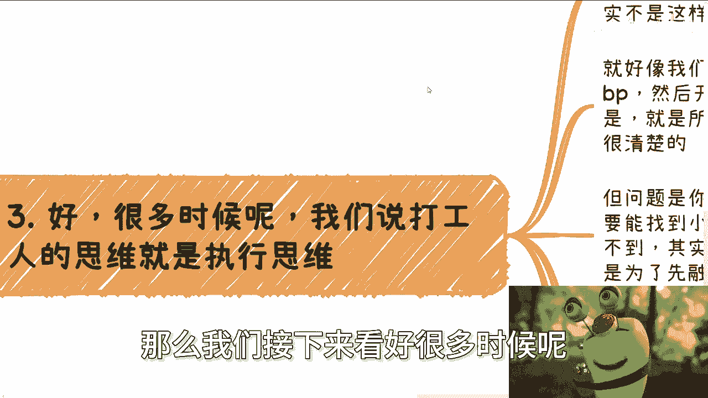
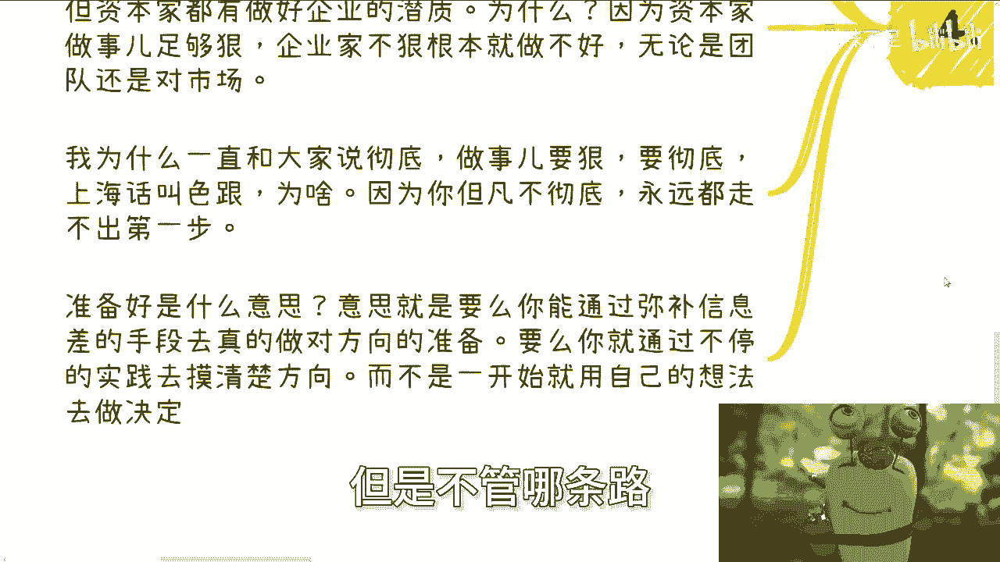

# 一直说自己没有准备好-那问题来了-什么时候是准备好了----P1---赏味不足---BV1Te411


在本节课中，我们将探讨一个普遍存在的思维困境：人们总觉得自己“没有准备好”，从而迟迟无法行动。我们将分析这种心态的根源，并提供一个清晰、可操作的框架，帮助你重新定义“准备”的含义，并迈出关键的第一步。


---





## 概述：我们为何总觉得自己“没准备好”？

在最近的深圳活动中，我与许多伙伴交流，发现一个普遍现象：无论是想进入咨询行业，还是尝试其他新事物，大家最常说的一句话是“我还没有准备好”。这种心态源于对未知的恐惧和对“完美准备”的追求。

上一节我们提到了这个普遍现象，本节中我们来看看，当我们说自己“没准备好”时，我们到底在说什么。

## “没准备好”的本质是什么？




当人们说“没有准备好”时，通常意味着：
*   觉得自己知识储备不足。
*   对行业或领域不了解。
*   心里没底，缺乏自信。

这种感受本身没有错，但它引出了一个更关键的问题。

## 核心问题：什么时候才算“准备好了”？

如果我们反向思考一下：既然都说没准备好，那么**什么时候才算准备好了**？是学一个月、半年、一年，还是考取某个证书之后？

你会发现，几乎没有人能明确回答这个问题。这意味着，“等待准备好”本身可能就是一个伪命题，一个虚幻的目标。

## 案例分析：以进入咨询行业为例

假设你现在对互联网咨询一无所知，却想抓住一个机会。一个常见的思路是：先去报班学习、看书、看视频，甚至考研。


但这里存在一个根本性的悖论：
1.  你无法保证学完这些就真的“准备好了”。
2.  在你学习的过程中，机会（Case）不会等你。等你学成，机会早已消失，市场可能已变。



那么，正确的思路应该是什么？

## 破除“执行者思维”：从“自己做”到“驱动事”

很多人陷入“没准备好”的循环，是因为持有一种 **“执行者思维”** 或 **“电池思维”**。这种思维的特点是：凡事都想亲力亲为，沉迷于细节和“怎么做”。

然而，事情的成功运作往往不依赖于此。例如，启动一个项目，最重要的不是完美的计划书（BP），而是**启动资金（资本驱动）**。

以下是“执行者思维”与“驱动思维”的对比：

*   **执行者思维**：先打磨完美计划 -> 幻想找到用爱发电的伙伴 -> 因缺乏资金而寸步难行。
*   **驱动思维**：先构思能打动人的故事（商业逻辑）-> 寻找投资（资本驱动）-> 在路演和挑战中快速迭代项目。

**核心公式**：
**项目成功 ≠ 完美计划**
**项目成功 ≈ 资本驱动 + 快速验证**

上一节我们分析了思维模式的差异，本节中我们来看看如何将新思维应用到“准备”这件事上。

## 重新定义“准备好了”

对于咨询或其他任何领域，“准备好”的真实含义往往被误解。许多人认为必须先“真懂”，才能去“包装”和展示。

但事实恰恰相反：
**“准备好” = 让需求方（如甲方）认为你懂，而不一定是你100%精通所有细节。**

以下是两种可行的路径：

1.  **信息差弥补**：通过人脉、资源快速获取关键信息，构建足以应对需求的认知框架。
2.  **实践验证**：直接去尝试，哪怕被拒绝。在真实反馈中快速学习对方真正的需求是什么。

关键在于，你不能停留在自己的想象中（YY），必须与真实世界碰撞。

## 总结与行动指南



本节课中我们一起学习了如何打破“没准备好”的魔咒。


**核心总结**：
1.  “等待准备好”是一个无限循环的陷阱，因为知识和市场永远在变化。
2.  关键在于分清主次：你的目标是**满足外部需求**，而非达成自我设定的、虚幻的“精通”状态。
3.  用 **“驱动思维”** 替代 **“执行者思维”** ，关注如何撬动资源（如资本）来推进事情，而非纠结于个人如何学会所有步骤。
4.  “准备好”的终极定义是：**你已具备满足当下机会所需的最小可行认知与方案**。

因此，请停止用“没准备好”来PUA自己。无论是转行、创业还是尝试新事物，清晰定义你的目标（是赚钱还是用爱发电），然后找到实现目标最关键的第一块拼图（通常是资金或核心需求），立刻行动。

**行动代码**：
```python
if feeling == “not_ready”:
    ask(“What is the ONE thing needed to start?”) # 问自己：启动最需要的一件事是什么？
    find_resource() # 寻找资源（信息、人、钱）
    take_action() # 立刻行动
else:
    take_action() # 直接行动
```


不要再等待一个不存在的“完美准备”时刻。真正的准备，始于你迈出的第一步。