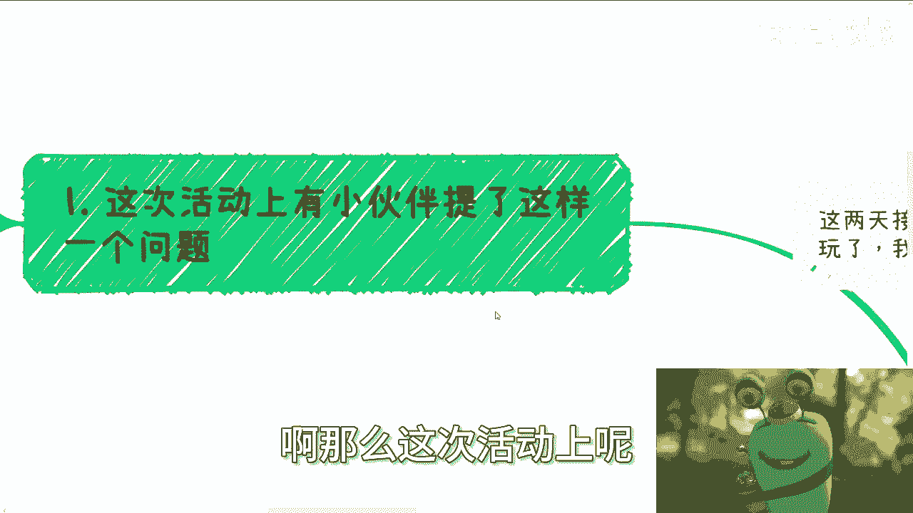
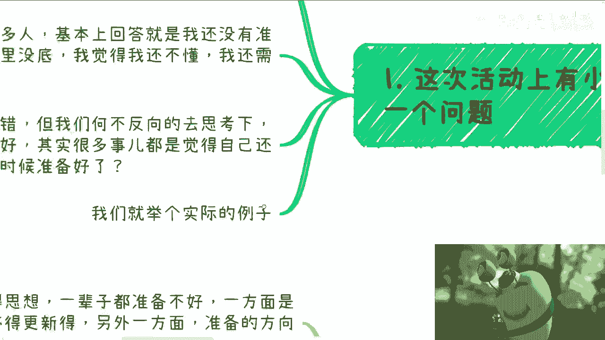
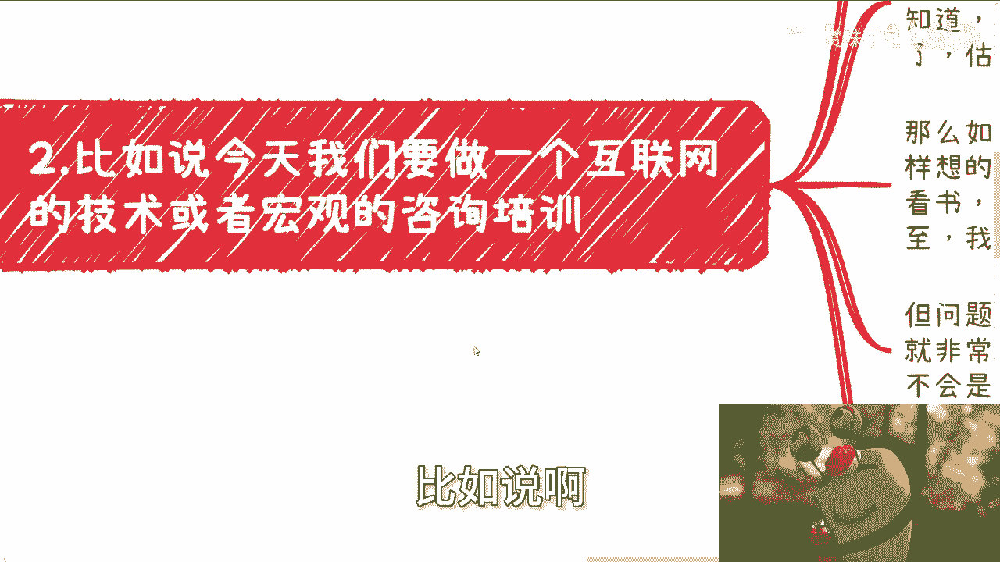
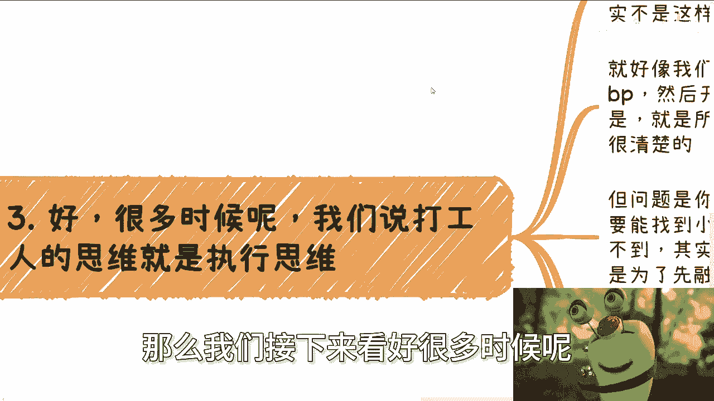
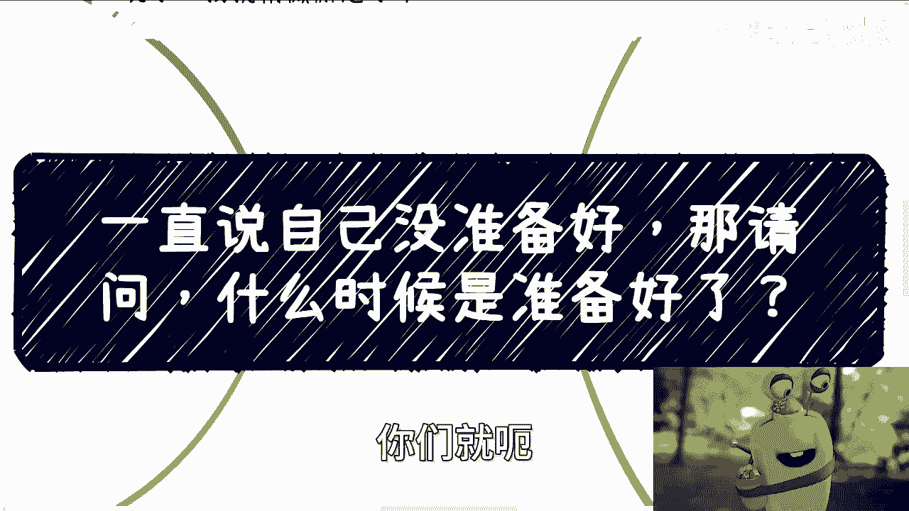

# 一直说自己没有准备好，那问题来了，什么时候是准备好了？ - P1 - 赏味不足 - BV1Te41117Aq

啊大家好啊，这个葛亮梯对，这两天那个接待了之前那个广州办活动的时候，跟我一起合作的那个小姐姐来了，她来上海玩了，所以我就稍微懈怠了一下，啊哈哈对吧啊，嗯好啊，那我们这个继续啊继续啊。

我们今天来讲的呢是这个叫什么呢。

诶叫嗯因为这次深圳活动呢，我也跟很多小伙伴聊了一下，聊下来就发现这个问题啊，我正好总结出来跟大家说一下是什么呢，叫做呃所有的这个过程啊，其实都在说自己没有做好准备对吧，那么我每次就是沟通的时候。

我就会问我说你说没有做好准备。

那什么时候算做好准备，对不对啊，好那么来帮来和你们翻译一下，叫啊要死了，一开始我就翻译过来，就是一只刚刚没准备好清三农光。

谁准备好了啊，怎么听得懂啊，那么这次活动的小伙伴提了这么一个问题啊。

他说意思就是说大家在深圳有印象，就第一个问题他说啊，他说我也想做咨询啊，但是呢我没有接触过这个行业啊，那我应该怎么0~1对吧，我应该怎么准备点什么，对吧好，这个问题我觉得不单是他所有的人。

可能心里面都会有这个问题，对不对，好，那么当然啊，我沟通过很多人，不管是咨询的，线下的还是线上的啊，基本上回答就是说我还没有准备好，就是不管我跟他说什么，咱咱不说什么咨询不咨询啊。

咱不说就说他要不要做咨询啊，哪怕做别的东西，他的意思也是我没有准备好啊，要么就是我觉得心里没有底，要么就是说我觉得我不懂啊，好那么我们来说，其实这些话呢你从本质上来讲没有错啊。

但是我们不妨反向的去思考一下，大家都说没有准备好，其实很多事都是自己觉得自己还不懂对吧，还没有足够的知识储备，对不对，好这没问题啊，那么我就问什么时候算准备好了对吧，那么你想想看啊。

我问你们这个问题的时候，我敢打赌，100%的人他都不知道你怎么回答啊，我一年准备好了，两年准备好了，谁知道啊，对不对，那么也就意味着什么，意味着这个问题本身就是这个问题，是不是问题。

是但这个问题问题有没有意义，这个问题本身是不是太虚，你们思考一下啊。

好人们，我们来看这个真实的案例啊，比如说啊。

今天我们要做一个互联网的技术，或者宏观的培训咨询，比如说你们所有人都得做啊，好那么假设你们现在不是互联网领域的，你们什么都不懂，对不对，好，OK现在你们没有底，你们慌得一批是吧，你一定觉得自己不行啊。

请问你自己你觉得多少时间行呢对吧，一个月半年一年还是更久啊，虽然我们不知道多久，但我们知道，等你觉得那这么说吧，这个事情可以放到任何行业当中都一样的，就是虽然我们不知道我们多久能够行啊。

但是我们知道的是，当我们自己觉得自己行了，黄花菜都凉了啊，而且不仅凉了一批，可能他妈的凉了好几批了，一个世纪都过去了，你明白吗，就是所谓的我们不能主次颠倒，什么意思，就是我们去学这个东西。

不是因为我们要去学，我们去学这个东西，往往是因为你们想抓住某个风口，想抓住某个机会，想抓住某个东西，对不对啊，那么我们就拿就拿这个咨询角度来讲啊，比如说我今天跟你们讲，我说好，我现在有个case。

我现在就需要人啊，那么怎么说呢，你们怎么弄啊，难你难道跟我说我先去学，那我就问你是case，会等你呢，还是说怎么地吧，等你等你学完了，妈的case别人早就做完了，钱都赚完了，那么如果你想准备的话。

怎么准备对吧，我觉得有的人是这么想的，因为我沟通下来无非就这么几种答案嘛，比如说我现在就要去找个培训班啊，学java或者找一些这个技术培训对吧，那么就是说先去学习，看书上别的培训班或者看免费视频等等。

甚至啊我跟你们说，甚至啊我相信有的小伙伴会选择说，我要学一个东西，我会通过考研来进行学习，但问题是什么呢，你咋知道这么学习你就能准备好了呢，你知道吗，你不知道你这么学习，我就问你，你学完了报了。

比如说一个34万5万块钱的培训班，你学完了就准备好了吗，你能保证吗，不能这就很神奇啊，那你既然不能保证这件事情，那你做它干嘛呢，如果你不知道，当然啊，当然啊，你的确不知道你有没有准备好对吧。

这个问题我觉得必然的，但是你知道的是，自己不会是不行，对吧，那么也就是说，也就是说是什么，就是我在深圳现场说的答案是什么，不要脸包装和自圆其说，有一说一，我觉得可能一半人或者一半以上的人。

可能还是不理解我的意思，因为在他们的认知里面，他们觉得我要去做咨询的前提是必然要懂。

然后才有才有包装啊，大部分人可能都这么觉得，那么这个就是最大的一个悖论，也是最大的一个一个先有鸡先有蛋的问题，那么我们接下来看好，很多时候呢。

我们说的打工人的思维或者电池思维，指的就是执行思维啊，因为之前我有一个专辑叫电池拒绝电池思维啊，我估摸着很多新的小伙伴，小伙伴可能就是啊没有这个都没有，怎么看啊，我这边再提一点，什么叫执行思维。

就是什么事你都想着自己做，什么事都想着细节，什么事都想着怎么做啊，那么这个问题我跟你们讲，这是最大的问题，因为什么，因为事实事实本身或者事实事情运作本身，它不是这个样子的，你明白吧。

这就像我们要做一个项目，有很多小伙伴一开始就会写好BP，也就是所谓的项目计划书，包括这次深圳活动也是的对吧，有小伙伴他跟我谈这个项目啊，他把所有的项目过程第一步，第二步，第三步，甚至5年后。

10年后他都想好了啊，要找什么样的小伙伴，他也想好了，我觉得他的想法一点毛病都没有啊，但是问题来了，你要做一个项目，你缺的是什么，你缺的是钱，对不对，你所有别的东西你可以想的很好。

但其实那些东西问题是不是要考虑要的，但不是最重要的，你要的是钱对吧好，那么我们就说啊，你要么就自己投，我觉得也没问题，你要么就能找到小伙伴一起来用，爱发电也没问题，但是事实是你大概率你也没有钱。

你也找不到小伙伴一起意外发现，那怎么办呢，你明白吗，就是说很多人做事情你得切实际啊，你不能单纯的跟我说，哎陈老师，我有情怀对吧，我来跟你讨论一下这个问题，你有情怀，你讨论问题，你怎么往下讨论。

你你你你你寸步难行啊，你一步都走不出去，就像我们说你要找小伙伴，那人家小伙伴凭什么给你做啊，你不你不得跟他洗脑说，哎你必须用爱发电，他妈的一分钱没有的，那谁给你做啊啊，但你如果都找不到。

其实本质上你就应该去想了，就是项目真正的驱动应该是谁，应该是资本驱动啊，说的再通俗一点，就应该是超能力驱动对吧，钞票驱动啊，那么也就是说你一切你现在做的所有的准备，是为了融资而来的。

而不是说在那边自己YY出来一个项目计划书，对吧好，那么先融资，你就得你，你就是什么都别想，你先想整个故事是怎么圆，这个故事应该怎么写啊，然后你项目计划书当中应该有哪些东西。

你这些东西又如何吸引到投资人去出钱对吧，你整个过程当中就应该是不停的去路演，然后去尝试，然后通过投资人不停的challenge，你就不停的提问，然后不停的往前推，这才是正道啊。

简单来讲就是说这就好像别人问我啊，比如说如果有的项目你真的要我要陈老师，要你投钱怎么办，我说可以啊，我真的要我投钱，难道我真的就是投钱吗，不是啊，你真的要我投钱，那么我就去找别的冤大头来投啊，没问题啊。

对不对，有什么问题呢，你要的需求是什么，投钱你要的需求是我投，你管我钱哪里来的，对不对，我分点钱给他不就好了吗，哎你为什么所有的投钱，你说到投钱，说到投钱，你第一反应是自己投呢，我不明白。

明明你们大部分人没有钱，他为什么要想着自己投呢，这到底哪来哪来的这根深蒂固的这种这种思维，我也不明白对吧，那有人要我拿到车上，那如果我找不到钱怎么办，我就告诉你，你找不到钱就说明你能力有问题。

你能力还不够，那你去投他干嘛呢，对不对，不是什么事情都要做的，唉我真的我发现啊，就就就就就就跟我之前那个视频说的一样，就是我们做做事啊得灵活，做人也得灵活，咱不要这么死板好吗，第四点叫什么。

就是所以我们最终总结一下，什么叫准备好了对吧，你按照很多人的思想，我告诉你们一辈子你都准备不好，因为一方面是知识内容，它会不停的更新啊，你准备到一半，你会发现哦，这个东西有个新的东西出来哎。

那边有个新的东西出来对吧，另外一方面准备的方向你不对呀，这就像我们刚刚说的，你把你的项目计划书，把你的小伙伴打磨的再好，打磨得再牛逼，花了他妈10年打磨，你没有钱就有有有有有有屁用对吧，像PH对不对。

你准备方向不对呀，那么你就会永远陷入到新手期，先有蛋的过程，然后你就自己在那边想，哎呀，我找人找不到哎，合适的人们都问我要钱啊，不合适的人嘛，我也不想要对吧，但是这个这个东西嘛现在没有钱，我也没有钱。

对吧啊，我也不知道这个资本怎么想的，那么你永远陷入到这种环境下面，你怎么往前走啊，你就像我今天跟深圳，那个那个广州来的小伙伴聊，也是的企业家啊，我们就说企业家其实不见得一定是资本家。

因为很多企业家也是打工人，也是工具人，但是资本家一定会具有真正的资本家啊，一定是拥有一个做好企业的潜质的，为什么，因为资本家做事足够狠啊，他脑子足够清晰啊，啊足够彻底啊，企业我跟你讲啊，一个人如果不狠。

他根本就是做不好企业的，你明白吧，因为他对团队如果心慈手软，或者他对团队就是模棱两可，他对市场心心慈手软，他怎么可能活得下去啊，啊我为什么一直跟大家说，做事要彻底，做事要狠，对上海话叫什么叫撒更。

凡不撒更，你永远走不出第一步，准备好，我告诉你们是什么意思，意思就是你要么你就有本事，通过弥补信息差的手段，通过外界，比如说你不管是通过你的长辈，通过别人对吧，你说我有本事的啊。

我不管我总有办法去弥补这个信息差的，那你就去弥补，那么你弥补出来的信息啊，就是告诉自己，OK比如说我今天做个咨询，我的所谓准备好是什么，是满足甲方的需求，所以准备好是要让甲方觉得我懂，而不是我真的去懂。

而不是说我真的去读个二硕妈，脑子有毛病对吧，这个叫你民族性时差，你要么就是通过不停的去实践对吧，你说好，我今天学会了，然后你跑跑出去做了一次咨询啊，然后人家给你吃闭门羹啊，人家说我们不要你啊。

我觉得你这个方案不行对吧，或者怎么样，那么你通过不停的去实践，然后真正最后摸清楚哦，原来对方要的需求是他们觉得我懂，而不是我真的懂对吧，你但是不管哪条路。

你不能一味的按照自己的想法在那边YY啊，你明白吧，所以说你我们所有面对的问题。

都说自己没有准备好，那你问问你自己什么时候就准备好了啊，你说是读出来有张纸就准备好了，你今天上了一个四五班的课，毕业了就准备好了啊，你上了培训班会写两行代码就准备好了，他没有因因，没有任何因果关系啊。

你明白吧是吗，这就包括我，我跟他们创业的也说对吧，那你们到底要干嘛，你创业的目的是什么，你要么就告诉我你用爱发电，你要么就告诉我你要赚钱，你别跟我说，你既要用爱发电又要赚钱，那他妈就叫就要做表，既要做。

要当立排放，没有意义的呀对吧，那么你所谓准备好的前提是，你得明白需求是什么，大部分人连需求都不知道是什么啊，对不对，好吧行啊，那我们就这么着啊，不要再PUA自己说自己有没有准备好啊。

你包括就是说很多人什么什么什么不，你不要说这个做业务了对吧，什么跳槽啊对吧，出什么到别的城市啊，怎么样子啊，你就说没准备好，那你打算怎么准备呢，行就这么着啊，嗯一样的好吧，大家反正嗯有简单问题的。

你们就私信我好吧，然后如果有一些这个详细的，比如说商业上或者其他的，你们就呃整理好问题好吧。

