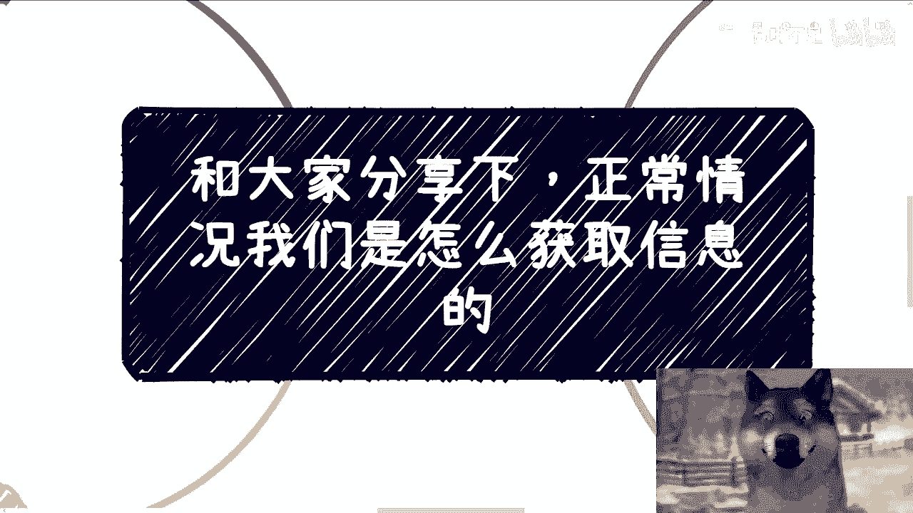
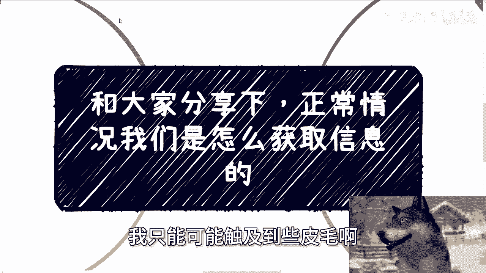
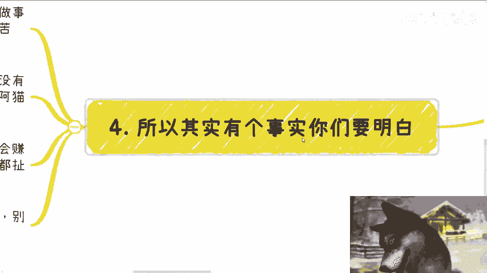
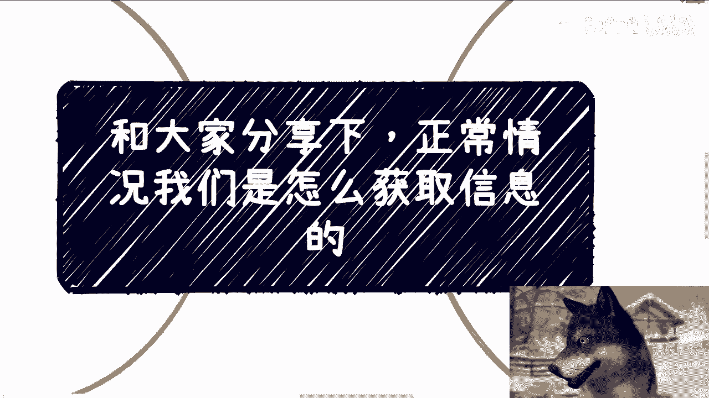

# 一般既得利益者是怎么获取有效信息的 - P1 - 赏味不足 - BV1Mf421B79P

好我们来讲第二个视频啊，咳咳呃，和大家分享一下啊，就是可能很多人也比较这个好奇啊，就正常情况下面，我们是怎么去获取信息的，或者说那些呃所谓的既得利益者，或者还是说有一定这种社会地位，商业地位的人。

怎么获取信息呢，呃首先我要先还说一下，因为我毕竟没有他们这么牛逼啊，我只能可能触及到一些皮毛啊。

我就跟你们分享一下我所知道的啊，首先呢有个重要的事情啊，那就是我们，如果就是你们如果想要达到这么一个境界，或者这么一个目标呢，首先首先就要做的一件事情是什么，就是需要学会果断的拒绝。

无用的社交以及信息流啊，不能有一丝优柔寡断啊，否则你但凡有优优柔寡断，就代表你这个人做事情是没有效率的，没有效率就没有商业价值啊，那么有经验的人一交流呢，他就能明白你是怎么样的人。

你不要让别人觉得你很优柔寡断，甚至是一个分不清信息价值的人，那么你分不清楚，你认你你本身就没有价值啊，比如说我举个例子，比如说有人请你吃饭，说有事要交流沟通对吧，没问题，首先吃饭诚意要拿出来。

地方要选的好对吧，你你不咱不说单单价多高，但是他得就是配得上你的，这个这个这个这个商业的价值对吧，然后事情本身大概情况得要说清楚，如果你判断下来，对方比如说请你吃饭，的确是有诚意的啊。

你同时他讲他的一些诉求，你也的确会拥有一些对应的资源或积累，只不过你在闲聊之前，你还不知道这个资源和或者积累，到底对方对对方有没有帮助，那么OK你去，否则没有不用多废话，因为大家浪费时间有什么多废话呢。

对不对啊，那么对很多人要说了，他说那那那我们现在就是没有判断能力，对吧啊，我们现在也也只能有很多无效的社交，对你们说的对啊，包括你们也会说，由于自己的性格问题可能没有那么果断，你说的也对。

所以啊你要去改啊，你明白吗，就是as soon as possible啊，我们叫做ASAP嘛，你要尽可能的去改啊，你否则别的谈别的都是空话啊，对不对啊，这第一第二啊，其实正常情况下面啊。

我们是不会去获取信息的，哎这只狗怎么不动了呢，诶我知道了，每次都是因为每次都是因为上面有个亮光，把我的对焦弄完了，呃，我们都是不主动获取信息的。

我们都是被动获取信息的，那么简单来讲，就是说从来我们不去找信息，是信息来找我们的啊，当你做到这一点的时候，其实基本上就说明至少你是上牌桌了啊，这也是大家要努力做到的目标，因为每天无论是人还是群。

还是可能有个电话，一个语音，他都会有无数的信息涌入给你啊，那么当然我不是说那些八卦啊，更多的是各行各业的各种各样的，一些诉求的一些动向啊，可能今天有人告诉你，比如说某某某国企要要做软件外包对吧。

来来寻求我的帮助，那另外有人问你，他说哎某些地方开始做什么野鸡培训了对吧，那么有的群告诉你，那全球某些国家出了哪些全新的绿卡政策对吧，渔民政策等等等，你会发现每天有各种各样的就是各行各业。

无数的信息流涌向你，那么你要的是什么，你要的是高质量的群，高质量的圈子以及高质量的人，然后你需要每天过滤的是这些信息，背后所要传达的信息啊，因为本质上你说这个软件外包是不是很重要吗，不重要。

它重要的是它背后传达出来，国企是不是对某个方向诶，最近有哪些动向对吧，那么你可以去看看，再摸索摸索别的对应的举一反三的国旗，有没有对应的需求对吧，那比如说中国某个地方的政府做了某个东西，那么也就意味着。

别的地方政府也会做相应的东西。

对不对，那么这些是你要去挖掘的，这就是你的这个对信息的敏感度啊。

那么第三我们再往下说一层啊，如果要做到二，那么本质上也就两点，第一你的这个人的标签要足够清楚，我之前在去年的充电视频里面，我就强调过，我们需要让别人很清楚的知道我们能干什么，就是我们有什么技能。

我们有什么样的人脉，我们能搞定什么啊，在这个地方我顺便提一点，一定要让别人明白我们是一个有价值的人，也就是说我们要我们是会赚钱的，而不是你给别人告诉别人的，就是你只会花拳绣腿没有用。

就像我刚刚那个视频里面写的花拳绣腿，满地都是啊，不不差你这一个啊，那么就拿我来讲，大家都很清楚啊，当然我说大家不是你们是我的关系链啊，我的关系呢都很清楚，一我有研究院的开发外包团队啊，二我有讲师团队。

三我有很多数字经济课程，四我有8年的开发经验，五我能做很多大会，很多沙龙对吧，六我给政企做过无数个活动，也就是说我很清楚政府企业做活动，大概有哪些要求，七我做过无数的咨询啊。

那么也就意味着我很清楚怎么跟企业，怎么跟政府，怎么跟高校打交道啊，同时我也积累了一定的在高校企业，政府资本里面里面的各种我的关系啊，那么领域的话涉及了泛金融，泛互联网，包括web3啊。

那么国内国外包括香港这边也有对吧好，那么这个就是我的标签，第二你需要在一些领域里面，然后不同的组织里面都需要，你要你有你认识的人，因为你只有这样子，这些人才会给你提供有价值的信息，其他三教九流阿猫阿狗。

你认识多少都无所谓啊，这都可以，但是你自己的核心圈子你需要积累哦，否则你永远不会有有价值的信息哦，你们不要你，你们看到这个地方不要再来想说哦，那我应该怎么积累，怎么积累，不停的去认识啊，不停的做啊。

你还能怎么办呢，对不对，你说我们作为普通人，我们能怎么办呢，第四所以其实有个事实你们要明白，真正赚钱的人肯定不是那种很忙的，什么，各种忙着做事情，忙着亲自去做，不可能的，因为这种只是辛苦钱，不能叫赚钱。

真正赚钱的人也不可能一直去社交，因为社交本身是没有价值的，是浪费时间的啊，我曾经就跟你们讲强调很多遍了，如果你们对自己的时间，都就是说你们自己都不认可你们自己的时间。

或者你们自己都觉得你们时间是不值钱的话，别人是不会尊重你们的，你明白吗啊，社什么叫社交，社交就是要定点定目标，定背景，但不是阿猫阿狗都要去社交的哦，那么很多人跟我说，那这个大佬那个大佬，我跟你们这么讲。

但凡他不会赚钱，不会低成本的，高性价比的躺着去赚钱，你不要来说说什么大佬啊，懂要只要自己不懂得资本运作的，扯淡，这些人都是跟你们一样，都是都是赚辛苦钱的，无非就是比你们年长一点啊。

所以说更不要觉得好像赚钱就会很忙，我跟你们讲，事实是反过来的，我从来就没有看到过一个会赚钱的人很忙，他可能会很忙，忙着娱乐，你懂吗啊。

就是就是就是我最近啊，还在跟我的一些朋友来聊这个事情，就是我我们觉得其实很多人很悲哀，很可悲，不还是那句话，我从来不觉得大家好像有有什么差，比别人差的地方，或者有比别人不足的地方，我从来不觉得。

但我觉得之所以让大家这么辛苦，之之之所以大家可能活的这么累的，主要原因就是因为活了这么长时间，到现在，整个社会，整个家庭，整个学校给大家的信息其实都不是真实的信息，仅此而已，好吧行啊。

那就这么着吧啊然后那个反正职业规划，商业规划啊，股权分红分润啊，商业计划书白皮书啊，包括一些合同啊，啊股权啊，期权啊，反正你们觉得呃希望通过我的一些视角，能给你们一些更接地气。

或者说更让你们少走点弯路的一些建议，或者规划的话，那么你们可以整理好对应的问题跟个人背景，好吧。

