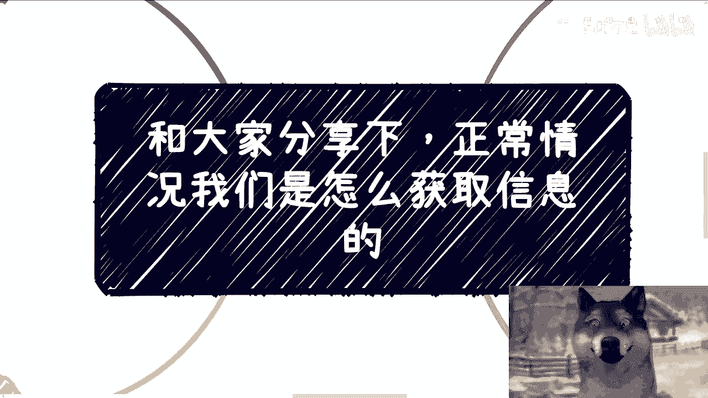
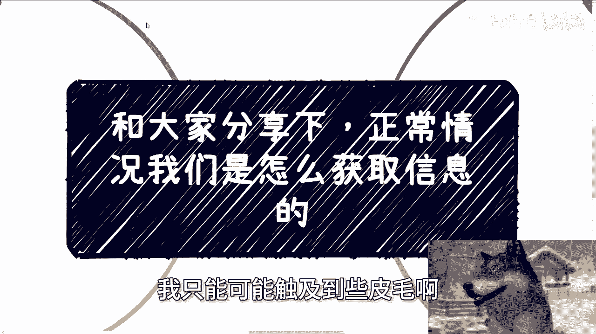
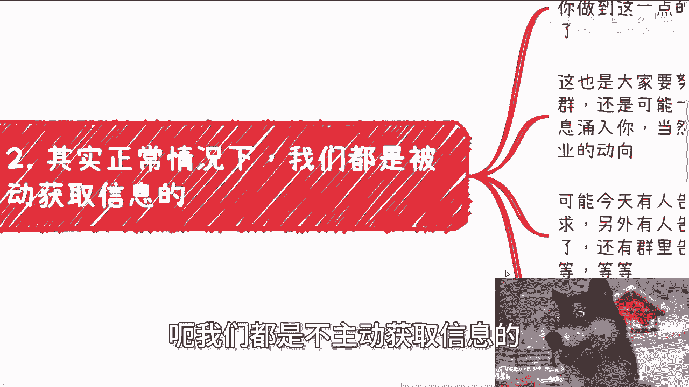
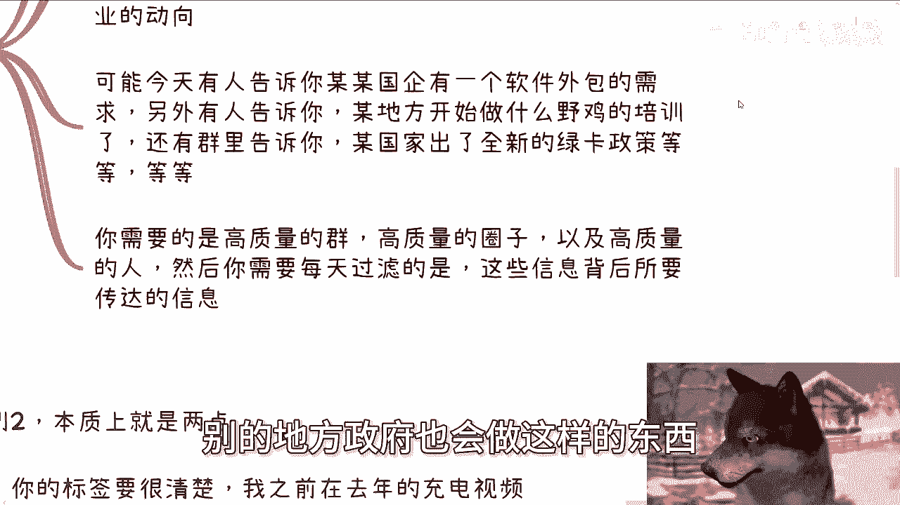
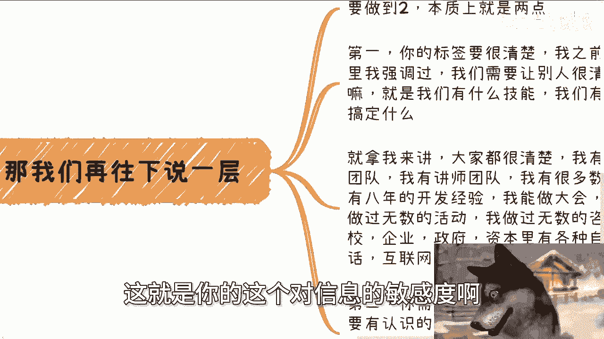
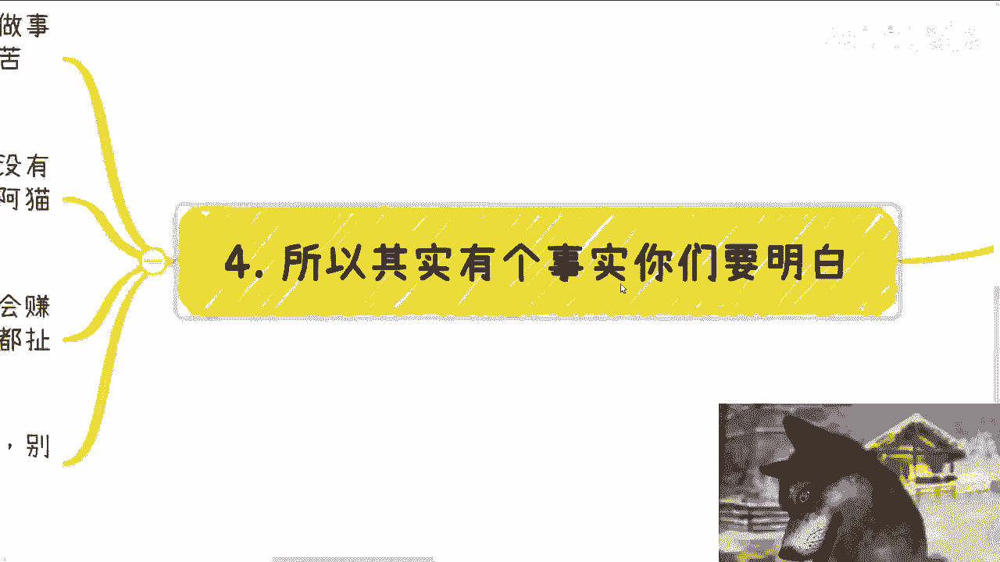
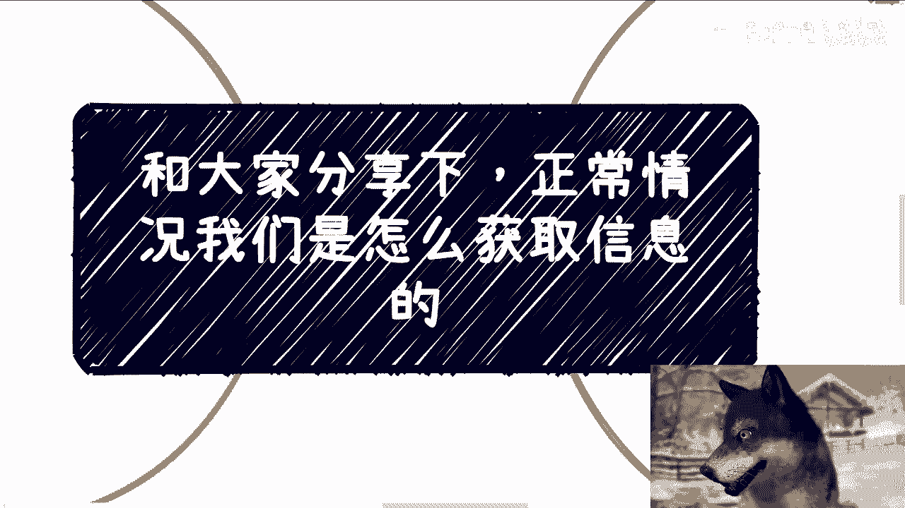

# 一般既得利益者是怎么获取有效信息的---P1---赏味不足---BV1Mf421B79P

在本节课中，我们将要学习“既得利益者”或拥有一定社会地位的人是如何获取有效信息的。我们将探讨从拒绝无效信息到建立高质量信息渠道的核心方法，帮助初学者理解并迈向更高效的信息处理模式。

---

## 1. 学会果断拒绝 🚫

上一节我们介绍了课程目标，本节中我们来看看获取有效信息的第一步：学会果断拒绝。

首先，若想达到高效获取信息的目标，必须学会果断拒绝无用的社交以及信息流。不能有一丝优柔寡断。否则，优柔寡断代表做事没有效率，没有效率就没有商业价值。有经验的人通过交流就能判断你是什么样的人。

不要让别人觉得你优柔寡断，甚至是一个分不清信息价值的人。如果你分不清信息价值，你本身就没有价值。

以下是判断是否参与社交的一个例子：

*   有人请你吃饭，说有事要交流沟通。首先，吃饭的诚意要拿出来，地方要选得好，要配得上你的商业价值。
*   对方需要把事情的大概情况说清楚。
*   如果你判断下来，对方请你吃饭的确有诚意，同时他的诉求与你拥有的资源或积累可能相关，那么你可以去。
*   否则，无需多废话，因为这是在浪费彼此的时间。

很多人会说，自己目前没有判断能力，或者由于性格问题无法那么果断。这些情况确实存在。

所以，你需要去改变。要尽可能快地去改，否则谈论其他都是空话。改变的原则可以概括为：

**公式：行动准则 = ASAP (As Soon As Possible)**

---

## 2. 从主动搜寻到被动接收 🔄

上一节我们讨论了拒绝无效信息的重要性，本节中我们来看看信息获取方式的根本转变。

正常情况下，我们不会主动去获取信息。我们都是被动获取信息的。简单来说，我们从不寻找信息，而是信息来找我们。

当你做到这一点时，基本上说明你已经“上牌桌”了。这也是大家要努力做到的目标。因为每天，无论是通过人、群组还是电话、语音，都会有无数信息涌入。

当然，这里指的不是八卦信息，更多的是各行各业的各种诉求和动向。例如：

*   今天有人告诉你，某国企要做软件外包，来寻求帮助。
*   另外有人问你，某些地方开始做某种培训。
*   有的群组告诉你，全球某些国家出台了全新的绿卡或移民政策。

你会发现，每天有各行各业无数的信息流涌向你。

你要做的是：拥有高质量的群组、高质量的圈子以及高质量的人。然后，你需要每天过滤这些信息背后所要传达的深层含义。

本质上，具体事件（如软件外包）本身并不重要，重要的是它背后传达的信号。例如：

*   国企的软件外包需求，可能暗示了国企在某个方向上的新动向。你可以据此探索其他国企是否有类似需求。
*   中国某个地方政府做了某个项目，可能意味着其他地方也会做相应的项目。

这就是你对信息的敏感度。

---

## 3. 建立高质量信息渠道的基石 🧱

上一节我们了解了被动接收信息的状态，本节中我们来看看要达到这种状态需要具备哪些条件。

要做到被动接收高质量信息，本质上需要两点。

**第一，你的个人标签要足够清晰。**

你需要让别人清楚地知道你能干什么：你有什么技能、有什么样的人脉、能搞定什么。在这个地方要强调一点：一定要让别人明白你是一个有价值的人。也就是说，你要让别人知道你是会赚钱的，而不是只会花拳绣腿。

以我为例，我的关系链都很清楚我的标签：
1.  我有研究院的开发外包团队。
2.  我有讲师团队。
3.  我有很多数字经济课程。
4.  我有8年的开发经验。
5.  我能组织很多大会和沙龙。
6.  我给政企做过无数活动，清楚政府企业的活动要求。
7.  我做过无数咨询，清楚如何与政府、企业、高校打交道，并积累了在这些领域的关系。涉及领域包括泛金融、泛互联网和Web3，范围涵盖国内、国外及香港。

**第二，你需要在一些关键领域的不同组织中都有认识的人。**

只有这样，这些人才会给你提供有价值的信息。其他三教九流的人认识多少都无所谓，但自己的核心圈子必须积累。否则，你永远无法获得有价值的信息。

看到这里，不要只问“我应该怎么积累”。积累的方法就是：不停地去认识人，不停地做事。作为普通人，没有其他捷径。

---

## 4. 重新认识“忙碌”与“社交” ⏳

上一节我们探讨了建立信息渠道的方法，本节中我们来看看关于赚钱和社交的两个常见误区。

有一个事实你们要明白：真正赚钱的人肯定不是那种非常忙碌、事事亲力亲为的人。因为那只是赚辛苦钱，不能叫赚钱。

真正赚钱的人也不可能一直去社交，因为无效社交本身是浪费时间的。我曾多次强调：如果你们自己都不认可自己时间的价值，或者觉得自己时间不值钱，别人是不会尊重你们的。

什么是有效的社交？社交需要定点、定目标、定背景，但不是任何人都值得去社交。

很多人谈论“这个大佬”、“那个大佬”。但凡一个人不会赚钱，不会通过低成本、高性价比的方式“躺着”赚钱，就不能称之为大佬。只要不懂得资本运作，都是在赚辛苦钱，无非是年长一些。

所以，更不要觉得赚钱就会很忙。事实恰恰相反。我从未见过一个真正会赚钱的人很忙。他可能会忙，但那是忙着娱乐。

---

## 5. 核心问题与信息真实性 💡

我最近还在和朋友聊这件事：我觉得很多人很悲哀、很可悲。我从不觉得大家比别人差或不足。

我觉得，大家活得这么辛苦、这么累的主要原因，是活了这么长时间以来，整个社会、家庭、学校给大家的信息都不是真实的信息。仅此而已。

---

## 总结 📝

本节课中我们一起学习了高效获取信息的核心路径：
1.  **果断拒绝**：摒弃无用社交和信息流，提升效率与价值感。
2.  **模式转变**：从主动搜寻信息，转变为打造个人品牌和圈子，让高质量信息被动流向你。
3.  **建立渠道**：通过清晰的个人标签和在关键领域的人脉积累，构建高质量的信息输入网络。
4.  **破除误区**：理解真正的高价值创造者并非陷于琐事的忙碌，也精于筛选有价值的社交。
5.  **审视信息源**：认识到许多困境源于所接收信息的不真实性，需要主动甄别和寻找更真实的信息环境。

如果你在职业规划、商业规划、股权设计、商业计划书或合同等方面，希望获得更接地气、能少走弯路的建议或规划，可以整理好对应的问题与个人背景进行交流。

---