# 课程：专业选择与“衣食无忧”论分析 🎓

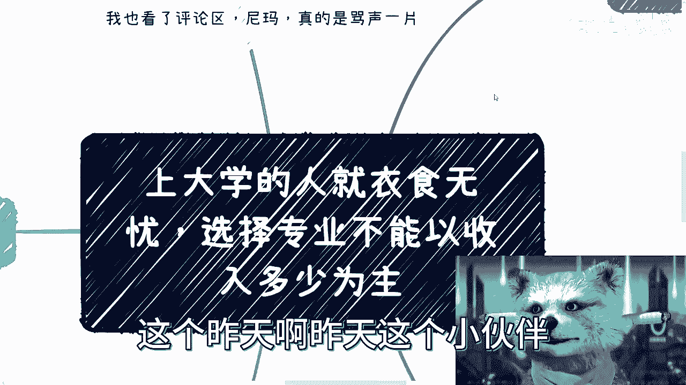

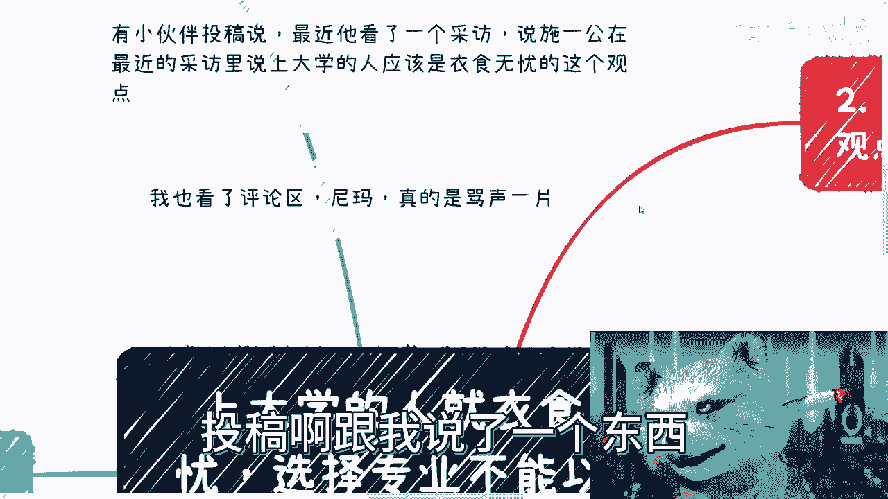

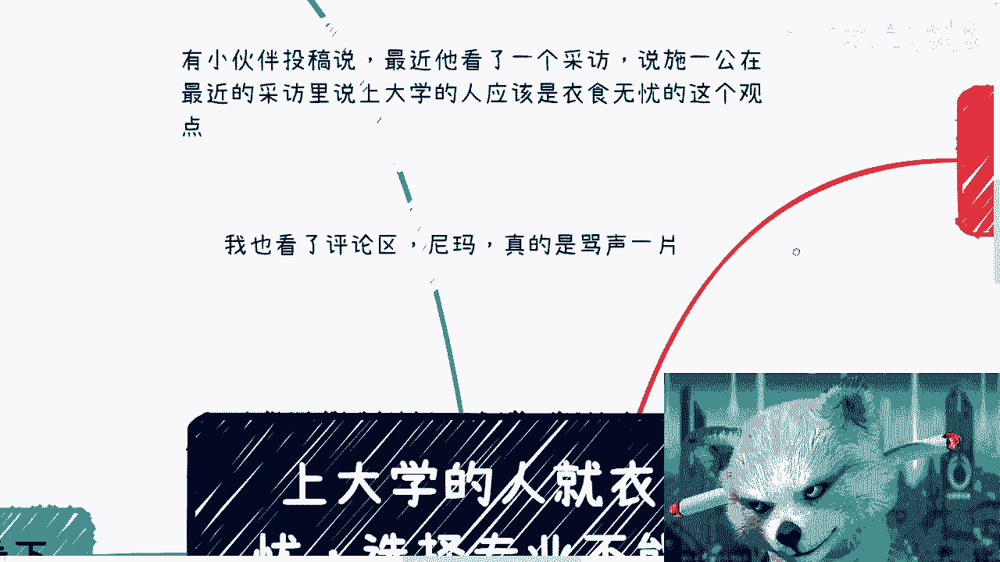

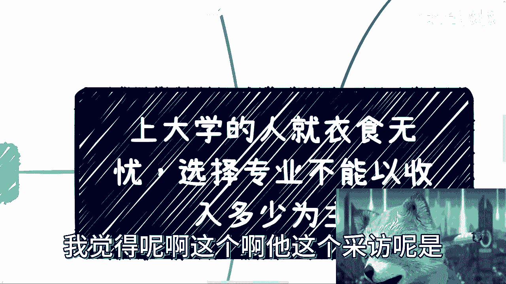

在本节课中，我们将一起分析一个近期引发热议的观点：“上大学的人应该都是衣食无忧的，选择专业不能以收入多少为主”。我们将梳理其背景、核心论点，并从多个角度进行探讨，帮助初学者理解这一复杂的社会议题。

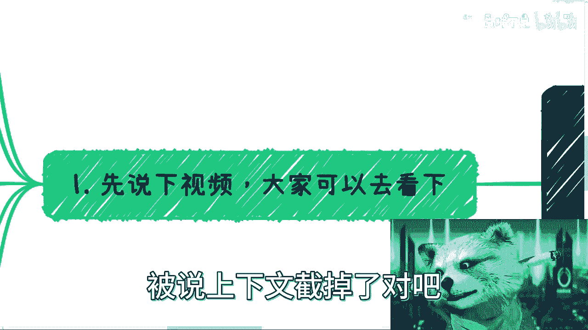

---

## 背景介绍

昨天，一位小伙伴投稿提及一个采访。施一公在俞敏洪的采访中表示，上大学的人默认是衣食无忧的，选择专业不能以收入多少为主。

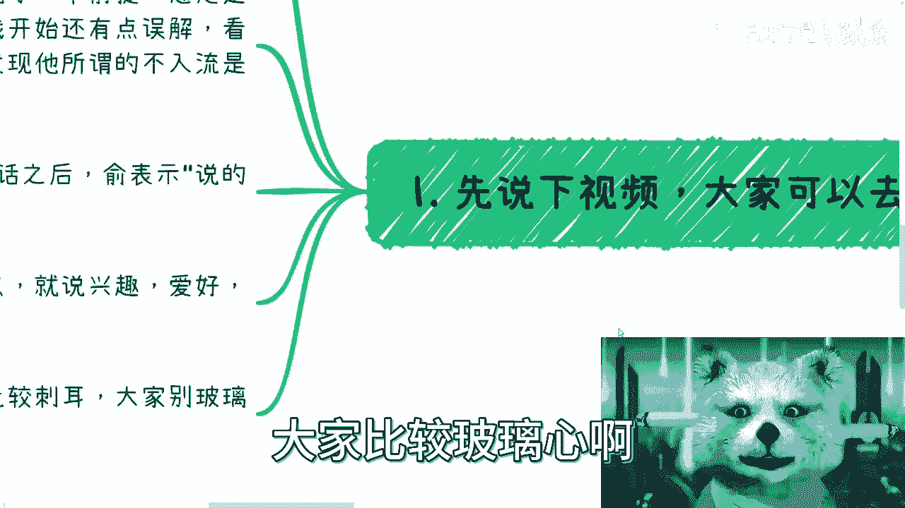

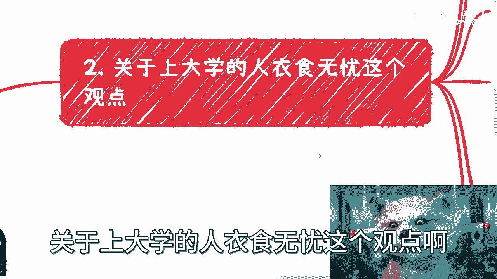

我查看了视频和评论区，发现批评声音很多。为了避免断章取义，我仔细观看了相关片段。俞敏洪在采访中表达了几个重点。

施一公在表达观点前有一个前提，他认为自己的观点可能“不太入流”。这里需要澄清，他指的是“选专业不能以钱为主”这个观点不入流，而非“衣食无忧”这个观点不入流。这是第一个重点。

第二个重点是，施一公说完后，俞敏洪立即表示“说得非常对”。第三个重点是，施一公随后阐述了他看重的点：大学生选择专业或未来方向，应以兴趣和爱好为最高优先级，并着眼于未来能改变世界或为行业做出贡献。

---

## 关于“上大学的人衣食无忧”的观点分析

上一节我们介绍了采访的背景和核心论点。本节中，我们来具体分析“上大学的人衣食无忧”这一观点。

首先，这个观点与大众认知存在巨大冲突。相信大部分普通人都有自己的结论：上大学怎么可能人人都衣食无忧？这听起来像“何不食肉糜”，非常不接地气。

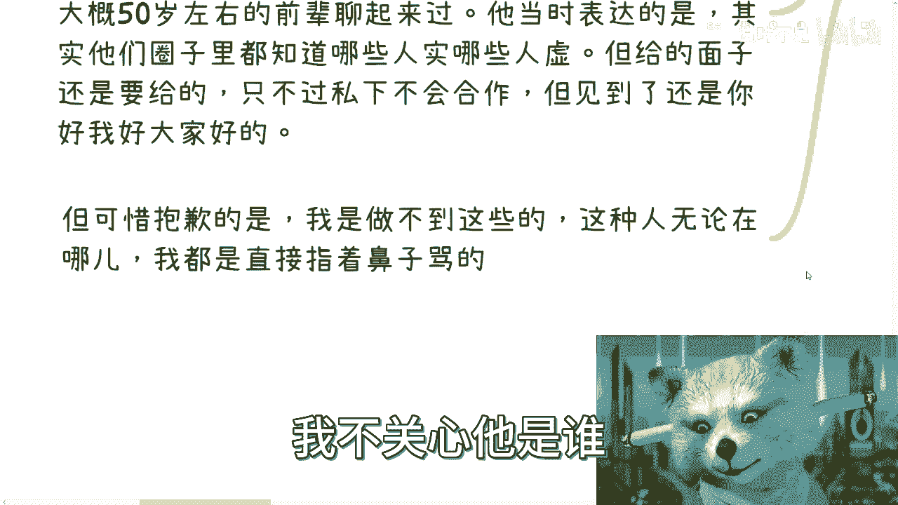

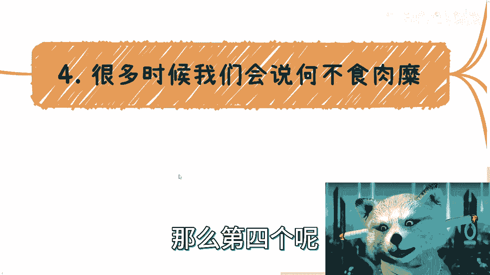

但我们需要思考一个问题：像施一公和俞敏洪这样有社会地位的人，为何会公开表达这样的观点？他们不可能不明白这句话的现实含义，也并非为了故意引战。这背后一定有他们的逻辑和认知基础。

现实情况是，大学校园里的学生经济状况差异极大。有申请助学贷款的，有家境优渥的“各种二代”，贫富差距确实存在。因此，“人人都衣食无忧”显然不符合事实。否则，“高考改变命运”的说法就失去了意义。

基于以上分析，我得出以下几种可能性：

以下是关于该观点产生原因的几种分析：

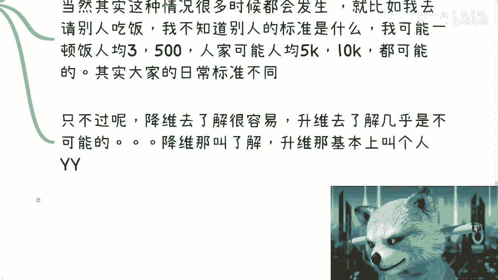

1.  **脱离一线，不接地气**：施一公可能脱离大学一线生活和专业领域太久，导致认知与现实脱节。但这种可能性我认为不大，因为即使脱离再久，简单了解一下现状也不会得出如此不现实的结论。
2.  **观点主语并非“普通人”**：从施一公后续强调“兴趣”、“改变世界”等观点来看，他的主语很可能特指“人才”。这里的人才，一方面指清华、北大等顶尖学府的学生；另一方面指那些有资源、有关系的人。只有这些群体，才有资本依据爱好和理想去选择专业。对于普通家庭的学生而言，生存压力往往是首要考虑因素。一个有趣的现象是，通常越好的学校学费越低，反之亦然。这在一定程度上反映了社会对“人才”的一种筛选逻辑：**学费 ≈ 人才筛选器（社会面视角）**。
3.  **“说得非常对”背后的社交逻辑**：关于俞敏洪的附和，我认为这反映了中国老一辈的一种常见社交习惯——“你好我好大家好”，不愿当面撕破脸。我曾与一位行业前辈交流，他坦言在他们圈子里，谁有真才实学，谁是江湖骗子，大家心知肚明，但表面上依然维持和气。我认为，这种“宽容”有时是对行业和后来者的不负责。当然，我尊重每个人选择处事方式的权利，但我也有坚持自己观点、不迎合的权利。
4.  **认知范围的差异（何不食肉糜）**：每个人的认知都受限于其所在的圈子和起点。施一公所处的圈子、看到的世界的“起点”和“天花板”，可能远高于普通人。他的“地气”和我们的“地气”定义完全不同。例如，日常消费标准可能天差地别。从高维度向低维度了解（降维）相对容易，但从低维度想象高维度（升维）则几乎不可能，后者更容易变成脱离实际的幻想（YY）。
5.  **观点需结合语境理解**：因此，很多时候换位思考，某些观点在其特定语境下可能没有毛病。不能一概而论地棒杀。这就好比之前我讨论“考研对大部分人没用”时引发的争议。从我的商业视角看，很多硕士学历并未带来显著的金钱回报，所以我得出“无用”的结论。而在另一些人YY的世界里，考研等同于改变命运和财务自由。如果我说“考研能改变世界”，反而会更受欢迎，但这只有两种可能：一是我身边全是考研成功的精英，看不到基本盘；二是我从事考研培训，利益相关。我所坚持的观点是：**一切公开表达的背后，本质都是生意**。除非表达者已财务自由或用爱发电，但这两类人往往也因脱离大众或商业现实而“不接地气”。

---

## 核心总结

本节课中，我们一起学习了如何剖析一个引发争议的社会观点。

我们首先还原了施一公“衣食无忧”论的采访背景和具体语境。随后，我们从大众认知、观点主语错位、社交逻辑、认知差异及观点背后的利益逻辑等多个维度进行了分析。

核心结论是：单纯从字面看，“上大学的人都衣食无忧”显然不符合事实。但理解这个观点，不能脱离发言者的特定身份、认知圈层和话语背后的潜在逻辑。**很多时候，公开言论 ≠ 普世真理，而是特定立场和认知范围的产物**。对于普通人，尤其是面临专业选择的学生而言，更需要结合自身实际的经济条件、兴趣和市场需求来做决策，而不是被任何单一的“高大上”观点所绑架。

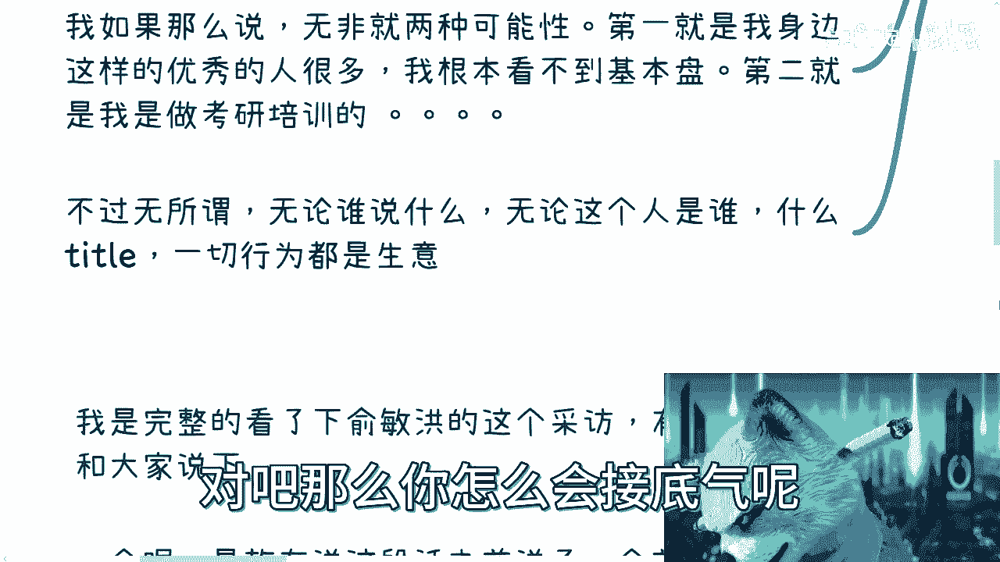

最终，认识到“人与人的差距，有时比人与猪的差距都大”，有助于我们更平和、更理性地看待各种不同的声音，并做出对自己最有利的选择。

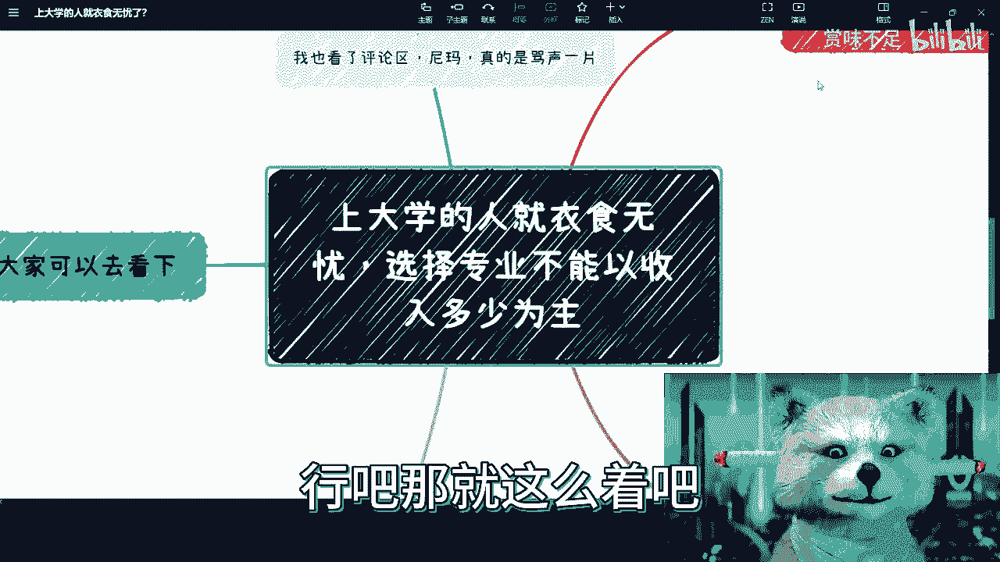

