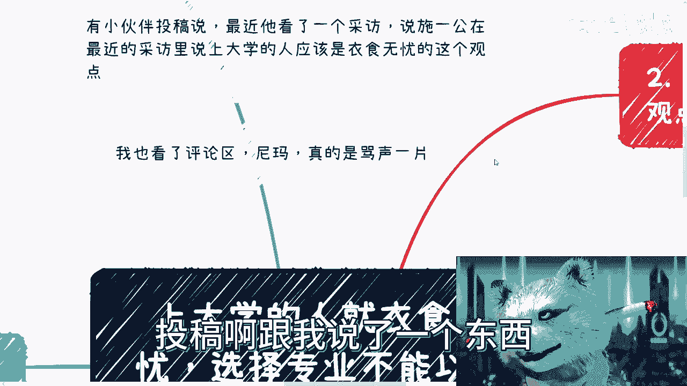
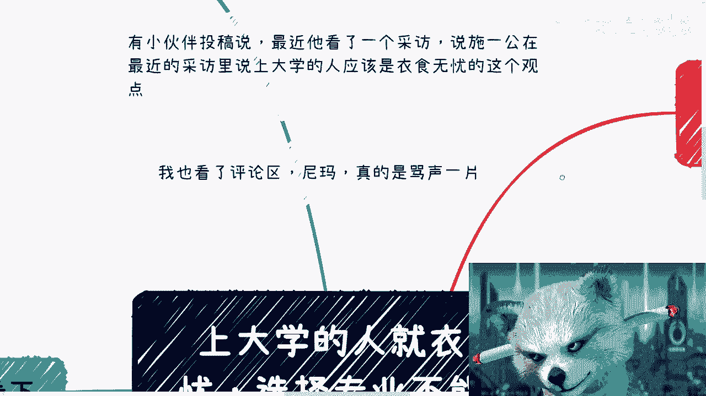
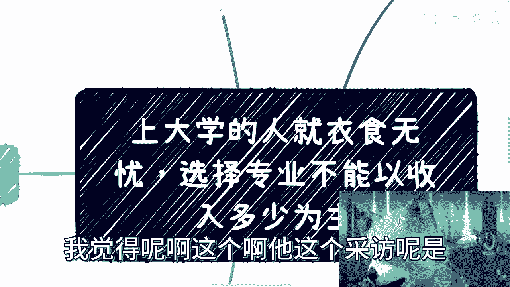
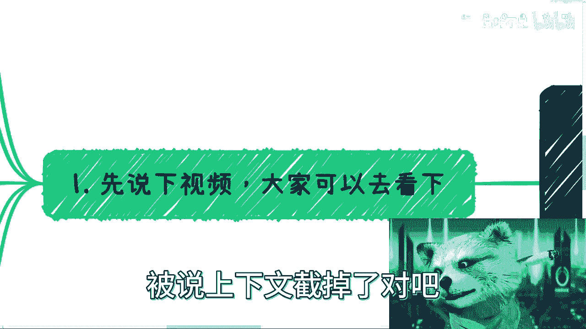
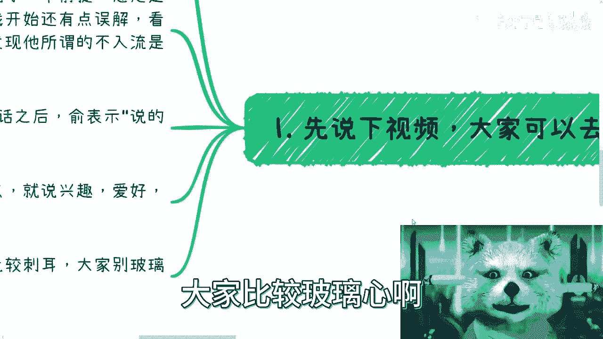
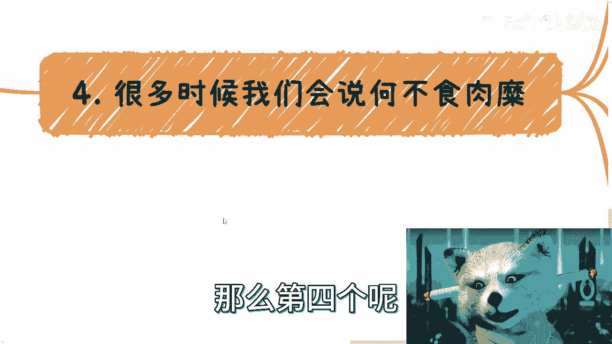
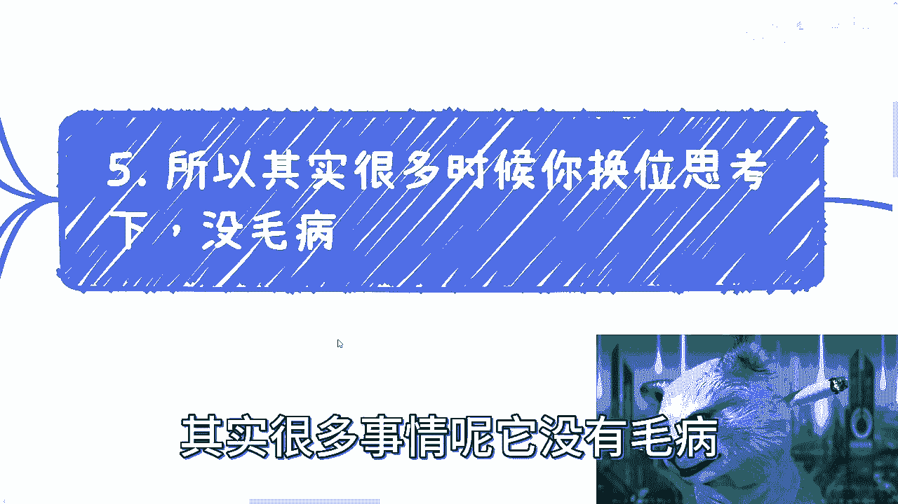
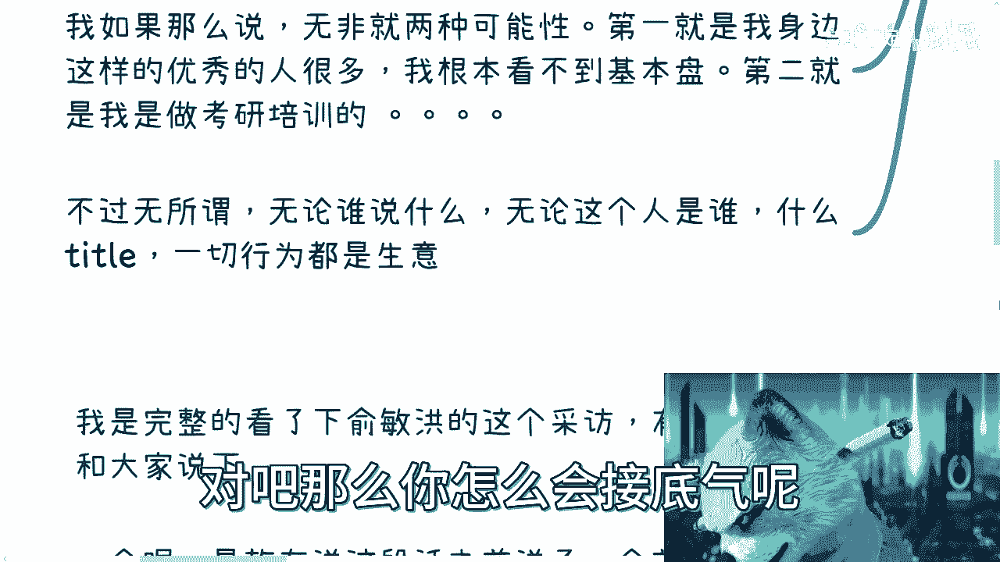

# 上大学的人衣食无忧？选专业要不要看未来钱多钱少？ - P1 - 赏味不足 - BV1vm4y1J7hR

好啊大家好啊，这个昨天啊。

昨天这个小伙伴，投稿啊跟我说了一个东西。

他说他最近看到个采访啊，说这个施一公啊，在最近的采访里说，上大学的人应该都是衣食无忧的啊。

然后我去看了一下视频啊，我看了一下评论区啊，一片骂声啊，一片骂声，我觉得呢啊这个啊他这个采访呢是啊。

俞敏洪啊这个做的一个采访，我们来看一下啊，他的整个观点是这样子，他说啊上大学的人呢啊它默认是衣食无忧的啊，选择专业呢不能以收入多少为主啊，这个是阴啊，这个是谷对吧，好先说一下视频对吧。

然后大家也可以去看一下啊，以免就是说单纯的这个啊，被上说上下文截掉了对吧。

看不到了啊，或者来说被误导了啊，我我呢也没有完整啊，我就是把他这段话完整的看了一下，就俞敏洪的这个采访啊，有几个重点，我跟大家说一下，一个呢是诗诗在说这句话之前呢，说了个前提啊，意思是什么呢。

说自己的观点可能是不太入流的啊，我开始以为我开始确实是觉得诶，他有点自知之明的啊，说不太入流的，我后来发现是我误解了啊，他说的不太路人的意思是什么呢，他说他的意思是他所谓的不入流。

是指选专业不能以钱为主这个观点，而不是说衣食无忧这个观点啊，那我觉得这是一个，那么第二个呢就是说暂时说完啊，当然了，这个也有可能是两个观点都是对吧，这个我觉得这个每个人看法不一样。

第二个呢就是说在诗说完这句话之后呢，这个语表示了说啊，说的非常对啊，这个是第二个重点啊，这个重点我待会也可以跟你们说的，第三个呢就是说诗接着啊，就是说师说了他几个他比较看重的这个点啊。

比如说这个大学生啊，选专业或者选择未来方向，应该是以爱好为优先级最高的啊，兴趣啊，爱好啊，然后就是说未来能够改变世界啊等等等，或者说啊或者说我觉得从他的话来讲，不代表不一定说改变世界。

但改变世界他原话啊，就可能他的意思就是说，不代表不一定仅仅是改变世界啊，就是就可以说啊这个你改变一些行业啊对吧，做出一些贡献啊，可以这么个意思啊。

啊注意啊，我接下来表述可能就比较刺耳啊，大家比较不利心啊。

呃这个是我说了一下大学的前提，那么接下来说一下关于上大学的人。

衣食无忧者观点啊，我觉得是这样子的呃，首先呢我觉得这个其实根本不用我说啊，就是我相信大部分的大众啊，普通人的大众基本上有自己的结论啊对吧，就是说怎么可能衣食无忧呢对吧，你这个就扯淡对吧，何不食肉糜是吧。

不接地气是吧等等等，我觉得呃也没毛病啊，也没毛病，但是呢你们有没有想过一个问题啊，就是湿对吧，会说出会说出这样的观点，包括俞敏洪在采访当中说出这么一个观点，我相信对吧，他一个脑子正常的人。

是不可能不明白这句话的具体含义的对吧，也就是说他不是无脑的去说这句话，或者说他不是为了故意引战去说这句话，他一定是有他的道理哦，那么你说现在大学里面对吧，有助学贷款啊对吧，包括各种二代啊啊。

包括就是说就是说嗯这个富的很富穷的嘛，的确也也也真的是穷啊，所以说呢我觉得在这个事情当中呢，就是的确这个差别是比较大的，我卡住了，我靠，哦好了，那么所以你看啊，就是说我知道了，我还真是卡住。

哎好了好了好了好了，现在好了，哎呦一下子好了，完了完了完了哎垃圾，那么那么也就是说啊，这个现在的确实不可能说，人人都这个衣食无忧的对吧，否则你说也不可能改变，大家都在说高考改变命运是吧。

就没有必要再去说这个话了啊，那么呃好，那么我们继续来说，那么，所以说呢根据这么一个结论啊，根据这么一个情况啊，我给出这么个结论啊，大家可以看一下，首先第一种可能性呢就是说啊。

我们说诗本身就脱离大学的一线生活太久对吧，那脱离大学的专业一线也太久，或者说不接地气对吧，当然这种可能性我觉得不大，那我觉得不大，因为脱不脱离并不重要，因为你就算脱离的太再久，你随便了解一下。

其实你都不可能说出这么个观点对吧，你就不现实，你是不是，那么这是第一个啊，然后孤儿呢我觉得产产出第二种结果可能性，第二种就是对诗来讲呢，他的观点主语其实并不是普通人，因为从他后面说的。

你比如说兴趣爱好啊对吧，改变世界啊等等观点来看，我觉得不难得出它的主语是什么，确实是人才哦，是人才，而不是普通人，因为这里的人才，我觉得一方面指的可能是清华北大对吧。

或者就类似于这种level的这么一些学校的人，而另外一方面呢其实就是说各种有关系，有资源的那些人啊，因为只有他们其实是可以根据自己的爱好，或者说去改变世界对吧，或者说去选择专业，我觉得普通人配吗。

不配唉，不好意思，真不配对吧，那我们说个有趣的现象，你会发现其实越好的学校学费是越低的啊，反之则相反对吧，那说明什么，你是不是人才啊，看学费啊，或者说我这个地方说，就是说从这个社会面啊，从社会面来讲。

你是不是人才看学费，看学费，那么第三个呢是这样子的啊，关于云说的这句非常对啊，这件这件事情我真的我深有感触，呃首先呢就是说我认为啊，这是中国的这个老一辈的通病啊，通病就是你好我好，大家好啊。

那么有的小伙伴要说了，他说驴老师就算你坐在那边对吧，他说你肯定也不能撕破脸，对我是不会撕破脸，我压根就不会选择这种，这很清楚的，因为你请一个人，他什么尿性，他什么三观，他什么观点，你应该是最知道的啊。

那么我跟大家说个故事啊，我刚刚毕业的时候遇见过很多所谓的教授呃，理论满天飞啊，就是各种忽悠对吧，就是纯纯忽悠去骗钱的啊，没有任何时间能力更惊艳，到今天为止还在骗啊，就套着各种学校的什么我在什么同济啊。

在什么地方，什么什么什么挂职教授这样子啊，就扯扯淡，然后呢偶然之间呢我跟一个同行啊，就差不多跟这个教授年纪差不多，就是45~50之间，应该四十八九吧，那个时候啊这个前辈聊过啊，他当时给我表达的很简单。

他说其实在他们的圈子当中，因为我属于后辈嘛对吧，就在他们圈子当中，其实哪些人虚，哪些人使他们是很清楚的，哪些人有有实力，哪些人就是出来忽悠的，他们也很清楚，但是呢给面子还是要给的。

就只不过就是说他们私下里不会合作啊，但是就是说如果见面了对吧，这个圈子里大家有有有机会碰到了，或者怎么样了，还是你好我好，大家好，我在这地方也提了一点啊，我说可惜抱歉的事，我做不到这些对吧。

就是我以我的三观对吧，就是你现在如果让我碰到他，我专业指着他鼻子骂我，不管我不关心他是谁。

我也不关心他有什么态度对吧，然后当时呢这个前辈跟我说完这个话呢，我就是跟他这么讲的，我说这些事儿啊，这不是靠我一个人能改变的，也不是靠你们能改变的，我知道你们也拉不下这个面子对吧，但是对我来讲呢。

我说你们的这种宽容也好，或者说叫做不撕破脸也好，其实是对所有人的不负责，或者对这个行业的人的不负责，当然了，你们也没有义务去负责对吧，但是我也有我也有我的权利，我也有我阐述我个人观点的权利对吧。

就是这么个情况啊，那么第四个呢。

那么很多时候我们会说何不食肉糜，对不对啊，我觉得这个事怎么说呢，是这样子的，的确不能一概而论啊，核心的原因呢是所有人啊，每一个不同的人，他们所在的圈子所看到的东西起点都不一样，那你就打比方诗对吧。

师他所看到的东西所带圈子，他起点肯定比我们高对吧，同时天花板也比我们高，也就是说所谓的整个区间这么一个range，都比我们高，甚至他的起点比我们的天花板都要高，对不对，你可以说大家对于地气的。

就大家其实对于这些地区的这个地气的，定义是不一样的，当然其实这种情况很多时候都会发生，就比如说我去请别人吃饭对吧，我不知道别人的标准对吧，我可能一顿饭人均比如说三五百啊，日常啊，打个比方。

那人家可能5100万，那就是你比如昨天晚上我去吃饭，就就就就基本上他们日常出去吃个饭，都是5100万的对吧，都有可能的，就是大家日常标准不一样对吧，就是说你不能说它不是肉糜对吧，就大家的这个这个对吧。

就这个range不一样对吧，只不过呢就是说我觉得啊，只不过呢就是说他站在一个高纬度的时候，他降维去了解其实是很容易的，但是你站在一个低维度的时候，你要去升维去了解，几乎是不可能的对啊。

几乎是没有概率的哦，所以说降维呢我觉得那叫了解，升维呢那基本上就叫YY啊，基本上就是意淫。

好那么这里呢我觉得第五点就是，所以说呢其实很多时候你换位思考一下，其实很多事情呢他没有毛病。

就你不能一棒一棒子说这个东西怎么样，觉得他没有毛病，你知道什么意思呢，就记得我之前说考研没用，知道吧，那一期啊就为什么很多人来喷我，就是因为他们认为我不接地气，就是因为他们觉得。

我一棒子打死了所有的考研的人，或者我我虽然标题写大部分啊，但他们会觉得大部分也触动了他们的玻璃心，对吧，觉得考我觉得我说考研没有用，但你说从我的角度来讲，我之所以说考研没有用的原因。

并不是仅仅因为考研这件事情没有用，而是很多人考出来他也不赚钱，或者硕士这个学历给他带不来钱，那你告诉我有什么用呢对吧，那你从我的所在的这个层面，所在的商业，我的确没有看到带了很多钱啊。

而他们觉得会带来很多钱，只是YY呀，对不了，那大家标准不一样，你比如说这个时候就会出现一个很有趣的现象，对吧，就是我呢是为大家去考虑的，希望大家多去接触社会，多去接触商业啊。

但是呢你会发现普罗大众是不买账的，为什么，因为普罗大众是活在它们YY的那个世界里面，那他们YY的世界是什么呢，就是必须要跟师对吧，或者这一类人或者这种教授一样，就是说我必须要跟他这种一样说说什么呢。

爱考研好，考研能改变世界对吧，符合大众兴趣爱好啊，能能能能能让大家这个财务自由对吧，你必须这么讲啊，能改变命运啊，他们不要太开心啊对吧，我我敢打赌，我但凡这么说了，也会有人来说啊。

这个这个驴老师你不接地气，这种话你都说得出来对吧，但是你会发现，评论区的比例一定是喜欢我的人多，为什么，因为他们就喜欢那些让他们觉得，活在他们的世界里面，YY的这些东西的这种话最好听对吧。

那么我如果那么说，无非如果哪一天我那么说，无非只有两种可能性，第一种就是我身边这样的优秀人很多，我根本就看不到基本盘，就是我看到的都是考研之后飞升天的，哎，不是升天的，飞升的对吧，就就很有钱。

财务自由对吧，各种各种各样对吧，那我看不到基本盘，我可能会这么讲，第二种就是什么，就是我是做考研培训，跟我利益相关没了呀，那我我我有还有什么可能性，我会这么说呢，不可能的，对不对，所以说所以说对我来讲。

我的本我所一直以来从我毕业开始，一直以来所坚持的这个点就是什么，就是无所谓，无论谁说什么，无论这个人是谁，无论什么开拓一切的行为，其实都是生意，就是你不用去管他，今天说的对也好，说的不对也好。

接地气也好，不接地气也好，这一切背后其实都是生意，除非是什么，你知道吗，除非就是说他要么财务自由，要么他用爱发电，但是我跟你们讲，但凡它背后不是神医啊，但凡背后啊就是完全的用爱发电。

其实他也很很难有流量，也就是说普罗大众也很难看到真正为他们好，或者说真正想就是就是财务自由的那类人，这两类人其实都很难看到啊，而且本质上来讲，就是无论是用爱发电还是财务自由，在我看来。

在很多观点或者很多事情上面，其实他们也是不接地气的对吧，因为他们因为因为你用爱发电，你不接这个商业的底气，不接这个世界本质的底气，你财务自由，你就已经完全脱离了这个普通老百姓对吧。

那么你怎么会接地气呢是吧。

所以说呢我觉得本质上呢就是你说啊，单纯说这个观点对不对，那肯定是不对的啊，但是哎我我简单思考了一下，我觉得嗯怎么说呢，可以理解啊，可以理解，就只能这么讲，哎呀怎么说呢。

真的人与人的差距比人与猪的差距都大嘛对吧，就只能这么讲，好吧行吧。

