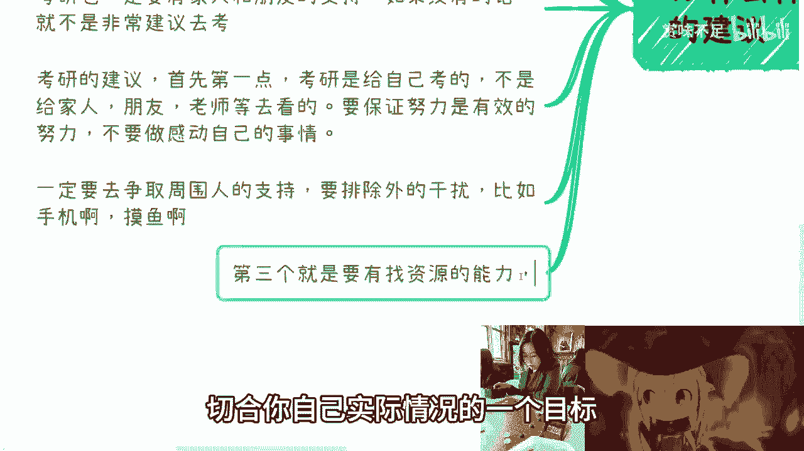
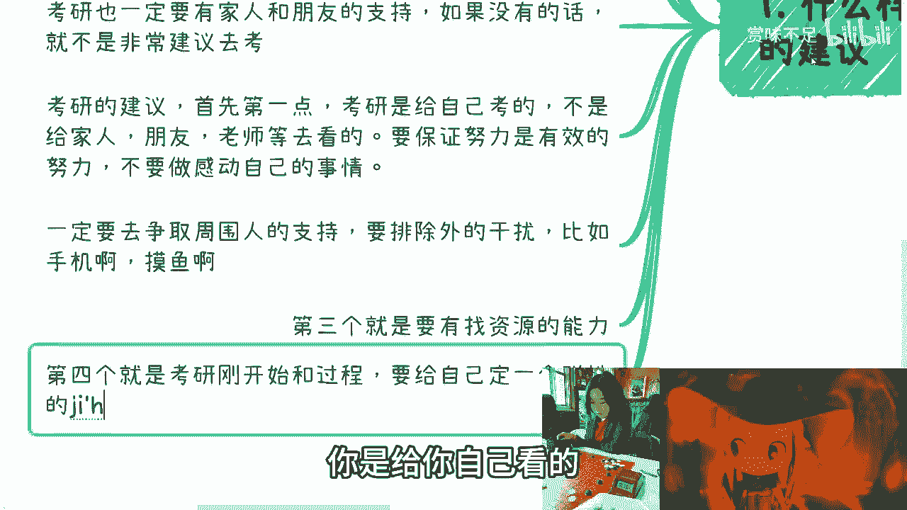
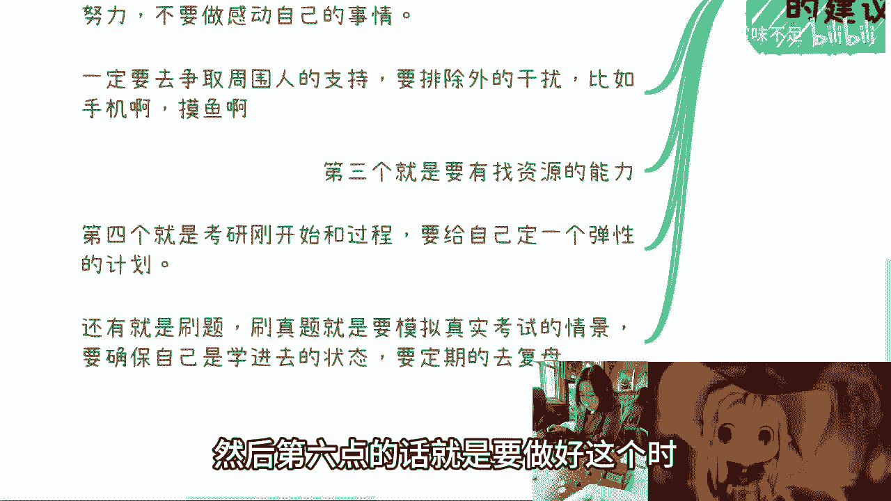
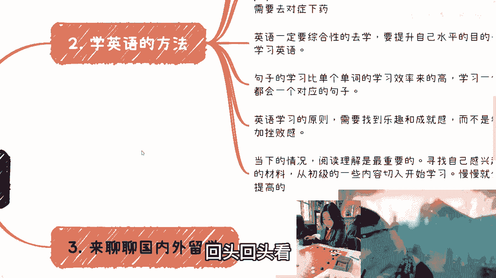

# 课程一：考研规划与高效学习法 🎓

在本节课中，我们将学习如何理性规划考研，并掌握高效的学习方法。课程内容基于一位上海交通大学硕士（英语专业八级）的经验分享，涵盖了考研的动机分析、备考策略以及心态调整。

## 概述

考研是许多学生面临的重要选择。本节课程将帮助你理清考研动机，并提供切实可行的备考建议，确保你的努力是有效且高效的。

## 谁适合考研？

在决定是否考研前，你需要明确自己是否属于适合的人群。以下是几种适合考研的情况：

1.  **目标明确型**：你清楚地知道考研是为了获得更高平台，以实现特定的职业规划。考研只是你人生规划中的一个过程。
2.  **专业必需型**：你所处的行业（如医学）对学历有硬性要求，不考研会影响未来就业。
3.  **跨专业转型型**：你对本科专业不感兴趣或学不来，希望通过考研系统学习新专业，为未来就业铺路。前提是你对自己的学习能力和方法已有信心。
4.  **环境支持型**：你拥有来自家庭或周围人的支持，能提供一个安心备考的环境。考研战线长，缺乏支持容易半途而废。

如果你不属于以上情况，或者对考研把握低于50%，建议一边找工作一边备考，不必孤注一掷。

## 给考研人的七点建议

明确了目标后，有效的备考策略至关重要。以下是七条核心建议：

1.  **确保“有效努力”**：考研是选拔性考试，比的不是投入时间的多少，而是对知识掌握的熟练程度。要确保你的每一分努力都真正转化为考场上的得分能力，避免“自我感动式”的无效学习。找到适合自己的方法，不必盲从他人。
2.  **争取环境支持**：主动争取家人、伴侣等重要人物的理解与支持，排除大部分干扰。例如，可以协商好定时查看手机、每周固定休息时间等，而非完全断绝联系。
3.  **培养信息搜集能力**：在依赖他人前，先靠自己搜集信息。你需要主动了解目标院校、专业的历年分数线、报录比等情况，以此制定符合自身实际的目标。
4.  **制定弹性计划**：备考初期就应制定计划，但这个计划必须是弹性的、可调整的。计划是给自己看的，可以从宏观目标拆解到月、周、日任务。如果某天计划被打乱，不必崩溃，灵活调整即可。每完成一项就打勾，积累成就感。
5.  **通过刷题量化成果**：备考离不开刷题，尤其是真题模拟。这能将你的学习成果量化，确保知识真正内化，而非“看过即忘”。要清楚自己每天学到了什么，并能应用于考场。
6.  **做好时间、精力和心态准备**：
    *   **时间**：考研（12月底）可能与学校论文开题、实习等冲突，需提前半年有所规划，避免事务堆积。
    *   **心态**：备考期间可能看到同学拿到好工作，如果容易受影响，可以暂时关闭朋友圈、卸载社交媒体。
    *   **精力**：保持健康，该放松时放松，学习时高效投入。学习时长因人而异，跨考或难度大需尽早开始。
7.  **利用高效学习工具**：强烈推荐使用 **ANKI** 这类卡片记忆软件。将知识点制成卡片，利用排队、睡前等碎片时间反复记忆。也可将背诵内容录成音频，随时听记。这些方法能显著提高学习效率。

## 如何判断自己的学习能力？

你对自己学习能力和方法的信心，源于日常学习的反馈。例如，学习新知识一段时间后，你能否通过考试检验，或是否有条理地向同学讲解清楚。你应能判断自己是表面理解还是深度掌握。平时在班级或专业中的排名也是一个参考。

---

上一节我们探讨了考研的整体规划与备考策略，接下来我们将目光转向另一个关键技能——英语学习。

# 课程二：高效英语学习法与原则 🗣️

在本节课中，我们将拆解英语学习的底层逻辑，分享以提升实际应用能力为目标的高效方法，帮助你将英语转化为终身受益的工具。

## 概述

学习英语需要明确目的、讲究方法。本节课程将引导你避免“一把抓”的误区，通过建立正确观念和学习原则，实现英语水平的实质性提升。

## 明确学习目的与底层逻辑

首先，要搞清楚你学英语的**目的**是什么？是为了通过四六级考试、进行科研阅读、备考雅思托福出国，还是为了无障碍获取国外信息、娱乐？

英语是一个**工具**，学习时应根据你的使用需求来制定目标。除非你确定未来完全用不到英语，否则建议以**提升综合英语水平**为目的去学习，而非仅仅死磕应试内容。当你综合能力提高后，通过各类考试将是水到渠成的事。设定一个“N+1”的更高目标，在攻克它的过程中，“N”级目标自然就被达成了。

## 建立核心学习观念

开始具体学习前，需树立一个核心观念：**结合具体场景学习**。

许多人喜欢争分夺秒背单词，但到了考场却想不起意思。这是因为脱离语境的记忆是低效的。例如，记单词时要结合例句，了解其固定搭配和使用场景。虽然初期看似麻烦，但事半功倍。可以使用 **ANKI**，将单词和例句一起制成卡片，记忆时脑中会形成画面，有助于同时记住词义、用法和词性。

## 遵循关键学习原则

英语学习应像打游戏，要找到**乐趣和成就感**，避免枯燥和挫败感。

*   **选择感兴趣的材料**：材料的选择权在你手中。不必强迫自己看公认好但你不喜欢的材料（如《老友记》）。选择你真正热爱、愿意反复观看/阅读的材料（如《摩登家庭》、《权力的游戏》）。
*   **遵循“N+1”难度原则**：材料的难度应略高于你当前水平（N）。如果材料生词太多、语法过难（远超N+1），就应放弃。确保材料是你喜欢的，且通过学习能感受到进步，这样才能长期坚持，将英语学习变为一个有乐趣的习惯。

## 阅读理解专项提升

对于当代人，**阅读理解能力**至关重要，它能保证你直接获取一手信息，避免被翻译误导。

提升阅读理解的方法就是**大量阅读**。选择你感兴趣的、难度适中的材料。如果水平一般，可以从简单生动的小说（如《谁动了我的奶酪》/“Who Moved My Cheese”）开始。之后可以看《经济学人》等刊物中关于中国的报道，这更容易理解，也能提供观察中国的新视角。

遇到长难句时不要慌，关键是**找到主句和核心动词**，抓住主要意思。通过持续积累和练习，分析长难句的能力自然会提高。

---

掌握了学习方法后，我们再来审视另一个常见的人生选择——留学。

# 课程三：留学决策与适应性评估 🌍

在本节课中，我们将冷静分析留学的目的与成本，帮助你评估自己是否适合海外学习与生活，做出明智的决策。

## 概述

留学是一项重大的个人投资。本节课程将引导你理性思考留学的真实目的、评估投入产出比，并审视自身对陌生环境的适应能力。

## 明确留学目的

首先，要想清楚你留学**为了什么**。如果只是为了“水一个学历”、逃避工作或国内环境，那么必要性不大。你在国内找不到的答案，在国外通常也找不到。留学应该能为你带来除了学历之外的、认知或资源上的正向提升。

## 评估投入产出比

必须全面考虑留学的**成本**，包括经济开销、家庭支持等。要权衡这笔投资未来的回报率。切勿头脑发热，让家庭承受过重负担，否则学成归来若工作不理想，落差会很大。

## 评估环境适应能力

海外留学意味着人际环境的巨大变化，常常伴随强烈的**孤独感**。在当下的国际形势下，可能需要克服比国内更多的困难。你需要提前判断自己的适应能力：例如，过去在新环境中（如转学）能否快速融入？如果自觉无法忍受长期孤独、难以找到志同道合伙伴的状态，不建议留学，否则容易产生心理问题。

## 结合个人特殊情况

有些人因其性格或所在行业，可能的确更适合在国外发展。这需要结合自身情况具体分析。同时，可以关注一些有特殊政策的留学选择（如某些香港的一年制硕士项目），它们可能在落户、成本等方面具有很高的投入产出比。

---

最后，让我们从更广阔的视角，聊聊如何面对考研与就业的普遍性选择。

# 课程四：生涯选择的通用建议 💡

在本节课中，我们将探讨当面对考研、就业等重大选择感到迷茫时，如何通过信息搜集和自我分析，做出更适合自己的决策。

## 概述

当对未来方向感到模糊时，主动获取信息和与人交流是关键。本节课程提供在迷茫期进行有效探索的路径。

## 主动沟通，获取信息

如果你正处于大一大二的迷茫期，最有效的方法是**主动与过来人交流**。寻找大四学长学姐、已毕业的校友或通过老师介绍，与他们聊天，了解他们当初的选择、路径和现状。这比你日后“撞南墙”的成本低得多。通过交流，你可以找到参照，更清楚地认识自己想要的、适合的以及可能达到的目标。

## 理性看待“回头再考”

关于工作后是否要考非全日制研究生等问题，需要理性看待。有些行业（如医疗）学历对晋升确有帮助。但对于很多行业，你需要想清楚：投入时间、金钱和精力后，你**具体想得到什么**？这个目标是否真的能通过这个学历实现？切忌活在“有了文凭就能如何”的虚假幻想中。做决定前，务必先获取真实、具体的信息反馈。

## 总结

在本系列课程中，我们一起学习了：
1.  **考研规划**：分析了适合考研的人群，并提供了七条确保“有效努力”的备考建议。
2.  **英语学习**：明确了以应用为导向的学习目的，建立了结合场景、寻找乐趣的核心学习原则。
3.  **留学评估**：强调了明确目的、评估成本与适应能力在留学决策中的重要性。
4.  **生涯选择**：指出了在迷茫期通过主动沟通获取信息，并理性评估后续教育投入的必要性。

希望这些经验分享能帮助你更清晰、更坚定地走好未来的每一步。