# 上海交大硕士（英语专八）来谈考研和英语学习 - P1 - 赏味不足 - BV1ew411C7jU

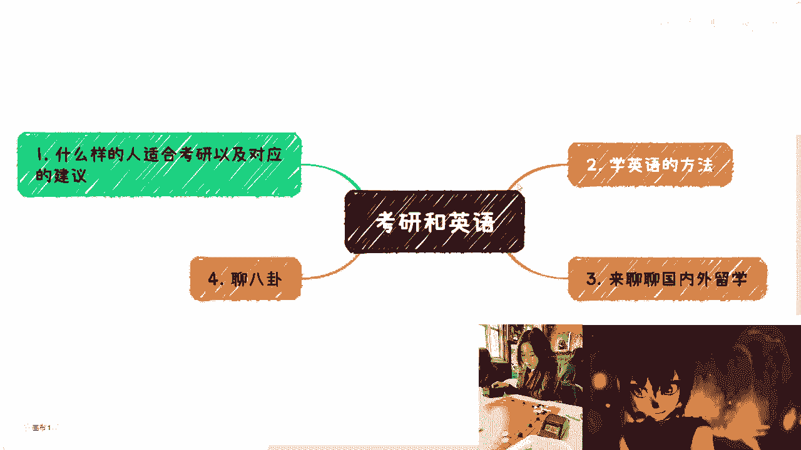

好那个欢迎大家欢迎大家，我们又时隔了很久啊，我们又再次找到了一位大佬啊，给我们来做相关的分享，那么这一次这个主题呢大家也看到了对吧，就是跟整个的一个这个大众都比较贴近啊，一个是考研啊，一个是英语。

那么呃本次我们邀请的呢，是上海交大的一名硕士啊，那么这个身份也比较多对吧，那个回头待会聊八卦的时候，我们可以在这个揭晓一部分的情况啊，呃来先打个招呼来哈喽哈喽。

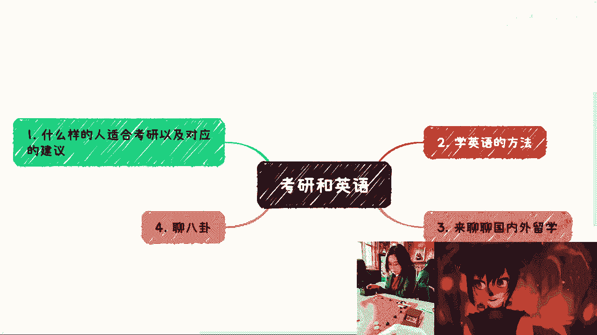

大家好，我是一只野生职业女棋手，嗯现在刚工作两年，然后我是高水平运动员特招进的本科，上海外国语大学国际政治专业，然后考过了英语专八和教师资格证，然后大四的时候跨专业考研考上了交大。

然后21年的时候刚刚硕士毕业呃，我曾经拿过全运会的两个项目银牌，和世界大学生围棋锦标赛的冠军啊，现在在国内的等级分排名大概是200多，在读书期间呢，我也做过很多很多的兼职，包括辅导员啊，围棋教练啊。

考研辅导啊，然后上海国际电影节的字幕翻译校对啊等等，就是今年6月份开始呢，在B站上做一些围棋的干货分享。

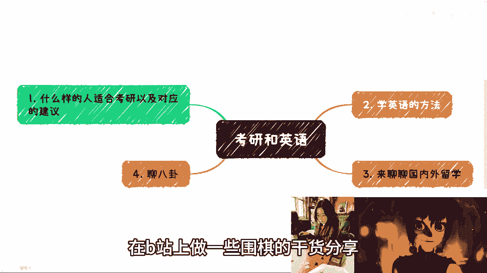

嗯基本上就这样，对大家有兴趣的可以去关注一下啊对吧。

我们可以看到啊。

就是一个主题来说，就是今年开始啊，这个大众啊，对于这个考研以及相关的这个呃，这个叫什么出国啊对吧，包括你说考公务员啊对吧等等等，反正有非常多的一些，有非常多的这么一个选择啊。

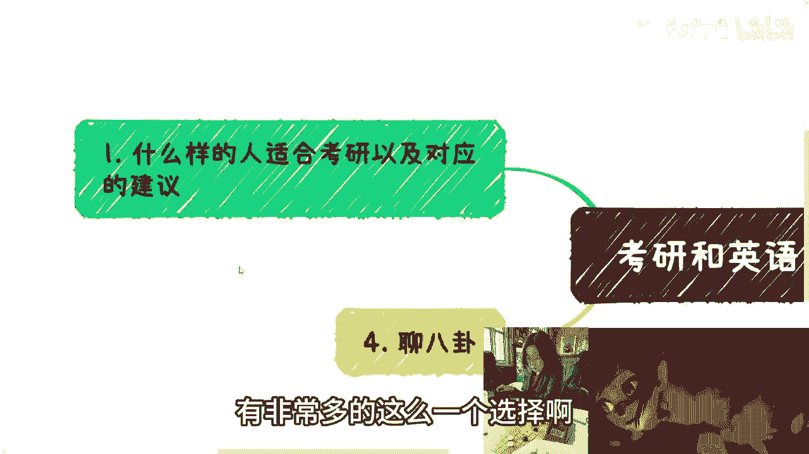

呃我们来正好来谈一下来聊一下啊，就是说怎么样的啊这么一个，比如说呃有没有比如说一些前提条件啊对吧，或者有没有哪些属性啊，或者怎么样的一些怎么样的性格啊对吧，就怎么样的这种人它比较适合去考研。

以及就是说如果他考研的话啊，这个从你的这个角度能给他有哪些建议。

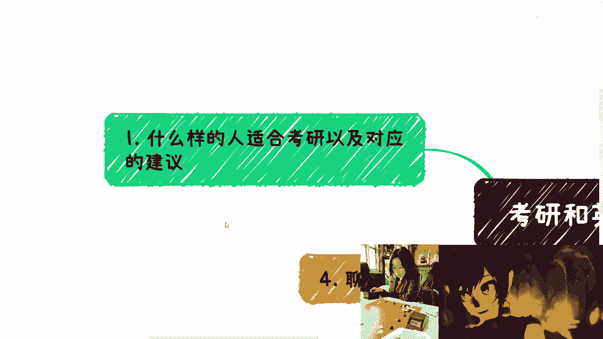

这样子嗯，好的嗯，首先非常感谢爽总给我这个机会，给大家做个简单的分享，就是我觉得考研的话，从整体上看呃，我当初考研其实是比较迷茫的一个状态，所以现在回过头来想是这样子的，就是考研吧。

最终最终就是一定要就是你要想清楚，你考研是为了啥，就是最终你还是要到社会上去就业的嘛，所以说你这个考研只是人生当中的一个过程，然后你要有一个清比较清晰的一个规划，就是如果说你考上了这个更高的呃。

这个学府或者哪哪一个专业去，你能够用这个更高的平台来做什么啊，你可以把它用来干嘛，就是就是你需要提前去想清楚的，如果你觉得你到了那里以后呃，只是为了混日子，然后就是混个学历，混个3年。

那我觉得就没有什么必要，然后就是有一些专业吧，我觉得他是必须要去考研的。

比如说就是医学呀什么的，就是呃如果说你不考研，可能你最终出来以后就业是会产生一些问题的，那这个东西就没有办法对吧，就硬着头皮只能也去考，然后还有一个呢就是呃就是想跨专业的同学，就是这个呢就是我的情况。

就是本身你读的这个专业，可能发现呃不管是由于高考各种原因也好，还是其他各个方面，就是不太感兴趣或者学不来也好，然后你进入了一个嗯，就是不太不太能够学得来的这个本科的4年，然后你想要去跨专业。

然后重新开始的话，就是走一个更加觉得自己，就是你本身对自己的一些学习的能力，已经是比较有信心了啊，学习方法也掌握了，但是你想要去对一个专业有一个全新啊，一个基础的认识。

然后方便你今后去找到适合自己的就业的工作，就是你本身是想往那个方向去努力的，那你就是可以去进行一个考研的，然后最后就是我觉得嗯。

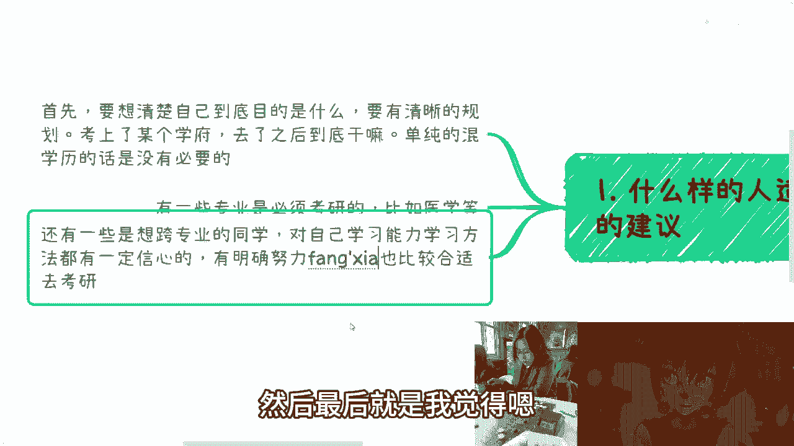

考研一定要有这个家里啊，或者你周围人对你的支持，是要有一个安心去考的环境，如果没有的话，如果没有的话。

我觉得还是别考了，是因为这个考研的时间特别的长，这战线很长，嗯整天在一种比较糟心的环境下。

就是会很大程度上影响你发挥，甚至你可能坚持不到考的那一天。

就直接就放弃了，所以那还不如一开始就直接去找工作。

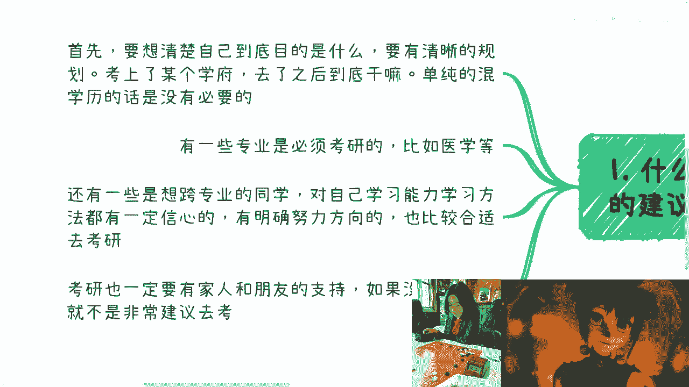

嗯基本上就是以上这些，然后给考研人的一些建议的话。

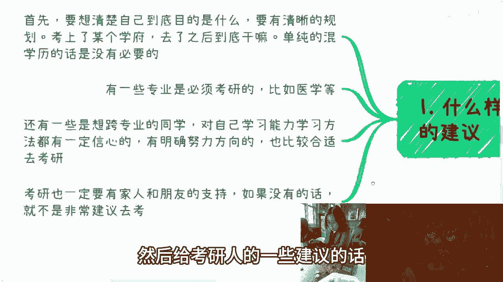

嗯是这样子的，就是首先啊第一点就是考研，你要搞清楚你考试考给你自己看的，不是说你整天坐在书桌前，然后努力给你的父母看，然后你就像苦行僧一样对吧，然后给你的老师看。

给你同学看哦，你好努力啊，就坐在那每天看很多的书，而不是这样子的，所以你一定要确保你花出的每一分的力气。

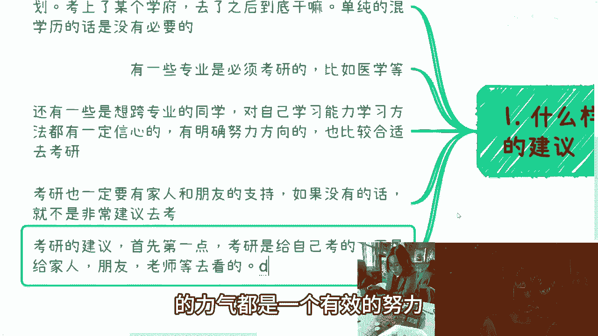

都是一个有效的努力，我们暂且不说你这个努力是多么的高效，你起码保证这个努力是有效的，而不是整天就是在那摸鱼的，就是不要做一些感动自己的事情，就是好，这本身是毫无意义的是嗯。

比如说你去网络上搜哪些考研的方法对吧，就海量的资源都有，但是你一定要去找到哪一个方法，适合你自己就行，你不要去听别人说这个一定是有用的，那个一定有用，怎么样，就是你其实各个方法都可以混合在自己身上。

哪个有用你就去用哪个就好了，这就是你要搞清楚，考研它本身是一个选拔性的考试。

它并不在于你比较谁的时间和精力花了多少，花的多的人就能够胜出，而是你比考同一个专业的人，就比这些竞争者，你更加熟练地掌握了，这些其实都是差不多的一些知识点的，所以这个有效的努力特别特别重要。

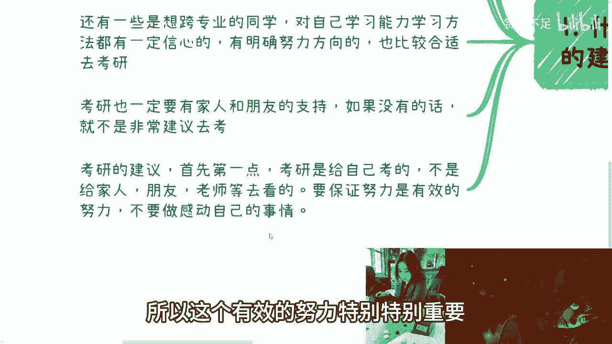

也是我觉得最最重要的一点，我自己当时就是其实我是挺懒的，然后我每天都会睡到90点钟才起床，然后很悠哉悠哉的，然后再去食堂吃个饭，但是我是属于就是晚上会比较努力一些，所以我就是晚上会闭馆。

就是到图书馆闭馆的时候，然后才出来，然后回到宿舍以后继续背，然后睡得比较晚，这样子就是反正怎么样适合自己的一个作息，比较呃放松的一个状态去学习，尤其是刚开始的时候就不要特别苦大仇深的样，这是第一点。

然后嗯第二点的话。

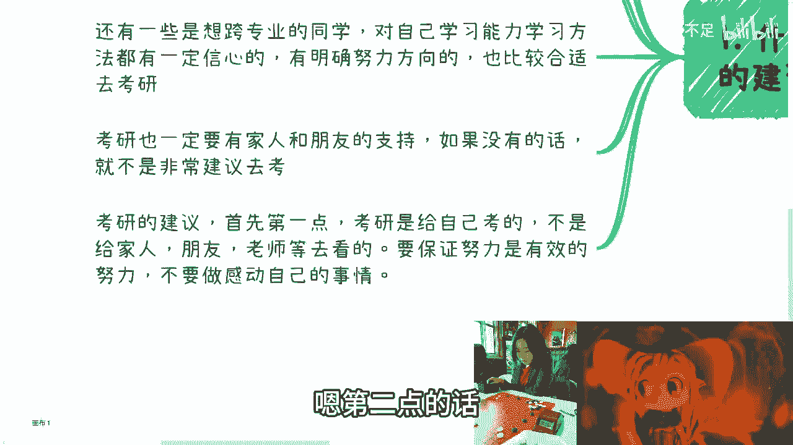

我觉得就是刚刚也提到了一点点，就是一定要去争取周围重要的人呃，有影响对你是会有影响的人的支持，你一定要去排除大部分的干扰项，就就比如说嗯，比如说手机这个这个学习路上的，这个万恶之源吧。

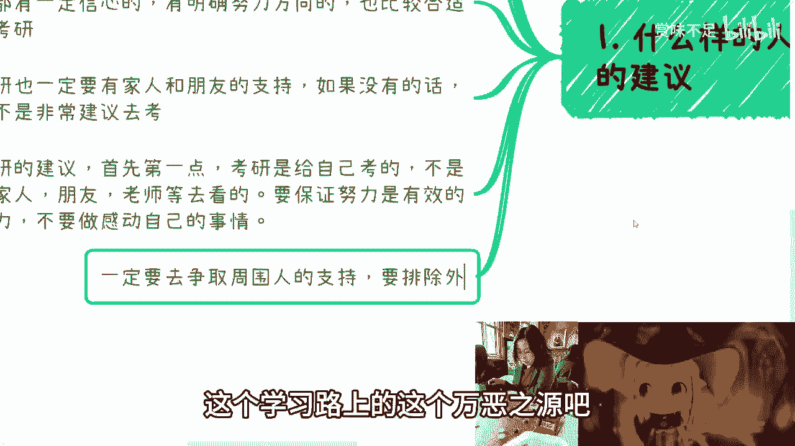

嗯嗯我当时考研的时候也在谈恋爱，然后但是我当时嗯就是他也特别的支持我嘛。

就是也希望我能够完成我的梦想，所以我们就是约好的，就是平时他也能够理解我把手机就是锁起来，就是不看的状态，然后每周会一天，然后出来，然后跟他一起去玩，就是我觉得这些事情，都不是说你非A即B的那种。

你关键是要去争取他们的理解和支持，而不是说我就一定要就这段时间，就是就就就完全，完完全全就跟所有人断了联系啊，或者怎么样，我觉得这个没有必要啊，嗯然后还有就是跟家里人一定要说说一下。

就是防止就是找不到人的情况，嗯就是把这种手机锁起来的方式，我觉得还是蛮有效果的，嗯对然后这个是第二点吧，然后第三点我觉得就是嗯就是要有这个学会。

找资源的这种能力，就是我当时我之前也做过一，一年多还是两年的考研的辅导，然后我就发现有一个很大的问题是。

来咨询我的时候，就我一问他，他就基本上就是一问三不知的状态，是他不知道他要考的这个学校，专业的一个过去几年的一个情况，他去哪里去找一些相关的资源，也是完全就搞不清。

就好像他就是完全就是要找一个抱住大腿一样，然后就所有的信息，好像都想要从别人的嘴巴里指导。

嗯其实这个东西只能是先去靠自己的，就是你要去了解你要考的目标，院校的这个分数线，然后过去几年的一个报录比。

然后你才能够定下来，契合你自己实际情况的一个目标好。

然后这个是第三点对吧，嗯第四点就是我觉得在考研的刚开始，还有包括整个考研的过程当中，写一个计划是很重要的事情，这个计划呢不是说你今天定下来就好了。

接下来就后面一定要照着执行，而是一个很具有弹性的计划。

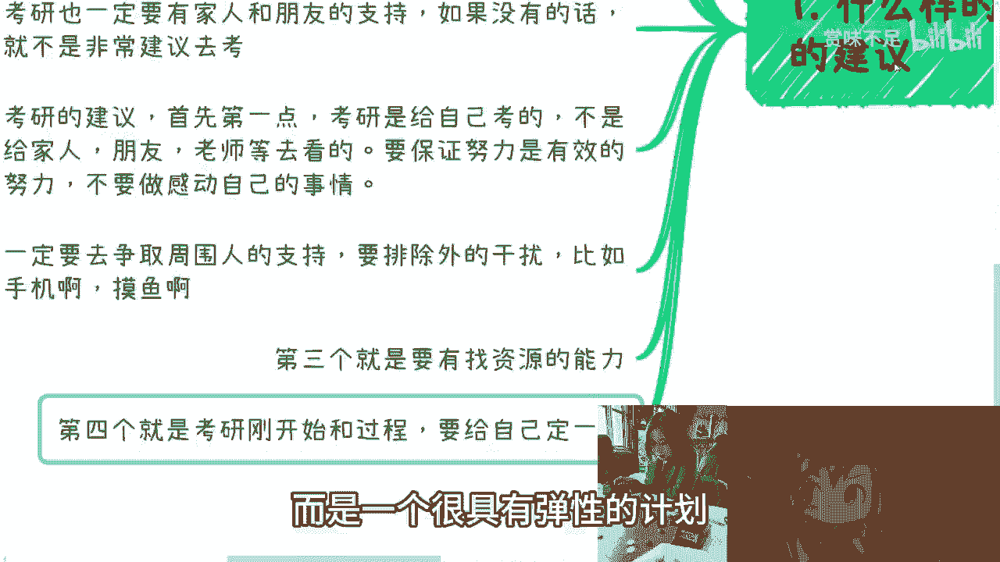

随时都可以进行改动，你首先要清楚这个计划，你只是你是给你自己看的。

你又不用给任何人看，对不对，所以你就可以多尝试各种的方法，然后你就先把一个大概的脉络写清楚，比如说呃整体你要达到一个什么样的目标，然后你需要在几月份之前完成什么，然后再把它拆解为每周需要完成什么。

然后最后再落到一个每天的情况，就是你对一个进度条的，大概你是要有一个掌控的，但是具体进度条怎么去推，是具有一个弹性的，包括你哪怕每天去改计划，我觉得都可以，就是比如说比如说你当天你定的计划是。

你要七点钟起床，对不对，然后结果你醒过来的时候，发现这时候已经八点了，而很多人包括我周围遇到的，当时一些考研的同学，都会处于一种很崩溃的状态，觉得这一天就废了就完蛋了，但其实没关系的呀。

就是你就继续起床，该干嘛就继续推进你的计划，完不成就完不成对吧，其实这个时候你要反过来想，你就有了更多的一个经历，然后去完成这个计划，你比如说你今天可以稍微晚一点点的睡，因为你晚一点起了嘛。

然后如果说实在不行的话，你就稍微周日你休息的那一天，稍微再花一点点时间，回过头来把这个计划去补上就好了，呃，就是嗯你要保证你这个计划是能够，大部分的情况下是能够照着去推进，然后呃推进的时候。

比如说你然后每完成一项，然后就去打勾，然后这本身就是一件挺有成就感的事情吧，嗯这说到第四个了对吧，然后第五个事情就是第五个事情。

就是考研肯定是要去刷题的。

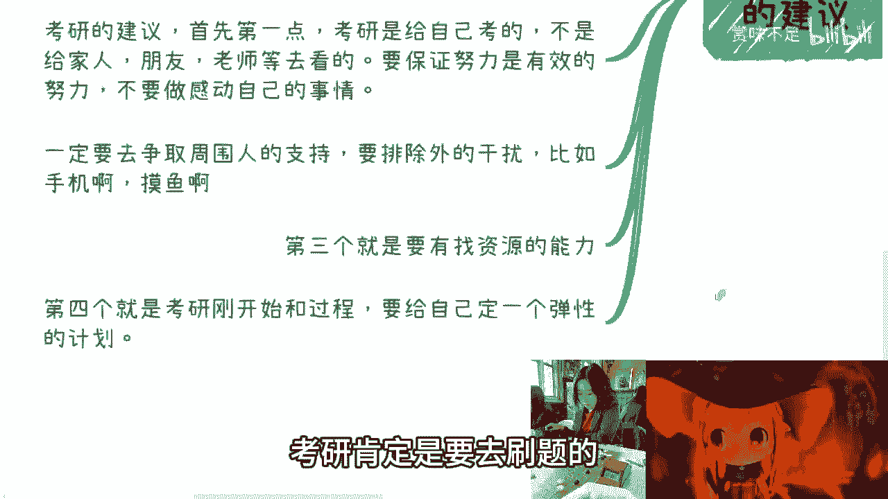

然后这是刷真题呢，要去模拟真实的这个场景，是真实的考试的这个情景呃。

你需要你需要把你的这些东西啊，就是你的这些努力的这些东西要去量化。

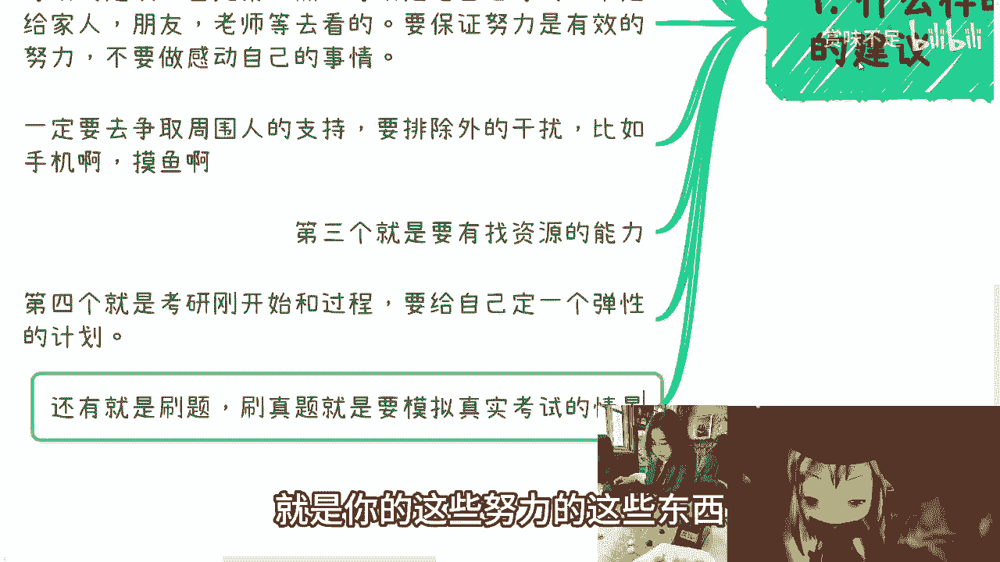

不是说我每天啊就在坐在那图书馆里，然后就在那看视频啊，今天看了什么什么多少的视频，然后看了几个小时，然后就过去了，就是有一个整体的，你要确保你自己是一个学进去的状态。

嗯就是要脑子里有一个这种复盘的这种意识吧，就是你要清楚你每天是学了多少东西，是你呃，是完完全全是化为了你自己，能够在考场上运用的出去的这个东西，而不是说就是就看过就算数，这是第五点。

然后第六点的话就是要做好这个时时间精力。

还有一个心态上的准备，嗯嗯大家都知道考研他是十二十二月月底，十二十二月的月底考对吧，然后我们当时是12月10几号的时候，才开题答辩，然后而且我是双专业，然后那段时间就周围考研的人就全都崩溃了。

就就就就周围就是每天都厕所都挤满了，哭的人，嗯然后而且那个时候还要完成社会实践啊，就是各种实习也都有要求，所以其实这种东西你是需要提前，比如说你提前半年就大概有个数。

然后你知道你比如说你大概11月份的时候，你就已经做好准备，不要到最后所有的事情全部都挤在一起，然后让你前面所有的付出的努力，然后打水漂，这就太亏了，然后还有就是我说心态上的准备吧，就是比如说你这段时间。

你一定会看到你周围的同学拿到了嗯，你很心动的那种offer啊，或者说他们参加的什么什么活动呀，如果说你跟我一样是比较禁不住诱惑的，凡人的话，我是建议索性把这种各种嗯，比如说朋友圈关掉啊。

然后微博这种地方就卸载掉啊，都是可以的，然后还有一个就是呃精力上的准备的话，就是你一定要保证自己是一个非常健康的状态，就该放松的时候还是要放松啊，然后只要你回来到学习的那一刻，你能够高效的去投入就行了。

就是就是你不要去坐在那里对吧，然后就一边想着我好想出去玩啊，然后一边就在那里，然后就装模作样在那看个书，那你还不如索性出去玩个几个小时，你回来再好好学对吧，学的时候你就专心学，不要去想任何其他的事情。

然后时间上的准备的话，就是因为整个考研是一个战线很长的事情，我们当时大部分人准备考研都是半年，包括我自己也是7月份才开始准备的，所以这个就是需要分呃，分各种情况，你看你自己吧。

比如说你自己是跨专业考一个难度很高的嗯，那你就需要稍微早一点开始，然后你如果是考一个自己很擅长的那种本校，本专业啊，那你晚点开始就好了，反正这种就是自己去调配，没有说什么一定最适合或者怎么样怎么样嗯。

然后最后一个就是最后一个，就是我觉得比较重要的，就是嗯，就是学习方法上能够给到大家的一个建议，就是呃是一些嗯一些比较好用的，一些碎片的方法吧，我只能说是就是呃我非常推荐一个app叫ANK呃。

就是ANKIANK，然后它是以一种卡片的形式，我觉得这个在任何的一个一个科目上都可以用，政治也好，英语也好，专业课也好，全都可以用到这个APP，然后你就是需要呃，先去理解你要考的那些知识点。

其实考的东西都是那些每年都是差不多那些，然后你去了解理解了以后，然后再把这些知识点，然后录到这个卡片上，然后你就可以利用一切的时间去，我当时就是比如说我排队吃饭，然后很无聊的上厕所的时候。

然后或者包括我睡觉前，都会把这个就是AK拿出来，然后刷一刷呃，这个这个过程就是还挺爽的，就像这个游戏通关一样的感觉，然后包括我会把自己需要一些背诵的东西，包括英语啊也好，专业课也好。

就是录到手机上就变成录音的形式，然后走路听，然后上厕所也听，然后睡觉前，然后就当催眠一样，听着听着，然后就睡过去了，就就是反正这种高效的方式吧，就是可以自己去找，但是我身边用过这个的人都说还挺好的。

包括我自己做考研辅导的时候，也是强烈推荐大家都用这个嗯，基本上就这些，OKOKOK这么多这么多讲太多了是吧好，那这个我们刚刚看到这个地方提到了叫什么啊，就是提到了这个对自己的这个学习能力。

和学习方法有一定信心的，就是就怎么个怎么个判断，这个学习能力和学习方法。

他自己有没有信心啊，啊就是就是你在平时学习的时候，自己肯定会有感觉啊，就是你学一个任何一个新的东西呃，都能够，比如说就是学了一段时间，是你能够比如说不管是你用考试来检验也好，或者说呃用一些其他方式。

比如说同学向你来问问题的时候，你是能够比较有脉络的，跟人家讲清楚的方式也好，就是你自己应该能感觉到，你自己是表面上会了这些知识，还是就是深度的去，真的是学会了这些东西，能够变成你自己的东西。

然后运用出来的，你自己应该是会大概有一个判断方式吧，然后包括你平时在班级里的排名啊，或者整个专业的排名啊，应该都会有概念吧，OK那那按照现在这个大部分这个情况，就是他也许觉得啊叫什么。

就是自己学习能力或学习方法不行，但是就是他也没什么别的选择，那那那那那是不是也就只能硬着头皮考，那倒不一定，真的不一定，如果没有那么有信心，或者说你事先觉得自己的把握，就低于50%的话。

我建议一边找工作一边去考啊。

没有必要吊死在一棵树上。

一边找工作一边考啊，对就是你一边投简历呀。

就是如果说你是真的很想去考，然后也呃就是目标比较清晰吧，然后你觉得不清晰，大部分都不清晰，那就是就是我觉得你剪的先投起来呀，就有合适的班先上着嗯，考研这个东西最后你也是为了要就业的嘛。

嗯你如果考研没考上，然后你又错过了秋招春招，那那最后不是很尴尬，你接下来一年干嘛对吧，一年一年旅游呀。

那那有钱旅游，也就应该不在我们的讨论范围里吧。

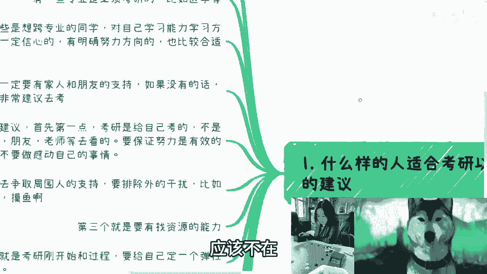

你要中间gap1年也可以呀。

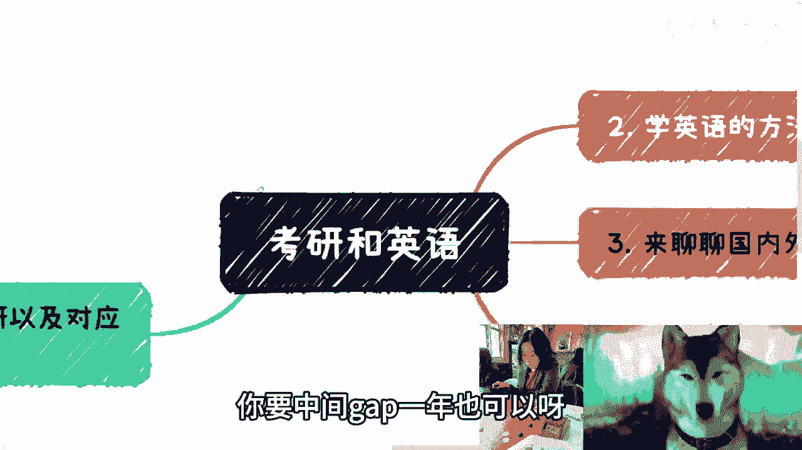

没有问题呀对吧，那我周围当时gap的人也很多。

OKOK好，那这个基本上我觉得这个大差不差啊。

然后那个你作为这个英语专八的大佬，你跟我们说一下这个学英语的方法，我们现在了解下来英语这个东西怎么说呢。

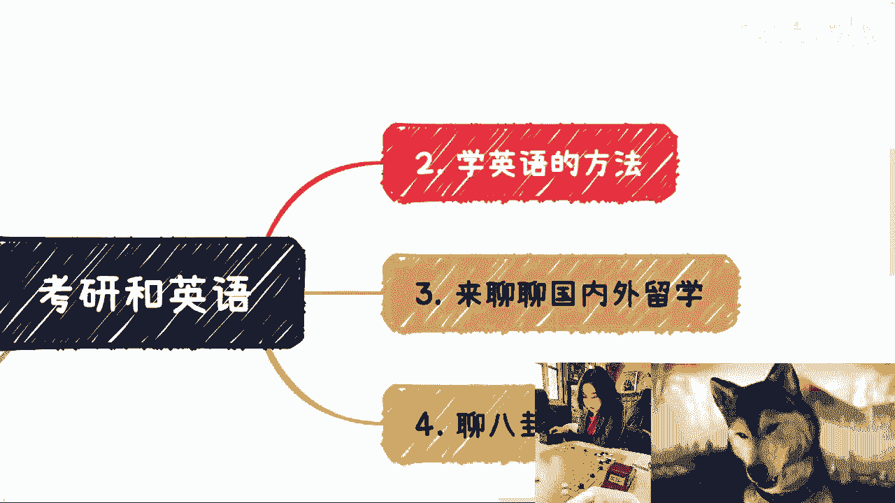

就是呃就有的嘛，反正就是就是学不好。

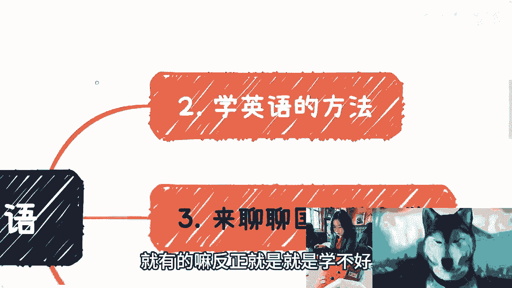

有的呢就属于那种呃跷脚，就是他可能写吗，会写的啊，听听也OK的，说就是跟垃圾一样对吧。

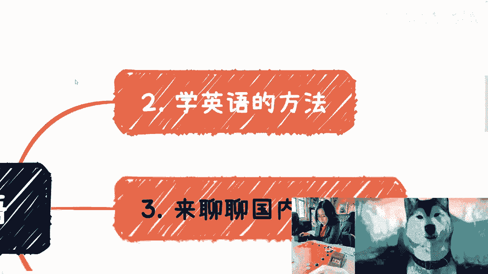

那这个学英语方法，来来来，我们来科普一下。

嗯嗯好嗯，我觉得赏总说的特别对啊，就是现在这种就是这需求还是挺大的，然后的确是有很多人是，就是可能某一方面能力比较突出，那其实我也不是大佬，真的不算大佬，我是脑子其实不是特别好使的人。

然后我本身也是一个很懒，真的是很懒的人，所以我就不管学啥，就不管刚刚说的考研也好。

还是就是学英语也好，我是其实我还挺喜欢走捷径的，那走捷径的话，我就觉得这个事情我是特别看重的，就我不喜欢坐在那里，然后做一些无用功，然后做一些感动自己的事情，我最理想的就是我我今天我要学一个小时。

然后我要去玩两小时，所以我就整天我就在那钻研什么方法，到底是最好用最高效的，就我宁可去先不学，然后就花个几天时间，然后去B站啊，知乎上啊，去查各种方法。

找各种资源，然后再那里试验，然后试验了觉得效率低，然后不好用，那我们就换掉对吧，然后所以我觉得嗯就是我试验了这么多下来，我总结出来的方法，应该还是适合大部分的同学的吧。

嗯那我就结合我考这个英语的大学的，四六级也好，专八也好，考研英语也好，还有我自己考高分的一些经历嗯。

就一起来聊一下啊，就是首先就是有很多人喜欢他一把抓对吧。

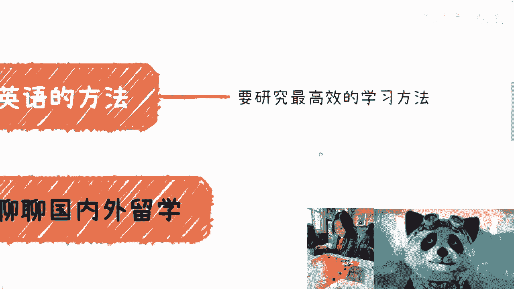

就是背了一堆单词，学了一堆语法，然后看了一堆美剧，然后实际上最后就停留在了abandon对吧，所以呢我们就是学习任何一个东西，包括英语不能这样子。

眉毛胡子一把抓，像无头苍蝇一样，就到处乱学。

尤其这个语言这个东西，你一定是需要一个好的方法的，那你就是需要去搞明白，学习英语的一个底层的逻辑，那英语它只是一个工具。

对不对，那么工具呢你就要看它的一个使用的需求。

就是嗯比如说你你就是嗯怎么说呢，就是你第一件事情就是你要搞清楚，你学习英语的一个目的是为了什么。

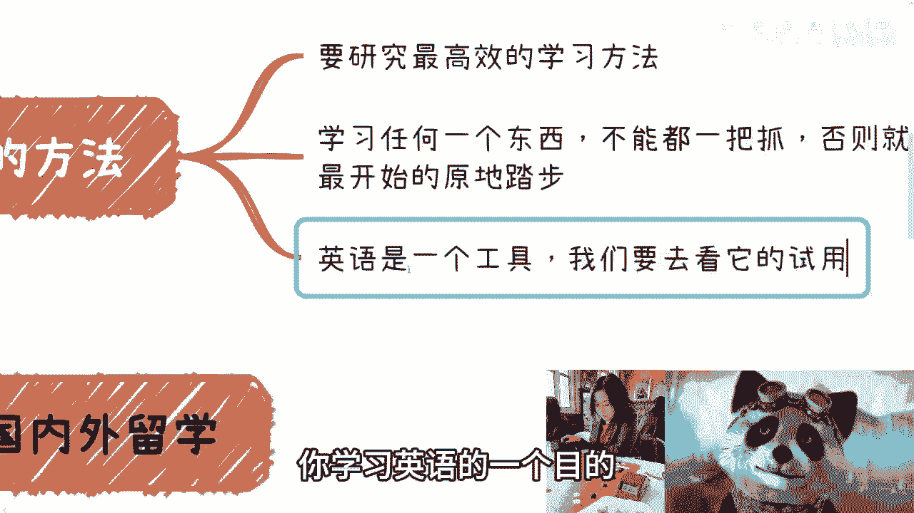

你是要去只是通过四六级考试，你不影响他的毕业就行。

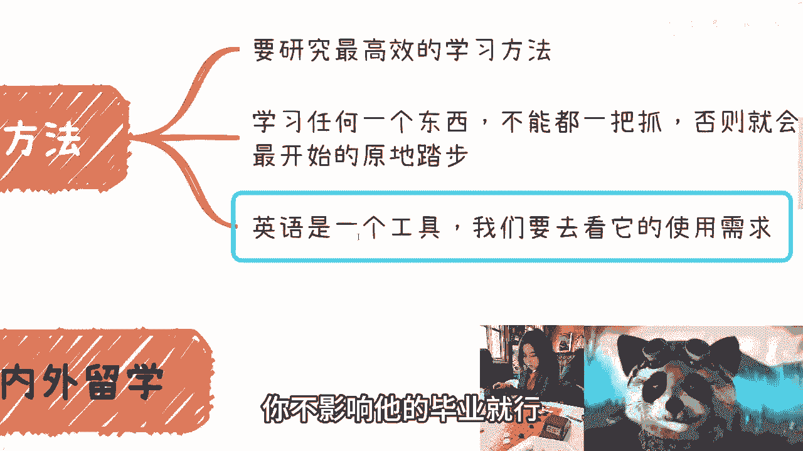

还是你是需要去科研，你需要去看国内外的论文。

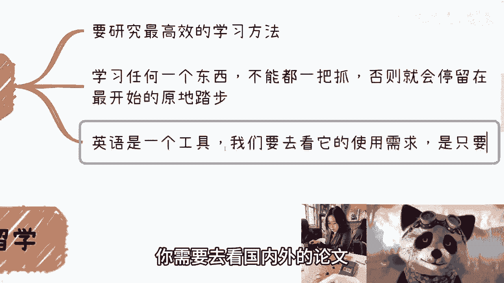

然后要写英文的paper，还是你要去考雅思托福，然后以后要准备出国的，还是你只是比如说想去看国外的一些信息呀，然后看啊美剧啊，看电影啊之类的，然后搞清楚这些你的使用需求以后，你再来看你的目标是什么。

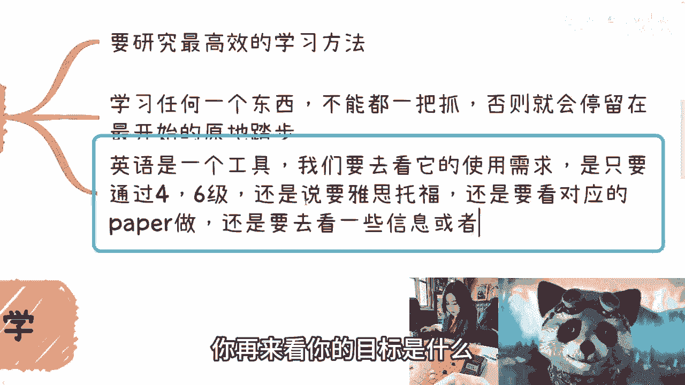

然后再对应的去学，如果说你学英语，你只是为了一个最低的要求。

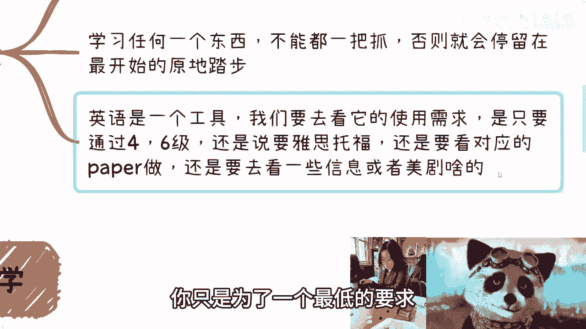

就是你不影响毕业就行，你知道你以后不会用这个英语这个东西去干嘛。

那你就按照传统的应试那一套方法去学啊，我觉得这个是比较少见的。

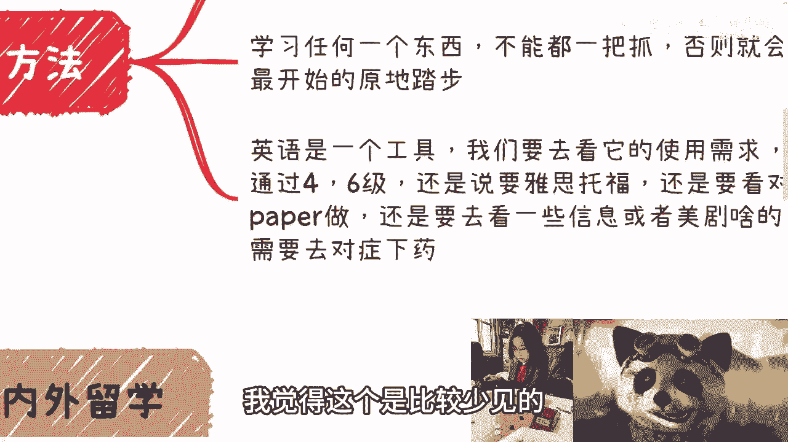

是我说的是适合大部分人的来说，就是其实英语它是一定是在你未来的人生路上。

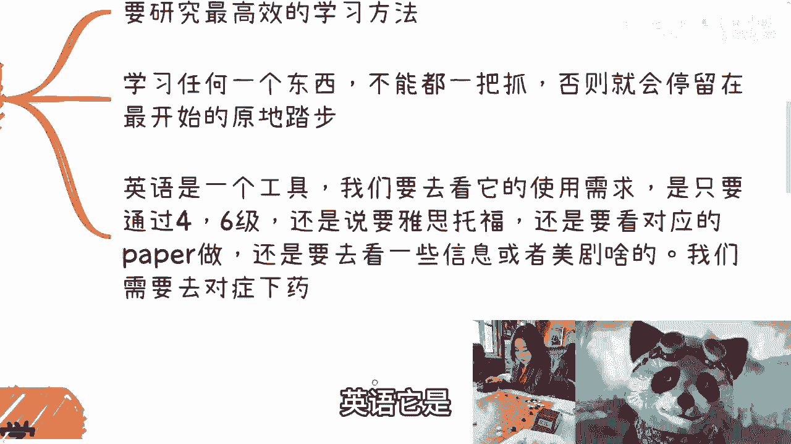

是有继续使用下去的一个场景和必要性的。

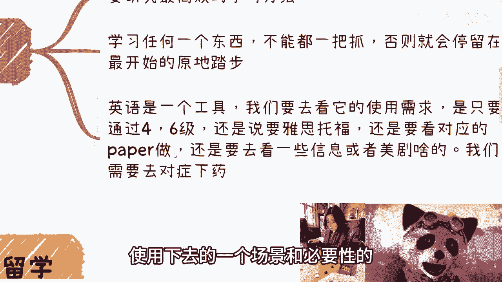

是只要你觉得你未来有可能需要去用，我建议学习英语，一定要去综合性的去学，什么叫综合性的去学呢，就是你在选择你学习英语的材料的时候是杂的，不是说考试要求你去学哪些单词，我就就每天就翻来覆去。

只盯着这些单词去狂背，或者说考试只考这些题目。

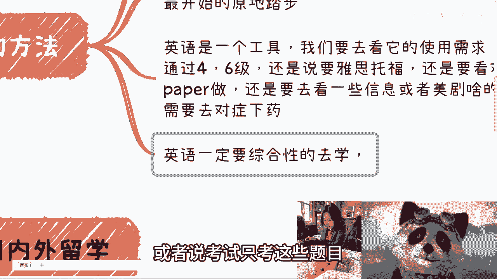

你就整天在那里死磕这些题目，你是要去以你提高自己英语水平为目的的，然后去学习英语，就是你保证你学成了以后，这个是你自己的东西，这样的话其实你考试就不用单独去准备了。

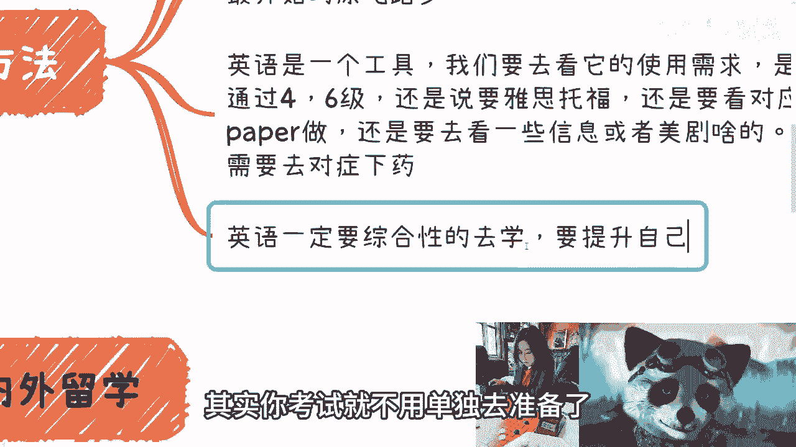

就是考试只是一个水到渠成的事情，就直接就通过了，如果说你整天只是死磕这些考试的东西。

你考完了就忘掉，而且他其实使用的范围是非常狭窄的，你考完了四级，你下次要重新准备六级，但是如果你英语水平提高了以后，你四级轻松的考，六级也能够轻松的考对吧，其实都是一样的。

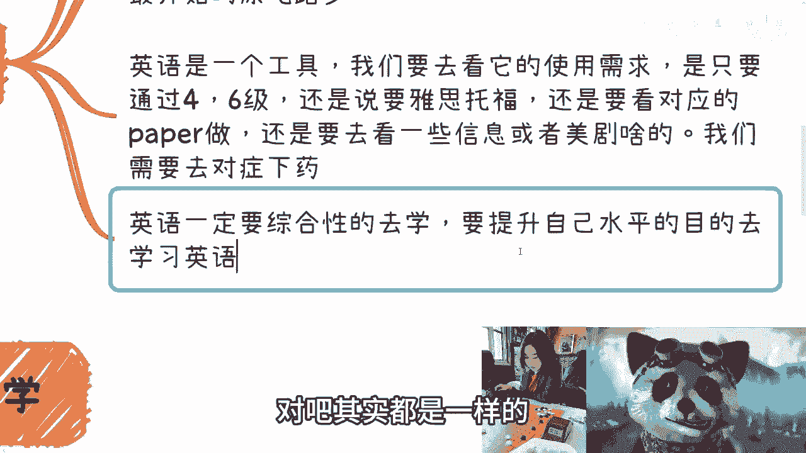

就是你定一个N加一的目标，然后N就不知不觉的就已经被你攻克掉了吗，而且这个东西一定是会让你终身受益的好。

然后呃知道了这些以后，然后接下来，我觉得就是在开始具体学习英语之前。

一定要树立起一个观念，就是我先说一说我当时的一个反例。

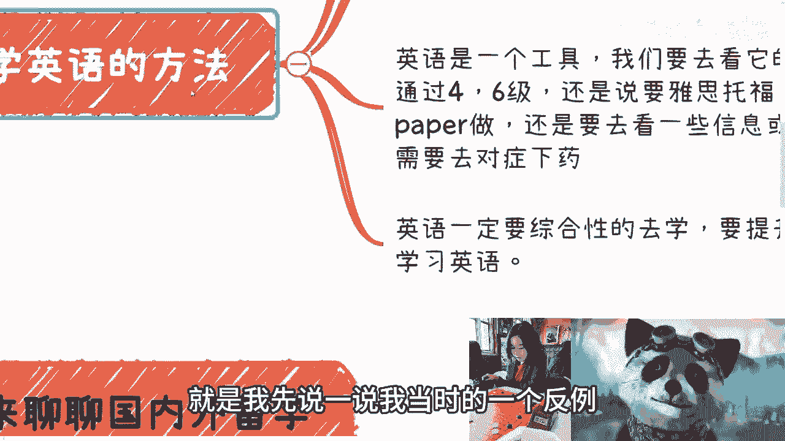

我刚我，其实我那时候也是属于英语不太好的选手。

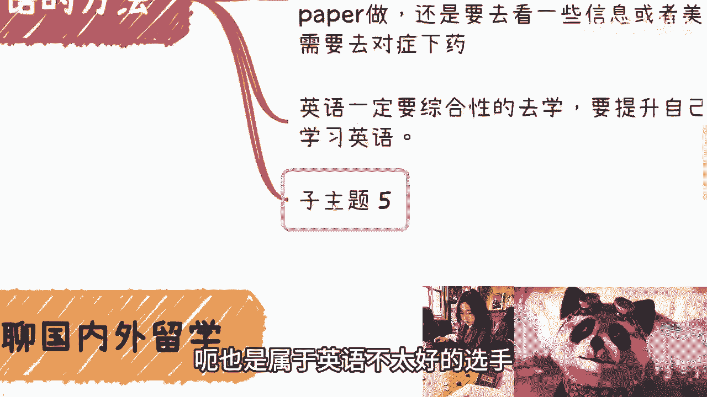

然后嗯当时我犯的错误就是，我想去利用好一切的时间，然后争分夺秒，尤其到考试前，我就在那疯狂的就就看到什么就背什么，就多记一个单词，多背几句话，就想着反正无论如何对吧，都是有用的。

我到了考场上我一定能够用得到，然后结果这个事情会发生什么呢，就是你到了考场上反而觉得诶这个我好像见过，但是到底是啥意思啊，到底是啥用呃，你就会搞不清楚对吧，就明明好像都看过，但是都不行。

其实就变成这些东西，你好像学了，其实你根本就没有学，那所以我们需要建立的一个观念，就是我们学习英语，一定要去结合具体的场景去学，才能够事半功倍，比如说常见的一些动词。

那你就要去搞清楚你哪些固定固定搭配也好，具体语境里去怎么用也好，就是要结合着例句去学，这样的话才更加的有趣，也更加容易去记住，是很多人会觉得既句子很烦啊，不如直接记个单词好了，但是磨刀不误砍砍柴工的。

就是你总比你记了一遍，两遍三遍四遍，记了十遍，你还是想不起来这个单词是啥意思的，好，就是刚才也提到了，用这个呃ANI这个app嘛，然后我在用这个app的时候，我都是会把几个句子。

就是哦这个app我再提一句，就是我当时考研的时候也用这个，然后考专八的时候也用，考高翻的时候也用，就是反正特别的好用，然后就是我会把这个单词，单词是个底嘛，你学任何的东西，阅读理解也好，作文也好。

都需要单词来打底，所以你学这个单词的时候，你都是会把相应的句子去附上去的，这样我在每次去备胎的时候，我脑子里都会出现同样的一个画面，而且我一下子就能够把整个这个单词的用法啊，场景啊，词性啊。

还有它有多个含义的时候，全部都一起记住了，看上去好像很麻烦。

实际上是起到了事半功倍的一个效果，就是你刚开始的时候会比较痛苦。

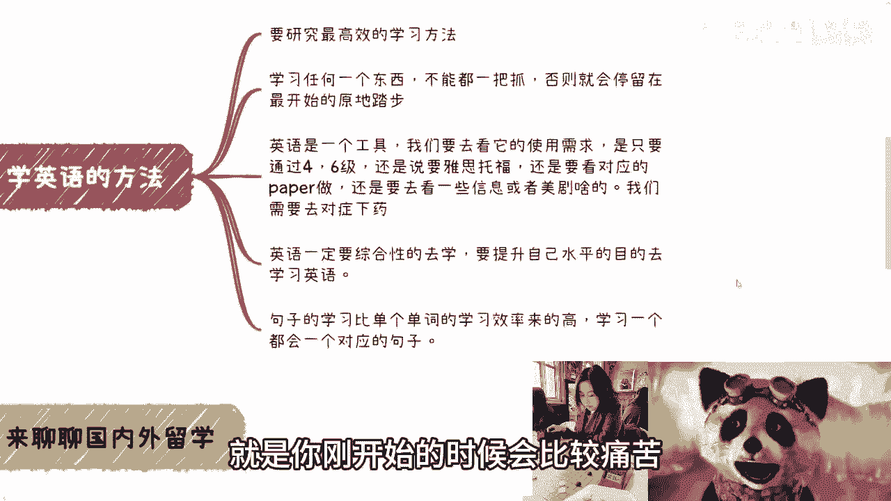

也要花很多的时间，但是到后来一定是会学得越来越爽。

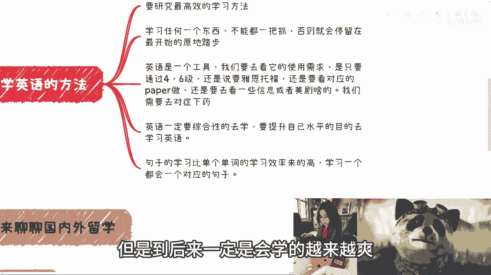

而且就会产生一种学习的惯性下去了。

好，然后接下来我要谈一个，就是英语学习的一个原则，就是需要把英语学习当做你们打游戏一样，一定要找到乐趣和成就感，要去尽量的避免你的枯燥和挫折感。

比如说就是呃我刚才说到了嘛，你要自己去选择这些学习的材料。

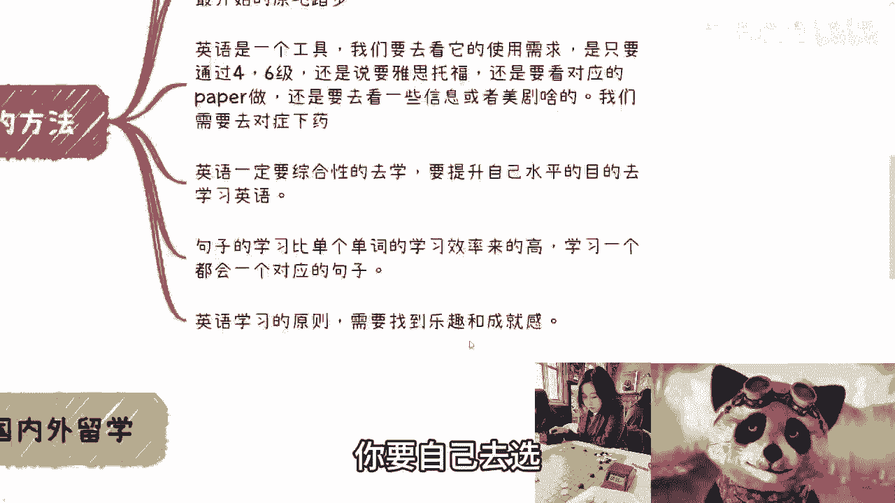

对不对，就是不是这些集中在考试的上面，那你在学习英语，选择这些材料的时候，一定要选择你自己真的是充满兴趣的，就是你很喜欢的这些材料，然后而且是刚好比你的能力要稍微高，那么一点点的。

你不要去强迫自己接触啊，大家都说这个是好材料，比如说老友记对吧，所有人都说老友记很好，但是我又觉得老友记我看不下去啊，那也无所谓啊，还有很多人说BOACNN一定要去听啊，凭什么呢。

凭什么大家说这个好材料我就一定要去学呢，啊没有必要的，世界上没有任何必须学的东西，只有你喜欢的东西，就是只因为只有乐趣，这个东西才能够陪陪伴你走下去。

走得更远，我当时自己个人反反复复看了五六遍的，是摩登家庭和权力的游戏，反正就是你不要去强迫你自己接触，你不那么感兴趣的材料，不要人家说啥你就去看啥啊，人家就不代表你。

你需要多自己多多的去尝试，多去打开一些新的东西，你就发现自己没那么感兴趣，或者对自己难度太大了，那你就放弃，比如说你的能力是N，然后这个材料你发现这个难度已经超过了N，加一有一大堆不认识的单词。

这语法结构也太烦了，那你就放弃啊，首先你就得保证，你找到的这个材料是你很喜欢的，而且是学个几遍都学不腻的那种，然后你坚持学了一段时间，发现诶这是有进步的，然后你这样才能够长期稳定的这个学英语，学下去。

进步下去，因为学英语真的不是一天两天，一年两年就能学好的，它是一个持续性的一个过程，但是持续性你要坚持下去，就得真的是你自己，首先你要发自内心的去，你把它化作一个生活当中的，比较有乐趣的习惯啊。

才能够更好地坚持，那最后嗯，嗯最后一点就是我觉得，嗯对于当代的年轻人来说吧，就是嗯阅读理解我觉得是最最重要的。

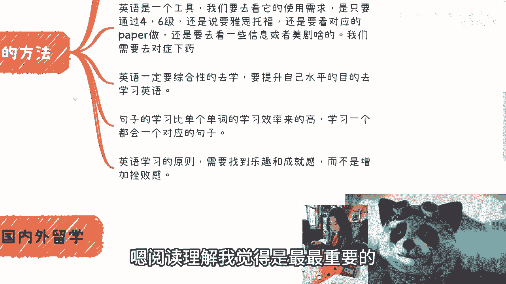

就是可以保证你自己获取的信息来源，不会被一些其他经过翻译的，这些扭曲的意思的这种报道所误导吧，所以我就来分享一下，阅读理解的这个学习的心得，我觉得这阅读理解的能力就是还是真的是需要。

就是我觉得每个人其实都挺需要的，就是阅读理解怎么去学好呢，就是要大量大量的去读，找到自己感兴趣的，然后稍微有那么一点点难度的去读，呃比如说你英语水平，你觉得自己比较差。

那你就先从很简单很生动的一些小说开始啊，比如那种很很经典的，谁动了我的奶酪是who moved my cheese，这个，然后你慢慢的能稍微能力上去了一点点，然后你就可以看一些经济学人啊啊里面有关。

你不要去看国外的嘛，那种跟我们也没什么关系，我们就可以看一些比如关于中国的一些报道，这种东西它就是比较容易理解，然后你也会比较感兴趣，然后你就看着看着就会发现哦，原来外国人是这么分析中国的呀。

就不是说哦外国人分析的对，而是你可以多了一种视角，其实阅读理解理解嘛，就是到最后也是通过这样的一个阅读，然后你去培养了自己，多角度分析问题的一种能力，这个稍微有点题外话，然后我们绕回来说。

就是反正你喜欢这篇文章，你就去精读，你不喜欢就去泛读啊，无所谓的，就是嗯我上面也说过了嘛，就是原则就是你自己的乐趣和成就感，还有就是你很多人说长难句，这阅读理解的长难句太难了，就理解不了。

每次一看见哇好几行的长难句就晕头转向的啊，我一开始也是这样子的，那这个其实没关系的，就慢慢培养，慢慢来，最关键的就是找到主句，然后抓住最主要的动词，那你对这个主要的这个意思就大差不差了。

你只要慢慢的有了这样的，就一开始你比如说你学会了几句话，然后有有了那样一个成就感，在然后你就可以坚持下去，就一定会通过这样的积累得到提高的，好吧，我相信，因为我自己个人也不是那种特别聪明的类型。

嗯嗯就我觉得大部分人应该还是能够做得到的。

只要方法是对的话。

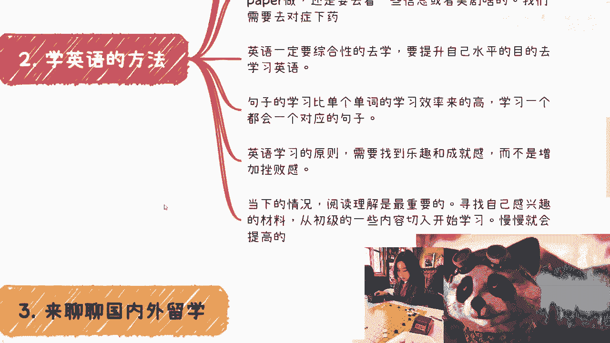

你基本上就这些好的好的好的，这个硕士加专八跟我们说。

你不是很聪明的人对吧，这个不要紧的，我们待会儿回头回头看大家大家是怎么看的。

哈哈哈对吧，然后这个是OK嗯。

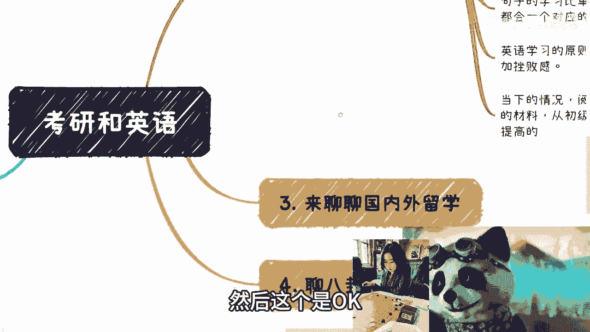

英语对好，那么第三个就是说跟英语非常密切相关的，就是我们说的这个哎，不是不是不是这个我写我写国内外爱干啥，就是呃第三个就是我们说的这个海外对吧，留学的这个事情啊，留学这个事情呢。

其实在就去年可能今年也是比较多的，这个人的一些选择，那么反正有的嘛是水个一年的硕士对吧，有的嘛可能就是啊过去想办法搞搞身份啊，有的猫可能也是想着说，我先呃这个走一步看一步啊，就出去可能读个几年。

到时候看看整个全球经济情况，再回来等等等，反正反正各有各的一些这个目的吧，啊然后嗯OK那我们从这个呃海外留学角度，要么我们也可以来聊聊看这个自己的看法。

嗯好的嗯这个我就稍微简单的分享一下吧，嗯因为我自己本身是没有去留过学的，只是就是周围留学的特别特别多，然后聊的也比较多，嗯稍微有那么一点点的认识和了解，也是嗯简单的跟大家聊一下。

嗯首先我觉得要想清楚你留学到底是为了什么，就是就像邵总刚才说的那样啊。

就是如果说你只是去水个一年。

然后再回来，或者说你是为了逃避掉某些东西嗯，不想工作啊，或者也好啊，或者说嗯逃避某个环境啊，那我觉得倒没有那么大的必要去留学，就是你在国内你找不到的答案，你在国外也找不到的，你如果幻想自己去了国外留学。

然后换了个人回来，那是不可能的事情好吧，你去了那里还是你，如果你本身自己就是一个很迷茫的状态，你去了国外还是很迷茫，就是呃人本来这一辈子就是一个认识自我，探索自我和接纳自我的过程。

那么去国外只是一个途径，你要想清楚你你留学的这个过程，能不能够对你自己是产生一些正向的，就除了学历提升以外的，一些认知上面的提高也好，或者资源上面的提高也好，嗯就反正要先想清楚吧，然后呢就是你去留学。

我觉得一定要想清楚，你这个投入产出比是高不高的，就是怎么说，就各方面都要考虑进去。

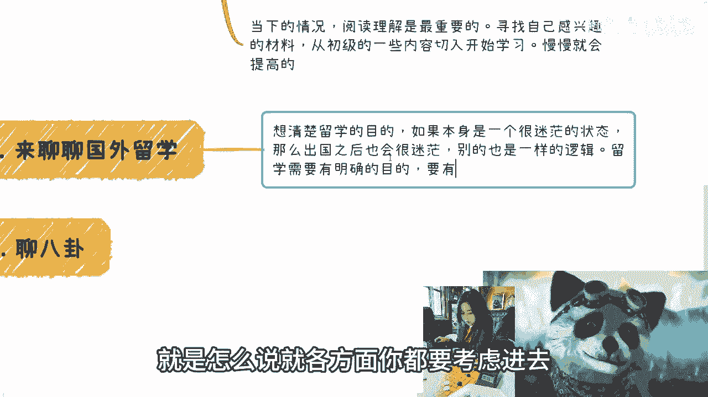

比如说需要花多少钱啊，然后你家里支不支持啊，嗯反正各个方面你都要纳入到你的考虑范畴，而不是说我就头脑一热，就非得让家里会，比如说卖了房子啊，来支撑我，然后到国外去读好几年硕士。

那到时候你回来会发现你要面临的东西很多，而且往往你回你回来找到的工作，可能就也并没有那么的理想，那你到时候就是太失望了，反而那这个东西就就变成了，没有那么好的一件事情了，然后还有一点呢。

就是呃要做好这个人际环境。

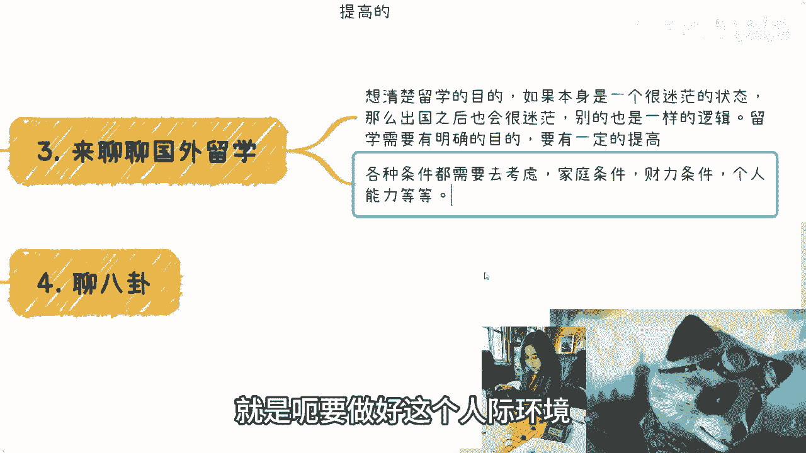

变化特别大的一个准备，就是到了国外以后会非常非常的孤单，这个跟就是我跟所有的人聊下来，所有的人全部都提到的一点是，他们到了国外以后，就是真的是没有办法融入进去。

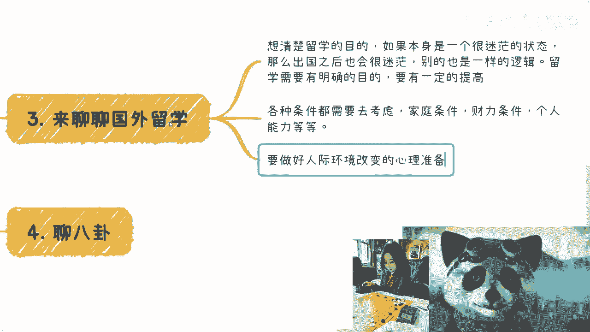

当地的一种环境吧，尤其是在当下的这个国际形势下，更加是要做好这种准备了，哪怕你是去澳洲啊，这种比较相对来说友好的地方，我觉得啊他还是对华人来说嗯，总之就是你要克服的东西比在国内要更多。

所以你前提你先要判断一下自己。

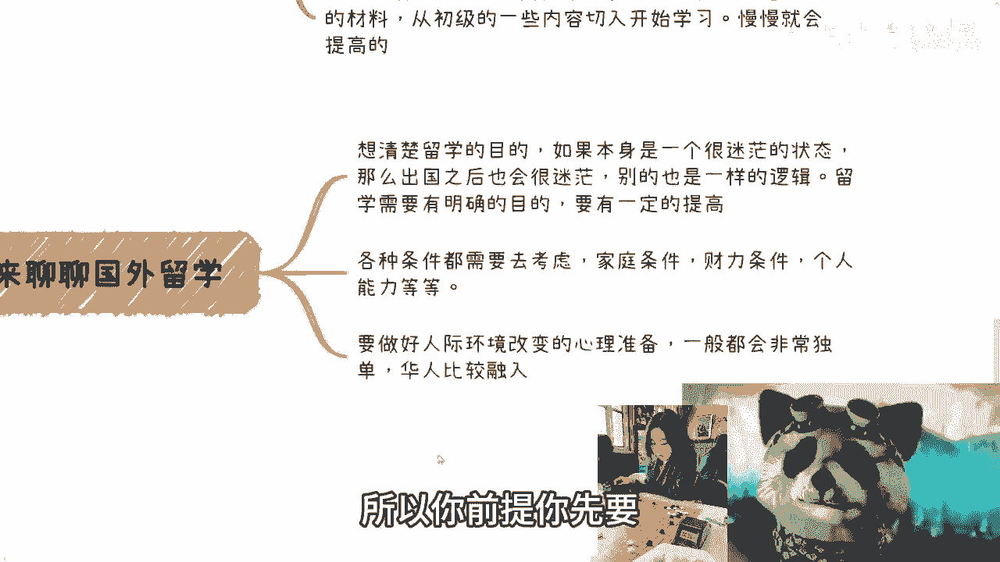

适应能力强不强，能不能够接受这种环境，就这种这个也是有个标准的，比如说你上学的时候，你换到一个任新的环境里，然后你发现自己呃能不能很快的去适应，去融入进去啊，都是有关系的。

那比如说你觉得自己不太能够接受这种，天天都是很孤独的状态，然后找不到这种志同道合的小伙伴的啊，用语言是一样的的，这种的环境下，你是觉得你受不了的话，我建议还是不要去了啊，容易产生一些心理疾病的。

然后嗯还有一点就是就是你要看你自己的情况，就有些人吧，我的确发现他们是不太适合在国内发展的啊，哪怕是性格也好，或者说他从事的行业也好啊，是是的确适合去国外的，那我觉得是可以的。

这一点就是要结合自己的情况。

具体去分析判断啊，这个也没有必要去强求。

就是有一些东西的确就是国内是受阻的，那你也可以去海外试试看，嗯然后还有最后一点就是当时我有个朋友。

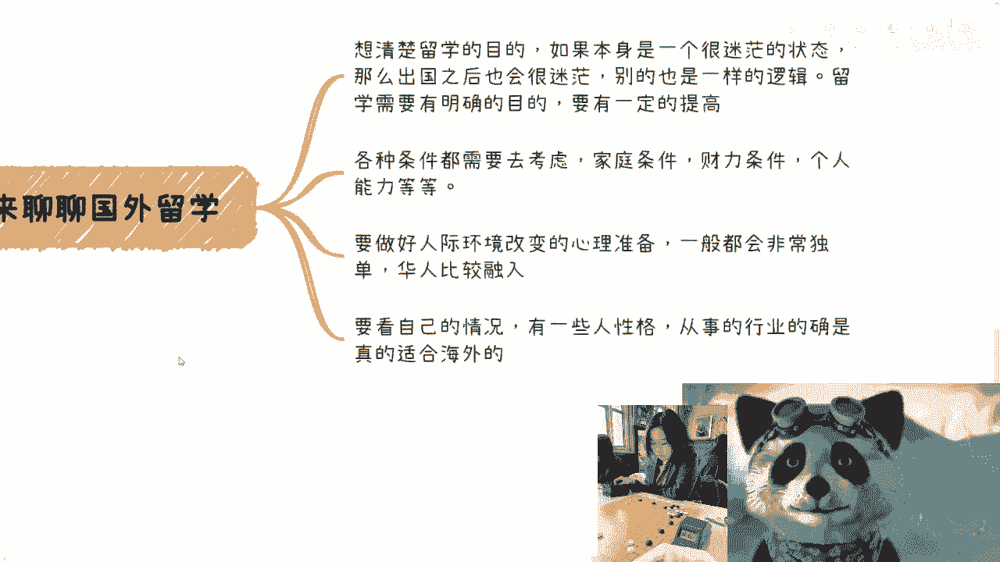

然后他是去香港嗯。

应该算国内留学了，然后去香港读了港港大还是港中文，应该是港中文啊，然后他是读一年，但是他的一年这个的投入产出比就很高，他这个一年他是直接就换来了，可以直接落户，而且是换来了跟老公一起落户的一个机会。

那就是这件事情对他来说，就是，它不仅是好像当时还拿了奖学金还是什么的，反正就是整个的成本并没有那么高，然后多了一重身份，然后而且直接就是呃落户，这个直接就就超越了很多人对吧，带着老公也一起落了。

然后而且就是直接对找工作也的确多了一个，就是更好的一个身份，那我觉得还是可以去试试看的，基本上就这些，Ok，Ok，那最后一个最后一个就是说，如果获得获得的东西比较多的话，那么还是就是这个东西。

就需要结合当地的政策了，K400K4来看对。

那我建议大家可以去咨询一下赏总，赏总对这方面还是很懂的。

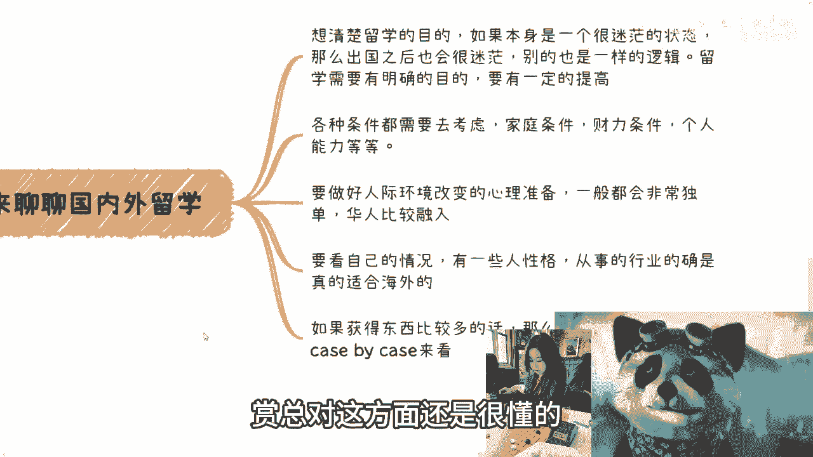

那我也没留学过呀，我也只能道听途说了。

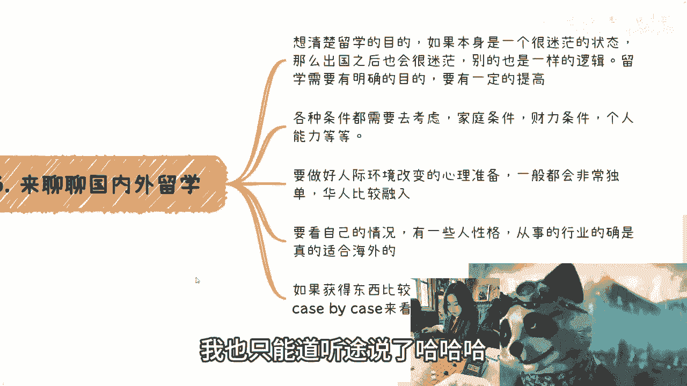

没事没事，那个英文，反正大家这个关于我觉得就是关于这个考研。

或者跟我们就是那个讲的这个内容，比较相关的啊，我觉得嗯在我们下面，就视频下面是能够看到那个嗯，我们这次嘉宾的这个账号的好吧，大家可以移步到我们嘉宾这边去做咨询啊。

这个我觉得英文跟考研，肯定他比我更专业一点啊，这个OK然后第三个。

然后第四个对吧，第四个第四个就是我们说啊，呃除了除了这个叫什么，就是啊上交啊，呃硕士专八以外对吧，然后我们嘉宾还有另外一份身份对吧，就是这个国家一级运动员对吧。

就是起飞啊，起飞那起飞我们来聊一下这个对应的八卦。

来有什么八卦，反正我也不知道有什么八卦，那我也不知道大家想听什么八卦呀，啊嗯这八卦嘛总归就是就是天马行空对吧，各种各样的，反正他他他他都想听啊，好那嗯那我就来分享一下，就是嗯一些故事和一些影视剧吧。

就是大家可以嗯，就我我我也不知道看这个视频的人，有多少是了解围棋的好吧，我就不讲任何专业性的东西，然后就是大家可以先培养一下对围棋的兴趣，就是首先特别推荐的就是动漫棋魂啊，这棋魂我真的是强烈推荐。

吐血推荐好吧，就逢人就推荐，就是只要任何一个人跟我说，他对围棋就想有一个整体的认识，我就说那你先去把棋魂看了呀对吧，就反正也很短嘛，我看了好多好多遍，就是小时候学习的时候也看，后来大学的时候。

然后又翻出来看，这个太热血太燃了，然后而且会让人看的真的热泪盈眶，反正到现在，这部作品现在看起来也是一点都不过时的，而且也可以对围棋的一个魅力啊，或者说大概的一些知识啊，都能够有一个初步的了解。

嗯首先这是第一个，然后嗯还有一个就是特别推荐的是韩剧，请回答1988嗯，这个韩剧1988呢就是它是以日，就是一个传说中的围棋棋手，就是嗯就是真的是一个神一样的存在吧，在我们围棋界里，他的原型叫李昌镐。

然后呢这个人他是在对嗯，李李昌镐能打出来吗，啊对对对，就是第一个对，就是这个人，然后呢，他是我起历史上就获得过最多世界冠军的棋手，就应该前无古人，后无来者，我觉得以后也不可能有人超越他，他16岁的时候。

就是你我都还在上高中上啊，上初中初高中，反正差不多这个年纪吧，人家已经拿世界冠军了，然后他拿过18个世界大赛的冠军，就是他就是拿了所有世界大赛的大满贯的那种，就创造了无数无数的记录，就已经数不胜数。

就我们都我们就是这种业内人士，都已经数不过来的吧，然后他的外号呢就很神奇，他的外号叫石佛，就是石头的石，然后佛就是佛祖的佛，然后这个人特别有意思，就是他下棋的时候永远是面无表情的。

那无论是就是任何形式好，形势不好，然后或者很悲伤，或者说就是拿了世界冠军，他都是就是你看他永远好像就是，就是明明是应该是GIF对不对，但是你永远看他永远都是JPG的状态。

然后呢就是很多人就是在报道里面看，他可能会以为说他是就是天性沉默，实际上不是这样的，他小时候可皮可皮了，是他他曾经说我，我看他弟弟写的传记嘛，然后他小时候啊他是他就是他特别想出去玩。

然后他父母又不让她出去玩，然后他就是一开始他就在那就沉默不说话，然后突然他就一个转身，然后就就直接就砰一下，就把家里的玻璃直接就就直接撞上去，然后然后那玻璃就全部碎掉了嘛，然后而且还扎进了他的动脉里。

然后然后就就反正小时候特别特别的皮，然后他他弟弟还说，就是他也小时候在学校上学的时候受了欺负嘛，然后结果李昌镐还冲到学校来，然后挑战那个块头又特别大，然后年纪又比他高，就我们一般打架的时候。

不是一般都是同年龄段嘛，结果他当时应该是3年级吧，结果他直接就把那个跟6年级的人打，然后两个人都打得伤痕累累，就就反正这个人还其实挺好玩的，但是你就就觉得他很有反差，就是这样一个人。

他后来居然可以就是下棋，就在那一坐坐那么多时间啊，然后做了十几年，而且永远都是这样面无表情的，就是真的是很神奇，然后大家去看这个嗯，请回答1988里面的原呃的男主阿泽，其实就是以他为蓝本。

就特别有意思哦，这个人嗯，还有一还有就是我再推荐两部，就是一个是韩剧的职场剧，就大家可能看韩剧以为都是爱情，其实没有啊，就是这个叫卫生嗯，魏就是未来的未，未来的未，然后对生就是生活的深。

对这个也是特别有意思的，一个111个跟围棋有关的一个剧吧，具体我就不说了，大家可以去看了再说，然后还有就是中国还翻拍过棋魂，就前几年吧，呃我不知道有多少人看过，其实这部剧也翻拍的还是挺不错的。

嗯把一些就是围棋的精髓的一些东西吧，呃还是能够拍得出来，已经算中国的，拍出来里面我觉得应该算是最好的一部了，嗯基本上就这些，然后大家不知道还有什么感兴趣的八卦吗，八卦八卦哦。

这个呃国家一级运动员有什么有什么好的Buff，有有有有什么好的Buff啊，以前一级运动员可以加分啊，二级运动员还能高考加分嘞。

但是到我那个时候我考大学呃，我考大学的前几年，然后就取消了这个政策，就特别搞笑，你就等我考试的时候就没有了，然后他挺生气的，所以其实你说有多大的Buff，我觉得如果你从功利性的上看，其实是嗯没有很多。

就是他可能只是作为一个title吧，也大家也不要看这个事情有多么大的一个光环，或者怎么样子，但反正嗯是对你过往的付出的一种肯定吧，我觉得可以说是，但具体具体呢你说能把它呃转化成收益啊。

或者说其他什么的也好，我觉得倒也未必叫这个，还是要看个人的本领了嗯，那你可以跟别人介绍的时候说，或者说你出去，比如说做教练的时候，你可以这样宣传都可以啦，但具体还是要看自己本领嗯，哦那那那除了围棋。

什么什么象棋，还有什么别的棋，有什么有什么一级运动员了啊，你这应该都有吧，就任何一个体育竞技项目应该都有的呀，体育竞技项目我怎么感觉像都不像竞技项目，那那围棋是体育竞技项目，为什么象棋就不是了呢。

从来没看到过有什么象棋的竞赛。

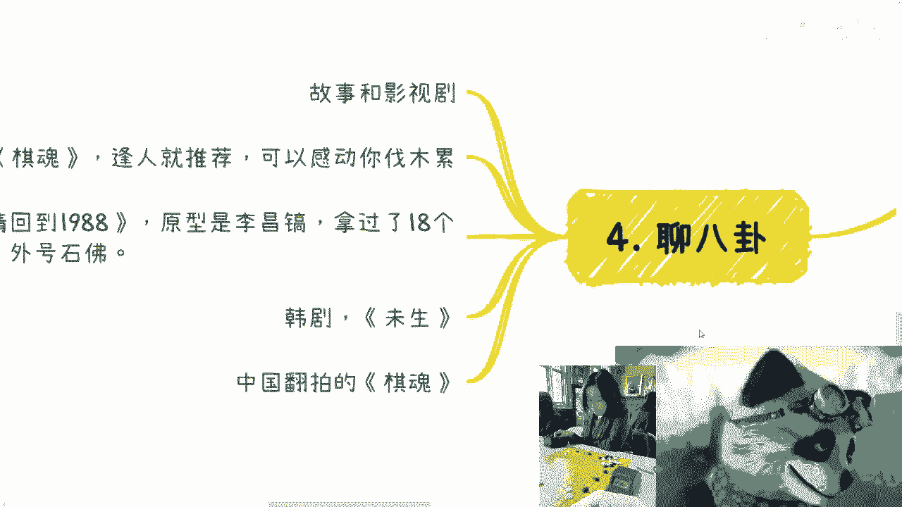

象象棋的竞赛老多老多了，这不亚运会亚运会象棋的项目好多啊。

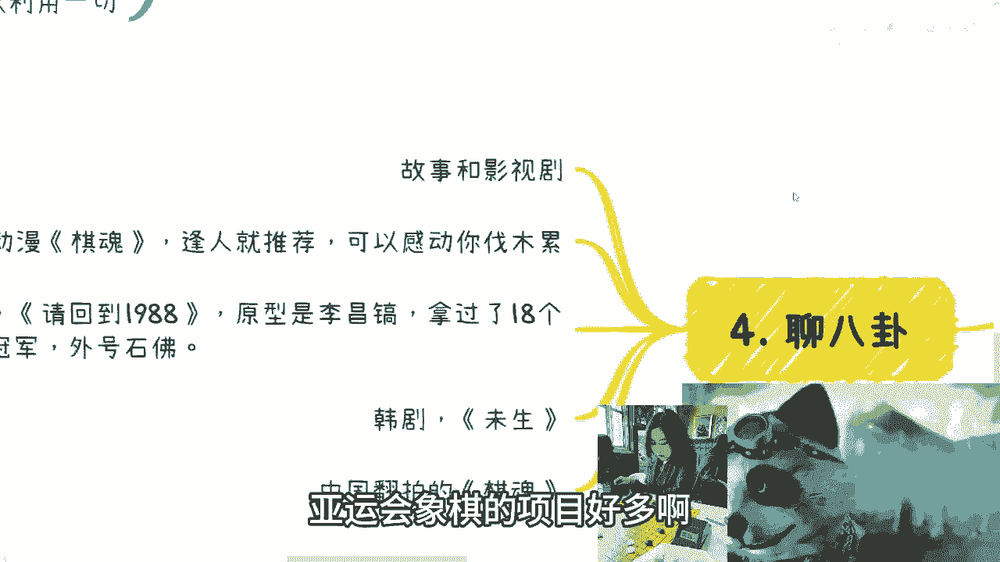

啊这样的嗯，对对对。

你说的是国相还是中向，这是有区别的哦，那毕竟必须不是国相哦，必须不是果香好的，那那就是中向楼，那中象可能我觉得他群众基础更好吧，毕竟很多对吧，老爷爷就在路边就把桌子一支，然后就就可以几十个人就围在那儿。

就杀个眼都通红了，看嗯嗯对对对，这个就让我想到了之前那个剧，叫什么名字来着的，啥叫什么叫什么叫啊。

女王的棋局是吧啊，对对对，女王的棋局是果酱呀，啊对啊嗯嗯对，还是好的还是好的，还是牛逼的，还是牛逼的。

好家在这OK啊，那，OK啊那还是回到回到这边吧，就是那最后最后我觉得再再扯一点啊，就是说啊就当下整个的这个情况，如果就是通通通俗来讲，或者说就整个基本盘来讲，就是你觉得考研是选择怎么说呢。

就是说就如果来说大家都想不清楚，因为本身就想不清楚，概率比较大嘛，就都想不清楚的情况下面对吧，然后自己也摸不清楚自己学习能力的，那你觉得通用来讲是考研好，还是说就直接找工作，回头考个什么。

再考回就回头回头再去补个研究生好，还要这么说，这事我觉得也是要kiss by kiss的，说实话这个真的嗯个人的情况都不一样，那我觉得是可以这样，就是比如说啊你现在在读大一大二，对不对。

然后你就可以先找到啊，大四当中，或者说可能已经毕业的人，就不一定能够有机会接触到，但是就是比如说大四的啊，或者说如果老师有介绍那种，比如说校友会啊之类的人，你先去跟他们聊，先聊啊。

呃你现在聊总比你以后撞了南墙好，那你去聊他们当初选择的路是怎么样的，然后你可以找到一个自己具体的啊，榜样也好，参照物也好，嗯怎么说呢，就是因为每个人情况都不一样，你必须多跟人聊。

你才能够清楚你自己想要的是什么，适合的是什么，也有可能达到的是什么，假如说你聊下来发现啊，的确就是考研，可能对我来说难度太高了，想也或者说你觉得考研这个东西，你可能并不能用一个更高的平台来做什么。

那我觉得就就算了，然后嗯嗯刚刚还有一点是说啥来着，是就业是吧，对对对对对，就就业一般来说他们就该那样嘛，就业就是回头要么考个非全对吧，回头再考是吧，对，怎么说呢，就是有一些行业吧，比如说医生啊。

他的确是对学历，如果说你有一个学历的Buff，你一定会就是呃升职加薪就更快对吧，那你就可以回头再去考一个，然后如果说没有的话啊，这我觉得你就是回头再考，怎么说呢，就嗯考一个这种非全吧。

觉得意义真的就不是很大，你考完了以后，然后干嘛呢对吧，就算你去考一个嗯NBA，或者说就是，反正现在好像比较流行考这种东西吧，然后这位置也有人考，就是你要想清楚你花了这么多的钱对吧。

然后付出了一个精力代价，然后你你要得到什么东西啊，你可不可能真的去得到这个东西，你不要整天活在这种虚假的幻想里面，那就没有必要，就是反正任何时候，都自己要先去获得一个信息啊，就是不要你觉得你考了这个。

或者说嗯就是你回头再考，然后你就能怎么怎么样，就嗯就是你要先就是得到一个，真实的信息的反馈，然后再决再做决定。

嗯嗯OKOK行呀行呀，那那那这个时间也差不多啊，这个每一期我感觉我们这个这个叫什么采访的，这个时间都老长老长啊。

好那要不这个内容我就就先这样，然后回头我们看看就评论区啊，或者大家就是有什么比如感兴趣的话题，或者有什么疑问，到时候看看有哪个切入点或者哪几个切入点呃，方便展开的，就到时候再再再再开。

后续返场是那那应该不至于吧，这个不知道的，看看大家需求吧，然后然后一样的，反正大家我觉得就是考研啊，或者就是英语这种学习类的相关的，也可以找到我们嘉宾的这个账号，可以跟他多交流交流。

或者说那个多咨询咨询好吧，那行吧，欢迎大家关注我，对对对，欢迎大家关注啊，然后那你还有什么结尾要截一下吧，嗯应该没什么了吧，就就就就大家多多给我三连吧，谢谢啊，好的好的也多多给爽，总支持，好的好的。

OKOK行，那行啊，那我们就先这样好吧，然后呃好好好，那我们就先这样，然后就就就期待下一期我们这个嘉宾的分享，好吧，OK呀好的呀，嗯拜拜拜拜拜拜拜拜。

