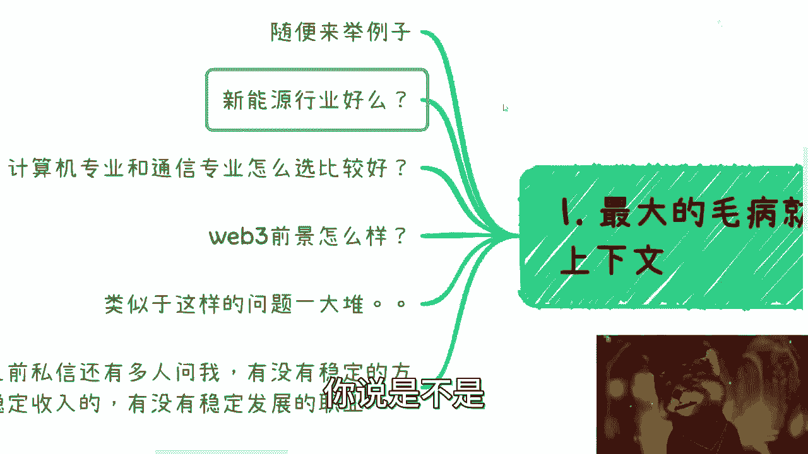
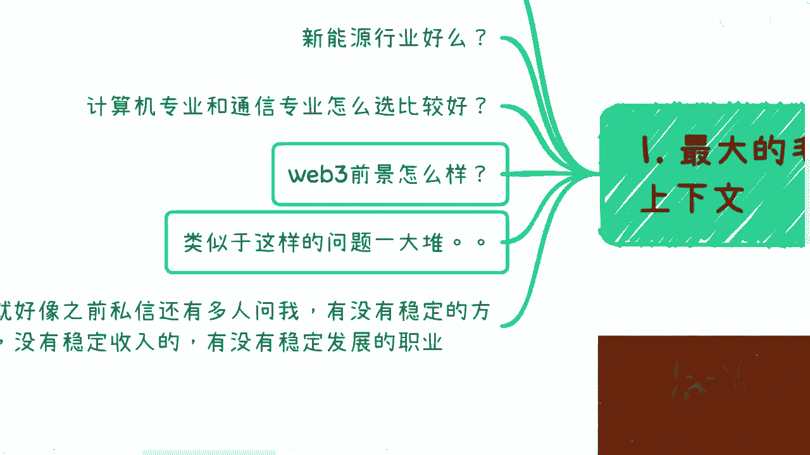
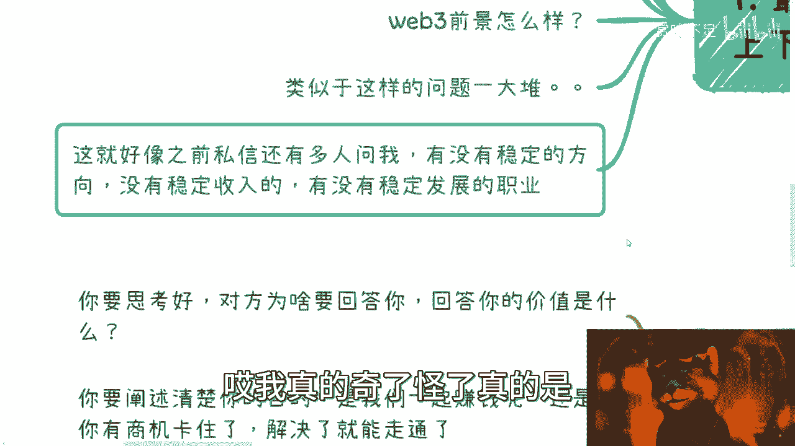
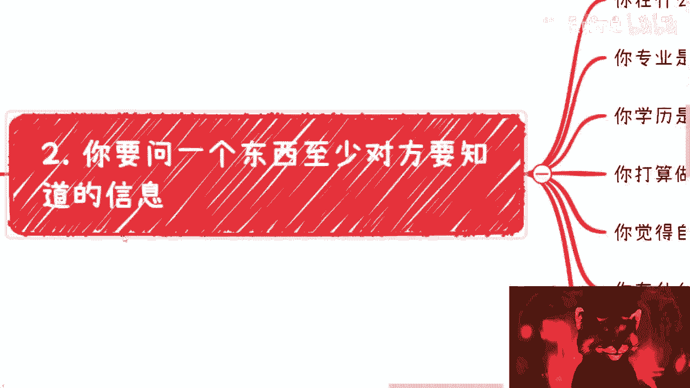
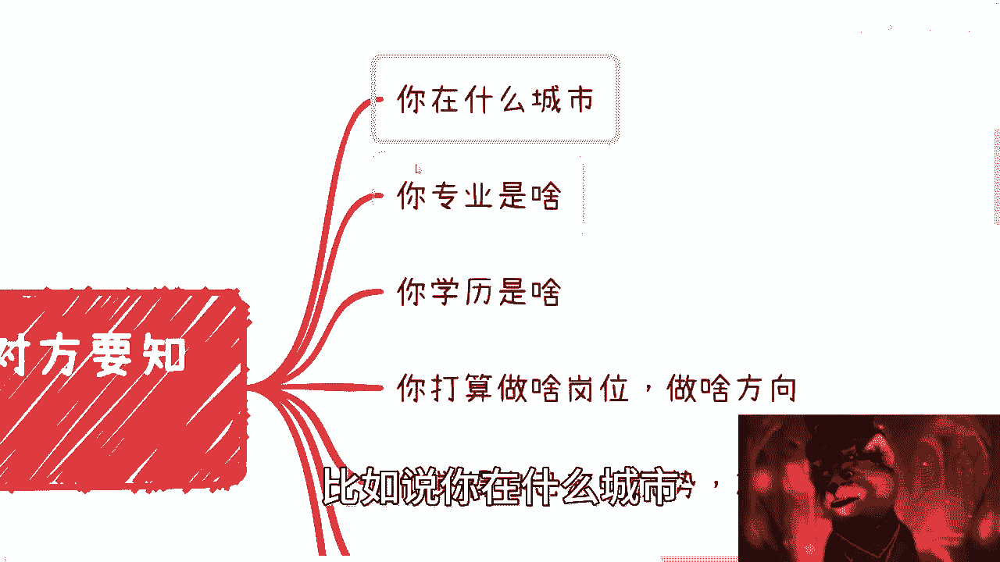
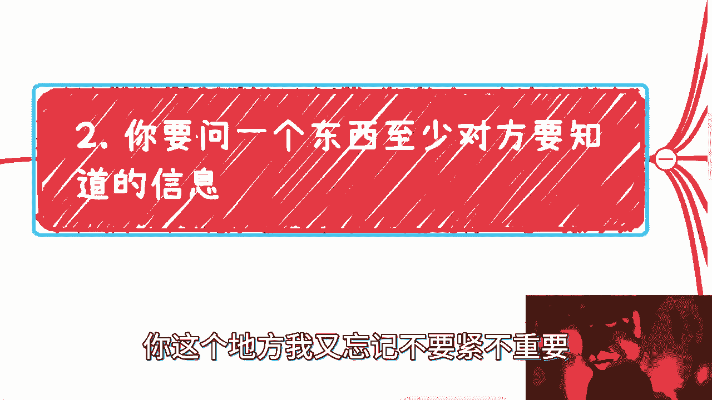
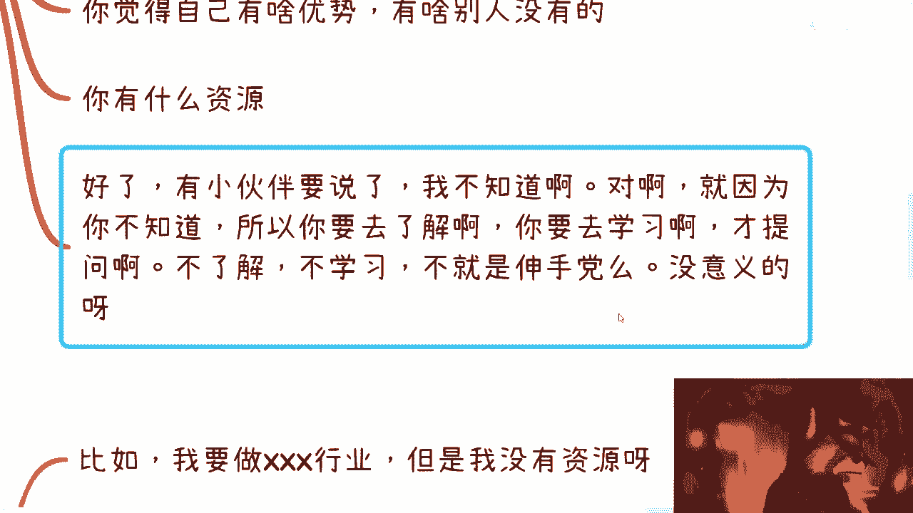
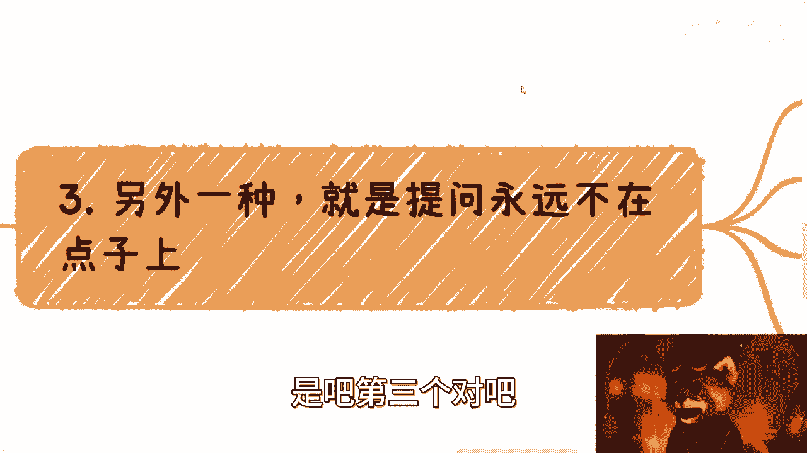
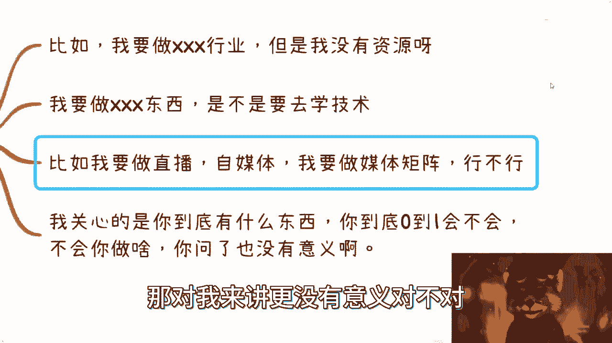
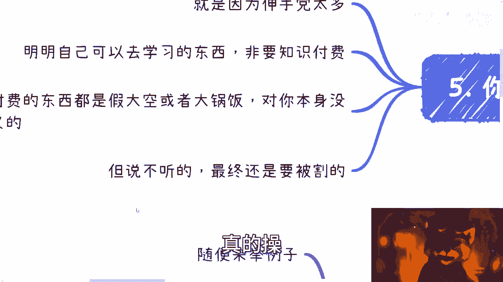

# 不会提问就会处处碰壁啊 - P1 - 赏味不足 - BV1uT41187Rf

好各位小伙伴大家好是吧，今天礼拜几礼拜一礼拜一啊，我跟你们讲，真的气炸了，真的气炸了，那个对吧，首先是这样子的，昨天小伙伴呢这个在直播结束之后啊，给我跟我说啊，就说这个要说一下提问的艺术啊。

我觉得蛮对的啊，我觉得蛮对的，正好今天讲一下这个内容啊，然后呢，欺诈的原因就是，因为他妈的就根本就没几个人懂得怎么提问，妈的这个问题提的我真的是绝了啊。

就很很绝望啊，对对对方右下角是吧。

现在是不是右下角，哎呀呀呀呀，完了好烦啊。

嗯好，然后呢对吧，首先是这样子的啊，这么说你提问对吧，你比如说你对你的朋友啊，在社会上面在工作当中啊。

在这个这个叫什么。

就是学校里面对吧，你提问啊，你很多时候你就一个机会啊，你这个机会浪费了对吧，别人觉得你不会提问，我跟你讲，你也别提第二个问题，你这种问题提出来叫什么叫损人不利己，你知道吧，就是说提出来了。

就对方觉得你是个，然后呢你提出来这问题对你自己也没什么帮助，你有意义吗，没有意义对吧，对吧好OK那我们来看啊。

首先我们随便来举个例子，比如说问我新能源行业好吗，那好好又怎么样，不好又怎么样，我不知道这个好不好，对你有什么意义对吧，而且就是说我也不知道我怎么回答这个问题，就是这就好像对吧，这就好像你问我对吧。

你是不是喜欢女的，那你喜欢怎么样的，你喜欢女的吗，嗯那嗯那然后呢对吧，就是你说你要给我介绍对象对吧，嗯嗯你喜欢什么样的女的，嗯好，然后呢介绍什么呢，什么样的呢，我一概都不知道是吧，你问我现成就好吗对吧。

那我怎么跟你判断好不好呢对吧，我可能有300种角度来看对吧，其中100种角度是好的，200多角度不好的，那怎么算好呢是吧，哎我跟你们讲，你们要是是这种就是思考方式的对吧，这种就是叫什么就问问题方式的。

我跟你们讲就算了，做好电池对吧，做好就失业就回头就结束了对吧，本来这世界就是个八二开的对吧，你不是说每个人都能够赚到钱的，就这么着吧好吧，连最小的事情都做不好，那还做啥呢，你说是不是。

那还有来啊，这个跟我说，计算机专业跟通讯专业怎么选比较好，那他妈我怎么知道怎么选比较好啊啊啊，我就跟你说计算专业好，专业商业好，然后呢，你怎么判断好不好呢，对吧啊，你学校学校也不说城市。

城市也不说你什么样子也不说，那你妈问我怎么好，我怎么知道哪个好啊，是吧啊啊，还有呢web3前景怎么样，web3前景好啊，V3000不好啊，那你怎么样呢，你做啥呢对吧，你我怎么判断呢，你你给我个上下文案。

你说是不是我跟你讲类似的这种问题一大堆啊，都他妈是这种问题是吧，我跟你们说啊，你们但凡这种问题如果跑到商业上，跑到社会上，你们就一次机会就结束了，拉黑你知道吧，就没了，你还还想什么东西呢。

哦你还在那边想着，哎呀，我他妈怎么别人不跟我合作，我怎么让别人接受我对吧，怎么怎么这些人，我我就是我怎么跟别人达成合作，连最基本的问题都不会问，怎么达成合作，合作个屁啊，是不是。

对吧啊我跟你们讲好玩了啊，之前还有人说什么，还有人说啊，私信还要问我呢，他说哎有没有稳定方向，有没有稳定收入啊，有没有稳定的发展职业，哎这他妈的我也想问，来有不来，因为给我一个人吗对吧，我不努力了。

我不想努力了啊，我我我想体验体验这个富婆的快乐，对不对，诶你怎么不告诉我的呢，是不是啊，我我这么说，我要但凡知道这个答案，那那不要烦了，我直接卖一个199对吧，这个中国哪个人不想要这个东西啊。

啊全球哪个人不想要这个东西啊，哎我真的奇了怪了。

真的是是吧，我卖199不开心吗。

真的。

啊然后这个是第一个，第二个呢我跟你讲啊，你问一个问题是吧，你起码至少得要对方，你至少要让对方知道很多的上下文信息是吧。

好你比如说啊我们只能说，比如说我这边不可能给你穷举，对不对，比如说你在什么城市。

你专业是什么，你学历是什么，你这个地方我又忘记。

不要紧不重要，官网说啊，你性格是什么啊对吧，你平时是怎么一个怎么具有，具有怎么一个精神的人，是保守型还是风风险型还是发疯型对吧，还是笨B型，是不是你打算做什么岗位，做什么方向，你总会跟我讲吧，对吧啊。

然后你觉得自己有什么优势，别人没有的对吧，你爸是李刚是吧啊，你有什么资源，是不是你所有东西要讲的呀，你又不说我怎么知道呢，你就你就跟啊这些东西什么都没有，你就问我嗯，这个行业好不好。

我我我我觉得你觉得我做这个行业行不行啊，这行业我做了之后能不能赚钱对吧，这行业我怎么卷得过人家，我他妈怎么知道啊啊我这么奇了怪了，真的是，你咋不问你爸妈呢，你爸妈都不知道，我他妈认知道啊，我跟你讲好了。

还有很多小伙伴要说了，我不知道啊，他妈的我就不知道，所以才问啊对吧，那的不知道，你要先去了解啊，然后你去学习，你再问啊对吧，你不了解不学习就提问，不就是伸手党吗，有意义吗，没有意义的。

我告诉你告诉你所有伸手党要我话来说什么，可怜之人必有可恨之处，就这么回事啊，结束了，那你还谈什么学，还谈什么赚什么钱，对吧啊，还要吃糖，哎呀，我怎么我怎么去赚钱对吧，我怎么怎么怎么能够这个这个叫什么。

跟跟别人不要不要一样，怎么赢在起跑线，怎么不卷，提问都不提啊对吧，提问都不知道怎么提，也不是也不为了好好提问去学习，那你还图啥呢对吧，你还别的还做啥呢是吧，既要又要那还说啥呢，是不是，那我还是那句话嘛。

你要记要有你要今天纪要要能成功，那人家所有机人机要都能成功，那大家都躺平算了，对不了，还卷什么东西了，别卷了呀，是不是哦，你今天失业了，或者你找不到工作了，你咋不去问那些hr呢，你咋不去问那些老板。

问他们，哎你们他妈的怎么不能给我工作呢，我怎么了呢，对吧，你给我份工作呀，是吧啊，你这工作行不行啊，醒不来你你你倒是问问看，真的妈的绝了卧槽。

是吧，第三个对吧。

另外一种就是提问永远不要永远不在点子上，就是就你会发现啊，有些很多问题啊，他问了，但好像就没有问，而且问了呢本质上没有意义，为什么呢，你比如说啊他说我要做什么什么行业，但是我没有资源。

OK好OK然后呢你的问题是什么，就是啊我想做一个行业没有资源，那你的问题是什么，你的问题是你没有资源，我给你资源好，没有问题，我退1万步来讲，就算我给你资源，那我还有问题呢，一你凭什么要这些资源。

二你要的这些资源之后怎么变现，你也不知道，那你问这个问题的意义在什么地方呢，没有意义啊，对对啦啊，那这是第一个，第二个就是说还有什么啊，还有就是我我要做什么什么东西，是不是要去学技术唉。

你要做什么什么东西，是不是要去学习学习技术，那你告诉我你学的技术要干嘛，你明白吧，你不能因为我之前视频里面说的很清楚，赚钱只是个目的，对不对，你不要任何的东西都跟我说，你为了赚钱好，为了赚钱是一个目的。

那我们要把它细分细化，什么意思呢，就比如说你今天说你要学技术，对吧好，那我要问你，你学的技术怎么变现，对不对啊，我是吃饱了撑的，我来问你吗，你自己不能问吗对吧，你要先去想好，你要学技术干嘛。

你再来问这个问题，要不要学技术，你连学完之后干嘛，你也不知道，你先去学它干嘛呢，对不对，在我看来，你除了浪费时间还能干嘛呢，对吧啊，你今天学花了两年学个基础，那怎么了，世界上除了你会这没人会来啊对吧。

这莫名其妙真的是那么第二点，第三点还有什么，他说他说我要做直播，我要做自媒体，我要做媒体质量行不行行啊，可以啊，那我就问你嘛，你凭什么做起来对吧，你凭什么觉得你能做，别人不能做。

你凭什么觉得你做的能做的过，人家不行啊，都可以做啊，然后呢你做了之后，然后呢就在我看来，你没有想明白这件事情的闭环，你没有想明白你做了之后怎么赚钱，你没有去做过调研，你没有去做过学习，这件事情可以做吗。

可以做，你就在浪费时间，没有了呀，然后呢对不对，你问我行不行，我肯定告诉你行啊，对不对，那行了之后你又不能赚钱，你问题我就问你行不行啊，对不对，所以说我关心的对吧，永远是你到底有什么东西是别人没有的。

你到底有什么东西是你想清楚怎么赚钱的对吧，你到底0~1会不会，什么叫0~1会不会啊，我跟你讲，哎呦真的是搞笑了，就是那种现在是什么，就是连hello world都不会写的对吧，然后来问我啊。

这个技术行不行啊，这个技术好不好，那么好不好，先去学，对不对，你先去学hello world，你倒是你先去学完hello world之后，你再去了解了解这基础好不好，能做什么，你在里面怎么赚钱。

你再来问我，对不对啊，然后你说媒体矩阵也是的对吧，你连一个号都没做起来过，你连一个号每个平台的流量怎么做，你连套路也不会，你就来问我没记矩阵行不行，我他妈就肯定不行，对不对，然后你也别来跟我说，别人行。

别人行，是因为别人有经验，别人做过，你有吗，你没有，对不对，你大部分人问问题都是0~1没有的，没有任何亲自实践过，没有任何去做过调研，你就你就问有意义了，没有意义，不会你做啥呢对吧，你问了也没有意义。

我跟你说这个东西好不好，对你来讲也没有意义，那对我来讲更没有意义。

对不对，我真的绝了对吧。

再下去我都要变成玛德法克侠了，你说是吧，然后第四啊。

你平时职场里或社会上提问题，你看啊啊第一你思考好对吧，你先想好对方为什么要回答你，回答你的价值是什么，因为你问出这问题，对方就会觉得我我我我回答你，我都不知道，我都不知道你能得到什么。

我也不知道我能得到什么，对吧，我跟你讲了，大家做生意都是资本家对吧，资本家什么逻辑，资本家就业逻辑，就是说我做一件事情，我必须要赚钱，我不赚钱就是亏本买卖，对不对，那你问我问题，我为什么要回答你呢。

这莫名其妙嘛，是不是对吧，这第一点第二点就是说你得阐述你的目的，你知道吧，就是你今天问一个问题，你要干嘛，是我们要一起赚钱呢，还是说你现在有个商业，有个有个实践过程当中有个问题卡住了对吧。

你要解决了还能走就能走通，怎么样，也就是说你问的所有问题要是细节的，你不能问出来个笼统的问题对吧，你就那那你你你昨天去问呗，我为什么找不到工作，哎我为什么评论找到，为什么我找不到啊。

为什么别人年薪年薪100万，我他妈就5万，对不对，那那你说问题问题有意义的没有意义的呀，是不是啊，然后就说你要明白你和对方的关系是什么，我跟你说钱不钱真不是问题，你所有付钱并不是能得到所有的答案。

为什么呢，因为你付出去的钱跟真正的我们去做项目，或者我们去做一些这个资源的整合，或者做一些这种叫做呃商单，你利润跟这些东西利润相比，你一文不值啊对吧，那你说哦我付钱了，你就必须回答我。

不是我不想回答你这种问题，问出来谁能回答，你去找巴菲特也回答不了啊，是不是哦，你跑过去巴菲特，你跑跑过去跟歪歪菲特吃顿饭，你就你上来就问他，来下面下下个月你不要给我推荐只股票。

必须他妈的涨涨百分之1万对吧，否则你就是垃圾，行不啦，对不啦，真的是，然后还有什么，还有还有我跟你讲，你在职场当中也是的，我跟你说，你就是个电池对吧，你在职场当中，你是在一个大的框架下面对吧。

除非你不关心你，比如说当然你也可以不关心自己的晋升，或者其他方面的东西，那么我跟你讲，你就可以不受约束对吧，但是大部分人如果你关心你的职场晋升，或者你的这个叫什么，就是关系链的话。

那么你提问一定是要跟着对方屁股走的对吧，你要明白，就是你提出来的问题，也许你是真的想提问，你也是你可能也是就是长旁敲侧击，但是你其中问题要跟着对方的KPI走，你不跟着对方KPI走。

对方是不可能来回答你的对吧，而且或者回答你就是一些就敷衍你的，这些问那个答案是没有任何价值的对吧，还有是什么呢，你在你在社会上提问，很多时候我跟你讲，你就一次机会，因为这个你的提问。

会表现出你这个人的商业价值，会表现出你的商业思维，会表现出你的做事方式，你阐述不清楚上下问题，你不秒表明目的，就说明你根本就不清楚自己要什么，你也根本没有一个自律的能力，你也不知道到底应该怎么做事情。

那么大家跟着你或者跟你合作是赚不到钱的，那大家为什么给你第二次机会呢，没有了呀，对不对，就这么简单啊，对不对，我跟你讲，你别老是觉得你不清楚，没有人一开始就清楚的，那么你要去搞清楚对吧，你你搞清楚之后。

你要说问题来，问题不对啊，比如说你你找出来一些拼图不对，那我们可以讨论对吧，你上来就是什么都没找上来，就是个大而全的问题，那你就是伸伸手党，伸手党是吧，我跟你讲商业层面，我们最讨厌的就是伸手党。

你知道吗，因为什么，因为伸手党自己也赚不到钱，别人也赚不到钱，都赚不到钱，那搞什么东西啊，要搞慈善嘛，大家是财富自由了，每天赶三活对吧，每天聊天吃饱了撑的是吧，然后我跟你们说，你们也别去抱怨。

为什么有这么多知识付费，为什么就他妈的因为这么多伸手党对吧，然后就因为这么多伸手党，明明自己可以去学，然后自己不去，非要知识付费，然后还要觉得知识付费的东西是有意义的，但是你们没有想过吗。

知识付费的东西本来就是个大而空的大锅饭，怎么可能对每个人都有意义，不现实的呀，对不对了，而且你这就是，而且你们随便想想看，但凡一个有价值的信息，他可能给你放到一个199299599对吧。

然后又是个面向所有人的，吃饱了撑的啊，我也不明白了哦，人家有蛋糕自己不吃啊，然后然后人家人人家把这个东西哦，复制出来给大家去吃啊，这是一个资本家会做的事情吗，对吧，但我跟你们讲说不清的啊。

最终还是要被割的对吧，真的草是吧。

我跟你说啊，所有对吧，我为什么你看我为什么就跟你们讲，我就是不会去卖大国藩的课，是因为我卖大锅饭课肯定是要被骂的，因为我不知道每个人的需求是什么对吧，我为什么跟你们说，你们最好是走私信来咨询我。

然后你会发现我就会告诉你，你得把你的上下文，把你的各种背景条件全部列清楚，然后你在跟我聊腾讯会议的时候，你就会发现我会把你的各个角落，我关心问题都问清楚，这样的话我才能给你最好的建议。

给你一个符合当下两三年，或者符合当下国家战略的一个建议，对吧啊，否则我给出个建议啊，给出个大锅饭建议，那我早就财富自由了，是不是我还说啥呢，不用说了对啊，我还去做什么做，做给给我还用给给政府做咨询吗。

我还得给企业做咨询，做什么东西别做了对吧，企业还用发展的，企业也不用发展了，职业发展什么东西啊，啊企业美军在那边提问好了，哎怎么赚钱对吧，哎那个政府你要给我批款对吧，我我我不批款，我就我就活不下去了。

那他咋不问了呢，是不是啊，唉真的绝了，我跟你们讲好吧。

