# 不会提问就会处处碰壁啊---P1---赏味不足---BV1uT41187Rf

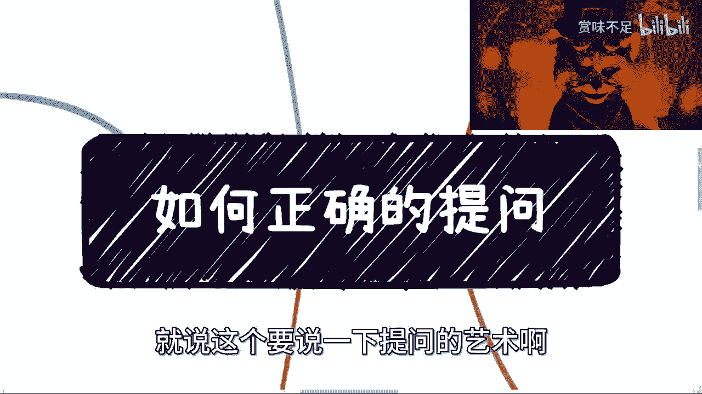


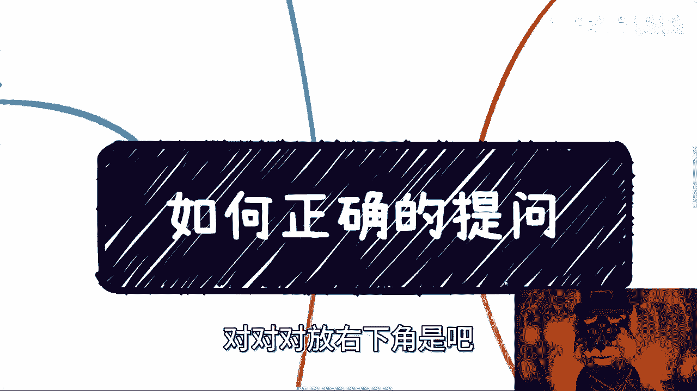

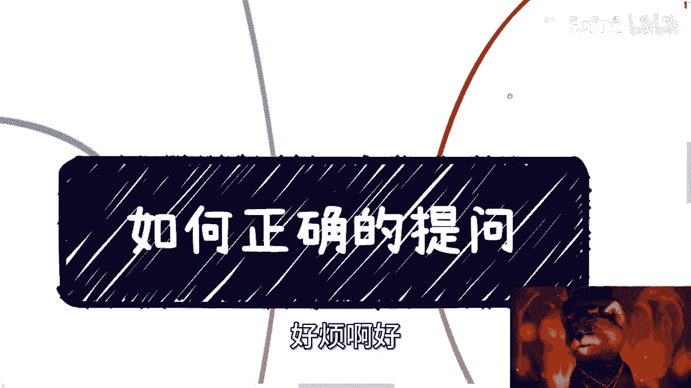

在本节课中，我们将要学习如何有效地提问。提问是获取信息、解决问题和建立合作的关键技能。一个糟糕的提问不仅浪费双方时间，还可能损害你的个人形象和机会。我们将通过分析常见的错误提问方式，来掌握高效提问的核心原则。

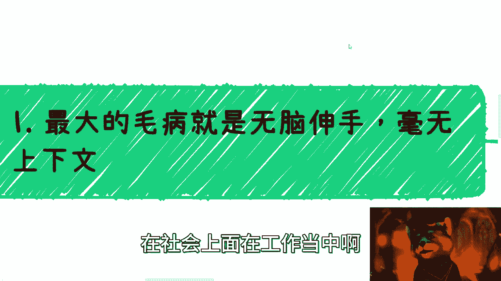

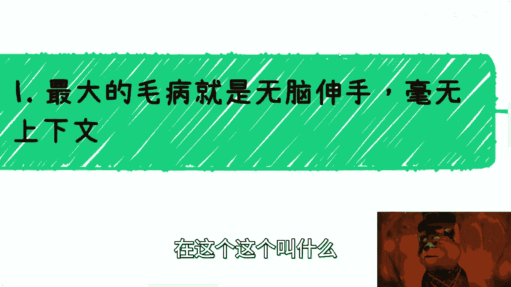

## 概述：为什么提问如此重要？

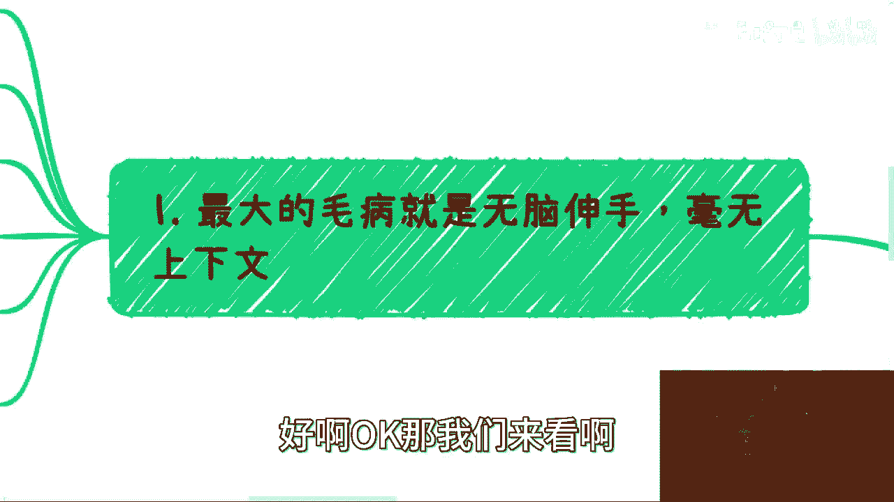

上一节我们介绍了课程主题，本节中我们来看看提问的重要性。在社会、工作和学习中，你提问的机会往往只有一次。一次低质量的提问可能导致对方将你拉黑，使你失去后续沟通和合作的可能。无效的提问损人不利己，对提问者自身也无帮助。

## 第一节：避免提出空洞宽泛的问题 🤔

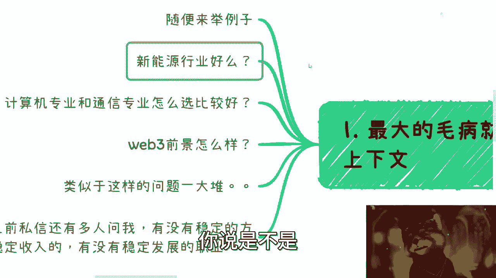

许多提问失败的第一个原因在于问题本身过于宽泛和空洞。这类问题缺乏具体的上下文和针对性，让回答者无从下手。

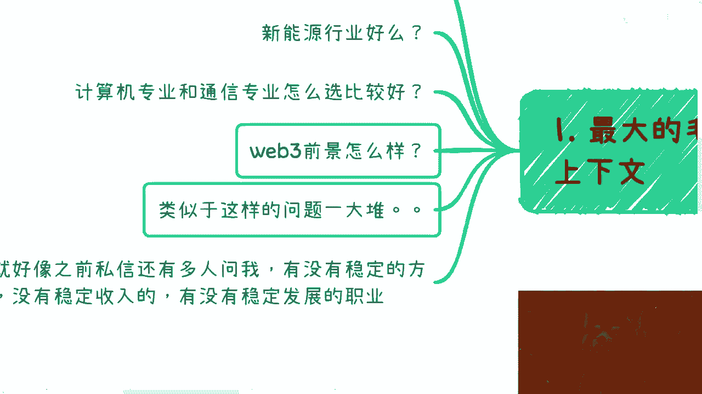

以下是几个典型的错误示例及其分析：

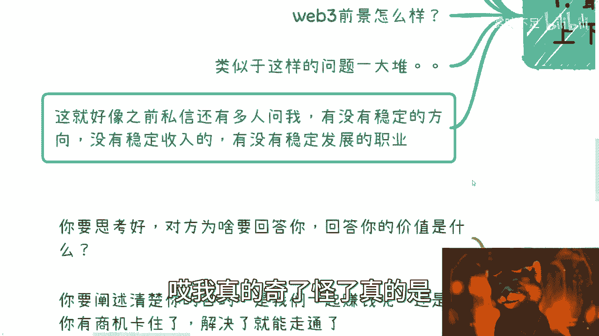

*   **错误示例1：** “新能源行业好吗？”
    *   **问题分析：** “好”的定义是什么？是就业前景、技术发展还是投资回报？没有具体角度和你的个人背景（如专业、城市、目标岗位），任何回答对你都没有实际指导意义。
*   **错误示例2：** “计算机专业和通讯专业怎么选比较好？”
    *   **问题分析：** 缺少选择者的核心信息。公式可以表示为：**有效的专业选择建议 = 你的学校 + 你的城市 + 你的兴趣 + 你的职业规划 + 市场信息**。缺失这些变量，答案没有价值。
*   **错误示例3：** “Web3前景怎么样？” 或 “有没有稳定的发展方向？”
    *   **问题分析：** 这等同于在问“如何不努力就获得成功”。如果存在人人可用的“稳定成功公式”，它就不会被公开售卖。这类问题暴露了提问者缺乏基本的调研和思考。


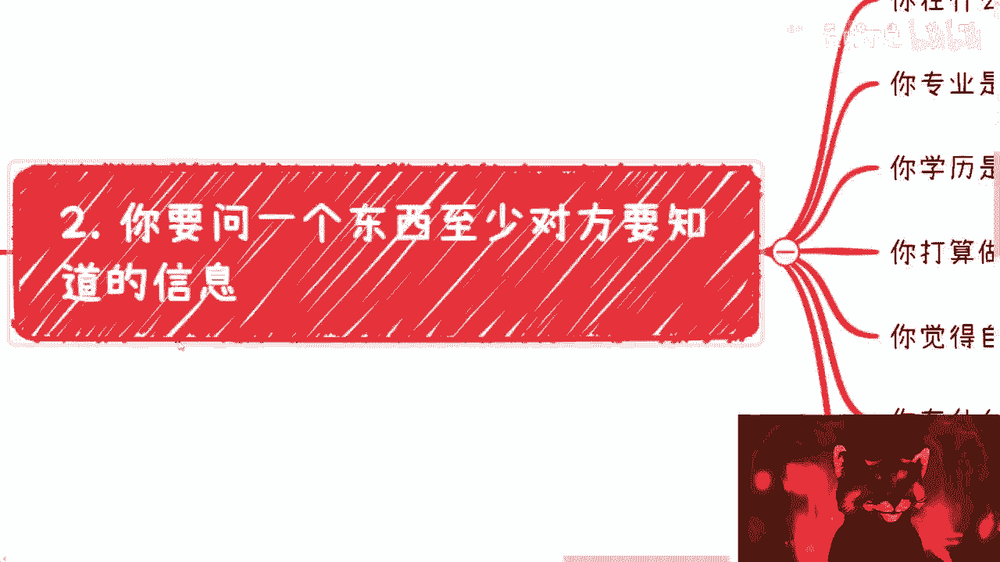

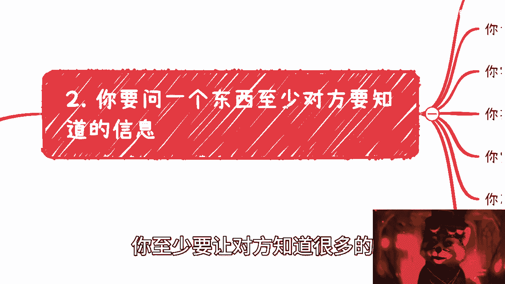

**核心要点：** 永远不要提出一个让对方需要读心术才能回答的问题。宽泛的问题只能得到宽泛或无用的答案。

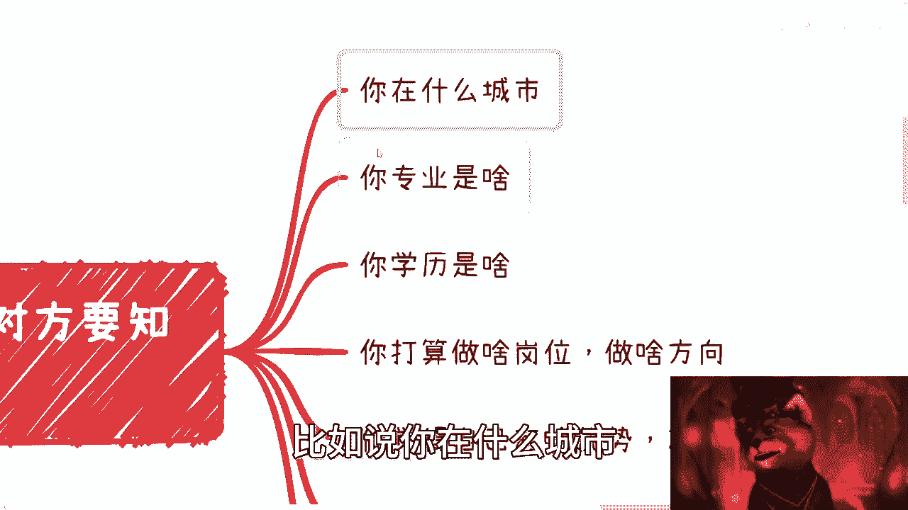

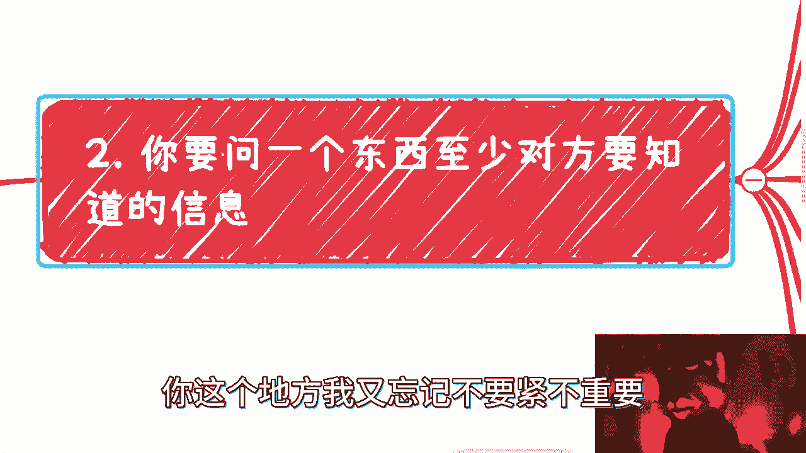

## 第二节：提供充分的上下文信息 📋

上一节我们看到了空洞问题的弊端，本节中我们来看看如何改进。一个高质量的问题必须包含足够的背景信息，让回答者能够站在你的立场进行思考。

有效的提问需要主动提供以下关键信息（不限于此）：

以下是构建问题上下文时需要包含的要素列表：

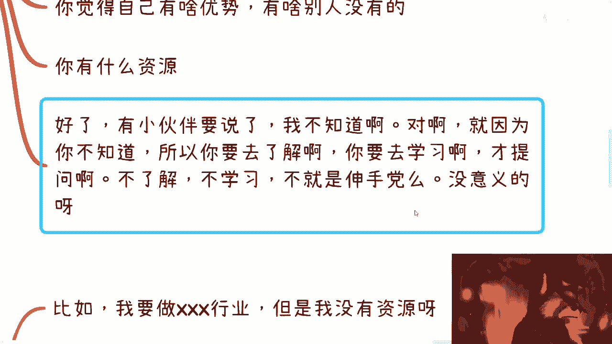

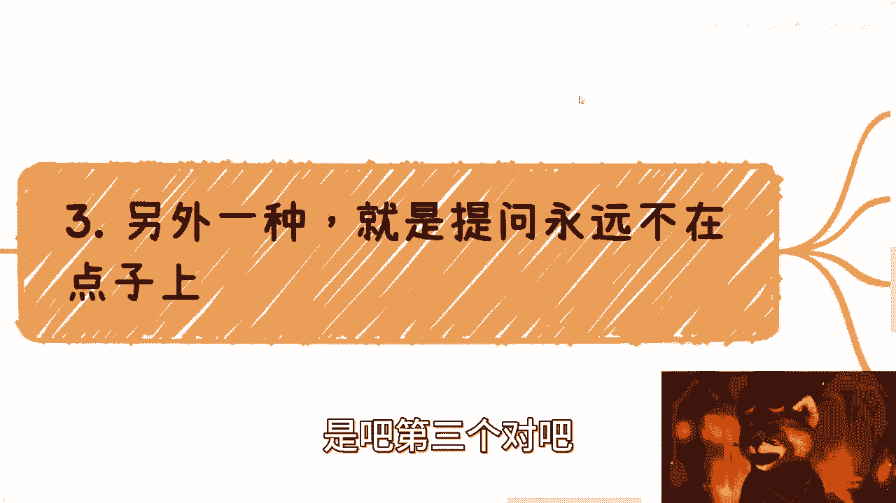

*   **个人基础信息：** 所在城市、专业、学历。
*   **个人特质与规划：** 性格类型（保守型/风险型）、目标岗位或方向。
*   **独特优势与资源：** 你具备哪些别人没有的技能、经验或资源（例如，家庭背景、行业人脉）。
*   **已进行的努力：** 针对这个问题，你已经做了哪些调研、学习或尝试？

**核心要点：** 提问前，问自己“如果我是对方，我需要哪些信息才能给出切实可行的建议？” 提供这些信息是你的责任。代码可以象征性地表示为：
```python
# 糟糕的提问函数
def bad_question():
    return “这个行业好不好？”

# 良好的提问函数
def good_question(city, major, goal, strength):
    return f”我在{city}，专业是{major}，希望从事{goal}方向。我擅长{strength}，请问针对我的情况，这个行业有哪些具体的机会和挑战？”
```

## 第三节：确保问题具体、有目的且可操作 🎯

除了提供背景，问题本身必须聚焦在具体的、可解决的“点”上，而不是模糊的“面”上。问题应直接关联你的行动和目的。

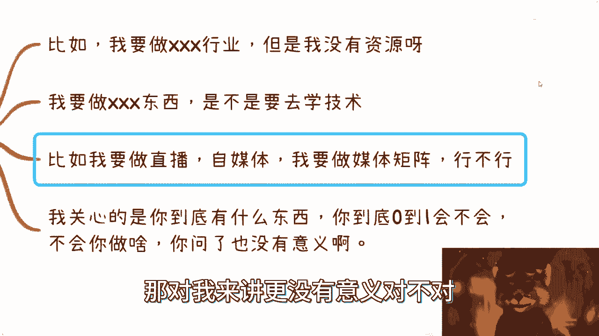

以下是几种“不在点子上”的无效问题类型：


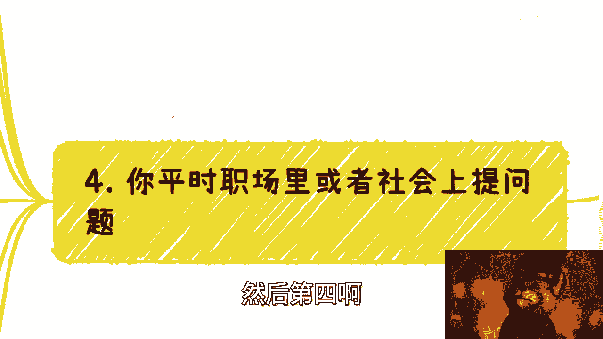

*   **类型一：只描述困境，不提出问题。**
    *   **示例：** “我想做XX行业，但没有资源。”
    *   **分析：** 你的“问题”是什么？是寻找资源渠道？是验证商业模式在无资源时是否可行？你需要的是一个具体的、可被解决的**子问题**。
*   **类型二：手段与目的脱节。**
    *   **示例：** “我要做XX，是不是该去学技术？”
    *   **分析：** 核心问题是“学技术如何帮你实现最终目的（如赚钱）？” 在没想清楚技术如何变现之前，讨论是否学习没有意义。
*   **类型三：跳过从0到1的验证。**
    *   **示例：** “我做自媒体/直播行不行？”
    *   **分析：** 真正的问题是“你凭什么能做起来？” 在没有任何实践（如起一个号、研究平台规则）的情况下，问“行不行”是空谈。商业闭环（如何赚钱）比一个空洞的“行”更重要。

**核心要点：** 提问前，确保你能清晰阐述：1. 我遇到的具体卡点是什么？2. 我期望通过解决它达到什么**具体目标**？

## 第四节：理解提问的场合与对象 🤝

在职场和社会中提问，你需要具备场景意识。你的提问方式，反映了你的思维水平和商业价值。

以下是不同场合下的提问原则：

*   **原则一：思考对方的回答动机。**
    *   对方为什么愿意花时间回答你？你的问题是否也包含了能让对方获益的信息或可能性？商业社会的本质是价值交换。
*   **原则二：明确阐述你的最终目的。**
    *   你是想寻求合作、解决项目卡点，还是获取决策建议？清晰的目的能引导对方提供更有价值的答案。
*   **原则三：认清你与对方的关系。**
    *   **在职场中：** 你的问题最好与对方的KPI或团队目标对齐，这样更容易获得支持。
    *   **在商业咨询中：** 一次结构混乱、缺乏背景的提问，足以让对方判断你缺乏执行力与合作价值，从而失去机会。
*   **原则四：珍惜每一次提问机会。**
    *   一次提问就是一次个人品牌的展示。逻辑清晰、准备充分的提问，展示的是你的专业性和可靠性，这会为你赢得更多的机会。

**核心要点：** 优秀的提问者不是“伸手党”，而是“探索者”。他们先尽己所能地调研、学习和实践，将大问题拆解为具体的、通过外部帮助能解决的小问题，然后再进行有针对性的提问。

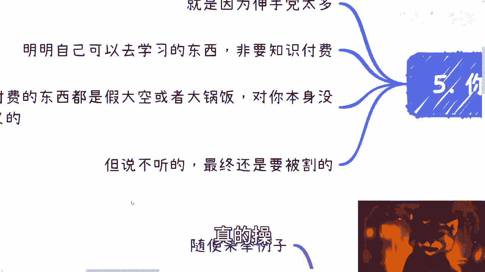

## 总结

本节课中我们一起学习了高效提问的艺术。我们分析了四类常见的提问错误：**提出空洞宽泛的问题**、**缺乏必要的上下文信息**、**问题不具体且与目的脱节**，以及**忽视提问的场合与对象关系**。

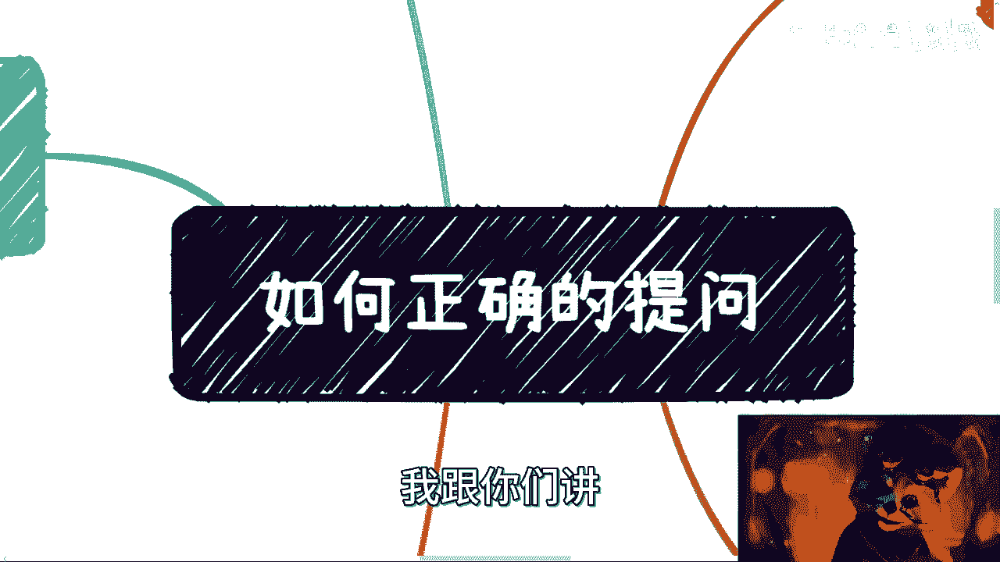

记住，一个优质的提问遵循这个核心公式：**清晰的具体问题 + 充分的个人背景 + 明确的解决目标 = 高价值答案**。掌握提问的艺术，不仅能让你更高效地获取帮助，更能向世界展示你严谨的思维和值得合作的价值。从下一次提问开始实践吧。