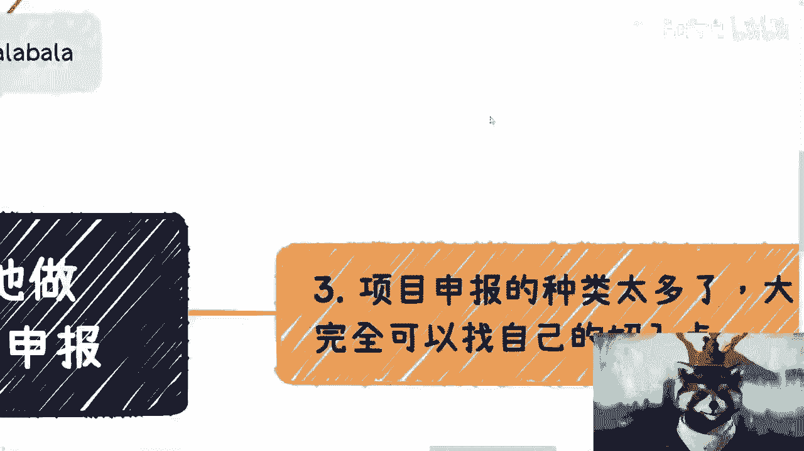
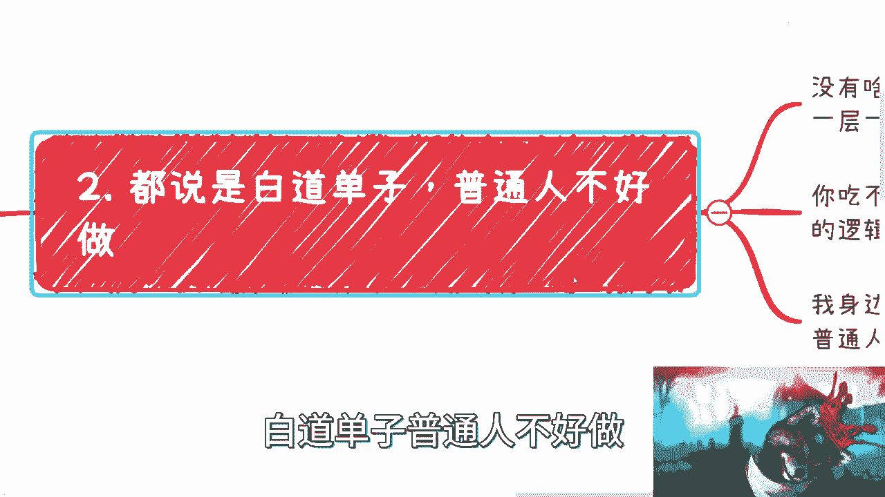
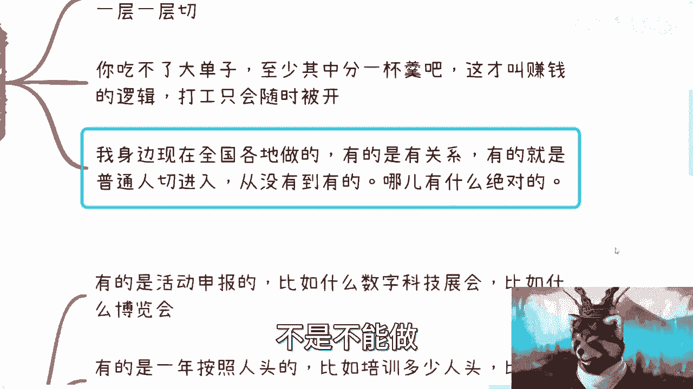
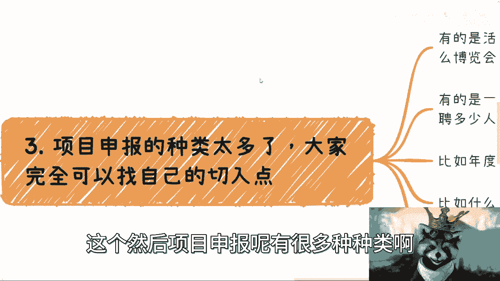
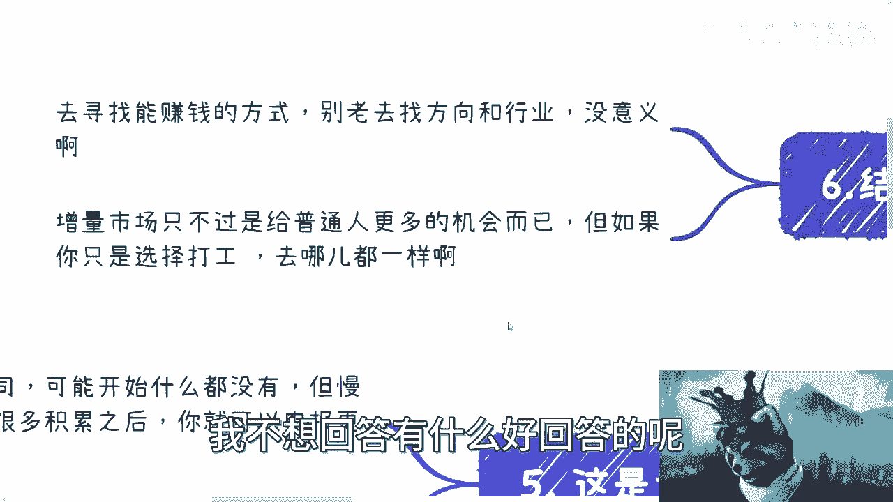

# 课程 P1：项目申报入门指南 🧭


在本节课中，我们将学习项目申报的基本概念、常见类型以及普通人如何切入并从中寻找机会。我们将摒弃空谈，专注于可操作的方法和逻辑。

## 概述

许多人对于赚钱和职业发展的认知存在局限，常常基于个别案例或短期现象做出判断。本节课程旨在打破这种思维定式，介绍一种常被忽视但切实可行的路径——项目申报。我们将探讨其运作逻辑、不同类型以及普通人如何一步步参与其中。


## 对常见认知误区的澄清


在深入探讨项目申报之前，我们需要先澄清一些常见的思维误区。许多人习惯于用孤立的、短期的节点事件来推断整个行业或职业的前景，这种逻辑是站不住脚的。

例如，用公式表示这种错误逻辑就是：
**错误推论：** `个别高薪案例 (A) → 整个行业前景好 (B)`
这个推论忽略了时间维度、个人差异和行业周期等因素。


真正的职业或商业选择，应基于对系统运作规则和长期趋势的理解，而非个别数据点。




## 项目申报的运作逻辑与机会



上一节我们澄清了认知误区，本节中我们来看看项目申报背后的核心逻辑。许多人质疑某些资金或项目的去向，但实际上，在商业和政府活动中，项目外包和资金流转是常态。

其核心逻辑在于：**许多官方或大型项目只保留核心的“名义”和“管理权”，具体的执行工作会层层外包给市场上的执行团队。** 这创造了一个巨大的增量市场。

用代码来描述这个结构可能是：
```plaintext
项目发起方（政府/大厂）
        ↓ （发包）
总包方 / 管理方
        ↓ （再分包）
二级、三级执行团队（市场机会所在）
```

普通人完全可以从最末端的执行环节切入，逐步向上积累。



## 项目申报的主要类型



理解了基本逻辑后，我们来看看项目申报有哪些具体类型。以下是几种常见的项目申报形式，大家可以根据自身资源寻找切入点。

**1. 活动类申报**
例如数字科技展、行业博览会等。这类项目通常需要策划、执行、搭建、宣传等落地服务。

**2. 按人头补贴类申报**
例如职业技能培训、人才招聘等项目，政府或基金会会按照培训或招聘的成功人数给予补贴。

**3. 年度评优与资助类申报**
这是最常见的类型，例如区、市、省级的“科技创新项目”、“文化产业发展专项资金”、“中小企业发展基金”等申报。目的是为企业争取资金、免税、场地或名誉上的支持。

## 普通人如何切入项目申报

了解了类型，下一个核心问题是：作为没有资源的普通人，具体该如何开始？以下是几个关键的切入步骤。


**第一步：寻找信息入口**
个人很难直接找到官方的项目申报入口。有效的方法是主动接触行业协会、商会、产业园区、创业孵化器等组织。这些地方往往是项目信息的集散地。

**第二步：解决“资质”问题**
没有现成的公司或案例怎么办？答案是“包装”和“整合”。你可以整合合作伙伴的资源，或从零开始包装一个小型案例。核心是扮演“资源整合者”和“拼图者”的角色。

**第三步：组建执行团队**
初期不需要养一个全职团队。采用“核心策划+外包执行”的模式。将具体的落地工作外包给专业的执行团队或自由职业者。

**第四步：保持耐心，从小做起**
这是一个需要积累的过程。不要指望第一个项目就价值千万。可以从十万、二十万的小项目开始，目标是跑通流程、积累案例和信誉，为承接更大的项目打下基础。

## 需要避免的心态与陷阱

在行动过程中，一些错误的心态会阻碍成功。我们必须识别并避免它们。

**1. 眼高手低与急于求成**
看不起小项目，总想一步登天。任何领域的积累都需要时间，项目申报更是关系与信誉的长期经营。

**2. 以讹传讹，自我设限**
未经验证就相信“普通人做不了”的传言。很多看似高端的项目，背后的执行团队都非常市场化。

**3. 混淆“打工”与“创业”逻辑**
打工的核心是出售时间，稳定性差。而项目申报属于“创业”或“副业”逻辑，核心是建立自己的业务管道和盈利模式。追问“哪个打工方向更稳定”在此语境下没有意义。

**4. 习惯性白嫖，不愿付出**
在商业世界，不懂得为信息、服务和价值付费，就很难建立有效的合作网络，也无法获得真正的成长。



## 总结

本节课中我们一起学习了项目申报这一潜在机会。
*   **核心逻辑**：理解项目外包的链条，在增量市场中寻找执行层的机会。
*   **主要类型**：认识了活动类、人头补贴类和年度评优类等申报形式。
*   **切入方法**：掌握了从寻找信息入口、包装资质、外包执行到从小做起的四步路径。
*   **心态调整**：避免了眼高手低、自我设限等陷阱，分清打工与创业的逻辑差异。

最终结论是：寻找具体**赚钱的技能和模式**比空泛地选择“行业”更重要。项目申报是一条可验证的路径，但它需要你主动出击、整合资源、耐心积累，并愿意为知识和价值付费。改变始于行动，而非抱怨。