# 不看到钱-不要干活------P1---赏味不足---BV1Em411m7gN

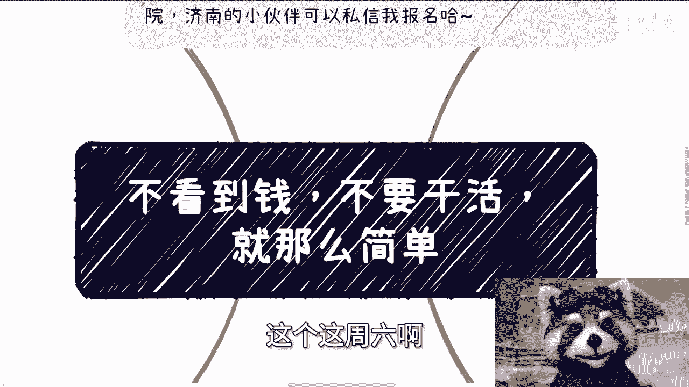

在本节课中，我们将学习一个在商业合作中保护自身利益的核心原则。这个原则简单直接，但至关重要，能帮助初学者有效识别风险，避免付出劳动却得不到回报的情况。

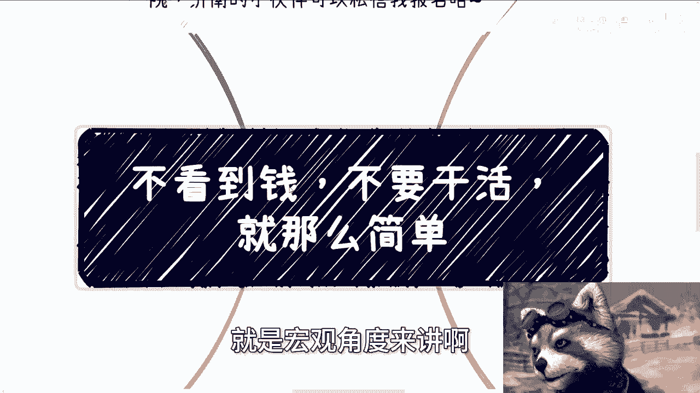

## 概述

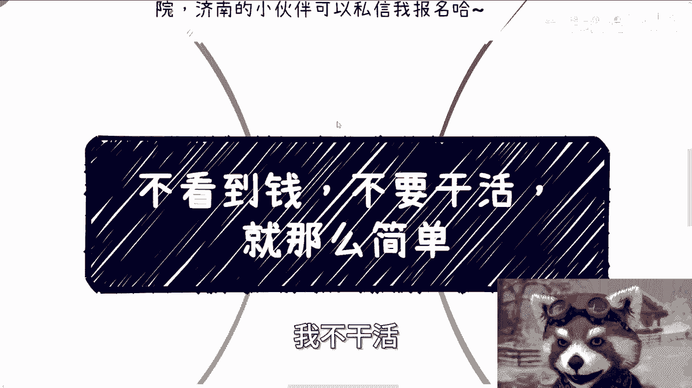

本节课的核心内容是：**不看到钱，不要干活**。我们将详细拆解这一原则，并通过具体场景分析，帮助你理解如何在实践中应用它，确保你的劳动价值得到尊重和兑现。

---

## 核心原则：不见钱，不干活 💰

上一节我们概述了课程主旨，本节中我们来看看最核心的行动准则。

宏观逻辑上，避免被坑的方法非常简单：**在没有看到付款或具有法律效力的支付承诺前，不要开始任何实质性的工作**。

**核心公式：开始工作 = 已收款 或 已签合同**

所有合作细节都应事先问清楚。在条件未满足时拒绝工作，没有任何问题。

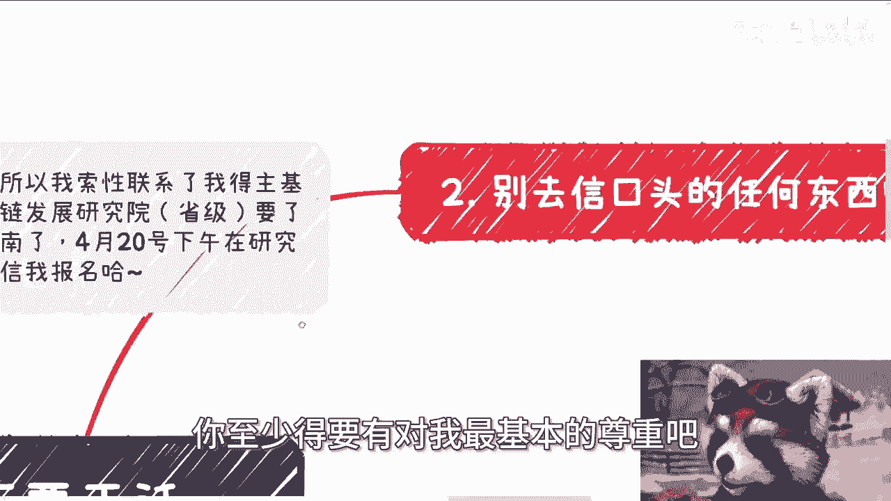

---

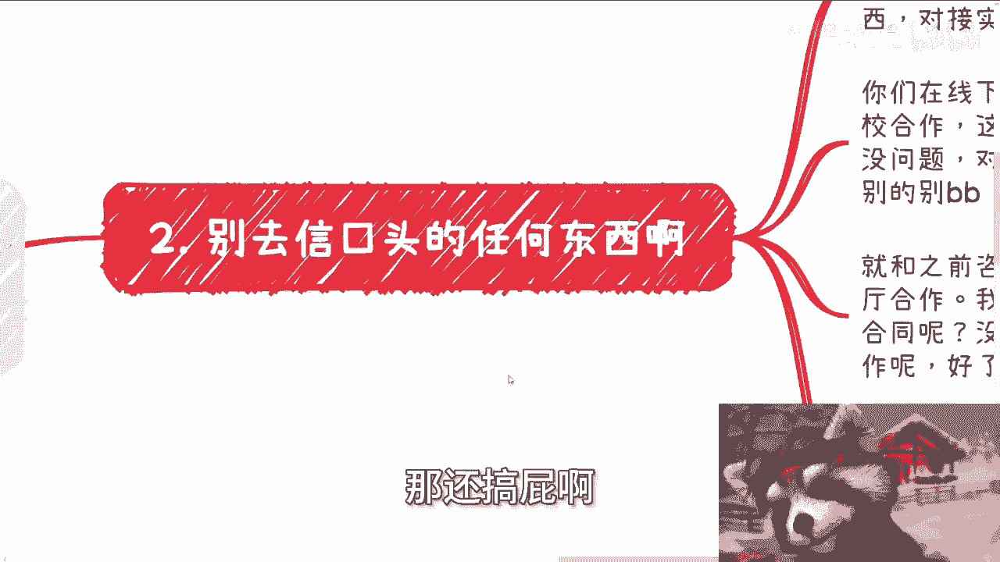

## 破除对大客户的盲目信任 🏛️

理解了核心原则后，我们来看看一个常见的认知误区。

很多人认为来自“大客户”（如企业端、政府端、高校端）的合作就一定是正规可靠的。这种想法是错误的。无论对方背景如何，你遇到不靠谱合作方的概率始终存在。我们可以用“八二原则”来理解：遇到骗子的概率可能高达八成。

背景本身不能作为信任的依据。仅凭对方口头承诺就投入工作，毫无意义。很多人因此被“白嫖”（即付出劳动但未获得报酬）。关键在于，不能仅寄希望于对方的言辞，尤其是在没有白纸黑字合同的情况下。

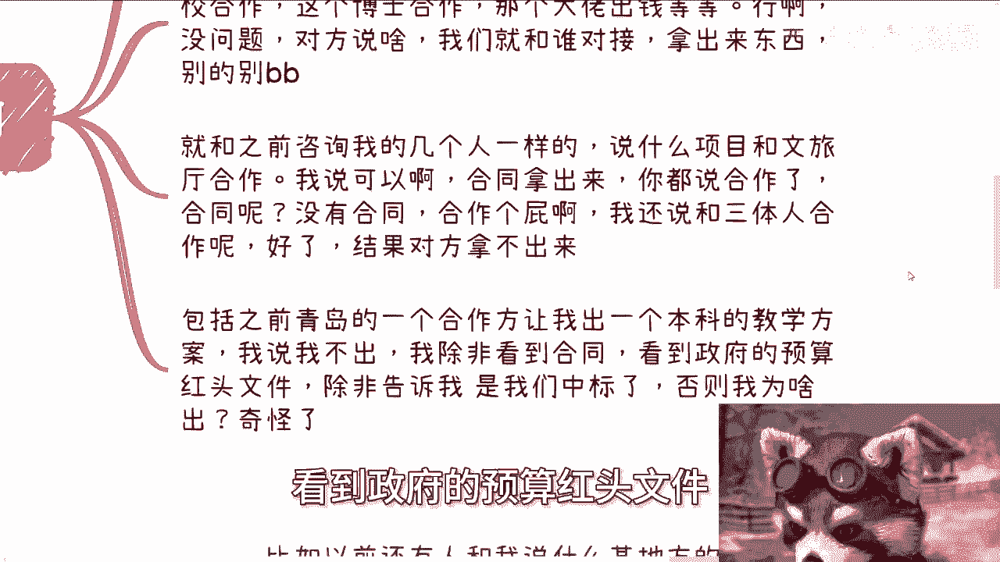

例如，对方声称与政府合作，但这与“声称与三体人合作”在证据层面上没有区别。必须要求实质性的证明。

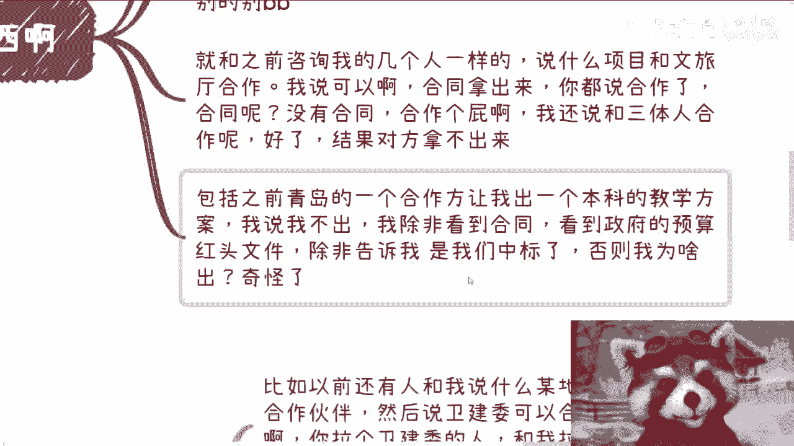

---

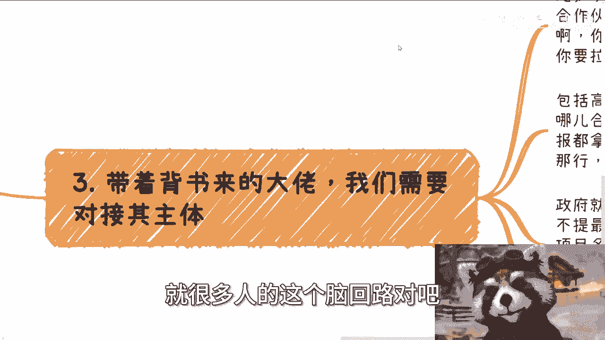

## 验证价值的三个步骤 🔍

仅仅知道原则还不够，我们需要具体的方法来验证合作方的诚意和价值。以下是三个关键步骤。

以下是验证合作真实性与自身价值的三个具体步骤：

1.  **要求预付款或合同**：劳动体现价值。如果未收到任何款项或合同保障就工作，等同于承认自己的劳动没有价值。付款可以后置，但必须签订合同，明确规定交付物、付款金额与时间。例如：`合同约定：于5月16日交付方案A，甲方支付报酬人民币10,000元`。这是对合作最基本的尊重。

2.  **拒绝空口无凭**：对于任何口头承诺，尤其是涉及“政府背书”、“高校合作”、“专家参与”的项目，必须要求对接实质性的人和物。要求对方提供具体对接人、部门、合同或盖章文件。如果对方无法提供，则无需继续沟通。

3.  **对接真实主体**：对于声称有背书的“中间人”，必须要求与背书方（如政府具体部门、高校负责人）建立三方沟通。如果对方无法促成三方会议，则说明其关系或权限存疑。合作方是个人行为还是机构行为，性质完全不同。

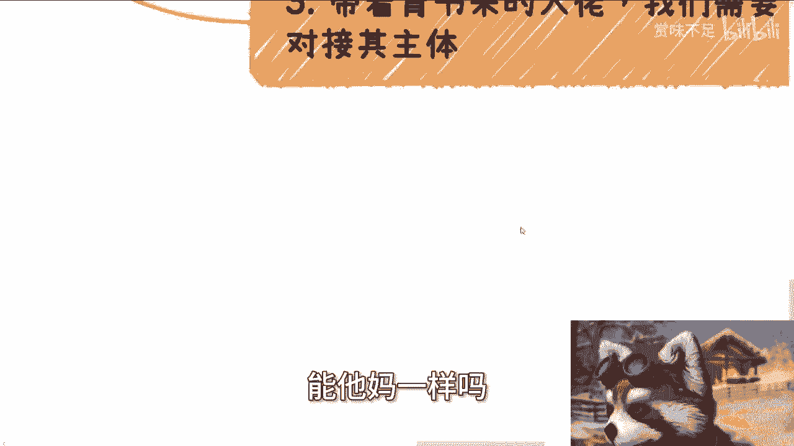

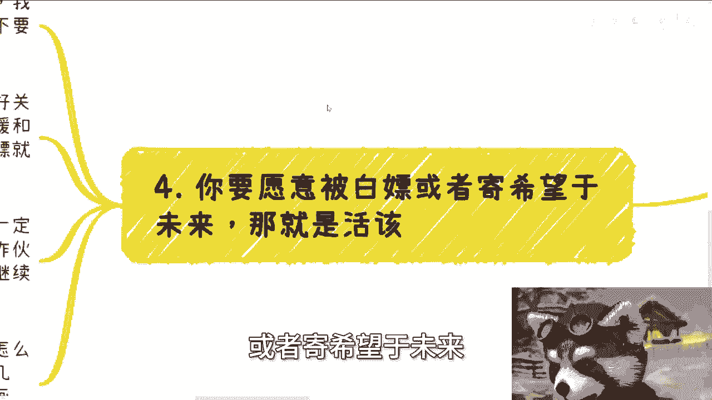

---

## 区分关系与商业 🚫

在商业合作中，混淆人情关系与商业规则是危险的。本节我们来厘清二者的区别。

有些人认为需要通过“搞好关系”、“让领导开心”来获得项目。但这与能否收到钱没有因果关系。商业合作的核心是等价交换。

搞好关系不等于能保障项目付款。过度让步可能让对方认为你是可以“白嫖”的软柿子。同样，对于声称“几年后才有回报”的项目，如果对方无法出示当前阶段具有约束力的政府文件或合同，则风险极高。不要用未来的空头支票，换取当下的无偿劳动。

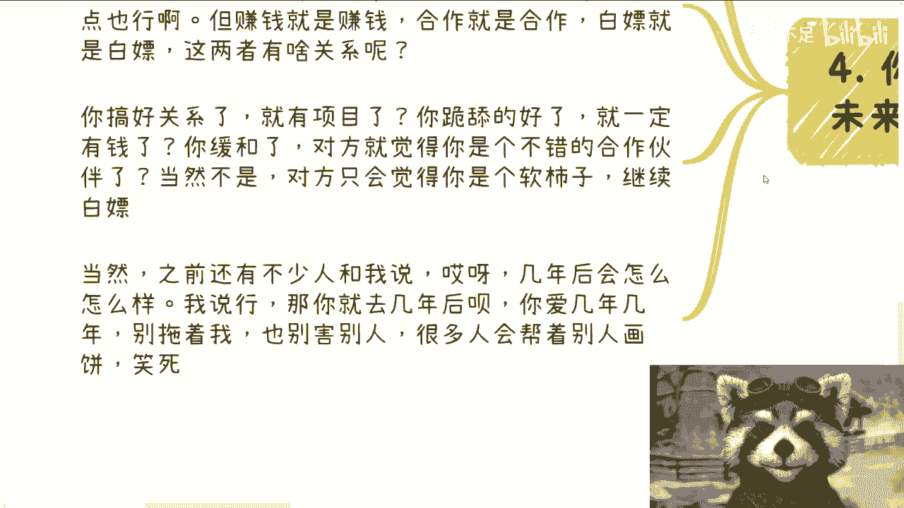

---

## 总结

本节课中我们一起学习了商业自保的核心原则“不看到钱，不要干活”。我们拆解了盲目信任大客户的误区，并掌握了三个验证步骤：**要求预付款或合同**、**拒绝空口无凭**、**对接真实主体**。最后，我们明确了必须严格区分人情关系与商业合作，坚守自身劳动价值，避免被不切实际的承诺所损害。

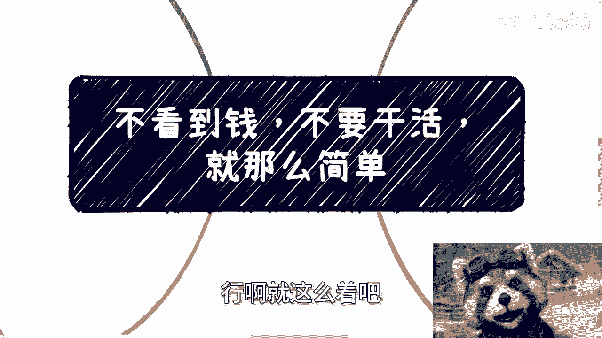

记住，认可自己的价值，并要求对方以尊重的方式（合同或付款）来兑现这份价值，是健康合作的基础。