# 商业思维课 01：超越“赚钱”的生意本质 💰

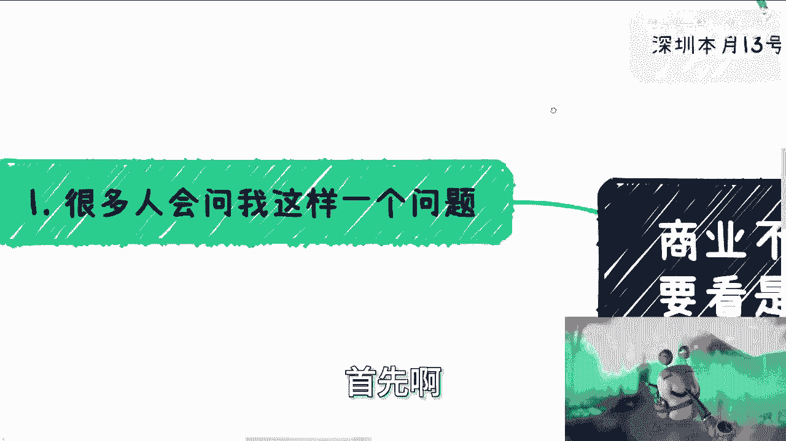

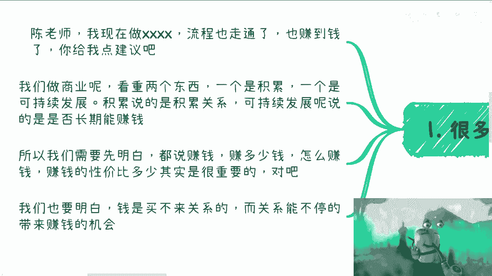

在本节课中，我们将要学习一个非常关键但常被误解的商业概念：评估一项生意，不能只看它是否赚钱，更要看它是否“过家家”以及性价比是否高。我们将深入探讨这两个核心维度，帮助你建立更长远、更可持续的商业思维。

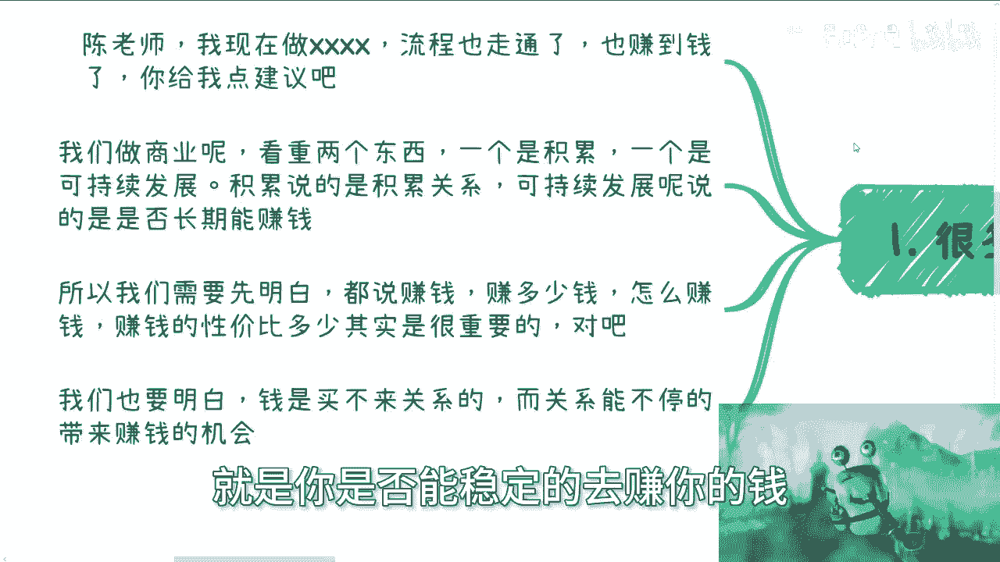

## 概述：商业的核心是什么？

很多人会问这样一个问题：“我的业务流程走通了，也赚到钱了，你有什么建议？” 这引出了我们做商业时最应看重的两件事：**积累**和**可持续发展**。

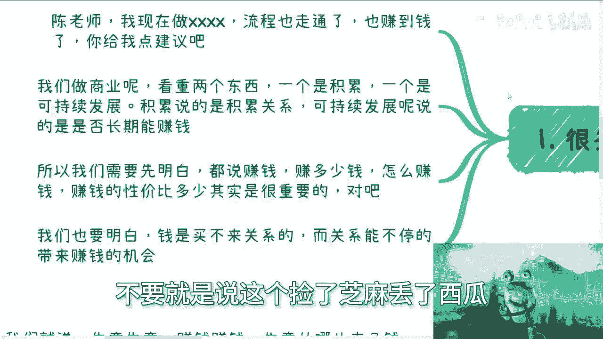

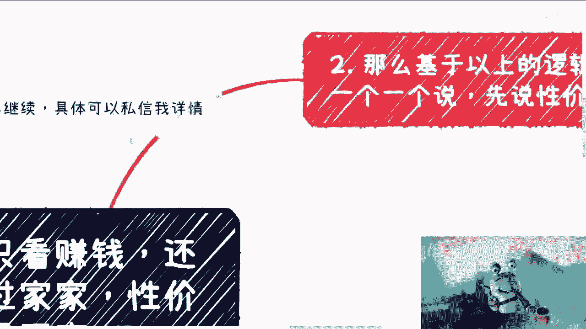

上一节我们介绍了课程的核心主题，本节中我们来看看这两个核心概念的具体含义。

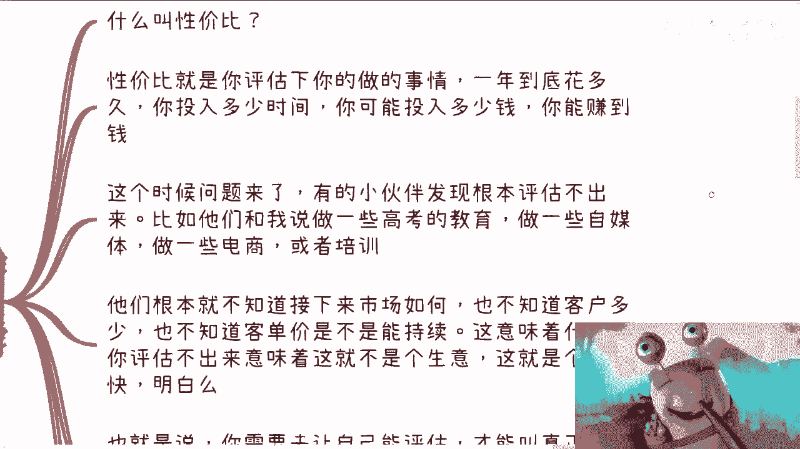

*   **积累**：积累的不是钱，而是**关系**。这包括你的上下游合作伙伴、你的行业背书等。
*   **可持续发展**：指的是你能否长期、稳定地与他人合作并持续赚钱。

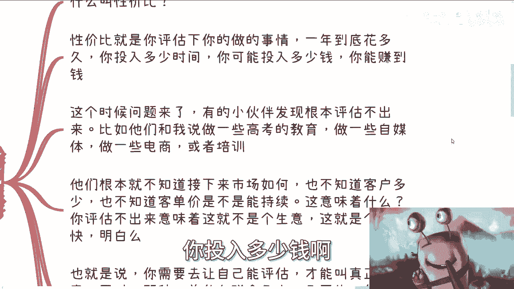

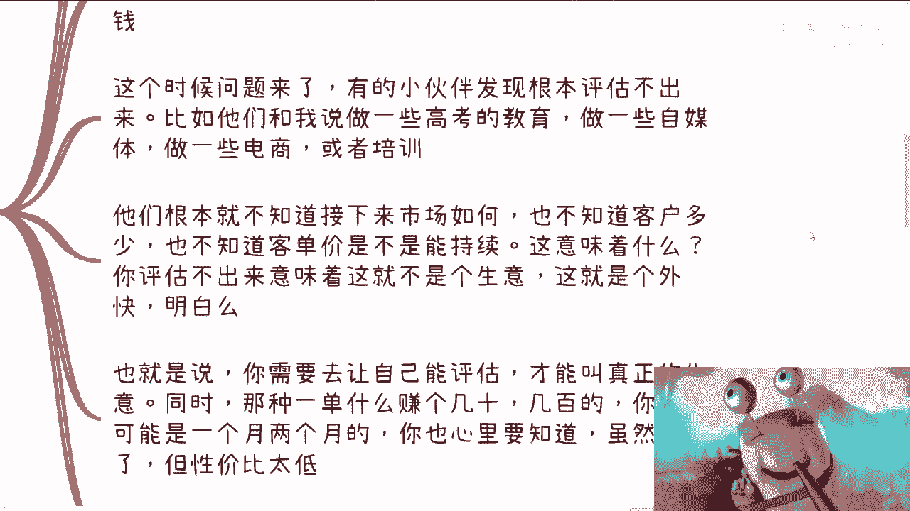

所以，我们必须明白，同样是“赚钱”，但赚多少钱、如何赚钱、以及投入产出比是多少，这些细节至关重要。钱买不来关系，但关系却能持续带来赚钱的机会，这是单向的、不可逆的。所谓格局，就是在每次合作中，要分清你究竟是为了眼前的钱，还是为了长远的“人”和“关系”。

## 第一核心：评估性价比

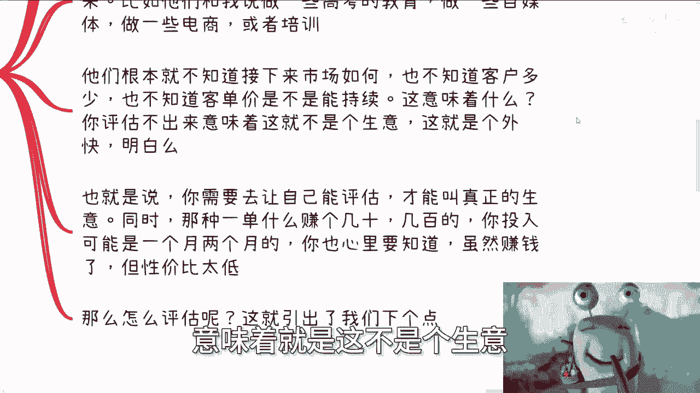

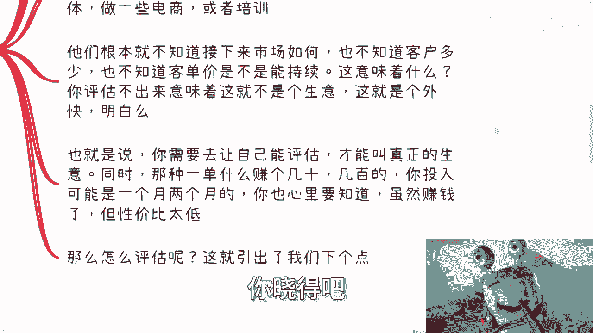

基于以上逻辑，我们先来探讨第一个核心点：**性价比**。

性价比要求你去评估你所做的事情。以下是评估时需要考量的几个方面：

*   你投入了多少时间？
*   你投入了多少钱？（如果涉及资金投入）
*   你能赚到多少钱？

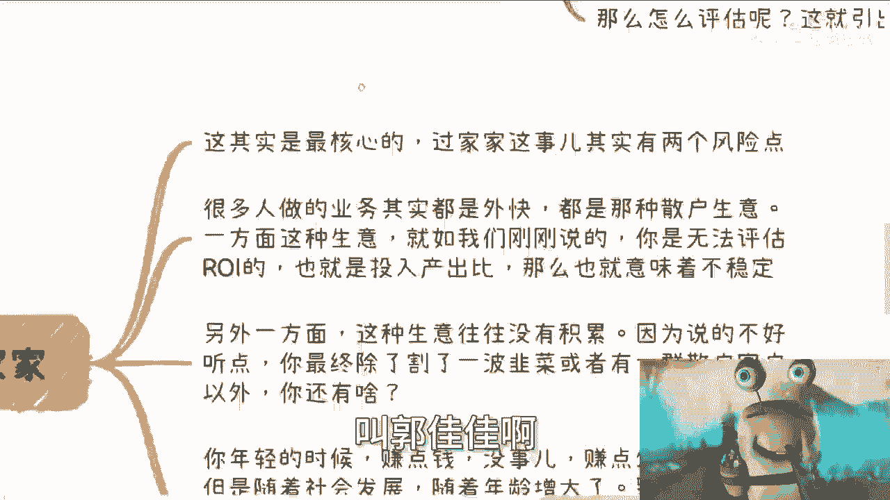

然而，问题在于，许多做“外快”或“快钱”生意的人（如高考教育、自媒体、电商、培训等）往往无法评估这些。他们不清楚市场容量、客户数量或客单价的持续性。这意味着他们无法计算投入产出比，也意味着这本质上不是一个稳定的“生意”，而只是一次性的“外快”。

真正的生意需要你能进行清晰的评估。例如，一个投入一两个月、每单赚几十或几百块的业务，如果你无法预估能做多少单，那么即使赚钱，其**性价比**也可能不高。一个简单的衡量标准是：如果你创业一年，投入的时间与打工相当，赚的钱却不如打工多，那这生意就值得商榷。

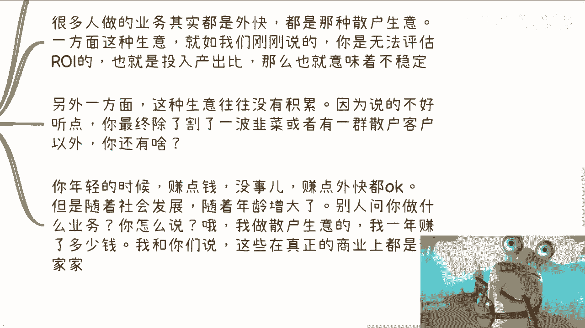

## 第二核心：识别“过家家”式生意

如何评估性价比，引出了我们下一个核心点：**是否“过家家”**。

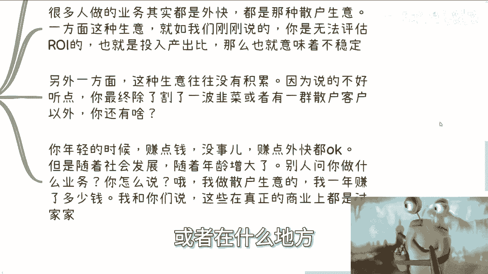

“过家家”是许多人在赚钱时无意识陷入的状态，它主要带来两大风险：

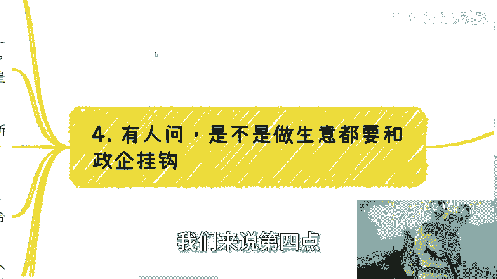

1.  **无法评估与不稳定**：这类生意（通常是面向散户的C端生意）的投入产出比（**ROI**）难以评估，导致业务本身极不稳定（**unstable**）。
2.  **缺乏积累**：即使你能持续从散户身上赚钱，随着年龄增长和社会角色变化，这类生意缺乏有价值的积累。你没有建立起稳固的合作伙伴、上下游关系或行业背书。在真正的商业世界看来，这更像是“割韭菜”或经营一个粉丝社群，其价值有限。

## 真正的商业：超越“过家家”

那么，什么才不是“过家家”呢？真正的、可持续的生意往往需要与拥有社会地位和政治地位的机构挂钩，例如**政府（G）、企业（B）、高校（U）**。

这些机构在寻求合作时，通常关心以下三点，而非单纯的“赚钱能力”：

1.  **政治正确与经验**：你是否与同等级别的单位合作过？是否拥有政企高校的合作经验与案例？这代表你懂得规矩，不会乱说话。
2.  **商业运作能力**：你是否懂得正规的商业合作流程，如合同签订、股东权益等？仅仅懂得向C端赚钱是远远不够的。
3.  **互补的资源网络**：你代表的不仅是你个人，更是你背后的资源网络。对方看中的往往是你所能连接的合作方与机构。

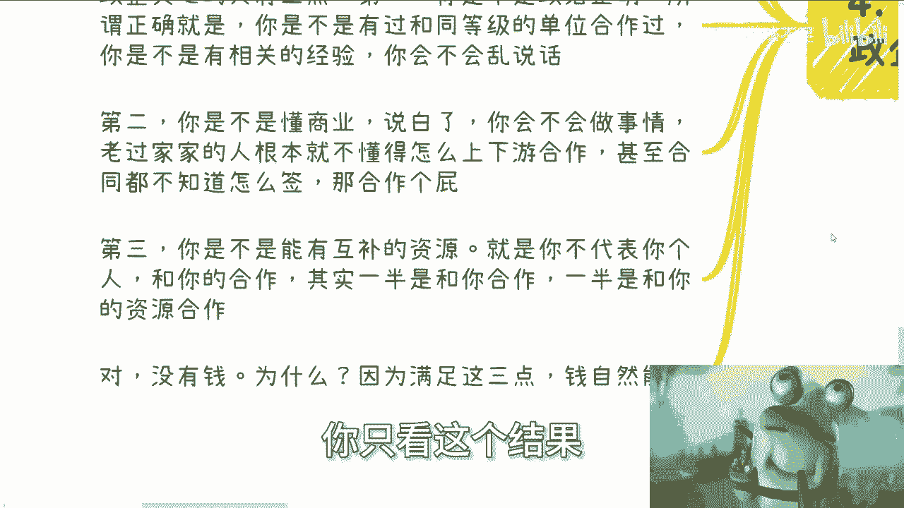

你会发现，以上三点都没有直接提到“钱”。因为满足这三点，钱自然会来。**钱只是一个结果，而我们不应只盯着结果**。

## 总结与行动建议

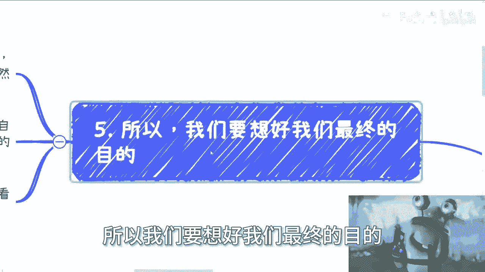

本节课中我们一起学习了评估生意的两个核心维度：性价比和是否“过家家”。

回到最初的问题：当你的业务走通并开始赚钱时，最大的建议是什么？答案是：**有意识地去积累**。

你现在能赚到钱，但未来怎么办？如果你不懂商业、不懂股份、不懂政企运作，那这只能算是“外快”。外快依赖于天时地利，是点状的收入，缺乏积累和持续性。

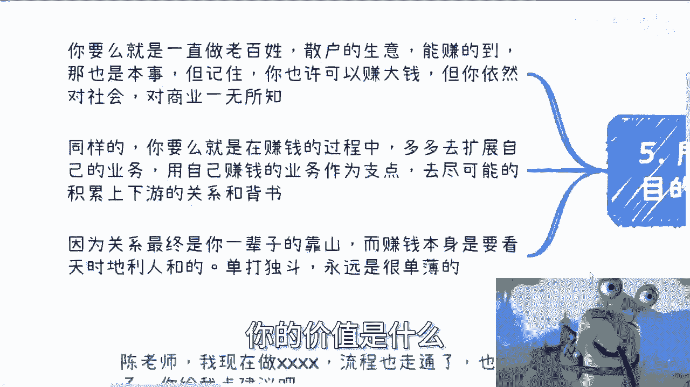

因此，你需要想清楚最终目的：

*   要么，你决定一直做面向老百姓的C端生意，并确保能持续赚大钱（这需要极强的本事）。
*   要么，更建议你在赚钱的过程中，以现有业务为支点，主动向**政府（G）、企业（B）、高校（U）** 靠拢，去积累你的背书与关系。这些才是未来能为你带来更多项目和财富的基础。

**关系是你一辈子的靠山，是向前发展的根本基石。** 赚钱本身要看时机，但若没有关系的积累，年纪增长后仍会陷入单打独斗的困境。你的社会价值，在于你能牵动多少资源与关系，而不在于你拥有多少粉丝或短期赚了多少钱。这是商业社会中亘古不变的道理。

赚钱只是一个过程和结果，**过程（积累）才是最重要的**。希望本课能帮助你分清主次，建立更长远的商业视野。