# 不能只看赚钱，还要看是是否过家家和性价比是否高 - P1 - 赏味不足 - BV12C4y1N76s

啊大家好啊，首先深圳这个月啊1月13号活动继续报名，呃，具体可以私信我，详情好吧，呃，那么本期呢，我们主要讲的是一个非常非常关键的东西啊，很多人真的我觉得他们分不清楚啊，叫做什么呢，商业啊。

做商业你不能只看赚钱，什么意思啊，你还要看是否过家家和性价比是否高，这两件事情是核心，你赚钱没有卵用，用没有啊，首先啊很多人都会问我这么一个问题。

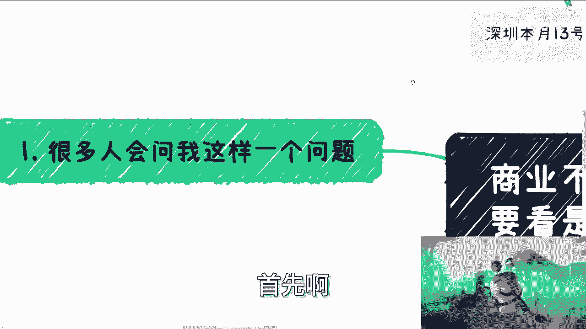

他说陈老师，我现在做一个业务业，流程也走通了，也赚到钱了，然后他就问我，他说你有什么。

他说你有什么建议啊，我这么说，我们做商业啊，看中两件东西，一个是积累，一个是可持续发展呃，所谓积累，积累的不是钱啊，积累的是关系啊，所谓关系就是你上下游，你的合作伙伴，你的背书啊，可持续发展是什么意思。

指的是你是否能够长期的跟别人合作啊，或者说是否能长期的赚钱，或者说通俗的来讲，就是你是否能稳定的去赚你的钱是吧。

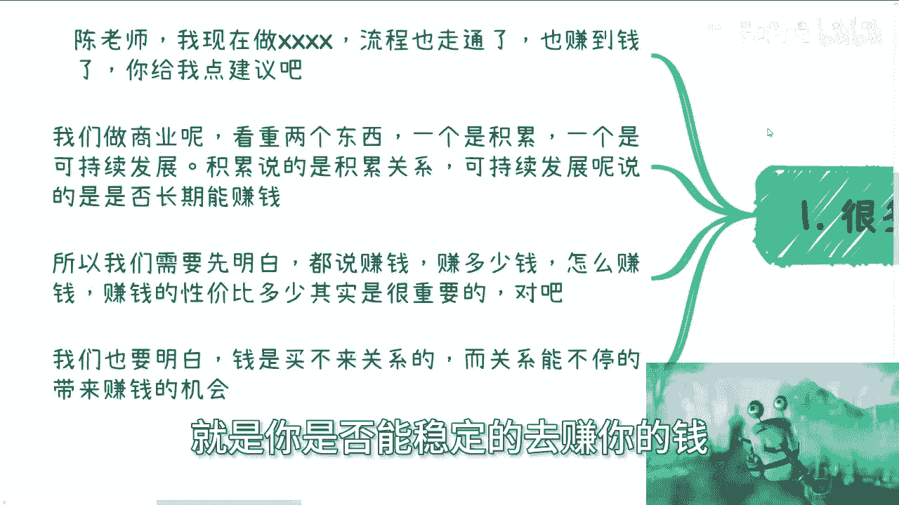

好那么所以啊我们首先先得明白，都说赚钱，但是你赚多少钱，怎么赚钱，以及你的投入产出比是多少，这很重要对吧，你赚钱他也赚钱，那你赚钱跟他赚钱是一个赚钱吗，不是对不对，好另外一方面呢我们也得明白钱啊。

核心是什么，就是钱是买不来关系的，而关系是能不停地带来赚钱的机会的啊，这是不可逆的，它不是双向的，所以说很多时候你我们说格局，什么叫格局，就是你要明白每每一次的合作，你到底是为了钱，还是为了这个人啊。

还是为了这个关系，你得去搞清楚啊，不要就是说这个捡了芝麻丢了西瓜。

对不对，好。

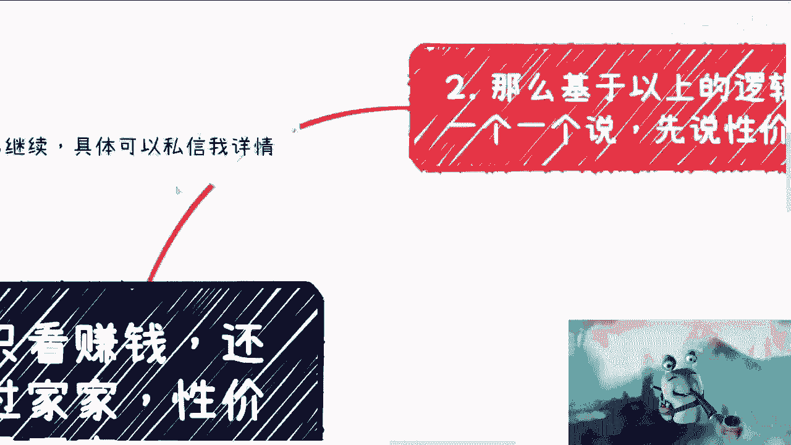

首先是第一点，第二点，那么基于以上的逻辑，我们来一个说，首先先说性价比，什么叫性价比啊，性价比就是说你要去评估，你做的事情哎呀这个小蜗牛放大放大放大。

这样，呃你要是评估你做的事情什么意思。

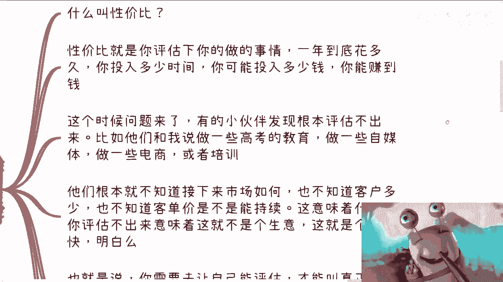

什么叫怎么评估，一年到底花多久，花多少时间，你投入多少钱啊。

假设你投入钱的话啊，你投入多少钱，以及你能赚到多少钱，好这时候问题来了，我跟你们说，大部分的人他做一些外快的生意啊。

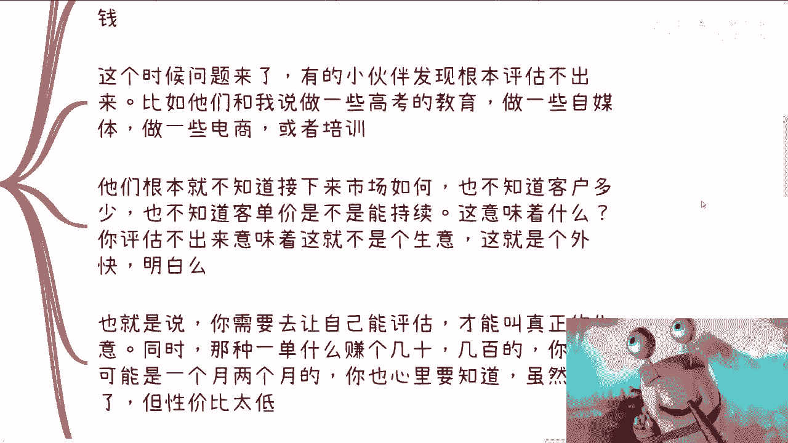

赚一些快钱，他就会发现，就是我问他们的时候，他们就说这怎么评估的，评估不出来的呀，对不对，你比如说他说他跟我讲，他说做一些高考的教育，做一些自媒体，做一些电商或者培训，这怎么评估了。

我怎么知道能能拉多少人啊，对不对啊，然后我就会跟他们说，你们叫做什么，用上海话来讲，就是还不够啊，菜鸟屋啊，什么意思呢，就是说你们他们根本就不知道接下来市场如何，也不知道客户多少。

也不知道客单价如何持续，那怎么那意味着什么呢，意味着就是你评估不出来，意味着就是这不是个生意。

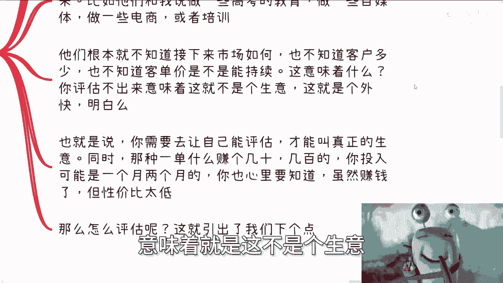

这就是个外快，你晓得吧啊你晓得吧是吧。

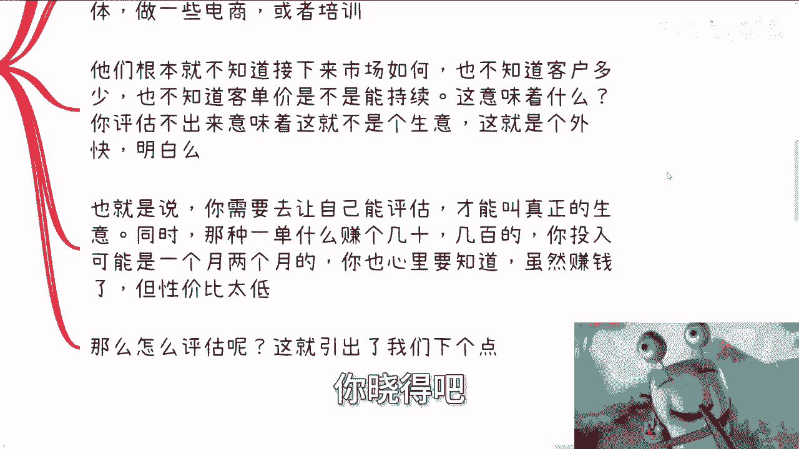

哦那也就是说你需要咳咳咳，你需要能让自己去评估，这才叫真正的生意，但是问题是同样的那种什么一单赚几十块，几百块的，你投入可能一个月两个月，你到我，然后我问你，我说你投入一个月两个月，你可能做几单。

你说我不知道，我可能做十单，也有可能做100单，那么你就必须心里知道，就虽然你赚钱了，但它性价比不高啊对吧，就是我们以前一直开玩笑啊，就是跟别人做生意的，就开玩笑说什么，就说你出来做生意。

如果你一年赚的钱，投入时间跟人家打工的差不多，你赚的钱还没人家打工多，那赚个屁呀。

对不对啊，那么怎么评估呢啊这就引出了我们下一个点啊。

叫郭嘉嘉啊。

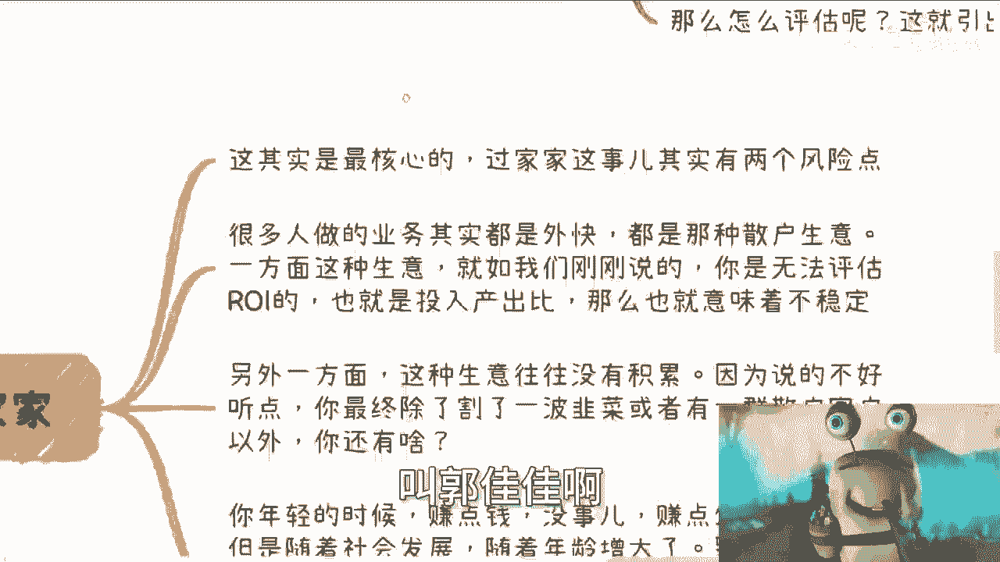

什么意思呢，就是说过家家与否，这就是最核心的，因为过家家这件事情，其实是大部分人赚钱时候做的事情，但他们没有意识，为什么，因为他们分不清楚什么叫过家家，什么叫不叫过家家啊，过家家这个事其实有两大风险点。

第一点是什么，就是很多人做业务，它其实都是个外快啊，都是那种散户的声音，我们称之为C端的声音，对不对，那么一方面这种生意就如我们刚刚说的，你是没有办法评估ROI的，所谓ROI就是投入产出比对吧。

那么你评估不入，评估不了投入产出名，那么就意味着这件事情是unstable的，对不对，好，那么另外一方面就是咳咳，稍等我回个回个微信啊，哎呀。

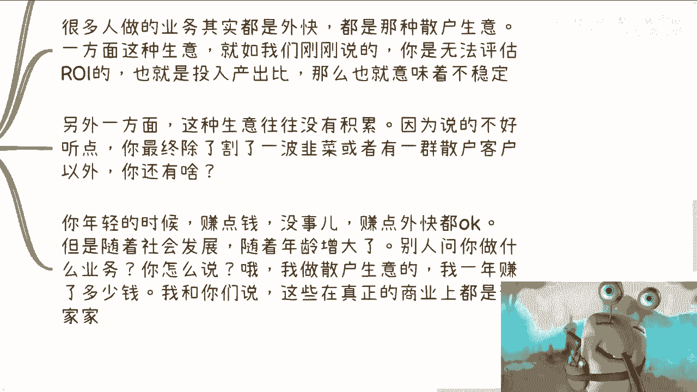

对不对啊，那么好，你们继续啊，然后第二个是什么，就是另外一方面，你这种生意往往没有积累对吧，就是说因为你想啊，你一直赚钱，我假设你一直赚钱，你一直赚散户的钱，但是你赚的年纪轻的时候没问题啊。

但是你做做做做到后面你有积累吗，就是你有没有你的合作伙伴，你有没有就是你的上下游啊，你有没有你的背书，没有对吧，就是说你说的不好听点，叫做你最终割了一波韭菜，说的好听点，就是你有一群散户的社群。

但是你有这些东西以外，你还有什么呢对吧，就是说你年轻的时候，你赚点钱没事，赚点外快都OK，但是随着社会的发展，随着年龄的增增长增长，别人问你做什么，你怎么说哦，我做散户生意的啊。

我一年赚了几百万几千万啊，我跟你们说对吧，怎么样怎么样怎么样，就是我我我比如说我在抖音上面，或者在什么地方。

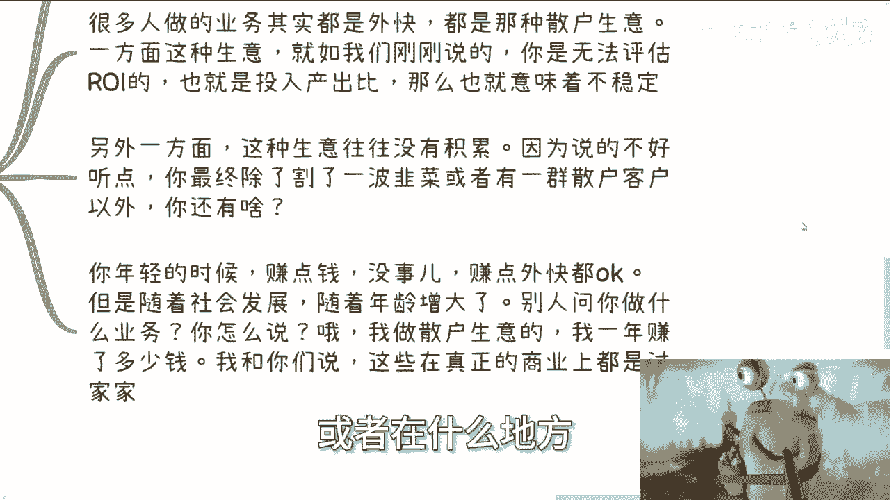

我是个网红对吧等等等，我告诉你们，这些东西在身真正的商业面前都他妈是过家家，都是啊，或者说不能说更更多的是毫无价值，为什么有很多人说，那为什么呢，他说我赚到钱了，为什么没有价值呢，对吧好啧。

我们来说第四点。

你做生意是不是都要跟政企挂钩，对吧好你看啊，我们就说所谓生意，生意赚钱赚钱，生意从哪来钱从哪来，你想想看，你想想看生意从哪来钱从哪来对吧，就是你不走企业，不走政府，不走高校，不走一些拥有社会地位。

政治地位的机构，你做什么生意，你想想看你这些生意如何稳定，你如何能称得上生意对吧，就说白了就是我之前说的，如果今天我给你们，就是在你们的发展当中，有人给你们介绍一些领导，或者正好有些有些好的机会。

大家介绍业务，你怎么介绍哦，哎那个陈总啊，你好啊，我办了几场几千场活动，还是说哎陈总你好，我是清北毕业的，还是说哎那个陈总你好，我是那个知乎或者什么地方的这个网红啊，我一年赚了多少钱，有多少粉丝。

有用吗，没有用的，为什么，因为没人关心，你知道吗，因为这些事情在商业在生意面前都是过家家，为什么，因为商业真正的商业，真正的这个政企，他只关心三点，第一你是不是政治正确，所谓政治正确就是。

你是不是跟同等级的单位合作过，你是不是拥有政企高效的合作经验，你是不是有相关的这个这个这个这个这个案例，那么这代表着什么，代表着你懂不懂怎么说话，你会不会乱说话对吧，第二你懂不懂商业。

说白了就是你你会不会做事情，因为你老过家家，你老针对C端，你甚至都不知道大家怎么合作的，你甚至都不知道合同怎么签，你甚至都不知道，就是说大家股东之间应该怎么做，你知道个啥啊，不是说你懂得赚钱就有用的。

没有用的。

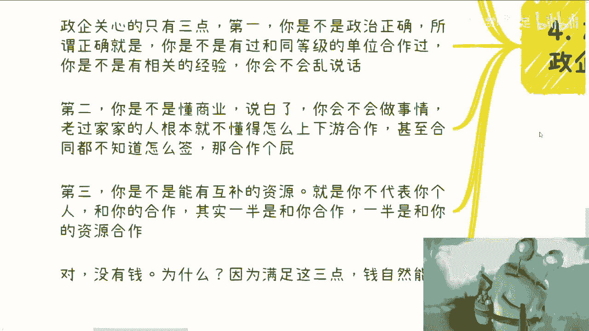

你懂吗啊，第三你是不是能有互补的资源，也就是说你代表的不是你，你懂吗，就是说比如说很你那个政府企业高校找我对吧，他找的不是我陈老师，他一半是希望我给他去工作对吧，或者希望我给他去做这个服务没错。

但是还有一半他看重的是我背后的资源，他看中的是我的合作方，咳咳对吧，我跟他们讲，哎我拿的出来的，比如说我跟很多机构有合作，我跟很多的市级协会有合作，我跟很多的地方政府有合作，他们看中的是这个对吧好。

然后你会发现我说的三点里面有钱吗，没有有赚钱吗，没有为什么，因为你满足这三点钱自然能来呀，钱只是个结果，而我们不能只看这个结果，你只看这个结果。

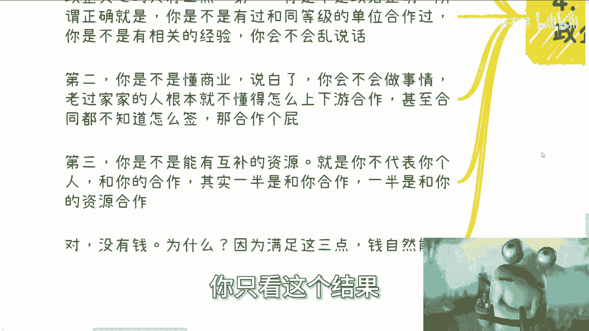

你毫无积累对吧，好，我们我们我们回到我们回到这第一点啊。

你说回到他们问我的，他说陈老师，我现在做什么什么什么流程走通了也赚到钱，你给我点建议，我觉得最大的建议是什么，就是你得有意识的去积累，你现在能赚到钱，你以后怎么办对吧，你懂商业吗，你不懂，你懂股份吗。

你也不懂，你懂政企怎么运作嘛，你也不懂，那你做什么东西啊对吧，你这个叫赚外快对吧。

那么你让我给什么建议，我的建议就是尽可能的要往上面靠，因为你不靠你的外快，什么叫外快，外快就是所谓的就是天时地利，人和点状的去赚钱这些东西，那我们就说有积累吗，没有有持续发展吗，没有，那你那你做啥对吧。

所以我们要想好我们最终的目的。

什么意思呢，就是你要么你就说我就一直做老百姓，做散户的生意对吧，你要但凡一直能赚到，那也是你本事，我觉得没毛病的，我们不能一刀切说你是赚不到，对不对，但是你记住你也许能赚大钱，但是你依然对社会。

对商业一无所知的，你懂吗，那同样的，你要么就是在赚钱过程当中，多多去拓展自己的业务，用自己赚钱的业务，因为你赚钱的业务一定是有价值的，只不过这个价值是多是少的问题对吧，那么你用你自己赚钱业务作为支点。

要去尽可能的去找我们说拥有社会地位，或者说拥有政治地位，或者说去找这种政企，找高校去积累你的倍数跟关系，因为这些东西是能够在未来给你带来更多的case，跟更多的钱的一个前提条件。

而不是说你说我割了多少韭菜，或者我做了多少C端生意，没有用的啊，因为关系最终是你一辈子的靠山啊，是你往前走的最根本的，一个一个一个一个一个基础，而赚钱本身其实是要看天时地利人和的，但是你单纯的赚到钱。

你没有关系，没有上下游不去积累，你等你年纪大了，你还是单打独斗，没有用的，对不对，你想想看你在社会上面你的价值是什么。

你的价值是什么，你的价值不就是你到底背后能牵动多少资源，能牵动多少关系吗，对不对，你价值难道是说哦我我一年我现在是个网红啊，我有多少粉丝，这有什么价值，对不对，你就算跟我说。

你今天从你的粉丝身上能一年赚到1000万，我心里面只会有一个想法，就是什么，就是又如何呢，你又不稳定，你能赚几年，对不对，没有用的，就是虽然啊我们说互联网在发展，社会在发展，但是有些东西是不变的。

而且是恒古不变的，没有办法的，你懂吗，就是这个东西从古至今都是一个道理，你说很多人问我，从商或者说赚钱，是不是一定要跟政治或别的东西挂钩，不是你一定要不要挂钩，而是你本来就不能脱离人类社会。

跟这个那个那个那个某些国家的，或者说整个人，人类的这种统治的这种这种上下游的关系，那你怎么弄呢，哦你说我自己独立一套东西出来，可能吗，不可能的呀，因为你赚钱也好，你做事情也好，你是基于这个大框架之下的。

你又不是独立三界之外，是为了一个道理啊，所以我觉得这个就是最大的核心点啊，赚钱它只是一个过，只是个结果，过程是最重要的，积累是最重要的，而这些事情我发现大部分人他分不清楚，好吧行啊，就这么着呃。

同样的就是深圳活动，你们要报名的私信我，然后呃有其他咨询的呢，你们就叫什么整理好问题啊，我们再约时间，哎呀就这么着吧。

