# 课程：不要害怕失败，失败才是常态 - P1 🧠

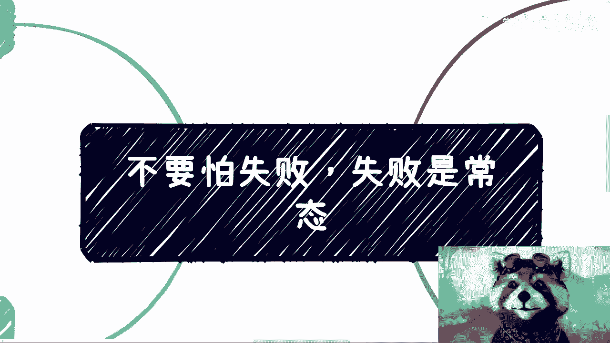

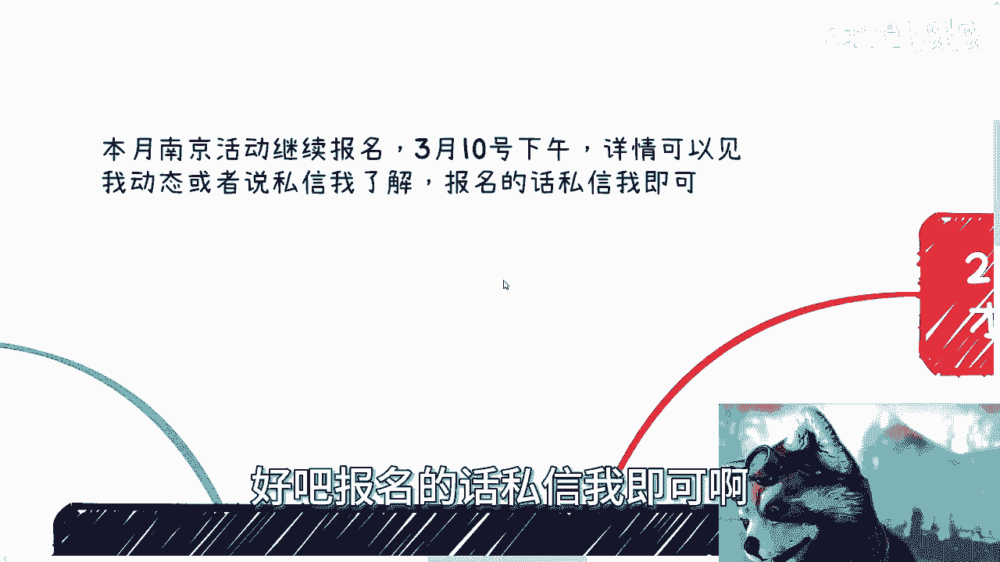


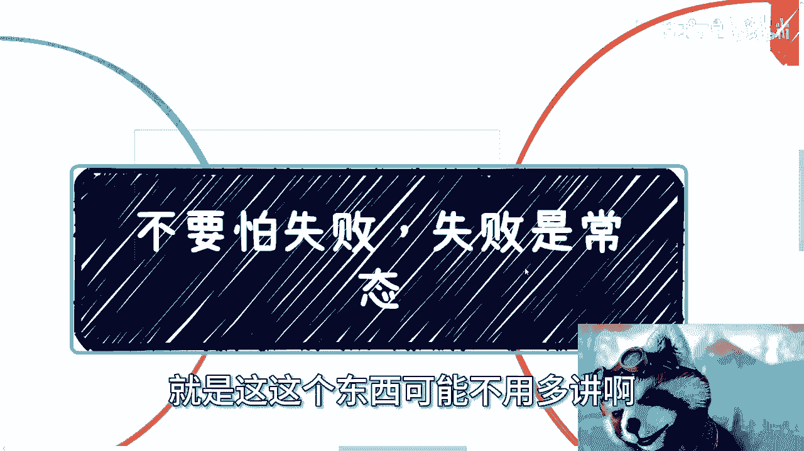

在本节课中，我们将探讨一个普遍存在的心理障碍——对失败的恐惧。我们将分析这种恐惧的来源，并论证失败实际上是个人成长和成功的必经之路。通过理解并接受失败是常态，我们可以更从容地采取行动，追求目标。

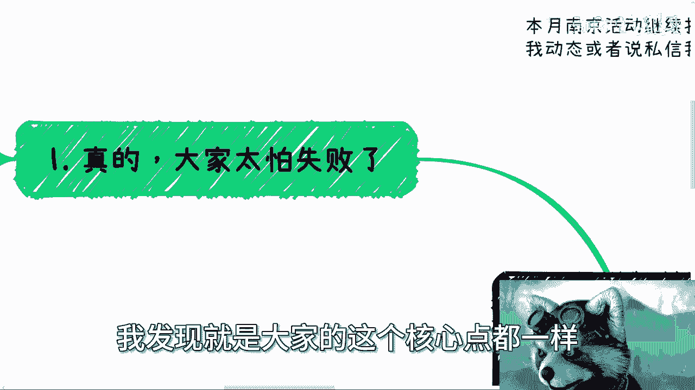

---

## 一、常见的恐惧与无意义的焦虑 😰

上一节我们介绍了课程主题，本节中我们来看看人们通常害怕什么。在与许多人沟通后，我发现一个核心的共同点：大家普遍害怕失败。

以下是几种典型的恐惧表现：

*   **活动无人参与**：担心自己举办的活动没有人来参加。
*   **业务遭遇刁难**：害怕在开展业务时，有人故意捣乱或刁难。
*   **他人不满意**：忧虑自己的产品或服务无法让他人满意，甚至收到差评。
*   **职场生存压力**：担心不加班、不内卷、不讨好老板就会被公司淘汰。
*   **过度担忧后果**：甚至害怕做某些事情会招致法律问题。

然而，这些担忧大多缺乏因果关系，除了增加焦虑，并无实际益处。你害怕没人来，并不会因此就有人来；你害怕被刁难，该来的阻碍依然会来。与其担心这些无法控制的“可能性”，不如关注更现实的问题，例如年龄增长后的职业发展。

---

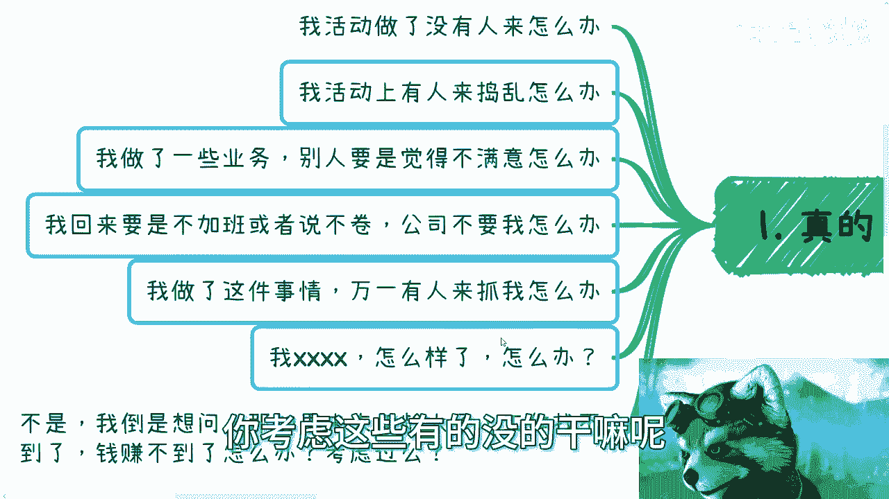

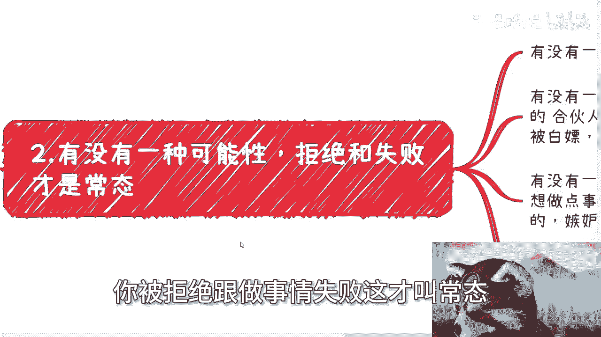

## 二、重新认识“常态”：失败与拒绝才是普遍现象 🔄


上一节我们列举了无谓的恐惧，本节中我们来看看社会的真实面貌。有没有一种可能，我们所恐惧的事情——被拒绝和遭遇失败——本身就是生活的常态？

以下是几个需要认清的可能性：

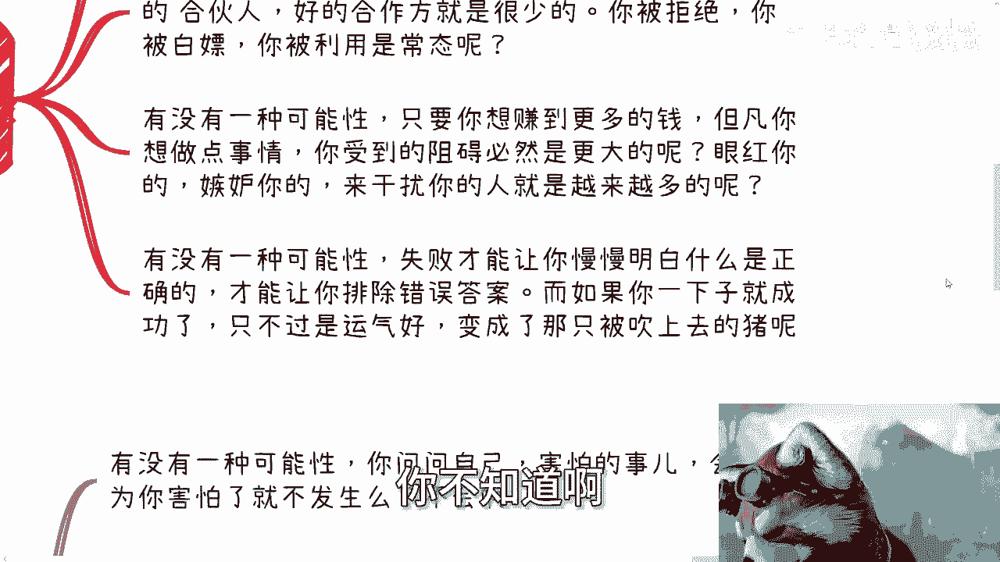

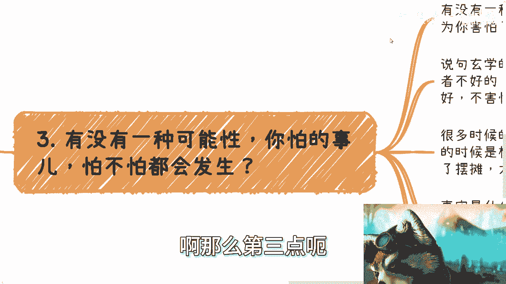

*   **成功是小概率事件**：就像买彩票很难中奖一样，在社会上找到好项目、好伙伴本身就需要运气。**公式：`成功概率 ≈ 小概率事件`**。
*   **阻碍与野心成正比**：你的目标越大，想做的事情越多，受到的阻碍和干扰通常也会越多。**公式：`阻碍程度 ∝ 目标野心`**。
*   **失败的价值高于成功**：失败能帮助你排除错误选项，逐步接近正确方法。而一次成功可能只是运气使然，无法提供可复制的经验。**核心概念：失败是排除错误的过程，成功可能是运气的产物。**

---

## 三、恐惧无用：该发生的总会发生 ⏳

上一节我们讨论了失败的普遍性，本节中我们来谈谈如何面对它。一个关键认知是：你害怕与否，许多事情该发生还是会发生。

以下是基于社会经验的现实分析：

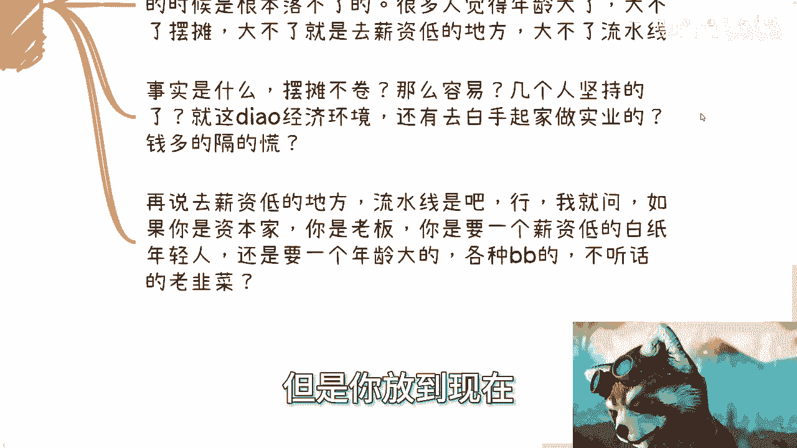

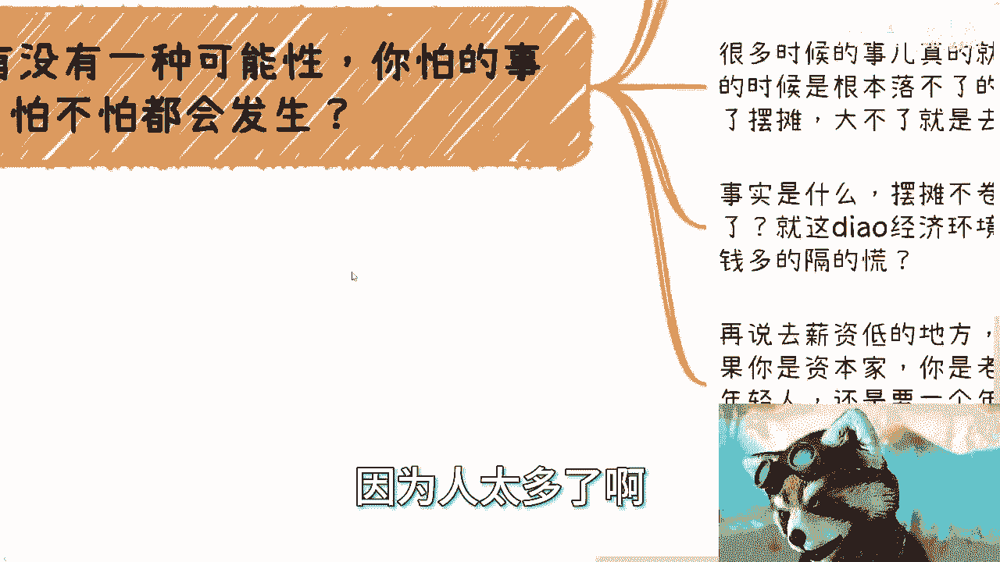

*   **逻辑推演不等于现实**：许多担忧源于缺乏社会经验。例如，有人认为“年纪大了大不了去摆摊或进工厂”。但这忽略了现实：
    *   **摆摊同样内卷**：需要起早贪黑，非常辛苦，成功率并不高。
    *   **实业门槛极高**：白手起家做实业在当今环境下异常艰难，往往需要巨额资金。**举例：朋友做充电桩项目，投入近两亿。**
    *   **年龄是职场劣势**：对于薪资低的岗位，雇主通常更倾向于年轻、易管理的求职者。当劳动力充足时，年长者并无优势。**核心逻辑：在供大于求的市场中，年龄增长会加剧就业难度。**


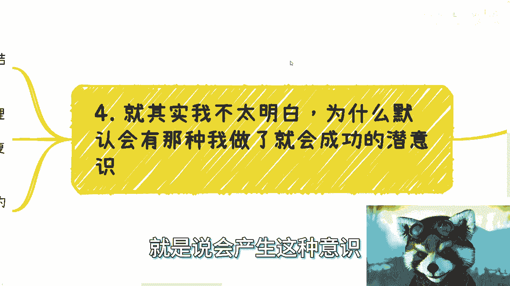

因此，基于错误认知的恐惧毫无意义，真正需要的是面对现实的勇气和实践。

---

## 四、行动是解药：在失败中寻找成功 🎯

上一节我们剖析了恐惧的虚幻性，本节中我们来看看唯一的解决方案。不明白就去了解，不清楚就去摸索，**实践出真知**。

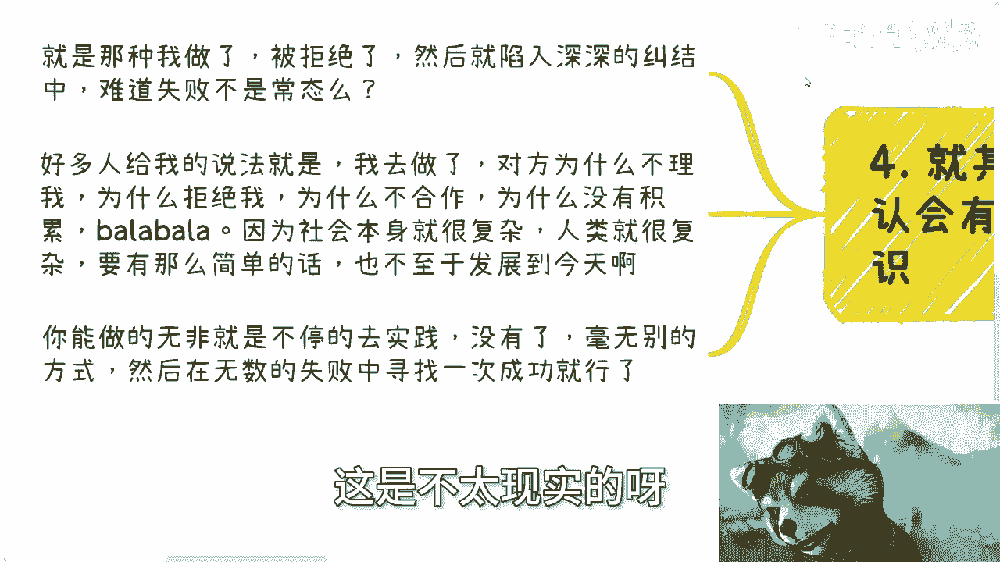

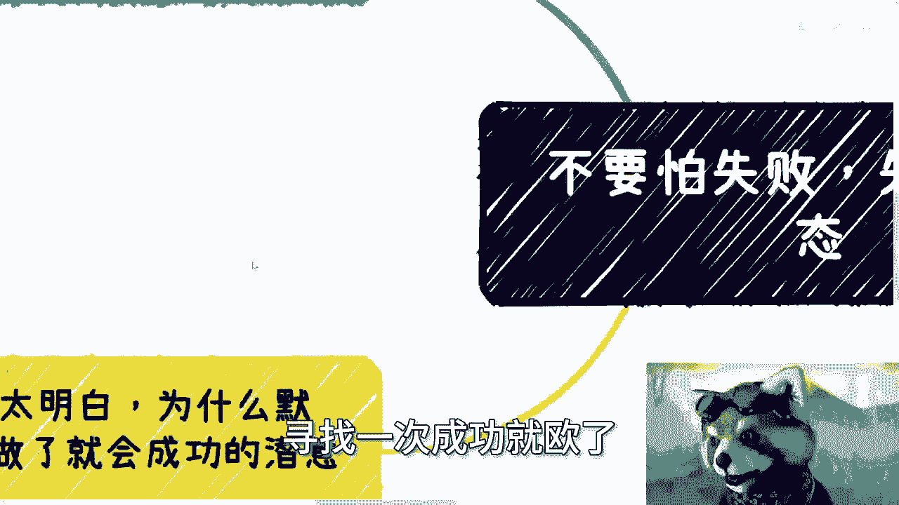

以下是关于行动的核心观点：

*   **社会问题不同于数学题**：社会上的问题大多没有标准答案，但总可以通过实践找到解决方法，不存在完全无解的情况。
*   **接受失败是过程**：很多人尝试一两次，遭遇拒绝或失败后就陷入焦虑。但社会本就是复杂的，被拒绝是常态。如果成功那么容易，所有人都不会感到艰难。
*   **遵循漏斗模型**：成功的路径就像一个漏斗，需要大量尝试才能筛选出少数机会。**核心模型：`成功 = 大量尝试 (失败) → 筛选 → 少数成功`**。
*   **在失败中复盘成长**：不要在同一地方反复跌倒。失败后必须复盘、思考、调整策略。**代码逻辑：**
    ```python
    while not success:
        attempt()
        if failure:
            analyze_cause()  # 复盘分析原因
            adjust_strategy() # 调整策略
        else:
            success = True
    ```
*   **保持平常心**：不要神化他人，也不要妄自菲薄。大家都是在摸索中前进的“草台班子”。成功需要天时地利人和，但不变的真理是：**失败是常态，成功是偶然，也是从失败中汲取教训后的必然。**


对于具体挑战（如演讲时被人挑战），无需过度预设恐惧。可以提前准备，区分问题类型，现场灵活应对。只要逻辑自洽，就能有效处理。关键在于行动，而非空想。

---

## 总结 📝

本节课中我们一起学习了如何正确看待失败。

1.  **识别无谓焦虑**：我们首先识别了那些基于想象、缺乏因果关系的常见恐惧，认识到它们只会带来内耗。
2.  **认清社会常态**：我们论证了被拒绝和失败是普遍现象，甚至是获取真知、走向成功的必要过程。
3.  **摒弃无效恐惧**：我们明白了恐惧无法改变现实，基于错误认知的担忧尤其无用。
4.  **坚持行动与复盘**：我们确立了唯一的出路：通过持续实践（接受失败常态），并结合复盘思考，才能在漏斗模型中筛选出最终的成功。


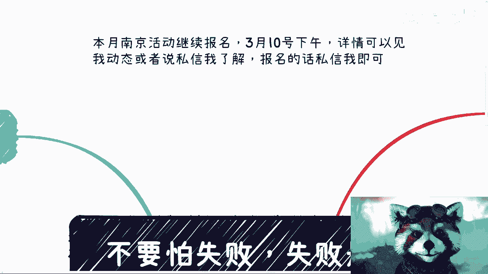

记住，**失败并不可怕，害怕失败而不行动才真正阻碍了你的前进**。将精力从“担心失败”转移到“如何行动”和“如何从失败中学习”上，才是成长的开始。