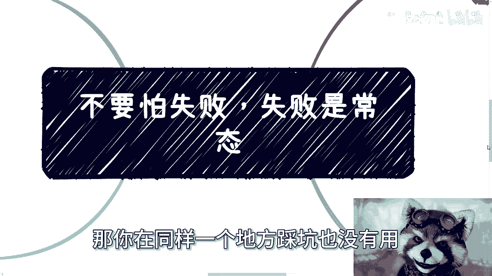

# 不要害怕失败，有没有可能，失败才是常态 - P1 - 赏味不足 - BV1vS421w7WZ

好大家好，首先那个其实今天我已经录了三个视频，但前面两个我总感觉不太适合发出来，这样算的，哎呀那个本周南京活动继续报名啊，3月10号下午啊，详情可以进我动态或者私信找我了解好吧，报名的话私信我即可啊。

所以就像我说的对吧，只要我愿意，我一天可以剪十个视频啊，都可以啊啊那么今天我们来讲的这个内容呢，是哎就就就就这么个话是吧啊。

呃我觉得这是个厂，就是这个东西可能不用多讲了。

但我后来发现可能很多人他不讲不行啊，嗯我沟通下来这么多人，我发现就是大家的这个核心点都一样。

就是太怕失败了，当然我我我说实话我也不知道为什么，就第一个就是说我随便举个例子，比如说啊他说我活动做了没人来怎么办啊，然后比如说我做了一些业务啊，这个比如说别人捣乱对吧，别人就故意刁难我怎么办啊。

那么我做一些业务呢，别人要觉得不满意怎么办啊，给我打差评怎么办啊，我回来要是不加班啊，或者说不卷，或者说不跪舔老板，公司不要我怎么办啊，某的这件事情我有人来抓我怎么办，我们我们随便说，比如说你说没人来。

那你怎么滴呢，就是有人来，没人来跟你做不做有关系吗，你你觉得你害怕没人来，怎么的，他就人来了，你害怕没人来好，他他妈来100个人啊，你不怕没人来啊，你你不怕这个没人来，到时候就真的有人来了。

但没因果关系是吧，懂得都懂对吧，你要是问我这个话，我就说你先做没，怎么会没人来呢是吧，我一直跟他们讲，我说你今天做个业务，中国有14亿人啊，你比如就拿上海来讲，你一个城市几千万，哪怕几百万好了。

你漏那么三四个人下来露不出来吗，啊我就不信了，我是真不信了，除非你不做啊，然后你说第二个捣乱，那我就说嘛，你只要做一件事情，你只要真的想做成一件事情，想自己有一个目标，怎么会没人不刁难啊。

怎么会这个有人不刁难你呢，一定会有的，怎么会有人不来捣乱呢，一定会有的，这才是社会，这才是人类社会嘛啊你说你今天做这件事情，没人来捣乱，没人来刁难，那我说跟你说，不好意思，那只能说你做的太垃圾。

你做的太差，人家都不屑的来来刁难你，你说对吧，那这第二点第三点，你比如说你说我做了一些业务，别人要觉得不满意怎么办，那我就问你觉得你做什么业务，别人一定会满意的，那我跟你讲，奇了怪了。

哎你就说那些以前做传销的，比如说七天收益率百分之百，那他妈你就算写七天收益率7%，1000%，我跟你讲都有人不满意，你怎么能让人家满意呢，无解的呀，是吧啊，然后你比如说那下面这个就更离谱了。

他说我回来要是不加班或者不卷公司，不要我怎么办，你搞得好像你加班，你卷了公司要你一样的，你不就是个电池吗，你不就是个5号五号电池吗，用完拉倒吗，这跟你加班卷不卷有什么关系啊，对于公司来讲。

这是我能占一点便宜一点便宜，我能压榨你一点，是一点没有关系的啊，然后最后这点我跟你讲，这是最离谱的，他说我今天做某件事情，万一有人来抓我怎么办，我只想说大哥大姐，你你是不是对对我国的警察。

或者说公安是不是有什么误解啊，或者说我真的还是那句话，太把自己当个人了，你谁啊，我想知道你谁啊啊，周处吗，哈哈你奇了怪了呃，陈桂林吗，是吧啊，那我你想想看这些问题有意义吗，一点意义都没有。

答这些问题除了让你焦虑还有什么用啊，我就问除了还有什么用啊，啊或者说你跟你朋友聊聊，跟你对象聊聊啊，你对象安慰你两句，你朋友共情你两句，你觉得哎呀身体舒服了，然后呢走不还原地踏步吗啊那我就问了。

我说你与其担心这些东西，那我就我倒是很想问啊，那你们为什么不担心未来年龄大了，工作找不到钱，赚不到怎么办，哎你咋不考虑这个问题呢，就这个是一个现实放在那边问题，你咋不考虑呢，你考虑这些有的没的干嘛呢。

那么我们来说有没有一种可能性啊，你被拒绝跟做事情失败，这才叫常态。

那我们就来说有没有一种可能性，你买彩票就是很难中奖的，哎我只是我只是随便说对吧，我只是说有没有这种可能性啊，对吧好，第二点有没有这种可能性，你在社会上能找到好的项目，好的合伙人。

好的合作方本来就是要靠运气的啊，反而你被拒绝，你被白嫖，你被利用才是常态呢，对不对啊，那么有没有一种可能性。

只要你想赚到更多的钱，只要你想做更多的事情，只要你想这个有拥有更大的影响力，但凡你想做点什么，你受到的阻碍必然是更大的呢，啊我不敢确定啊，我只是说有这种可能性，对不对啊，你比如说诶那有没有一种可能性。

你越是想赚到更多钱，你越去铺开来做很多东西，眼红你的，嫉妒你的人，干扰你的人就越多呢，啊那么同样的有没有一种可能性，成功是很少的，失败才是能让你慢慢明白什么是正确的，失败才能让你排除错误的答案。

而成功其实是不能让你增加经验的，因为你并不知道到底是你所谓的成功，还是你只是被那个运气吹上去的那只猪，你不知道啊。

那么第三点有没有这种可能性。

你怕的事怕不怕都会发生，那么我们就说说句玄学的话，那很多时候我们打个比方，你有个预感，比如说你有好的预感或者坏的预感，你会发现你好的预感也好，坏的预感也好，接下来发生什么事情，你也控制不了啊。

你害怕也好，不害怕也好，不还得继续吗啊那么很多时候的事我跟你讲，真的就是说逻辑上你可能觉得哎想得通的，或者逻辑上你可能就是说以讹传讹，你觉得哎好像是这么个道理，但你真的落地的时候根本不是啊，为什么。

因为你之所以会这么觉得，是因为你缺乏社会经验，你缺乏落地的经验，你会觉得用你的认知，你会觉得那个逻辑走得通的，但是真正拥有社会经验的人，他一听就知是他妈的扯淡啊，你比如说什么，你说很多人就觉得什么。

他说哎那年龄大了，我没关系啊，他说他很搞笑的，他说我要大不了摆摊啊，大不了就去那种薪资低的地方，大不了流水线，我跟你讲啊，这叫什么，这叫站着说话不腰疼，为什么，因为事实是什么，我就问你摆摊难道不卷吗。

摆摊容易吗，啊你摆摊你知道早上几点开始准备，你知道晚上几点收摊，几个人能坚持得下下来啊，啊就这点经济环境，还有人去白手起家做实验啊，当然我还是那句话，做实验我认可的，而且实业是最踏实的东西。

但是你不能妄想啊，我随便给你们打个比方啊，我一个朋友做那个充电桩的对吧，新能源充电桩呢他现在失败失败也好，成功也好，我不知道，但是前前后后他家他也好，他的投资人也好，一些土老板也好。

前前后后投下去都快一点，五个亿，快两个亿了啊，这是正常人能做的吗，这是普通人能做的吗，你跟我说白手起家做实验啊，这我说实话，你但凡想白手起家做实验，你只会让我觉得要么你就是被忽悠了。

要么你就是钱多的割得慌，啊然后我们再来说薪资低的地方流水线是吧，行那我就问啊，如果你是资本家，你是老板，你需要一个薪资低的白纸年轻人，好PUA的年轻人，还需要一个年龄大的各种BB的不好POA不好。

不听话的老韭菜，你自己想吧，对不对，那很多人很搞笑，他说哎呀，不是不是那个找不到找得到的对吧，你们不愿意去，脱不下长衫啊，对这句话放在以前没有错，但是你放到现在。

放到以后难啊，为什么，因为人太多了啊。

你以为年纪大了就你一个人啊，那不多了去了是吧，那么第四点呢，就是说我说实话我是真没明白。

就我不就是就是我明白大家害怕我知道的，但是我不太明白为什么，就是说就是说会产生这种意识。

或者说他这么多人他会产生这么个潜意识，我是不明白的，就是说就说明明啊，你说人活在世界上面有什么问题，你不清楚的，那就去了解嘛对吧，你不清楚的就去摸索嘛，所谓实践出真知，什么东西不清楚你就去实践嘛。

但是现在是属于所有东西不时间，然后自己给自己下个套啊，然后就自己告诉自己，我不行啊，这个地方有难度啊，有什么东西怎么样怎么样怎么样，哎我一直跟大家说的是什么，我说这个东西再有难度。

他也不会像你今天解一个，比如说高数对吧，或者奥数，你说这个题目我不会解不出来，那可能就是解不出来，你今天晚上想破脑袋，你也写不出来，但是你在社会上碰到的问题，很多东西你得去实践，你你总归能有办法的。

没有什么不没有办法的啊，然后然后我发现大部分人潜意识是什么，就是那种我做了，我今天做了，然后我可能失败了或者被拒绝了，然后呢他就会深深的陷入一种纠结当中，或者来说自我焦虑当中，唉失败难道不是常态吗。

啊好多人给我的说法就是说哎陈老师我去做了，然后对方为什么不理我，为什么拒绝我，为什么不合作，为什么没有积累，不拉不拉不拉不是切，因为社会本来就是复杂的，因为你们所面对的东西就是社会的这个常态。

因为你们所面对的东西，就是所有人曾经面对过的东西，有什么区别呢，那那你要说大家做了什么，五次十次就能成功呢，如果这么简单的话，我说不好听点，会发展到今天吗，不会的呀，而且咱再退1万步来讲。

如果这么容易打破这个象牙塔的这个屏障，大家也不可能，每年1000多万人挤在像那个独木桥上面是吧，所以说你说你能做的是什么，就是无非就是漏斗模型，不停的时间没有了，毫无别的方式，你说还有什么方式。

要是指望天上掉彩票下来，还是指望有贵人带你，不就是不太现实的呀。

你无非就是在无数次的失败当中寻找一次成功，就欧啦对吧。

然后就是就是你要明白，就是说就是说大家其实都一样的，你不要去自卑，也就是不要妄自菲薄，你也不要去神化对方，没有用的，我早就跟你们说过，所有人都是草台班子都一样的，一个人能成跟一个人不能成。

或者一个人能成几个单子都是看运气的，就都是有天时地利人和的，但是有一点是不会变的，是什么，就是失败是常态，成功是偶然，或者说成功是失败之后偶然中的必然，当然我们就说你你你是就像我之前写的。

你失败之后你也得复盘，你也得动脑子对吧，你也得去思考啊，你不说我就不停的啊，这个不停踩坑，不停踩坑，那你在同样一个地方踩坑也没有用对吧。

但是问题是你不要就是像这边写的，你不要去想这些东西。

这些有啥好想的呢，你说你你们就这么想啊，我我做了这么多这个那个企业培训，政府培训，包括高校培训，难道下面就没有一个人来挑刺儿的啊，下面没有一个人来怼我的，下面就没有一个人来challenge。

所谓就是来来来挑战我的，多了去了，那你想想看我我当时怎么办哦，我还是一个正常的商业合作，然后还是一个公开的，比如说下面可能几十个人，几百个人的，我怎么办，对不对，就是你你除你你去这么害怕。

或者你去这么想，你除了给予你自己无限的压力以外，没有好处啊，你其实这件事情你问我怎么办，或者你说问你自己怎么办，没有关系啊，没有关系，你可以在之前先想好，如果想不好，OK那你可以多问问别人。

你说哎陈老师今天有个人问我对什么什么，假设你说有人问我这么一个什么问题啊，你觉得应该怎么回答或者怎么样对吧，而且我觉得你但凡情商高一点，你其实得要去区分问题，就是哪些问题是呃，就是大家开玩笑的。

哪些问题是政治红线，哪些问题是商业红线对吧，哪些问题是可能不适合这个场合的，不是别人所有人问了，你必须回答的呀对吧，就很多事情就是就是就不是说就像我一直说的，应试教育，不是说他一定有个标准答案。

答案你只要做了，然后你做的东西，你做的这件事情，相对来讲是就是在当下这个环境下面，或者当时你的场合下面，只要逻辑说得通都没问题，你说这个问题太敏感，我不回答行不行啊对吧。

然后如果来说他在下面给你拖时间啊，他在那边什么问个问题，问了什么35分钟，你说不好意思，现场现场这么多人，你不要浪费大家时间，我就给你半分钟行不行行啊，那不会人家觉得你说你说什么啊。

非常的强势或者怎么样，这不重要的对吧，就是说你只要逻辑讲得通，那么一切就能讲得通，但问题是你但凡自己不去想，你上来就在说啊，我担心这个东西，我担心那个东西，那就没办法对吧，好嗯那就这样好吧。

然后那个南京这个活动。

反正大家来的话，私信我就报名，然后呃那个商业上或者职业上，或者来说呃什么合同啊，啊股份啊，或者说其他的一些问题，或者有详细的一些东西，你们可以整理好这个问题list好吧。

