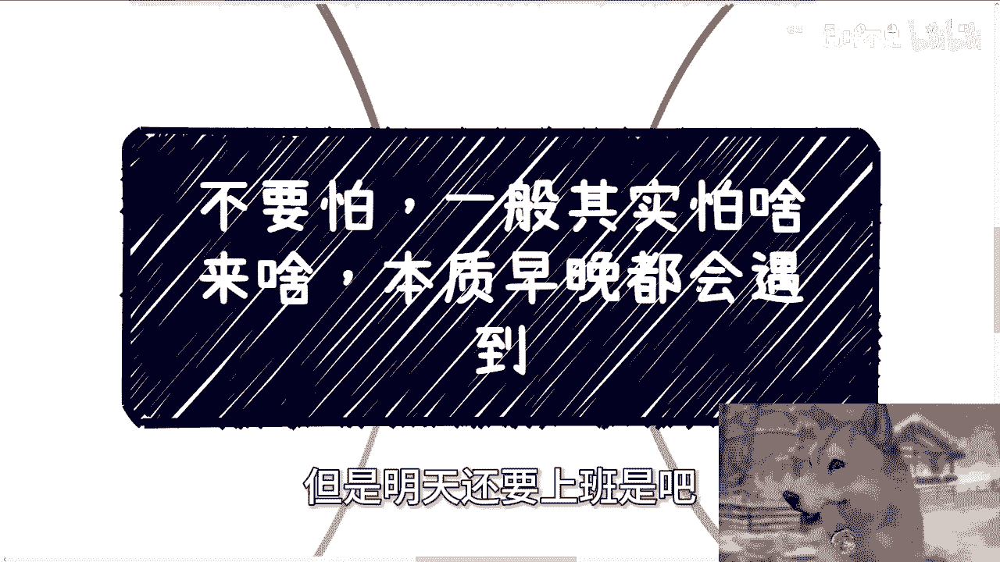
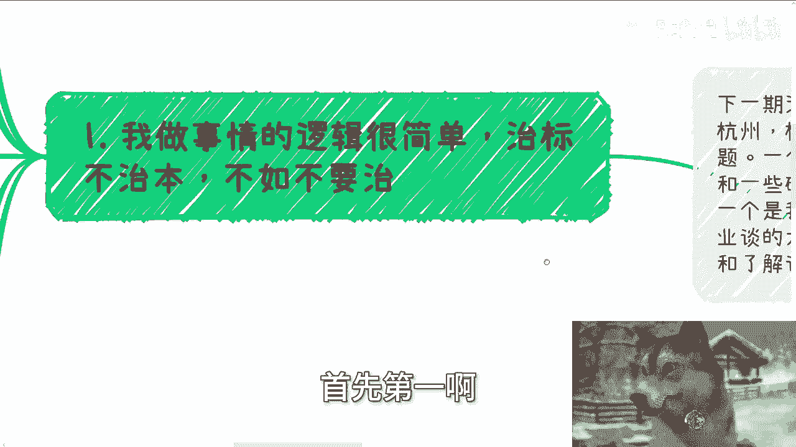
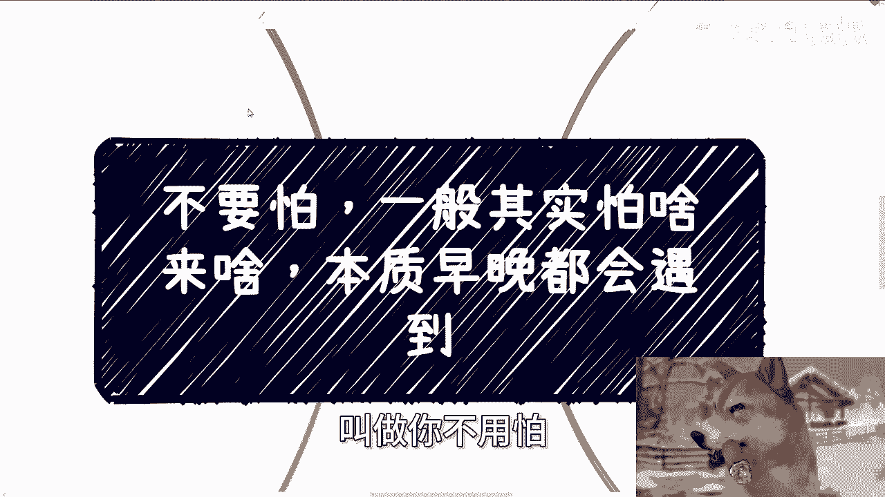
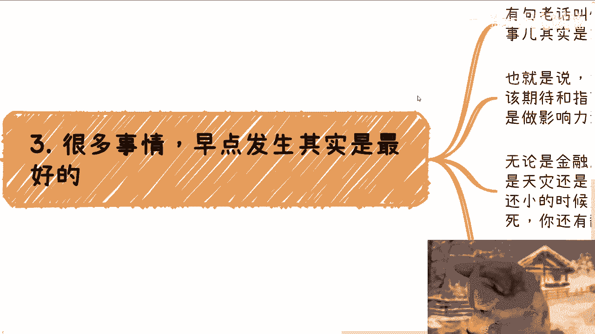
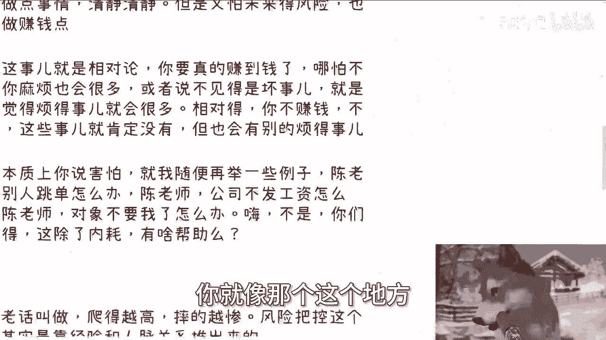
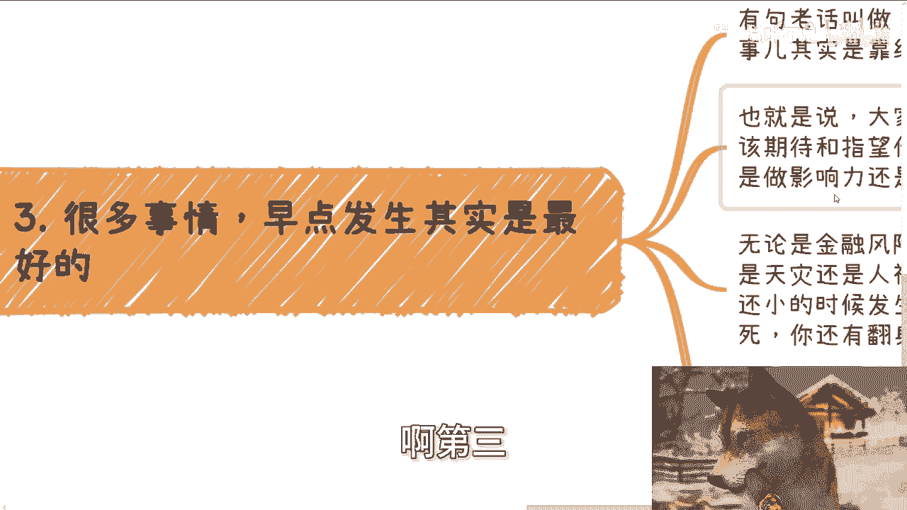
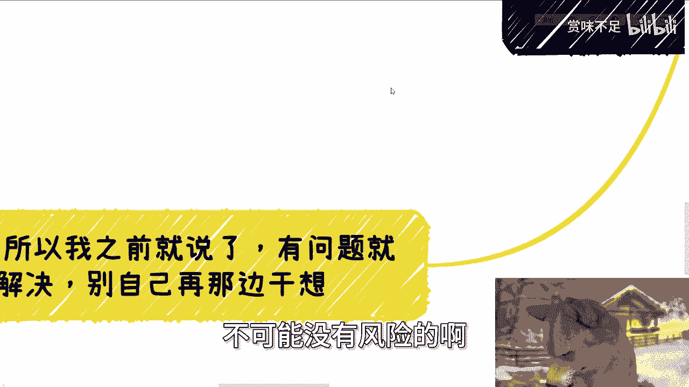
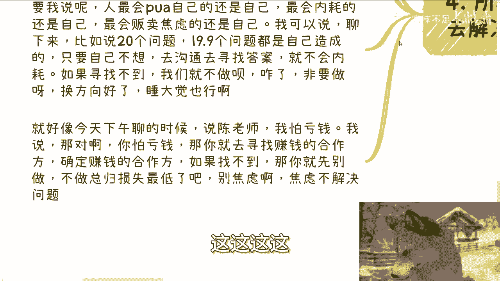
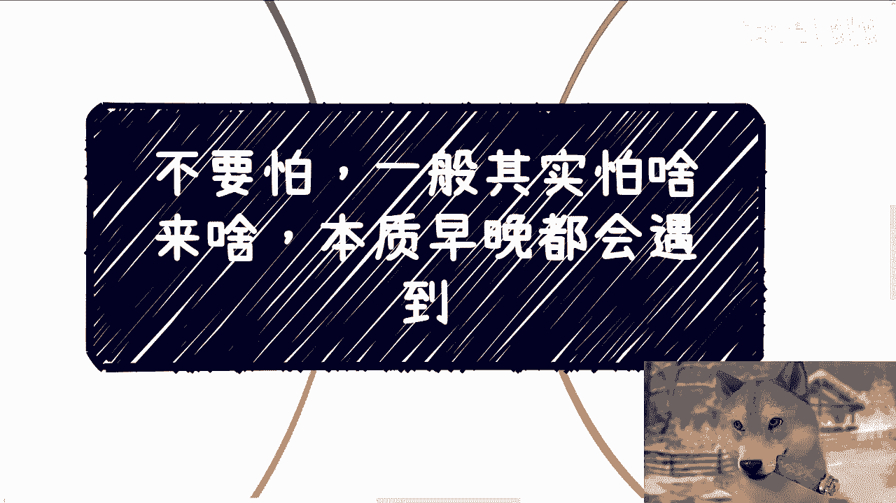

# 不要怕，一般怕啥来啥，本质早晚都会遇到 - P1 - 赏味不足 - BV12ftFe6E3c

啊大家好啊，这个今天礼拜五来啊，但是明天还要上班是吧啊。

虽然我不上班啊，嘶，OK那首先啊下一期活动已经定了，9月21号好吧，下周六哎，21号是周六吗，我看看啊，21号对，周六啊，周六在杭州好吧，杭州也很久没来了，呃然后呢本期定了几个新的主题啊。

因为也不能一直老的主题嘛，一个就是我跟大家会私下分享一下，这次上海大会时候和一些研究院院长啊，聊下来一些呃，政府最先关心关心的一些关注点吧，或者还说当下的一些最新的一些动态。

一个呢就是说呃我打算给大家看一下，就之前我们跟高校，包括产业园啊谈的一些这个大会的方案，还有就是我们跟就高校这边就不是大会了嘛，高校这边就是一些那个呃叫叫叫什么叫啊，实训平台啊，一些方案好吧。

然后我就不改了，我到时候会把TPPPPT，反正给你们一边看一边我会给你们讲解一下，呃反正都是老的东西了，我觉得也问题不大啊，那么报名跟了解详情的可以私信我啊，首先第一啊呃呃不先说主题啊。

今天这个主题呢叫做你不用怕一般。

其实你怕啥呢来啥，而且本质上你怕不怕呢，早晚都会来啊。

那么第一呢我做事情的这个这个逻辑很简单啊，就是在我看来啊。

治标不治本啊，不如不要治啊，那么你比如说啊，你说有有很多人要说了啊，陈老师这个主题他妈的就是来贩卖焦虑的，对我就是来贩卖焦虑的啊，反正大家都很焦虑的，也不差我这一个，对不对啊，好。

那么关于今天这个铺天盖地说的，这个延后养老金的事呢，我觉得也没啥可说的，因为其实懂得都懂，而且更何况就算我给你们说明白了呵，那大普罗大众啊，包括你包括我对吧，我们现在也不能做点啥，能做点啥呢，对不对。

那不是还看还是看眼前啊，那么今天下午跟一个小伙伴聊的时候呢，聊到了就说一些能够帮助大家救急的手段啊，比如说什么摆摊啊，卖二手货啊对吧，或者开店啊等等等啊，啊包括一些加盟商啊。

加盟商我之前其实也单独开过内容啊，我就我在这里呢，就我当时跟他讲，我说就两个问题，第一你们觉得能解决问题，只不过是你们觉得他是不是真的解决问题，还是两说对吧，你看啊我还不是一棒子打死对吧。

我还给大家个五五开的这个比例啊，另外一方面你摆摊卖二手开店成本是可见的，成本是固定的，或者成本是可以去评估的，但是收益是未知的，哎我请问怎么救济啊，对不对，这他妈叫救急吗。

怕不是去去他妈西天路上送你一程，你想是不是嘛啊，其次啊，我自己做事情原则就是治标不治本啊，你不如不要治，那有的人要说了，哎陈老师，你这话不对啊，他不说，他说如果有个药虽然不治本，但如果能让你延年益寿。

按照你这个说法就不吃啦，我跟你们这么说啊，就就就我觉得很多人打比方的是蛮会打的，但是你要去对比现实当中真的事情，比如说啊现实当中无论我们打工也好，商业合作也罢，这个地方所谓的治标是什么意思。

治标往往指的是自我安慰，自我感动对吧，治本是什么意思，治本其实就是去赚钱，赚赚到钱，你甭管是快钱慢钱啊，然而呢就跟我们刚刚说的什么卖二手货啊，摆摊啊，开店啊，加盟是一样的，你就会发现。

他们认为普罗大众认为治标的事情是什么，是我去开店啊，我去卖二手货，我去摆地摊，你能赚到钱吗，不能啊，对不对，所以说就是说本质上这叫什么，这就上这就算不上指标，这叫这叫莽对吧。

所以说你按照我说的这个例子来讲，其实更多的人选择的，并不是不吃这个延年益寿的药，而是他妈的在乱吃药啊，你别说什么延年益寿了啊，折折不折寿都不知道，对不对啊，不要就是还老是听那些打比方的。

你就像我刚给你们打个比方说啊啊，陈老师说这话对吧，你这个听上去哎我操说的有道理啊，陈老师这个这个逻辑不对，但他妈的哎是不是好，第二其实沟通下来啊，我觉得大家都会害怕一些事情人嘛对吧，什么叫人啊。

什么叫普通人啊啊你要什么都不害怕，那叫圣人，对不对，那先说结论啊，害怕这个事，我觉得两点，第一点就是格局要放大，第二点就是你害怕的都是我们自己控制不了的，要发生总要发生，无非就是早晚发生的问题。

你去害怕它干嘛呢，对不对，你说我贩卖焦虑，那我就这么问了，你害怕你不是自己给自己营造焦虑吗，吃饱了撑的啊，睡大觉不香吗，是不是你比如说之前啊有小伙伴跟我说，他想离职啊，然后呢就跟我说担心啊。

他跟老板会不会闹僵啊，这个离职的时候是不是啊，比如强硬一点，还是说啊，还是说软一点，还是说这个离职要要要不要再给老板，继续继续干活对吧，或者说老板如果想继续留他，他是不是还继续做的吧啊怎么样啊。

然后我就问他，那那那你为什么这么呃担心的，他说哎呀，我就是想着就说出来之后，是不是未来跟他还有没有可能有合作对吧，他说那多一个人啊，多一条路嘛对吧，我说是这样子的，第一你别担心，为什么。

一方面闹僵不闹僵，不是你能决定的，如果一个人要跟你闹僵，怎么啦，的每天跪舔他就不闹僵了，是不是，那另外一方面你要把眼光放长远，就是放在更大的这个这个怎么说呢，就是就是视角上面。

因为你要是眼光就放在这么一两个人身上，搞得好像哎呀我现在缺这一两个人，他妈的我就死了对吧，地球就不转了，那你以后还做啥呢对吧，还合作什么呢，就说白了你的眼光如果仅仅只是这样子，短浅的话，那你什么都别做。

你甚至都别开始干，你何必弄得自己很焦虑和内耗呢是吧，你再比如一些小伙伴其实不太喜欢社交啊，他就想着就是说哎我自己做点事情蛮好的，清静清静，但是呢他又害怕屋自己做呢就做做不起来啊，又会亏啊。

然后呢还有未来的风险对吧，但同时呢他也想赚点钱，我说这事儿你一定要明白，人活着他就是个相对论对吧，就是你让我说的不好听一点是什么，就是你活着总有烦的事情，你死了一了百了对吧，那什么叫相对论。

就是你要真的想去赚点钱，哪怕赚的不多，你麻烦也会很多，或者说啊当然啊这种麻烦的事不见得是坏事啊，但是他就会让你觉得烦的事情很多，他肯定相比你一个人的时候烦的事情多对吧，那相对的你不赚钱。

你一个人你不折腾，这些事肯定没有，或者相对来少，但你相对少或者没有这些烦心的事，你也会有别的烦的事对吧，你人活着哪个没有烦的事情，所以本质上你说害怕你就让我，你你就我这边随便举些例子，陈老师啊。

别人我我给别人介绍单子，别人跳单怎么办，唉陈老师工资发不了工资怎么办了，哎要拖我工资怎么办，唉陈老师对象不要我了，怎么办啊，大哥大姐，这些事你能控制吗，你不能控制，你想他干嘛呢。

你想他除了让你自己他妈的很内耗，非常的难过，非常的非常的好像怨天怨地，有什么帮助呢，有什么帮助呢，还有人跟我说，哎呀晚上睡不着觉啊对吧，我我我我有点焦躁症对吧，怎么样子呵，噗你想他干嘛呢。

想他能解决吗，不能是不是啊，你们你们知道吗，就突然让我想到一个什么事情，这就好像啊这个怎么说呢，我们就这么说吧，就路上呵呵呵，你说啊你就这么想，路上对吧，有有有，你说我们开车前面人人开的很慢，极慢啊。

极慢，你怎么滴啊，你想的是什么，我操妈对吧，然后什么呢，哦我的，我我说，我他妈要撞他对吧啊，人要什么呢啊，我的，要要不上，要不开上去，他妈的停下来骂他两句对吧，你想他干嘛呢，我就问你做了这些。

你能解决问题吗，不能对不对，那你要就两种选择，一你自己开远一点，远离它，二你就在他后面慢慢挪，怎么了呢，对不对，你想那么多干嘛呢。

你不解决问题啊，没有用的呀，对不对，你就像那个这个地方。

我我跟那个叫什么，就是这个跟我说要离职的这个小伙伴也是的，我说你今天就算跟你老板不让讲，怎么滴了，你以后出去干活，出去出去找工作也好，出去做商业也好，怎么啦，没人会闹僵了，你总有人会闹僵的啊。

你担心没有用的，你你能保证你跟任何一个人关系都弄得很好吗，不可能的呀，大家活到现在才能不知道吗，啦啊第三很多事情啊早点发生其实是蛮好的。

有句老话叫什么叫做爬得越高，摔得越惨，为什么风险把控这个事其实不是规避，就不是说没有风险，你说啊我操我他妈的很多牛牛逼的人啊，做事情没有风险，不是的，风险把控这个事情其实是靠经验跟人脉关系。

把风险降到最低而已，他不是说完全的没有哦，那么也就是说大家明白一点，很多事情跟风险，你们应该期望甚至期待指望他们早点发生，很简单，因为无论你是出来赚钱还是做影响力，还是做点灰尘。

只要你想在这个世界上做点事情，你就一定会碰到事情，你这没办法的啊，无论是金融风险还是舆论风险，还是法律风险，还是天灾还是人祸，还是你自己造孽，我不管啊，就所有的只要在这些里面的本质上。

在你业务还小的时候，在你这个叫什么流量还小的时候，在你整个的呃就是就是就是盈利啊，面整个盈利这个流水面上面还小的时候，只要发生问题你都好解决，你不会一下子摔得摔得很惨，你也不会一下子摔死。

就说白了你还有翻身的空间，你想想呢，对不对，那同样的你说你怕其实只要你做一件事情，做的时间只要足够长，足够深，就是你们所谓的生根，你就会发现里面所有的问题，该出现的都会出现，你都会经历一遍。

但是唯一的区别是什么，唯一的区别无非就是说，你在这之前有没有足够的意识和足够的人脉，以及足够的经验让你去规避某些事情。

从而降低风险，不可能没有风险的啊。

这个没有办法规避的呀，哦第四，所以我之前就说了啊。

有问题你去解决，自己在那边干，想你干，想我他妈的怪谁呢对吧，你就很奇怪，你比如说上周还有个人问我，他说陈老师我要做个事情啊，他说我要跟对方去聊一下啊，聊什么聊什么啊，然后他就问我。

他说哎你觉得对方会不会合作，哎对方大概要什么，我大概分多少，任何事，我他妈就气笑了，哎我说他妈我又不是对方，对不对，你要觉得你有疑问，你去聊啊，你去谈啊，你不去找对方聊，你找我有个卵用啊，啊我你找我。

我最多能帮大家找到更好的切入点，帮你们去，就告诉你们一些你们不知道的东西，和帮助你们去规避，在我的经验范围内规避更多的风险，但是我他妈不是对方肚子里的蛔虫啊，我怎么知道对方怎么想，对不对。

你要我说人最会PUA自己的，他妈还是自己最会内耗的，还是自己最会贩卖焦虑的还是自己对吧，我可以说啊聊下来，比如说一个人身上有20个问题，19。9个问题都是自己造成的啊，就是只要你不想。

你会发现这些问题都他妈没有问题，诶，奇了怪了，你为什么去想它呢，对吧，我刚刚就说过了，你无非就是你就像你刚刚开车，你无非就两种情况对吧，一种就是你在后面慢慢挪，就是你不想躺平，有什么好想的呢。

一种就是你索性就是开远一点对吧，那开远一点，就是说你去寻找一些别的方案，如果你寻找不到，那我们就不做，是不是，你比如说现现在就单行道，就他妈一根一一根道，你怎么滴啊，你去撞他是不是啦。

你在那你你后面这边挪，你就算一边挪，你开个喇叭骂都没用啊，对不对，就是一样的道理，我们碰到问题，我们去寻找解决方案，你要找不到，你妈不做什么啦，有什么啦，咋了呀啊，非要做呀，他妈不做死了对吧。

这就好像今天下午聊的，然后说陈老师哎，我做某些事情我怕亏钱，我说对呀，你怕亏钱，那你就是提前做任，就是比如说去去跟更多人聊一下，去盘一下你的资源，去寻找一下有没有赚钱的合作方，能不能确定赚钱的合作方案。

如果你找不到，那你就先别做，你不做，总归损失降到最低吧，你做了，你说我可能比如说投入这三五十万就亏掉了，对不对，这逻辑不就这么简单吗，你不做，你损失降到最低，那你也别焦虑，有什么好焦虑的呢，哦你焦虑了。

你今天损，你今天真的一边焦虑哦，一边去投个三五十万去做，怎么啦，不亏啦啊，这这这这这这不是商业。

这不是现实，这叫玄学，对不对，没必要真没必要。

啊行好吧，就这么着，然后那个呃下活动好吧，下周六啊，下周六呃要报名的跟咨询详情呢，你们去私信我，然后的话就是工作上啊，职业发展啊，商业上面就是比如说做副业啊，跟别人一些啊合作啊，里面涉及到合同啊。

股权啊，股份啊，分红啊，呃估值啊，融资啊等等等相关的，你们可以整理好对应的问题跟个人背景好吧。

