# 课程 P1：克服恐惧与焦虑的实用指南 🧠

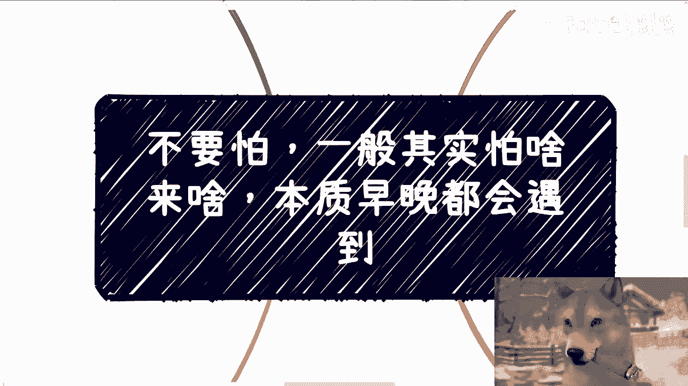

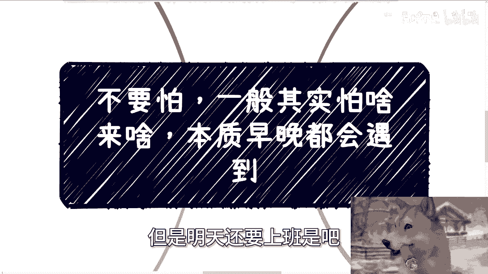

在本节课中，我们将探讨一个普遍存在的心理现象：恐惧与焦虑。我们将分析其本质，并提供一套实用的思维框架来应对它，帮助你专注于解决问题，而非陷入无谓的内耗。

---

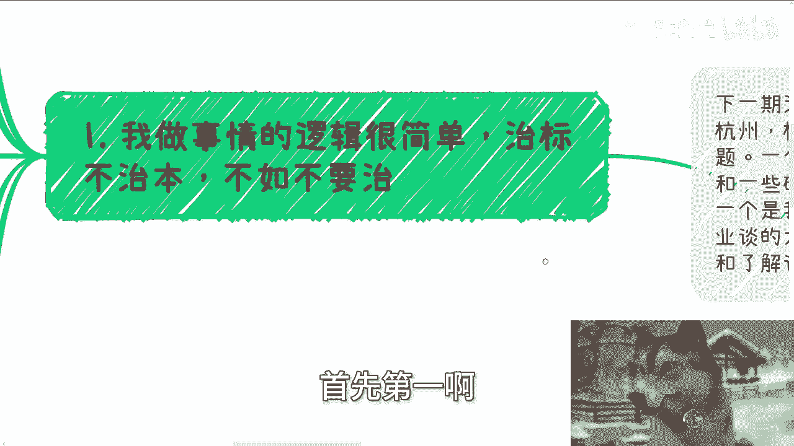

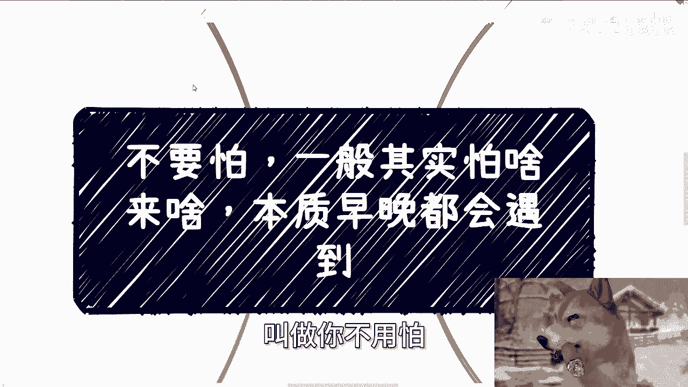

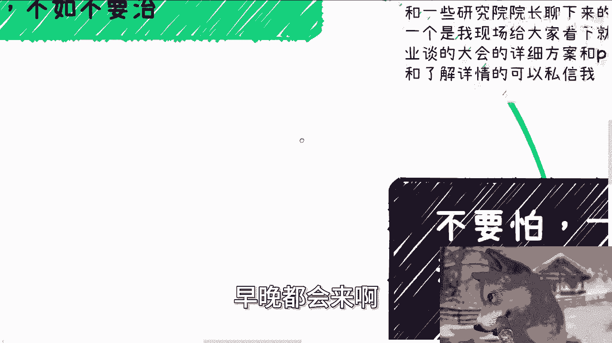

## 概述：恐惧的本质

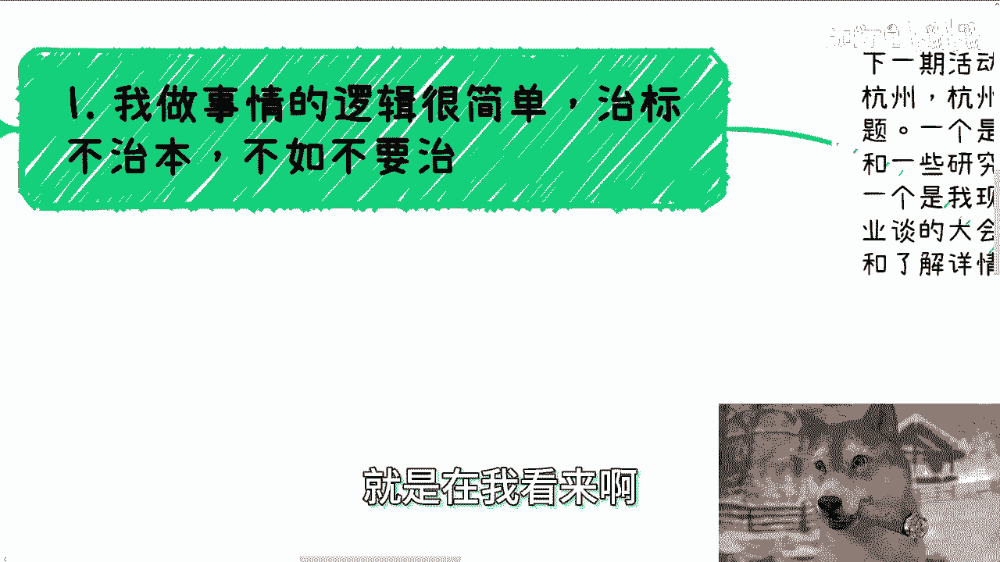

恐惧是人之常情。但很多时候，我们害怕的事情并非我们能控制，而它们迟早会发生。因此，与其在恐惧中内耗，不如调整心态，将精力放在可控的行动上。

上一节我们概述了恐惧的普遍性，本节中我们来看看处理问题的核心原则。

## 第一节：治标不如治本 🎯

我做事的逻辑很简单：**治标不治本，不如不治**。

例如，当人们面临经济压力时，常会考虑诸如摆摊、卖二手货或开店等“救急”手段。然而，这些方案的**成本是可见的、固定的**，但**收益却是未知的**。这非但不能救急，反而可能加剧风险。

真正的“治本”是去**赚钱**，无论是快钱还是慢钱。而许多人误以为的“治标”，往往是缺乏规划的盲目行动，这算不上解决问题，只是在“乱吃药”。

---

## 第二节：恐惧的两点认知 🧩

沟通下来，我发现大家的恐惧可以归结为两点核心认知。

以下是关于这两点认知的详细阐述：

1.  **格局要放大**：不要将眼光局限在一两个人或一两件事上。例如，担心离职会与老板闹僵，从而影响未来的合作机会。但你的职业道路很长，世界很大，不必为单一关系过度焦虑。
2.  **恐惧源于不可控**：你害怕的事情，往往是自己无法控制的。例如，担心项目失败、担心被跳单、担心感情破裂。既然无法控制，过度思虑除了带来内耗，毫无益处。公式可以表达为：`无谓焦虑 ≈ 自我消耗`。

---

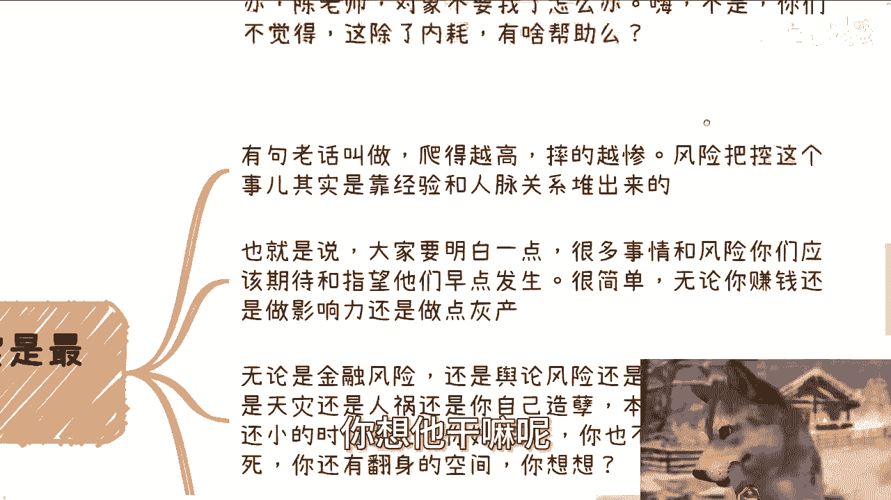

## 第三节：风险宜早不宜迟 ⚡

很多事情早点发生其实是好事。有句老话叫“爬得越高，摔得越惨”。

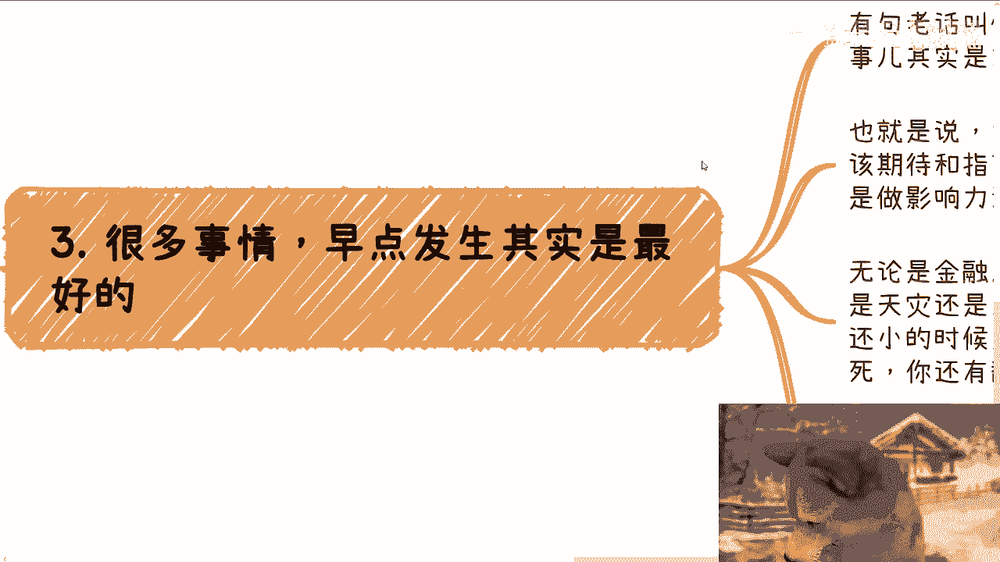

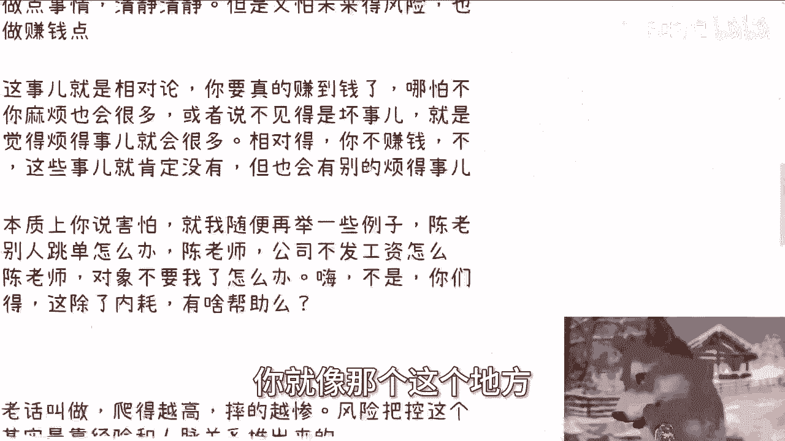

风险把控不是规避所有风险，而是依靠**经验**和**人脉**，将风险**降到最低**。因此，在业务规模小、试错成本低的时候遭遇问题，反而是绝佳的学习和调整机会。你拥有足够的翻身空间。

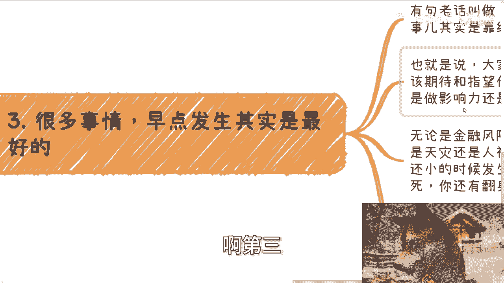

只要你在一件事上做得足够久、足够深，该遇到的问题都会出现。区别在于，你是否有足够的意识、经验和资源去应对，从而降低损失。代码可以类比为：
```python
# 风险无法归零，但可被管理
def manage_risk(experience, network):
    risk_level = 100  # 初始风险值
    mitigated_risk = risk_level - (experience * 0.5 + network * 0.5)
    return max(mitigated_risk, 20)  # 风险总有下限
```

---

## 第四节：行动优于空想 🚀

所以，我之前就说过：**有问题就去解决，自己在那边空想，毫无意义**。

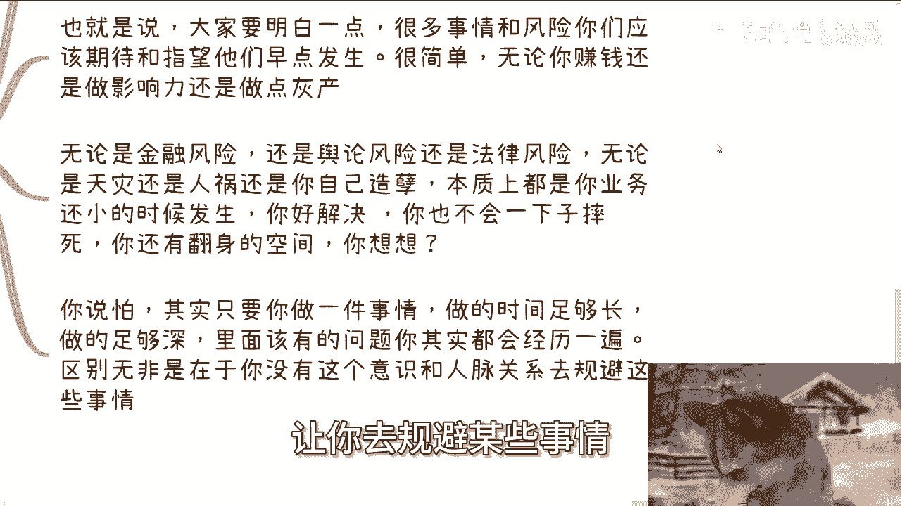

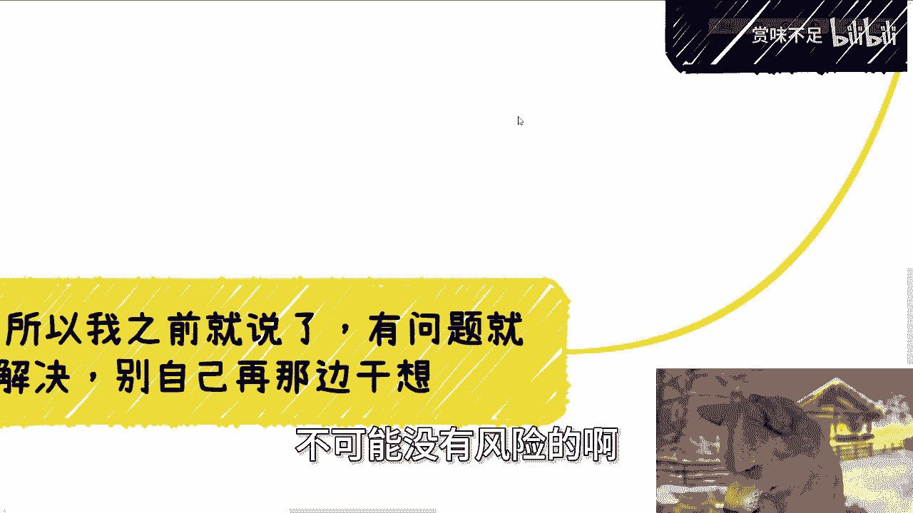

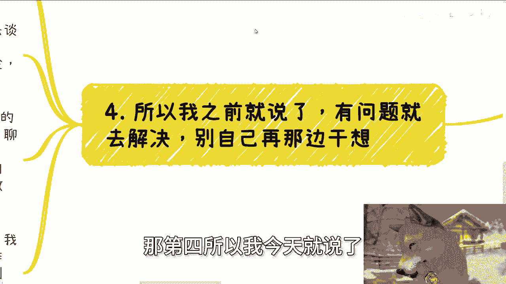

例如，有人想合作却不停猜测对方意图，而不去主动沟通。最会PUA自己、最会内耗、最会贩卖焦虑的，往往是自己。绝大多数烦恼都是自我制造的。

面对问题，只有两种选择：
1.  寻找解决方案并行动。
2.  如果找不到可行方案，就暂时不做，将损失降到最低。

焦虑不会让成功的概率增加，行动和理性的决策才会。就像开车时前车极慢，你可以选择变道（寻找新方案）或跟随（接受现状），但路怒和空想都无济于事。

---

## 总结与下期预告 📅

本节课中，我们一起学习了如何重新认识恐惧：
1.  追求治本，而非无效的治标。
2.  放大格局，认清恐惧的不可控性。
3.  接受风险早暴露的益处，将其转化为经验。
4.  停止内耗，用行动代替空想。

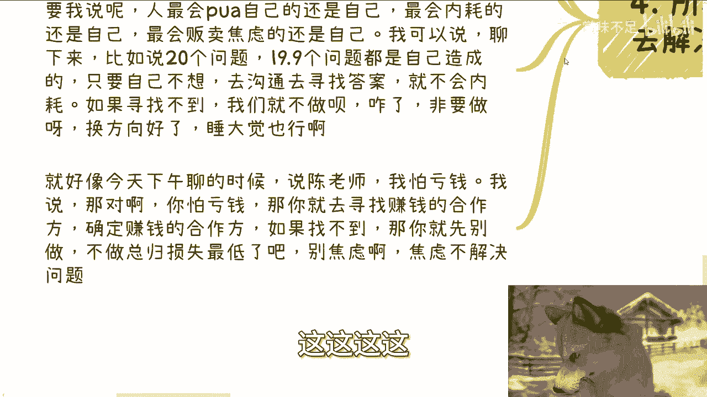

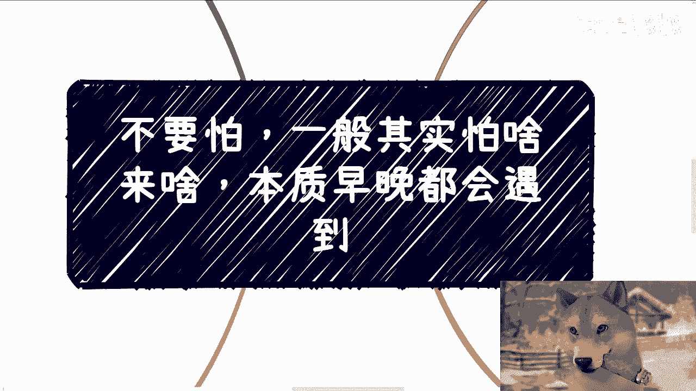

**下期活动预告**：9月21日（周六）在杭州举行。将分享近期与各研究院交流的行业动态，以及面向高校和产业园的实训平台方案。详情请私信咨询。

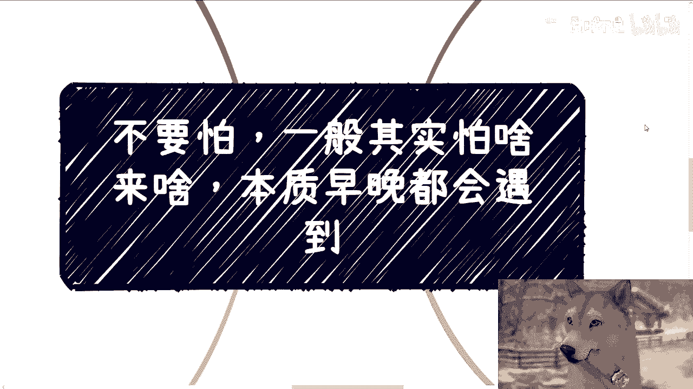

对于工作、职业发展、副业合作中涉及的合同、股权、融资等问题，欢迎整理好具体问题和背景后进行交流。