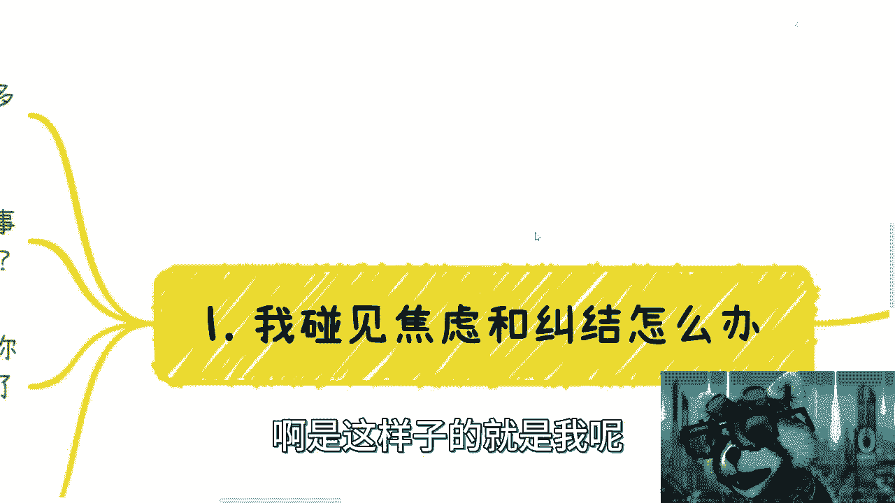
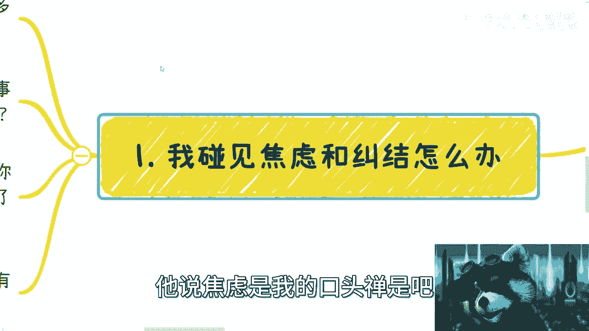
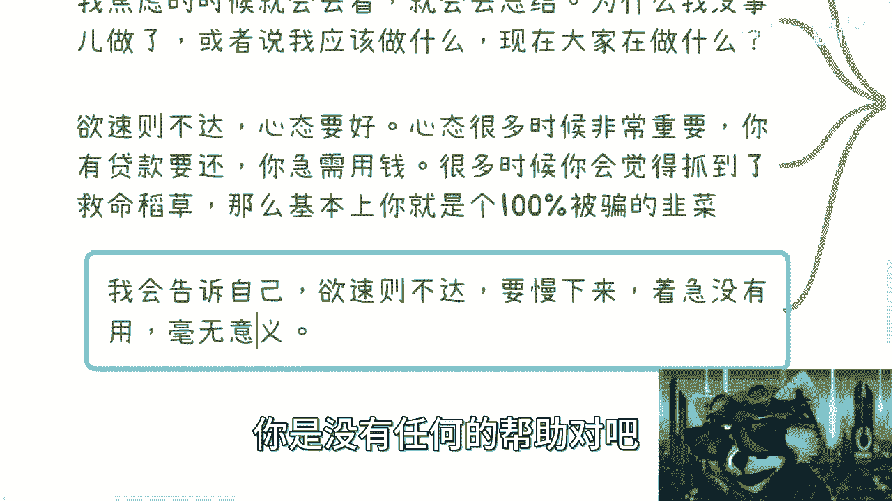
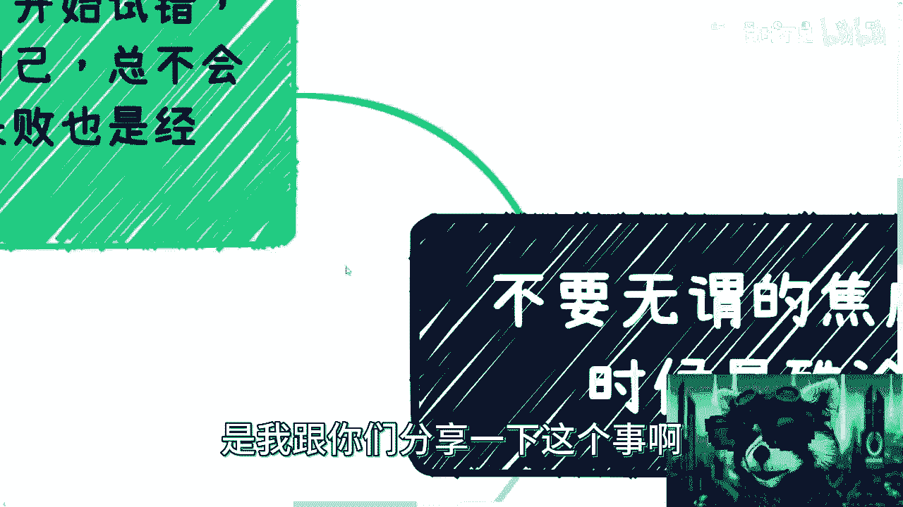
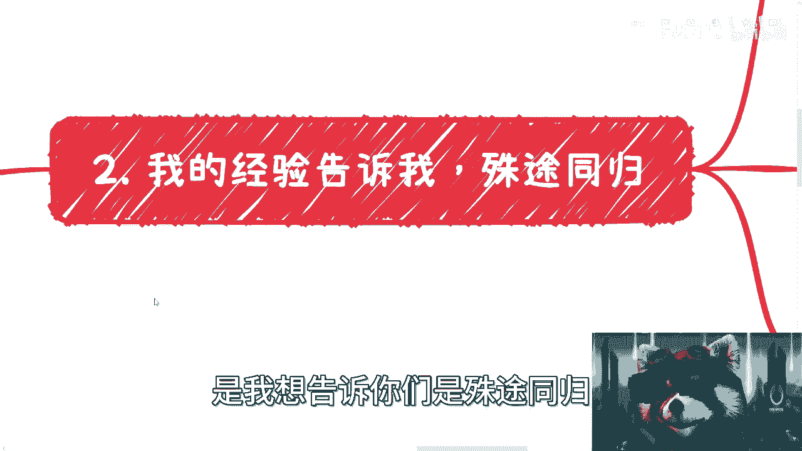
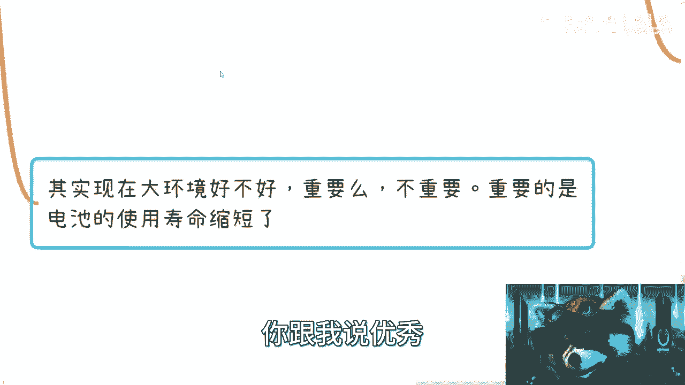
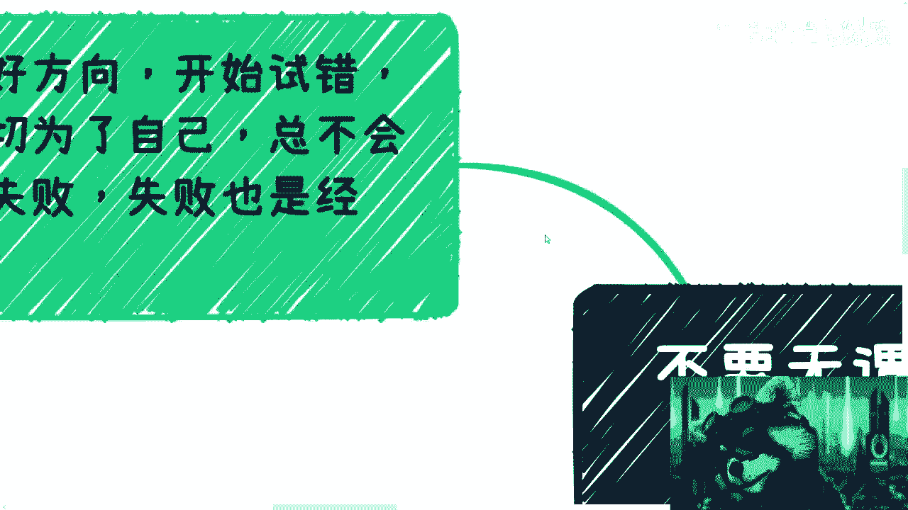

# 课程：告别焦虑，聚焦可控 🧘‍♂️ - 第1课

在本节课中，我们将学习如何识别并管理无谓的焦虑与纠结。核心观点是：许多让我们寝食难安的选择，其长期结果往往“殊途同归”。关键在于将精力从不可控的担忧，转向可以主动积累和掌控的事物上。

## 概述：焦虑的常态与无意义

我经常感到焦虑和纠结，这是我的口头禅。面对这种情况，我的方法是回顾和总结日常任务清单。我会问自己：为什么最近无事可做？应该做什么？别人在做什么？哪些任务没有完成或推进？总结原因很重要，但必须认识到，很多焦虑本身没有意义。

## 第一原则：欲速则不达 🐢

上一节我们认识了焦虑的常态，本节中我们来看看应对焦虑的第一个核心心态。

当你心态烦躁、焦虑或面临压力时，最重要的事情是不要着急。例如，当你急需用钱偿还贷款却没有收入时，很容易将遇到的任何机会都视为救命稻草。此时，你极有可能做出错误判断。

**核心公式**：`焦虑/急躁的心态 → 判断力下降 → 错误决策`

在这种情况下，你需要告诉自己：欲速则不达。着急和焦虑本身没有任何帮助，只会促使你做出错误决定。真正有效的做法是慢下来。

## 核心主题：殊途同归的真相 🔄

理解了急躁的危害后，我们进入本节课的核心概念：许多选择看似天差地别，但长远来看可能“殊途同归”。

以下是关于“选择差异”的剖析：
*   **表面差异**：选择A（如去某城市、读研）和选择B（如去另一城市、工作）会导致你遇到不同的人、经历不同的事。
*   **本质相似**：但经过五年时间，你在A路径和B路径上面临的内在问题、内心焦虑和个人需要成长的方面，**本质上可能没有区别**。

你之所以觉得选择至关重要，往往是因为对未知的恐惧或信息不足。许多选择只是带来量变，而非质变。真正的改变来自于你自身的成长，而非外部环境。

## 聚焦可控：积累属于你的资本 💎

既然许多选择的结果相似，且外部因素不可控，那么我们应该关注什么？答案是：积累那些你能真正掌控的东西。

以下是你能掌控与不能掌控的事物对比：
*   **不可掌控（无需过度焦虑）**：
    *   能否被心仪学校或专业录取。
    *   能否找到一份“完美”的工作。
    *   职场中的“电池”何时被耗尽替换。
*   **可以掌控（应全力投入）**：
    *   积累项目经验。
    *   加深对社会的理解。
    *   学习商业逻辑和赚钱思维。
    *   建立你的人脉与资源网络。

主动权在别人手上的事情，焦虑没有意义。你的学历、职位只是标签，而你积累的能力、经验和资源才是属于你、别人拿不走的资本。

## 人脉与资源：最终的解决方案 🤝

工作机会永远存在，区别仅在于你是否愿意接受。比工作更重要的，是你所积累的人脉和资源。

**核心观点**：**人才是最重要的解决方案**。只要你有对的人、对的合作伙伴和对的资源，理论上你可以做成任何事情。具体的行业或项目方向反而没那么关键，因为它们常常不是你个人能决定的。

纠结于“做电商还是做咨询”没有意义，如果缺乏靠谱的合作伙伴，哪个都难成。当你拥有强大的关系网络，你可以根据意愿和时机，选择做任何事。

## 破除“能力至上”的傲慢 🚫

一个常见的误区是认为“能力达到一定高度就可以忽视人际关系”。这种想法过于傲慢。

在资本面前，绝大多数所谓的“精通”和“优秀”都是可替代的。除非你是推动人类进步的顶尖天才，否则对于企业来说，**`有能力的个体 ≌ 可替换的零件`**。

最悲哀的是，花费大量时间钻研技术或攻读学位后，却发现依然找不到理想工作，命运依然掌握在别人手中。当下的环境是“电池”的使用寿命在缩短，单纯追求所谓的“优秀”并不能保障掌控权。

## 行动指南：迈开腿，为自己积累 🚶‍♂️

最后，让我们将理论转化为行动。核心是行动起来，明确方向，开始试错和积累。

以下是行动的关键步骤：
1.  **定方向**：确定一个你感兴趣且能积累可控资本的方向。
2.  **敢试错**：不要害怕失败。失败是宝贵的经验，社会积累无一帆风顺。
3.  **为自己积累**：一切努力的核心是为了增加你自己的掌控力，而不是为了别人的认可。
4.  **接受“不能既要又要”**：在拥有自己的积累和底气之前，不要指望同时享受安稳、高收入、完全自主。

思维需要转变。许多焦虑的问题并不在点子上，可怕的是你总在做那些主动权在别人手上的选择。如果等到三四十岁才明白这个道理，可能已经精力不济、时机不再。

## 总结

本节课中我们一起学习了如何管理焦虑：
1.  认识到**欲速则不达**，急躁会催生错误决策。
2.  理解许多选择的长期结果是**殊途同归**，差异没有想象中巨大。
3.  将精力从**不可控**的担忧（如录取结果、工作机会）转向**可积累**的资本（如经验、思维、人脉）。
4.  明白**人才是核心**，人际关系与资源网络至关重要。
5.  破除对“单纯技术能力”的迷信，避免傲慢。
6.  立即**行动**，通过试错为自己积累，掌握人生主动权。

记住，真正的安全感来源于你对自身价值的积累，而非任何外部标签或暂时的工作。