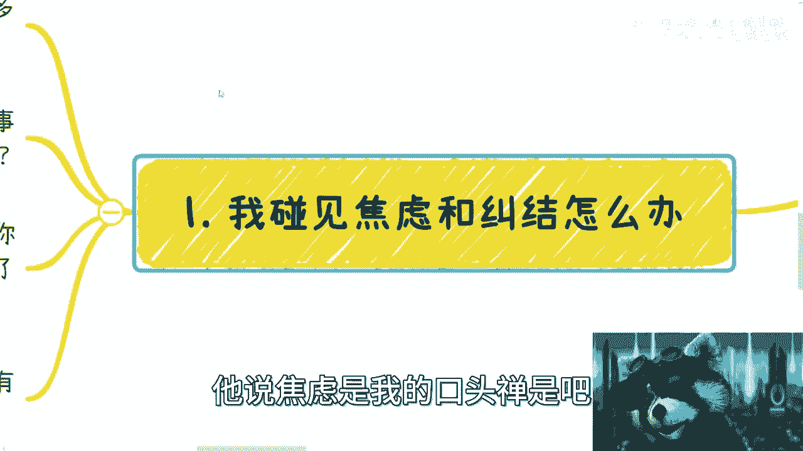
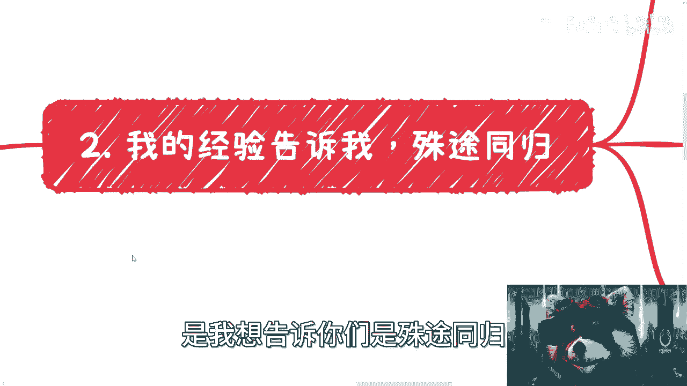
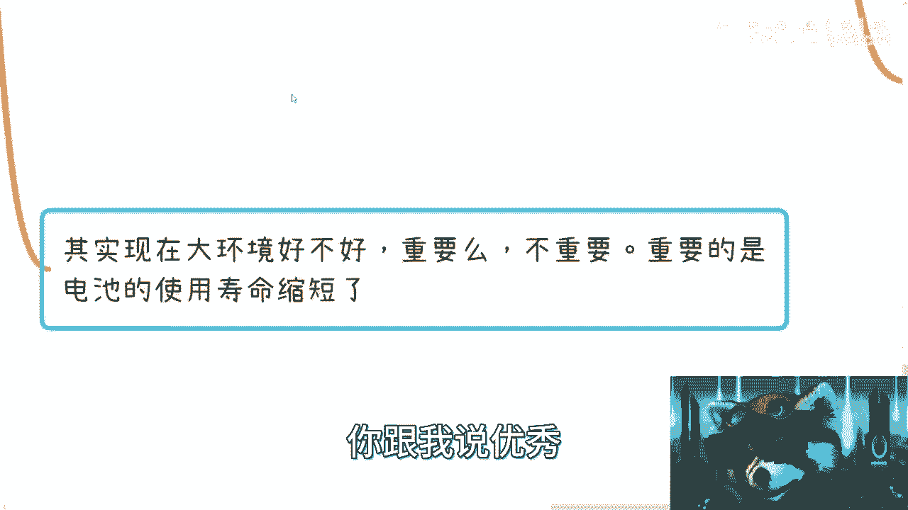

# 不要无谓的焦虑和纠结，结果往往殊途同归！（大家最好都看下） - P1 - 赏味不足 - BV1zP411R79T

哈喽大家好啊，今天是礼拜几礼拜二啊，这个问题啊，这个问题我最近就好多好多好多评论，私信咨询好多好多好多是吧，我觉得我真的我要跟你们说一下呃，思维啊，心态这是最重要的，别的矮都无所谓，我跟你说啊。

首先啊是这样子的。

就是我呢一直焦虑对吧，人家都说了，他说焦虑是我的口头禅是吧。

就很焦虑啊，我也很纠结啊，但是怎么办呢，是这样子的，我之前有讲过我日常做task的那一期是吧，就之前用team bition对吧，因那期我给大家分享了，就我之前可能早年办大会时候订的那些。

这个日常的一些任务啊，就我日我日常会写很多task，那我焦虑的时候呢，我就会去看啊，我就会去总结，那为什么我就会问啊，就是说啊这个为什么我最近没事做对吧，或者我应该做什么对吧，然后其他人在做什么对吧。

那我这些task就是哪些task为什么没完成对吧，为什么这个task没有推进对吧，那我就要去总结啊，到底是为什么，是你总归会焦虑啊对吧，总归会纠结，但是我跟你们讲很多东西真的没有意义的，你听我说下去啊。

第二呢就是说欲速则不达，我跟你们讲这事你一定要记住，就是你碰到很烦的事情对吧，或者你心态不好，或者说焦虑，你不要急，我跟你讲，你心态是最重要的，因为你比如说你有贷款要还对吧，你现在急需要用钱。

你现在没有收入对吧，那么很多时候呢你碰到任何一个事情对吧，你都会发现你好像是抓到了救命稻草，那其实基本上呢，这个时候你就已经百分之百是被骗到韭菜了，就想都不用想，而且你要明白。

你这种时候你心态不好的时候，你做出很多抉择就是错的，你知道吧，没有意义的这件事情，因为那个时候你已经失去判断力了，那么同样的就是说在这种时候呢，我跟你们讲，你们要告诉自己，欲速则不达，你知道吗。

真的就是不要着急，就反而这种事情啊，反而这种时候你要慢下来就快，没有意义的，你们但凡踩过坑，一定会明白我说的这个意思，你知道吧，就着急本身没有任何用啊，也包括焦虑本身也没有任何用。

你是没有任何的帮助对吧。

然后只会让你去做错误的决定啊，就是这个事我给你们分享一下这个事儿啊。

然后呢是这样子的啊，就核心这次主题呢是我想告诉你们是殊途同归。

什么意思啊，是这样子的，你举个例子，比如说对吧，现在有好多小伙伴跟我这么说的，他说哎呀我纠结去什么城市对吧，我要纠结找什么工作，我要去什么学校，纠结是不是读研，纠结是不是考公对吧，好我跟你们讲啊。

我的经验是这么跟我讲的啊，假设你选了a接下来的整个时间线啊，时间线发展对吧，你比如时间发展是aa啊，你选择了b接下来时间发展是bb，你现在你会你可能会觉得aa跟bb有很大的差别，叫做天壤之别啊。

我们举个例子，就比如说你读你选了a a啊，我就一飞升天了啊，迎娶白富美走向成功对吧，就跟纳斯达克敲钟是吧，我选了bb好不得了了，那我接下来只能住桥洞对吧，手里捧着窝窝头对吧，没有一点油是吧啊我跟你讲。

你说有没有差别，有啊，我不能完全跟你说没有，但是你说你认识的人也许不同，做的事情也许不同，没毛病啊，没毛病呀呀呀呀呀，没毛病，但是我跟你讲你本身的成长，你本身面对的问题或者你内心的焦虑对吧。

就是说你现在所面临的问题，你的你的你的各种各样的纠结，跟你选了a和选了b之后，你这个时间线在aa上走了5年，跟在bb上走了5年，我跟你说，本质上没有任何区别，你明白我意思吗，就是说也许很多。

你看到面表面上的东西是有区别，但是在我看来没有区别，所以这也是为什么我跟你们说，很多东西我一点都不在乎，因为对我来讲，你们本质没有改变，就这件事情是治标不治本的，有意义本来没有意义的呀。

你们觉得有意义的原因，你知道是什么吗，之所以你们觉得有意义，是因为你们对于很多东西是没有是未知的，说的不好听点就是太无知了，你知道吧，就但凡你们知道了很多东西，你就会发现没有任何意义。

大家都你在这个环境跟那个在那个环境，就它不是一个它不是产生质变的事情，它只是会产生一定的区别，但这个区别对你来讲帮助没有那么大，你知道吗，所以就是大家其实会害怕的是有不同的结果。

但其实真的没有那么大的差别，但是但是话又说回来，为什么我要跟你们讲，就是因为我不希望所有的人踩了无数的坑对吧，然后等到血头破血流了再去明白这个道理，甚至很多人可能到五六十岁还是不明白对吧，没有意义。

因为很多人性格就这样子，但是你你你知道吗，就有很多人跟我聊的时候，就是我会告诉他，你不能既要又要，就是你很多东西就是要改变的，没有办法的，你知道吗，你觉得再痛再苦，你也是要去改变，没有办法。

你如果改变不了，你就达不到你，你就走不到，另外一个，就是你没有办法从从一个level走向另外一个level，这没有办法的，你知道吗对吧，所以你会发现你，你会发现我跟你们讲很多东西啊。

就是我从来不去选那些我控制不了的东西，哪些我是控制不了的呢，那比如说回到这里啊，读研要不要读对吧，或者说读研你选择哪个专业，你控制得了吗，很多人你控制不了，要么调剂对吧，要么你可能就没得选是吧。

你就为了个为为为为了一个学历对吧，去什么学校你能控制吗，你也控制不了你很多东西是看发挥对吧，找什么工作啊，你更控制不了了对吧对吧，然后你给我跟你们讲啊，哪个东西是对你最控制不了的。

就是你当一个电池什么时候被用完了，被扔到旁边，这就是你最控制不了的，对不对，那既然你控制不了，你去想他干什么呢，对吧，你昨天微信上就有个朋友对吧，有好好长时间没跟我联系了，就在跟我说。

他说哎你最近怎么样，我说没怎么样打塞尔达，他说你是不是财务自由了，我说也没有呀，那他说你怎么不焦虑，那我说我焦虑有用吗，我焦虑是能11年多几个case吗，还是我焦虑1年能多几10万没有用啊。

你让我焦虑干嘛呢，是不是啊，所以随意对吧，所以呢你会发现所有的内容我都是一个价值观，就是我从来不建议你们去创业，我也不建议你们裸辞，但是我建议的是，不管你们做什么，你今天哪怕跟我说。

你全职什么什么读本科也好，读研究生也好，读研别也好，读读读读读那个叫什么ph d也好，随便对吧，读你到你到读博也好，无所谓对吧，因为这些事情对我来讲，这些东西不是大家能控制的，你有了一个学历。

这只是你的一个一个背书，一个title，但这不是你掌握的东西，那我记我自始至终啊告诉大家，就是说你们要去积累，所以你们能够去掌控的东西对吧，包括比如说积累你们做项目的经验，积累你们对于这个社会的理解啊。

积累你们做商业的case啊，去思考怎么赚钱的逻辑啊对吧，这些是你们能掌控的，所有剩下的都不能掌控，那你们去焦虑它干嘛呢，没有意义的呀，你明白吧，没有任何意义，主动权是在别人手上的，不在你手上。

这也是为什么我一直说你跪舔你，只能你只有是一定的label，你再往上走，你跪舔是没有用的，为什么，因为跪舔人多了，又不是你值一个人会舔，是不是，那包括喝酒逻辑也是一样的，你别觉得喝酒对吧。

就是酒文化对吧，你做了什么，你不喝就没有这个，喝了就有kiss，那我照你这么说，那不得了了，那他妈世界上所有会喝酒的都有这个kiss啊，这逻辑自我就就无法说清楚，你知道吗，就很多时候这个逻辑真的就是唉。

就我不知道这脑子怎么长是吧啊，三是什么呢，就是这条路并行的这个事儿呢，就你们一定要明白，工作这个事情呢是永远存在的，你想工作啊，我相信你都找得到，问题就在于你想不想去，你知道吗。

就这不是说很多人眼高手低或者怎么样啊，是有很多人眼高眼高手低啊，但是啊整个环境变化是我们不能控制的，有的时候环境是很好，有的时候环境是很环境是很差，但是你想想看，工作这个东西你要找你要找总归找得到的。

只不过就是钱多钱少，离家远，离家近对吧，你工作加不加班，你自己想不想对吧，那那可能就现在的当下情况是什么，就是你不想想的人多的是对吧，就是就一直说嘛，上海什么什么，人家说你想的人。

可以从门口排队排到淮海中路是吧，可以可以从这边排到那个城隍庙是吧，那你怎么办呢，是吧啊，那么这是第一个，第二个呢就是说你积累的人脉跟资源，别人是带不走的啊，当然有人跟你也会跟你共享这些人脉资源。

这肯定的，因为有价值的人脉跟资源，肯定很多人都去找对吧，但是呢他跟你达成合作就是你的对吧，不会说他跟你达成合作前，别人别人的不现实的，那当然你如果被白嫖了对吧，被什么跳跳单了，那这是另外一件事情。

但是你积累的人脉资源这个东西啊，总归是属于你的啊，而且你们最终会发现人其实是最终的解决方案，就是你做什么其实根本不重要，所以这也是为什么我会跟你一直回答，你们说我不care，你知道吗，我觉得不重要。

为什么，因为人才是最重要的，你只要有对的人，对的合作方，对的资源，你做什么都可以成啊，你明白吗，就是你你别来跟我讲，你今天做做电商做什么东西，我觉得主要还是你们的关系链没到人，没有合作小伙伴没有对吧。

你但凡有靠谱的合作小伙伴，做什么不能做，有什么不能做的对了，你说我今天我跟你们这么说，我今天给政府做咨询可以做，我明天不做了，我去做电商也可以做，有什么不能做啊，我这边小伙伴自己也在那个义乌那边有直播。

有直播叫什么叫什么叫什么直播间的，对不对，然后我这边也有一些富二代，有货源的，就大家卖卖卖，卖东西有什么不能做的，没有什么不能做的，人才是最重要的对吧，只不过就是说可能我当下不是那么有意愿去做。

或者我当下不是那么的着急去做，那ok啊，我就保持这些关系，大家有有空吃吃饭，有空喝酒有什么不好呢，对不了，不重要啊，其实你看我每天会在那边纠结，说哎呀我到底要做电商，我还是做做咨询对吧。

哎呀我怎么这两个都没单子，我完全不不关心对吧，然后我我会去想嘛，哦我做了这个东西以后发展会不会这样子哦，我做那个东西发展会不会那个样子，我跟你讲，不会的，为什么，因为你选择任何东西，除非就跟我一样。

我是自己的关系对吧，或者自己认识的人，否则你但凡去别的地方打工，你选什么东西，这方向是你能决定的吗，跟你有什么关系啊，对不对，是吧，然后我跟你们讲，哎呀早上有个评论真的把我气的半死，早上有人跟我说啊。

能力达到一定label就可以不去搞人际关系啊，我跟你讲，要我说真的too young too na，过于傲慢，真的过于傲慢，我给你们看看，我直接直接复制下来的，为了这个这个不那个隐私信息啊。

我就没必要去把id解出来是吧，他是这么说的，他说他说啊，我说的内容还不够优秀啊，我说的这些人还不够优秀，首先呢写在历史上书的那些天才，谁都压不住啊，这点我认同没毛病啊。

但是这种跟普通人基本可以看作两类物种，没有问题啊，社会的推进主要是靠这种天才，而普通人虽然做不到天才，学到真正精通，这样也可以算作有能力这种人，我自己身边就有这种有能力的人。

真的可以自己去挑选自己想要的环境，他说我说的这种优秀的人多的是，有没有可能他们并不是真正优秀，高端人才是稀缺的，不管哪个行业确实是缺了谁都可以的，但是又真的有能力的人，同样可以。

这个企业不想带去别的企业，我给你看，我怎么回答啊，我说这位大哥，你在说啥呢，对吧，挑自己想要的环境，那不还是电池嘛是吧，那还是别人掌控啊，我跟你们说当下什么环境啊，这叫做等年纪大了。

你就是被替换的命啊对吧，你甚至年纪不大就要被替换了，为什么，因为我告诉你，我作为一个资本家，我就一点所有的人，只要不是这世界上你有什么诺贝尔，你是得了诺贝尔奖的对吧，或者你是什么什么顶会上面有任何的呃。

学术顶会上面去发表论文的对吧，你有什么不能替换的啊，你给我去学精通，算老几啊，学精通他妈世界上精通人多的是了对吧，对我来讲，我只要有钱，我他妈找谁不是找啊，对吧对吧，所以我告诉你们，我一直想要强调的是。

大家要实现自我价值，你给别人打工是你给别人打工没有问题，但是你给别人打工，随时随地别人都可以叫你滚，有意义吧啦没有意义的呀，你刚你还在跟我说电池有什么意义呢，啊这就叫优秀了啊，这就叫自我掌控了，唉真的。

我之前就跟你们讲过对吧，我之前跟很多人都讲过，就是无知不要紧，不要傲慢，你知道吗，无知不要紧，不要去觉得自己什么都知道啊，精通优秀考试真的是有意义吗，没有意义，我跟你讲毫无意义，我跟你讲最悲哀的是什么。

我有时候真的我跟我朋友就会说，我说你们不明白悲哀最悲哀的是什么，最悲哀的是什么，就是你花了很长时间去研究一个东西，研究一个技术，你很长时间去读研读博，到最后你会发现你依然还找不到工作。

或者找不到你想要的工作，你一方面会觉得自己为什么读了这么长时间书，还找不到一个自己想要的工作，另外一方面又会纠结于说哎呀我找不到工作，我赚不到钱怎么办，对不了，那你不是还是电池吗，有意味了，没有意义啊。

为什么命运要掌控在别人手上，当然我不是说大家都能自己掌控命运，但是这总归努力从第一步开始吧是吧，现在的大环境是什么，现在大环境就是说电池的使用寿命缩短了，这就是大环境，你跟我说优秀。

哎呀，我真的是可能你并不清楚优秀到底什么，什么叫优秀，是啊。

所以呢就是核心点是什么呢，就是迈开腿定好方向，开始试错，然后去积累，一切是为你自己的，不是为了别人啊，呃不要怕失败，失败也是经验，你知道吗，没有失败不会有后面的发展的，你肯定是要失败的。

这就好像有很多人跟我说，我去认识人，认识一些垃圾对吧，我去做项目，项目被别人骗了对吧，没问题，你只要不被骗骗钱，你被骗先感情ok的啊，没有问题的，你总归要这样子的，谁去了社会，谁去积累东西，一帆风顺的。

没有的，你要是有，你就不是普通人，你明白吧对吧，就是就是我们不要一直就都是既标的自己，普通人又说啊，我要赚钱，又说啊，我不想打工对吧，又说我这个打工打的不爽对吧，打的不开心，你不能既要又要还要。

你说是吧，但是我跟你讲，你既要又要还要的前提是什么，你得自己去积累啊，你有自己的掌控，你有自己的这个这个决定权对吧，你有很多的，比如说我们说你现在有plan a b c d e f g，那除了主业。

除了打工以外，别的东西你自己能掌控的，那你去既要又要还要啊，没问题啊，因为这是你的东西啊，你有足够的这个这个叫什么资格，你有足够的底气去要啊，对不对，没问题的，对吧，所以说呢我觉得就这个事。

我得就是大家思维一定要转变过来，是什么呢，就是很多你们焦虑的问题根本就不在点子上，你知道吗，很多的选择也没有你们想象的那么的可怕，可怕的是什么，可怕的是你们选择的永远都是别人的。

就是永远都是主控权在别人手上，而不在自己手上的决定，你这就没有意义对吧，但是回如果等到某一天，你们回过头来，比如说30岁，35岁，40岁，你们领悟了，回过头来你们就会发现你们的精力顾不上。

你们的时间没有了，世界也变化了，对不对，那到那个时候就真的没有意义了，好吧行了。