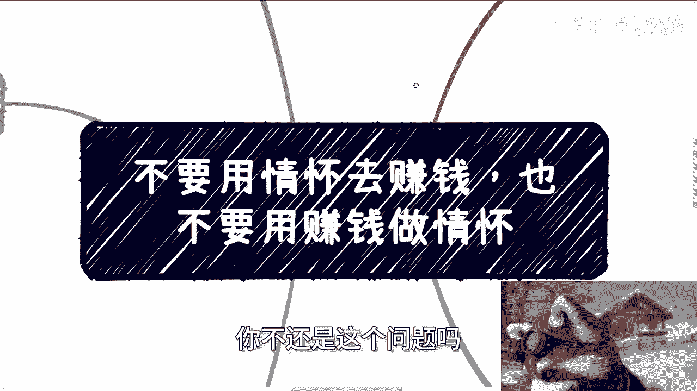

# 商业思维课 P1：分清赚钱与情怀 🧠💰

在本节课中，我们将探讨一个在商业实践中至关重要却常被混淆的核心问题：如何清晰地区分“赚钱”与“情怀”，并理解为何将两者混为一谈会导致失败。

---

## 课程背景与常见误区

昨天因身体不适未能更新。今天讨论的内容本考虑设为付费内容，但最终决定公开分享，以避免不必要的复杂情况。

最近我频繁遇到一种咨询：许多人拿着自己的项目计划书或商业想法来找我，声称他们找到了清晰的“痛点”和解决方案。然而，在审视这些计划后，我发现一个普遍问题。

以下是常见的几种误区：

*   **虚构的痛点**：很多人所谓的“痛点”其实是自己臆想出来的，市场并不真正存在。
*   **混淆成功要素**：一个项目能否成功、落地或融资，取决于**天时、地利、人和**，而不仅仅是“解决了某个问题”。正如风口来时猪都能起飞，关键在于是否在风口上。
*   **目的与手段的矛盾**：最令人尴尬的情况是，对方的产品本质是一个“割韭菜”的模式，却非要包装成“解决痛点”的情怀项目；或者，拿着一个纯粹的情怀项目，却问我如何用它赚钱。

面对这类问题，我常常难以直接回答。若建议其“好好落地”，那可能是条死路；若指出其“适合割韭菜”，又显得不妥。因此，有时不回复或仅以表情回应，是希望对方自己能心领神会。

---

## 理解你的客户：CBUG模型

上一节我们指出了目的不清的普遍问题，本节中我们来看看商业的基础——客户。从商业角度看，客户主要分为以下几类，可概括为 **CBUG**：

*   **C (Consumer/散户)**：指缺乏专业判断能力的大众消费者。需要理解“乌合之众”效应，你的身边圈子不能代表大众。若产品定位小众，却用大众化策略推广，失败是必然的。
*   **B (Business/企业)**：企业的核心目标是**盈利**。任何支出都期望回报，尤其在当前经济环境下，不能帮企业赚钱的产品或服务极难销售。
*   **U (University/大学)**：大学本质上是资金消耗方，其经费来自拨款、学费等。向大学推销产品，必须符合其预算体系和（非盈利性）采购逻辑，不能简单套用纯商业逻辑。
*   **G (Government/政府)**：政府项目将**政治目标和方向**置于首位。产品或服务若不符合当下的政策导向，即使本身优秀，合作也难以为继。

理解不同客户的核心诉求，是设计商业模式的第一步。

---

## 赚钱与情怀的本质区别

理解了客户，我们再来剖析两个核心概念的本质。赚钱与情怀在底层逻辑上截然相反。

*   **赚钱的本质**：这是一个**极度理性**的过程，核心是追求**投入产出比(ROI)** 最大化。
    *   **目标**：利润越高越好，理论上限无限。
    *   **底线**：不违法。
    *   **心态**：如同“没有感情的赚钱机器”，一切以商业回报为衡量标准。

*   **情怀的本质**：这是一个**不计代价**的过程，核心是追求**自我实现或情绪价值**。
    *   **目标**：完成某件事或实现某种价值，结果可能次要。
    *   **代价**：可以接受倾家荡产，不求物质回报。
    *   **心态**：为热爱或信念付出，过程重于结果。

将两者混淆会带来严重问题：
1.  **用赚钱的方法做情怀**：会被批评“玷污了纯粹性”、“借情怀敛财”。
2.  **用情怀的心态去赚钱**：会变得扭捏、想收费又不好意思，给人“又当又立”的观感，导致双方都不满意。

关键在于，你必须**首先明确自己的核心目的**：到底是追求商业成功，还是实现个人情怀？

---

## 高阶视角：AB面与大众舆论

那么，赚钱和情怀能否并存？答案是肯定的，但这需要更高阶的认知——理解事物的 **AB面**。

社会上许多事物都有两面性：
*   **A面 (表象)**：公众看到的情怀、公益、理想主义一面。
*   **B面 (里象)**：背后支撑其运转的商业模式、利益链条或战略目的。

成熟的商业体（资本家/既得利益者）所做的看似“亏本”或“充满情怀”的事，背后一定有其B面逻辑（如品牌建设、流量获取、长期战略布局）。你以为他在做慈善，只是因为你没看到他的B面。

此外，当你面向大众（C端）时，必须理解“乌合之众”效应和舆论的 **五五开定律**：

`支持率 ≈ 反对率 ≈ 50%` （当样本基数足够大时）

无论你的言论多么正确或荒谬，只要传播范围足够广，舆论反馈往往会趋向于支持和反对各占一半。这是人性使然，包含从众、批判、猎奇等多种心理。因此，过度在意他人评价毫无意义，**问心无愧**并坚持自己的核心目标才是关键。

---

## 总结与行动指南

本节课中，我们一起学习了如何区分赚钱与情怀，并理解了混淆二者的危害。

最后，给出清晰的行动指南：

**请明确你的核心路径：**
1.  **路径一：纯粹赚钱**。彻底理性，研究市场，满足客户需求，追求现金流和利润。
2.  **路径二：资本运作**。精心包装项目，获取投资或与资源方合作。
3.  **路径三：实现情怀**。放下盈利执念，为爱发电，享受过程。

**最忌讳的状态是“既要…又要…”，** 定位模糊、手段矛盾。例如，一个只有通过“割韭菜”才能盈利的模型，却非想“好好做情怀”，这注定会失败。

请基于你的真实目的，审视你手中的“牌”（资源、能力、项目），做出清晰的选择。如果你的职业规划、商业计划或股权融资需要第三方视角的剖析，可以整理好资料后进行咨询。

---
**本节课总结**：商业成功始于清晰的自我认知。**赚钱**与**情怀**是两条不同的赛道，各有其规则。混淆二者，用情怀的逻辑去追求利润，或用商业的尺度去丈量情怀，都会陷入困境。明确你的主要目标，理解你的客户（CBUG），接受大众舆论的复杂性，然后坚定地执行。