# 不要用情怀去赚钱，也不要用赚钱做情怀 - P1 - 赏味不足 - BV1Dw4m1277a

哈喽大家好啊，这个昨天之所以没更新呢，是因为昨天晚上去医院了。

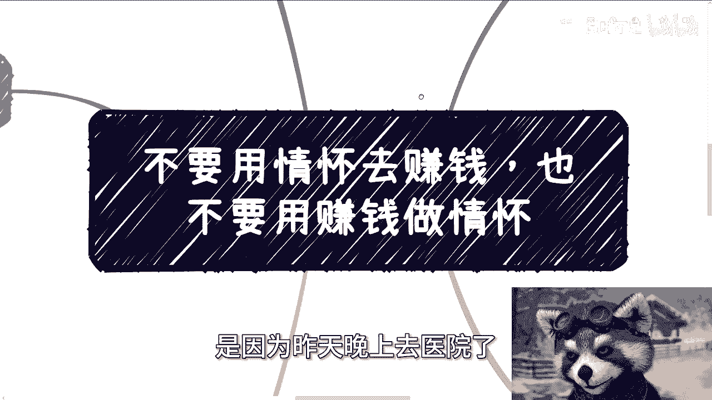

哎呀这个38。5，你说高也不高，低也不低啊，嗯今天稍微好一点好一点，呃本来这个内容呢我也想放充电视频的，但是后来想想算了。

问题不大啊，不放主要是因为怕啊这个节外生枝啊。

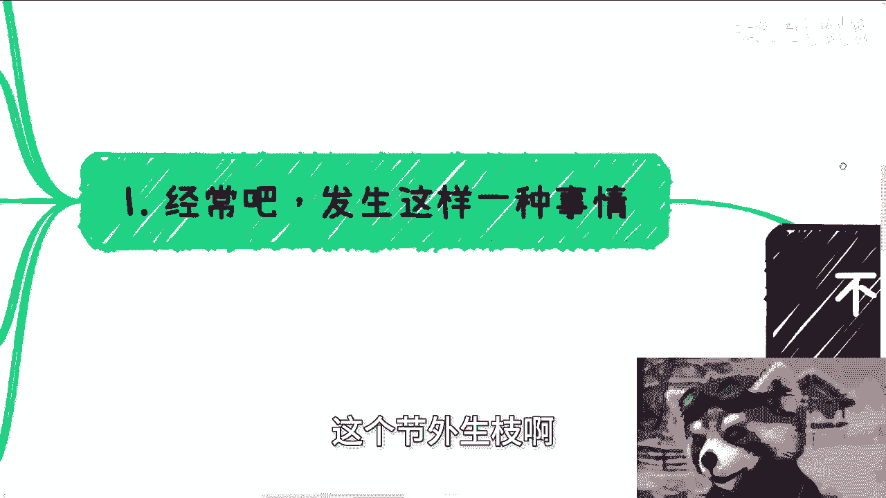

呃首先这么说啊，这个经常啊最近发生一件事啊，就是他说呃陈老师啊，我有个项目计划书帮我看一下，他说我有个id也很清楚痛点啊。

巴拉巴拉巴拉啊，嗯大部分人给我的这个东西呢，基本上都是老套路啊，就是就是你看下来你就会发现，就是说我给他们的原话啊，我说这个痛点呢基本上也都是你们YY的，也不存在这个痛点，项目这个东西啊，能不能落地。

能不能做，能不能融资啊，我跟你讲这个东西要看天时地利人和，不是说你解决什么问题啊，否则的话我们也不会说这个封口的时候，猪都会起飞，对不对，因为猪能不能飞，取决于在什么风口。

而不在于这个主题不解决什么问题，对不对啊，但是最尴尬的是什么呢，你们知道吗，就是最尴尬的，就是说最烦的就是明明他的这个产品，它是一个割韭菜的一个产品，或者说只有割韭菜才能赚到钱啊。

非要跟我说这个东西来解决了问题，解决了痛点，然后呢也有一些人呢就是拿一个情怀的东西。

然后跟我说要去赚钱，这个事情对我来讲就很尴尬。

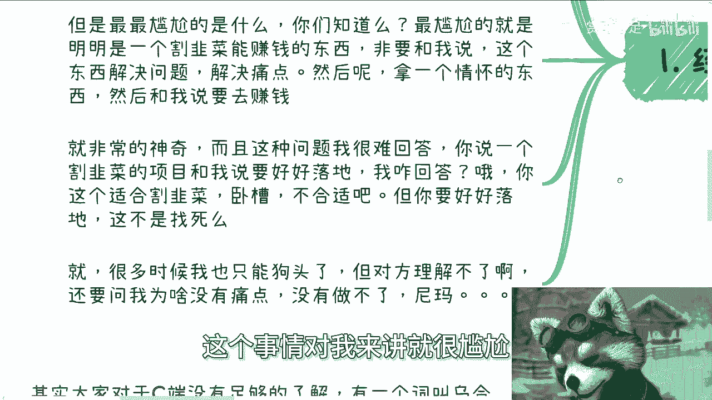

为什么呢，因为这个问题我怎么回答，你说一个割韭菜项目跟我说好好落地，我怎么回答啊，啊我跟你说，我说啊这个东西适合割韭菜啊，这回答好像不太合适吧对吧，但你要好好落地吧。

这我我我我我明明知道这好好落地等于找死，我也不能让你好好落地，你说你让我怎么回答，对不对，就是哎呀很多时候我就跟你们说，你们找我问这种问题的时候呢，如果我不回答。

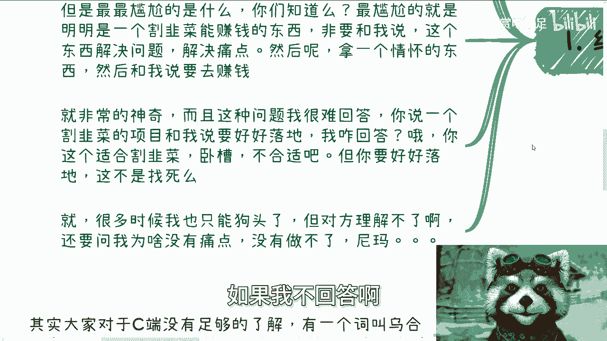

或者我给你们几个狗头啊，就完了，你们自己心里有数就好了好吧。

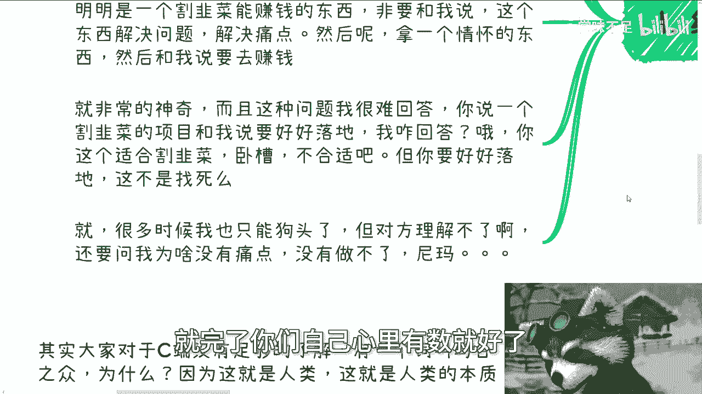

你不要再问我了，你再问我，我怎么回答是吧啊，这第一个第二个呢。

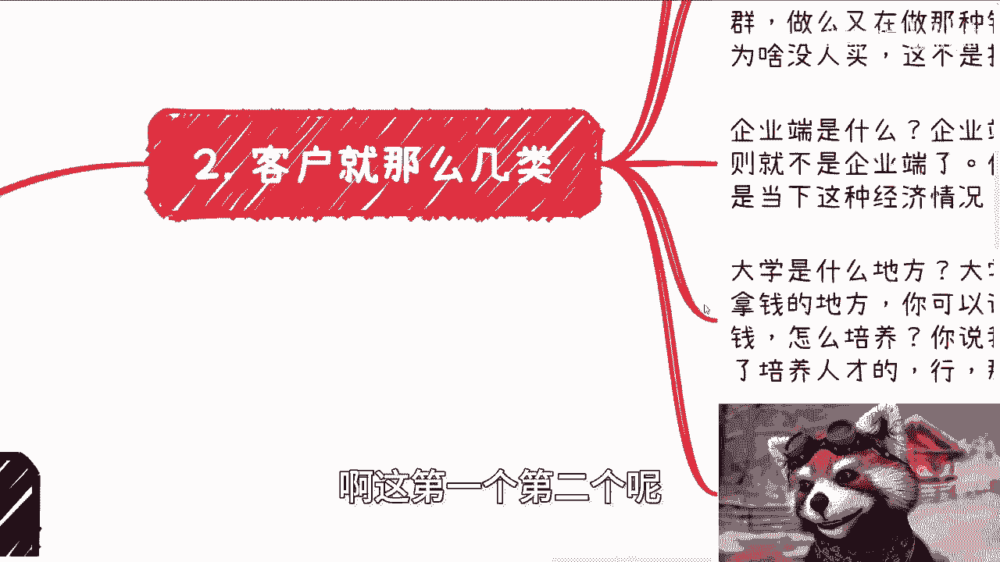

你要这么想，从这个商业角度来讲，你客户就那么几类CBUG对吧，这么几类散户企业，大学政府，对不对啊，那什么叫散户，我们通俗的来讲，不是说老百姓啊啊对吧，就通俗来讲，散户是没有判断能力的对吧。

你你就比如说一个政府这边，统计一个年薪2万8到3万2的一个人群，你告诉我有什么判断能力呢，对不对，就是他是没有判断能力的，你说你身边人都有判断能力对吧，那么也就是说你赚钱受众就一定是小众人群，没有错。

你懂吗，那你就去做，你别到最后就说定位的啊，你说我定位是小众人群做嘛，又是在做那种针对大众化的产品跟服务，然后说哎怎么没有人买，那你说这不是搞笑吗，对不对，就是你得明白什么叫乌合之众，你得明白什么叫。

就是就是这么大的群众基数是什么样子的是吧，你就就就再简单来讲，就是说你身边如果都是硕士，都是博士，你总不能说中国所有的老百姓都是硕士博士，或者说你总不能说90%都是硕士博士吧，你你这个逻辑不通啊对吧。

就我们还是那句话，不是说我们贬低或者说我们抬高，就客观的去理解不就好了吗，对不对，那企业端是什么，企业端就是花钱一定是要赚钱的，他不可能花冤枉钱，否则的话它就不叫企业端了是吧，你去卖自己的产品和服务。

尤其是当下中国这种经济情况，我就问嘛，你只要不帮他赚钱，谁他妈来买，没人来买的，你不要跟我说以前的递推或者怎么样子，那是以前你现在做不了，你明白吗啊。

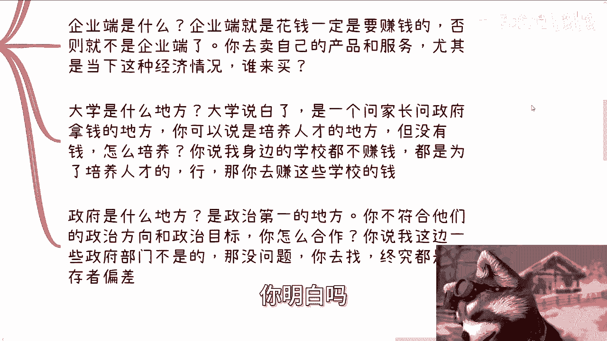

然后大学是什么地方，大学说白了是一个，那就客观的说，我不是说大学不好对吧，大学是一个问家长，问政府拿钱的地方对吧，你可以说是培养人才的地方，但是没有钱，我就问你怎么培养啊，你不搞笑吗，怎么培养。

你说你学校里面饭堂也好对吧，就食堂也好，包括其他各设施，为什么这么便宜啊，那是因为有钱他钱要去，有的钱是补助的，有的钱是补贴的对吧，有的钱可能是就是说啊问家长要的学费对吧，怎么样子。

他各地方都要去用的哦，否则怎么滴啊啊，完完全义务完全的这个这个卷嘛，到到大学就完全的是什么白养着，不会的呀对吧，你说我身边，你当然你也可以跟我说，我要陈老师，我身边的学校都不赚钱，就是为了人才培养行啊。

那没问题，你就去赚那些学校要钱就是一样的道理，你不要幸存者偏差，你带完幸存幸存者偏差，你不要到最后赚不到钱。

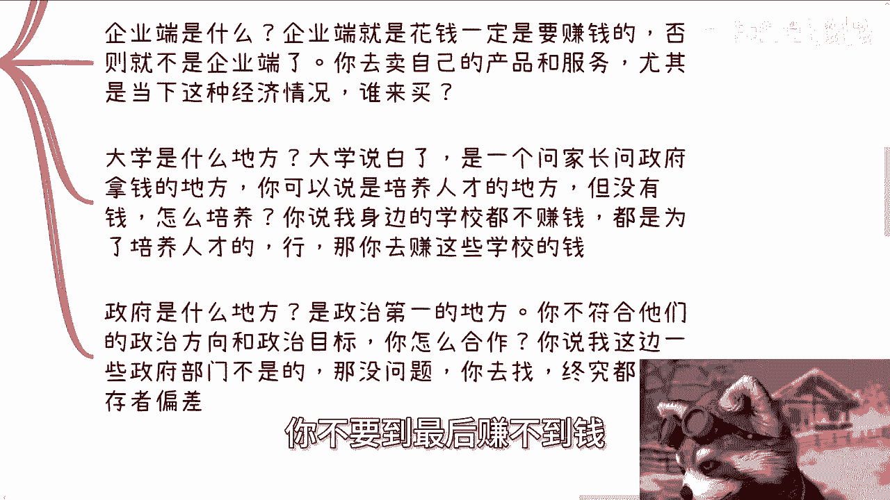

又反过来说啊，我为什么做个服务赚不到对吧，那你再想想看政府是什么地方，政府是政治第一的一个地方，或者说就说就是说相对来讲，政治更加低的一个地方对吧，你不符合他们的政治方向跟政治目标，你怎么合作啊。

你说啊我的东西做的很好，我的服务做的很好，你政治目标和政治方向就是不是朝一个方向，或者说不是很符合当下的这个方向，你还想合作啊。

你在想啥，对不对，就是说你客户在做整个业务的时候。

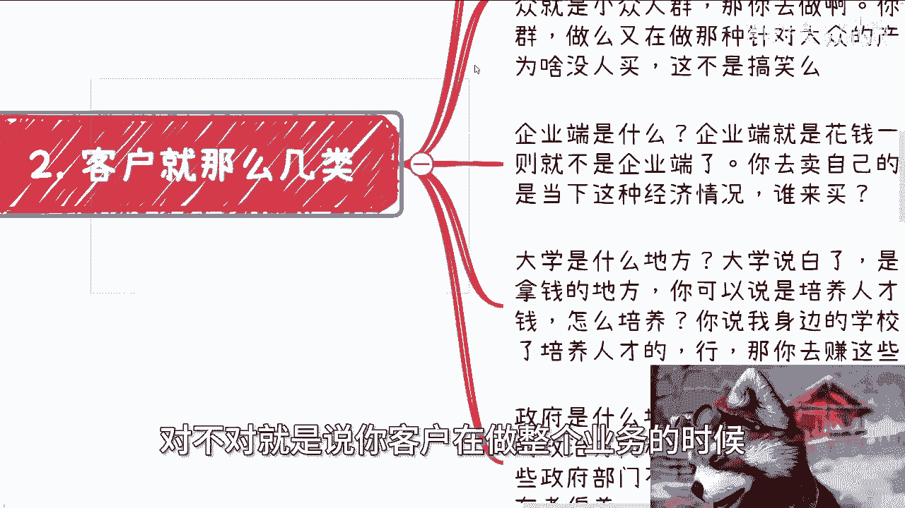

你也得明确好，那么说完这个东西，我们就来说啊，赚钱跟情怀你分不清楚，你但凡分不清楚。

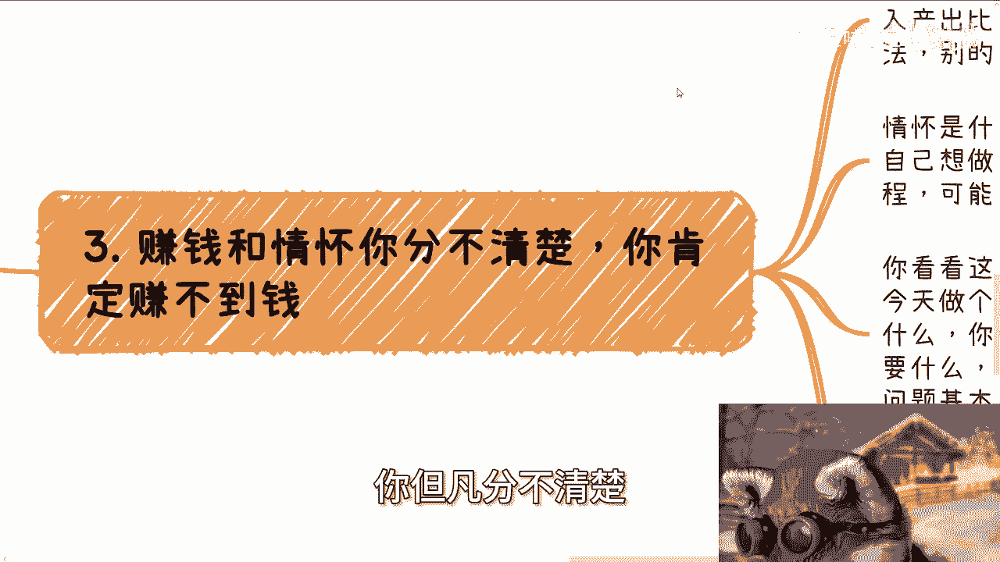

你肯定赚不到钱，因为你想想看啊，我们就说什么叫赚钱，赚钱就是毫无感情的，非常理性的去判断投入产出比，而且利润越高越好，利润利润率是没有上限的，下限是什么，就是不违法，别的没有了对吧。

就是说你你你你你说有很多人俗话说得好嘛，他说哎我就是个叫什么，你没有感情的赚钱机器对吧，什么叫没有感情的赚钱机器，就是我要尽可能多的钱有上限吗，没有那下限有吗，有的不违法，没了呀，你跟我谈什么东西呢。

没有了呀对吧，就如果你们想赚钱，你们也必须是这个逻辑对吧，当下的所有的既得利益者也都是这个逻辑，那么情怀是什么，情怀就是不计一切代价去做慈善，去做自己想做的事情，哪怕自己倾家荡产。

哪怕自己是得不到任何东西，无所谓，这叫情怀对吧，结果怎么样不重要，重要的是过程可能是一种情绪价值，也可能是一种自我满足，这不重要啊，这不重要，那么你看看这两者，我们刚才已经说过了。

你看看这两者是不是基本上就是完全相反，你怎么做，你今天做个产品，你甚至都分不清痛点，分不清客户要什么，你做什么产品，你要赚钱，你就直接去了解对方要什么，去满足对方，你别谈什么解决什么问题，你知道吗。

就是你认为的问题，基本上都他妈不是甲方的问题，你不要想了，因为你根本就不了解甲方，你也不了解社会，怎么会知道甲方的问题是什么呢，对哦你跟我说哦，因为陈老师因为我学历高，有因果关系吗，啊啊你说你说啊。

因为我年轻，那他妈更没因果关系，对啊，有些人都跟我说我出过国，那不好意思，还没有还是没有因果关系啊，你你知道痛点只有一种可能性，就是你已经深入这个群体，你已经知道这个群体是怎么运作的。

那么你知道他的痛点对不对，那么你就更别谈情怀了，很多人包括曾经的我，我跟你讲啊，想着做情怀，顺便赚点钱，尼玛我跟你讲啊，就是就如标题写的，你用赚钱的方式去做情怀，你用情怀的方式去赚钱，你都会被骂的很惨。

为什么，因为你用赚钱的方式去做情怀，人家一定要骂你的，做情怀赚什么钱啊，对不对，你用情怀来薅我们羊毛，对不对，你肯定要被骂，那么你用情怀的方式去赚钱呢，好了，那搞笑了，那么人家就要说你就是你。

你因为你相对会是一个比较理想化的状态嘛，对吧，然后你又想去赚钱，你就会变成一个扭扭捏捏的，就是那种感，就是想收钱，但又不敢收，那你到时候就会很尴尬，就是人家搞不清楚你目的到底是什么对吧。

那肯定要骂你，但就人家那句话说的很清楚，就是赚钱，你只要手段明确对吧，你方式方法OK没问题，但是最怕的是什么，就是你自己分不清楚你要干嘛，然后呢搞得好像你想赚钱，但是你好像又搞得自己不想赚钱对吧。

然后就是又当又立，你怎么搞的对吧好，那么我们就说在中国，有没有可能赚钱跟情怀并存，我告诉你们有的有的哪种可能性，就是当你们了解社会更多的时候，你会发现社会上很多东西都是ab面的，我以前说过这个问题。

你懂吗，什么叫ab面，就是A面会让你觉得他是情怀，而B面会让你知道，他背后有非常多的赚赚钱的东西，而大部分的人你们永远看到的都是A面，B面你们看不到，而当你们看到的时候，你们就会打破A面的这层幻想。

就这么简单对吧，就像我以前跟你们说过的，但凡他是个既得利益者，但凡他是个资本家，他如果哪天做了一件事情，让你们觉得他根本不赚钱，或者说他根本就在用慈善的方式做事情的时候，我告诉你们，他一定是有他的目的。

因为他作为一个资本家，作为一个既得利益者，他不会去做亏本买卖，而你们觉得他做亏本买卖，仅仅仅是因为你不知道它背面是什么。

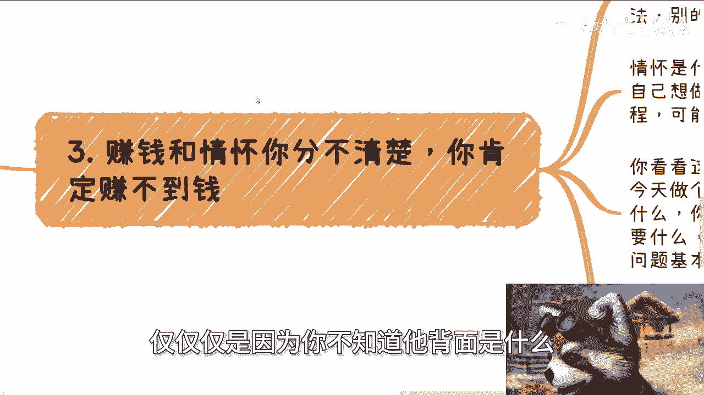

仅此而已啊。

那么第四点啊，我曾经说过，重要的就是我不是写的，这边写错了，就是我曾经说过，就是说主要基数够大，声音永远是五五开的。

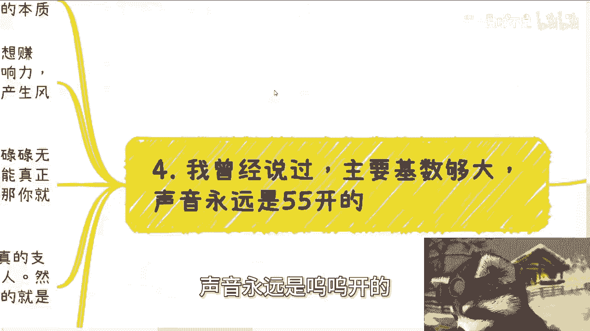

你你要明白一点啊，就是什么叫C端，什么叫普罗大众，有一个词叫什么叫乌合之众啊，那么我在这方再三强调啊。

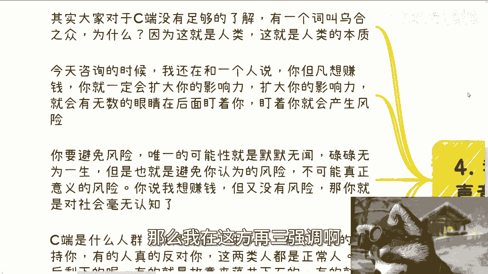

我们不是说贬低或者抬高某些人，我们只是说这是个人类的本质，就是你比如说今天咨询的时候，我在和一个人说，我说你但凡想赚钱，你就一定会扩大你的影响力，而扩大你的影响力，就会无数的眼睛在后面盯着你对吧。

然后盯着你就会产生风险，我说这个没有办法的，因为别人盯不盯着你，不是你能控制的，以及别人盯不盯着你，这就是人性所驱使的，没有办法的，你要避免危险，唯一的可能性就是默默无闻，碌碌无为对吧。

但是你默默无闻碌碌无为，也就避免你认为的风险，不可能避免所有的风险，你说他妈哪天地震了，台风了，你避免吗，你避免不了要不可抗力，你说我想赚钱，但又没有风险，那不好意思，你既既要又要，那你怎么办对吧。

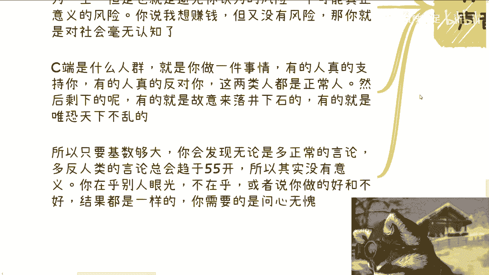

然后你要明白什么叫乌合之众，乌合之众就是你做一件事情，真就是有的人真的是支持你，有的人真的是反对你，但是这两类人都是正常人啊，都无所谓，最怕的是什么，是剩下的就是有的是故意来落井下石。

有的就是唯恐天下不乱，你懂吗，那么但是不管我们说它出于哪个原因啊。

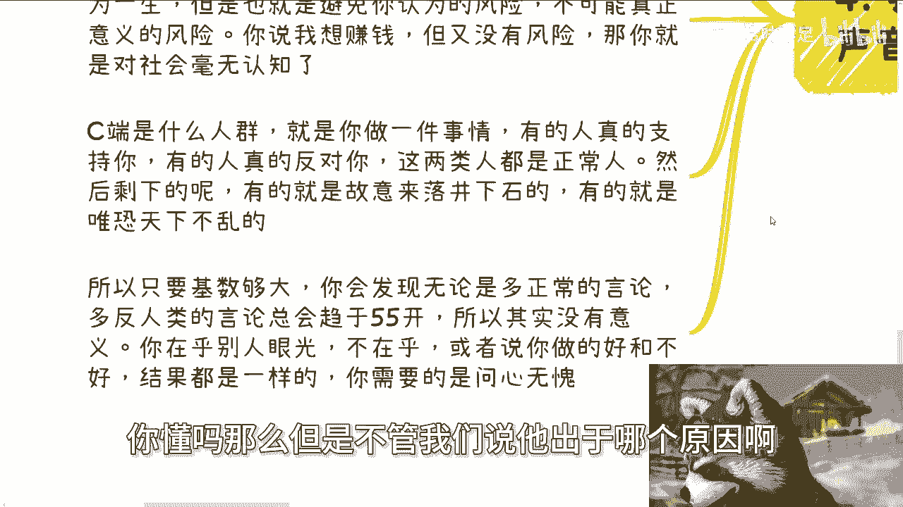

只要他的基数够大，你就会发现无论多么正常的言论，就是你一眼看上去，理论上这个言论应该是所有人类都支持的，也无论多么反人类的言论，就是明明你听上去就是就是这种言论，就应该是所有人都反对了。

但是无论多正常多反人类，你就会发现他最终的结果会趋于五五开，为什么，因为人性本性就这样子，没有办法的，他是无法统一的，而且你从大部分人来讲，他是没有自己的判断能力的，那么你你从比如说从众心理啊对吧。

包括他落井下石啊，包括怎么样子，只要基数够大，你最终就会趋于五五开，没有办法的，所以这也是我们说你在乎别人的眼光，你就是你在乎也好，不在乎也好，你做得好也好，不好也好，其实结果是一样的。

你需要的是问心无愧，你就不要去想这么多，你知道吗。

所以说本质上是什么，本质上就是看你的目的是啥，就是我一直跟他们说，我说你要赚钱，你就彻底一点，你就好像很多人跟我讲，他说我要出国留下学，我要去读个研，我要不要全日制或者非全日制去考个考个研，对不对。

我说你们想干嘛，就是如果你想赚钱啊，比如说你今天听到这里的人对吧，你比如说你想赚钱，你就彻底一点，我就问你们，你觉得你读完研，你就懂得怎么赚钱吗，不会呀，你出完国留完学回来，你就懂得怎么赚钱，也不会呀。

你到时候面临的问题，跟你面临的问题是一样的呀，对不对，就是你要是跟我说，你说OK我是因为通过这些事情，我想往后延几年对吧，我想再缓几年，你说我在这几年里面想清楚做什么，那没问题，那可能是有一定的改观的。

但是你如果从你的心理来讲，你就觉得我要读个研，我要留个学，然后我就问你，我说你目的是什么，你跟我说赚钱，那他妈这两者没有因果关系啊，那在我看来。

你就是你去绕这个圈子干嘛呢，或者说你绕完两三年的圈子回来，你不还是这个问题。

对不对，去吧，这没意义啊。

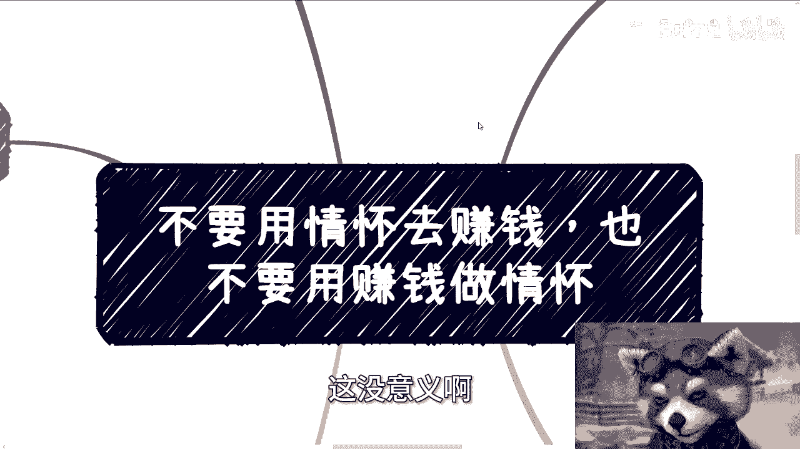

真的是没有意义啊，你懂吗，所以就是说很多时候你去做一件事情，你就会发现就是我跟他们说的很清楚，你要么就是去想办法赚钱，有现金流，你要么就是包装好，去拉投资对吧，或者说去找那些土老板对吧。

你要么就就不要想着赚钱，你说我就实现我的人生价值，你三者取一或者取三都可以，你千万不要就是上不上下不下的啊，就就是我发现很多小伙伴就是定出来的，这个方向就非常的离谱，就是明明是一个就像我说的。

明明就是说这个这个业务逻辑啊，就是就是你要赚到钱吧，你只有去割，你不割吧，你是赚不到钱的，然后呢，他非要跟我说，爱创时，我想这个东西好好做，尼玛我我我真不知道怎么回，真不知道怎么回啊，好吧行啊。

你这么着啊，嗯反正你们自己想想吧，想想叫什么，就是职业规划，商业规划啊，然后股权融资啊，合同啊啊包括就是说你们手上呃有什么牌对吧，也就是希望从我这边，从我的视角能看看你们牌怎么打的对吧。

看看这个未来怎么发展的好吧，你们也可以整理好好吧，然后私信我们在做咨询好吧，随缘啊。

