# 不要用自己的短板去拼别人的长处，要学会合作 - P1 - 赏味不足 - BV112421F7uK

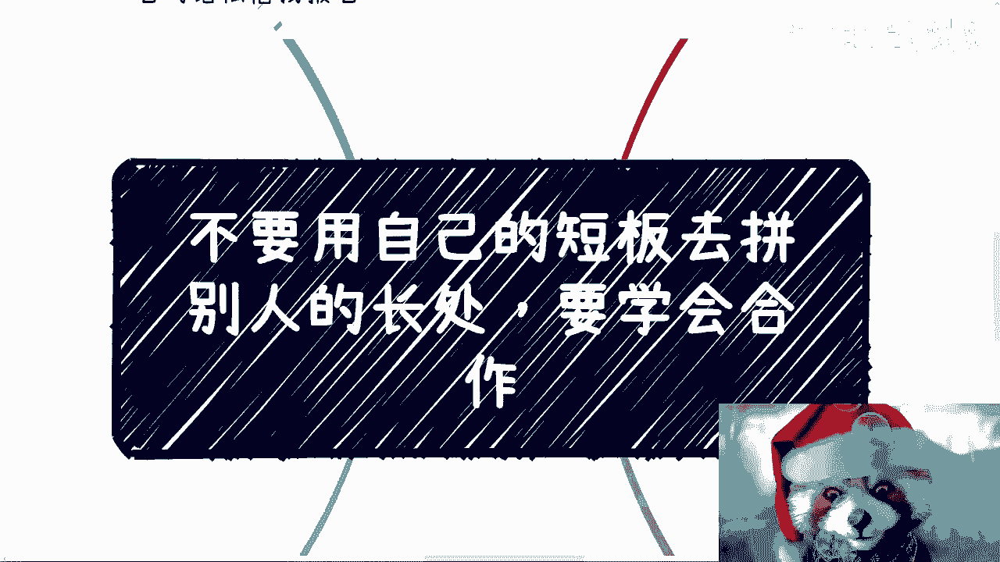

好大家好啊，嗯今天今天是不是应该都上班了。

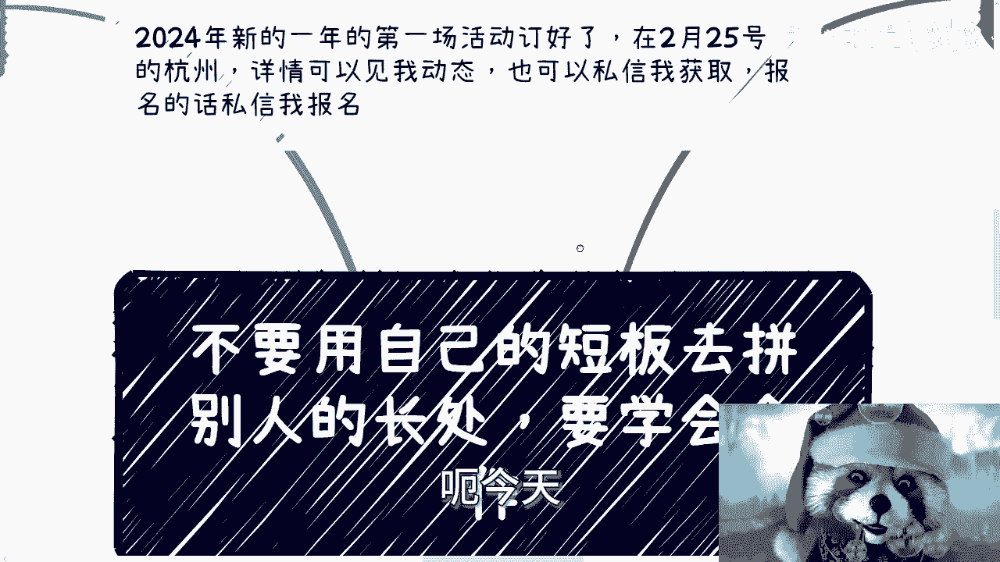

呃2024年咱们新的这个第一场活动，我已经订好了，2月25号在杭州好吧，然后详情的话可以进我动态。

也可以私信我获取好吧，报名的话私信我报名，那么今天我们来讲的主题是，不要用自己的短板去拼别人的长处。

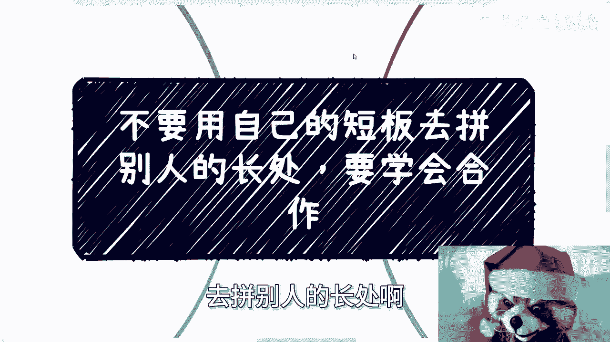

要学会合作，之所以讲这个主题呢。

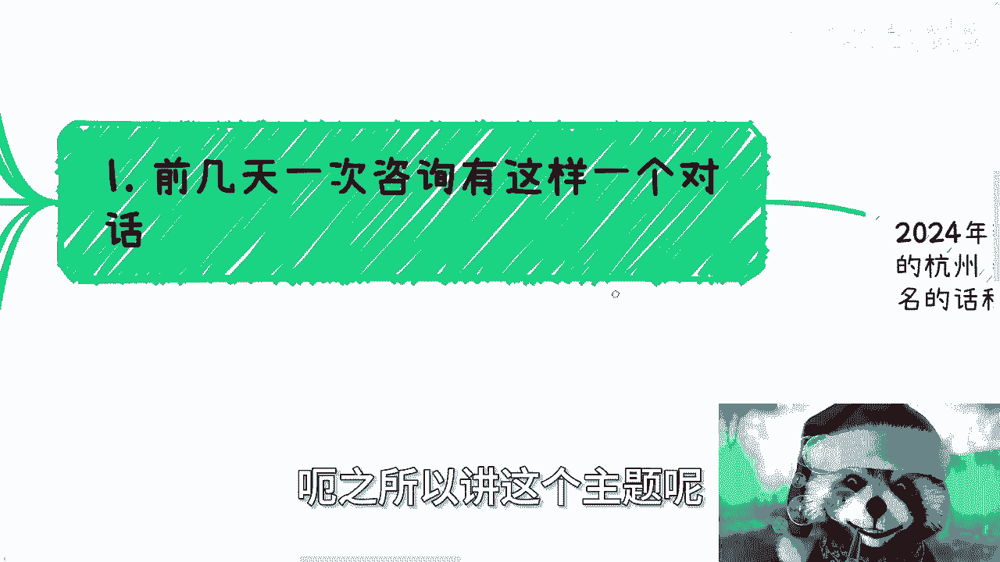

是因为前两天咨询呢有这么一个对话啊，呃首先呢是就是我我了解下来，包括我咨询下来，我觉得这个当时找我的这个A啊，他学历啊，包括就是说读书，包括他的一些兴趣爱好特长，我觉得都是很不错的啊。

就是都是我羡慕的那种啊，而且呢也有海龟的经验，然后呢我觉得问题在于哪里呢，问题就在于就是说这个是他非常明显的特点，或者说是呃擅长的点，或者说是他的优势吧，但是同样的就这个优势跟他的短板就是一样的。

明显短板是什么，就是社交比较少，或者说他表示我根本不会社交，而且他年龄其实也也怎么说呢，不小不大啊，呃而立啊而立，那么对于整体国内情况也不了解，那么A呢当时就问了这么一个问题。

他说呃我是不是应该去多社交啊，然后那么我在社交的过程当中，我怎么跟别人去拼啊，然后我应该怎么去社交，我应该怎么跟呃，这个市场里面大部分的人去争单子和项目啊，好呃我当时是这么和他讲的，我说你呢优势很明显。

你也有别人没有的，或者说在商业上那些人缺少的，因为在我看到的整个视野当中，其实很简单，就是真正做单子的，做呃业务的，做商业的，或者说真正是呃，就是我们就说在中国这片土地上啊，就是广义角度来讲。

真正去做商业的很多人，他是没有我们刚刚说的，比如说啊比较高的学历啊，或者说海归啊，或者说他比较看书比较多啊对吧，这种特点它是没有的，那么我就跟他说，我说你别老想着去怎么竞争啊，你老想着怎么竞争。

其实等于说你再用你的短板去拼别人的长板啊，比拼别人的长处，你怎么搞的名号，搞的就是你要去弥补他们没有的，然后让他们来弥补你没有的，这不就更爽了，而且事实上也是一样的对吧，就是说那些人来讲，他也需要你。

只不过就是说你得通过你的社交，通过你的主动性让对方选择你，因为毕竟你在市场上有很多个，你有很多个属性跟你一样的，你对吧，那么呃那些商业的也是一样，也有很多属性跟他们一样，那么大家为什么选择对方。

那就看我们叫做什么，就看谁会哭吧，会哭的孩子有奶吃，就这个意思，那当然A和我国，A和我说，他说他自己也下定决心啊，未来会去社交啊，会去呃改变，或者说怎么样，怎么样，让自己。

就是真正的开始了解这个社会和赚钱的方式，我当时这么说的，我说我不是不相信你会改变，而是你的而立之年，你的历史以前的过往基本上没有看出来，你有这方面的潜质，对于我来讲啊，你们每个人讲的话讲什么。

我其实都不相信的，而且我信不信不重要，不改变你们是什么样子，也不改变我是什么样子，但是我要给出对应的建议，一定是要有依据，这个依据是什么，就是以前的你也就是说他而立之年，我看到20岁到30岁。

他没有一些比如说折腾的迹象，或者说很会折腾的这种主观能动性，那我根本就不会相信他，30岁之后能有很大的改变，而且我当时跟他这么说，我说你真的改变了，你也是在强逼你自己，让你的短板稍微长一点而已对吧。

但是无法你去，你根本就没有办法去跟真正的那些擅长的，或者说短板没有你那么短的那些人去抗衡，那你花大量的时间去把这个短板补偿的意义，在哪呢。

就没有，所以说我觉得大家啊就举一反三，就是呃你们可以想想看。

很多时候很多的问题都是这样子的，不单单是我们刚刚举的这个例子啊，第二点就是我昨天在充电视频里面也说到了，专业这个事情，你看啊在里面我提到的这几个点，几个点呢，我觉得是公开可以跟大家说的，呃。

一个就是很多人去了学校跟选择的专业，结果出来之后发现自己根本就不擅长，也不喜欢，根本无法发挥自己的长处，或者来说他根本就没找到自己的长处是什么，对吧，那同时但但但翻相反啊，短板倒是知道的很清楚啊。

这个我倒觉得很也很好玩啊，那么同样的昨天呢，我是这么说的，我说如果你会写代码，而且你也是很不错的学校出来的，你代码写的不错，那我就问写代码能赚钱吗，不能为什么，因为能带来钱的是项目，能带来全是单单子。

能带来钱的是关系，你会写代码，别人也会写，客户会因为你清华北大出来就给你单子吗，你出去聊聊看啊，你们但凡出去聊聊看，没有这种客户的啊，不好意思，绝对不可能的哦，他给你单子给你钱赚，一定因为别的原因。

不会因为你是清华北大出来就给你单子好，如果这么简单的话，呵呵那说实话现在社会也不会这么复杂啊，那么比如你会设计能直接赚到钱吗，也不能，为什么，因为你就算设计的很好，客户哪来呢，你说你设计的很好。

客户不认啊，老板不买单啊，你说你很好，你说他妈的老板都是，客户都是，不懂审美可以啊，那你去说好了，反正你赚不到钱，为什么，因为老板给你发的钱，因为客户给你给你拉的单子，你说什么有用没有用的。

天上不会掉客户下来的，那请问专业跟学校的意义能有多大呢，啊不要来跟我讲打工打只要打工，我们就不在一个层面，你不要跟我讲啊，不要跟我讲，我只关心怎么赚钱啊，包括就是说30岁之后，我告诉你什么专业。

什么学校意义不大胆，对于普通人来讲，30岁之后你就是个人，剩下没什么标签的，你爱信不信随便你，对不对，你随便找几个30岁以后的人去问问，你就知道了，我相信大家去读书的目的，是为了找个好的工作啊。

找好的工作目的呢就是为了赚钱，我不相信有多少人是为了读书去读书的啊，然后说我的目志向就是为了找个好的工作，你不给我钱也行，有吗有吗，对不对，不就是为了赚钱吗，干嘛昧昧着良心说话呢，那么核心就是赚钱。

那么所以说大部分的人核心是赚钱，而不是前面这些，前面这些有用吗哈，那前面这些只不过是你可能赚钱的道路之一，而不是一个必然的道路，就这么简单，而不要去掩盖这种赚钱的现实啊，也不要掩盖赚钱这种事实。

不要搞得好像哎呀我很清高对吧，我就是为了读书，我就想读好书，就想去个好的学校啊，拉倒吧拉倒吧啊，很多时候很多人做事，他既不去挖掘自己的长处，也避也不会避开自己的短板，这就好像完全脱离了自己这个人的特性。

就是你虽然你好像这个人是活着，但是你循规蹈矩的跟着别人去走，等着你年龄大了，面对家庭和社会的时候，你就跟个婴儿一样不知所措，这不是现状吗，对吧好，第三啊，从事实角度出发，无论你多牛逼。

我真的我可以打保票，无论你多牛逼，你单个人都是没有用的，单兵作战永远都是没有意义的啊，你就像我以前认为最牛逼的技术，就是所谓的硬技能，我要打魔鬼的技能，打魔鬼的技术，但后来我发现了我所谓的硬技能。

我所谓的打磨满地都是，而且我学的没有别人好，为什么哎就跟我们今天这个主题一样，因为学这些东西就是我的短板，而且我认为大部分人的短板，因为大部分人没有天赋，就我们只能学一个东西，这个东西就是嗯这么说吧。

今天我还看到那个B站上有一个视频，说什么什么要好好学计算机啊，好好学底层，学什么东西也很搞笑，你真的读过计算机的人都很明白，现在出去工作大部分CTRLCCTRLV复制粘贴，大部分都是表面层的东西。

学那些底层有什么用啊，不就是为了你考个好的学校吗，不就是为了你能够通过面试吗，但事实上有用吗，没有用，对不对，那你有什么硬技能，大部分人是学不会硬技能的，你能学会应用技能就已经不错了。

那你从我的角度来讲，我就会去想了，那我为什么要用我的人生去学别人也会的东西，或者说我为什么要用我的人生去学，大部分人也会的东西呢，这其实每个人都有每个人的特点特点，我觉得只不过这个特点单独拿出来。

是无法变现的，或者无法产生价值的，你如果真的有合适的合作方啊，就是我觉得1+1大于三对吧，1+1大于四很快就能起飞，就真的跟市场没有关系，市场再再差，你也能起飞哦，我们不要一味的去想着什么都自己做。

也不要一味的想着自己去弥补一些短板，比如你说啊我缺学历，我性格内向，比如说什么一些别的东西没有意义的对吧，你包括你包括之前评论区还有人跟我说什么，哎我们有国赛一等奖金，奖金个屁呀，哎呦你妈搞笑了你。

我还是那句话，你30岁之后出去金奖，你金金个看看有啥用啊，你金奖放在地上吗的二二维码，人家扫不扫都不知道，那金奖呢唉我跟你说啊，如果什么都自己去补，一方面呢这是不现实的，另外一方面就是浪费时间。

而一切一切本身，其实都是需要你自己去主动挖掘和探索的，假设假设啊，你的确是块不错的拼图，就是你拥有不错的想法跟不错的技能，但不可能我告诉你，就几乎不可能有所谓的伯乐来发现你。

因为伯乐现在身边的拼图太多了哦，不管是千里马还是伯乐，每天都用在这个网络的杂音当中，谁会看到你啊，诶奇了怪了对吧。

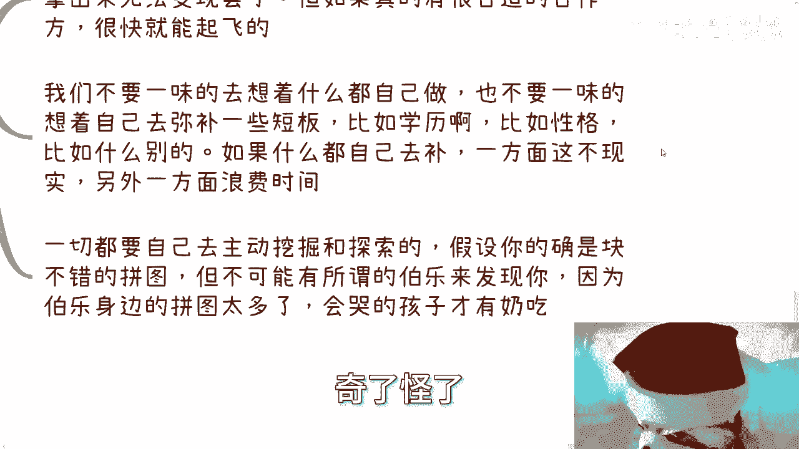

所以我才说会哭的孩子有奶吃啊，那么第四就当我们要去做一件事情的时候，我们要先从宏观的框架去思考。

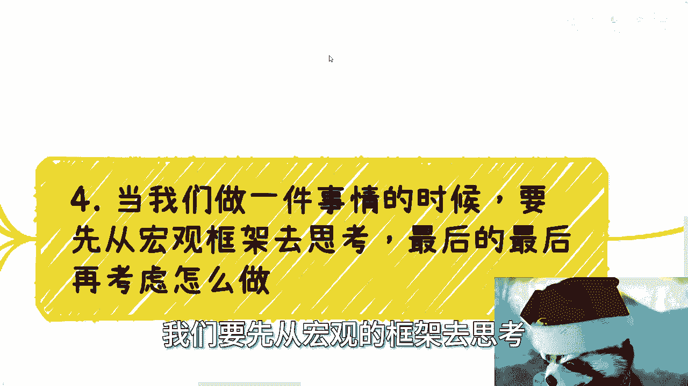

最后最后再考虑怎么做啊，一定要记住最后的，最后就是你看现在大众的思维是反过来的，就是当我们聊起任何一件事情的时候，对方总是先跟我说怎么做对吧，这件事情就是个惯性，因为一方面学校家里的人就是告诉我们。

要落地做好事情的，另外一方面就是打工的惯性，比如说呃毕竟比如说打工，就是说啊老板说啥，你做啥，一切就要考虑细节，只要你不是资本家，只要你不是创始人，只要你不是就是站在比较上层的那些。

你基本上就是考虑细节，你不会有自己想法的，但你要自己做一件事情的时候，其实本质上就颠倒了，你要先去了解这件事情当中，在产业，就像我充电视频里面写的，在产业对吧，大家是怎么合作的一个项目当中。

有哪些角色和有哪些团队组成，然后你要根据自己的，就是我们说的这个这个长处和短板，结合自己的特性，再去寻找自己有可能变成的角色，因为你不可能自己DIY，就是Y1赢出来一个角色吧。

你肯定是要适适应整个的这个规则，去变成里面一个角色。

那你变成什么样的角色呢，对不对，然后你再去看看你缺什么，然后再去补，或者是寻找合作伙伴，你做这件事这么一个反推的方式，而不是说你你你比如说很多咨询的时候，他们就会问我哎陈老师，我是不是要先去做自媒体。

我是不是要先先去考个研，我是不是要去怎么样，我说你要先考虑你的目标，你要先去考虑你要做成什么样子，你去反推，你单纯这么问没有意义的，啊所以说你看啊大部分人做一件事情的时候，他一开始先想细节。

先考虑怎么做，怎么落地，那么你大量的精力就会花在怎么去做细节，怎么弄，然后呢，然后呢对吧，我当然这个地方的宏观，不是说你一定要了解的很清楚，而是说你要有了解，而不是一问三不知对吧，就是就像比如说。

如果说我们说这个了解百分之百的话啊，你起码得了解个二三十%吧，然后你开始去想去思考，而去往下规划，而不是说你你你你你你基本上了解就0%。

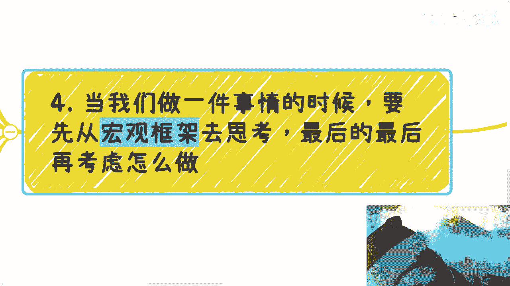

1%，那你去做，虽然说我们说一边做一边调整方向，一边做一边调整方向，你这个做法跟莽撞其实没有区别。

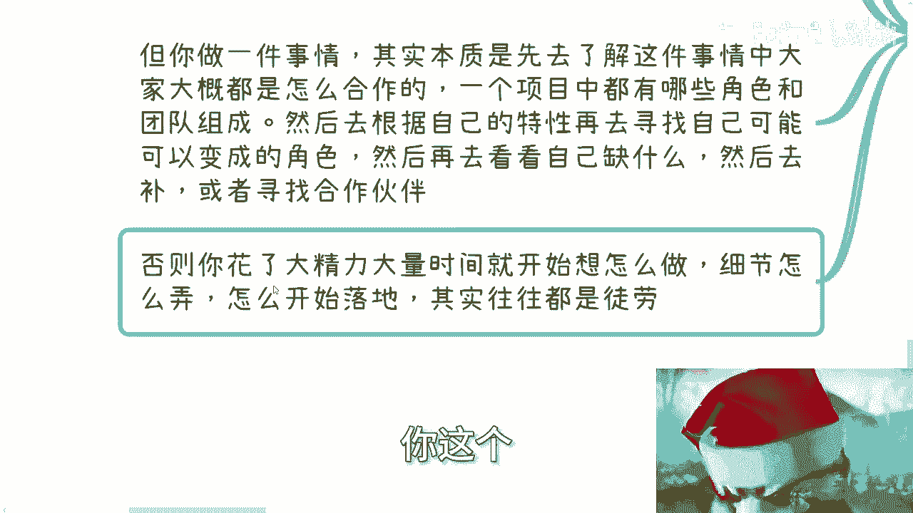

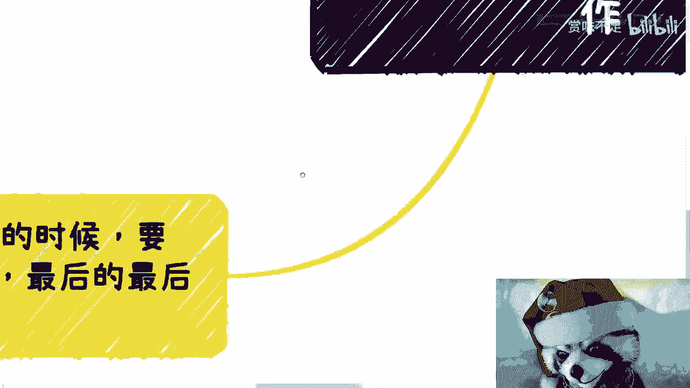

啊所以说就是你说这个思想上改变了，我觉得真的还是需要比较长的时间，但是这个改变的唯一的路径不是靠听，不是靠看，不是靠想，只能靠做哦，就像我刚刚说了解这个宏观的所谓了解，怎么了解，你也是去了解啊。

就是要去社交，去了解，做kiss去了解，其实也是了解，而不是说哦我今天看了个视频，我今天读了一本书对吧。

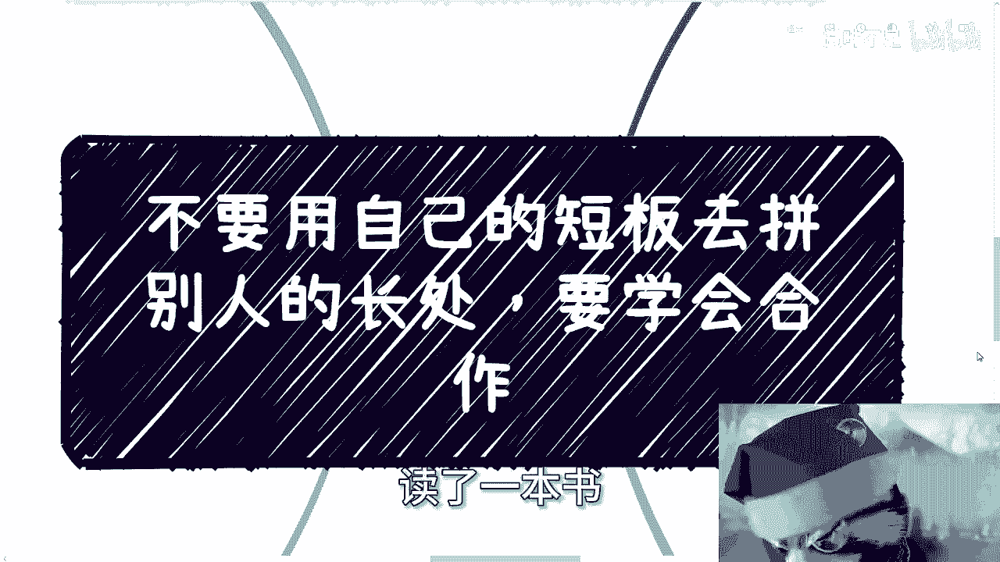

我今天看了看了一个读了一个学历对吧，怎么样，我就了解了，你不了解你了解啥，行那个祝大家2024年暴富好吧，开门红开门红哎呀，这个工作了大家也不容易好吧，然后那个活动呢要有需求的，你们就找我报名啊。

然后商业上职业规划上啊，或者什么像像一些合同上或细节上，或者什么怎么融资啊对吧，什么融资比例啊等等等，反正你们觉得有需要的，你们整理好问题好吧，然后我们再私信我咨询啊。

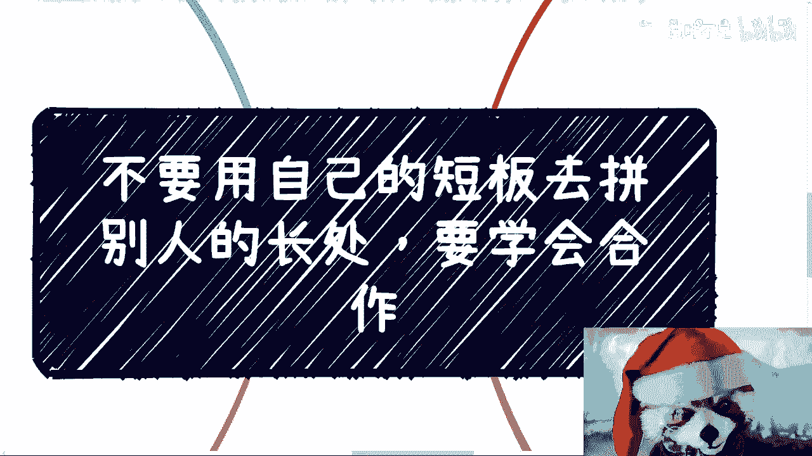