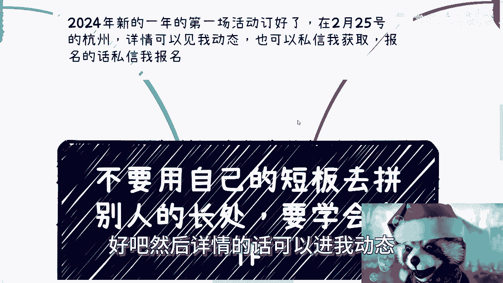
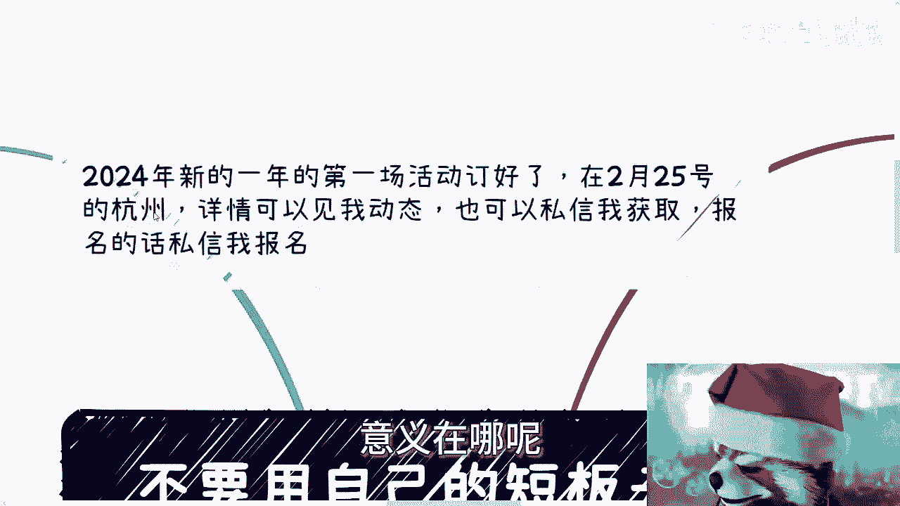
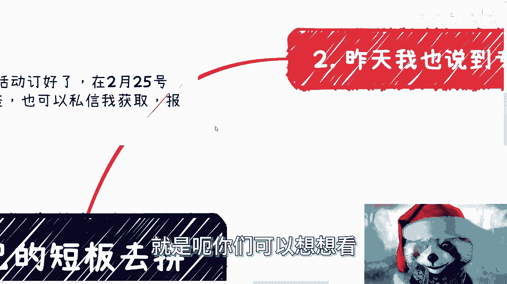
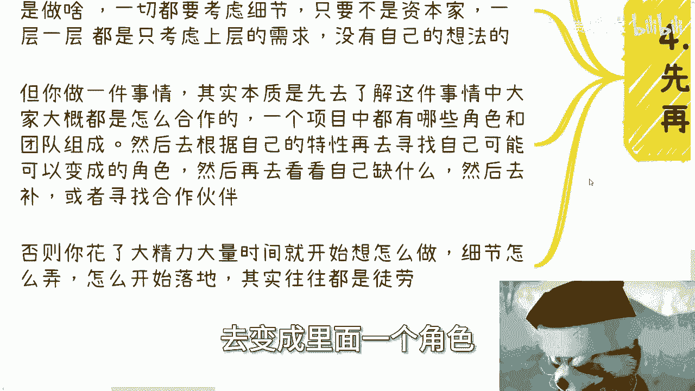

# 课程 P1：避免短板竞争，掌握合作之道 🧩

在本节课中，我们将探讨一个核心的思维模式：不要用自己的短板去硬拼别人的长处，而要学会通过合作来放大自身优势。我们将通过一个具体的咨询案例，分析常见的思维误区，并提供一套从宏观框架出发的行动思路。

---

## 概述：一个咨询案例的启示

课程从一个具体的咨询对话开始。咨询者A拥有高学历、海归背景和丰富的知识，但短板是社交能力弱，且对国内商业环境不熟悉。A的问题是：是否应该努力弥补社交短板，去和市场上的人竞争项目和单子。

回答的核心观点是：**不要用自己的短板去拼别人的长处**。对于A而言，他的优势（知识、视野）恰恰是许多实干型商人的短板；而商人们的优势（关系、项目、本土经验）则是A的短板。正确的策略不是让A花大力气变成一个不擅长的“社交达人”，而是应该**用自己的优势去弥补他人的不足，同时让他人的优势来弥补自己的不足**，即通过合作实现共赢。

这个案例引出了我们今天要深入探讨的几个关键点。

---

## 核心问题分析：为何不要硬拼短板？

上一节我们通过案例引出了核心观点。本节中，我们来看看支撑这个观点的几个深层原因。

### 1. 弥补短板效率低下且不现实

很多人意识到自己的短板后，第一反应是去“补短”。但这往往效率极低。

*   **改变固有模式极其困难**：就像案例中的A，在而立之年之前都没有表现出强大的社交或折腾的能动性，那么期望在短期内发生根本性改变是不现实的。强行改变可能只是在逼迫自己，让短板“稍微长一点”，但无法与那些天生或长期擅长此道的人竞争。
*   **投入产出比失衡**：将大量宝贵的时间和精力投入到不擅长的事情上，其收获远不如将同等精力投入到打磨自己的优势上。公式可以简单表示为：
    **个人总价值 = 优势价值 - 短板损耗**
    与其花费巨大成本去减少“短板损耗”，不如全力提升“优势价值”。

### 2. “专业”与“标签”的局限性

许多人将“好专业”、“好学校”视为成功的必然路径，但这在真实的商业世界中存在局限。

以下是几个需要厘清的观点：
*   **技能不等于变现**：你会写代码、会设计，但这不直接等于能赚到钱。能带来收入的是**项目、单子和关系**。客户不会仅仅因为你的毕业院校或专业技能而买单。
*   **标签的时效性**：对于普通人而言，30岁之后，“名校毕业生”、“专业人才”等标签的效用会大大减弱。社会更看重你作为“一个人”所能提供的综合价值，尤其是**解决实际问题和链接资源的能力**。
*   **核心目标是赚钱**：大部分人求学的最终目的是为了获得更好的生活，本质是**赚钱**。专业和学校只是可能的路径之一，而非目的本身。掩盖赚钱的务实目标，空谈理想，不利于做出清晰的人生规划。

许多人既没有挖掘出自己的长处，又无法避开短板的困扰，只是循规蹈矩地跟随大众路线，最终在面对现实压力时会感到不知所措。

### 3. 单兵作战的无力感与合作的必要性

无论个人能力多强，单打独斗总是有极限的。

*   **“硬技能”的迷思**：很多人追求所谓的“硬技能”（如底层技术），认为这是立身之本。但对于大多数人来说，掌握“应用技能”已属不易。而且，市场上具备类似技能的人很多，用自己不擅长的领域（学深奥技术）去和别人竞争，正是用自己的短板比拼别人的长处。
*   **合作产生质变**：每个人都有独特的特点，但这些特点单独往往难以变现。一旦找到合适的合作伙伴，就能实现 **`1 + 1 > 3`** 甚至 **`1 + 1 > 4`** 的效应。合作可以整合双方的优势，绕过各自的短板，从而在哪怕低迷的市场中也能找到机会。
*   **主动展示的重要性**：在这个信息爆炸的时代，即使你是“千里马”，也很难被动地等到“伯乐”。**“会哭的孩子有奶吃”**，你必须主动出击，展示自己的价值，去链接你需要的合作伙伴。

---

## 行动指南：如何实践合作思维？

理解了“避免短板竞争”的重要性后，本节我们来看看如何将这一思维落实到行动中。关键在于扭转我们习惯的做事顺序。

### 从宏观框架到具体执行

大众习惯的思维是：先问“怎么做”（细节）。这是学校和职场带来的惯性——执行既定任务。但当你自己要开创一件事时，顺序应该完全颠倒。

以下是正确的思考与行动步骤：

1.  **定义目标与宏观了解**：首先想清楚你要达到的**最终状态**是什么。然后，去了解达到这个目标所涉及的整个**产业框架**或**项目结构**。了解其中有哪些关键角色、团队如何合作、价值链如何构成。你不需要了解100%，但至少要有20%-30%的宏观认知。
2.  **自我定位**：基于你对宏观框架的了解，结合自己的**长处和特点**，分析你可以在这个框架中扮演什么**角色**。你不可能凭空创造一个新角色，一定是融入现有体系，成为其中一个环节。
3.  **分析差距与寻求合作**：明确了你想要扮演的角色后，再分析你与这个角色要求之间的差距。这些差距是应该自己学习弥补，还是通过寻找合作伙伴来补齐？通常，涉及核心优势的可以自己提升，而属于短板的、非核心的环节，最佳策略是寻找合作伙伴。
4.  **最后才是执行细节**：只有完成了以上三步，你才能有效地规划“怎么做”的细节。这时你的行动才是有的放矢，精力才会花在刀刃上。

**错误路径**：我想赚钱 -> 我是不是该做自媒体？（细节）-> 我该怎么写文案、拍视频？（更细的细节）-> 陷入执行迷茫。
**正确路径**：我想在XX领域赚钱（目标）-> 这个领域的钱是怎么赚的？需要流量、产品、供应链、销售等角色（宏观）-> 我的长处是内容创作，适合做流量端（定位）-> 我缺产品和销售，需要找合作伙伴（找合作）-> 现在我开始规划如何做内容吸引流量（执行）。

---

## 总结与行动号召 🚀

本节课我们一起学习了“避免短板竞争，学会合作”的核心思维。我们通过案例分析了硬拼短板的低效性，探讨了专业标签的局限性，并强调了合作共赢的必要性。最后，我们掌握了一套从宏观目标反推，通过自我定位和寻求合作来达成目标的行动方法。

思想的改变无法仅靠听、看、想来实现，**唯一的路径是“做”**。无论是为了解宏观框架去社交、做调研，还是为了找到合作伙伴去主动展示自己，都需要你迈出行动的第一步。

祝大家在2024年都能找到自己的优势赛道，并通过有效的合作，实现事业的飞跃。