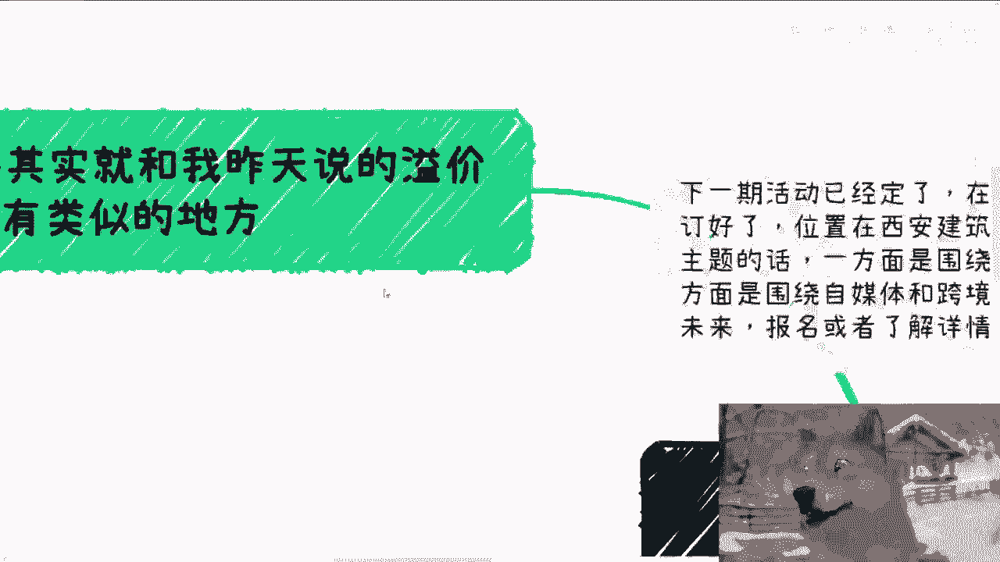
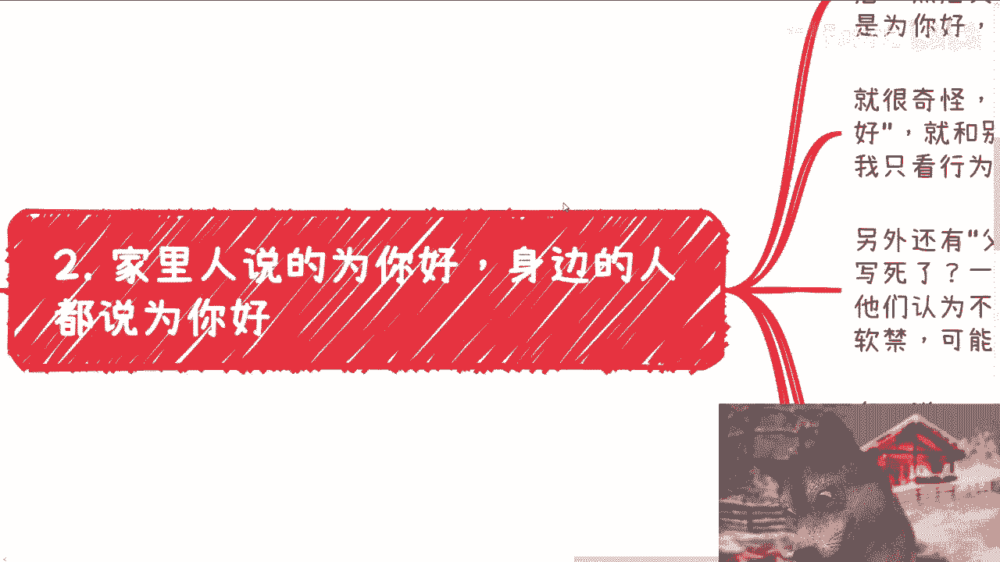
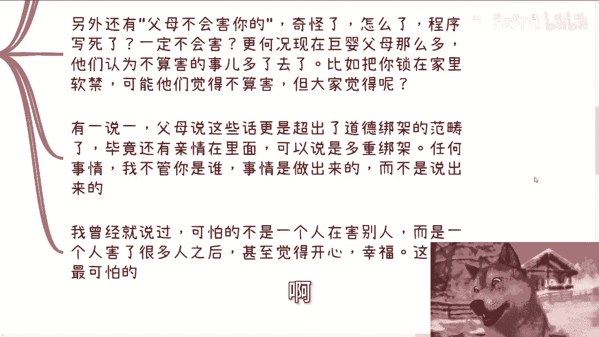
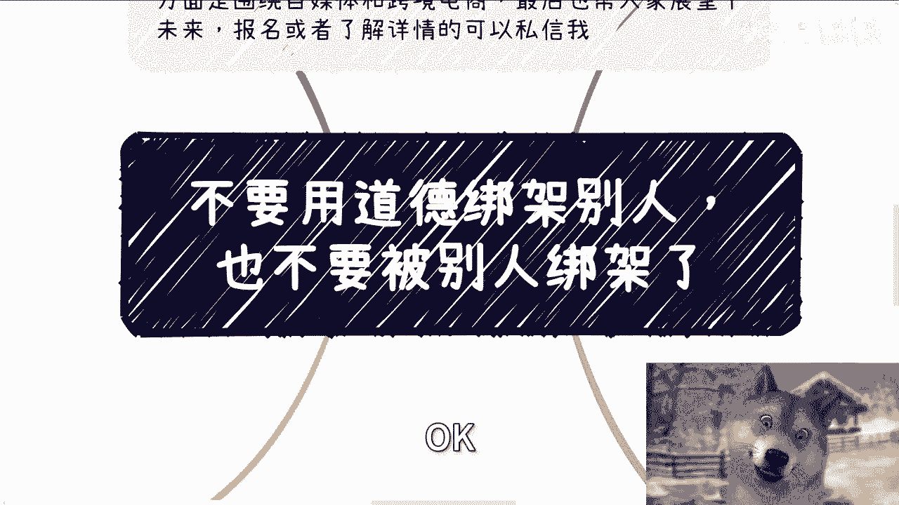

# 不要用道德绑架别人，也不要被别人绑架 - P1 - 赏味不足 - BV1xBWQeGE63

好大家好，今天今天礼拜五了啊，明天我就飞西安了好吧，然后今天B站的那个礼物也都到了好吧，下周我来给你们安排啊，呃明天开始我就开始宣传那个上海的活动了啊，上海大会呃，今天我们来讲的这个主题呢。

叫做不要用道德绑架别人啊，也不要用，也不要被别人绑架，嗯哎呀这个事的啊，哎呀怎么说呢，待会你们听了你就知道了啊，首先呃我现在说一下，下一期活动已经定了啊，8月25号就后天啊，在西安场地我也定好了。

位置在西安建筑科技大学李家村附近啊，那大概主题的话呢一个是围绕不同企业呃，国央企啊，民企啊，外企啊对吧，等企业的一些offer啊，另外一个围绕自媒体跟跨境电商，最后呢也帮大家就展望一下现在跟未来好吧。

然后报名或者了解详情的可以私信我啊。

呃首先第一个啊，道德其实跟我昨天说的那个议价哦。

就是商业上的溢价切入点有那么一丢丢啊，类似的地方呃，我可能这个词这个怎么说呢，用的不是很贴切啊，大家反正这个了解一下就好了，就我觉得就是模糊啊，就是没有边界感，非常的模糊，就道德并不是信息差造成的模糊。

更更多的我觉得就是人性造成的模糊，就很多时候争论也好啊，聊天过程当中，要么就是站在高德呃，道德制高点，要么就是就是道德绑架啊，进行沟通呃，怎么说呢，我觉得啊客观的说啊，我觉得普通人都是容易绑架的哦。

或者容易被绑架的，否则那就不叫普通人了啊，那比如说家庭，比如说学校，比如说职场，比如说商业呃，这里面很多很多嗯其实对于道德这个东西啊，没有任何明确的划分的这个规定，你比如说哎你你超过哪个县算道德低。

你超过哪个县算到的道德高，不知道对吧，我以前啊跟我朋友说过这么一句话，我说人呐是一只会变的一个动物啊，就是你你不能去按照你现在对他的认知，因为毕竟你现在活的时间，你只能知道现在跟过去，而且你了解一个人。

你你可能知人知面不知心，对吧好，那也就是说我说宏观点来讲，你不能说一个人是真正的善或真正的恶，为什么，因为很多时候你们会发现一个善举和一个恶行，他是在一念之间的，就是我举个例子来讲。

比如说你今天可能是一个很好很好的人，你是个非常善良的人，但是并不代表你不会作恶，你明白吗，哦当然你可能会觉得就是说不太可能啊，但是呢就是说一样的道理，就是人在一生当中到底经历过哪些事情，我们不知道啊。

那么你可能会因为某些事情哎在一念之间啊，然后这个天平就摇摆到了恶上面，这是很正常的，这才叫人性，你知道吗，就是他如果是一指的恶或一指的扇，卧槽，那他妈倒好了对吧，你一眼就能看得出来了对吧。

那人最奇怪的就是在这个地方啊，那也是为什么，很多时候我们听到很多恶行的，这种刑事案件出来的时候啊，你们会发现啊，什么新闻啊，采访啊，就说啊呃呃采访父母啊，采访身边的朋友啊。

说他们都会说哎呀这个人以前很老实的，这个人以前很嗯很好的对吧，人怎么样怎么样，咱就这么说啊，也许这个新闻，这个采访里面有一定胡说八道的这个成分，但总归有一些是真的吧。

对不对啊，那么第二，家里人说为你好啊。

这句话经常听到就为你好，身边的人都说为你好啊，依稀记得其实不少人跟我讲过，就说家里面啊父母呃，这个和呃，就是我们跟父母有矛盾啊，然后父母呢跟亲戚，还有其他那些朋友都说呢啊，你们不要去记恨对吧。

父母都是为你好，父母不会伤害你的，你要听话对吧，那我觉得就很奇怪啊，我我一直跟你们强调，是我们的生命都是独立的，对不对，噢父母说为了你好，跟别人说为了你好，这他妈是一样的，有什么区别呢对吧。

因为你你从我角度来讲，我觉得正常的价值观是什么，就是我管你好不好，我只关心从行为看，你不要来跟我讲讲他妈有吊用啊，对不对，你如果你行为伤害到了我，那他妈你讲得再好有卵用啊对吧，另外还有什么啊。

父母不会害你的，那奇奇怪了，怎么了，程序写死了啊，一定不会害程序写死了还有bug呢，是不是，更何况我告诉你们现在往后啊，比如说未来的10年20年，这个社会巨婴的父母越来越多。

对吧哦那么你们认为不算害的事多了去啊。

就他们认为不算害的事多了去了，我举个例子，比如说TMD把你锁在家里软禁他们，可能他们觉得是不算害呀，啊有一说一啊，你你但凡去沟通，他们都觉得不算害呀，但是大家觉得呢，你们觉得呢，如果你们是当事人。

你们觉得呢对不对。

那有一说一父母说这些话，我觉得更是超出了道德绑架的范畴，因为毕竟可能还有亲情夹杂在里面，可以说是多重绑架，任何事情，我不管你是谁，事情是做出来的，而不是说出来的，就像我在商业上面，我也跟你们讲。

什么什么什么呃，在我面前我他妈不管你是谁，要给我赚到钱，我认你，你不给我赚到钱，或者你对于很多事情没有执行力，你就没有任，没有一个明确的商业思想，滚，对不对，我他妈管你是谁啊啊，我曾经就说过。

可怕的不是一个人在伤害别人，而是一个人伤害了很多人之后，他觉得伤害别人是正常的，甚至觉得很开心，非常的幸福，但他认为伤害别人是常态。

这他妈才是最可怕的，你明白吗，好，好那么第三职场里面更是啊，什么要为了公司好啊，要为了自己以后着想，要为了自己的成长发展考虑，公司给予你这个啊寄予你厚望对吧，巴拉巴拉巴拉啊。

那我现在只要碰到有人跟我说这种说法，我就一个回复，我说如果我是你对吧，很简单啊，我是个老百姓，我是个普通人，大家都认可对吧，嗯那我既然选择上班，我就来拿工资的，我他妈要不来拿工资，我他妈就不上班。

对不对，那么也就是说你给我多少钱，我干多少活，怎么了呢，天经地义啊，有什么要啊，难难道你给我1000块钱，我干1万块钱活，那不好意思，我也没这个能力，对不对，你不要对我寄予这么大的厚望。

为什么我又不是公司股东，关我吊事，哎，对不了，是怎么回事，不啦哦，你要PUA对我对吧啊，可以的，那先签合同嘛，你把我变成股东，不要代持的那种对吧，我要那种直接露出了，你做得到吗，做不到，你别PUA。

我对吧，你要么就加钱，要么就给干股，现在就签合同，当下now对吧，你签完我再听你比比，否则没什么好谈的，有什么好谈的呢，他妈说半天，你就像之前有很多人跟我聊的时候，他跟我说半天说啊。

我没HR跟我说这个啊，说我们领导跟我们说那个对我说，然后呢，弹琴了吗，没有，我不没弹琴，你妈谈个屁啊，对不对，你就好像我以前在北京上班，我当初的老板也是合伙人，跟我说，他说陈老师我们下午去跟领导开会啊。

因为大大家其实都叫我陈老师嘛对吧，他说川老师我们下午去跟领导开会，我说你们想好了，要不要找我去，我说你找我去对你们没什么好处，为什么，因为你们他妈的会跪舔我，不会对吧，而且而且我已经认我已经认定了。

这个人没有合作的可能性，而且也不可能给我们赚钱，你找我去干嘛呢对吧，我当时原话怎么说的，我就说你要找我去，可以的，我他妈下午就把他按在桌子上摩擦，你看要不要找我去，对吧，好第四。

前两天我听到这么一句话啊。

叫做你一辈子受到过的诱惑，还没有人家一天的多啊，不要自命清高，什么意思呢，就是说你不要去羡慕别人，也不要去吐槽人家，因为为什么，因为你不知道别人经历了什么，你就好像我以前也一直去说，别去挑战人性。

为什么，因为当你到了某个位置，或者拥有一定的财富之后，也许啊极少数的人的确会不同啊，但是至少大部分的人，甚至普通人都是一样的对吧，没什么区别，这没有为什么，因为世界就是社会，世界就是这么组成的。

所以才会有我们一直说5%的人掌握了，掌握了95%的财富对吧，那如果社会不是这么组成的话，那大家就人均均富了是吗，你觉得对不对，一样的道理啊，你觉得别人不好，自己一定好对吧。

就就有很多人会觉得卧槽他妈的唉，那个人不行对吧，人品不行，那个人他妈道德道德观太差对吧，那个人怎么样子，我跟你讲，不是那个人怎么样，人都这样子，只不过因为你屁股和你的财富没有到那个地方，你明白吗。

我不相信你的社会地位跟政治地位，到了某一个高度之后，你还能独善其身，我不信，不好意思，我真不信，为什么，就好像很多人问我，陈老师，你为什么微信总是裂开的状态，我说我没有看到过让我不裂开的东西啊。

我一件事情都没有看到过，对吧就这么简单，真的我不管你们面上面看到好的不好的，背后都是裂开啊，其实这就跟之前我说的人生，有人跟我讲吗，他说人生不是一味追求钱的对吧，那我就我就想说了，按照他们的说法是什么。

按照他们的说法给我的理由啊，说哎陈老师，我们需要更多的时间去体验人生，那我他妈就靠搞笑了对吧，你妈说笑话了哦，你不经历伤阵，你怎么看得到人生的黑，你怎么看得到这个世界的黑，对不对。

你赚不到钱又如何体验人生的，白尼玛，搞笑嘞啊靠，那你靠什么东西体验啊，靠自嗨吗，靠口嗨。

靠理想吗，没有用的，对不对，所以说呢我觉得这个主题我上面我也写了，就是你大家要是能做到自己不去绑架别人呢，那是很好的，但同样的也不要被别人绑架，因为很多人都一样，就属于那种他可能不会害别人。

但是别人去稍微绑架他PUA一下，卧槽他就开始哎嗯就怎么说呢，自我困扰对吧，自我束缚啊，然后然后别人么可能就一句话，他妈搞得他他妈的好像一个季度两个季度啊，每天夜不能寐对吧，或者怎么样子。

我觉得没必要真没必要，但人活着都为自己活对吧，那我为什么今天会讲这个主题，就是因为一方面咨询的人里面有人跟我提到过，就他们一直被POA，一直被道德绑架，另外一方面呢还有那种咨询我的人来绑架我的。

那绑架我有什么意义呢，对不对，我我以前早就说过了啊，我又不是你们父母，你们父母都不对你们负责，你要让我负责哈，我也他妈有点搞笑的对吧，而且更何况我也跟很多人都说了很多的问题，你们该找我，我说直白一点啊。

你该找心理医生，找心理医生，你该找我找我，你该吃药吃药，对不对，你该药物介入的药物介入，你不是说所有的东西都把责任往外推，而你往外推没有对你没有好处啊，对不对，你就好像就好像有很多人我碰到过。

有很多人就觉得他妈全世界都是，全世界都想害他，那他那问题是对你有好处吗，而且你这么想，你会影响这个世界发展，你会影响周围的人发展吗，不会呀，一点意义都没有啊，对不对啊，行吧啊，就这么着吧。

然后后天那个嗯活动好吧，然后那个报名呃，了解详情的可以继续私信我，然后你们自己工作上面就职业规划，你们跟别人合作啊，副业就商业规划呃，在这里面涉及到比如说合同啊，分红啊，丰润啊，商业的一些呃。

现在的计划，未来的规划，你们希望通过跟我的一些沟通，能够把你们的这个规划做得更好一点，同时让你们少走点弯路的话，你们可以整理好对应的问题跟个人背景，我们再来走咨询。

