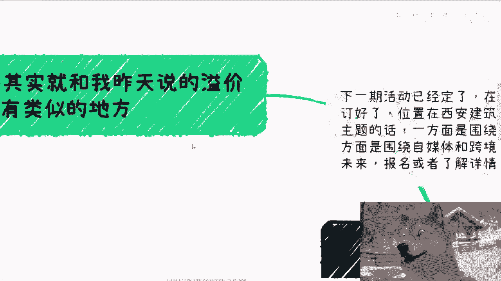
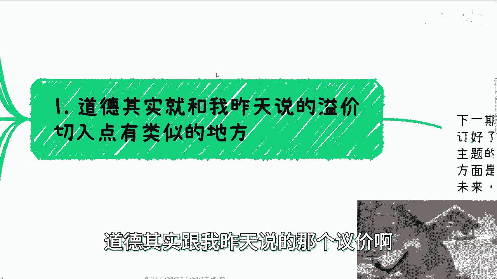
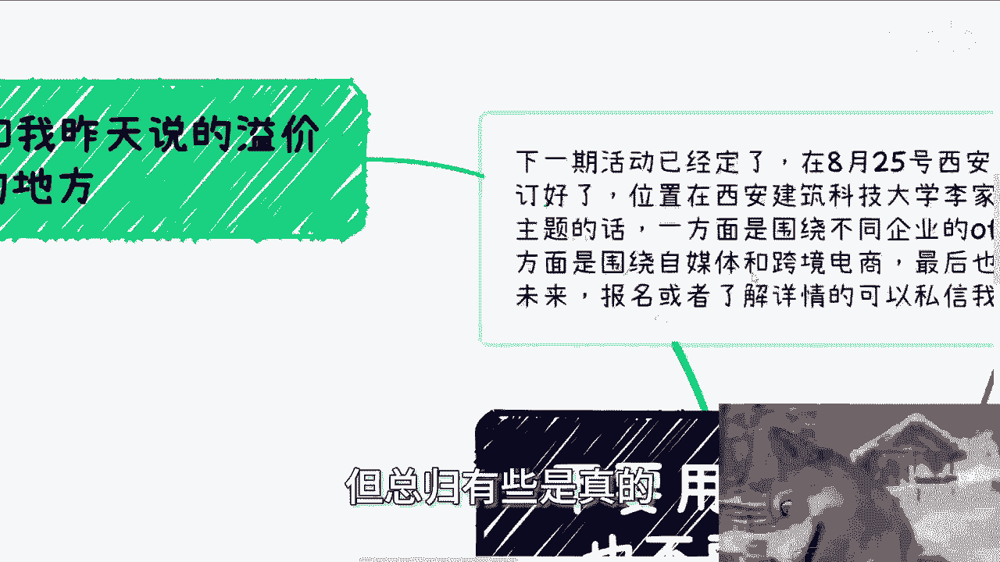
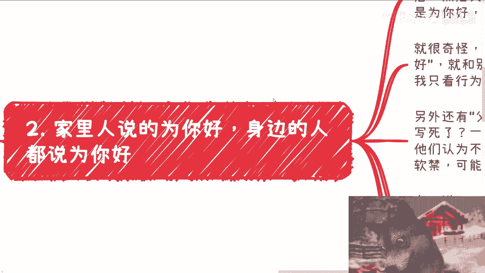
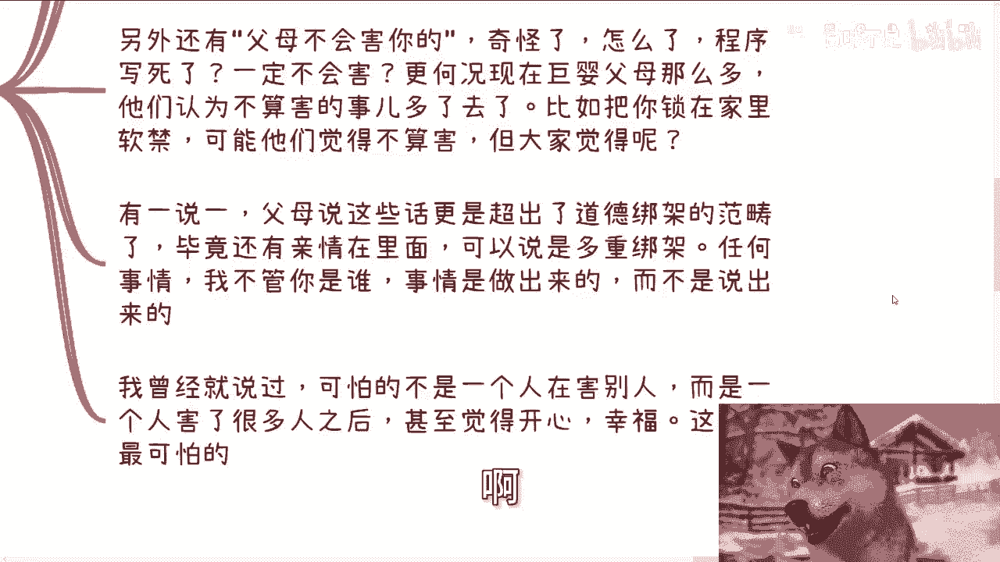
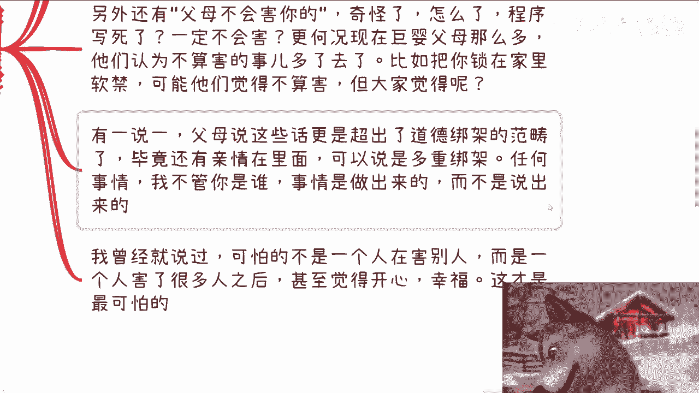
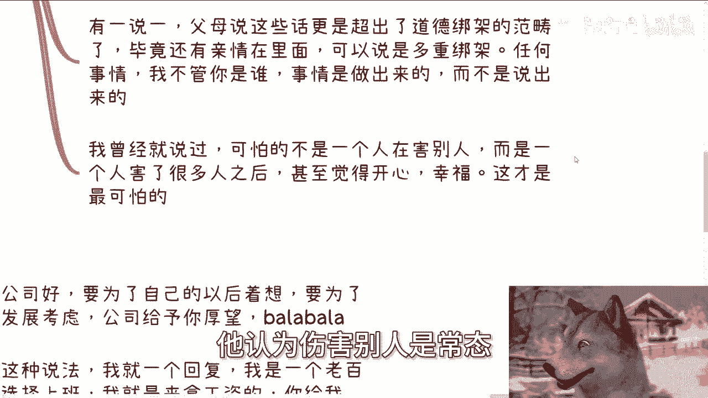
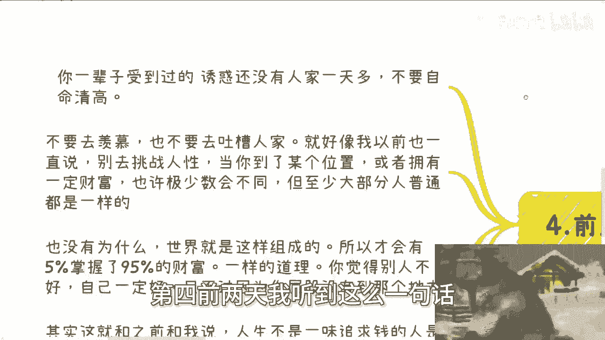
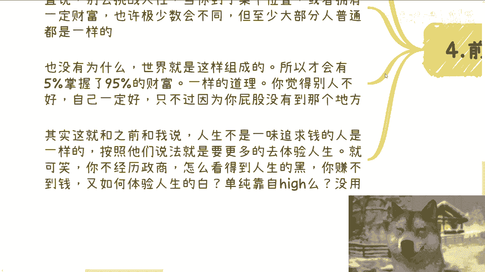
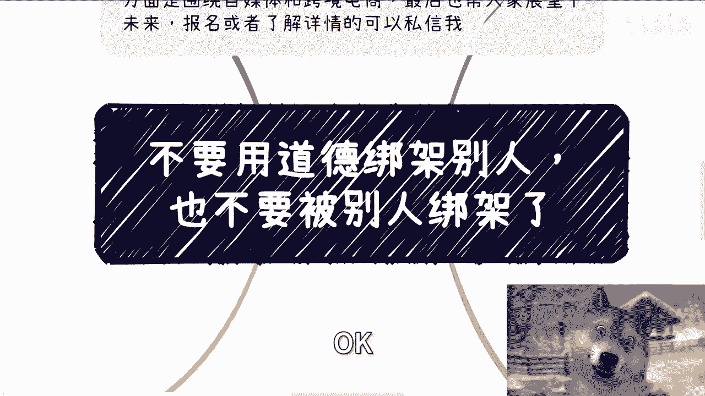

# 不要用道德绑架别人-也不要被别人绑架---P1---赏味不足---BV1xBWQeGE63

在本节课中，我们将探讨“道德绑架”这一普遍现象。我们将分析它在家庭、职场和商业等不同场景中的表现，并学习如何识别和应对它，以保护自己的独立判断和利益。

---

## 概述

道德没有明确的边界，常常被用作影响或控制他人的工具。本节课程将帮助你理解道德绑架的模糊性，并学会避免自己成为施压者或受害者。

---

## 1. 道德的模糊性

上一节我们介绍了课程主题，本节中我们来看看道德的本质。道德并非由信息差造成，其模糊性更多源于人性本身。在沟通中，人们常站在道德制高点或进行道德绑架。

普通人容易被绑架，否则就不算普通人了。在家庭、学校、职场和商业中，许多场景都存在这种现象。道德没有明确的划分规定，无法界定多高算道德高，多低算道德低。

从宏观角度看，不能断定一个人是纯粹的善或恶。善举与恶行常在一念之间。一个善良的人也可能作恶，反之亦然。人性复杂，善恶天平会因经历的事情而摇摆。这正是人性的特点。

刑事案件中，罪犯的亲友常评价其“以前很老实”。这种说法或许有夸张成分，但总有一部分是真实的。

---

## 2. 家庭中的“为你好”

在家庭关系中，“为你好”是一种常见的说辞。家人和亲戚常劝说：“父母都是为你好，你要听话。”

每个人的生命都是独立的。从行为角度看，“为你好”的言语若伴随伤害行为，则毫无意义。行为造成的伤害是实质的。

“父母不会害你”这种观点并不绝对。程序写死了尚有漏洞，何况是人。未来社会，巨婴式父母可能增多。他们认为不算伤害的事，在当事人看来可能就是伤害。

例如，将孩子软禁在家，父母可能认为这不是伤害。但当事人感受如何？家庭中的这类话语超出了道德绑架范畴，夹杂了亲情，可称为“多重绑架”。

事情是做出来的，不是说出来的。商业中也是如此：能创造价值、有执行力才被认可，否则关系无意义。

最可怕的不是伤害行为本身，而是施加伤害者认为伤害别人是常态，甚至感到开心幸福。

---

## 3. 职场中的期望绑架

职场中，道德绑架常以“为公司好”、“为个人成长”等形式出现。领导可能说：“公司对你寄予厚望。”

对此，一个清晰的回复是：作为普通员工，上班是为了获取报酬。给多少钱，干多少活，这是天经地义的。

如果要求员工创造远超薪酬的价值，那需要相应的激励。要么加钱，要么给予实际股权（需签正式合同，而非代持）。否则，一切空谈都是无效的PUA。

以前我上班时，老板让我去开会。我直接表明：如果我认为对方没有合作价值，我会在会上直接反驳。你们需要想清楚是否要我去。

---

## 4. 勿挑战人性与自命清高

前两天我听到一句话：“你一辈子受到的诱惑，还没有人家一天的多。不要自命清高。”意思是，不要轻易评判或羡慕他人，因为你不知道他人的经历。

不要挑战人性。当财富或地位达到一定程度，大部分人的反应是相似的。社会由5%的人掌握95%的财富，这种结构决定了人性考验的普遍性。

觉得别人不好，自己一定好？并非如此。当你的社会地位提升后，未必能独善其身。人性如此。

有人认为人生不应只追求金钱，而应用更多时间体验人生。但问题是，不经历世事，如何看清世界的复杂面？没有经济基础，如何体验人生的丰富？仅靠空想和理想是没用的。

---

## 5. 核心原则与行动建议

基于以上分析，核心在于：**避免绑架他人，也坚决不被他人绑架**。许多人不会主动害人，但容易被别人PUA，从而陷入自我困扰和束缚。

活着是为自己而活。今天讨论这个主题，一方面因为许多咨询者提到被道德绑架，另一方面也有人试图绑架我。这没有意义。

我不是任何人的父母。你们父母都未必负责，要求我负责更不现实。许多问题需要找对解决途径：该找心理医生就去找，该进行商业咨询就整理好问题来沟通。

把责任一味外推，对你没有任何好处。认为全世界都想害你，这种想法既无助于你个人，也无助于周围世界的发展。

---

## 总结

本节课我们一起学习了道德绑架的模糊性及其在家庭、职场中的表现。我们认识到：

1.  **道德无清晰边界**，善恶可能在一念之间。
2.  **“为你好”等说辞**可能伴随实际伤害行为，需警惕“多重绑架”。
3.  **职场中**，付出与回报应对等，空谈期望而无实质激励即是PUA。
4.  **勿轻易评判他人**，人性经不起高位考验；追求财富是体验人生的基础之一。
5.  **核心行动指南**是：**不绑架他人，也不被他人绑架**。为自己的选择负责，寻求正确途径解决问题。

希望你能运用这些思考，在复杂的社会关系中保持清醒，坚定地走自己的路。

---
*（课程结束）*