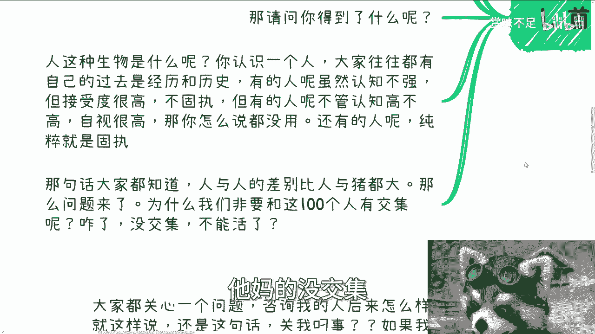

# 不要试图去说服对方-无论是谁---P1---赏味不足---BV1q1421X7tR

在本节课中，我们将要学习一个核心的人际交往原则：**不要试图去说服任何人**。我们将探讨这一原则背后的逻辑，分析为什么说服他人往往是徒劳的，并学习如何将精力投入到更值得的地方，从而节省自己的时间、情感和生命。

## 核心原则：说服他人是徒劳的

上一节我们介绍了课程的主题，本节中我们来看看其核心论点。

**不要试图去说服任何人**，这里的“任何人”包括父母、朋友、商业伙伴、老师、同学等除自己之外的所有人。

因为本质上，我们无需去说服他人。我们所持有的许多观念，例如血缘关系、道德观等，都是我们出生后由外界灌输的。我们与父母、亲戚等，本质上是独立的个体。用这些社会建构的关系来束缚自己，甚至进行自我PUA，是没有意义的。

许多人会因父母的期望（如结婚、找对象、考研）而感到困扰，并担心不顺从会破坏关系。但顺从并不能真正解决问题。对于持有这种想法的人，无需试图说服，**尊重他人意愿**即可。

## 对人性的基本认知

理解了核心原则后，我们需要建立对人性的一个基本认知，这是避免无效说服的前提。

人是一种极难改变的生物。假设有100个人，其中可能只有2个人能够真正被改变，其余98个人即使表现出改变的样子，其本质也**无法改变**。

如果你试图去说服那98个人，你将会：
*   浪费大量时间。
*   消耗情感与精力。
*   产生不必要的矛盾。

即使你成功改变了那2个人，你所消耗的时间、生命和情感成本，与你获得的“自我满足”或“改变他人的快感”相比，也往往得不偿失。

## 人的多样性与固执

基于上述认知，本节我们来具体分析人的不同类型，并理解为何说服常常无效。

人与人之间的差异巨大。认识一个人时，需了解其过往经验和认知模式。人的类型大致可分为：
*   **认知不强但接受度高**：不固执，有较大提升空间。
*   **自视甚高**：无论实际认知水平如何，都认为自己很厉害，难以接受他人意见。
*   **纯粹固执**：不愿意接受任何外部信息。

例如，在商业洽谈中，曾遇到一位创业者，当被问及融资依据时，他的回答是：“我觉得我这个人就值300万。”这种沟通方式表明他**不愿意接受任何外部信息**，属于纯粹的固执，说服他是没有意义的。

既然人与人差别如此之大，且很多人无法被说服，那么我们为何非要与所有100个人产生深度交集呢？没有交集，地球照样转动。

## 避免说服的实用理由

上一节我们看到了人的固执，本节中我们来看看避免说服在现实中的实际意义。

**避免一切说服**，因为说服行为本身几乎毫无意义。说服成功的概率极低，低到可以认为**约等于零**。

我们不应将希望寄托于极小概率的事件。如果做每件事都考虑极小概率的风险（如地震、冰雹），那我们将无法正常生活。同理，在人际和商业中，也不必为小概率的“说服成功”而投入过多。

对于个人而言，缺了谁地球都照转。谈业务时，对方合作与否，并不会改变行业大环境。日子照样过，没有谁欠谁。许多人的固有思维是觉得自己必须强大、有底气。但真正的强大第一步在于**认知正确**。如果认知始终是为别人而活（如“爸妈让我…”），则谈不上有格局，更谈不上强大。

成年人的态度应是：**为自己而活**。有手有脚，怎么活都能活。好有好的过法，穷有穷的过法。剩下的交给时间解决，不要尝试去说服，更不要争吵。

经历过事情就会明白，说服和争吵没有用。顺从或逃避并不能让矛盾消失，该面对的问题终究要面对。这就像找工作，年轻时能找到高薪工作，但若不规划，三四十岁时可能面临困境。问题只是被延迟，而非解决。

在商业中也是如此，**不要尝试说服客户，要顺势而为**。赚一个客户100万，说服对方也是100万，顺势也是100万。但说服对方可能耗费数倍精力，最终还未必成功；顺势而为则过程愉快，对方还会感谢你。

## 核心行动准则：尊重与祝福

在理解了所有道理之后，我们最终要落实到行动上。本节将介绍最核心的行动准则。

对于无法改变的人和事，应采取“**尊重祝福**”的态度。许多人因自身格局所限，会产生执念。但这是他们自己的事，我们无需计较或纠结。

例如，对于父母的陈旧观念，不必抱怨或试图说服。要理解父母成长的年代没有互联网，社会发展速度远超他们的经验更新速度。现在20多岁的年轻人，未来作为父母时，很可能也比不上自己父母现在的适应能力。既然无法选择父母，那就尽儿女的义务，但不必强求说服。

所谓的“说服”大多是暂时性的，对方心里未必服气。真正心服口服的概率很小。

而对于朋友、合作伙伴、公司领导等，我们**拥有选择权**。如果觉得没有选择权，往往是因为不肯降低预期（如高薪、双休）。只要明确目标，放下不必要的尊严，怎么活都是活。若目标不明确，又浪费时间在无效的人际纠缠上，那就是在“过家家”。

无论对方是感性还是理性，只有当你不再“太年轻”，经历过事情后，才会明白**什么对你最重要**：**你自己的时间和成长**。其他都不重要。

例如，别人说打工有前途，那是他的前途；别人要早点结婚、落户，那是他的选择。作为旁观者或咨询者，在能力范围内给出客观建议即可，剩下的**是对方自己的事**。每个人都要对自己负责。

社会规则是：需要帮助时，要么提供价值，要么支付金钱。我们只能遵循规则。执行与否，未来如何，都是个人自己的事。正如商业咨询，咨询时间内倾囊相授，咨询时间外回答简单问题，但不可能每天监督执行。落地与否，各凭本事。

## 总结与融会贯通

本节课中我们一起学习了“不要试图去说服对方”这一核心原则。

总结来说，试图说服他人是效率极低且内耗严重的行为。因为人性难移，成功概率渺茫。我们应该建立对人性的正确认知，学会识别不同类型的人，并将宝贵的精力用于**自我成长**和**关键选择**上。

对于无法改变的外界（如父母、固执的他人），做到“尊重祝福”，尽该尽的义务，但不投入情感去说服。对于可以选择的关系（如朋友、伙伴），运用选择权，远离消耗型关系。

最关键的是，要将这一道理**融会贯通到日常思维中**。许多道理大家都懂，但若不应用，就会陷入“当局者迷”的困境，为各种人际关系感到难过、伤心，从而**无限地浪费时间**。请记住，除了你自己，关别人“吊事”；除了别人自己，也关你“吊事”。把时间和生命聚焦在最重要的事情上。