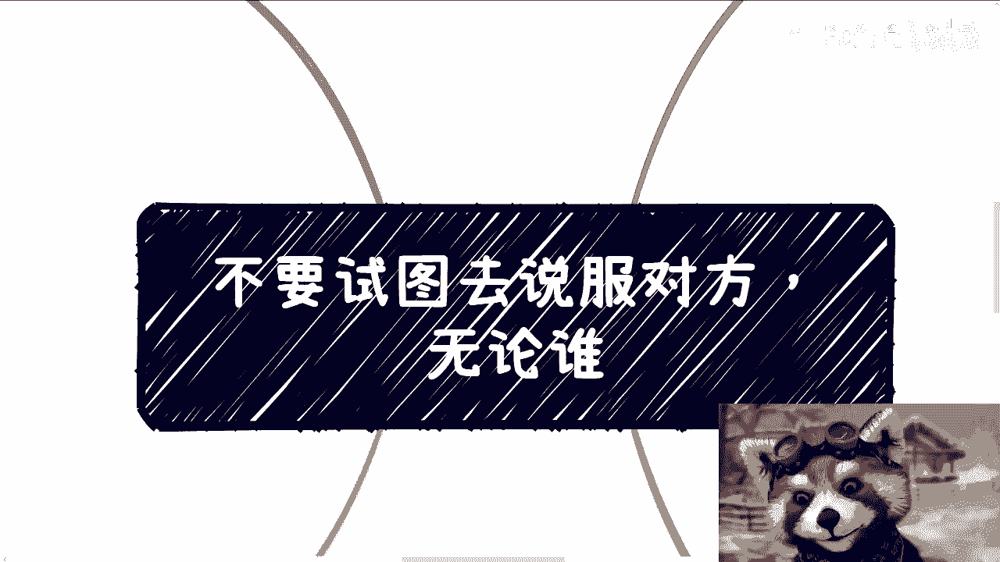
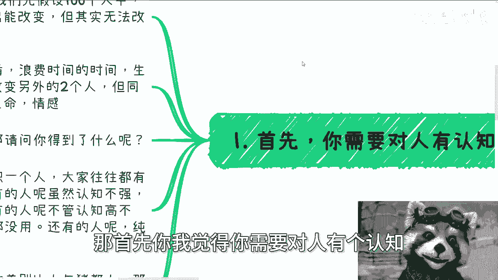
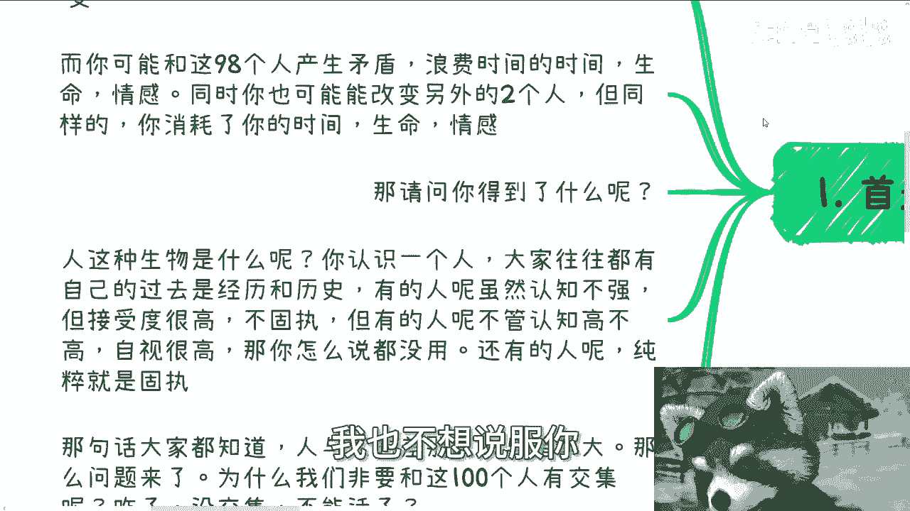
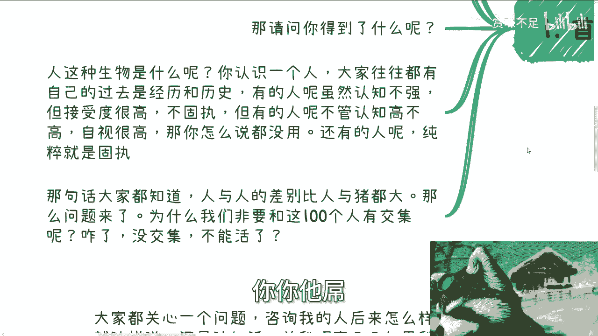
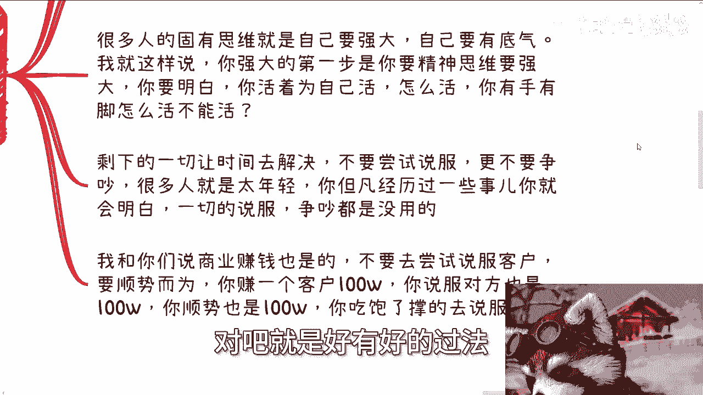
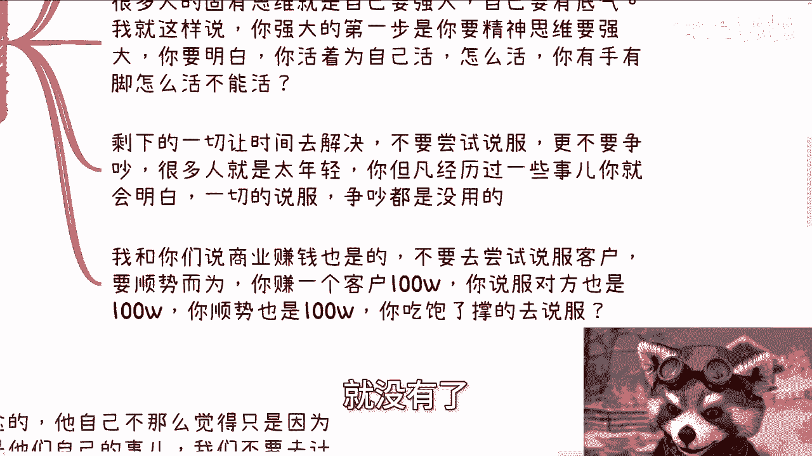
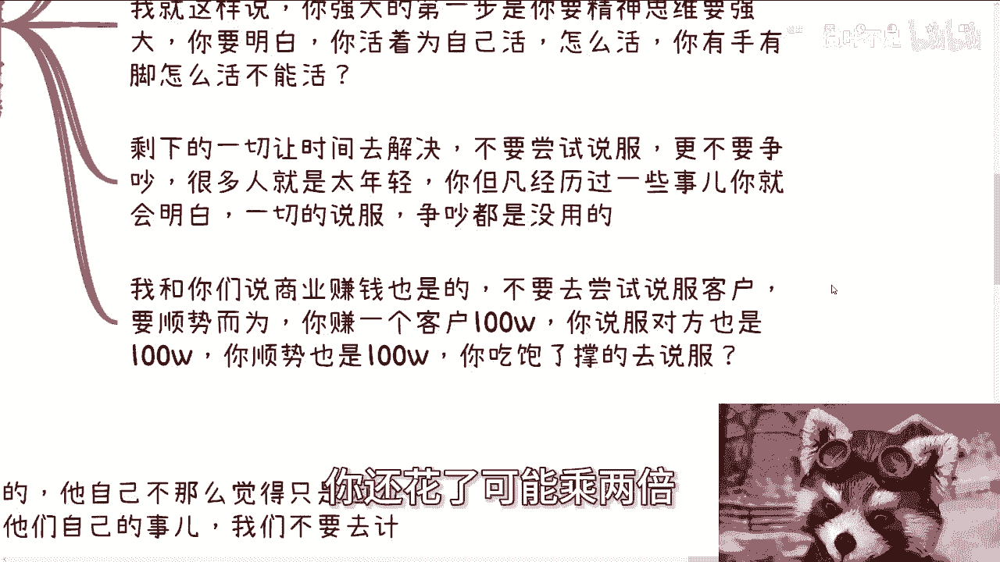
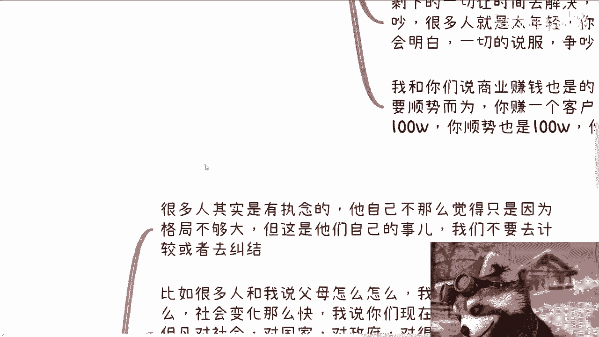
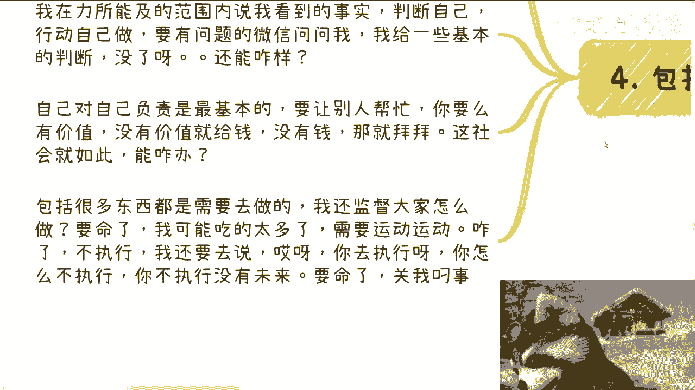

# 不要试图去说服对方，无论是谁 - P1 - 赏味不足 - BV1q1421X7tR

啊大家好啊，今天我们说的呢叫做不要试图去说服对方啊，我跟你们讲，无论是谁，无论是谁，什么意思呢，就是你父母，你朋友，你商业合作伙伴，你的老师，你的同学，你碰到任何一个人，除了你自己之外，对不对，为什么。

因为没什么好说服的呀，就还是那句话，你知道吗，就是你们所认为的所有的东西，比如说你们认为的血缘，你们认为的就是说那些道德观或者其他东西，本身就是你们出来到这个世界之后，所外界灌输灌输给你的对吧。

我跟很多人说了无数遍，就是我说你对父母什么什么什么态度啊，就是你要现在生病，他们要剩下生病了，OK我们力所能及给钱，我们力所能及服饰对吧，我们力所能及在旁边，然后养老对吧，都是义务，这没问题。

但剩下的关他吊事，关我们吊事，对不对，就这么简单，为什么，因为你们是两个独立的个体，那么什么父母不父母，还有什么亲戚不亲戚，这妈的跟我们什么吊关系呢，对吧，是不是这个道理吗。

你非要用这种有的没的东西去束缚自己，然后还要还要还要PUA自己没有意义的呀，那么就像很多人说哎呀对吧，我爸妈让我结婚了，哎呀我爸妈让我找对象了，哎呀我爸妈让我去考研了，我那他妈的你要干嘛对吧。

然后你跟他讲吧，他会跟你说，哎呀，我要跟我的父母关系闹不好了，搞得好像你顺从他们就好了一样，好不啦，对不啦，这就很搞笑的，但是这种就是我说的不要去试，试图说服对方，就这种人对我来讲又没什么好说的。

你爱咋地咋地吧，尊重他人意愿啊。

那不就好了嘛，对不对啊，那首先你我觉得你需要对人有个认知。

什么认知呢，人这种生物是很难改变的，我们假设100个人当中啊，两个人能改变98个人表现，表现出能改变的样子。

但其实无法改变啊，而你可能跟这98个人都产生矛盾，浪费时间啊，浪费人生，浪费生命，浪费情感，对不对，那同时也有可能，当然你也有可能花时间花精力啊，最终改变另外两个人，对不对，好。

但同样的你消耗了你的时间，你的生命，你的情感，那我就请问你得到了什么，你不要告诉我，你得到了自我满足啊，你也不要告诉我，你得到了改变对方两个人的快感啊，那那你对我来讲就是那你你你随便去，你爱咋地咋地。

我也不想说服你。

你爱爱爱爱，怎么怎么地，对不对，你开心就好对吧，那么人种生物是什么呢，就是你认识一个人，大家往往都有自己的过去跟过去的历史经验，对啊，有的人呢虽然认知不强，但接受度很高，不固执。

那这种人都有就有很大的提升空间，但有的人呢不管认知高不高，他自视都很高啊，我觉得老牛逼了啊，那你怎么说都没用啊，还有些人呢纯粹就是固执啊，我跟你们讲啊，我以前我突然想起来呃。

我以前在那个we walk啊，就有个工程空间啊，我在微博里面，我当年是给别人也是做过融资嘛，我记得我记得很清楚啊，当年来了一个96年的人啊，还有93年的，反正也很年轻，卧槽你知道你们知道你们。

你们你们是不知道他多牛逼啊，他跑山是这样子的，因为我们当时呃对接的一些资方，都还是比较有点地位的，而且有点知名度的，你知道吗，他跑上来是巨啊，就是我们跟他聊的时候，都是说哎你比如说有些基础介绍啊对吧。

那那不管你牛不牛逼，你总归就是说项目是什么，产品是什么，你怎么样，你总该说就要说嘛，你不可能跑上来，他妈就因为我牛逼嘛，对不对啊，然后我跟你讲他不一样啊，他真的是巨，他跑上来一句话是什么。

就是呃他大概当时要融多少钱，300万啊，然后我们问他，那你为什么要融300万，当然我们的意思是什么呢，就是说你这个项目是怎么的，一个一个一个资金情况，或者怎么一个发展情况，你要300万。

以及你现在就是拿得出哪些背书，哪些底气啊，来告诉我们说，哎你你你觉得资方愿意给你300万，卧槽他不一样，他上来你知道怎么回答我吗，他说我觉得我这个人就值300万，怎么滴啊，间谍啊。

你这300万我搞不懂啊，对不对啊，就就你会发现这种人，就是说，当然我们不用去关心这种人到底吊还是不吊你，你管他还是不，反正就是有一点就是说服不了，就这么简单，因为你看他这种说话方式。

他就不愿意接受任何东西，那不愿意接受任何东西，其实就是我最后说的那种固执，你他跟不没有用啊。

那么那句话怎么说来着啊，就是说人与人的差别比人与猪都要大，那问题来了，为什么，那问题就像我刚刚说的，那为什么我们非要跟这100个人有交集呢，啊怎么地了，他妈的没交集，怎么地球炸了。

对不对啊，奇了怪了啊。

然后当然啊，所以第二点就是避免一切的说服，因为说服本身在我看来几乎没有意义，为什么你想想看，你说服一个人有概率吗，有的我不能一棒子打死，对不对，但这个概率有多大，你们心里也有逼数啊。

我就等于那那这种概率在我看来，我就认为约等于就没有啊，那我为什么要报希望于，一个极小的概率的事情呢。

对不对，那照这么个说法，就像我前两天说的，那我如果做所有事情，我都抱有极小概率，那我以后飞机不要走了，高铁不要走了，那他妈的还有可能地震来的吗，他妈的天上还有落下下冰雹雨呢，对不对，那我出去干嘛。

我就算不出去在家里，我他妈也可能煤气中毒什么，谁知道呢，那你还活不活。

对不对啊，那么更何况现在对我来讲，我觉得啊就就我不知道你们认知怎么样的，我现在对我来讲很简单，就缺了谁地地球照转了，对不对，那确实谁大环境就赚了，我今天谈个业务啊，你愿意合作也好，不愿意合作也好。

怎么滴了，大环境大环境变了啊啊行业变了，行业从好变坏了，从坏变好了，妹妹不可能的呀。

听不了，那我日子照照顾啊，有啥区别呢，没谁欠着谁，这有啥区别，你想想看是不是，然后很多人的固有思维，那就是觉得自己一定要有底气啊，自己要强大，我就这么跟你们讲啊，你有底有没有底气，你强不强大。

第一步是看你的认知到底正不正确，你知道吗，你要是你的认知就是他妈的，从头到尾都是为别人活的，就像我刚开始说的，哎你为什么要谈恋爱，我爸妈说的，诶为什么你要结婚，我爸妈说的诶为什么要考研啊，我爸妈说的。

那你这样子你有什么格局啊，对不对啊，你这种格局你还谈什么自己强大，连自己都没有，你强大个屁啊，是不是啊，我觉得所有人的成年人的态度是什么，就是你活着为自己活，你有手有脚，怎么活不能活呢，对吧。

就是好有好的过法，穷有穷的过法，怎么了呢，怎么过不是过对吧。

那么你剩下的一切让时间去解决，不要尝试去说服，更不要尝试去争吵啊，我跟你们讲，很多人就是太年轻，那句话怎么说呢，Too young too young，你但凡经历过一些事。

你就会明白一切的说服跟争吵其实没有用，你你你你你明白吗，就是你就像我一开始跟你们讲的，你不要认为你顺从这个矛盾就没有了，你也就像我之前也说的，你不要认为你逃避了某些问题就没有了。

那只是当下没有，那他妈未来还是会有的，你该要面临的一切终终究是要面临的对吧，这就像找工作是一样的，你跟我说，你当下能找到个2万3万的，没问题呀，那你30多岁之后呢，40多岁之后呢一样的呀，有什么区别呢。

对不对，不是一个道理嘛，只不过就是很多人不愿意去想，对不对，就这么简单，但是你说哦，因为他们现在找不到，所以40多岁就稳定了，尼玛这他妈有因果关系吗，啊我跟你们讲，商业赚钱也是一样的，不要尝试说服客户。

你要顺势而为，你赚一个客户100万，你说服对方也是100万，你顺势也是100万，吃饱了撑的去说服啊，你顺势对方还会感谢你，你跟他聊也聊得很愉快，你也不会花太多的精力，你说服对方。

很有可能最终这100万根本赚不到，你还花了可能乘两倍乘三倍的时间。

在这里面，是不是吃饱了撑的，对不对啊。

第四啊，第三就是我说的尊重祝福，很多人其实是有执念的，他自己虽然不这么觉得，是因为他自己格局不够，大人就这样子的啊，所以我们才说人与人的差别比人与猪都要大啊。

但这是他们自己的事，我们不要去计较，也不要去纠结，比如说很多人跟我说，我父母怎么怎么，我说这不是正常的吗，你不想想看你父母那一代有互联网吗，啊，你不想想看，互联网从2000年到现在才发展多少年了啊。

你不想想看整个20多年发展得多么快呀，啊你社会发展这么快，我说你们现在20多岁，你们但凡对社会，对国家，对政府，对很多商业不了解，对很多社会上的很多的一些，就是我们称之为接地气的事情，不了解你们有孩子。

你们他妈以后更跟不上，就这么简单，人都一样的。

你不要去抱怨父母没有用的啊，我觉得现在的父母他妈的。

一定比你们未来作为父母来的强，一定是这样子的啊。

那么我就说那你去说服你，怎么说服对吧，你说你你说我现在碰到很多20多岁左右的，那20多岁左右，20岁左右都很难开放接受别人的观点，动不动就喷啊，然后就他妈二极管，然后执着于某些东西，没有目标。

你更别说你父母那个年龄段，对不对，那你说啊，那陈老师父母选不了，没问题啊，我觉得没有问题，你父母你选不了，就如我一开始开头说的，你就尽儿女的义务，不要说服，对不对，为什么一定要说服你。

你你们你你想想看你们活了这么长时间，你们难道还不明白吗，所谓的说服都是暂时性的，他心里不服的呀，哪来的心服口服了，有不啦，当然我不能一棒子打死有，但这概率能有多大呢，对吧啊。

但剩下的朋友合作伙伴你都可以选拔，公司领导也是你都可以选拔对吧，那当然很多人说我没有这个资本权，我没有这个呃，叫什么啊，我没有这个权利选对吧，我也没这个资格选，我跟你讲，你有的啊，你你认为你没有资格。

仅仅是因为你在去选的时候，你非要去追求那些东西，比如说什么高薪啦，比如说什么什么双休啦对吧，比如说什么东西很简单啊，你只要放下你的尊严对吧，降低你的预期，什么东西你不能选对吧，就像我说的，怎么活都是活。

但是你的目标要明确啊对吧，那么你说OK我目标又不明确，我又浪费时间，在这些所谓的合作伙伴或者朋友啊，跟他们再搞一些有的没的，那在我看来就是过家家，你就是在过家家浪费时间没有用的，因为你说服他也好。

不说服他也好，有的人是感性至上的，有的人是理性至上的，但是我跟你们讲，感性上理性上无所谓，因为一旦你经历过很多事情之后啊，你不是那么too young了之后，你才会明白什么事情在对你是最重要的。

因为什么东西对你最重要，只有你自己的时间，你自己的成长，别的都不重要对吧，你就好像现在很多人跟我说，打工有前途，那你去有前途呀，关我吊事啊，又不是我的前途，对不对，说我我尽我能力，我来讲哦。

那很多人又跟我说了，哎呀我要早点结婚，早点生孩子，包括还有要跟我说啊，说什么硬要在上海落户口，北京落户口，那我还是那句话，我客观的，我怎么说都是我我都说了，在在我能力范围内我都说了。

那接下来关我吊事对不对，你落户口又不是我落户口，唉你生孩子又不是我生孩子，对不对啊。

那包括我说说说咨询我的这些人对吧，你们很多人其实问我，他说哎陈老师咨询你后人后面怎么样了，你要我说吗，你要我客观的说嘛对吧，能怎么样怎么样，关我吊事又不奇了怪了，哎如果我收了你10万。

那我就我我说实话啊，我就算作为一个资本家，作为一个商人。

那可能关我点吊事对吧，那我就说了几百咋了，关我啥事啊，你是成年人哥哥啊，你父母都他妈管不了你，我还能管你吗，是不是啊，我在力所能及范围内说我看到的事实唉，那你们自己去判断行动，自己做要有什么问题。

我们也加了微信，你可以问问我对吧，我给你们一些基本的判断，没了呀，你还想怎么滴啊啊，还想怎么滴呀啊，你自己对你自己负责是最基本的，你要让别人帮忙，我跟你讲很简单，你要么有价值没有价值，你就给钱。

没有钱你就拜拜，那这社会就这样子呀，能怎么办呢，对不对，那我再客观的说，我只能去follow这社会规则，怎么拉，我还能反对这社会规则呀，我也没有到这地步吧对吧，那包括很多东西呢是需要去做的。

怎么地还需要我来监督大家吗，那他妈要命了，可能我吃的太饱啊，需要运动运动啊，而且咱咱再向下说啊，我什么都说了，咋了，不执行还要我去盯吗，啊你去执行啊，你怎么不执行啊，你不执行没有未来的，妈的要命了。

关我吊事。

对不对，我跟你们讲，我在很早的时候啊，就是大概在去年的时候做咨询的时候，我就跟他们讲过了，我说你们要是赚钱了，千万不要给我分钱啊，我不要这个钱啊，我从来没想过咬啊，你明白吗，我不要不要你给我烫手啊。

然后呢，另外一方面就是说你给我咨询费，在咨询时间内我能说什么，我都说对吧，咨询时间外，你简单的问题你问我，我肯定也都回答，就这么简单一件事没了，但是你不能伸手对吧，你不能说啊，我他妈的一天问一嘴要命了。

妈GPT对不对，其实就这么回事，就是说钱这个东西对吧，包括就是说落地这个东西各凭本事啊，我也不来，就是说啊期待，就是说啊大家对未来怎么样怎么样，你要未来赚了一个亿啊，我也我也不会说啊，你怎么赚了一个亿。

当时是我给你的id，当时我给你的一些方向对吧，你看我怎么样怎么样，我也不会说你管我吊事，对不对，而且你真的能赚一个亿，依你到时候的格局，你也会明白，他妈关你吊事啊对吧，你肯定心里面在想什么。

陈老师关你吊事啊，对不对，一样的你明白吗啊。

好吧哎呀，反正希望你们能明白吗，因为我觉得这种事情怎么说呢，就是嗯我觉得个道理吧都懂啊，但是呢，你们得要融会贯通到你们日常的思维当中，否则的话就就真的，我就感觉就是无限的浪费时间，你就是一样的道理嘛。

当局者迷嘛对吧，就你们会觉得哎呀很很难过，很伤心，很怎么样，但是真的你说除了浪费时间还能干嘛啊，好吧行，那就这么着啊，然后那个5月份第二周好吧，我就放在武汉，武汉的武汉的场地，我已经在找了好吧。

找完你们再报名啊，你们不要急着报名，我已经在找了呃，然后那个接下来同样的就职业职业商业，然后那个叫什么，就是融资股权合同对吧啊，包括那个你们手上有什么牌的啊，希望通过我的视角能够给你们更多的一些规划。

或者什么相关的东西呢，你们可以整理好问题好吧。

