# 不靠谱企业的一些现象特征 - P1 - 赏味不足 - BV1vy411Y7ms

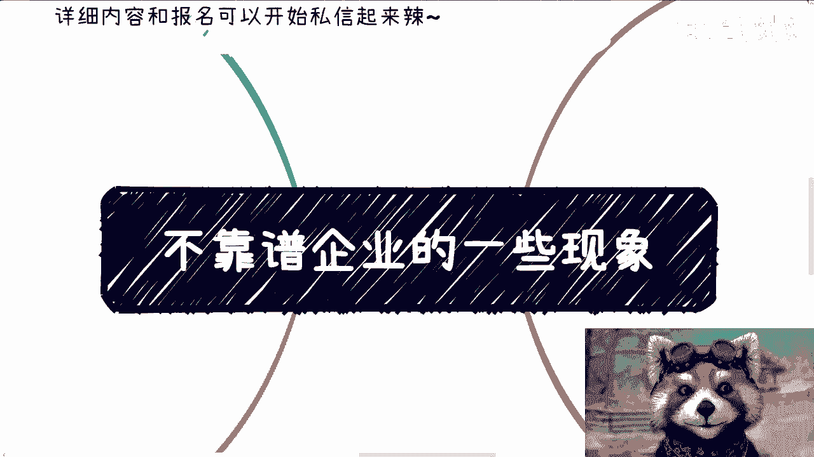

哈喽大家好啊，今天这个主题呢是这个。

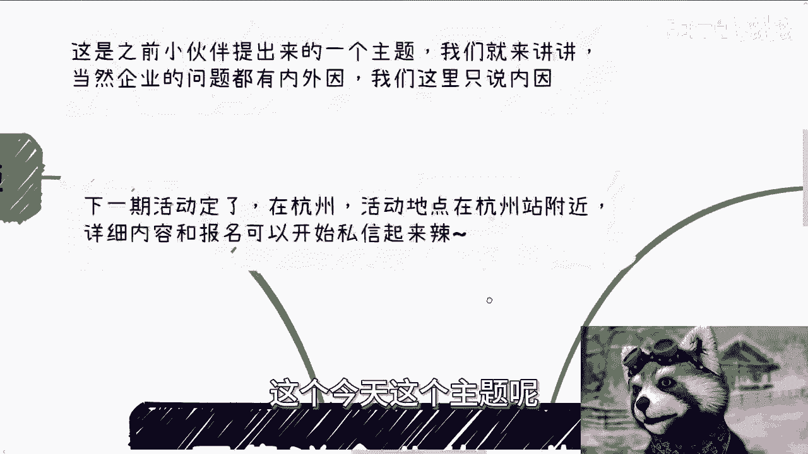

前两天有个小伙伴提出来的，我看了一下，正好也可以讲讲啊，因为呃也跟大家有关啊，当然企业这个问题呢有内因有外因啊。

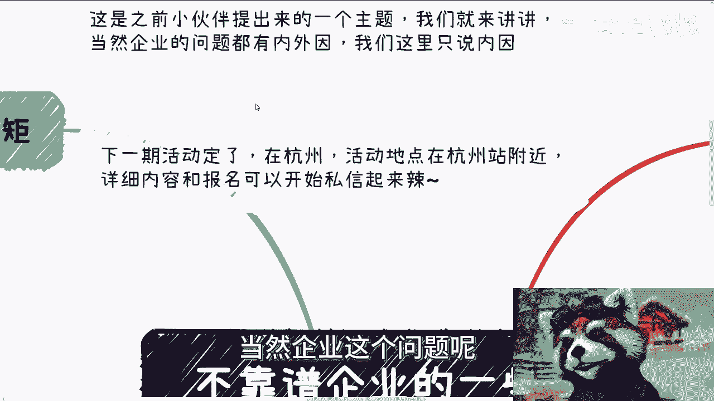

我们这边先只说内因，因为外因控制不了，也没啥好说的啊。

呃那么下一期活动呢我也定了啊，诶我靠我时间没写啊，呃5月25号啊，5月25号下午好吧，礼拜六礼拜六下午在杭州啊，杭州地点也定，我丁好蓝啊，在杭州站附近啊，杭州站附近详细内容跟报名呢。

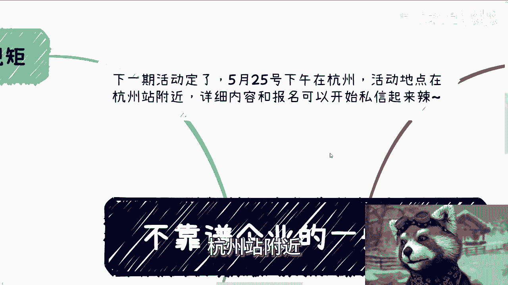

你们也可以私信起来，好吧啊，那么今天呢我们讲的主题叫做不靠谱。

企业的一些现象啊，呃首先我列了几点啊，大家因为我也不可能列全对吧，但是我列的呢是我觉得比较重要的啊，这些第一就是所谓的规矩啊。

企业有规矩，我很赞同啊，哪儿都需要有规矩，没有规矩不成方圆对吧。

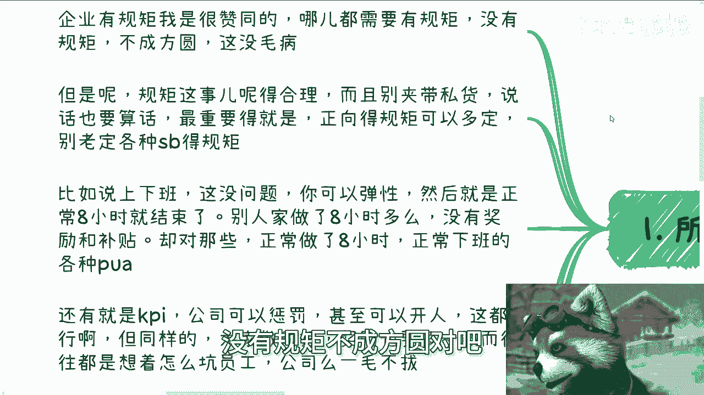

这句话没有毛病啊，但是呢规矩这个事得合理，而且你别夹带私货啊，也就是说呃你你定一些规矩啊，你说话算话，而且最重要的是什么呢，就是说呃你规矩你可以定对吧，但是你正向的规矩可以定啊。

你别老是定各种他妈的规定啊，我们打个比方，比如说上下班啊，这没有问题啊，你说你可以弹性质啊，那么啊然后就是说正常八个小时就结束了，那么你别到最后就是说嗯，人这个员工做了八个小时多嘛，没有奖励。

也没有补贴啊，也没有什么啊，餐补什么各种东西啊，但是反而对那些，就是说正常做了八个小时的对吧，回到家啊，然后说什么啊，这里不回消息，那边不不回电话，怎么样子，这个还要去责怪人家，对不对。

就说你要责怪人家，其实没有问题，那人家继续加班，人家进行八个小时以外的那个工作，你得有对应的奖励补贴对吧，你否则他妈的他妈不是扯淡吗，PUA嘛，对不对，还有就是KPI啊，公司可以惩罚，甚至可以开人啊。

我觉得这都可以无所谓啊，但同样的就是说大家做得好，你奖励也要多，而不是说往往都他妈的你制定规定啊，然后制定出来都他妈想着怎么坑员工啊，然后在奖励层面一毛不拔，那你作弊啊，说白了啊。

我觉得现在的企业定制的规定呢，跟放屁他妈没什么区别啊，就是说你看似有，或者说你看着可能比如说啊这个比较公平对吧，或者怎么样，那他妈其实都是对公司有利的啊。

别的只要跟对员工有利的，或者说有一些KPI相关的，全他妈的都是放屁啊。

二让员工去赚钱，我跟你讲啊，这事也他妈很神奇，这个其实呢嗯也不知道什么时候啊。

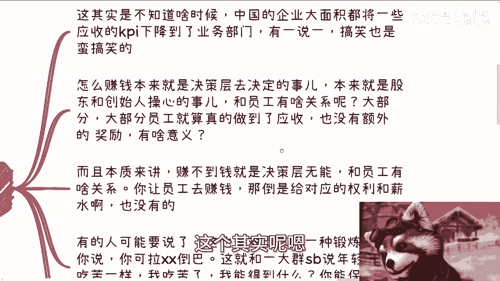

中国的企业有一段时间啊，大面积都将一些应收营收，我不是写错了，营收的KPI下放到这个业务部门啊。

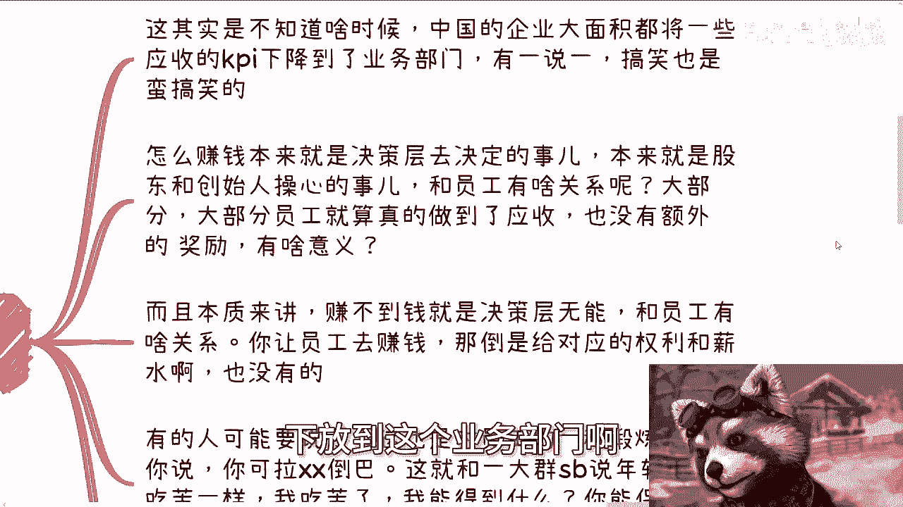

有一说一，我说实话搞笑也蛮搞笑的，因为怎么赚钱啊，本来就应该是决策层应该是决定的事情，然后真正的对外售卖的东西本来也是商务销售，应该决策应该去做的事情，然后有一段时间呢，这个企业把这种这个工作啊。

无论是决策层的工作，还是把这个销售商务的工作呢，全部下发到那个事业部，那么就很搞笑啊，本来就是股东跟创始人操心的事情，那么跟跟正常的业务上面的员工有什么关系呢，对不对，而且大部分大部分大部分员工。

就算真的做到营收。

也他妈没有额外的奖励，也没有所谓的这个略分润，也没有什么bonus，那么有什么用吗，对吧，而且本质来讲啊，赚不到钱就是决策层的无能，就是老板的，跟员工有什么关系呢，对不对啊，你让员工去赚钱。

我他妈我我之前有一个主题我也说到过，就是我作为一个员工，我他妈有能力去赚钱，我他妈在你这边打什么工啊，你妈你心里没点逼数吗，对不对啊，那么同样的你要让员工去赚钱，没问题啊。

那你倒是给对应的权利和薪水也没有对吧。

那有的人要说了啊，那么这其实也是对员工的一种锻炼，我跟你讲啊，可拉叉叉岛啊，什么意思呢，这个就跟一大群，他妈跟年轻人说要吃苦是一样的，那我就问嘛，我可以吃苦，然后我吃了之后得到什么呢，对不对。

你总不可能只跟我说啊，这个啊你要吃苦对吧，怎么样怎么样，那我问你得到什么书好了，你说不出来，那你不是吗对吧。

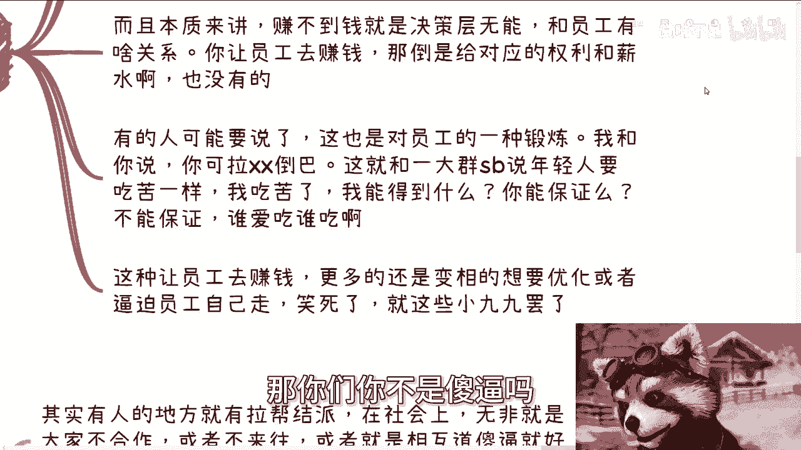

那你能保证吗，你不能保证你不能保证的意思就是什么呢，这个苦爱谁吃谁吃，反正我不吃对吧，我跟你讲啊，这种让业务员工去赚钱的，更多的还是变相的想要去优化，或者说逼迫员工自己走，哎我跟你讲，笑死了。

企业他妈的有也不是企业吧，企业里面的hr也就这些小九九了啊，他心里也就那么点。

也就是这种手段，第三就是拉帮结派，嗯我就这么说啊，其实有人的地方就有拉帮结派，在社会上无非就是大家不合作。

或者说不来往，或者说就是相互道就好了，结束了，但是公司里面其实不行啊，因为公司里面你抬头不见低头见，而且最重要的是什么呢，就是所有人都有劳动合同跟公司的这个关系，那么拉帮结派就容易出现那种就是相互举报。

相互穿小鞋对吧，因为就像我们之前说的，你在社会上做啊，只要你不认识任何一个地方，别人不能把你怎么样，但是你在公司里面那好了，那那带着相互举报对不对，反正都有把柄在手上，那当然了，我们从更大的视角来看呢。

能拉帮结派，那说明什么，说明内部的管理者也很，或以及管理的这种制度和晋升制度，也非常的有缺陷，因为你但凡不是管理者，不是，这种晋升制度或者各个方面没有缺陷化，他拉帮结派拉的起来吗，他拉不起来对吧。

而且就算拉的起来，他能影响到最终的公平性，或者说所谓的进程嘛也影响不到，但凡影响得到，就说明整个流程都有问题，所以说啊我我我在这个地方就说，先不说有没有拉帮结派，其能够给拉帮结派形成温室的环境。

就形成这种就是说拉帮结派的这种潜这种，这种提供这种契机的这种环境跟制度。

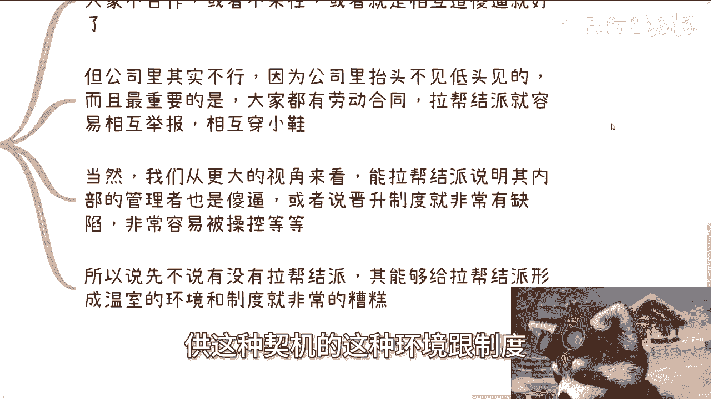

就他们已经非常糟糕了对吧，你就仔细看嘛，你企业里面有没有我说的这种啊。

这种规矩对吧，有没有我说的这种啊。

有没有这种拉帮结派的大概率都有对吧好。

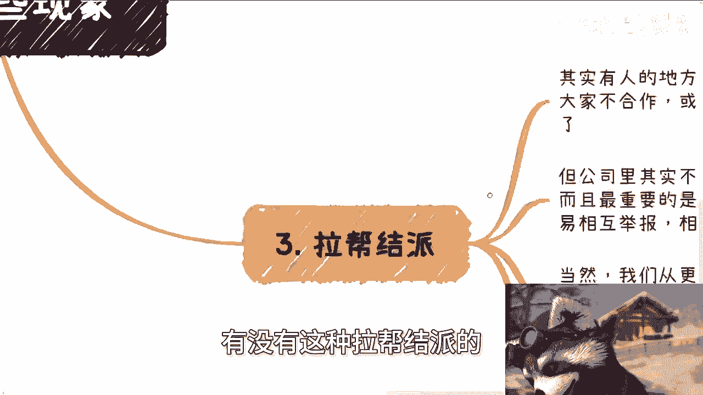

那么最后一点是什么呢，就是说白了嗯，我觉得一个企业靠不靠谱的核心是什么呢。

就是老板就他就应该有老板的样子，员工工具人就得有工具人的样子，结束了啊，也就是说什么意思呢，也就是说一个企业老板要对公司有管理，该管的管，不该管的别管啊，哪些事是需要老板去管的。

哪些事是需要管理层去管的，哪些事是hr去管的，他就应该分清楚，那本质上你再小的公司，它也会有分工对吧，什么意思呢，也就是说他不可能出现一个说一个CEO对吧，跑过来说啊，我的，我又要管人事，我要管业务。

我要管什么，我跟你们这么说，这跟他能力强不强没有关系，这这那他能力再强，他这种管理方式只能代表着他是个，就这么简单对吧啊，我们在很多公司像外企啊，大公司啊都讲一个东西叫management对吧。

那我们不管，比如说现在这公司啊，公司大也好，工资小也好，但凡一个人是多面手的对吧，他管很多东西，而且是从决策上，战略上去管的，那我跟你讲，他就是没有management，这就结束了。

那么工具人也是工具人就干好活，不要越界啊，说白了就是我们自己要有逼数，拿多少钱，干多少事，别多干，更不要白干，对不对，不就这个逻辑吗，对吧，你像你像上周咨询的时候啊，这这不是想着这种吧。

那个咨询的时候我给你讲也很搞笑的，就是非要有人觉得自己很认真呢，觉得自己很负责对吧，然后他负责的这个这个具象化的表现，体现在什么地方呢，就体现在他觉得哦，我要对每个业务负责，我要对我经手过的项目负责啊。

我要对这家公司负责，我他妈也是奇了怪了，你又不是股东，你又不是老板啊，老板跟股东都不负责，你负什么责对吧，你这不叫负责任，你这不叫靠谱，你这叫他妈吃饱了，吃饱了饭没事干啊，你这叫就是被人当被人卖了。

还要给别人数钱，数了钱之后还要啊，谢谢啊，这样子对吧，那说的肯定不好听，那你就是，又来啊，公司业务上的事大家可以讨论，可以争吵，也可以去吐槽，但是你无论大家怎么讨论，你要明白赚钱以及怎么赚。

一定是老板的事，跟我们没有关系啊，背锅也是领导的事，跟我们也没有关系啊，不要就是说啊，因为大家讨论过，大家争吵过，大家吐槽过大家怎么样子啊，到最后就是说把有的没的，比如说我今天经历了一个项目啊。

这项目最后亏钱了啊，跟我有关，不好意思，跟我他妈吊关系啊，我他妈就是个工具人，他妈搞笑了，跟我有什么关系啊，不要PUA我啊对吧，然后一个公司呢，我觉得各个层面各司其职才是正常的状态，就像我们刚刚说的。

各个人做各个事儿不要越界。

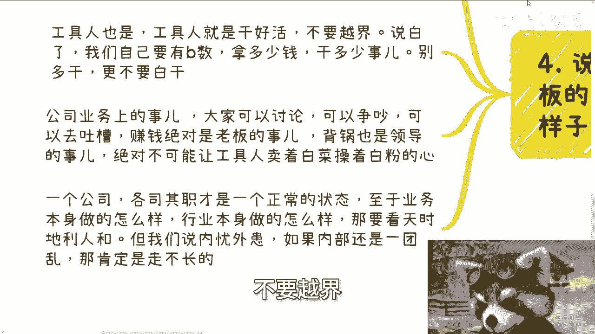

也不要偷懒，这就是个最最正常的状态哦，至于业务本身做得怎么样，行业本身做的怎么样，这个要看天时地利人和，就我们一直说的内忧外患，内忧外患，如果内部也是一团乱，那肯定是走不长的，你管他外患是怎么样子的。

对不对啊。

所以说我觉得你说一个企业，怎么判断他靠不靠谱，就是这样子的呀，对吧，你说剩下的有很多细节还有吗，有的，但我觉得这不是很重要啊，重要的就是说大家在那边勾心斗角，或者说在干那些有的有有的没的事情啊。

或者说就是我们之前，评论区也有小伙伴说的对吧，三十百%分之30的人在干活，30%人在划水，30%的人在在就就在在那边啊，啊耍嘴皮子对吧，就在那边就是瞎瞎扯啊，拉帮结派对吧，那你怎么搞得好，你搞不好呢。

啊只不过就是什么呢，只不过我们当然我们在这个地方说啊，不靠谱的企业不是说他一定会倒闭啊，因为我们之前就说过任何一件事情呢，你不是看节点的，不是靠某一个节点的对吧，你就像某些企业。

他说我要做100年的企业，那你100年做到做不到，我们不关心，但这些企业从鼎盛时期走向衰败，或者说最终如果来说倒闭了或者怎么样，那他一定内部是有这种形现象，而且这种现象已经是渗透了很长时间了啊。

改不掉的好吧好，那么下期活动我们定了5月25号好吧，然后6月份的活动呢我就打算定在深圳啊，打算定在深圳了，详细到时候再说啊，那么杭州这次活动先报名，地点在杭州站附近好吧，详细的内容跟报名可以私信起来嗯。

然后剩下的话就直接规划商业规划啊，你们啊包括股权融资啊对吧，商业计划书啊对吧，股份啊啊分红啊等等等啊，包括你们就说手上有什么牌，以及你们手上没有什么牌啊，你们自己有自己想法的，但希望通过我的视角。

或者我跟你们沟通之后，能够给大家一些更明确的方向，那么你们整理好，那么我们再来做咨询啊。

