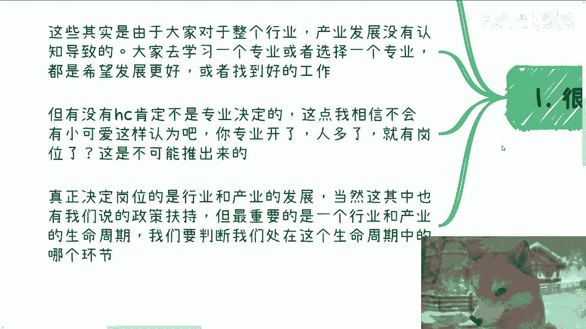
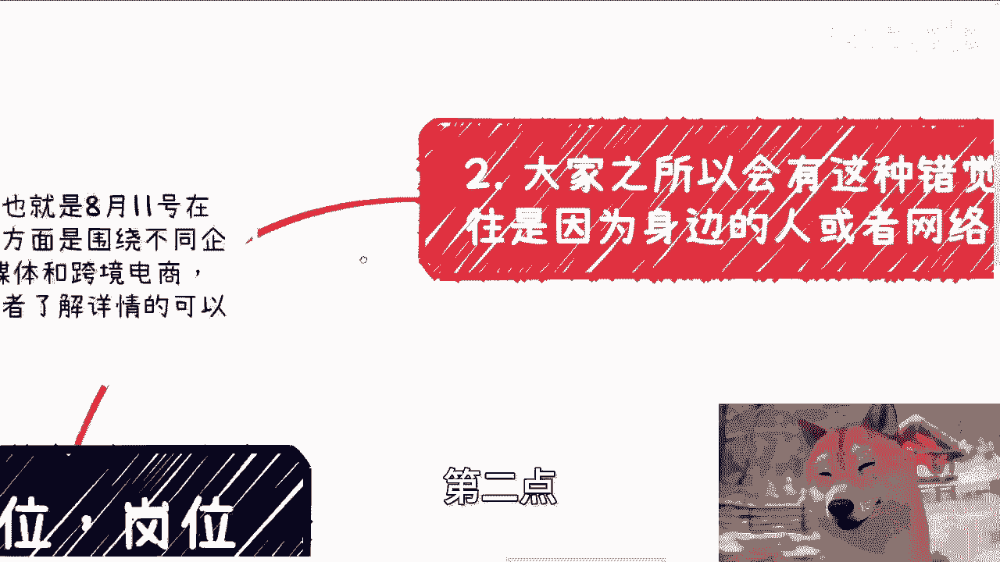
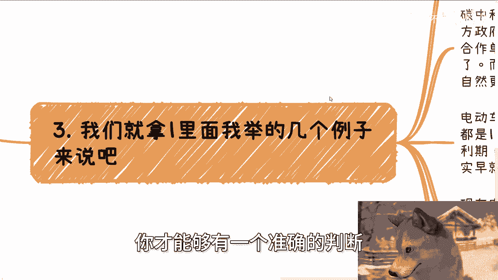
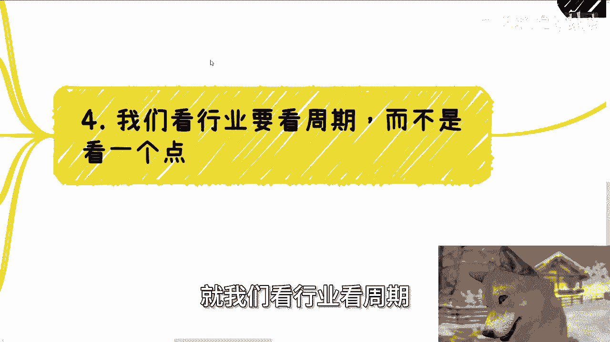
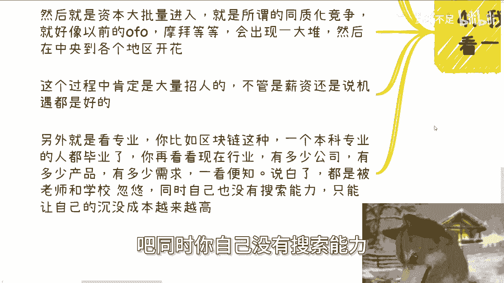
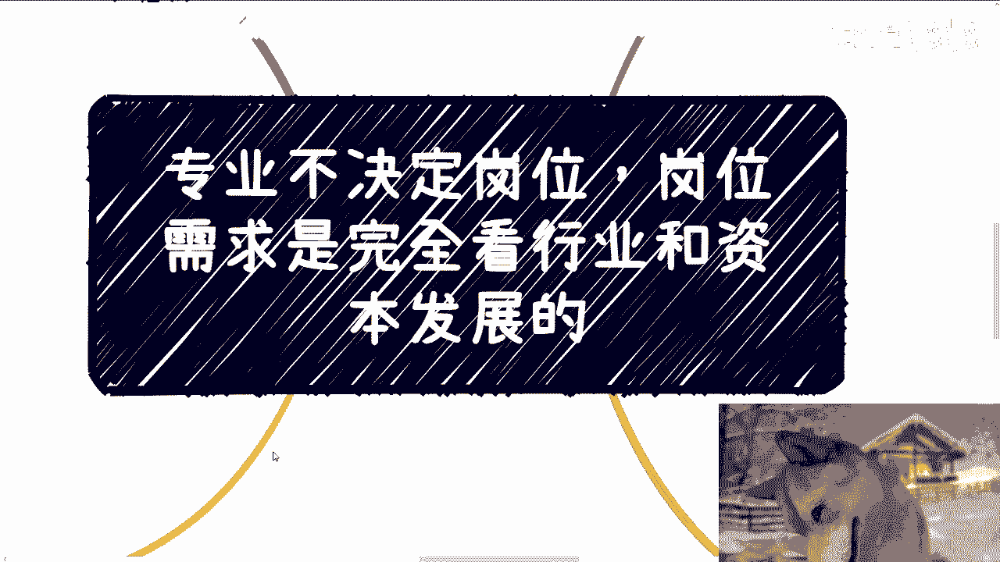

# 职业规划课 P1：专业与岗位的真相 🔍

在本节课中，我们将要学习一个核心观点：**专业本身并不决定就业岗位**。岗位需求主要由行业发展和资本动向决定。我们将深入探讨为何会产生“专业决定岗位”的误解，并学习如何正确判断一个行业的真实前景。

## 1. 核心观点：岗位由行业与资本驱动 💡

上一节我们介绍了课程主题，本节中我们来看看核心观点。

许多人认为，选择了某个专业，未来就必然有对应的岗位。这种理解源于学校或身边人的信息。但需要明确的是，专业本身无法决定岗位。岗位需求完全取决于**行业发展和资本投入**，即市场的发展阶段。

决定岗位数量的公式可以简化为：
**岗位数量 ≈ 资本投入 × 行业发展阶段**

真正驱动岗位的是产业与行业的发展，其中也包括政策扶持。但最关键的是判断行业所处的**生命周期阶段**。

## 2. 误解的来源：信息茧房与认知局限 🧠

上一节我们明确了岗位的真正驱动力，本节中我们来分析为何会产生误解。

之所以会产生“专业决定岗位”的错觉，主要源于两个信息渠道的局限。

以下是两个主要的信息误导来源：

1.  **网络与自媒体**：当一个行业的资讯在网络和自媒体上铺天盖地时，往往意味着该行业已经度过了快速成长期，甚至开始进入平台期或衰落期。这些信息可能是正确的，但通常**不及时**，存在严重的滞后性。
2.  **身边人的认知**：我们的社交圈子很大程度上决定了我们的认知水平。作为普通人，我们身边大部分人的认知水平与我们相近。如果大众的认知总是及时且正确的，那么大多数人早已获得财富自由，这显然不符合现实。

真正了解行业生命周期的人，通常不会在公开网络平台大肆讨论，因为在其圈层内这是基本常识，且他们的首要目标是**赚钱**而非说教。

因此，我们需要做两件事：
*   第一，警惕那些被广泛传播的“热门”行业信息。
*   第二，主动通过社交（Social）去接触真正了解行业周期的人，以获得更真实、及时的认知。

## 3. 案例分析：热门方向的真相剖析 🔬

上一节我们探讨了误解的来源，本节中我们通过具体案例来验证观点。

我们以常被问及的几个方向为例，分析其真实状况。

以下是三个热门方向的现状分析：

1.  **新能源**：
    *   很多人混淆了“新能源汽车”（如电动车）与广义的“新能源”（如光伏、储能、碳中和）。
    *   以光伏、储能为代表的新能源领域，其客户多为国企、央企，市场并非全面铺开，因此无法产生大量面向应届生的就业岗位。
    *   电动车行业前几年经历资本狂热，存在跳槽红利期，但周期很短。目前整个产业链已进入激烈竞争、利润摊薄的阶段，对于新入行的打工人而言，红利期已过。

2.  **人工智能/大语言模型**：
    *   当高校开始广泛设立相关专业、媒体大肆报道时，需要警惕。这往往意味着技术普及和竞争白热化的阶段。
    *   判断标准是看**产业需求**和**实际产品落地**的程度，而非仅仅关注技术概念的热度。

3.  **区块链**：
    *   这是一个非常典型的案例。当区块链本科专业的学生都已毕业（意味着专业设立已超过4年），而市场上存活的相关公司、可落地的产品和真实需求仍然寥寥无几时，这个行业的就业前景就非常明确了。
    *   如果一个产业在专业人才培养周期结束后仍无起色，那么对其“未来前景”的承诺就需要高度怀疑。

## 4. 正确方法：如何判断行业前景 📈

上一节我们剖析了具体案例，本节中我们总结判断行业前景的正确方法。

判断行业不能只看一个时间点，而要看其完整的**发展周期**。好坏是相对的，需要有参照物。

一个行业的典型发展周期可概括为以下几个阶段：

1.  **起步期**：人才培育、产业基地建设、标准制定。政府、学校、企业开始采购相关服务或教材。
2.  **成长期**：资本大量涌入，同质化竞争开始，企业为抢占市场大规模招聘。这是薪资和机遇较好的阶段。
3.  **成熟/竞争期**：市场格局初步形成，竞争加剧，招聘回归理性，更看重核心技能和经验。
4.  **平台/衰落期**：市场饱和，增长放缓，信息在公众中广泛传播，但机会窗口已关闭。

对于个人而言，关键在于识别周期。如果某个领域刚完成“高校开设专业”这一步（属于起步期信号），但产业端已无更多进展，则需谨慎。

## 5. 行动建议与课程总结 🎯

上一节我们学习了判断行业周期的方法，本节将是本课的总结与行动指南。

面对专业与岗位的困惑，核心解决方案是**深入且跨圈层地了解行业**。不要依赖短视频或身边局限的认知。

以下是给你的具体行动建议：

*   **主动社交**：努力接触目标行业内的从业者、投资者，了解一线真实信息。
*   **审视信息时效性**：对任何“前景广阔”的论断，追问具体的时间框架和现状依据。
*   **关注资本动向**：留意头部投资机构的资金流向，这是行业的晴雨表。
*   **降低沉没成本影响**：如果发现所学专业对应的行业前景黯淡，应果断规划转型，而不是因为“学了这个专业”而一条路走到黑。

**本节课中我们一起学习了**：专业不决定岗位，岗位需求由行业发展和资本驱动。我们分析了误解来源于滞后信息和认知局限，并通过新能源、AI、区块链等案例，学习了如何通过判断行业生命周期来评估真实前景。最后，我们强调了通过跨圈层社交、关注资本动向等方式获取及时有效信息的重要性。记住，职业规划要看**当下**的产业现实，而非对遥远“未来”的空泛承诺。

---
**下期活动预告**：职业规划与商业咨询线下活动将于8月11日在长沙举行。活动将围绕企业Offer选择、自媒体与跨境电商、未来市场展望等主题展开。如需报名或了解详情，请私信联系。此外，如需针对个人职业规划、商业合作、股权合同等具体问题进行一对一咨询，请整理好个人背景与问题后联系。