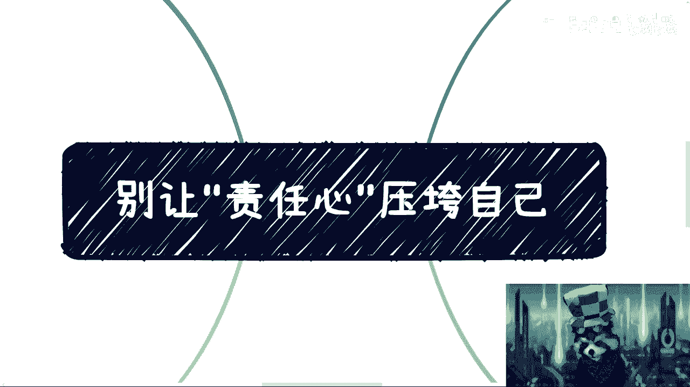
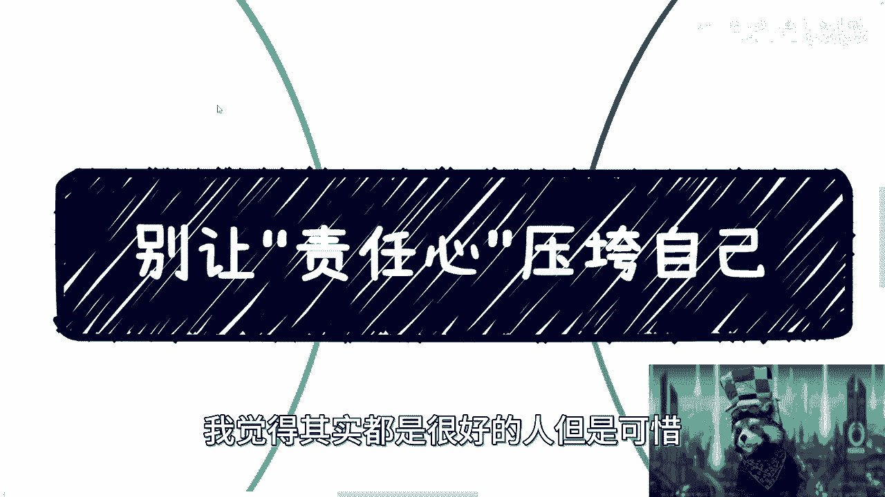
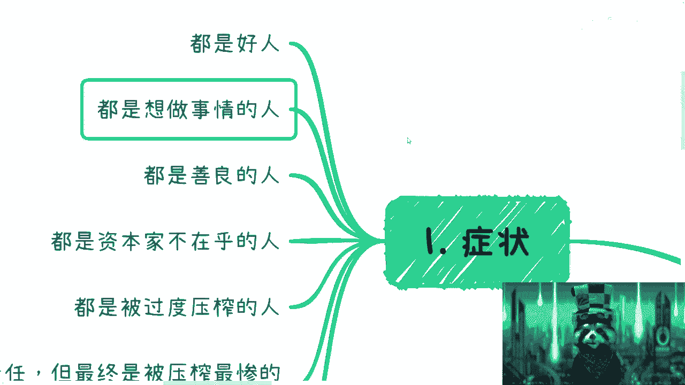
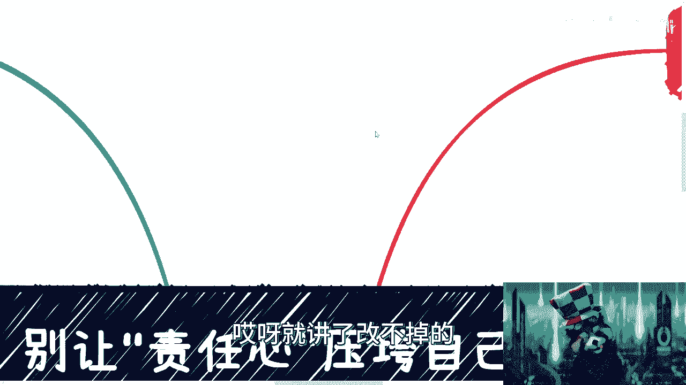
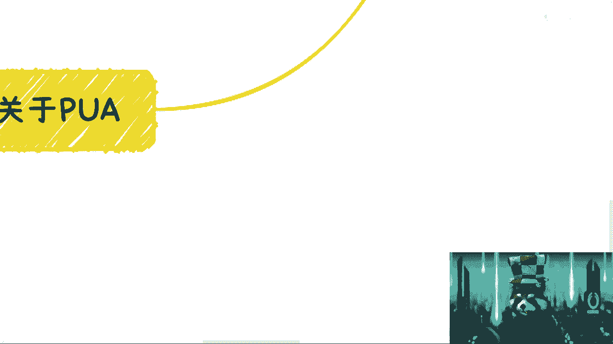
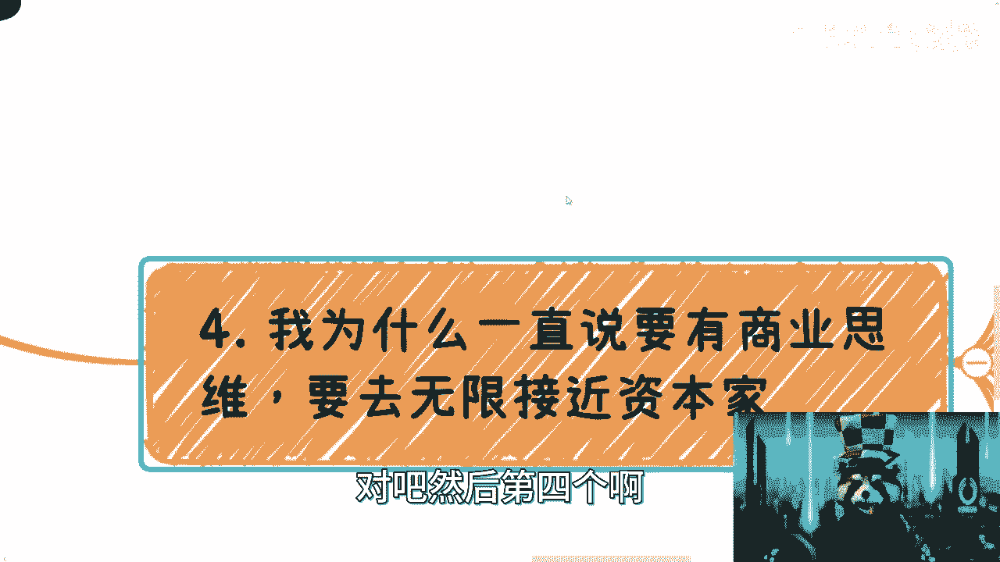
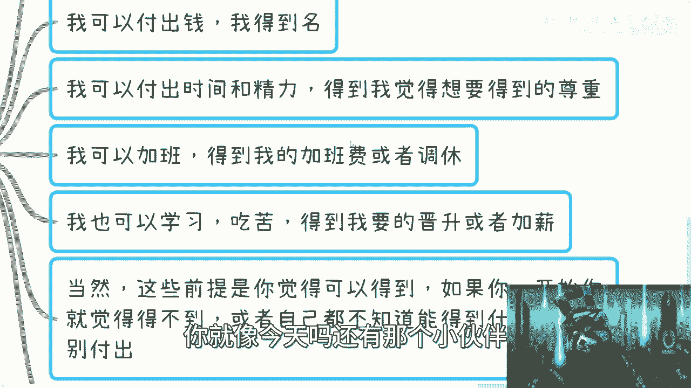
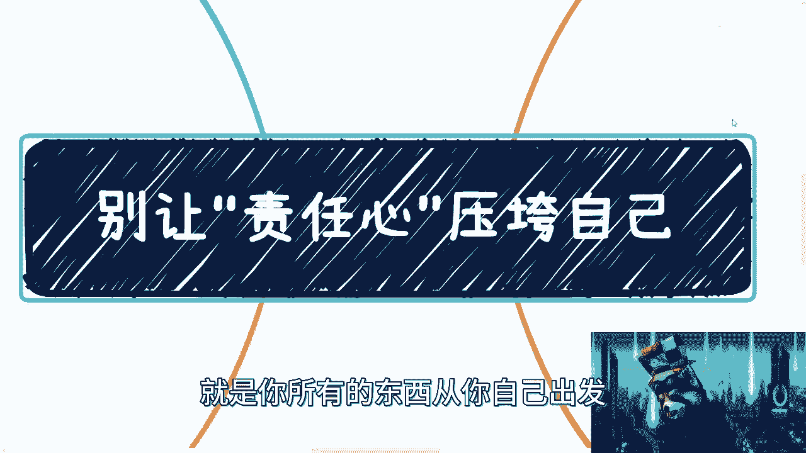
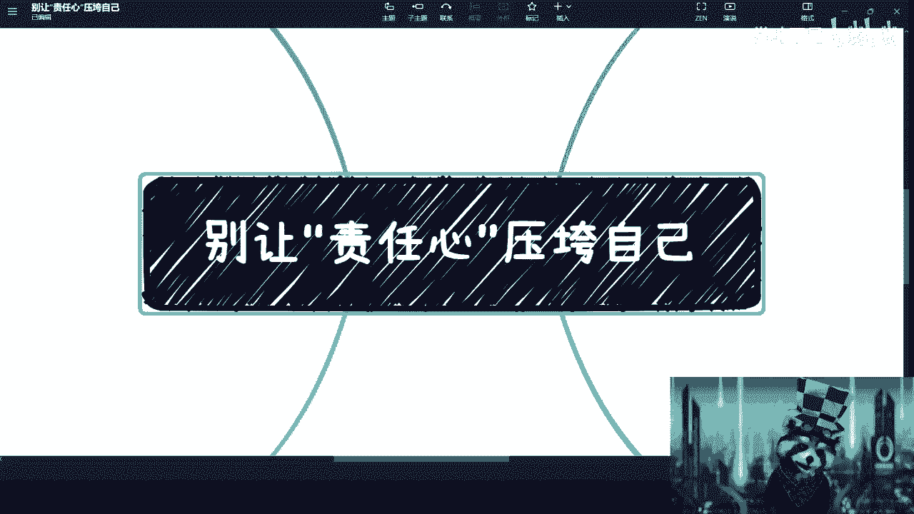

# 严肃强调！别让责任心压垮自己 - P1 - 赏味不足 - BV1Kh411j7Yt

好啊大家好对吧，我又换了个装束呃，为什么每次都歪着呢，好了呃。

昨天有小伙伴呢是这样子的，就私信我跟我说这个职场这个PUA的事情啊，然后我刚刚今天晚上出去跟这个网友见面对吧，然后也提到了这个问题，所以我想了一下，回来就聊一下啊，我觉得核心点呢是这样子的。

我呢以前也是这样的人啊，然后这个我身边近几年来这种人也很多，所以我取了这么一个主题，叫做别让责任心压垮自己是吧。

我觉得其实都是很好的原因，但是可惜都被当做电池啊。

首先我觉得第一症状啊，症状是什么呢，就是啊第一都是好人啊，第二呢都是想做点事情的啊，就是说不是那种混混日子对吧，都是想做点事情。

三呢就都是善良的人啊，然后四呢都是资本家不在乎的人啊，呃资本家甚至不不当你是人啊，自己不不当你是人是吧，然后还有就是都是过度压榨的啊，然后呢你会发现呢，就是这种人呢自驱力还特别强。

就属于那种特别负责任啊，别人就是说不跟你说这个东西要做对吧，自己觉得哎呀我要负责对吧，我要把这个东西做好，那么最终呢被压榨的很惨，或者被利用的人，或者说被甩锅的人啊，悲观的人啊，甚至还有很多抑郁对吧。

说到这儿呢，我觉得其实大家就不先不说自己代入吧，我相信你们可能有些小伙伴自己啊，包括你们身边这人就很多对吧。

而且大部分都是这样的，而且我跟你讲，还有我我今天晚上吃饭还在说这个事，我说还有个最大的特点。

就是什么都是劝呢，劝不住的，你跟他讲讲不通的，你知道吗，还是就讲了改不掉的啊。

然后呢我觉得核心呢是这样子的，你们一定要记住呢，就是打工就应该有个打工的心态对吧，这什么意思呢，就是说你是去打工的，你要记住啊，你只是签了份劳务合同，你是去打工的，你不是卖给别人了是吧。

而且另外一方面呢就是说你要明白一点，你付出的就是咱们还是那句话，你首先要去先尊重自己对吧，你自己不尊重自己，别人是不会尊重你的，是不是，那你尊重你自己是什么呢，就是很简单，我付出的时间。

我付出的劳动是有价值的，什么叫是有价值的，就是你给我多少钱，我做多少工作，对不对，那这就要有价值的哦，你说你给我500，我做5万的货，那就要有价值吗，不叫那叫你，你是吧啊，那么我觉得咱来看啊。

第一个你看给多少钱做多少事，当然呢我这地方写的很清楚，你也不是那么死板的对吧，你比如说你给5000，你让我做期限的活行啊，可以啊，我忍一个月两个月，我忍忍半年对吧，你但凡我忍个这个什么三个月到半年。

你这个作为领导或那个什么呃，老板没有逼数的，那不好意思，我懒得跟你纠结对吧，我换就是了，怎么地球这么大，我还换不到工作吗是吧，就是说我们可以给自己定个底线对吧，你比如说你有一定的弹性啊，没有问题的。

但是过分了呢，你就算了，你知道吗，就是要一定要断舍离，你别去纠结啊，别要觉得说哎呀，好像永远有个饼对吧，你说我是不是下个月能涨薪20%啊对吧，或者我是不是这个半年后能涨20%啊，不用去想这些事情。

就是你要明白，资本家永远心理是没有逼数的，你知道吗，就是他但凡要给你加，早就给你加了，要不不给你加，对吧啊，那么那么也就算了啊，如果过分呢，我跟你讲，就是说很多时候啊，很多时候就是比如说事情做不完了。

或者怎么样了，一定要明白这个事情呢不是我们能处理的，我们就是个打工的对吧，那这个时候该领导出面，该领导出面，该什么管理者出面，管理者出面，反正说不好听点，我们就是个打工的对吧，你别的事情找我们。

你说是吧，我跟你们说，真的很多时候，这种时候你们应该去学习公务员对吧，就真的很多时候你们会发现啊，就是说当你们跟他们沟通的时候，他们就会回你一句话，哎我也是打工的，你别为难我是不是很好的。

你就跟你老板说，我也是打工的，为难我干嘛的，没意思，你对吧，或者跟你领导说，别为难我干嘛，PUA我呢，你PUA你自己就好了，是不是就这第一点，第二点呢就是说有很多事情完不成。

你得去判断到底是因为你自己效率低呢，还是因为别的事情影响了你，把你的这个进度拖慢了对吧，明明比如说是这个5月1号就能做的对吧，明天就拖慢，拖到5月6号才能做对吧，还是因为别人效率就影响你自己。

是不是那做不完就做不完，别的人完不成就完不成，怎么了呢，项目不能成交就不能成交，怎么了呢，对吧，我不管你，你我就算跟你说这项目成交不了的吗，损失一个亿，怎么人家是损失你吗啊你是担心企业。

你你老板让你赔吗，对不对，这种无论从你无论于情于理，于法律，他都站不住脚的呀，你怕什么东西呢，是不是对啊，很多人说我不怕的吧，我就觉得我要完成他对吧，这就是我的责任心，那我就这么跟你讲，不好意思。

我觉得你这不叫责任心，你这叫先不尊重你自己，就这么简单啊，别的老师用那些花里胡哨的理由，来为自己开脱了，你知道吗啊，然后呢，你看啊，完成完不成啊，这个完成了不多，你一分钱完不成，大概率也不会开掉。

你对吧，怎么了呢对吧，你不在就完成了吗，难道老板不会不懂的，资本家会不懂了啊，缺你一个缺了吗啊，少你少你一个不少，多你一个不多的，明明就是对不了，所以我在这地方说的很清楚，你千万别有那种什么呢。

就是我做事情就要负责，就要做得好的这种心态，这种心态对吗对的，但是除非你要碰到资本家是尊重你的，就是说双方大家是基于一个平等的状态，前提之下来做事情的，当你是个人啊对吧，就当做啊。

我这个地方可能怕大家误解是吧，当做你是个人，而不是个电池，否则你就是他不尊重你，你就没必要去有这种心态，有必要吗，没有必要对吧，因为我你比如说我今天去打工对吧，你作为一个老板，如果你尊重我啊。

那么我在偶尔的一点时间，我在特别紧张一段时间没有问题，你哪怕不给我钱，我用爱发电，我也会帮你做好，为什么，因为我觉得你尊重我，我就应该是有一定汇报的对吧，我也愿意尊重你这个项目。

但如果你一点都不尊重我对吧，你就是那种什么哎呀，老师PUA，我老师加班对吧，老师们也不给钱的对吧，用爱发电是吧，那我凭什么给你卖命啊，我吃饱了撑的，是不是就是所以我才跟你们讲，就是尊重这件事是双向的啊。

你没有必要为别人的事业和股票去额外付出，自己的时间和精力，有意义吗，我就问你有没有意义，对不对，你就为了自己的一些自尊心，莫名其妙的自尊心，而且是非常不合理的自尊心，我跟你讲。

就他妈这种就是阻碍你成长的一个，这个叫什么障碍，还是你自己给你自己设立的，你知道吗，那这个是第二个啊，第三个呢就是关于PUA对吧，因为小伙伴也说了嘛，这种情况我身边很多很多就是什么呢。

就是如果有人觉得你不行啊，比如说他有些事情做的不好对吧，或者做的这本来就不是因为你的原因，但是呢他非要说你不行啊，我跟你讲，那可以也没问题，按照我的价值观对吧，你能你说我对吧，可以的，没问题的。

那你去给我看，你你就证明给我看，你有没有这个能力，你没有这个能力，你别来跟我逼逼，你没有资格跟我比比，为什么呢，因为我不管你是我老板还是我的manager，我们只不过都是劳务关系，我又不是卖给你了。

我他妈又不是签了卖身契，怎么了呢，你跟我逼逼什么呢，你要么就证明给我看，告诉我怎么做，否则没有必要逼逼，对不对，这是第一点，第二点就是如果要说什么啊，什么什么年轻人要吃苦对吧，然后说什么啊，按照我的价。

就我跟你讲怎么样怎么样啊，按照我的价值观也很简单啊，就是我吃苦嘛，可以请问有钱吗，有成长吗，这两个总会给我一个吧对吧，有调休吗对吧，都没有，我为啥吃苦啊，唉我奇了怪了哦，那这样好了，我吃过也可以的。

你你要么陪着我对吧，你你请你们股东最大老板陪着我，怎么了呢，哦哦我只有我吃苦啊，你们你们躺赚，凭什么你莫名其妙的，是不是啊，还有呢，我跟你们讲，就我觉得很多小伙伴跟我心理一样。

我以前呢就对所有人都是非常善良温和的啊，就我对谁都当朋友对待，但是呢我跟你讲，后来我就明白了，为什么呢，因为我这样对别人，我刚刚跟你们讲了，我这样对别人，其实也等于对自己的一种不尊重，你一定要明白。

就是你这样对别人，就是你不尊重你自己的时间，不尊重你的价值，觉得你自己觉得没有价值，而且我可能说的不好听啊，我觉得我之所以这么对待别人，是因为我自卑，或者是因为我觉得我应该去讨好型人格，我应该讨好对方。

但这种没有意义的，你知道吗，没有任何意义啊，因为你一开始就让你自己处在，一个完全不对等的状态对吧，本质上是你先不尊重你自己，别人才会觉得你好欺负，然后不尊重你，那你怪谁，你明白这个道理吧。

对吧，然后第四个啊就是我为什么跟你们说。

一直要有商业思维，要去无限接近于资本家呢。

因为你赚不赚钱，这个是一回事对吧，但是就是说这个思维是很重要的对吧，在这个钢之炼金术士里面提到很清楚，一切都是等价代换，我觉得这个是对的，就是我付出了我是必须要得到的，我的付出跟得到可能不是同一种物质。

但是至少在我的认知里面是对的，什么意思呢，就是说我付出了钱，我可以得到名，我也可以得到钱对吧，那你可以不给我钱，但是我要得到我想要的名，对不对，第二就是说我可以付出我的时间跟精力。

但是得到了我觉得要要得到的尊重对吧，那我可以说我我也可以给钱，但是你要给我尊重或者给我，就是说啊觉得大家以后会可以合作对吧，给我对应的一些就是战略合作啊，或者怎么样的一些东西，对不对。

第三就是说我也可以加班对吧，那你给我对应加班给调休嘛，就这么简单嘛，对不对，第四就是说你要说我不学习不吃苦对吧，好可以，那我也可以学习学习吃苦，那么得到我想要的晋升或加薪，对不对，就像我刚刚说的。

OK我可以给你定定一个时间，三个月，你三个月不给我加钱，OK我走人，怎么了呢，我是差你这点加薪吗，我差你这点晋升，我没有这个加薪和晋升，我活不下去了吗，莫名其妙的，是不是，那当然我跟你讲。

这些前提呢都是你首先你要去评估的啊，你不要老师就是说啊被别人当枪当枪使了之后，知道吧，别人说我不给你对吧，比如说啊你先付了钱，别人答应你的，说给名额，后面也不给对吧，那不行的。

就是你自己总归得要有一个基础的一个判断，一开始如果你就感觉这件事情不太靠谱，或者根本就是就是画饼给你的，那就你就别付出啊，而且另外一方面，就是如果你自己都不知道能得到什么，那就更别付出了对吧。

所以说呢其实本质上还是那句话，本质上是什么呢，就是说很多时候啊，那你看哦资本家在这个地方这样子，资本家无论怎么做，他永远不会做亏本买卖，你们一定要明白这句话啊，就是你们有时候会会碰到吗。

就是那种啊就是很多小伙伴也会问我嘛，他就说啊这个什么这个培训班对吧，好像什么收了4000块钱或收5000块钱，能够帮我赚什么，1万赚2万这种事情可能吗，你们用你们的，就你们哪怕用单细胞生物的这个思维。

去思考一下，都能够思考得出来，就是资本家会去做亏本买卖吗，如果他去做亏本，就他去做亏本买卖，他就不是资本家了，而且另一方面他要能收你4000，帮你赚1万，他就不会收你4000，他自己不会去赚吗。

脑子有毛病啊，是不是对吧，所以说就是你但凡思考一下就知道了，而且呢在这个地方呢，就是说有很我相信啊，就是有很多人跟我以前一样，就比较优柔寡断嘛对吧，就是性格上面就这些事情，我现在框出来这些事情。

并不是说你们要去跟你们的领导去刚啊，也不是说你们要去跟你们的领导一定要去对，或者怎么样子，而是呢你们是这样子的，你们在学校也好，对你们的老师也好，在公司对应的同事也好，在外面，就比如说像我现在在外面。

跟这个这个社会上的人合作也好，你们一定要明白一个道理是什么呢，就是你们要适当的告诉别人，你不是好欺负的，你要适当的告诉别人，你是懂得拒绝，你知道吧，因为很多时候你一定要明白，就是你适当的懂得拒绝。

跟不少好欺负之后，有很多事情就会改观，因为这个社会太多的人是蹬鼻子上脸的，就是就是找软的捏，就是这样子的，你但凡让他觉得你不是好欺负的，你自己是有你自己的这个价值观的，有有你自己的这个底线的。

他就不感觉你怎么样啊，所以说呢就是你千万别觉得哦，我一味的让步，就是能够得到更多，从来没有这个逻辑的啊，你也别觉得你去怼了，你去刚了，你就得不到很多东西，我还是那句话。

你能不能得到的东西跟你的价值产生占比，和你的价值成唯一的一个原因，如果今天你有核心竞争力，有核心的价值，那么你无论对也好不对也好，企业领导管理者是离不开你的，那如果来说你怼了或者怎么样子，他就把你开掉。

或者他就给你小鞋穿，那还就是换句话来讲，就是你的确因为这个时候你有两条路，第一条路说哎我要么改一改，我以后不怼了对吧，第二条路就是我要提升自己竞争力，我要加强自己，那你说你选哪一种对吧，因为你选第一种。

你早晚就是要被PUA死的对吧，你早晚就是被利用死的，那你只有选择第二种，第一种就是那种做治标不治本的，对吧，然后你就像今天嘛，还有那个小伙伴跟我提那个喝酒的事情。

我就很简单跟他讲嘛，我说那为什么要喝呢，不喝就不喝呀，对不啦，怎么啦，我不喝，他妈我在这活不下去了哦，我不和我还不能认识领导了啊，我不和我还没有关系了啊，那这世界上的所有关系都靠喝酒喝出来的，对不对。

这也莫名其妙嘛是吧，就是不用太去在乎这些东西。

就是我跟你们讲，一定要让自己保持一个空杯的心态啊，所有的三观，所有的东西你们都是被灌输的，就当做都没有，然后自己去探索哪些东西是对的，哪些东西是不对的哦，就是一开始不要否定它，但是一开始也不要肯定他哦。

不要就是一上来就跟我说，哎呀这个酒桌文化是好的，你不能规避掉，有很多人就是靠这个拿到关系，那他妈多人跟我有什么关系啊，你非要去做很多人，那你去做呗，对不对啊，就像还有还有那个评论区很搞笑的跟我说。

哎呀做测试很有钱，都做开发很有钱，那你去做呀，你去呗，我本来觉得没前途，那你去呗跟我有什么关系呢，哎很多人都觉得好的，那很多，你是做很多人好了，你跟我讲什么干干什么了，对不对，我跟你讲的很清楚了。

我的我以一个资本家的视角，我以一个赚钱的视角，我就告诉你没有前途，就这么简单，对不对啊好吧，那么就希望就是说大家。

反正就是对自己负责吧对吧，就是你所有的东西请从你自己出发。

你的时间精力付出都要让你自己得到东西，不管是民还是钱还是成长，总归有个东西你不能无谓的付出啊，因为你无谓的付出，你回过头来看，其实说白了你给别人打工，你给别人赚了钱啊，你给别人项目做的东西。

到最后你一无你你一无是处，你一事无成，那怎么办呢。

好吧，希望大家千万不要就是说这个既损失了钱对吧，又好像伤害了自己的身体，好吧行吧。

