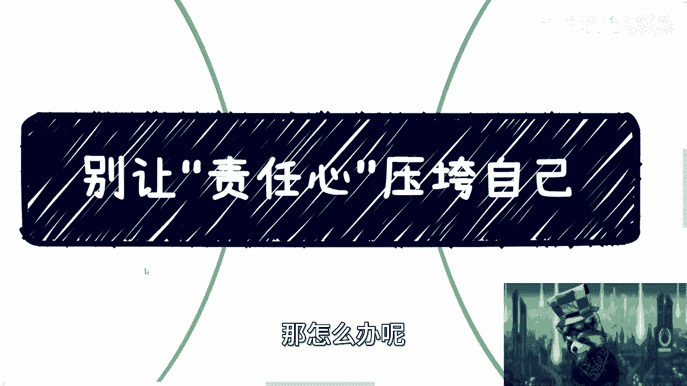

# 职场生存课 01：别让责任心压垮自己 ⚠️


在本节课中，我们将要学习如何建立健康的职场心态，避免过度的责任心导致自我压榨。我们将探讨过度负责的典型症状、其背后的心理原因，并提供一套清晰、可操作的原则来保护自己的时间、精力和价值。


---

## 过度责任心的典型症状


上一节我们介绍了课程主题，本节中我们来看看过度责任心有哪些具体表现。这类人通常具备以下特征：

以下是过度责任心者的常见症状：

1.  **都是好人**，本性善良。
2.  **都想做点事情**，并非混日子。
3.  **自驱力特别强**，主动承担责任。
4.  **容易被过度压榨或利用**，成为“背锅侠”。
5.  **容易陷入悲观甚至抑郁**。
6.  **他人的劝说往往无效**，难以改变行为模式。

## 核心原则：建立打工者心态

认识到症状是第一步，接下来我们需要建立正确的心态。核心在于认清雇佣关系的本质。

**公式：打工者心态 = 清晰的自我价值认知 + 明确的付出回报预期**

你需要记住两点：
1.  你只是签订了一份劳务合同，并非“卖身”。
2.  你必须先尊重自己，别人才会尊重你。尊重自己意味着承认你的时间和劳动具有价值。

这个价值的基本公式是：**报酬 ≈ 工作量**。你可以接受短期的弹性付出（例如，短期高强度工作以期未来回报），但必须为自己设定一个明确的底线和期限（例如，3-6个月）。如果超出底线，就应果断考虑“断舍离”。

## 具体场景下的应对策略

建立了正确的心态后，我们来看看如何在具体工作场景中应用。

### 1. 关于工作完不成

当工作无法完成时，你需要理性分析原因。

以下是关键判断点：
*   **区分责任**：是自身效率问题，还是外部依赖（如其他同事、资源）导致延误？
*   **放下不必要的负担**：项目失败、公司损失，只要不是你的法定责任，就不应过度焦虑。你的责任心不应为别人的事业和股票买单。
*   **接受结果**：完成与否，通常不会导致你被立即开除。公司离了谁都能转。

**核心**：除非在一个彼此尊重、平等的前提下，否则“必须负责、必须做好”的心态反而会成为你不尊重自己、被人利用的弱点。

### 2. 关于职场PUA


面对质疑或不合理的指责，你需要建立防线。


以下是应对PUA的逻辑：
*   **要求证明**：如果对方（包括领导）指责你“不行”，请对方给出具体证明或可行的改进指导。否则，这种批评没有意义。
*   **质疑“吃苦”论**：当被要求无条件吃苦时，反问自己：**有钱吗？有成长吗？有调休吗？** 如果都没有，为何要吃苦？要求倡导者一同“吃苦”。
*   **警惕讨好型人格**：对所有人过度善良温和，可能源于自卑或讨好心理，这本质上是**不尊重自己的时间和价值**，会招致他人的不尊重。

### 3. 培养商业思维：等价交换

要摆脱被压榨，需要像资本家一样思考：一切皆是等价交换。

**代码描述等价交换原则：**
```python
def equivalent_exchange(input, output):
    """
    定义付出与收获的等价关系。
    付出可以是：金钱、时间、精力、劳动。
    收获可以是：金钱、名誉、尊重、成长、休息、晋升机会。
    """
    acceptable_outputs = ['金钱', '名誉', '尊重', '成长', '休息', '晋升']
    if output in acceptable_outputs and value_of(input) <= value_of(output):
        return "交易成立"
    else:
        return "拒绝交易"
```

以下是等价交换的实例：
*   付出金钱 → 获得知识/名誉。
*   付出时间精力 → 获得尊重或未来合作机会。
*   付出加班 → 获得调休或加班费。
*   付出学习与吃苦 → 获得明确的晋升或加薪承诺（需设定期限）。

**前提**：你需要有能力评估对方承诺的可信度。如果感觉是“画饼”，就不要付出。如果不知道自己能得到什么，更不要付出。

## 行动指南：设定边界与提升价值

理解了原则，最后我们来看看具体的行动方法。关键在于“软硬兼施”。

以下是两条核心行动路径：
1.  **学会拒绝，表明底线**：适当向同事、领导乃至合作方表明你不是“软柿子”。懂得拒绝，反而能赢得尊重，减少无理要求。社会规则往往是“欺软怕硬”。
2.  **聚焦提升核心价值**：你是否被尊重、被需要，根本取决于你的**核心竞争力**。如果因为维护底线而遭遇不公，治本之策是提升自身价值，让自己变得不可或缺。一味妥协是治标不治本。


**举例**：对于“酒桌文化”等不合理要求，你可以选择不参与。你的关系网和前途不应建立在伤害身体的基础上。保持“空杯心态”，重新审视所有被灌输的规则，用自己的逻辑判断其对错。


---

## 总结


本节课中我们一起学习了如何避免被过度责任心压垮。


**核心要点总结**：
1.  **识别症状**：警惕过度负责、自驱力过强且听不进劝的状态。
2.  **摆正心态**：建立“打工者心态”，牢记**报酬 ≈ 工作量**的等价原则，设定个人底线。
3.  **理性应对**：工作完不成需分清责任；面对PUA要敢于要求证明和等价交换。
4.  **商业思维**：所有付出都应追求明确回报（金钱、成长、尊重等），遵循等价交换原则。
5.  **采取行动**：学会拒绝以设定边界，同时持续投资自己以提升核心价值。




请始终从自身出发，确保你的每一分时间和精力付出，都能为自己换来金钱、成长或名誉上的收获。无谓的付出只会让你在为他人创造价值后，发现自己一事无成。请对自己负责。