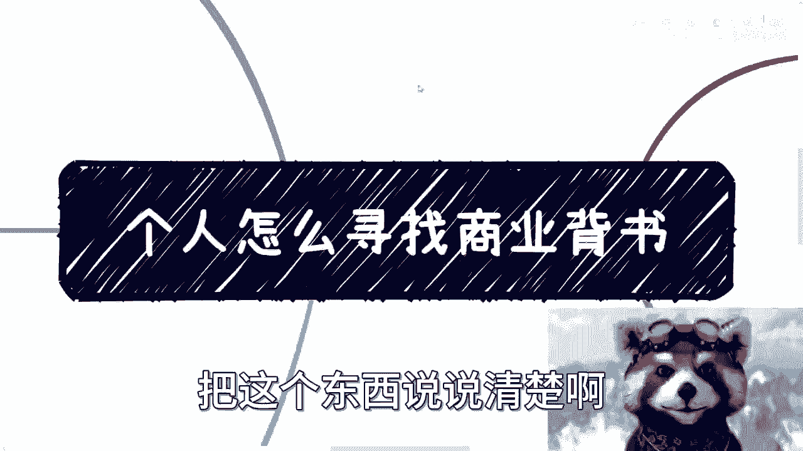
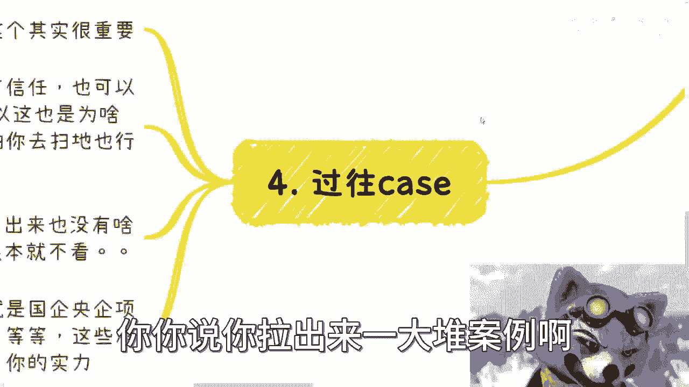
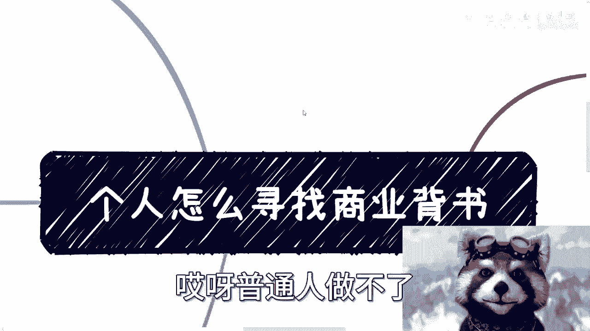

# 个人怎么在商业上寻找商业背书 - P1 - 赏味不足 - BV1jc411d78f

大家好啊，很多时候呢这个是人是会变异的是吧，你比如今天啊怎么办呢，这特效我特别喜欢。

我喜欢炸弹，哈哈啊，那个之前我好像是提到过啊，我说个人怎么寻找商业背书啊，呃呃我应该提过，但是其实问我的人也蛮多好吧，那我就单独再出一期，把这个东西说说清楚啊。

呃首先个人的商业背书呢分成这么几个啊，一个是项目抓手啊，第二个是企业挂靠，第三个是过往case，第四个是名誉证书啊。

没有啦，就就这些东西啊，没没没有别的东西了，那么项目抓手呢是这样子的。

这个很容易就是我们在日常的社交当中啊，你可以随意去寻找那个切入点，和别人的这个合作啊，那也就是说我们去参加任何活动啊，你比如说你说啊别人可能是做电商的啊，别人可能做一些这个教育啊，做一些游戏啊。

那我们呃我们可以跟别人的沟通当中啊。

你就直接跟别人说嘛，你说我可以跟你合作对吧，比如说我可以帮你做分销啊，做运营啊，做外包啊对吧，做巴拉巴拉巴拉巴拉，做什么都可以对吧，我给你端茶送水送水都可以是吧，哦那么项目合作之后呢，其实你就有个抓手。

就是你们只要开始合作了，其实你就有个抓手抓手，因为你可以跟别人介绍说啊，你说你是某某某项目的合作伙伴对吧，或者怎么样子，那当然你你你这个边界感要有，你不能反客为主啊，你不能跑到别人那边说哦。

我是这个项目的创始人对吧，怎么样子，我跟你讲这种就是叫什么啊，偷鸡不成蚀把米，你知道吗，就是你不要让别人觉得你有越界的行为，因为大家在你合作没有赚到钱的情况下，大家是没有信任感的对吧。

你越是越借越越让越让别人觉得你不安全，你有风险，你知道吧，就是说呃这种东西最好不要去做，但是呢就是说你跟别人讲，你说我现在是什么项目的合作方啊，那么总比你个人来的好吧对吧。

那么这种呢其实有很多呃，就是说有合同也好，没合同也好，我跟你讲无所谓都可以啊，那么反正就是说你要跟别人合作起来，就可以了啊，嗯多问合作方要点企业介绍，项目介绍啥的，因为我突然发现这个咳咳咳对吧好。

那么呃第三个呢就企业挂靠，那么企业挂靠这事呢其实也容易啊，那一般呢你是在跟别人有了一定的啊，这种合作之后，那么你就可以来呃做这个企业挂靠，哎你说我要是换一个，他是不是更加赛博朋克啊。

比如这种啊哈哈爽了爽了爽了是吧，就是一般你可以在一定合作之后，对你跟企业说对吧，我们签一个兼职的合同。

或者什么咨询顾问合同都可以啊，就是说你有了合作之后，你赚到钱之后，当然哪怕这个case不赚钱，就是整个你们case只要从头到尾完善的，做完了对吧，你跟对方说，你说我签个兼职合同啊。

或者签一个咨询的顾问合同啊对吧，那么这个都没问题，其实合同本身是代表着你跟他有这个合作，但是呢你说对外的这个title啊，其实是什么，无所谓，就是你可以跟他去更好的去去去沟通嘛。

你说我可能签的只是个金融合同，但是我对外到底叫什么，你可以再跟他沟通啊，只要你们双方达成共识的，你比如说印个名片或者印个什么东西都可以啊，对不对，那么企业挂靠呢，还有一种呢就不仅仅是title。

是帮企业走流水这种，其实在产业园里面用的特别多，你知道吗，就是但是这种东西可能不太好放在水面上说啊，也就是说它是就是说我们比如说通过一些手段，我们可以更好的帮助企业去走流水，然后去满足。

达到比如说产业园的某些这个KPI对吧，那么去拿补贴或者拿扶持。

那这个东西就看大家本事了，但不管怎么样呢，就是说这两者的方式都可以产。

达到你要那个企业挂靠的这么一个目的啊，那么第四个好，那么第四个就是我们说的那个过往case呃，这个其实很重要，因为记住啊，无论你个人还是企业，别人可以跟你没有信任，别人，也可以跟你就是啊不赚钱啊。

或者别人给你怎么样就无所谓，一开始都无所谓啊，但是你的案例一定要有，就比如说你现在要有人跟我合作对吧，我不管你是谁啊，我第一件事情我只看你的案例对吧，就是而且我其实会问他，就是说这些案例的细节。

很多时候我们提问并不是为了得到答案，而是为了看这个人靠不靠谱，你知道吧，因为你问出来问题，你可以你自己可以不知道答案无所谓啊，但是他回答你的时候，如果他想的不清楚对吧，或者他就是根本没有经验啊对吧。

她她根本就是忽悠你的，那我相信以大家的智商，他随便说两句，真的假的，你们心里也有数对吧，所以说呢这也是为啥我一直说，就说你们要想办法到处蹭哦，就是甭管蹭大蹭小，因为你甭管蹭大蹭小，你哪怕蹭那个再小的。

你说哎我就可能就写了个方案对吧，或者说你说我可能就是就是在这里面，负责这些活动，打个比方啊，对吧啊，你就说我随便负责什么，但是你以后对外说的时候，你可以说我的这个案例我做过鬼。

他妈知道你在这里做什么东西啊。

对不对啊，那么案例本身呢也是很有讲究的，就很多案例你写出来就是没有调用啊，那就好像什么呢，就好像你简历写了很多页，其实hr根本就不看。

你懂吗，就是案例本身它就跟秀肌肉一样，无非就是说国企央企啊，这个项目啊，包括政府项目，包括高校项目，包括海外项目，你要尽可能的凸显你的能力，你知道吗，其实案例本身就代表着你的能力，代表着你的社会地位。

代表着你的关系链对吧，代表着你背后的资源，也代表着你的就各方面的东西。

那这个是别人看中的啊，你你说你拉出来一大堆案例啊。

都是一些野鸡案例，没有用的啊，那么第五个就是名誉证书，名誉证书呢这个东西啊，我告诉你们也是能蹭就蹭，为什么呢，因为就是说你要记住啊，这些东西你都可以提，没有什么东西你不能替代，因为你提也不违法。

对不对啊，你说我想要个证书对吧，我想要一个，比如说贵公司或贵协会，能不能给我发一个这种证书对吧，你提呗，行就行不行就不行，无所谓啊，怎么滴了呢，有什么不好提的呢对吧，你说我如果跟一个协会。

跟一个什么企业，跟一个项目合作好了啊，我问他要一个一个什么什么合作小伙伴的证书，或者怎么样，怎么了呢怎么了呢对吧，我跟你讲，证书这种东西一般就是比如说专家，或者来说合作项目方啊，或者咨询顾问对吧。

我跟你讲啊，其实这种东西模式很多的，你不要太去在意这个证书上面写的是什么，你要的是有这个证书，你懂吗，因为哎因为很多时候啊你要记住，就是你只要有一个证明，而你可以对外稍微添油加醋以后可以去说。

那么这样的话给你个人也好，给你企业好，能带来很多东西对吧，有很多人就在那边说哎呀普通人做不了。

普通人怎么样，有什么普通人做不了的，我跟你讲，普通人做不了，就是因为他妈的一天到晚被PUA，一天到晚自己觉得我的，我是一个普通人，我做不了有什么东西做不了的，对不啦，你不就最多被别人被别人拒绝吗。

怎么了呢，好吧啊，这个东西我就不再多说了，我就说这些东西好吧，商业倍数就这些东西没什么东西了，简单的很，其实你就到处蹭，没啥不好蹭的，有啥不好蹭的啊啊这简直就无比简单，好吧行呃，咱们反正有什么问题。

反正后面再说好吧，有什么你们能想到的，反正具体啊就是说有什么商业啊，或者其他的，反正我们在走咨询。

