# 个人怎么在商业上寻找商业背书---P1---赏味不足---BV1jc411d78f

在本节课中，我们将学习个人在商业活动中如何有效地建立和获取商业背书。商业背书是证明你个人能力、信誉和资源的重要凭证，能帮助你在合作、谈判和业务拓展中获得更多信任与机会。

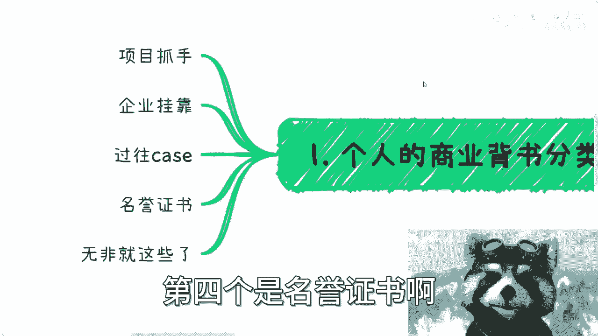

---

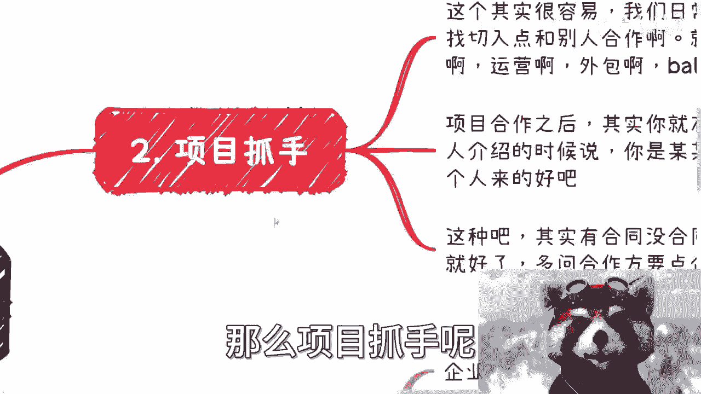

上一节我们介绍了课程的目标，本节中我们来看看个人商业背书的几种主要形式。

个人商业背书主要分为以下几种：项目抓手、企业挂靠、过往案例、名誉证书。

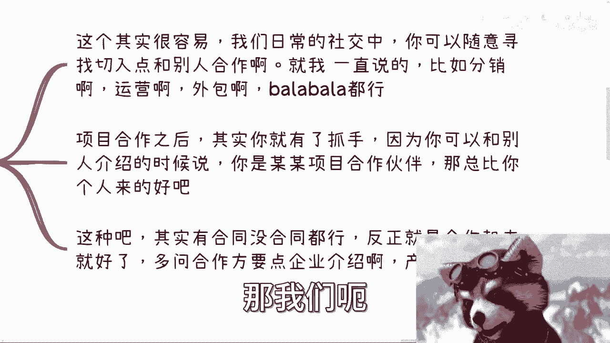

---

## 1. 项目抓手 🤝

项目抓手是指在日常社交和商业活动中，通过主动寻找合作切入点来建立联系。

以下是建立项目抓手的步骤：

*   **寻找合作切入点**：在各种活动中，主动与不同行业的人士（如电商、教育、游戏从业者）沟通。
*   **提出合作意向**：直接向对方表明合作意愿，例如提出可以帮助对方进行分销、运营、外包或其他任何形式的协作。
*   **明确合作身份**：合作开始后，你便获得了“项目合作方”的身份。在对外介绍时，可以说明自己是该项目的合作伙伴。
*   **注意合作边界**：必须明确自己的角色，不能越界宣称自己是项目创始人等。在合作初期信任未完全建立时，越界行为会带来风险。
*   **收集项目资料**：向合作方索要企业介绍、项目介绍等材料，以备后续使用。

这种合作无论是否有正式合同，关键在于启动并维持合作关系。

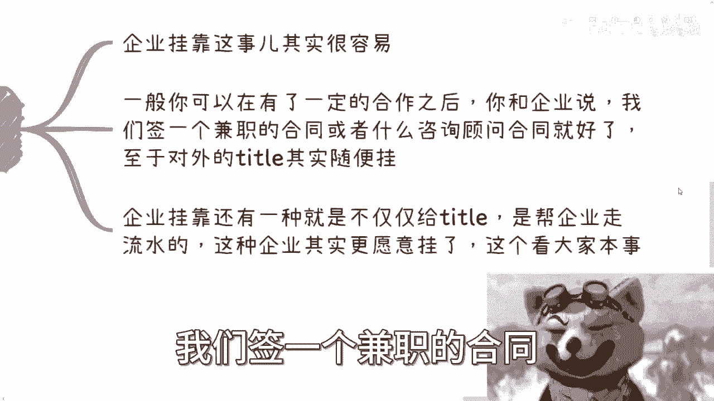

---

上一节我们介绍了通过项目合作建立抓手，本节中我们来看看如何通过企业挂靠获得更正式的身份。

## 2. 企业挂靠 🏢

企业挂靠是指与某个企业建立正式的、可对外展示的关联关系。

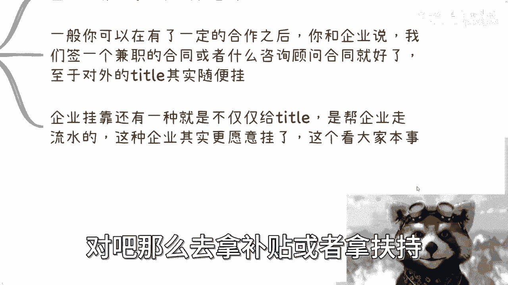

以下是实现企业挂靠的两种常见方式：

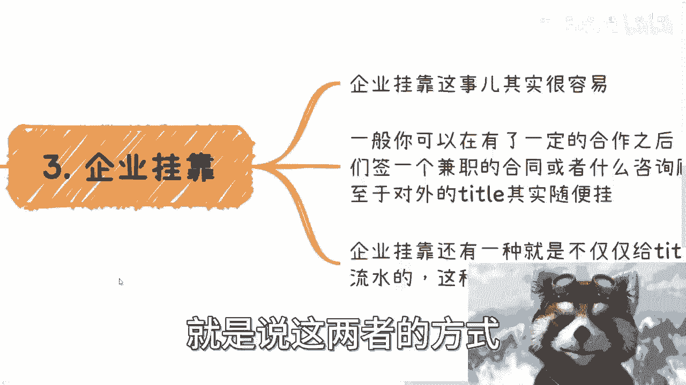

*   **签订顾问或兼职合同**：在与企业完成某个具体项目合作后，可以提议签订一份兼职合同或咨询顾问合同。这份合同本身代表了合作关系。
*   **协商对外身份**：合同的具体内容（如职位名称）可以与对方协商确定。双方达成共识后，可以用于制作名片或对外介绍。
*   **协助企业达成目标**：另一种更深度的挂靠方式是帮助企业完成特定目标，例如协助企业在产业园内完成流水、达到关键绩效指标以获取补贴或政策扶持。这种方式需要更强的资源和操作能力。

无论采用哪种方式，目的都是获得一个可对外展示的企业关联身份。

---

上一节我们讨论了企业挂靠，本节中我们来看看过往案例的重要性。

## 3. 过往案例 📁

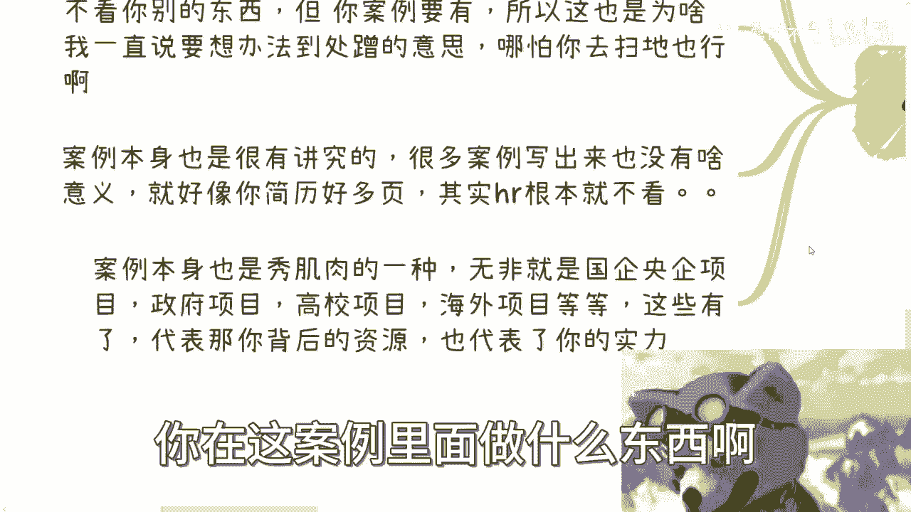

过往案例是证明个人能力和经验最直接的证据，对于建立信任至关重要。

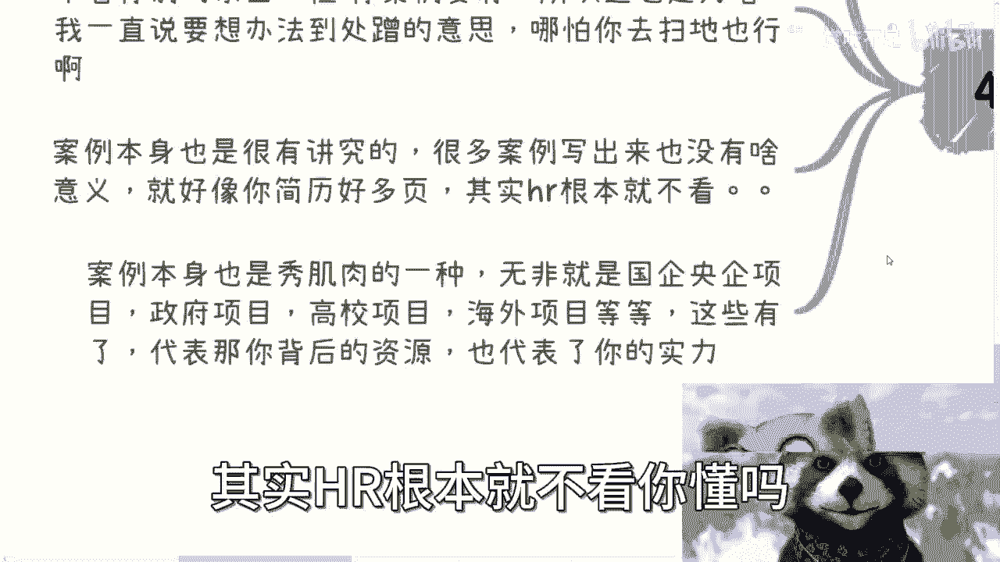

以下是关于积累和展示案例的要点：

*   **案例是信任的基石**：潜在合作方通常会首先考察你的过往案例，并通过询问案例细节来判断你的专业性和可靠性。
*   **积极积累各种案例**：应尽可能多地参与各种项目，无论项目大小。即使只负责其中一小部分工作，也可以将其作为自己的案例经验。
*   **案例描述要有技巧**：在描述案例时，应重点突出你在其中的角色和贡献，但无需事无巨细地披露所有细节。
*   **案例质量代表实力**：案例的类型和质量本身就能说明问题。例如，参与过国企、央企、政府、高校或海外项目，能显著体现你的能力、社会关系和资源层次。
*   **避免无效案例**：一堆质量不高的“野鸡”案例，就像冗长的简历一样，无法引起他人的兴趣。

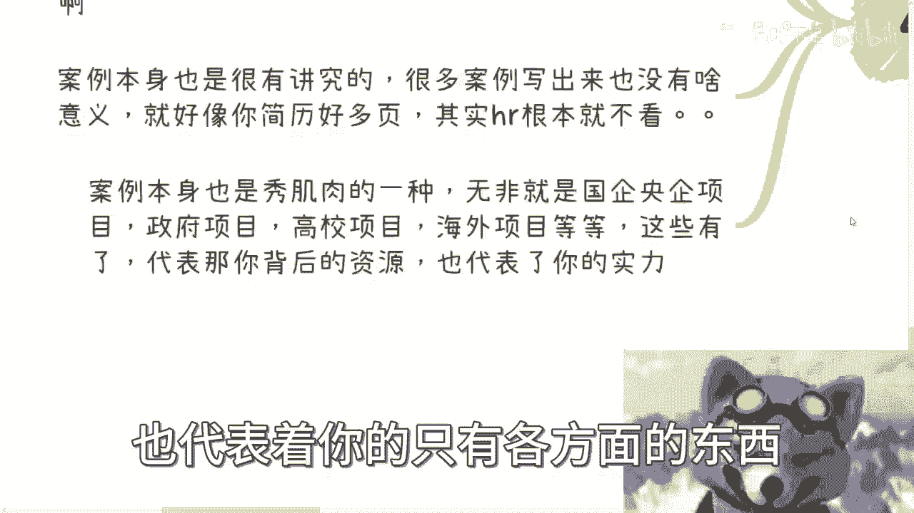

---

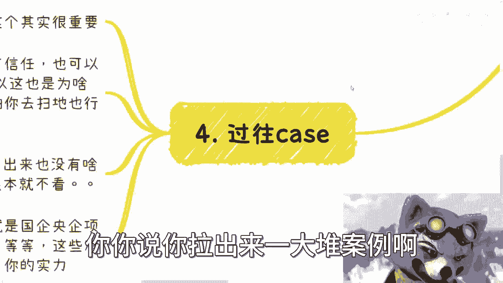

上一节我们强调了案例的价值，本节中我们来看看如何获取名誉证书。

## 4. 名誉证书 📜

名誉证书是一种官方的、书面的认可形式，能有效提升个人的专业形象。

以下是获取名誉证书的建议：

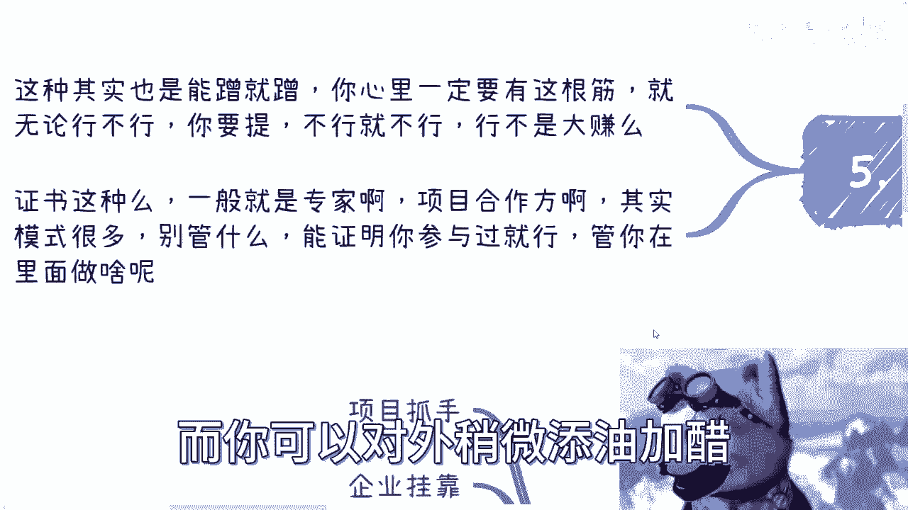

*   **主动争取，大胆提出**：在与协会、企业或项目合作良好时，可以直接询问对方能否颁发相关证书，例如“合作专家”、“项目顾问”或“合作伙伴”证书。
*   **证书内容可灵活协商**：不必过分纠结证书上的具体头衔，关键在于获得一份正式的书面证明。
*   **证书的扩展价值**：拥有证书后，可以在对外沟通中进行适当的阐述和延伸，从而为个人或业务带来更多机会。
*   **克服心理障碍**：不要被“普通人做不到”的想法限制。最坏的结果无非是被拒绝，这并无大碍。关键在于主动尝试。

---

## 总结 📝

本节课中我们一起学习了个人获取商业背书的四种核心方法：**项目抓手**、**企业挂靠**、**过往案例**和**名誉证书**。核心逻辑在于主动出击、积极合作、积累证明并大胆展示。商业背书的建立过程本质上是一个不断“蹭”经验、资源和认可的过程，关键在于迈出第一步并持续积累。记住，有效的背书能显著增强你在商业世界中的可信度和竞争力。