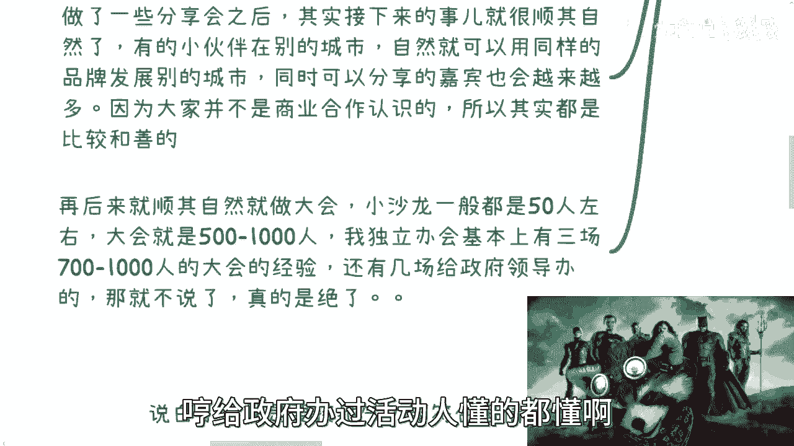

# 个人组织沙龙-活动的核心要点---P1---赏味不足---BV1NV411T7gc

在本节课中，我们将要学习个人如何从零开始组织沙龙或活动。课程将涵盖明确目标、规划流程、控制现场等核心环节，帮助你理清思路，避免常见陷阱。

---

## 概述：为何要自己组织活动？

我最初组织技术交流分享会，是因为找不到自己感兴趣的活动参加。既然等不到别人举办，不如自己动手。这个想法很简单：自己找免费场地，在网上发布活动信息。

另一个原因是，我相信线下见面是建立可信关系、促成合作的基础。在中国，很多生意合作必须基于线下见面。通过网络咨询可以建立联系，但要促成企业或政府级别的合作，线下接触是必不可少的。

组织活动后，很多事情会自然发生。例如，其他城市的朋友可能希望用你的品牌在当地举办类似活动。这能帮助你扩大影响力网络。同时，你也会积累越来越多的分享嘉宾和人脉。这些关系始于非商业的活动场合，因此通常更为友善。

后来，我顺其自然地举办了规模更大的会议。小型沙龙通常在50人左右，而大型会议可达500至1000人。我曾独立举办过三场700到1000人的会议，也为政府承办过活动。为政府办活动的复杂程度非常高。

上一节我们介绍了组织活动的初衷和自然发展过程，本节中我们来看看具体操作时需要思考的核心问题。

---

## 核心要点一：明确目标与人群 🎯

组织活动首先需要明确你的目标人群以及最终目的。

简单来说，目标无非三种：
1.  一直做慈善（用爱发电）。
2.  一直做商业（以盈利为目的）。
3.  先做慈善，再转向商业。

以下是关于这三种路径的详细分析：

*   **一直商业**：如果你从一开始就定位为商业活动，那么从活动标题到内容，都需要清晰传达你的商业属性。你需要让参与者明白，这是一个关于共赢、赚钱的活动，而不是来“割韭菜”的。例如，活动可以围绕“讨论商业模式”或“副业赚钱”展开，但要注意分寸，避免给人留下过于功利或传销的印象。关键在于坦诚：要么表明自己已财务自由，纯粹为交友；要么表明自己正在探索赚钱路径，希望聚集资源、头脑风暴。
*   **先慈善后商业**：这条路径是通过免费活动吸引流量，后续再变现。但这必须与你的终极目标挂钩。例如，如果你的目标是做企业或政府的生意，那么吸引普通散户的慈善活动就意义不大，你需要直接吸引相关领域的专业人士。如果你的目标是未来举办大型行业会议，那么前期的小型沙龙就是为了积累演讲嘉宾和分销渠道。你需要通过一系列主题沙龙来逐步构建所需资源。
*   **目标人群细分**：一场活动中，人员构成复杂。你需要明确谁是普通观众、谁是潜在客户、谁是未来合作伙伴，甚至谁可能成为“韭菜”或“镰刀”。在活动中，要通过交流为不同的人打上标签，然后有针对性地进行后续沟通，而不是漫无目的地社交。

明确了目标和人群，我们接下来看看如何让活动内容更接地气。

---

## 核心要点二：符合天时地利，切中需求 🌍

活动内容必须接地气，符合当前的环境和主要人群的真实需求。

2023年的当下，中国20岁到40岁人群普遍关注的是赚钱、买房、养老、就业压力等现实问题。因此，活动的主题应该切中这些痛点，要么直接提供帮助，要么间接创造机会。

以下是两种帮助方式：

*   **直接帮助**：明确告知参与者能获得的具体资源或机会。例如，我可以告诉咨询者，我手上有明确的、付费的数字经济相关项目需求。
*   **间接帮助**：创造一个交流环境，让参与者自行碰撞出机会。例如，举办线下见面会，让大家相互认识、交流想法。

许多组织者只考虑自己有什么、想分享什么，却不考虑参与者需要什么。这会导致事倍功半，最终难以积累有效资源。活动必须提供价值，无论是直接还是间接的。

当我们确定了接地气的主题后，就需要以恰当的方式呈现它，这就涉及到对活动商业属性的态度。

---

## 核心要点三：坦诚对待商业化 💼

一旦你组织沙龙或活动，这个行为本身就带有商业属性，不要回避这一点。

很多人试图解释或掩饰自己的商业目的，但往往越描越黑。不如直接坦诚地告诉别人：这就是一个商业化活动。一个不赚钱、又不图名利的纯亏本活动，反而会让人怀疑组织者的能力和意图。只有直接了当，才能吸引到真正对商业合作感兴趣的人。

你不需要让所有人都喜欢你，只需要留下认同你模式的人。同时，你需要展现出真实、自信的状态，目标明确。如果你的商业逻辑模糊，后续规划不清，会严重阻碍他人与你合作的意愿。包装的核心是让别人觉得你的“包装”是真实的、可信的。

在活动执行过程中，确保商业目标不偏离的关键在于有效的现场控制。

---

## 核心要点四：掌控活动流程与现场 🎤

活动的内容和流程需要提前规划，并做好现场控制。这是我之前遗漏的一个重要点。

控场主要包括三个方面：
1.  **准备备选内容**：你需要设定好活动主题，并准备一些备用的内容或话题。当现场无人分享或陷入冷场时，你可以用这些材料来救场，引导讨论。
2.  **把握讨论方向**：作为主办方，你需要拥有**ownership**（主人翁意识），控制讨论不偏离核心目标。现场参与者背景各异，有些人发言容易发散。如果话题偏离太远，你需要礼貌而坚定地将讨论拉回正轨。例如，可以说：“不好意思，我们时间有限，让我们回到关于如何‘搞钱’的主要议题上。”浪费一个人的时间等于浪费所有参与者的时间，这会影响活动体验。
3.  **提前准备问题**：围绕活动主题，提前准备一系列问题。例如，如果主题是“AIGC如何赚钱”，可以准备“大家使用GPT的感受如何？”“看到了哪些商业机会？”等问题。这能引导深度讨论，确保参与者有所收获。收获感可能来源于解决了具体问题，也可能来自于获得了新的启发。

控场时，人人平等。无论参与者的头衔多么显赫或年龄多大，你都应该只关注其发言的逻辑性和价值。如果对方逻辑混乱或故意捣乱，你有权制止。为自己而活，不需要为所谓的“权威”而委屈自己或降低活动质量。这种自信和掌控力是活动成功的关键。

---

## 总结 📝

本节课中我们一起学习了个人组织沙龙活动的核心要点。

我们首先探讨了**明确目标与人群**的重要性，区分了慈善、商业及过渡路径。接着，我们强调了活动内容必须**符合天时地利**，切中目标人群的真实需求。然后，我们讨论了应**坦诚对待商业化**，直接沟通目的以吸引同频伙伴。最后，我们深入讲解了如何通过准备备选内容、引导讨论和提前设问来有效**掌控活动流程与现场**。

记住，从参与者转变为组织者，最大的转变在于从被动接受变为主动驱动。理清这些要点，能帮助你有条不紊地迈出组织活动的第一步，并为其长期发展奠定基础。