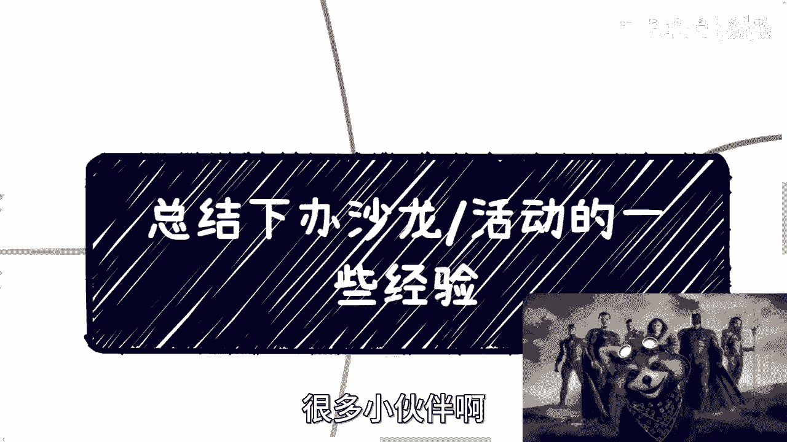
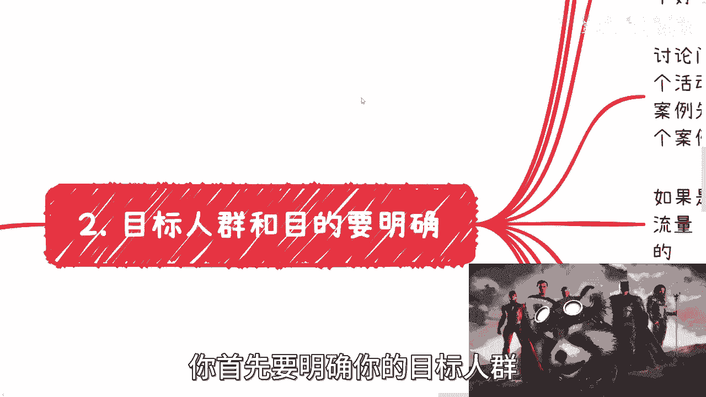
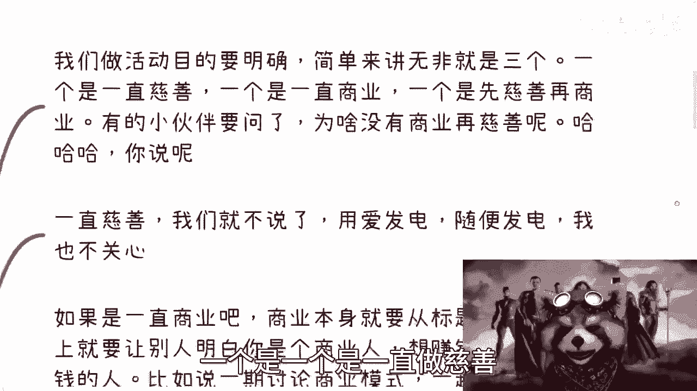
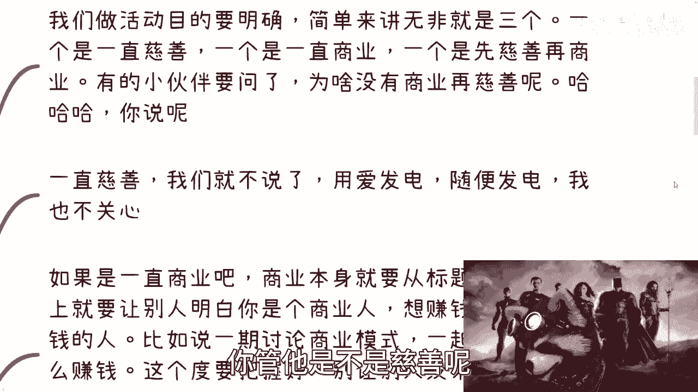
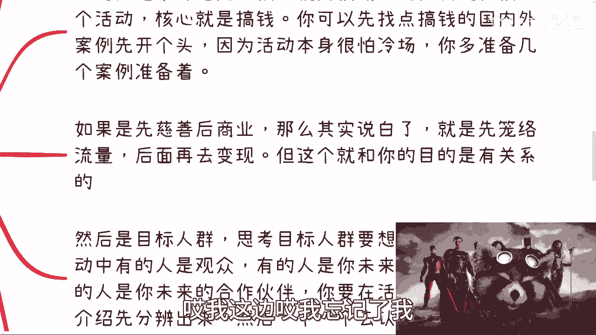
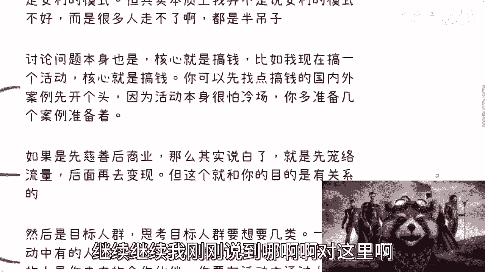
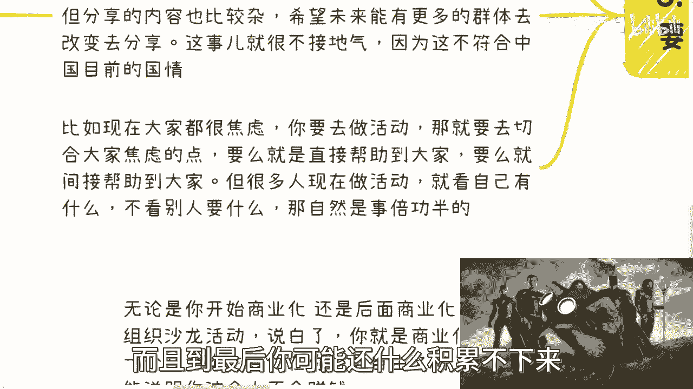
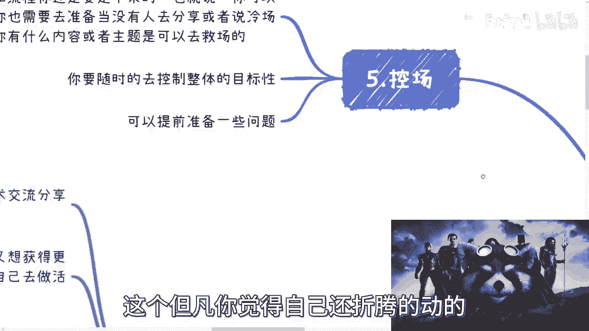

# 个人组织沙龙／活动的核心要点 - P1 - 赏味不足 - BV1NV411T7gc

好大家好啊对吧，我这个早上一边打游戏，一边听这个正义联盟的扎导版啊，扎导版扎导版这个原声啊，所以我就换了个背景是吧，很多小伙伴啊就最近也在做一些活动啊。

我给大家总结一下经验啊，然后跟大家说一下，整个过程当中想要去思考的问题啊，你们别去看你们办一个活动啊，就是啊这活动当中有非常多的东西要去思考啊。

非常多非常多，我打算把这个东西放到拒绝电池思维里面吧。

好吧，我觉得差不多啊，呃首先第一个先说一下我早年做的东西啊。

就是我最早的时候呢找过一个免费场地啊，做技术交流分享会，那个时候呢我的想法很简单，因为我自己也没什么可以分享的，但是呢我又觉得我很不接地气，那么我想获得更多的信息，找不到别的方式。

所以说呢我就只能自己去做活动啊，那么我也希望就是说啊，因为因为你就这么想嘛，我去参加别人活动对吧，比如说我这周六就想去参加，我就发现哎这周六没人举办，那我心里就很不开心对吧。

我就一直觉得阿姨好像好像有个什么事没做，对吧，就堵着就很不开心，我后来想了半天，我就想那与其一直等着别人做，我自己干嘛不能做呢对吧，那我我死皮赖脸的要个场地怎么了呢对吧。

然后我到网上发个活动信息怎么了呢，无所谓呀，是吧啊，然后我就开始自己做啊，然后这第二点，第三个呢就是说呃因为我自己也不懂嘛对吧，所以说形式上呢基本上都是这个大家过来了，就相互介绍一下啊。

因为嗯我不相信只有我对吧，有这种认识人的需求，其实大家都有啊，毕竟我觉得网络信息太杂，哪怕我当年的时候也太杂对吧，也不可信，所以说呢线下的认识其实是必然的，而且呢也可能是促成其他合作的，因为中国做生意。

我其实之前跟大家说过，就中国做生意呢，呃本质上是一定要见过面的，你不见面，你单纯通过网上对吧，就就就我跟你们讲啊，就很多的这个人对吧，看我这个小熊猫对吧，可以付费来找我咨询啊，然后现到今天为止。

咨询下来的人都很满意啊，大家的评价都很高啊，甚至有人跟我说啊，这个我这个价格后面加个零，他都愿意付是吧，我说算了，我承认我哥不来，是不是啊，但是你会发现就是咨询或者来说大家的沟通，这个事已经是天花板了。

你不可能通过小熊猫来跟我产生一个，b to b或者b to b to g的合作对吧，也就是说呃给企业或给政府的合作，那是不可能的啊，那么我也可以跟大家说对吧，到今天为止，B站这边认识的小伙伴里面呃。

有一些是我跟他已经签过合同，然后大家合作的，但是呢前提是什么，前提是哎我我们线下见过面了，我们线下吃过饭了对吧，线下聊过了对吧，这个是中国做生意的，基本你不可能通过一个网络的东西。

你就促成真正的合作是不可能的啊，那么做了一些分享会之后呢，其实接下来的事呢我跟你们讲啊，就很多是顺其自然的，为什么呢，因为你坐着坐着坐着，有的人就会跟你说，他说哎呀我不在上海，我在杭州对吧。

那没关系啊对吧，那你就可以让他用你的这个品牌在当地做对吧，你一开始可以去两期，后面就可以让他们自循环嘛对吧，你比如说有些人在杭州，你说上海杭州大家聊起来还好一点啊，那有些人跟你说啊，我在济南啊。

我在武汉啊，我在什么什么成都对吧，这个这个重庆对吧，那你怎么搞，你总不能说好，我来办啊，我每个月都来，那不可能的呀，对不对，那你相当于就是让那些觉得哎，你这个活动不错的这个小伙伴呢，就用你这个品牌对吧。

那这样的话对于他们来讲呢，他们也可以把你以前做的那些活动，作为一些案例去分享，那么你也可以拿他们那些新接触的小伙伴，去做线上的未来的这种呃，这个这个叫什么，就是分享也好，或者碰撞也好对吧。

就说有了合作之后，或者有了这种意向之后，你可以再飞到重庆，或者飞到成都，或者飞到武汉再去沟通嘛对吧，那你整个版图就变大了嘛，但是这个事情你会发现，你是一个就必然会面临的问题，因为你在一个地方。

你有地域局限，你总不能跟跟别人说啊，你们都不用来啊，你们我只在上海办对吧，你们你们外面的人都不行的那种，不可能的对吧，所以说呢就是说整个的一个流程啊，你一边做，你会发现总有这种需求的。

另外一方面呢就是说你可以有这个同学呢，分享嘉宾也会越来越多，因为你认识人越来越多嘛对吧，因为而且另外一方面呢，就是说这些人呢，我们并不是因为啊商业合作认识的，而是通过这种活动认识的。

那么大家其实相对还是比较和善的对啊，不是那种就是说啊这个这个你以后叫我来啊，你一定要付钱对吧，你不付钱，我不来的对吧，那那就说买那个这个这个这个卖一辆，他面子还是卖得动的啊。

那么再后来呢我就顺其自然做了大会啊，那么小沙龙呢一般是50人左右啊，大会呢一般就是啊500~1000人啊，我独立办会呢，基本上就是说把我想换小小熊猫放大一点啊，就我独立办会呢。

基本上是那个嗯700人到1000人呢有三场啊，两场是给自己办的啊，那么一场是给这个哦不对，三成都是给自己办的，然后另外呢还有两场是给政府领导办的，哎呦我跟你讲这种活动真的不是人做的哦。

我真的我觉得这只能这么说了啊，哼给政府办过活动，人懂得都懂啊。

这真的不是人干的活动啊，那么这个是我先说一下前提呃，前情提要啊，第二个呢就是我们快乐开始来说啊，这个东西没这么简单啊，你首先要明确你的目标人群以及你的目的。

对不对，好那么我这个地方写了老多老多了啊，我靠我真觉得牛逼啊，就是我们做活动对不对，你要明确什么意思呢，简单来讲无非就三个目标啊，一个是一个是一直做慈善对吧。

一个是一直做商业啊，一个是我先做慈善再做商业。

对不对，好，那这个时候有小伙伴有小伙伴要问了，他说那他妈的为什么没有先商业在慈善呢，那我就问你们先商业在慈善，你商先商业在慈善，你先商业再去开赛车，你先商业商业再去造造a s space x。

都跟我没关系对吧，你先商业再咋滴咋滴都可以，你管他是不是慈善呢。

是不是我把它列在这干啥，有大病还要嘛，对不对啊，这第一个第二个呢，你比如说啊一直慈善啊，我们就不说了啊，你用爱发电随便发啊，你发发发到你倾家荡产都跟我没关系是吧啊，那首先接下来呢就得来说的。

就是说如果啊我们一直商业啊，也就是说我一开始就商业，那么商业本身你就得从活动标题，活动内容上面，你要让别人明白你是个商人，什么意思呢，就是说你要让别人一眼就能明白你是想赚钱的，你是想你，你是会赚钱的。

你是希望大家一起来赚钱的对吧，就是说你会不会转，你到底能力怎么样，咱先不去说他，但至少你要让别人觉得你是一个，你今天办这个活动，目的是共赢的，不是什么啊，我们来了要来割我们的，对不对啊。

好那么这第一点第二点，你比如说一期讨呃，你比如说做一期讨论商业模式对吧，比如说一起讨论副业怎么赚钱对吧，但是你这个度要把握好，你别用力过猛对吧，让别人觉得没来，就感觉是个案例啊。

但其实本质上呢我跟你们这么讲，我并不是说安利的模式不好，而是很多人根本没有学不会呀，你知道吗，你要真的学得会，卧槽我他妈给你点赞了都已经，你知道吗，就大部分人学不会，你就是个半吊子对哦，该吸引人来吗。

吸引不来的对吧，那不该吸引人啊，这个该吸引人嘛，全部都拒绝，就已经被拒之门外了，那没有意义对吧，而且在这个地方我提一点啊，就是你比如说啊，你说哎我要讨论商业模式对吧，讨论副业对吧。

或者大家有什么副业过来交流，这个点没有问题啊，点没有问题，但是你要让大家明白，你做这件事情，跟你讨论这个点，大家能得到什么，你能得到什么对吧，就是这个当中是没有除了零和一以外的东西。

简单来讲就是说你要么就告诉大家，哎呀我已经财务自由了对吧，我就想跟大家聊聊，交交朋友啊，这个这个下下次比如说我办个活动对吧，这个大家来啊，我就随便扯淡啊，晚上这个请客吃饭对吧，人均1万啊，没问题的呀。

你搞好了对吧，但是你要么就告诉大家，你说唉我这个就是希望我能够赚到钱，我就希望大家能赚钱，那么我觉得我一个人这个资源能力都不够，那么我希望聚集大家的资源，大家可以说一下现在有什么好的资源。

大家开开脑洞对吧，头脑风暴那么一起啊，赚钱目的也可以的呀对吧，但是你不要千万不要去走那种中间模式，中间模式就是说哦，我现在可能不是就是我目的是想赚钱的对吧，但是呢我现在不是那么着急啊，我要先做铺垫对吧。

怎么样子，我跟你讲啊，就是这种状态啊，和这种话术，对于真正的商人来讲，你就是不会赚钱啊，你就是就是说整个商业头脑不是那么的清晰啊，那么这样的话你其实会失去非常多的合作伙伴，那么讨论问题本身也是的。

你比如说核心是搞钱，对不对，比如说我现在搞一个活动，核心就是搞钱啊，我可以先去找点搞钱的国内外的案例，当然啊你不能只找国外的啊，否则你不接地气的啊，你也不能只找国内的啊，否则你不够高大上，是不是啊。

你懂得懂得自然懂啊，滴滴滴滴对吧，因为活动本身很怕冷场，所以你得多准备几个案例啊，你别就是说啊这个做啊，做了之后呢，就是说这个就就没有案例啊，然后大家就说哎这个还有什么这个往下对吧。

就是说你流程得要定好啊，哎我这边哎呀，我忘记了我哎我傻了我傻了我傻了我傻了啊。

我傻啦，完蛋啦，这个作写写写着写着。

把一个最重要的东西忘记我，我先补在这，待会待会我再补啊。

叫控场，我们继续啊，那个继续继续，我刚刚说到哪儿啊，啊对这里啊。

然后你比如说呃如果先慈善后商业，那么说白了就是说你要先笼络流量嘛对吧，就是说你通过免费的东西来吸引到流量之后，你再去变现嘛，对不对，但是呢这个东西跟你的目的有关系，什么意思啊，哎我这边好像跳了一下啊。

我们先说下目的，再说上面的啊，首先比如举个例子啊，比如说唉我把这个东西算了，比如说啊我的目的是做政府跟企业的生意，对不对，好，那么我压根就不需要散户来啊，对不对，那散户来对我有什么用啊，啊没有用的呀。

除了捣乱对吧，那么我一开始做慈善就没有意义，为什么，因为我如果要去做政府跟企业的生意，我要的就是资源对吧，我要的就是能吸引到那些，他曾经做过政府跟鞋的人对吧，我希望跟他合作，那你说我一开始做慈善有意义。

本来没有意义点，你信来散户有用吗，没有用的呀，对不对，所以我必须一开始就商业化，就直接告诉大家，我是个生意人，我希望吸引到的是那些to b和to g的人啊，我不管你是一个单个体还是一个企业，我不关心我。

但是我就要这种人，没问题啊，对不对，你你的活动要跟你的最终目的挂钩对吧，第二个，如果我未来想办AI及最大会，打个比方AI及自然会，那么我需要的是什么，通过沙龙积累更多的嘉宾，以及给我分销的人对吧。

因为你想嘛你要办大会，你缺的是什么，你缺的就是我们就说啊，在你不花钱的情况下面，你缺的是什么，你缺的不就是嘉宾跟给你分销的卖票的人嘛，对不对，你说直白难听一点，就他妈给你卖票的人嘛，对不对。

那么你的小活动就是在你做前期铺垫的时候，你的主题比如说啊你办了17对吧，小沙龙啊，五期是嗯啊，五七是AI及自讨论对吧，五七是AIGC如何打开市场，就就讨论会，那么你前面的武器讨论会一定会吸引到能力。

来分享AIHC个人吧，对不对，你后面武器讨论会一定能分能能能吸引到，或者说能获取到能帮你去卖票的人吧，或者卖票的机构吧对吧，那你这17不够吧，我跟你讲17就我在我看来绰绰有余对吧。

其实就是你要先通过小积木去积累，达成你的目标，就我发现啊，真的我说到这点我要说一下，我真的发现了，就很多人做事情啊，就是一一方面是没有长远的，思那个那个那个那个眼光，但是你说就你从我角度来讲。

你办一些小活动和未来办个大会，这也不算什么长远的眼，长远的眼光啊，对不对，这第一个第二个是什么，我就发现很多人做事情了，他一根筋，你知道吗，就是就是你跟他谈游戏，谈动漫，谈二次元啊。

这个大家这个思路蛮活动的啊，蛮活跃的，你跟他讲这个东西吧，你就会发现他一根筋啊，不知道为什么，你知道吧，就是就是你明明啊明明做事情呢，你要就是要有一个逻辑性对吧，就像我一直说。

我说说我发现现在很多大学生对吧，大学读完之后，就是就他连最基础的逻辑性没有，你知道吧，这个就是让我自己神奇的一个事情啊，那么你比如说再举个例子，如我如果未来是想走收收割，C端路线路线的对吧。

那么你简单来讲，你就需要通过活动去打造自己的品牌，这个时候什么意思呢，你就需要海陆空多维度打造，什么意思，你知道吧，就是线上活动，线下活动，线上公开课，线上自媒体，线上跟别人去联动。

做直播会有他妈的你都你能做的全部做一遍，你知道吗，所有你能来的全部来一遍，这个叫什么叫海陆空多维度打造，而且是短期内就要干，你知道你不能温水煮青蛙，没有温水煮青蛙的啊，就是现在整个的这个这个这个叫什么。

全球的经济情况跟跟跟这个国内的发展情况，已经不允许许温水煮青蛙了对吧，就说白了说白了你质问是主青蛙，你以后就是青蛙对吧啊，你以后就被煮的那个情况是吧啊，然后呢就是目标人群，就是你要思考目标人群到底是谁。

你知道吗，因为一场活动当中，有的人是观众啊，有的人是你未来的目标客户，有的人是你未来的合作伙伴啊，那你要是这个商业化一点对吧，或者说叫做底线低一点，你怎么说呢，有的人是对吧，有的人是你未来的韭菜。

有的人是跟你合作的镰刀，这样懂了没有啊，我就发现有时候我这样说，人家听不懂，你知道吗，我也真的真的，我跟你讲啊，我已经对吧，就我再不能再接地气了，我再接地气，就他妈接到地府去了，我跟你们讲啊。

你要在活动中通过通过什么，通过大家的介绍，通过大家的做什么东西，你要先去分辨，你给大家就是头上先打好标签，你知道吧，然后你一个一个确认是在去沟通，然后你该请客吃饭，请客吃饭，该喝咖啡喝咖啡，你该残局。

残局就结束了，不是说你就漫无目的的做一个活动，你知道吗，就哎哼就真的就是嗯先先这么着吧，哈哈对吧，然后呢第三点是什么呢，就是活动啊，你要符合天时地利啊，也就是说你要接地气，你接地府也可以啊啊没关系啊。

说白了啊，就是说你要符合国情，符合当地的国情，我不管你在国内做，国内国外做，对不对啊，你举个例子，比如说2023年当下这个情况对吧，在没有明确的目标用户的情况下，在没有明确的宣传群体的情况下面对吧。

你组织了一个很高大上的嘉宾啊，来做分享，但分享内容呢比较杂对吧，同时呢你希望未来能有更多的群体去改变啊，去做分享，没毛病啊，我觉得这整个东西没毛病，一点毛病都没有，但有一个问题，这个事儿不接地气。

因为这个人不符合中国目前的国情啊，为什么，因为很简单啊对吧，你去看看中国20岁到40岁的人啊，大家关注是什么，关注是啊，我要我要赚钱啊，我要买房啊，我要我要这个养老，对啊，我上有老，下有小。

哎呀我工作找不到了，哎呀我加班加的，我连我我我平时连家都回不了了，这是国情，对不了啊，大家是想去改变吗，大家是大家是想真的去改变，去分享吗，不是呀，当然你说这类人有没有有，但这类人是哪类人，高净值人群。

精英人群对吧，因为没有办法，你你你不能强迫中国的这个基本盘对吧，从呃叫什么发展中一下子变成发达国家，那不可能的呀，对不对，我跟你讲，但凡你要非要套这种套子对吧，去做的，那么我只能想着。

我只能相信这是套的这个模式的皮，要去收割，就这么简单没了，对不对，那你再比如啊，比如说你现在大家都很焦虑对吧，你要制作活动，那就要去切合大家交流解嘛，对不对，你要么就直接帮助到大家。

要么就间接帮助到大家，什么叫直接帮助到大家，就比如说啊我明确跟你们讲，我所有咨询我的人，我都会告诉告诉他们，只要你们能做这个数字经济相关的分享，我这边手上都有单子啊，明码标价啊。

这么单子根本就没人没人做，他妈根本就做不过来，对不对啊，那这我这种叫做直接帮助到大家，什么叫间接帮助到大家，比如说我7月底啊在上海办公活动，大家来来了之后对吧，大家相互认识一下。

那说不定能碰撞出什么火花，对不对，那这叫间接的帮助到大家对吧，但很多人现在做活动，你就看自己有什么啊，你就就他们盯着自己有什么，你不看别人要什么，那自然是事半弓背，啊不事倍功半，对不对。

就是说你可能不是一倍的问题，你可能是几倍的问题对吧，而且到最后你可能还起什么积累不下来啊。

那么第四个就是商业这件事情啊，你别绕圈子。

什么意思啊，就是无论你是开始商业化还是后面商业化，一旦你组织沙龙活动，这个行为就是商业化的，你不要去回避这件事情，你知道吧，而且我跟你们讲，我发现很多人是这样子的，他也不是回避，但是他想跟别人解释。

我跟你讲没什么好解释的，你知道吗，就是因为很多人他的表达，每个人表达能力不一样嘛对吧，每个人说话方式也不一样，他自己有很多人，他越解释越解释不清楚，你知道吗，你知道吗，那你还不如就直接告诉大家。

我就是商业化的，怎么了呢，哦你告诉我你今天做过活动啊，你告诉我你不是商业化，你又不财务自由，那你不就是纯亏本生意吗，那你纯亏本生意，那就说明你不是一个会赚钱的人，那你不是一个会赚钱的人，谁来跟你合作吗。

对不对，哎我跟你讲，其实很多事情就是这样子的，你知道吗，就就别绕了，别千万别绕啊，千万别绕，所以说呢你不要去吝啬啊，去承认自己商业化，你不要去绕圈子，因为只有你直接了，你才能让别人知道你想干嘛。

才能吸引到更多商业化的小伙伴，我跟你讲啊，你说到这个点又有人说了，他说啊吕老师这样不行的，那那那有人要杠你的对吧，那你太直接了，人家人家不喜欢你了啊，哥哥们对吧，姐姐们，姥姥们是吧，不喜欢怎么了呢。

你只要留下喜欢你的人不就好了吗，哦你还指望中国所有的人都喜欢你吗，我靠这这这我们不是活在，我们不是活在这个叫什么理想理想世界，我们不是活在活在一个一个桃花源里啊，对吧。

然后呢就是说我们要展露出一个真实的状态，别让别人感觉到自己不自信或者太浮夸啊，或者自己不目的，目标并不明确，因为你做一个活动，你一定要想好后面干嘛嘛，因为你的目标不明确，你的商业不明确。

你就是阻碍别人跟你合作的意愿啊，就是我今天就算愿意跟你合作，我发现你脑子里一团浆糊对吧，你就你就只想好了当下怎么做，你没想好后面怎么做，那么谁来跟你核算，对吧，怎么怎么怎么怎么steam就跳出来了啊。

steam能不能再那个一点，那个你比如说有的小伙伴啊，所以说我就跟你说，就说受众跟你的目标，其实每一步都是有关联性的对吧，那有的小伙伴要说了，他说吕老师，你不是要包装吗对吧，怎么又要真实了对吧。

那我又要说了，哥哥们，姐姐们，姥姥们对吧，这个老爷们是吧啊，你要包装什么意思，就是你要让别人感觉到你包装是真实的呀，这他妈才叫包装啊对吧，否则你叫什么包装啊，你包装让别人觉得嗯好，你这个人很不真实对吧。

很浮夸，很不自信，那你还包装啥是吧，那你还不如裸奔还裸奔，还不如让别人还裸奔，说不定别人还觉得你真是一点，你说实话就唉，啊那么这就我刚刚说的这个第五个，第五个就是控场，我刚刚漏掉了这个东西，是这样子的。

就是说活动啊这个内容啊和流程哦，你还是要定下来，啊定下来的，那么也就是说什么意思啊，也就是说啊你可以定主题啊，就是比如说啊这个主题一主题要主题三，你也需要去准备啊，就是当没有人去分享。

或者来说这个人场的时候啊，你有比如说什么内容的内容，或者主题主题是可以就是去救场的对吧，然后这个是一方面啊，然后控场还有一方面是什么呢，就是你要随时的去控制整体的的目标性啊。

因为来的人是那个就是各种各样的对吧，那有的人他是能够控制自己的，有的人呢他就是讲了，就是啊一下子就就就发散了，你知道吧，就想讲讲半天啊啊讲讲啊，但是呢就是你因为你作为这个主办方啊，你不能去另有呃。

就是就是由着这样子，所以说呢就是说你需要就说自己想着，比如说我就是啊这个10分钟啊，如果来说你10分钟之内啊，这个观点描述完了，然后呢你已经在这边发散了，那么你就你就需要发挥。

你因为你还是一个主人公啊对吧，你还是一个这个主持人啊，你还是这个主人啊对吧，你要有这个ownership对吧，也就是说你需要去告诉他，哎这个不好意思啊，那个呃我们收回来收回来啊。

我们这个现在要要这个叫什么，就是关注啊，就是主要是搞钱对吧，主要大家还是控制往这方面说对吧，你不要让它发散，因为你一旦发散了，你不是浪费你一个人的时间，如果你现场来了50个人，你等于同时在浪费。

剩剩下四十四十九个人的时间，你知道吧，这个事情对大家是很伤的啊，也许很多人碍于面子，或者碍于就是说这种公开场合，他可能社恐啊，或者别的方面，但他不跟你讲，但并不代表他不在意，你知道吗，你要去。

就还是那句话，如果你是个合格的商人，你一定是一个什么呢，就是会很珍惜时间，你要让别人觉得你是很珍惜时间，你是很利用时间的一个人，你要让别人觉得你不珍惜那一样的，别人也不会合作啊，那么这是第二个。

第三个呢就是说你可以啊，就是那这么说，就是说啊可以提供啊，可以或者说提前准备一些问题啊，也就是说你的主题，比如说你说我们可以搞钱啊，我们可以这个来谈谈AITC怎么做对吧，怎么样子。

那你可以提前准备一些问题，你比如说哎我们以前GGP啊，GP里面啊，这个大家觉得有什么好处对吧，大家觉得有没有用过对吧，那用下来呢这个有什么感受对吧等等等，你可以在更多的方面准备很多问题。

因为其实一个活动要让别人感觉要有收获，这个收获是这样的，这个收获一般分成两部分啊，第一种是他自己来的目的啊，他说我有明确目的性的，那么他如果得到了解决，那他就是收获，还有一种是什么呢。

就是说我虽然是有明确目的性，我虽然这个问题也没得到解决诶，但是我觉得这个活动里面讲的内容诶，我也有点启发对吧，对我自己有点帮助，那也是有收获的对吧，但是不管怎么样，这些东西是需要你这个主办人啊。

主办方啊，你需要去准备的，因为还是那句话嘛，就是做活动也好，这个思维上面也好，你最大的转变是什么，你要从一个参与方，你要从一个就是说别人告诉你，怎么做的一个状态，转化成自己驱动自我驱动。

自己告诉自己我应该怎么做这么一件东西啊，所以说就是整个控场是非常重要的，我跟你们讲啊，就这个事情呢，还是那句话，就是每个人都是平等的，你别管来的人是谁啊，你别管他title多么高大上。

你也别管他年纪多大，你就像我以前是一样的，就是我根本就不关心对方是谁啊，我只关心你讲出来的东西有没有逻辑性，你讲出来的东西是不是呃那个有有说服力，或者说你看问题是不是有辩证的态度，别的我不关心的啊。

你跟我说你是什么教授，你是什么东西，我又不管你的，如果你但凡是但凡是逻辑不清晰的，或者说是捣乱的，给我滚对了，你要是付钱的，没关系，我钱退给你无所谓的呀，那地球缺了，你又不是不赚钱，是不是啊。

我跟你们讲真的，我是觉得不管你现在多少岁啊，这个但凡你觉得自己还折腾得动的。

你就需要有这种态度，为什么，因为我们活在世界上不就这样子吗，我们为自己而活，又不是为别人而活，为什么要要委屈自己呢，而且难道就因为对方是个教授，对方态度比我牛逼啊，对方活比我多活几年啊。

我就得我就得他妈的跪舔他，或者我就得这个矮人一等，凭什么谁告诉你的莫名其妙，对不对，没有道理的呀，我跟你讲很多的东西不是这个世界怎么规定的，是我们自己给自己的这个定就自己的心魔，其实是给自己这种想法。

所以我们要突破它，这就是最大的问题，你知道吗，哦我讲了多久啊，差不多啊哎呀。

但其实我感觉我还没讲完，唉讲的不尽兴是吧啊。

这没有没有爽感好吧，那就这么着吧啊，那个你们反正就是在这个副业啊，或者职业规划，或者说这个这个选择方向上面好吧，有任何问题的，因为现在我感觉找我咨询的人好多都是那个，其实已经不是当下的问题了。

就是可能大家都是找我讨论，就是5年十年不说啊，就三到5年的这个规划，我觉得这蛮好的好吧。

