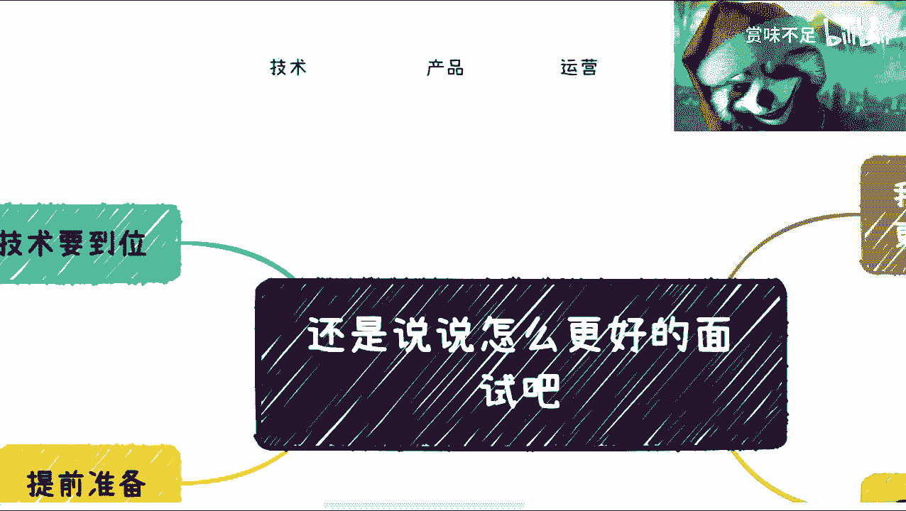

# 为了更好的卷，还是说下面试技巧吧（面试官勿入） - P1 - 赏味不足 - BV1D54y1K71z

好啊，因为我这个下午要到医院去，我前两天脚扭了哎呀，希望没啥事，所以我就就还是提前录一下吧，我觉得还是言归正传啊，因为我觉得大家可能过于焦虑啊，带偏了带偏了，言归正传啊，就我觉得这个我们还是要想好。

在主页上怎么更好的去卷对吧，那既然怎么更好去卷呢，我觉得面试这个东西呢，我觉得我主主要核心来讲一下，因为我看了一下吧，就目前基本上就是说技术对产品运营测试啊，然后还有就是说本科对吧，读研的对吧。

或者anyway，其他的啊，这不重要啊，呃重要的是什么呢，重要的是我前两天跟我朋友哎呀，我基本我我会跟我一个朋友在特特斯拉做的啊，然后我就跟他就时不时的会晚上开脑洞，就大家聊啊，我当时就会跟他讲。

我说是这样子的，就是呃首先呢我在这个地方提一句，我说我们面临的情况是什么呢，就是没有最卷，只有更卷啊，毫无疑问啊，未来一定是这样子的对吧，然后呢他那就是因为我也跟他说嘛。

我说哎呀我最近这个收入不稳定对吧，我说我这个哎呀转不动了，然后他就跟我说，他说那你找份工作对吧，你你找个工作全职做嘛，我说大哥我不是不找，我说你要这么想，我已经明白了未来的情况，你让我去找工作。

其实有什么区别区别，就是说我现在判我死刑，还是过3年判我死刑对吧，我说我说你让我找工作，我但凡工作了3年出来，卧槽我干嘛去啊，我我对吧，就是行业积累嘛，我也没有人脉吗，我也没有。

我靠我说你这个不是要让我判死刑吗是吧，那我说这种心态，你让我去上班肯定是上不了的对吧，然后呢咳咳我觉得我那天也跟他说，我说我说你到时候出来也是一样的对吧，我说其实本质上面试这件事情呢。

你看啊随着这个这个行业越来越浮躁对吧，人也越来越浮躁啊，我也不得不说啊，就是b站上的小伙伴真的是不错的，你们去微博上看看，简直就是一群基因，你知道吗，火鸡对吧，然后呢就是说呃我觉得有一个观点呢。

大家一定要认清楚的，就是说啊面试的时间里面，他们是不可能对你有认知的啊，因为现在就是说大家都很紧，而且大家都很浮躁，你不像我们以前面试吧，还可能有个什么一两个小时啊对吧，大家哎聊下来谈，坐下来谈谈啊。

谈谈人生，谈谈理想，现在我觉得不太会啊，就就很复杂啊，很粗糙，然后呢就是我觉得嗯你们跟我的沟通，你们想想看啊，就是你们跟我沟通，私信上面也好，评论上面也好，我还要来问一下你们的，就是说背景啊对吧。

基本情况怎么样，那一来一去其实20几分钟，20分钟也就没有了对吧，那你面试的时候我说不好听点，这半个小半个小时他能对你有什么认知对吧，而且我觉得这个大部分人，其实面试面的都是那种什么什么好，好几十人。

几百号人的，他根本就记不清楚，所以说呢我觉得最终还是会演变成，比谁薪资更低，比谁更年轻，更比谁更会加班，对这个就是我说的卷啊，但是呢我得跟大家讲的是什么呢，就是我觉得我们可以从不同的维度去卷。

就是什么呢，我们没必要跟他们去比比这些嘛对吧，比这些干嘛呢对吧，我们又不是就我们要比他们高级一点的火机，是吧啊，那我觉得是这样子的，怎么从不同的维度去卷呢，就是第一我觉得是这样子的。

就是你从不同的人面试的时候，比如说他是你的mental，你的manager对吧，那你可以说哎我从这个行业角度跟你去去分析，当然我的意思就是说，你们前提得要有一定认知嘛，但是其实我觉得这些认知也不是很难。

因为很多啊，就是你们比如说这个b站上找找啊对吧，就是什么什么公开课啊对吧，慕课啊对吧，然后什么海外youtube上面啊，呃然后线下活动啊，其实是这样子的，就是呃就很多时候我觉得是大家懒啊。

就是你们逼一下自己啊，就是这个多了解了解对吧，参与参与对吧，多多扯扯淡对吧，再再不济对吧，你付个呃，不要喷我啊，你付个几百块钱对吧，跟我扯扯淡也可以啊，那我觉得是这样子的，第一呢得要对行业有了解对吧。

这是第一点，第二点呢你也可以从公司角度，那当然了，也有很多人说了，他说哎我这刚去面试，对公司不了解，你你有办法了解的，你不是不能了解啊对吧，这个这个啊我来写一下啊，你看病对吧，知乎对吧，企查查对吧。

你在这么一个2023年，马上就要步入数字经济的时代，你这个对吧，你再不济你花点钱找个背调公司也可以啊，是不是啊，你你可以从公司角度诶，大家觉得你很牛逼是吧，第三个呢你可以从这种上下游。

咳咳当然这个针对你不同公司不同业务啊，你比如说有些就特别这个叫什么，就是就是呃考验这种上下游链条带啊，上下游合作的上下游，这种关系的对吧，很多很多唉其实都可以考虑，你知道吗，你你可以跟他扯对吧。

第四呢就是说你也可以从公司的这种管理角度，那当然了，你是不是面一个管理岗，我觉得并不重要，因为就是你可以阐述你的观点对吧，这就好像比如说你们在跟我沟通对吧，你评论的时候你对不对，不重要啊。

你可以阐述一个观点，当然啊，这个前提就是说，你阐述观点得要有一定的逻辑性啊，你不能上来就说好，你是垃圾对吧，我就喷一下，那不行是吧，那最后呢我觉得你可以从老板角度去考虑，当然你说你没有创过业对吧。

那也不重要啊，但是你可以尝试着对吧去考虑，那我觉得很简单，就是你对于不同的人呢，你就是啊这个见人说人话，见鬼说鬼话对吧，你很简单嘛，就是就是我觉得这个这两天啊沟通下来，我觉得大家这个怎么说呢。

就是比未来的更多的年轻人好优势在哪里呢，就是大家有一定的工作经验，对吧啊大家呢也这个呃这个怎么说呢，对行业有一定的了解对吧，那没关系啊对吧，面试之前卷一下嘛对吧，那我们不跟他去卷这卷这些嘛对吧。

我们好好卷这些，那准备准备我觉得大家还是可以卷的啊，可以卷的，那我觉得这是一个呃，然后呢，另外一方面呢，就是说这个对于自己的一些东西呢，也得提前准备，你比如说简历对吧，那简历呃好好修改修改对吧。

你我说实话你好好修改修改，你找我也好，找别人也好，多多给点意见对吧，别不然不认就不当回事对吧，就说嘛说很卷啊呀，找不到工作，但是这个细节工作准备工作不做好对吧，那你比如说github对吧。

有没有什么项目啊对吧，你做做对吧，那个设计对吧，比如说designer ui ux对吧，这个产品运营你以前有做过什么作品啊，你以前做过什么产品设计啊对吧，你以前做过什么公众号啊，或者运营过什么小红书啊。

你都得有东西啊对吧，然后过往经历，那我觉得这些东西呢都得提前准备好对吧，你你就我还是那句话对吧，就是我发现卷啊，大家都说卷呢对吧，然后这个难嘛，大家也都说难的，但是准备嘛不准备的对吧。

那我我也无解了是吧啊，然后呢这个还有一点呢就是关于这个印记数啊，那么硬技术呢我觉得是这样子的，就是说不管你们做开发啊，还是说设计，还是说测试还是做运营，这不重要啊，重要的是什么呢。

第一点你得形成自己的一套体系认知啊，当然啊我还是那句话，对或不对不重要，只要不要错得太离谱啊，这就好像这就好像比如说今天你来面试前端，那么我作为一个面试官啊，我来问你，我说哎你对于前端怎么看法对吧。

你对于这个学习前端怎么看法对吧，你说好啊，我大概觉得啊，这个现在u v u e用的比较多对吧，然后前端已死对吧，这个这个现在都是全站对吧，前后端都是负责，都是一起负责的对吧，大家这个技术站都开通了对吧。

技能点乱点对吧，也行啊也行，但是你总不能跟我说这个这个这个说什么，说哎呀，前端有很很很那个庞大的前景，然后现在呃现在这个叫什么，就是很很多都很不成熟对吧，怎么样怎么样怎么样，那人家一听就你在扯淡是吧。

那同样的就是你比如说啊运营也是一样的对吧，你跟别人说，哎我有运营的自己的三板斧对吧啊方法论对吧，123你得有对，就是我还是那句话啊，说直白一点对不对，不重要，你听上去。

你要你的目标是在半个小时之内唬住对方是吧，那我我我是不是太直白一点，希望面试官不要看到这个视频啊，然后第二个是什么呢，就是就是那个叫什么，就是无论你做什么对吧，我觉得对于自己的优缺点很重要，认识清楚。

就是当然啊，我还是那句话，你不能只认识清楚，你得说你怎么改进啊，就是你说你技术啊，你说你技术，你打个比方，你说啊我这个觉得我技术啊，这个这个可能一般般啊，然后呢可能在某些方面比较擅长啊。

某些方面不擅长对吧，那当然啊你也不能这个上来就打肿脸充胖子，说我老子都是有点没有缺点，那不行的对吧，那这个就是就是那种打肿脸充胖子，毛遂自荐的时代过去了啊，这个现在不吃这一套，哈哈啊。

你你还是要客观点客观的啊，然后那个优缺点对吧，那你怎么就是你得告诉对方，我怎么这个能够发挥我的长处，我怎么避开我的短板对吧，或者我怎么让我的团队的人，或者这家公司来比捕捉的短板对吧。

那这个可能是你要想清楚的，第三个呢就对行业的优缺点你得想清楚对吧，就好像最近其实我看了一下评论区跟私信，问我那个那个叫什么了，那个电商比较多对吧，那电商我就可以明确告诉你们电商现在是什么。

那所有诗的物品，什么数字资产啊，数字物品啊都不要去管对吧，电商现在做要做的是什么，有几块你可以去考虑的对吧，一块是什么数字人直播对吧，那当然数字人直播你得下沉啊对吧，你不能在一线城市。

一线城市没人吃这一套的对吧，那这是第一个，第二个，你衣食住行，衣食住行你可以卖，但是也很卷，那你的竞争力在哪里对吧，那你的这个优势在什么地方，你是供应链有优势呢，还是价格有优势呢。

还是说你的这个本来就有受众呢，对吧等等，那你得想清楚，那第三点，我觉得现在现在当下最火的，而且我觉得未来也是有很大发展的，是什么跨境对，那跨境你能不能做呢，那跨境现在缺的是什么呢对吧。

那跨境现在就是说这个优缺点又是什么呢对吧，那我觉得你你也得了解，当然了，就是说你只要就还是回到第一句话，你所有的东西你得形成自己的一套体系，首先第一步你得自己说服自己啊，当然不是那种洗脑式的对吧。

你得有逻辑性的啊，那么这样子的话呢，你能够在面试的时候哎吃讲出来对吧，那么最后呢就这个岗位本身痛点你得认清楚，就是技术到底有什么短板，因为就像我说的，你做只要做开发，我根本就不care。

我根本就不care你做什么开发，因为在我看来，开发就是螺丝钉要赚钱，也不是你赚你老板赚对吧，那那你你你你你认清楚吗，不就好了吗，是不是，那产品运营也是一样的，有没有什么短板对吧。

包括一些痛点你要认清楚对吧，当然了，这个你跟面试官讲的时候，你不能这么讲啊对吧，但是我意思说你们自己都要认清楚对吧啊，那么嗯那我觉得其实你看啊这1234，你这四块能能做好，那我觉得问题不大对吧。

咱别的不说啊，就是面试这个东西也是有技巧的，对不对，你你说你这个修炼内功没问题，但是很多时候一个萝卜一个坑，重要的是先把这个坑填上啊，这填上之后再说对吧，他说哎你看啊这个国企对吧，跟那个比怎么样子。

我私信的时候我就会跟他讲，我说我说国企这种东西是这样子的，你先别管现在做什么，你觉得现在这个岗位不好，没事，你先进去进去之后再调岗对吧，你先先一个萝卜先进去，回头再说嘛对吧，你先搭上这个船。

至于这个船以后怎么开，你怎么在里面，当然什么角色，这个以后哎对吧，就是就是就是变化很快的啊，我这边这个送大家一个一个结论啊，就是我这2年一直说的就是俗话说的好啊，30年河东，30年河西对吧。

但是呢当下的互联网发展跟整个的社会发展啊，很有可能3年河东3年河西或者三个月，河东三个月河西啊，三天河东三天河西也行对吧，就是说就是我们想的多可以，但是呢你们想的多呢，尽可能的要去整理自己的东西。

就我已经帮你们整理好了对吧对吧，这些整理自己的东西想的多，不是每天在那边焦虑好吧，就说啊我以后卷卷不动了怎么办，我以后找不到工作怎么办对吧，我以后这个副业怎么做怎么办对吧，我跟你们讲没用的啊。

你你们你想的都不能往这方面想好吧，哎呀行啊，那就这么着吧好吧，我觉得因为我这两天看了大家这个，这个这个趋势不太对啊，就就就就有点偏啊，我就想着还是把大家拉回来一下好吧，那就先这么着吧。

啊有什么大家反正私信我吧，我要去医院，哈哈哎呀。

好难呐。