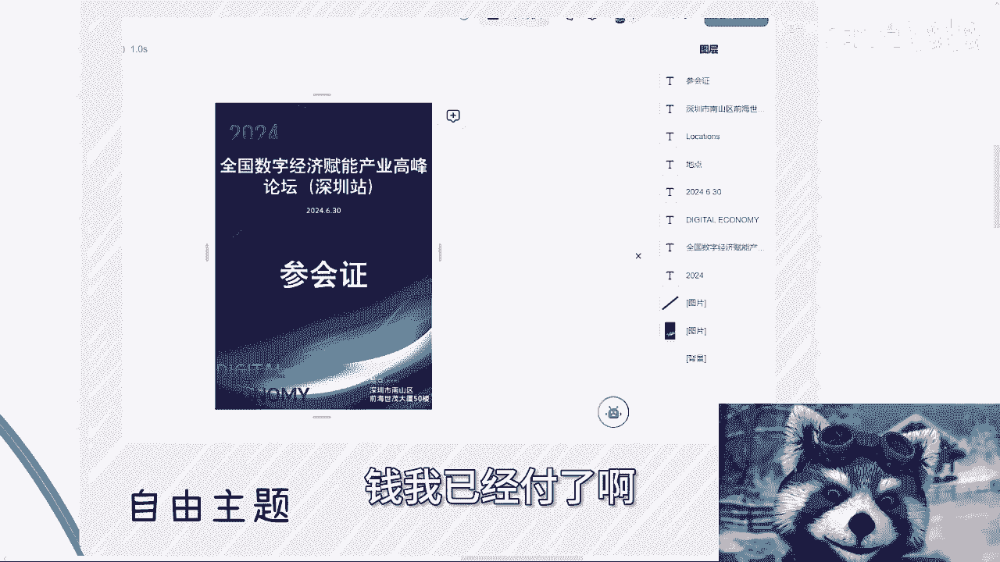
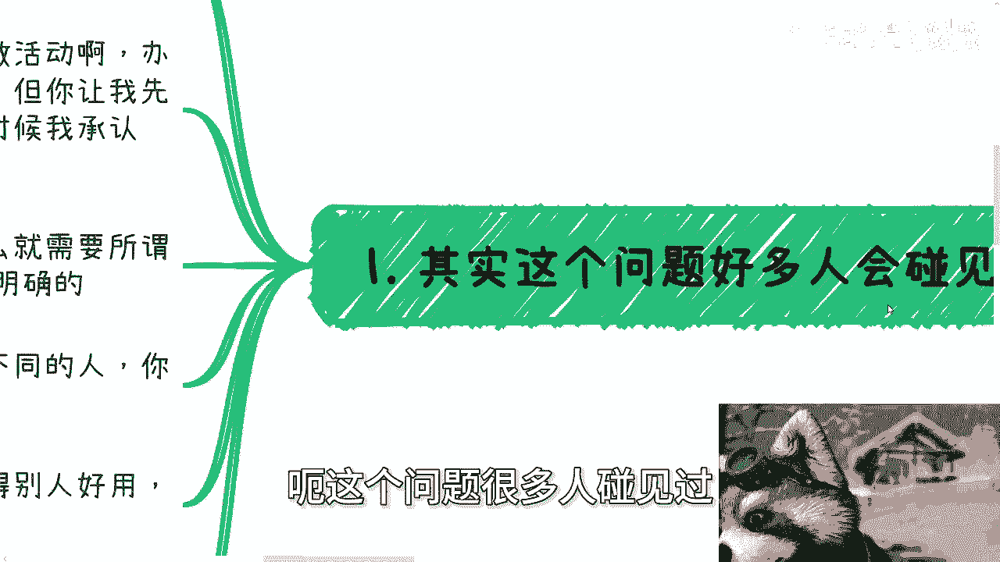
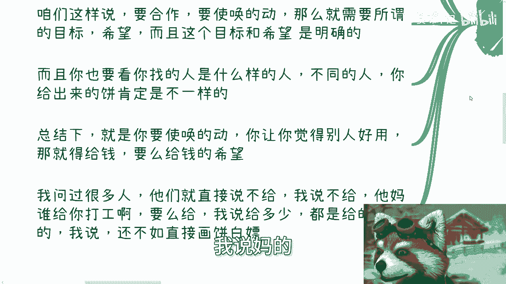
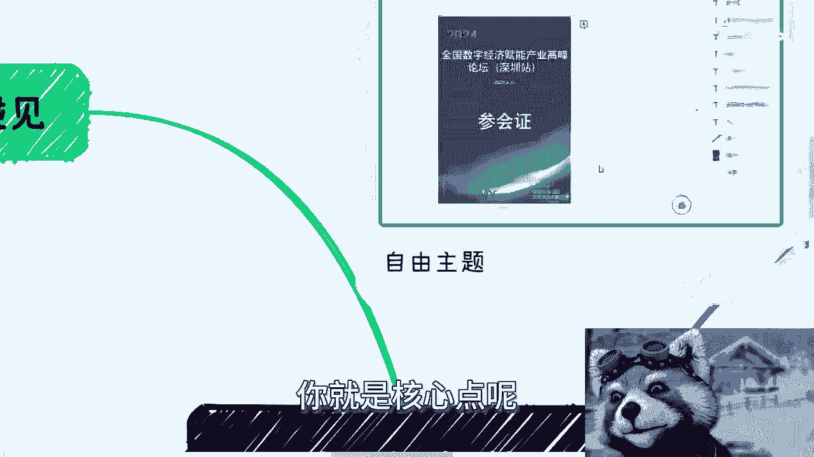
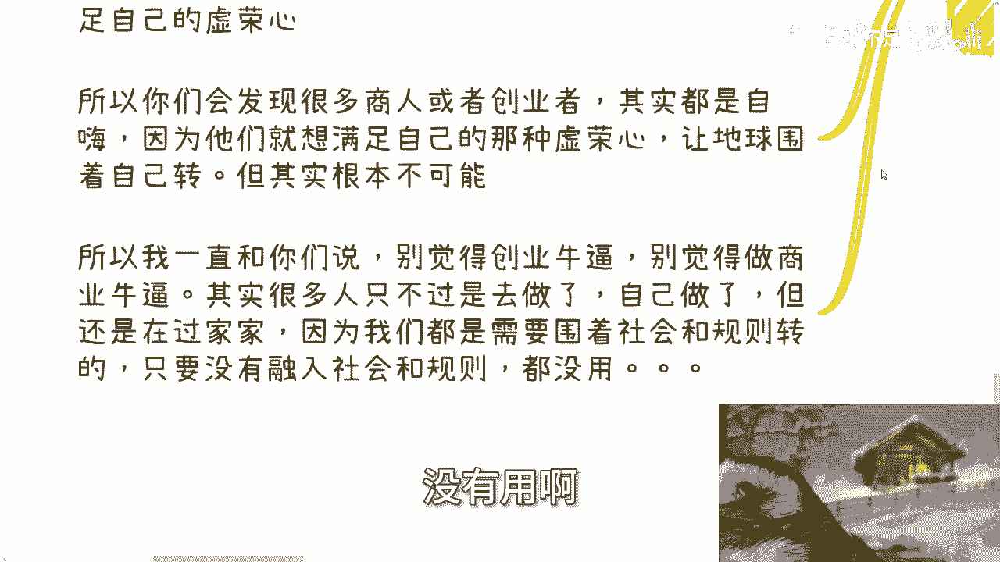
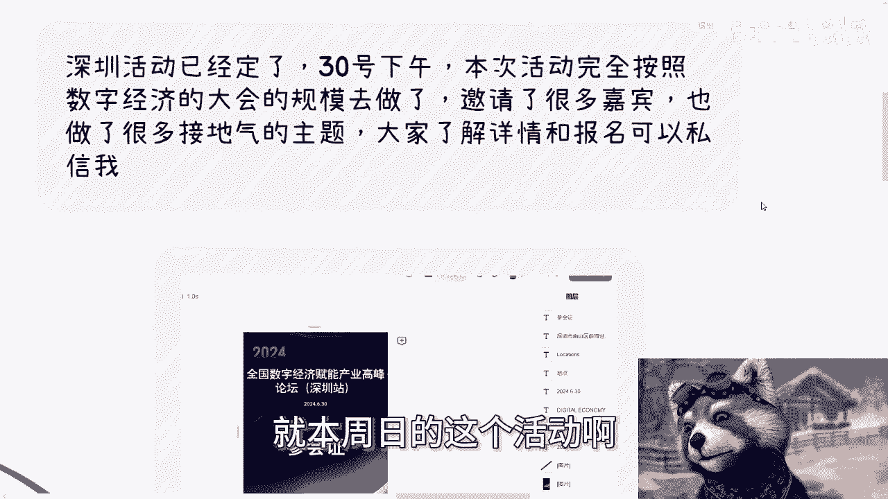

# 课程 P1：为什么你找的小伙伴都不听话，一点都不好用？ 🤔

在本节课中，我们将要学习一个在合作与创业中常见的问题：为什么你找到的合作伙伴或“小伙伴”总是不听指挥、难以使唤。我们将深入探讨其背后的核心原因，并提供清晰、实用的解决方案。

---

## 概述：问题的普遍性与根源

很多人遇到过类似问题：找到的合作伙伴不靠谱、不听话、使唤不动。我自己过去也抱有同样的想法。无论是举办活动还是运营项目，当需要他人协助时，如果处理不当，很容易陷入合作无效的困境。

核心问题在于，驱动他人行动需要明确的激励。这通常归结为两个要素：**金钱**或**希望（画饼）**。如果两者都无法提供，就很难期望他人积极为你工作。

---

## 第一节：合作的基础——明确的激励

上一节我们提到了问题的普遍性，本节中我们来看看解决问题的根本方法：提供明确的激励。

要使唤得动别人，让别人觉得“好用”，你必须提供以下两者之一：

1.  **给钱**：支付与劳动相匹配的报酬。
2.  **给希望**：描绘一个清晰且有吸引力的未来图景。

**公式**可以概括为：
**有效合作 = 金钱激励 或 希望激励**

如果既不付钱，也不画饼，却期望别人卖力工作，这通常是不现实的。

---

## 第二节：两种常见的“找小伙伴”场景

理解了激励的重要性后，我们来看看实践中“找小伙伴”通常发生在哪两种场景。

以下是两种最常见的需求类型：

*   **找苦力**：例如举办大会时，需要有人负责拉赞助、做设计、宣传、后台管理等繁杂工作。这种合作本质上是寻找能够分担具体事务的人。
*   **找分销/销售**：例如在直播电商或推广项目中，需要有人帮忙拓展客户、发广告。每达成一个结果（如拉来一个客户）给予相应佣金或分润。

在这两种场景中，我的经验是：**该用钱的时候必须用钱**。尝试过少付钱或不付钱，结果往往是对方敷衍了事、使唤不动，最终效果还不如自己亲力亲为。

---

## 第三节：“画饼”的艺术与本质

如果不想或不能支付足额金钱，那么“画饼”（给予希望）就成为另一种选择。本节我们来剖析“画饼”的具体做法和本质。

“画饼”说穿了就是八个字：**吹嘘过去，贩卖未来**。

以下是具体操作方法：

*   **吹嘘过去**：向对方展示你过去的成就、人脉和资源。例如：“我以前做过XX项目”、“我认识XX领域的关键人物”。
*   **贩卖未来**：向对方描绘项目的光明前景和潜在收益。例如：“这个项目前景巨大，未来可能融资上市”、“做得好我们可以一起分享巨大红利”。

驱动人的力量无非两种：**金钱**或**思想**。因此，如果你想找人合作，必须把事情做全套：要么金钱到位，要么思想工作（画饼）到位。不能既不想出钱，又懒得做思想工作，却指望别人为你效力。

---

## 第四节：如何识别与应对“画饼”

上一节我们介绍了如何“画饼”，本节中我们来看看如何从接收方的角度识别和应对“画饼”，避免被欺骗。

社会上许多人热衷于“画饼”，原因有二：

1.  为了白嫖和压榨，实现自身利益最大化。
2.  为了满足虚荣心，享受被他人崇拜的感觉。

很多创业者和商人沉浸于自嗨，吹嘘各种关系和蓝图，但关键问题是：**他们到底有没有赚到钱？** 判断标准应该务实，例如：“钱到账了吗？”

对于涉世未深的年轻人，很容易被这种话术迷惑。因此，**多接触、多交流、多观察**至关重要。量变产生质变，当你听过足够多的案例后，自然就能分辨哪些是空洞的吹嘘，哪些是真实的机遇。

不要在没有充分了解社会运行规则和人际话术之前，就贸然进行商业合作，那样很容易上当受骗。

---

## 总结

本节课中我们一起学习了如何解决“小伙伴不听话”的问题。

核心要点总结如下：
1.  有效合作建立在**明确激励**之上，要么给钱，要么给希望（画饼）。
2.  实践中，根据需求（找苦力或找分销）选择合适的激励方式，该付费时不要吝啬。
3.  “画饼”是一门技术，核心是**吹嘘过去，贩卖未来**，但其本质可能是为了白嫖或满足虚荣心。
4.  作为接收方，要通过**多听、多看、多学**来提升辨别能力，关注实际结果（如是否赚到钱），而非空洞的承诺。

希望本教程能帮助你更有效地管理合作，找到真正“好用”的伙伴。