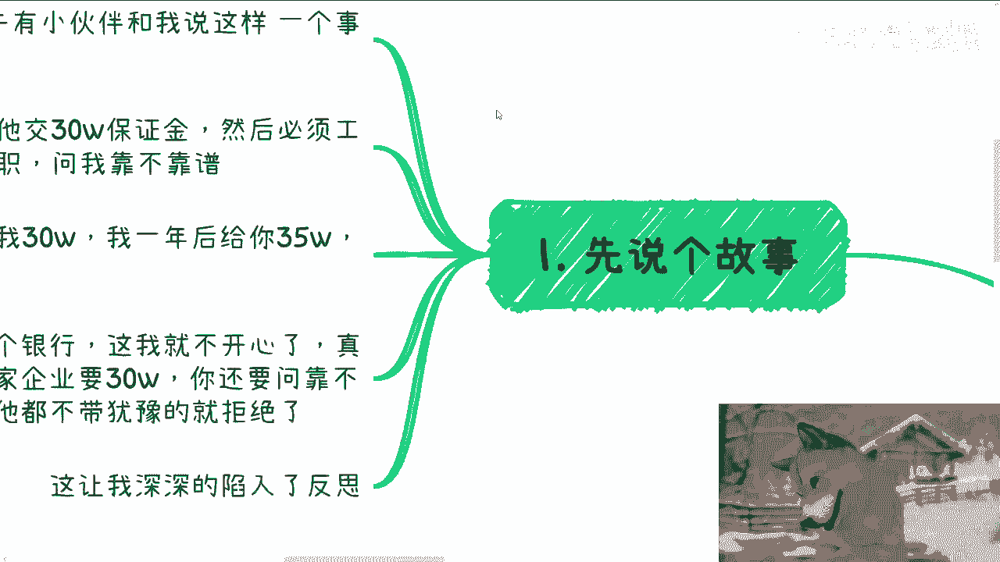
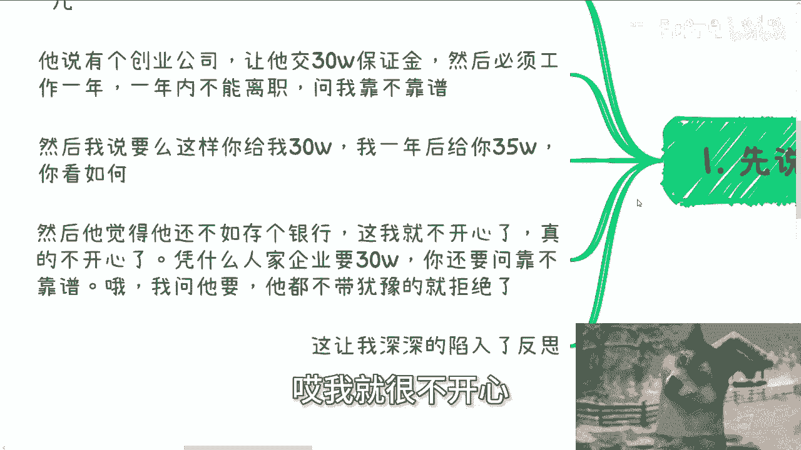
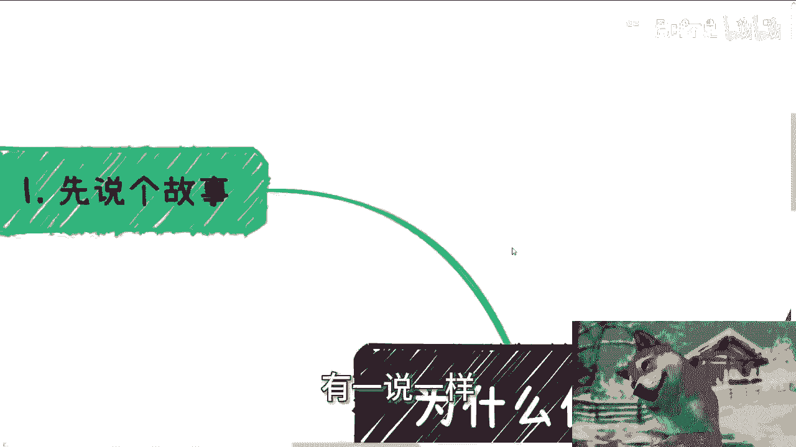
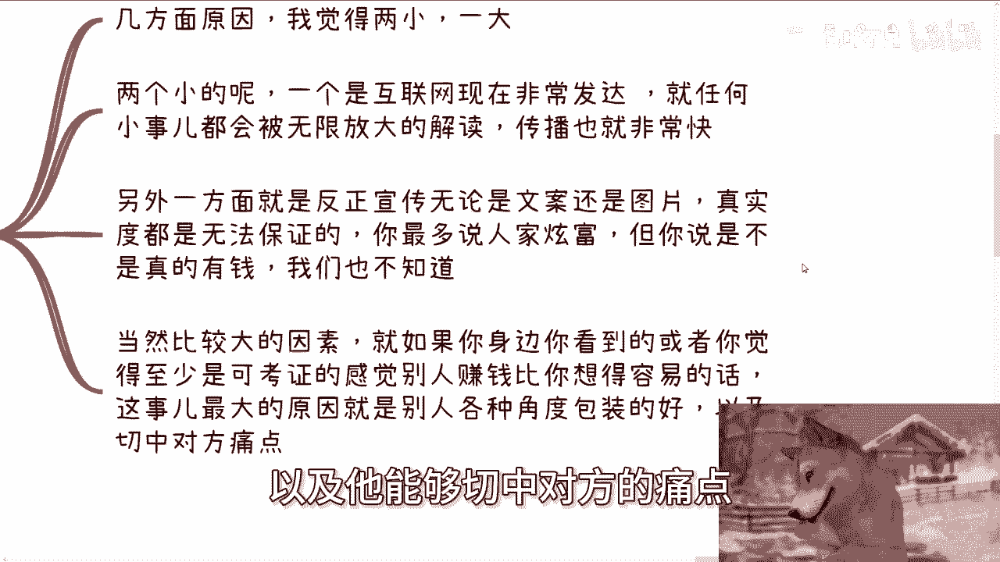
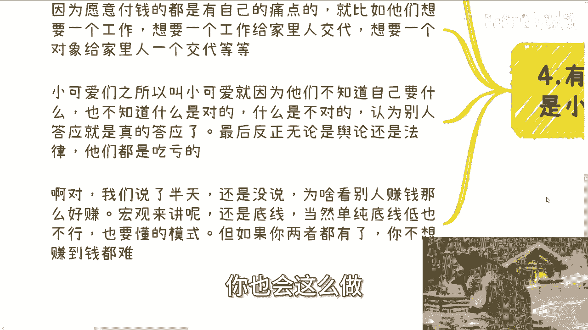

# 为什么你看别人赚钱总是那么好赚 - P1 - 赏味不足 - BV1si421h7fy

哈喽大家好，今天我们来说第二个视频啊。

就是呃为什么你看别人赚钱总是那么好赚对吧，就这个是不是很多人每个人都会有这种感受啊。

首先先讲个故事啊。

是这样子的啊，下午有个小伙伴来跟我说了这么个事啊，他妈也把我说笑了，他说有个创业公司啊，让他交30万保证金啊，我不夸张啊，他妈聊天记录就这样的啊，交30万保证金，然后必须工作一年，一年内不能离职。

能问我靠不靠谱，我一开始我都不知道怎么回哈，然后我说要么这样吧，你给我30万，我一年后给你35万，你看怎么样啊，然后他觉得呢他他原话他就说，那那那他还不如存个银行对吧，存个什么买个七，买个基金什么的啊。

那我跟你们讲，那我就不开心了啊，我真的很不开心诶，那凭什么人家企业问你要30万，你要问靠不靠谱啊，我问你要诶，他就不带犹豫的就拒绝了，哎我就很不开心。

这让我深入了呃，深深的深入陷入了沉思啊，有一说一啊。

那第二点啊，那很多时候呢大家都会有标题的这种感觉对吧。

几个方面啊，我觉得两两小一大两个小的呢，一个是互联网现在发发展的这个非常发达啊。

就任何小事都会被无限的放大解读额，传播也比较快啊，然后我觉得这第一个另外一个呢，就是说反正宣传无论是文案还是图片啊，真实度也无法保证，你说你最多说人家炫富，你能说他怎么地呢对吧。

他他比如说他说他自己赚1000万，啧你你说他造谣，他说他自己赚1000万，造啥谣，你你你真的也好，假的也好，怎么了呢，怎么了呢对吧，他只要不是说他自己赚1000万，然后来问你收100万对吧。

那那你你跟你就没关系，你就随便让他吹呗对吧，所以说就是说另外一方面啊，就是说宣传呃，传播快了之后呢，那很多人真实度就无法保证，那无法保证的同时传播又快的时候，那么你就会发现哎。

可能就会出现非常多的幸存者偏差，就会觉得啊人家好像都很容易对吧，为什么自己很困难啊，但你说他是不是真的赚这么多钱，或者是不是真的很有钱，咱也不知道啊，那当然啊比较大的因素，就如果你身边你看到啊。

或者说你觉得至少是可以考证的，有一定的证据的这种人啊，那么你说啊感觉别人赚钱比你想的容易的话，我可以这么说啊，这是最大的原因啊，如果有的话，如果在你身边出现的话啊，这是最大的原因。

就是别人各种角度包装的比你好啊，以及他能够切中对方的痛点啊。

那么第三点啊，就就今天这位小伙伴问我的这个问题啊。

我也反思了一下啊，我思考了一下啊，我觉得我应该这样做啊，首先呃我觉得我个人肯定不行，我需要注册个皮包公司啊，那其次呢为了压榨来的人啊，我开出来的薪资呢我必须是多元化的，就整个package的结构。

必须是这个A加B加C加D啊，这个无论你什么岗位，反正我都给你底薪加提成啊，提成必须根据你的KPI来啊，如果KPI不满足我就我就不不多付钱啊，那当然如果你底薪低啊，我就不多付，如果你底薪高，我就倒扣啊。

我举个例子，比如说你3000的底薪啊，你完成KPI哦，我给你啊，当然KPI我可以分段啊啊KPI分三段啊，比如第一段第一集你完成了啊，300好，第二集完成600，第三集完成1000对吧啊。

反正KPI我说了算，你永远这辈子不可能完成第三集的，对不对啊，那么然后合同呢我就给你签四签的合同啊，然后你也觉得爽的一逼，反正你也不懂对吧啊，比如说你呃，再比如说你8000的底薪啊。

那么你完成完不成KPI呢，就倒扣你4000啊，当然我也会给你余地嘛对吧，比如说你完成呃，一完成了这个70%对吧，我扣你1000啊，完成了百分之这个50，我扣你2000对吧，完成了百分之这个30啊。

扣你3000，那我如果一个都没完成，我就扣你4000对吧，那反正KPI我说了算嘛对吧，那合同签8000啊，反正你也不懂啊，哦对了啊，这个顺便呢还要补上，就是你需要交50万的保证金啊，一年之内不能离职啊。

我我仁慈了一点，3年内吧不能离职啊，否则你要再补违约金50万啊，当然啊以上这些全部会写在补充条款，或者说最后那几，我顺便把顺便把这种字体调小点放在什么呃，给你什么三份合同啊。

让你看了他妈的自己都不知道在看些什么东西，反正你也不懂啊，哎呀我真的佩服我自己竟然如此牛逼啊，所以有的人要问了啊，也不是说每个人都是啊，那那当然啊你们自己去看看网上啊，比如说小红书啊，抖音啊对吧。

曝光的企业少吗，不少了对吧，那这些企业不照样招人吗，为什么呢啊，因为付钱的他都有自己的痛点，就如我刚刚跟呃，就如我之前这么长时间跟你们讲了，他们要的是什么，他们要的不是份工作。

他们要的是给家里人一个交代啊，包括他们去相亲也是一样的，你说他们是要个对象吗，不是他们要的就是给家里人一个交代没了呀，所以说他知道啥呀，他不知道，他觉得就是哎我能够交个五险一金，反正就是有个工作做对吧。

能够给家里面一个交代啊，也就这么着了对吧啊，那那那你让我交30万，交50万都可以啊，只要只要这个不是特别离谱对吧，你让他交1000万，那他不可能交100万，也不可能啊，交个二三十万还是有可能的对吧。

那我就这么跟你们讲，之所以叫呢，就是因为他们不知道自己叫什么啊，也不知道什么是对的，什么是不对的，能认为别人答应了就是真的答应了啊，最后反正就是说我就这么跟你讲，按照我三这边的逻辑啊。

现在很多小公司就这么干的啊，我就这么跟你们讲，这么多年都是这么干的。

我你们如果最后被坑了，无论是舆论还是法律，你们都是吃亏的，你有什么好说的合同，你们自己签的呀，搞笑嘞，有啥好说的呢，对吧嗯然后最后来说一点啊，就是说那个我们说了半天还是没有说，就说说到这个主题。

那为啥看别人赚钱好赚呢，其实我觉得宏观来讲呢很简单，那还是底线问题对吧，就像三这个东西难吗，不难啊，你要是做个企业家，你会这么做吗，不一定啊，但是如果你被迫无奈，你有可能这么做。

同时你如果是个底线很低的人，你也会这么做。

这么做有什么问题呢，没什么问题啊，合同怎么签就怎么来嘛，一个愿打一个愿挨，怎么了呢，对吧，我给你一份正式合同，第二份保密协议，第三份补充条款，我把所有东西都写在普通条款里，你爱来不来，我说不好听点。

就当下这么难找工作的情况，下面你不来，有的人是有的是人来，怎么了呢，怎么了呢，啊你我跟你们这么说，你别看我这个东西怎么写，我可以告诉你们很多就会觉得哦，8000块钱哎呀那个我KPI努力做做，我努力卷卷。

我，我每天他妈搭帐篷睡在公司里面对吧，我我至少能拿个六七千吧对吧，总有这么理解的呀，你你能这么说了对吧，你跟他说哎不行的对吧，KPI都是老板说了算的，他不会给你的，人家不信，总有人会信你，关你吊事。

对不对啊，然后你看整个这套逻辑，卧槽他妈爽的一逼啊对吧，我按照我交金，再按照最低基数来交，然后呢我全部扣扣KPI对吧，比如说上面这个人啊，四签的合同我给3000啊，下面人八签合同我给4000，牛逼对吧。

然后如果当初还有个人离职了，我还能他妈的追他50万，嘶啧，那想想这稳赚不亏，对不对啊，而且更何况你们有没有发现啊，就是这个3000块钱底薪跟这4000块钱底薪，其实就是这50万。

保证里面出的就完全羊毛插在羊身上，我也不知道大家图些啥。

但是还是那句话，中国这么多年以来，这种模式屡试不爽，你说他们图啥呢，我也不知道啊，但是就有这么多人去怎么办呢，啊你要真的要说，我就跟你说，还是人太多，就这么简单，怎么办呢，没办法，好吧我去反思了啊。

我去反思了，那个行吧，那就这么着吧啊然后你们自己这个工作上面啊，包括跟别人的合作啊，包括就是说呃职业规划，商业规划，包括股你们合作过程当中涉及到的股权，股份啊，分红分润啊，商业计划书白皮书啊。

包括你们希望通过我的一些呃认知，或者对于一些社会的一些理解，能够给你们，让你们能够更少走一些弯路的话，那么你们可以整理好对应的问题和个人背景，好吧，我们再来做咨询。

