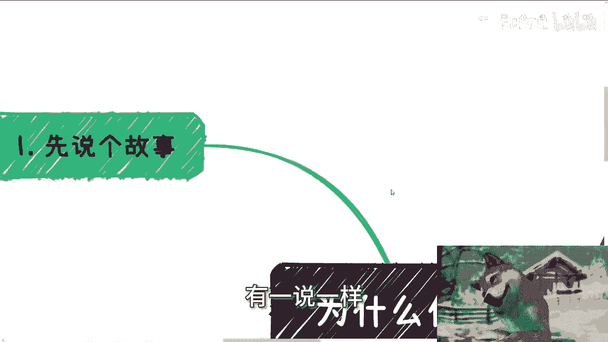
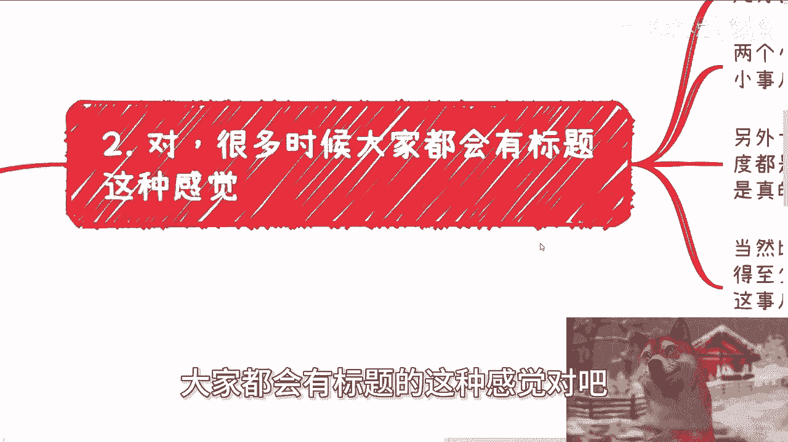
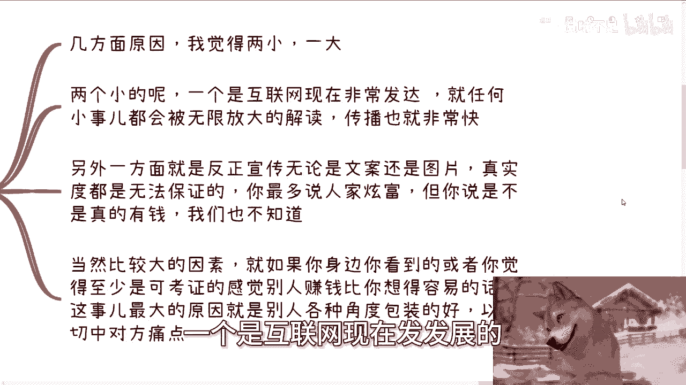
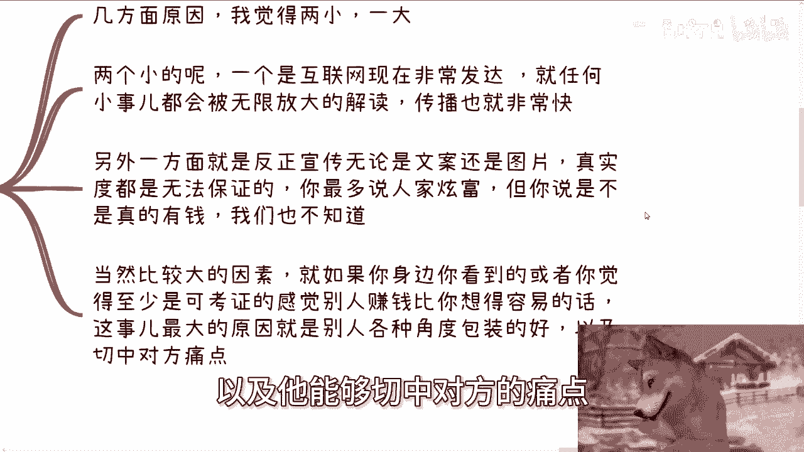
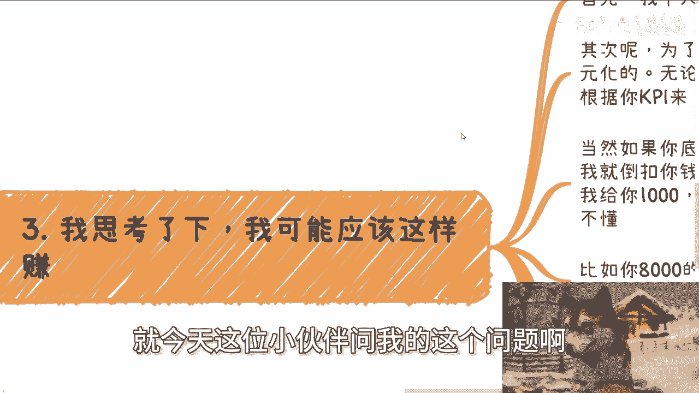

# 课程名称：为什么你看别人赚钱总是那么好赚 - P1


## 概述


在本节课中，我们将探讨一个普遍存在的感受：为什么看别人赚钱似乎总是比自己容易。我们将通过一个具体的故事案例，分析这种现象背后的几个关键原因，并揭示一些商业环境中可能存在的陷阱。

---

## 一、 一个引人深思的故事


下午，一位朋友向我讲述了一件事。一家创业公司要求他缴纳30万元保证金，并承诺必须工作满一年，期间不能离职。他询问我这个机会是否靠谱。



我的第一反应是，我提出一个方案：让他给我30万，一年后我还他35万。他立刻表示，那还不如把钱存银行或购买基金。



这让我感到不解。为什么一家企业向他索要30万，他会犹豫并询问是否靠谱；而当我提出类似要求时，他却能毫不犹豫地拒绝？




这件事让我陷入了沉思。

---

## 二、 感觉别人赚钱更容易的两个表层原因

上一节我们通过一个故事引出了疑问，本节中我们来看看造成这种普遍感受的两个外部环境因素。





以下是两个主要的外部原因：

1.  **互联网的放大效应**：互联网高度发达，任何微小的成功案例都可能被无限放大和快速传播。这导致我们频繁地接触到各种“赚钱神话”，形成了“遍地是机会”的错觉。
2.  **信息的真实度存疑**：网络上的宣传，无论是文案还是图片，其真实性往往无法保证。许多人展示的财富和成功可能含有水分，但只要不涉及直接诈骗（例如，宣称赚1000万然后向你收费），就很难被证伪或追责。这种快速传播与信息失真相结合，极易产生“幸存者偏差”——你看到的都是“幸存”下来的成功者，从而感觉成功很容易。

当然，如果你身边确实存在可考证的、你认为赚钱更容易的人，那么最大的原因可能是：**他们在自我包装和切中用户痛点方面做得比你好**。

---

## 三、 剖析案例：商业逻辑与认知陷阱

那么，针对朋友遇到的这个“保证金”案例，其背后的逻辑到底是什么？我对此进行了反思。

如果我要设计一个类似的方案，我会这样做：

首先，我个人出面不够正式，需要注册一个皮包公司。其次，为了最大化利益，薪资结构必须多元化，采用 **`底薪 + 提成`** 的模式。

提成与KPI严格挂钩，而KPI的解释权和制定权完全由我掌控。其核心逻辑可以用一个分段函数表示：

**薪资公式**
```
实际到手薪资 = 底薪 + 提成奖励（或 - KPI扣款）
```
其中：
*   **提成奖励**：设定几乎无法完成的KPI阶梯，例如：完成第一段奖300元，第二段奖600元，第三段奖1000元。确保员工永远无法触及最高奖励。
*   **KPI扣款**：对于底薪较高的岗位，实行未完成KPI倒扣制度。例如：底薪8000元，未完成KPI则按比例扣钱，扣款规则同样由我定义。

合同方面，我会准备多份文件（正式合同、保密协议、补充条款），将关键的不利条款（如高额保证金、严苛的离职违约金）用微小字体隐藏在补充条款中。很多人并不会仔细阅读或完全理解这些法律文件。

**为什么有人会接受这种明显不合理的条件？**


因为求职者有自己的痛点。他们需要的可能不仅仅是一份工作，而是“给家人一个交代”的社会身份。只要能提供五险一金和一份看似正式的合同，即使条件苛刻，也有人愿意接受。他们不清楚什么是合理的市场规则，认为“对方答应了就是真的”，从而容易落入陷阱。


---

## 四、 核心总结：底线与供需


说了这么多，我们回到最初的主题：为什么看别人赚钱好像更容易？

从宏观上讲，原因很简单，这通常涉及**底线问题**。像第三节中设计的方案，在技术上并不难。一个企业家是否会这样做，取决于他的底线和处境。

这种做法在法律形式上可能“一个愿打，一个愿挨”。在就业市场供大于求的情况下，即使条件苛刻，也总有人愿意接受。这套逻辑对设计者而言“稳赚不亏”，因为所谓的底薪，可能本身就来自员工缴纳的保证金。

这种现象在中国市场长期存在且屡试不爽，归根结底，还是因为**人太多**，竞争激烈，导致部分求职者议价能力弱，并可能因焦虑而做出不理性的判断。

---

## 本节课总结


本节课我们一起学习了“看别人赚钱更容易”这一现象背后的多层原因：
1.  我们从一个“保证金”故事入手，看到了认知差异。
2.  分析了互联网放大效应和信息失真造成的表层错觉。
3.  深入剖析了一个不合理商业案例背后的设计逻辑与人性弱点。
4.  最终将核心原因归结于底线差异和市场供需关系。

希望这节课能帮助你更理性地看待所谓的“赚钱机会”，在职业选择或商业合作中，注意甄别信息、理解合同细节、保护自身权益。

如果你在职业规划、商业合作（涉及股权、分红、商业计划书等）或对社会运行逻辑有进一步疑问，可以整理好具体问题和你的个人背景，以便进行更有针对性的探讨。


