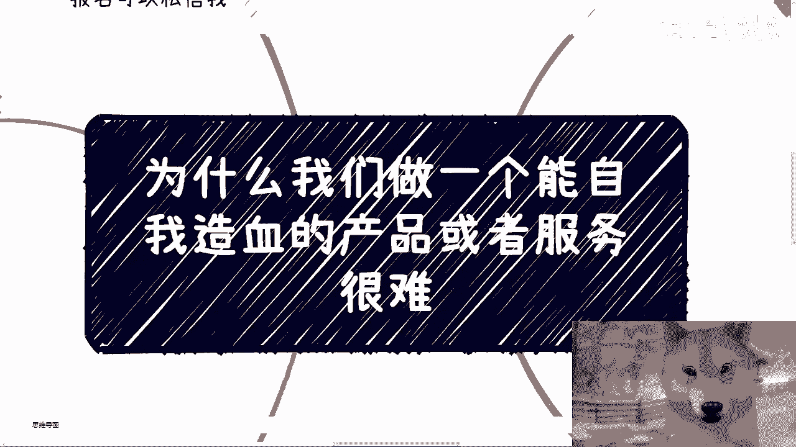
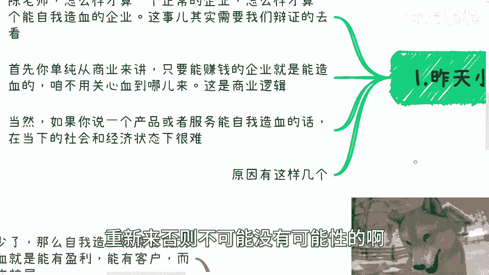
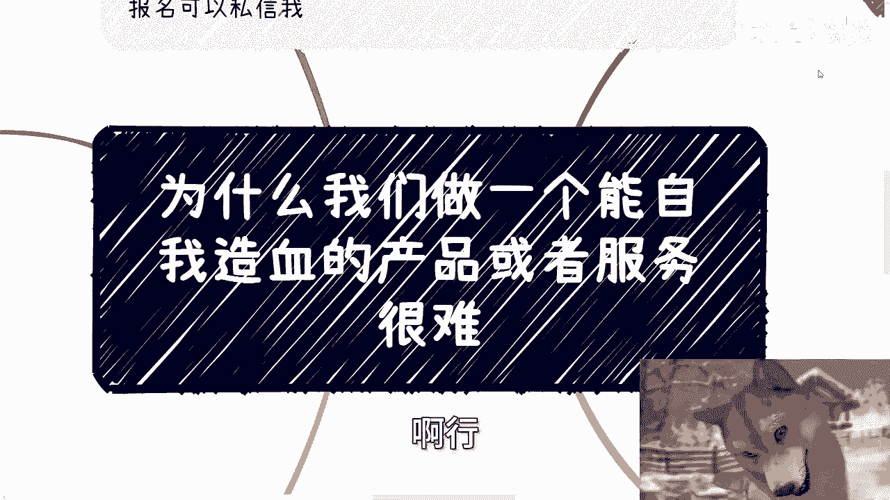
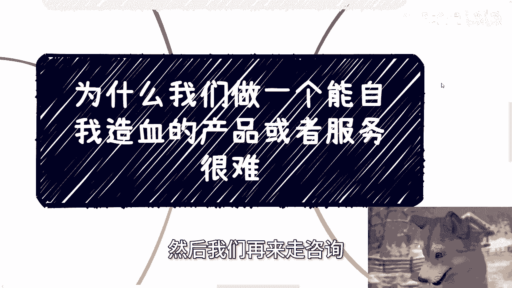

# 为什么我们做一个能自我造血的产品或者服务很难 - P1 - 赏味不足 - BV1Hy411i7av

好大家好呃，我们今天这个主题呢叫做呃，为什么我们做一个能自我造血的产品或者服务，很难啊，这个也是昨天嘛有位小伙伴跟我提的啊，这个点我觉得也蛮好的啊，所以就拿出来也说一下呃。

首先呢下一期活动我已经定了好吧，在北京啊，然后本月就是啊现在几月份7月份是吧啊，7月28号好吧，下午啊在那个东直门地铁站附近好吧，然后本次活动内容呢，大致是一个是跟上次一样的，就是私企啊，国央企。

外企啊，出国等选择和未来的发展，第二个呢就是我会跟大家讲一下，就跨境跨境电商和自媒体啊，现在还是否值得去做啊，和一些风险点啊，以及就是我们另外一位小伙伴会给大家来分享，这个低空经济的这个知识普及好吧。

然后了解详情跟报名可以私信我啊，好啊，昨天我们小伙伴啊是问我这么一个问题啊，他说陈老师怎么样才算一个正常的企业，怎么样才算一个自我能造血的企业啊，呃这事可能需要我们辩证的去看。

首先啊你如果单纯的从商业来讲啊，只要能赚钱的企业就是造型对吧，什么意思，意思就是说你这个血血啊，到底是通过你产品正常的获取，还是说冲通过你业务正常获取，还是说是通过融资来获取，不关心啊，只要有血来就行。

这个就是商业逻辑，那当然啊，如果你说一个产品或者服务，能够真正的自我造血，在当下整个社会跟经济情况下面是很难的啊，这也是为什么我们会一直说，2010年到2015，161718那段时间的。

整个的互联网的产品，或者整个中国的大量涌出的产品的这种情况，已经不复存在了，一去不复返，而不是说未来有没有可能出现，已经不可能再出现了，就这么简单啊，你除非就是把整个人类人类推翻掉，重新来。

否则不可能没有可能性的啊。

那么原因有那么几个啊，第一啊我们从今天来讲。

很难再有0~1的整个市场让你去做了啊，意思就是说几乎每个细节点能做的呢，都有人去做了啊，所谓自我造血，就是要有自我的流量，要有自我的有现金流，同时要满足客户的需求哦，也就是说它是真正的解决问题。

而不是靠钱砸出来的啊，同时这个钱不单单是给资本家跟企业家的，付钱的人，所谓客户也是有利可图的，那么简单来讲就是多赢对吧，但是你们想想看，真正的多赢有吗，到现在很难很难，就是你当整个市场百废待兴。

大家真的把这个市场一边做起来的时候，大家是多赢的，因为大家都没有里面的蛋糕，或者或者说这里面蛋糕足够大，大家都在分，但是你想想看，像美团，像饿了么，像滴滴，像其他的，它是一个多赢吗。

不是他是一个前期一开始的时候，就是资本家赢其他人输的这么一个角呃，这么一个这么一个环境啊，所以说你整个要多赢很难对吧，那么如果为，但为什么我们说当下多赢很难，因为要么就是一个市场真正的从0~1。

当下这个情况很难，对不对，那么这个时候你的投入跟产出都是正常的，也就是说你只要切出痛点，切中需求，现金流跟客户都是能有正反馈的，但问题在于，现在基本上1~10甚至十到一百一百，我不敢说啊。

10~60到80都已经差不多了，那么这个时候到今天为止还有问呃，就还有个问题是什么，那就是竞争太激烈了，就是你蛋糕越分越小，越分越小，但是外面虎视眈眈的人越来越多，越来越多对吧。

咱先不说是不是恶性竞争啊。

本身别人来恶性竞争，我们也控制不了对吧，所以这个事情我觉得不在考虑范围内啊，那么第三也就是我们说呃呃也是我说的，就是说从老百姓来讲。

投流或者砸钱已经没有意义了啊，那么这事可能很多人也不理解，比如说很多人现在一直以来啊，觉得就个人还有一个叫什么呃，那个很多很多人选择一个切入点，什么做自媒体对吧，做什么知识变现，做别的东西啊。

我跟你讲啊，我不管你做什么，你做什么都是需要投流的对吧，这是对，但是你们对金融呃金额的这个理解有错误啊，为什么，因为到今天市场太卷了，说白了竞争的人太多了，全球都是你想啊，本来一个游戏100个人。

大家都是1万5万10万的往里面投对吧，然后呢你一个散户进去啊，大大概比如说东拼西凑，也凑了个5万10万的对吧，那么你是能听到响声的，为什么，因为你跟大家是在一个起跑线上面的，明白吗。

但是现在已经到了1万个人了啊，比如说举个例子啊，比如说现在已经到1万个人了，然后普遍投流的起步资金量可能已经是30万，50万起步了对吧，那么当当大家起步都很高的时候，那么就等于大家都他妈在抬高起跑线。

那么大家抬高这个起跑的底线的时候，就等于大家都没有优势，对不对，那么你们可以想想看，不仅仅头留，包括学历啊，晋升啊对吧，包括年龄啊，而包括性别歧视啊对吧，对于女性的歧视啊，我不是说我我不是来判断。

我们今天不是来判断这个东西对跟不对啊，我们只是来客观的说这么一个现实，整个社会就是这么一个发展对吧，也就是说你歧视跟整个的卷，其实是在不停的在发展过程当中，在提高这个底线对吧。

那么就相当于是不停的在潜移默化的提高，各个行业，各个呃，就是说啊可以参与的这个赛道的这个叫什么，这个门槛，那么这个时候普通人或者散户的投入，比如说低于10万，当然可能对普通人跟散户来讲。

10万已经不低了对吧，但是你从整个市场来讲，比如说你低于10万或者30万的话，虽然啊你看着你是有投入的，但其实整个算法没法给你引流，为什么，因为你基数他妈太低啦，对不对，你你10万等于淹没在整个30万。

50万的整个起步的头流里面，你看似是有曝光的，但这种曝光已经没有意义了，对不对，因为你从横向纵向来讲，横向就是我们说的整个人人量太多，就是跟你一样投10万的人太多太多，纵向就是他也还有太多太多人。

看他他妈的30万，50万起步的，你你你哪里来响声，你想想看，对不对啊，那么第四，那么回到自我造血这个问题上啊，既然0~1的切入点很少，那么自我造血就需要满足，我们既要切入用户的需求点，又要能够有盈利。

对不对，而且同时这个客户还能够可持续发展的，自我分裂对吧，那么包括现在你们大部分人啊，包括以前私信，去年开始私信什么大学生啊对吧，创业者啊，给我的这个产品或项目啊，我可以这么说，99。

99999%的人卡在钱，从哪里来，为什么，因为他们的产品往往压根要么就没有客户，要么就客户不愿意付钱，他们就觉得我应该问投资人要钱，那问题在于他妈的投资人为什么给你钱呢，因为你没有现金流。

凭他凭什么给你钱给你钱呢，对不对，那么你想想啊，如果你这产品能够有健康的现金流，那么你自然其实不着急，这么着这么快的去融资对吧，你自然也会投入更多的钱去引流，去拓展，去尝试，去试错。

但如果你没有健康的现金流，你一旦去比如说自己掏钱或者找找投资人，或者花别的方式去引流，那么一旦我们就说你投出去，比如说50万投出去100万，你整个的转化率很低很低，比如说你转化，比如说就1%的转化对吧。

然后1%的里面呢，还只有50%的人那个愿意付钱，那么你就会发现你转化率不高的情况下面，你就等于进入了一个恶性循环，就是你这一步你要么就别走，就跟他妈的，你上那个那个那个那个那个那个那个诶。

那我们叫什么叫啊，高原反应是一样的，就是你上去赢，你要么就别吸氧，你当然这话也不能这么说啊，就是你要么就是说能够很健康的对吧，很很体力很很很体力充沛的，你说我不吸氧，你一旦吸氧了，我跟你讲。

你就一直会吸下去，你知道吗，为什么，因为你在整个这个过程当中，你必须持续性的投入，你不投入就是死，你不投入就没有收入，你就会发现完全是负反馈，怎么办呢，对不对，你你只会变成投入越来越多。

越来越多越来越多，那么我们又说呃，最后啊我们又说到这个人性的问题，这个时候啊一个正常的资本家记住啊，我说的是一个正常的资本家，肯定只关心钱怎么落袋为安，而不是关心怎么造血，跟我谈产品怎么怎么赚钱啊。

包括这个服务怎么赚钱，我不关心啊，我只关心钱从哪来，我只关心我赚多少钱，跟我说，我关心的，这个钱到底是产品来还是服务来，对不对啊，毕竟就如我一开始说的，钱到底是业务跑出来的，还是融资来的。

还是说二级市场上面割来的，没人关心，因为钱怎么来五，我们就这么说啊，不管你融资来的还是二级市场割来的，还是业务跑来的，在法律层面他都是合规的啊。

不要来跟我讲那些有的没的懂吗，哦好那么最后所以我们一直会说什么，我说其实现在到今天为止，很多正常的企业都死的差不多了，为什么，很简单啊，一个正常的企业，如果他是靠自我造血能力啊，能够活到今天的。

而不是说靠融资或者靠资本对吧，靠二级市场靠上市，你们他妈的自己去看看，你们去翻翻整个的企业，有多少家企业是这样子的有吗，有多少，你们再去看看比例有多少，你们再去看看有多少比例死在了。

整个的这个这个这个时代当中对吧。

而你们仔细想想看，从整个的流程当中。

如果啊如果啊你们现在做一个产品，你们就想着说我想通过产品跟服务去造血对吧，你们就想着通过正常的产品和服务去盈利，你们自己想想看，如果你们是这种企业，你们能活多久，对不对。

就还是那句话啊，我们不是来判断这件事情对跟不对的，我们只是来阐述一个整个的社会，社会的客观事实，你明白吗啊不要到那个说啊，这个好像好像资本家跟跟跟企业家就对立面，对吧，或者怎么样子。

没有什么东西是对立面的，只是看你立场在什么地方好吗，好行好吧。

就这么着啊，然后活动的话就是28号好，28号，然后详情跟报名可以继续私信我好吧，然后剩下的话就股权期权啊，职业规划，商业规划呃，那个你们在做的过程当中，有些关于合同啊，关于分红分润啊啊包括商业计划书啊。

包括白皮书啊，不知道怎么弄的啊，你们可以呃咨询我，然后你们同样的就是希望通过啊我的一些认知，跟我对于当下社会的一些理解啊，希望我能够结合你们个人情况，给你们一些更接地气的这种嗯，那个规划跟建议的话。

那么你们可以整理好对应的问题跟个人的背景，包括你们或者说你们有有在做什么样做，做什么样的创业项目啊，你们可以整理好对应的详细问题好吧，然后我们再来做咨询。

