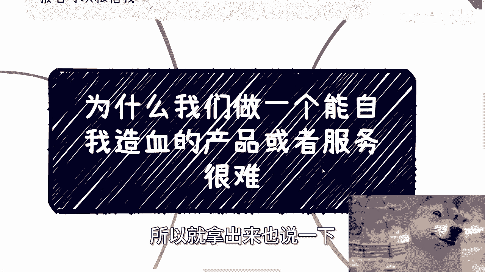
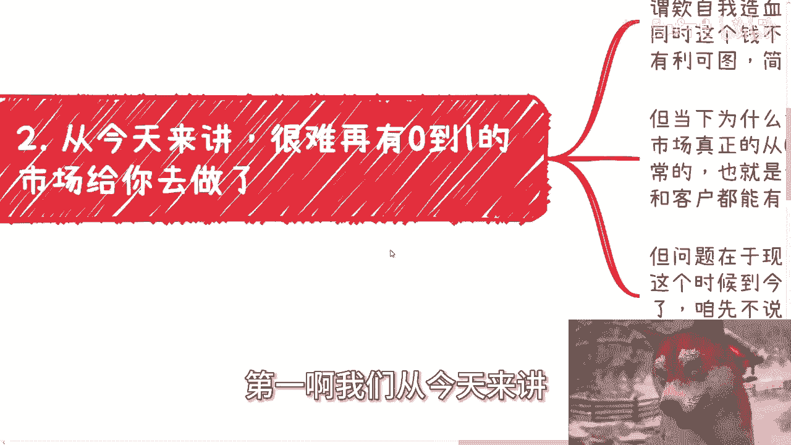
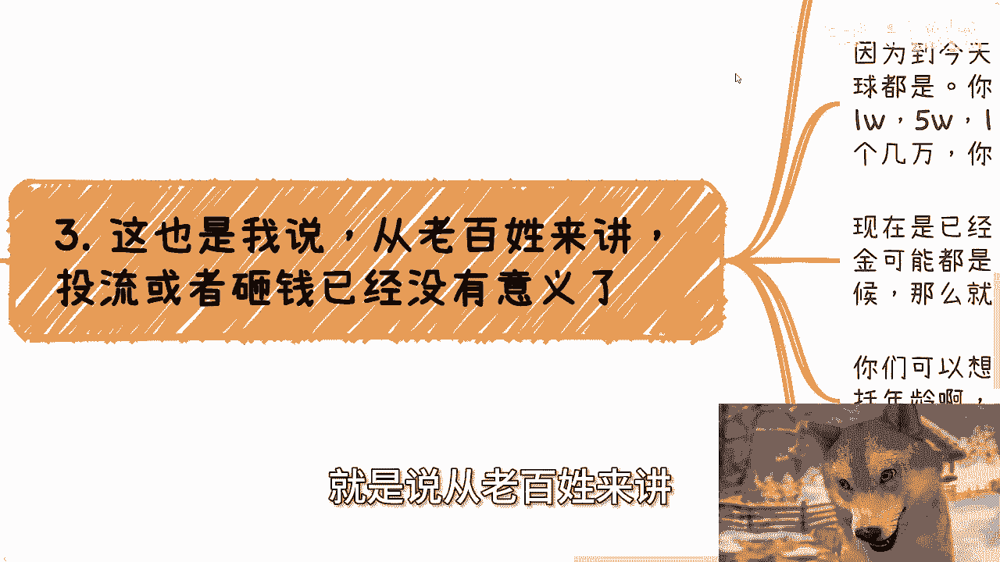
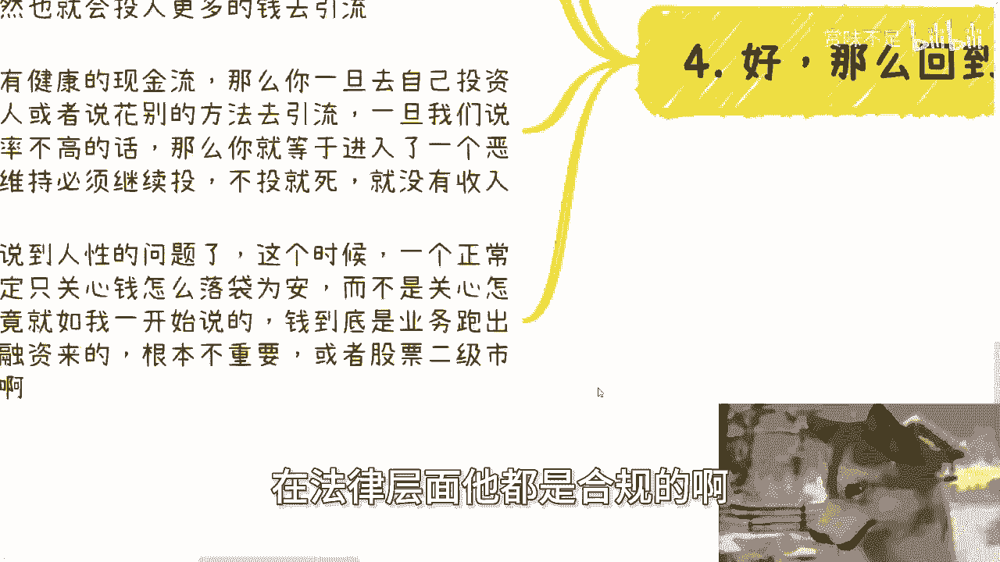
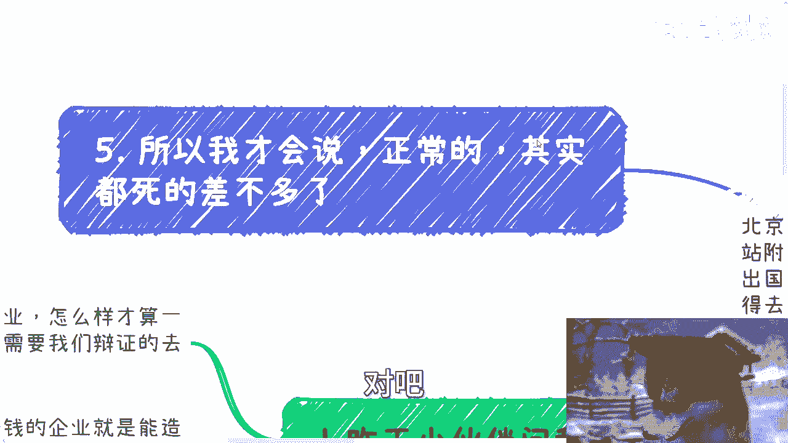
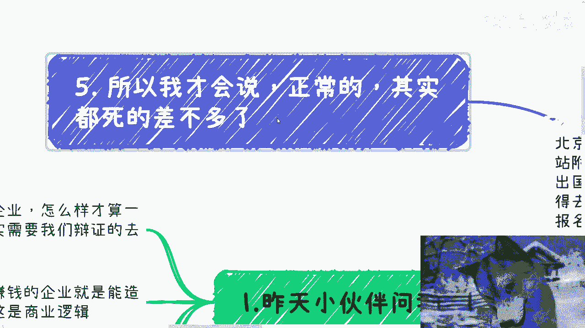

# 课程 P1：为什么打造能“自我造血”的产品或服务如此困难？💡




在本节课中，我们将探讨一个核心的商业难题：为什么在今天，创造一个能够依靠自身产品和服务实现健康、可持续盈利（即“自我造血”）的业务变得异常艰难。我们将从市场环境、竞争格局、资金门槛和商业逻辑等多个维度进行分析，帮助你理解其中的深层原因。

## 概述：什么是“自我造血”的企业？

首先，我们需要明确“自我造血”企业的定义。从纯粹的商业逻辑来看，只要能持续获得资金（即“有血”）的企业就是成功的。资金的来源可以是产品销售收入、服务收入，也可以是外部融资。公式可以简单表示为：

**企业生存 = 有持续的现金流入**

然而，我们通常所说的“自我造血”，特指企业不依赖外部输血（如融资），而是通过其核心产品或服务创造健康的现金流，并满足客户真实需求，实现多方共赢。


上一节我们定义了核心概念，本节中我们来看看导致“自我造血”变难的首要原因：市场格局的变化。



## 原因一：从0到1的市场机会已近乎消失 🚫

当下，很难再找到一个完全空白、从零开始的全新市场供你开拓。几乎每一个细分的需求点，都已有竞争者介入。

所谓“自我造血”，需要具备自有流量、自有现金流，并能真正解决客户问题。它不依靠烧钱补贴，而是让付费客户、企业自身乃至其他相关方都能获利，即实现“多赢”。

但请思考，像美团、饿了么、滴滴这样的平台，在其发展初期是“多赢”吗？并非如此。它们往往是资本方先赢，而其他参与方（如司机、商户）在初期需要承受亏损。在一个市场从零到一的野蛮生长期，多赢尚有可能，因为市场蛋糕足够大。但当市场进入从一到十，甚至从十到一百的成熟阶段后，蛋糕越分越小，而虎视眈眈的竞争者却越来越多，实现真正的多赢就变得极其困难。

既然空白市场难寻，那么切入现有市场并盈利的挑战在哪里？这引出了我们的下一个关键点：激烈的竞争。


## 原因二：竞争白热化，门槛被无限抬高 ⚔️



当前市场竞争的激烈程度空前。这不仅体现在参与者数量上，更体现在竞争的“起跑线”被集体抬高。

以下是几个被抬高的门槛示例：

*   **资金门槛**：过去，投入5万、10万进行营销推广可能还能听到“响声”。但现在，一个赛道的普遍投流起步资金可能已是30万、50万。当所有人的起步线都很高时，就等于大家都没有优势。对于资金有限的普通创业者或散户而言，低于门槛的投入很容易被淹没，无法获得有效曝光和转化。
*   **资质门槛**：类似地，学历要求、工作经验、年龄甚至性别等因素，都在无形中提高了进入各个行业的隐性门槛。
*   **恶性竞争风险**：在红海市场中，恶性竞争（如价格战）的风险也大大增加，这进一步压缩了健康盈利的空间。

激烈的竞争直接影响了获取客户的成本，而获取客户正是“造血”的前提。那么，在当下获取客户的有效方式是什么？这涉及到对“投流”的重新认识。

## 原因三：“投流”的边际效应急剧下降 💸

许多人将“做自媒体”、“知识变现”等视为切入点，认为只要投入资金进行流量投放（“投流”）就能成功。这种理解在今天可能已经过时。

原因在于市场过于“内卷”。当大量竞争者都将投流作为主要手段时，就形成了一个“囚徒困境”：大家不得不持续加大投入以维持曝光，导致获客成本（CPA）不断攀升。对于资金量有限的创业者：

**你的投入 < 市场平均获客成本阈值**

这意味着，即使你投入了十万（对个人而言已不是小数目），但在整个市场数十万起步的投流大盘中，你的声音依然微弱，转化率会很低。

一旦开始依赖付费流量，就容易陷入恶性循环：投入→转化率低→为维持收入必须继续投入→现金流持续失血。这就像产生了依赖症，一旦开始就很难停下。

理解了外部获客的困境后，让我们回到“自我造血”产品的核心要求本身。

## 原因四：同时满足多重条件极为苛刻 🎯

一个能“自我造血”的产品，需要同时满足以下几个苛刻的条件：
1.  **切中真实、迫切的用户需求**。
2.  **用户愿意为此付费**，且付费能形成健康利润。
3.  **具备可持续性**，能形成口碑或自传播。
4.  **在满足上述三点的基础上，还能对抗高昂的获客成本**。

现实中，绝大多数创业项目（可能超过99%）都卡在“钱从哪里来”这个问题上。他们的产品往往要么没有客户，要么客户不愿付钱。于是他们转向寻求投资人。但问题在于：**如果你的产品没有健康的现金流，投资人凭什么给你钱？**

一个残酷的现实是：在当今环境下，一个仅想依靠产品和服务本身盈利、不寻求资本加持的“正常企业”，其生存周期和生存概率正在急剧下降。



那么，这是否意味着另一种逻辑成为了主流？这正是我们要探讨的最后一点：商业世界的现实选择。

## 原因五：资本逻辑与造血逻辑的背离 🏦



从人性与资本逐利的角度看，一个理性的资本家或企业家，首要关心的是 **“如何让钱落袋为安”** ，而不是“这个产品如何自我造血”。他们关心资金的来源和回报率，至于这钱是来自业务利润、融资还是二级市场操作，在合法合规的前提下，并无本质区别。


代码可以类比这种选择逻辑：
```python
# 资本家的核心决策逻辑
def capital_decision(profit_method):
    if profit_method.is_legal(): # 只要方法合法
        return "Proceed" # 就推进
    else:
        return "Reconsider"



# 资金来源可以是：
# 1. 业务收入 (product_service.profit())
# 2. 股权融资 (venture_capital.invest())
# 3. 二级市场 (stock_market.operate())
```
因此，在许多情况下，通过融资快速占领市场、寻求上市或被并购，成为比慢慢培育“自我造血”能力更受资本青睐的路径。这进一步挤压了纯粹依靠产品盈利的企业的生存空间。


## 总结与思考 💎

本节课我们一起学习了为什么打造“自我造血”的产品或服务如此困难。我们分析了五个核心原因：
1.  **市场饱和**：从0到1的空白市场机会稀少。
2.  **竞争惨烈**：各维度门槛被大幅抬高，生存空间被压缩。
3.  **获客低效**：流量成本高昂，小额投入难以见效，易陷入恶性循环。
4.  **条件苛刻**：需要同时满足用户需求、付费意愿、可持续盈利和对抗高成本等多重条件，成功概率极低。
5.  **逻辑背离**：资本市场的逐利逻辑往往优先于产品自身的造血逻辑，改变了游戏规则。

需要强调的是，我们并非在评判这些现象的对错，而是客观阐述当前商业社会的基本事实。对于创业者而言，理解这些现实，有助于更清醒地评估自己的项目、选择更适合的路径，或者在启动前做好更充分的准备。


> 最后，无论环境如何变化，深刻理解用户、创造真实价值，永远是商业最稳固的基石。在规划创业或职业路径时，结合自身情况，寻求接地气的分析和建议，是应对复杂局面的重要一步。