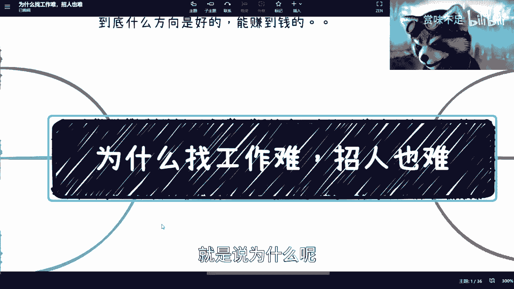

# 为什么求职人找工作说难-企业招人也说难---P1---赏味不足---BV1UL411U7tr_not

在本节课中，我们将探讨一个普遍现象：为什么求职者觉得找工作难，而企业也抱怨招人难。我们将从定义“难”开始，分析双方的核心动机，并揭示导致这种供需错配的根本原因，最后提供一些实用的应对思路。

---

## 一、 讨论前的定义：何为“难”？

在深入分析之前，我们需要先明确“难”的定义。求职者口中的“难”和企业口中的“难”，其具体含义可能并不相同。

上一节我们明确了讨论的基础，本节中我们来看看求职者找工作的真实动机。

## 二、 个人为何要找工作？

求职的原因并非单一地“需要一份工作”。以下是几种常见动机：

*   **市场调研**：通过面试了解行业动态、企业需求和薪资水平。
*   **骑驴找马**：在职状态下寻找更好的发展机会。
*   **竞争对手调研**：以求职者身份了解其他公司的业务和团队情况。

理解动机的多样性，有助于我们以更开放的心态看待求职行为。接下来，我们转换视角，看看企业端的情况。

## 三、 企业为何要招聘？

同样，企业招聘的目的也不仅仅是“岗位空缺”。其动机可能包括：

*   **满足申报KPI**：为申请政府项目、补贴而需要满足特定的人才数量或资质（如博士、硕士数量）。
    *   **公式示例**：`申报条件要求：博士 >= 2人， 硕士 >= 5人`
*   **应对临时项目**：因特定项目（如外包、短期合作）需要补充临时或特殊技能人才。
*   **获取特殊技能**：公司现有团队缺乏某项关键技术（如芯片设计、加密算法），需要外部引进。
*   **完成内部招聘KPI**：公司或HR部门设定的年度招聘指标。
*   **获取政府补贴**：许多地方政府对聘用高学历人才、海归人才等有补贴政策，企业为获取补贴而招聘。

可以看到，个人和企业的动机都是复杂且多元的。这就像双方各持一手牌，却要在信息不完全的情况下尝试匹配，自然增加了难度。那么，具体是哪些因素导致了“匹配失败”呢？

## 四、 个人为何找不到工作？

原因远不止“学历或能力不行”。在短暂的面试中，硬技能很难被完全准确评估。以下是一些关键因素：

以下是导致求职受阻的几个常见原因：

1.  **面试表现与包装不足**：缺乏面试技巧，不善于表达和展示自己，简历和个人形象包装不到位。
    *   **代码示例（比喻）**：`你的能力值 = 90分`，但`面试展示效果 = 50分`，最终`企业评估结果 <= 50分`。
2.  **方向选择错误**：持续在一个自己不擅长或不适合的领域求职。
3.  **自我认知偏差（眼高手低）**：对自身市场价值的评估远高于企业所能提供的报酬或岗位要求。
4.  **缺乏深层工作动机**：找工作仅为获取薪水，而非寻求技能提升或职业发展，导致动力不足、容易倦怠。

分析了个人端的问题后，我们再来审视企业端面临的招聘困境。

## 五、 企业为何招不到人？

在简历量巨大的今天，企业招人难往往源于自身。核心问题包括：

以下是企业端常见的几个招聘障碍：

1.  **岗位需求不清晰**：企业自身并不确切知道需要什么样的人，职位描述（JD）常常抄袭，导致筛选标准模糊。
2.  **面试过程不专业**：表现为“装逼”或刻意PUA求职者，破坏招聘体验。
3.  **缺乏吸引力包装**：尤其是中小型公司，不善于展示公司优势、文化和发展前景，难以吸引优质候选人。

既然我们理解了问题的多面性，那么有没有一些方法可以打破僵局，提高匹配效率呢？

## 六、 实用技巧与思路

求职和招聘都不应局限于投简历和筛简历这一种方式。关键在于变通和主动。

以下是一些突破传统路径的思路：

*   **绕过线上系统，建立线下连接**：主动参加行业或HR/猎头举办的线下活动，先建立人际联系，再表达求职意向。系统是死的，人是活的。
*   **打造个人品牌与影响力**：例如，定期在线上线下分享专业见解，组织小型交流会。坚持输出可以建立专业形象，吸引机会。
*   **明确核心诉求，进行针对性准备**：无论是求职者还是招聘方，都需要想清楚自己的核心需求（不仅是薪资/岗位，还有成长、项目、团队等），并在沟通中有效传递。

---

## 总结

本节课我们一起学习了求职与招聘市场中“两边都难”现象的深层原因。我们认识到：

1.  **动机多元**：个人求职和企业招聘的出发点复杂，并非单一需求。
2.  **错配根源**：问题不仅在于硬技能，更涉及面试技巧、自我认知、需求清晰度、沟通包装等多方面。
3.  **解决之道**在于**主动破圈**和**精准匹配**：通过线下社交、个人品牌建设等方式绕过低效渠道，同时双方都需更清晰地定义并传达自身核心需求。

**核心观点**：在信息红利减少的当下，个人发展与行业选择的关联性已大大减弱。成功更取决于清晰的自我定位、主动的策略以及持续的行动力，而非单纯等待风口。