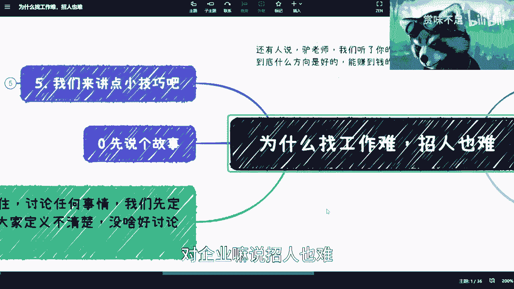
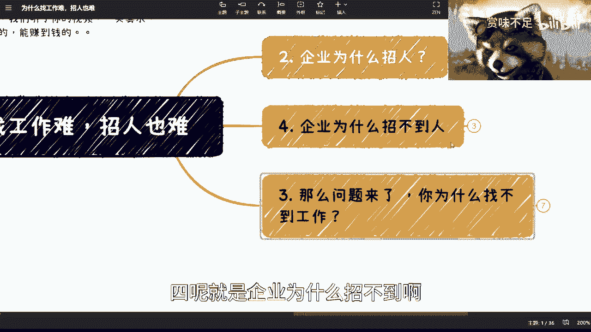
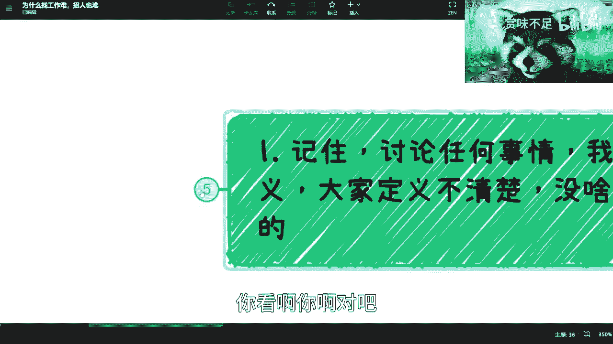
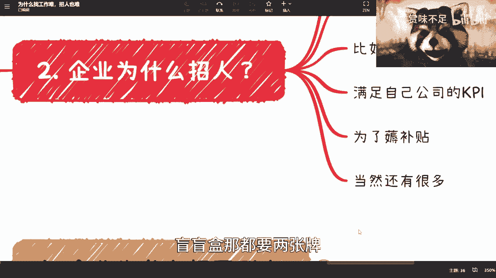
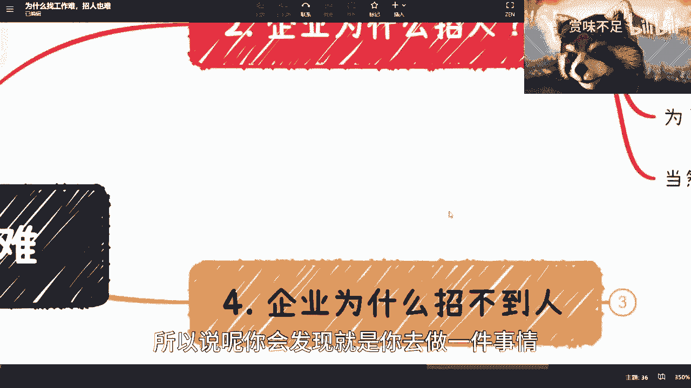
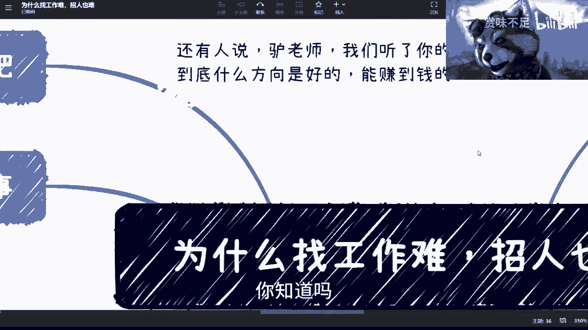
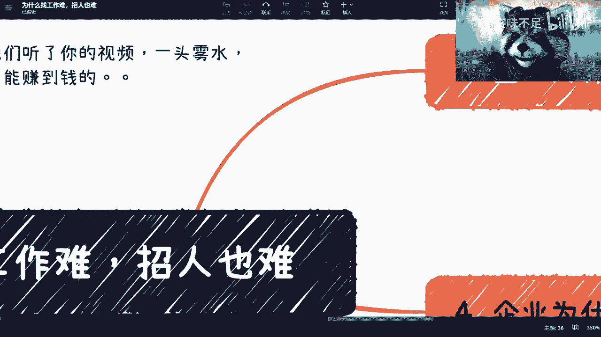
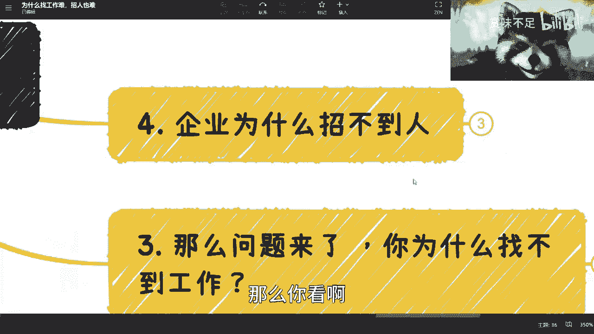
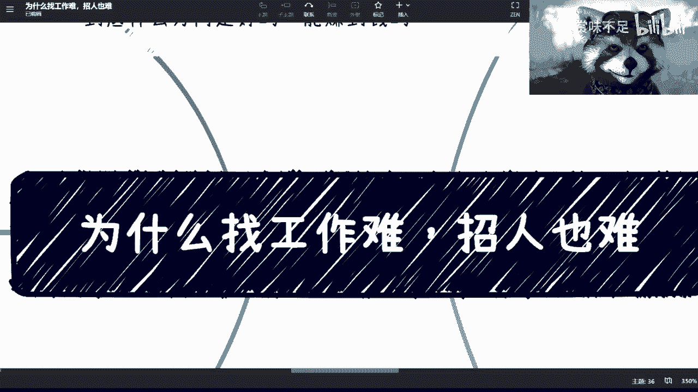

# 为什么求职人找工作说难，企业招人也说难 - P1 - 赏味不足 - BV1UL411U7tr

好啊大家好啊，这个礼拜六礼拜六。

这个感谢小伙伴对我的建议啊，就一开始呢我会先把这个大纲先看一下，就是你看啊，这次我们讲的是，就现在很多小伙伴说嘛，就为什么我们找工作难，对企业嘛说招人也难，反正两边都难对吧。

呃首先呢我会去讲故事啊，然后呢就是我们所有讨论问题之前呢。

我们先要去定义对吧，你比如说我们说难对吧，怎么算难对吧。

为什么难对吧，然后这是第一点，第二呢就是企业为什么对吧。

然后第三点是这个很多人为什么找不到对吧。

四呢就是企业为什么招不到啊，五呢就是我们讲点小技巧对吧，然后一开始我会在上面再讲一下好吧，基本上就这么一个情况啊，首先呢我觉得是这样子的啊，这个一些小伙伴呢在在行上去找到了我对吧啊，牛逼也蛮牛逼的啊。

然后给我下单啊，但是你们看啊，那边是599，但是我跟你讲，我其实是想设999的，但但是问题是你们去用一下在行那个平台，他最高就只能收到这个地方了，我也没办法了对吧，你直接B站上找我步枪吗是吧。

我都跟你们说了，这已经是就很优惠了是吧，有很多人还要跟我说很贵啊，然后第二个呢就是也有小伙伴跟我讲，就是网络安全跟跨境电商对吧，这个没问题啊，这个我会搞的，我会弄的啊，你们反正等等等一会啊。

等一会儿，第三呢还有呢就是昨天有人来说，他说吕老师啊，我们听了你的视频一头雾水，我就问他，你哪一头雾水，他就问我到底什么方向是好的，能赚钱呢，我我我我我也不知道怎么回答，其实我也想问别人。

要不你们跟我讲一个呗，好吧，我要求不高，我只要一个两年后对吧，每个月能给我5000块钱，我没有什么要求，你能不能给我讲一个唉。

我我也很绝绝望，你知道吗啊，那么本期呢这个内容是这样子的啊。

就是说为什么呢两边都觉得难啊，两边需求都很大，但是为什么match不上，你知道吧啊，是吧，首先先讲故事，就是前两周呢，我在上海这边去参加过一个活动啊，差不多七八受害人现场的嗯，我看了一下。

其实来这个参与这个活动的人呢，其实并不是非常多，真正来的人呢还是想来找工作的，然后还有那么20%呢，呃可能15吧是hr啊，谁想来招人的，哎，我觉得这个活动这个人员比例呢，其实还是不错的啊。

但是呢我后来发现有个问题，就是唉你们看我这个表情，咦对吧，就是后面我发现有个问题是什么呢，其实两边人都在，哪怕在现场，他们都对不起来，你会发现什么问题呢，就是啊反正就是问题很多。

就是我觉得吧hr其实姿态还好，主要还是从业就是找工作人呢嗯太眼高手低，我个人觉得太眼高手低还是怎么个情况，那当然了，这个只是其中原因一个嘛，那我们先说嘛，这个当中你们不要说什么隔着网对吧。

然后在怎么在平台上投个简历，然后对方不给你回应，怎么样，你线下我让你吃，你都不一定。

这个对眼对得上，你别说网络了，你说是吧啊，那么首先呢就是我们到这个地方啊，讨论任何问题呢，先定义清楚对吧。

你看啊耶啊对吧，他说我说你为什么找不到工作对吧，然后那小伙伴就要说了对吧，吕老师，你废话当然是没有工作对吧，其实我跟你讲并不尽然，并不尽然，你比如说啊你为什么找工作，不是找不到工作，你为什么找工作对吧。

其实并不尽然，你比如说我出去找我去面试，可能是为了解市场行情对啊，当然我现在不去了，我如果哪一天，比如说打个比方，我要进军短视频行业来对吧，或者说什么什么小红书抖音，那我起码把上海这边的一些短视频企业。

都念一遍吧，啊不代表我要去，但是我要了解一下，他们会问什么问题对吧，诶有什么关系啊，也没有说我这个来做调研或者来做调查，不能面试啊对吧，这又不违法对啊，这第一个第二个呢有人骑驴找马对吧。

我觉得这个是大部分人做的，就是我也不是说一定要找，但是我找找看呗，对不对，有没有就有没有怎么拉，倒是不是，第三呢，就是说有的人呢是来做这个竞争对手调研的，我觉得这个也很也很正常，这个商业手段嘛对吧。

有什么问题的，就我跟你们说啊，还是那句话，你们这个想思维想问题啊，一定要记住，就是不要老是去想对或不对，或者错或不错，没有任何问题的，就这个没有任何意义的，你知道吗，就是你要明白。

在商业上面只有赚钱和不赚钱，只有违法和不违法，你别来跟我说什么对和不对对吧，道德高地没有的，别别别来逼逼这些，你知道吗，我跟你讲，当然还有很多对吧。

我这个地方可能我也不见得想的全，反正大家可以自己想想对吧，这个是说你为什么要去找啊。

那我们到第二个啊。

你说企业为什么招人啊，然后那小伙伴要说了，那不是废话嘛对吧，但企业缺人嘛是吧，其实也不尽然啊，你比如说啊，首先有一种呢是为了满足申报KPI的，你比如说我要去申报某个地方政府的项目对吧，他要求多少个博士。

多少个硕士对吧，多少篇论文，多少个专利对吧，那你得找人啊，哎呀我跟你讲，就是我就是你们去思考问题的时候，一定要明白，不是所有事情都得你们自己做，你知道吗，你就打个比方啊，你打个比方。

比如说哪天你来上海了对吧，或者你去杭州了对吧，你说哎呀，我这个两眼一望，这个一抬头两眼一望对吧，举目无亲啊，也不知道怎么从何而起，那没问题，你来找我呗，对不对，你就跟我说啊，吕老师，我请你吃个饭对吧。

我可能要做什么什么，你帮我介绍一这个帮我拉个局对吧，撮撮合一下，我会拒绝你吗，我肯定不会拒绝你的，你说是不是啊，这我跟你讲，有很多事情你得借力打力，你知道吗，就是你这个地方满足KPI也是一样的。

你说你说这个人家说我要三个三个硕士三呃，这个两个博士对吧，要十篇论文，两个专利啊，你跟我说好，我现在这个团队一共就三个人，我们现在去考，有你这么做事情的吗，是吧啊，那这是第一个，你当然招人了对吧。

第二个呢你比如说临时有项目来了啊，你比如说外包公司啊，或者说这个为了蹭某些项目，有很多都是骗补，怎么不能怎么讲啊，很多都是拿补贴的啊，不能这么讲啊，呃啊不是我讲的啊，这个临时有项目来对吧。

第三个呢你比如说呃某些对吧，需要某些特殊技能的和行业的人才，那也很简单啊，你比如说啊这个今天你要做个项目对吧，里面要搞到芯片了啊，搞到什么什么什么大数据算法了对吧，或者搞到一些这个加密算法呢。

你可能是需要一个特殊的人才，你以前工资里面没有的，那你招呗对吧，那可能也会找对吧，第四呢就是满足自己公司的KPI对吧，这老板说你今年年底就一定要招到多少人啊，怎么样怎么样怎么样啊，这个啊当然了。

这个也也也KPI这个东西也不见得只有招人啊，他还有残忍对吧，都有KPI啊对吧，还有还有就是好好补贴，哎呀好补贴这个事吧，其实是这样子的，他不是说要多少人来好，而是说他会要求你，比如说多少本科率啊。

多少硕士率啊，多少博士率啊，对啊，多上海龟啊，其实有很多很多的，但有很多补贴可以好，你知道吧，哎呀我跟你讲补贴这个东西吧，其实说难听点，他本来给的就弄出来，就是给你好歹，但是问题是什么呢。

你得去了解各地方各地区的这个这个政策对吧，你否则你怎么耗耗不了，让我擦个眼镜啊，糊的要死是吧啊，然后这个还有当然也有很多对吧，我也想不出来了啊，反正大家自己去想，所以说呢你看啊就是我们综合第一点。

你为什么找工作和第二点企业为什么招人，你就会发现大家的出发点，动机其实都不是单一的，所以既然都不是单一，怎么就变成了什么呢，就是说呃他手上有六张牌，你手上有六张牌，但是你们222各出一张牌。

都是盲盲牌嘛对吧，盲盲盒那都要两张牌。

要变成一对，那难度还是有点高的啊，难度还是有点高的。

所以说呢你会发现就是你去做一件事情，思路呢是什么呢，就是你别老是甲方乙方，你知道吗，你甲方乙方你一开始就列入，要么就是装逼的一个强势阶段，要么就是这个怂对吧，怎么一个弱势阶段其实都没有意义，你知道吗。

就上来你就得什么呢，先定义先碳就是摸索，你知道吧，就试探，就你比如说我去面试，就试探我不管了，我在那边二郎腿一翘对吧，然后我我不管什么，你是面试官，我来面试，我不管他，我其实面试更像我去面试对方。

你知道吗，我就来试探的，你要觉得我行就行不行，拉倒啊，next有什么好搞的。

对不对，卧槽他妈的世界缺了你不转了吗，难道是啊，那么你看啊。

那问题来了对吧，那么第三个问题就是你为什么找不到工作，那么有很多人要数量，吕老师，你这又是废话，怎么你找不到工作吗，学历不行，能力不行，哎我跟你讲不是还扯淡，男人我跟你讲就扯淡，净扯淡啊，你看啊。

首先有很多人说，因为你硬技能不行，NO NO NO NO NO对吧，这个概率没有多少呢，为什么呢，因为很简单啊，你应急能不行，我就请问这个世界上这么多岗位对吧，开发也好，产品也好，销售也好，运营也好。

市场也好，研究员也好对吧，怎么什么专员也好对吧，就等等，爱各种岗位，我就问你，在一个面试，现在这个面试可能就越来越那个浮躁的嘛对吧，那比如说就半个小时，我就问你在半个小时内有多少人是能了解你的。

你又能去了解多少人，就是你又能在半个小时内了解对方多少，你自己想想看，很难的，你知道吗，就像我之前跟我那个朋友说的，我说我对你很了解，你就是很牛逼，没问题啊，但是我说你超过30岁，32岁了，你再出去。

我就问你，你觉得对方能在半个小时内能判别得出来，比如说今天你的能力是90分，我们满分100分啊对吧，比如说你能力90分，另外一个能力50分，我就问在半个小时内有多少人能判断的出来，你两个差距很难的。

你知道吗，这个东西没多少概率的，就是你们之所以怎么理解，是因为你们一直在PUA，你们自己就觉得你们的印记能不行，然而其实并不是这块不行，有很多东西不行啊，呸也不能这么说，就是有很多原因是导致这个问题。

不能说很多东西不行啊，很多原因，而不是只有这个原因，你知道吗，我的手机怎么叫的，嗯对吧，这是第一个，第二个呢，你看啊有哪些原因呢，有可能你长得让面试官不顺心，唉这很正常嘛，不能说你长得不好嘛对吧。

那可能就没有演员嘛对吧，他可能第一眼就知道哎呦，我讨厌这个人，怎么面相不好的，还能有啥呀对吧，老天爷不赏饭吃，那怎么办，但是这个事你也不用管他，你管他在干嘛呢，哦我你看我不顺心，总有人看我顺心。

你要我操，我他妈的为你活的，是不是，然后这是第一点，第二点呢，你比如说大概率啊，其实是你不会面试技巧表达不行，包装也不行对吧，就是这个包装有很多种，比如说简历包装啊，你的穿着啊对吧。

你自己的这个言行举止啊，对于包括你对行业了解啊对吧，你你没有做准备，你知道吧，你也没有这个技巧啊，你也没有就说去，就像我那天讲那个叫什么画饼，那一期的时候，就是你也不会去给别人画饼对吧，那你这些不行。

你怎么弄呢，我跟你们讲啊，我之前讲过一个故事对吧，我今天再来给你们讲个故事，就是我在二零去年去年哎，什么时候去年啊，去年对，去年下半年我在招招聘的时候，哎呀你们是不知道怎么牛逼啊，就是来的人你知道吗。

呃差不多都是硕士，然后呢就毕业，差不多大概十个月到11个月就小小一年啊，然后那个简历拿出来我都懵了，然后小一年我一看卧槽跳了三次槽，你知道吧，四家公司每家公司只做三个月，然后我就问他，我说我说。

你就是你不觉得你这个简历有什么问题吗，你不觉得你这每家公司试用期都没过，你去你不觉得自己不觉得有什么问题吗，他不觉得啊，我觉得都是公司的问题啊，我没有错呀，错的是这职位工资啊，我觉得我很牛逼啊。

哎你看到没有，人家就是怎么，你懂吗，就是就是是这样子的，你你说啊判到碰到我这种对吧，比如说我接下来可能会问他，一些这个细节的东西，他不了解对吧，那么我可能觉得哎这个人是画饼的对吧，但是你碰到别的地点。

你你跑到别的公司去，说不定hr跟那些个manager是被他唬住了呢，对不对，就就很正常的，哎呀这世界就这样，你知道吗，就是我一直跟你们讲啊，就是就你们得要先了解，这个世界的运作规则对吧。

就是世界上正常的人太少，正常的应聘者也很少，正常的面试官也很少，那没关系啊，既然大家都不正常，那我就去去蒙嘛，对不对，那既然都不正常，就看谁更不正常嘛，是不是啊，然后呢你看啊，还有一个。

那就是你没有找到你自己擅长的方向对吧，你比如说有很多人很搞笑的，就是哎就就我有时候不好意思说啊，就是他们跟我吃饭的时候，我就就跟我说哎呀这个赏味啊，我最近工作找不到对吧，我最近可能找这个运营对吧。

找找市场就不好找，我有时候就在想，你有没有想过一个问题，其实你压根就不适合做运营，你压根就不适合做市场，你非要去觉得哎呀，我就因为以前做市场做了3年了对吧，我就想一直去做。

但可能你这个路就是就越走越偏了，你这你知道吧，就很大概率是这种可能性啊，你自己得要去想对吧，你非要去做一个不擅长的东西，你怎么会做得好，是不是，那还有一个就是我觉得通病就是眼高手低，你知道吧。

就是哎呀就是你得评估对吧，你到底值多少钱啊，你的能力到底能给公司带来什么啊，然后到底拿多少钱啊，到到到底应该对方给你多少钱对吧，你都得想好的，有很多人就是那种他们是怎么想的呢，他是这样的啊。

我作为一个本科生啊，我就应该这点钱，我做个硕士，我就应该挣点钱，我作为一个PHD对吧，我就应该挣点钱啊，我作为一个这个正常人年轻人啊，我到北上广深圳应该这点钱，谁他妈告诉你的啊，你也不看看多么卷。

真的是怎么卷成狗了，已经好吗，刷个微博我看一下啊对吧，然后你比如说最后啊就是很有可能的，你就是你只是找工作对吧，你根本没有明白为什么自己要去做这份工作，你知道吧，就是这个事呢，回头我会单独再开一期。

就跟你们说一下，就是老乔，乔布斯当时在MIT那个毕业典礼上面说的那个话，我靠那个话太他妈经典了啊，这个回头我再跟你们讲吧，好吧，就是简单来讲是什么呢，你要明白就是你做这份工作是为你自己做的，你知道吗。

就是你做这份工作，提升也是为了提升你自己的啊，不管是眼界也好，技能也好，不是说你在那边每天在那边打酱油对吧，然后每个月拿份工资，那你那你找他干嘛，就是那你找也不是不能找你找呢。

早晚就会面临这个问题，你到时候又要来了，陈老师啊，我找不到工作，你说实话。

然后这个是三对吧，你比如说企业为什么招不到人呢，哎这个我跟你讲，我还真想了半天，我的确也想不出太多的可能性了啊，因为它毕竟是一个叫做可选择，可选择性很多嘛对吧，就市场上现在都在说嘛，开放个岗位对吧。

怎么怎么一下子一天几百分几千分的简历是吧，我跟你讲，第一点也是最重要的一点，就是最最要吐槽的一点，就是企业他妈的，根本就不知道自己要什么样的人，你知道吗，就是就是我跟你说，企业现在大部分招不到人了。

他大概率是什么呢，就是你别看他啊，我要招一个技术岗，我要招个运营岗，我要招一个什么什么硕士岗啊，不是是那个那个那个调研岗对吧，或者产品岗，你别跟他怎么说，他他他妈的他自己根本就不知道什么样的人。

你知道吗，就你们知道有这个东西叫阶梯嘛对吧，而且JD都是抄的啊，你知道吧，你抄我我抄你抄来抄去对吧对吧，就就我跟你讲，他们都是这样子的啊，所以呢其实这种事情就是说你们会发现，现在hr也很难做的。

因为hr最关键是什么，他不是说要负责整个的，只负责整个招人了，他还得去筛选，一开始筛选，说我到底在什么地方去找合适的人比较合适，比较比较靠谱啊，或者比较效率高啊，你知道吧。

那么就因为这一点才会出现有很多人知道哎呀，我明明是去面试一个ji junior一点的对吧，然后就是初级一点的这种岗位，我的，搞得像面试一个CTO一样的，面试和总监一样的，为什么。

就是因为他们自己也不知道像什么样的人，你知道吗，就你说他们眼高手低吧，眼眼高手低的资本家肯定都是希望说你，比如说1万块钱招一个3万块钱的人对吧，你一个人呃，花一个月就能啊。

你十个人换一个月就能把人家一个月，一个人10月怀胎能怀出来，你知道吗，都这样子的，但是问题是你单纯压榨，我觉得到没什么太大问题，因为你不压榨，总会有人压榨的，但是问题是你得知道你到底这个招的这个人。

需要怎么样的技能，他其实并不知道，你知道吗，所以说才会面临这么一个问题啊，怎么你比啊，还有一点呢，就是说这个不坦诚装逼，你知道吧，就是就是你会发现有一些公司呢你去面对吧，他不是来跟你。

就是呃就像我现在这种跟大家讲讲道理对吧，就是客观的去讨论问题，没有的，他就给你装逼啊，你反正你不行，PUA你那那这种也不行，你知道吗，还有呢就是很多一些初创企业，中小型公司招不到人，他就不会包装。

哎其实这个跟个人是一样的，就是你也得包包嘛对吧，你也得稍微吹一下嘛，对吧，你不包谁来投简历，或者有哪些好的人来投简历呀，对不对，这都一样的，我跟你们讲。

那我讲了多久诶，我靠我怎么现在行间越长越来越长了。

不能这样被你们白嫖了好，那最后就是我们来讲一点小技巧对吧，我跟你讲啊，你说啊有很多人是这么说的，他说找工作呢，是不是只有投简历这一个方式对吧，你比如说呃boss直聘啊，零氪的印啊对吧，五个job对吧。

你比如说那招人是不是也只有这个平台，这个方式啊，当然并不是啊对吧，你比如说有很多人跟我说，他说我简历不行，学历不行，能力不行对吧，小伙伴们包装啊，什么意思呢，就是说我给你们讲一个方法啊，很简单。

你们要这么想，如果今天你们到各个活动上面对吧，线下你们去不要去参加你们所在领域的，你们就去参加hr的指挥或者猎头的指挥，你们线下去找，找了之后呢，你们就是线下，因为别人会对你。

一开始是有一个就是大家做朋友，或者说有一个基础认知嘛对吧，然后呢你聊着聊着，你可以跟他说啊，我现在可能是要找工作的对吧，怎么样怎么样子，那我可能比如说你也可以跟他坦白说，你说啊我学历可能不行对吧。

怎么样子，就是很多时候你要明白系统是死的，人是活的，但是人是活的，你得先跟他打好关系，对不对，那打好关系怎么来呢，你只能先线下去做，线下去认识对吧，那这样的话你不就绕开系统了吗对吧，你别老是就在那边。

每天在那边啊，上网对吧，然后在那边投我，在我看来我跟你讲这个就是你叫做什么，就是就是就是不勤奋啊，你知道吗，就是没把这事当回事儿，你要是真的当回事，我跟你讲，你你就每天在那边线下去搞啊。

去认识你还会找不到，我觉得不会找不到的，就是你你积极向上对吧，你去找啊，你这个这猎头也愿意帮你劝，也愿意帮你，怎么了呢，对不对，我觉得现在是这样子的，就招人有两种，一种就是硬性技能。

就是缺了这个人不行的，还有一种呢，就是说我们是需要有一个就是说有积极性对吧，有有这种愿意干活的人，那怎么了呢，你这样你你比如说个积极性表现出来愿意干活，人家为什么不要你呢对吧，而且这个人不要你。

那个人也可以要你啊，大家走关系嘛，对不对，你走关系总归比你走系统来的好吧，是不是我给你讲方法多了去了，你知道吗，其实还有一种还有一种是什么，还有一种就是你可以去打一些个人影响力啊，个人品牌也很多对吧。

你说你你你你自己往上做不行，没关系啊，那你自己弄个品牌，线下搞个活动，对不能说我交流交流大数据，交流交流网络安全，你坚持做个，我跟你说，你每周双休做一期，你坚持做两个月，我可以保证你有收获，对不对。

你问题是你坚持不了啊，你你你哎，我跟你讲，不要想太多，干就完了，你知道吗啊。

好吧嗯OK然后最后啊最后我来总结一点啊。

就是因为呃最近有很多也有一些吧，小伙伴在那边说啊，就说这个呃观点我的一些观点啊，就我今天早上发了一个状态嘛，就说一些观点啊啊可能放在历史上面去看啊，不是很正确，或者说怎么样怎么样，其实是这样子的。

所有的观点随着时代变化都要变化的，没有一个观点是一成不变的啊，我现在所说的所有东西是从我当下看到，以及结合历史上的情况跟大家讲，在未来五到10年很大概率会发生的情况啊，而不是说以一个八九十年年代。

或者历史上的东西来衡量我现在讲的东西，对不对啊，就像我呃置顶的，现在那期说行业跟个人发展哦，行业行业发展跟个人呃，呃行业选择跟个人发展到底有没有很大关系，以前当然有很大关系，因为以前有很多的红利期。

比如说房地产，比如说直播，比如说互联网，比如说移动互联网，但是我为什么跟你们讲，行业的发展跟个人选择现在没有太大关系了，是因为从现在往后，信息只会越收越紧，红利期也会越来越少。

而且红利并不是针对老百姓的红利，更多的是针对那些有关系跟啊已经布好局的人，所以他已经不是像以前一样一个大环境了，所以你们一定要明白个人的选啊，就个人的发展跟行业选择关系已经不大了，你不能说完全没有。

但是关系都已经不大了，没有以前那么大了，如果以前是占80%，那可能现在连20%都没有好吧，OK你们反正还有什么就是想要了解的，不要太偏，因为我不懂的，我肯定不能去讲对吧，讲的要被人喷的哦，不要太偏呃。

你们可以跟我说好吧，然后有什么细节，如果有些更深度的细节上面呢，你们就私信咨询我好。

