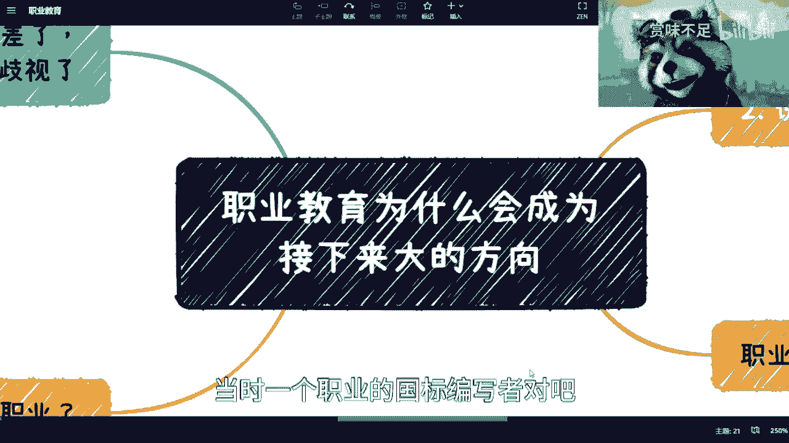
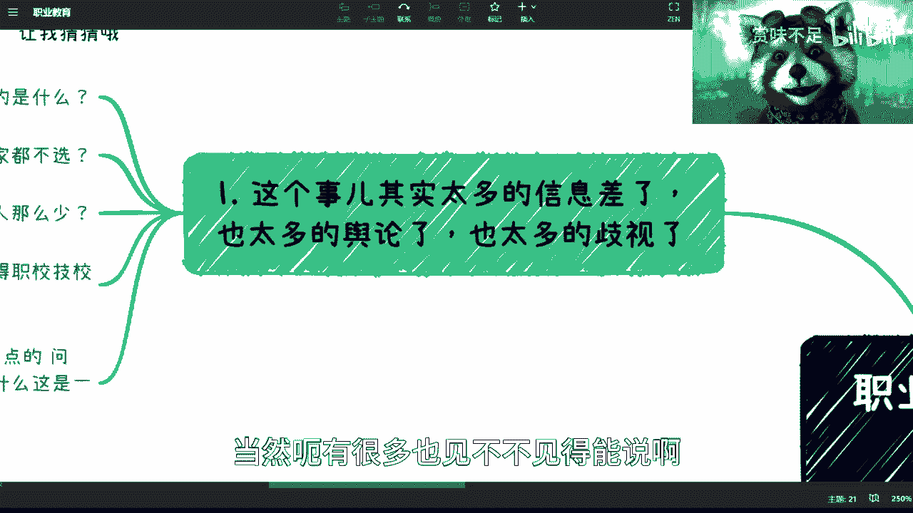
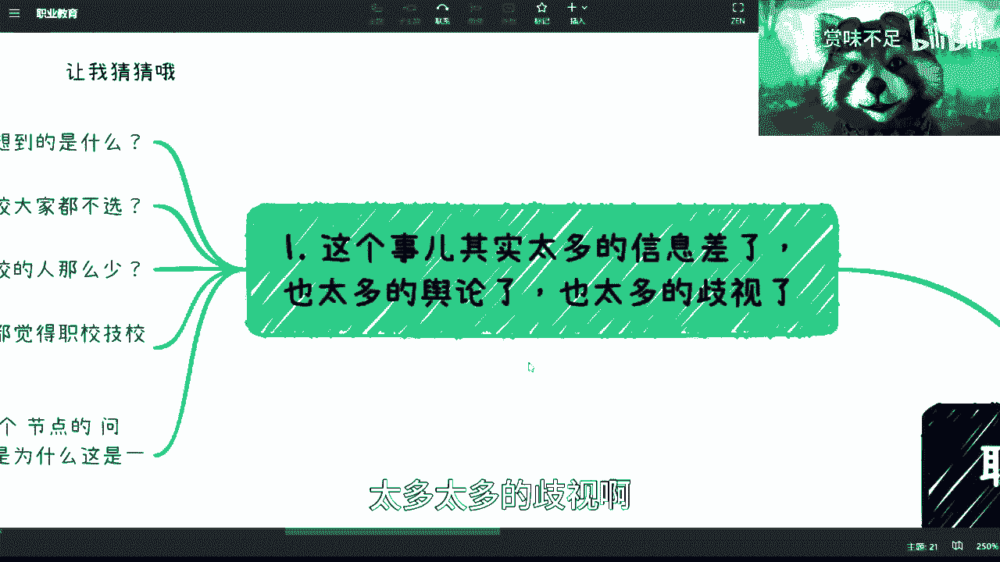
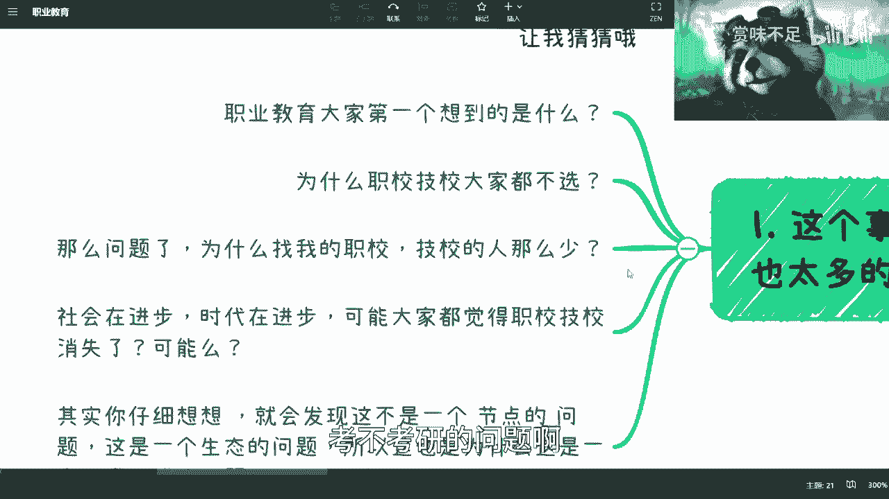
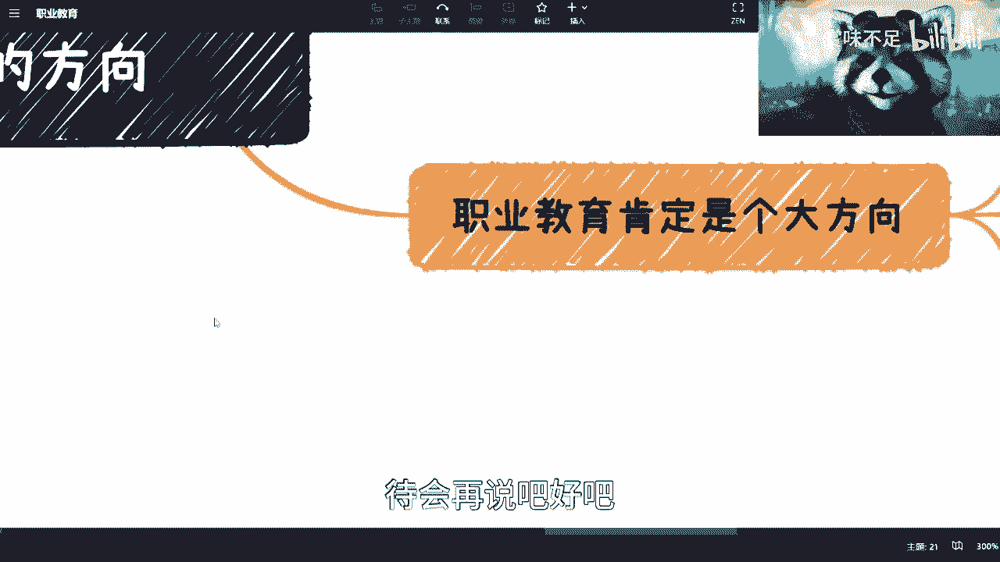
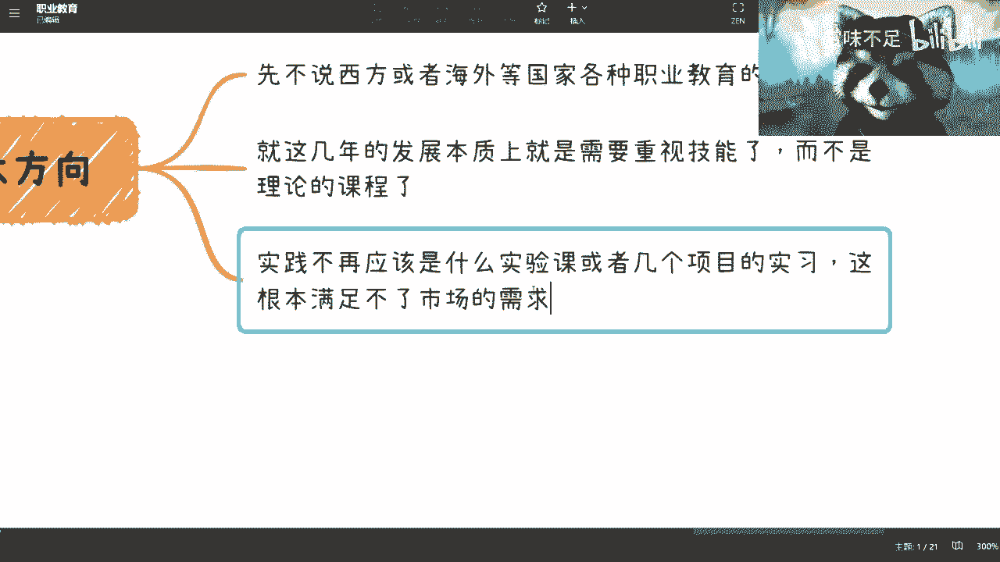
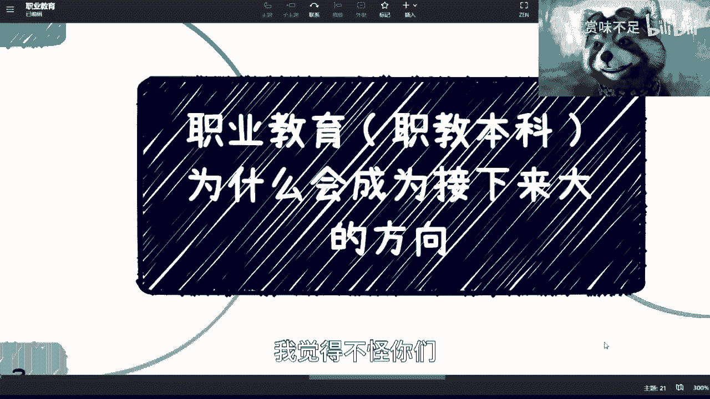

# 为什么要大力发展职业教育 - P1 - 赏味不足 - BV1pM411M7V2

好哦，因为这个好久没讲数字经济了对吧，然后这两天也有小伙伴来让我讲一下，这个继续讲数字经济，然后前两天这个评论也有小伙伴说嘛，就说这个讲一下职业教育啊，稍等嗯，嗯好就讲一下这个职业教育对吧。

嗯然后又有人说了，陈老师，你这个怎么也会讲呢对吧。

这个跟你有啥关系嘞，呃跟我很有关系啊，因为这个首先区块链也是职业啊，也是职业大典里面的一个东西啊，然后呢我呢也是区块链，当时一个职业的国标编写者对吧。

那当然跟我有关系，那当然了，我也看不到全貌啊，我只能跟大家说这个我现在所了解的一些情况。

当然呃有很多也见不不见得能说啊。

咱咱把能说的放在这边啊，首先呢这个事儿啊，我跟你们讲这个事儿呢，其实有太多太多的信息差了太多太多的舆论，太多太多的歧视啊。

这个事情呃，我觉得正好B站这个大家其实看看也蛮好的，这个了解了解啊，只不过毕竟这个不管我们知道不知道啊，不管我们懂不懂这个事实在那个地方对吧，我们不能忽忽视他。

嗯好那我们来看啊，首先你看啊，让我猜猜看对吧，让我猜猜看啊，呃首先呢第一个啊，我们说职业教育大家想到什么对吧，大家想到的是职校绩效对吧，我觉得就不用猜对吧，我觉得打名牌我都能知道对吧，职业教育。

然后呢你们的父母啊，然后你们的亲朋好友，你们的朋友啊，也会给你们在你们生下来，来到这个世界上的那一刻开始，就给你们灌输职业教育是不好对吧，然后职业教育是没有出息的啊，没有出息的对吧啊。

你知道为什么我知道呢，因为我也是这样子的是吧，啊哈哈，这是第一个，第二个呢，为什么职校技校大家都不选对吧，都都不选，就是也也很简单啊，因为你们被灌输了，或者说大众被灌输了这么一个思想之后，那必然不会选。

那为什么必然不会选呢，因为这个事情呢跟后面的找工作啊，薪资啊都挂钩对吧，就像你们现在为什么都要纠结，考不考研的问题啊。

但是呢我相信啊你们看完这一章啊，看完这一节后面的这个我还会讲啊。

因为职业教育不可能只讲这一节的啊，就看完这一节啊，我觉得你们应该对吧，不说改变想法吧，我觉得你们嗯应该对现实认清楚一点啊，那我们具体来讲为什么不选呢，因为他觉得这个家里看不起你啊，亲戚看不起你。

对薪资不好搞啊，不好弄对吧，好第二点第三点，那么问题来了，那为什么现在我这么多年对吧，在外面去沟通，除了我到职校技校去上课以外啊，剩下找我的人其实很少，为什么呢，因为我觉得这个原因也非常多样化。

因为一呢我在上海对吧，整个的信息差可能会导致很多的人找不到我，他也不会找我对吧，因为全中国做这种事情的人多了去了，他不会只找我对吧，这是第一点，第二点是什么呢，就是我客观的认为啊。

第二点是集职校技校的小伙伴没有，真的没有大家专科本科啊，研究生出来这么焦虑，为什么呢，因为大家一方面没有这么高的期望值啊，一虽然说大家可能呃所有人啊，比如说大大部分人，对整个全局没有什么很大的了解。

我觉得也正常对吧，但是呢他们没有这么大的焦虑感啊，为什么呢，因为他们本来就没这么大的预期对吧，不像就是说啊，不像，就是说现在大家这个这个为什么大家很焦虑感，就是因为大家觉得哎你看啊。

我是一个985211，或者我甚至没有98521，甚至我可能还没还没考上研，哪怕我考考上了，也不是一个很好的专业对吧，这是因为大家对于整个的，就是你们手上有的这个牌。

跟市场上面到底应该这张牌打出来会怎么样，你们心里是没有预期的，或者你们你们对整个市场是不了解的对吧，那么我们好，那么我们说职校技少，正因为期望值没那么高，而且话又说回来啊，我个人觉得啊。

你说每一个学校里面，不管好学校，坏学校都有369等，我个人认为啊，就是369等里面摆前60%的人，在职校技校里面如果来说是比较好的话，那么至少人家是有一技之长的，我觉得大部分的专科。

本科研究生的人是没有的啊，这点我觉得毋庸置疑啊，呃我说个可能不太好听的话啊，就是今天我们来面试，我要一个职业工，我要一个能够做事情的人，那么一个一技之长的跟一个清华大学毕业，放在我面前说的不好听点。

就是我不会要清华的那个人，因为什么哦，不好意思，我高攀不起啊，我承认我高攀不起，另请高就啊，另请高明是吧，但是呢你们要明白一点啊，就是我这样招人，我作为用人单位怎么了呢，这世界上我这种用人单位没有了吗。

啊这就是说在我们身边的这样的人少，在我们身边企业可能少，你们投的简历的这种企业少，你们都往字节，别提大企业投，那我们说中国也好，全球也好，这种职业或者说要用工的企业怎么了，死绝了吗，这是啊，灭绝了吗。

不是啊，你说是吧，他们不是不在，而是说由于更多很多信息差导致了我们不知道，你知道吗，那我觉得这个是一点，那我们再看下面啊，你比如说社会在进步，时代在进步，其实职校绩效为什么没有消失。

我就代表着是有需求的，你所谓所谓存在即合理，当然我们也要看它存在的面对吧，你说如果14亿人就那么一两个人存在啊，这个做什么事情，那可能不太合理，但如果14亿人里面有那么123亿人存在，那肯定是合理的啊。

只不过你不知道为什么它合理对吧，好，再往下，所以说呢你仔细想想看啊，包括独生子女啊，啊，包括这个这个这个叫什么农村包围城市啊对吧，包括各个东西，因为你不说国与国之间了，你就是拿国内来讲。

你都56个民族了对吧，你都这么多这个地区了对吧，嗯对还好我没说错，我就怕证据有问题对吧，哎那个对，继续啊，你看啊就会发现这不是一个节点的问题对吧，就是他不是一个说啊，你今天对职业这个比如说你说啊。

你对职校职校技校有认知，它它就能解决问题了，没有这么简单，就他他从上上到下，从教育就是怎么去改变这个思想，怎么去改变这个教育本身，怎么去改变用人单位对吧，怎么去改变整个的一个一个面。

这里回来是个非常复杂的生态问题，它不是一个，就是说单个节点或者，两三个节点就能解决的问题，对吧好，那么这是第一个对吧好，那我们来看第二个，说几个事儿啊，我也能写，我也只能想到这些别的想想。

想到了以后我再补充吧好吧，第一个呢目前情不是目前啊，就近几年，其实整个市场供需双方的需求都是很大的，毫无疑问啊都很大，大到离谱啊，我之前去参加活动啊，我跟你们讲也是的五六十号人对吧。

嗯可能有那么嗯六七十%呢，他是来找工作的啊，然后还有10%是来这个这个这个叫什么，就积累人脉的，还有20%呢就是过来招聘的对吧，就是hr和猎头啊，但是呢你会发现呢，哪怕我是那个五六十人的活动呢。

他也match不上啊，就是说整个供需双方，你哪怕把它们放到一个盘子里面，他们也卖ch不上，为什么呢，因为大部分情况啊其实是双，就是就是客观的说吧，大部分情况是双向看不起，双向看不的原因是什么呢。

是因为找工作的人眼高手低啊，就觉得我靠，我他妈的怎么滴都是个研究生对吧，你妈这么渣的起，我必须要去BAT是吧啊，这是一种，还有一种呢，就是企业这边呢他妈也眼高手低，为什么呢，因为企业按照我们以前说法吧。

就是说你明明要招个这个技术工啊，或者说要招一个就是这种处熟练工对吧，你非要用那种就就这样，就就拿那我说技术工作很熟练工，不是说大家觉得就就就就那种什么工人啊，不是啊，我就很简单，你比如说你招个开发对吧。

你明明只要这个开发去做一些这个页面上，UI上的工作，你只要他修修小bug对吧，你明明就是要招个熟练工，但是呢你面试时候呢非要去千般刁难，万般刁难，搞得他妈像招个CPU一样对吧，其实我跟你讲。

两边都是这个不知道什么来的毛病，反正就这个毛病啊，毛病大的很啊，脾气大的很，你知道吧啊，而且你说了还不听啊，说了还喷你啊对吧，对我不懂啊，我承认我不懂啊，你们我知道你们有人已经碰过我了，我我回答你们。

我用我回答你们的心声是吧哈哈，第二点就是上海之前，你们看啊，上海作为一个标志性的一线城市对吧，中考的通过率在50%到68%，什么意思呢，什么意思呢，意思就是有一半的人上不了高中对吧，那什么意思呢。

就是一线城市有一半的人上不了高中，你能懂吗啊我这话就已经不能往下讲了是吧，就已经这个样子了啊，那我就问嘛，我就问嘛，怎么了，人家不不能人，人家以后是不活了吗，人家以后是不赚钱了吗，人家以后是是怎么了。

都都都种田吗，对吧啊，唉我跟你们讲啊，你们别觉得我在危言耸听，或者你们别觉得跟你们没有关系，第三点叫做我就拿区块链来讲，因为毕竟我是写过国标的对吧，好新区块链，新能源等新领域来讲对吧，我也是参加过啊。

我少的不说吧，十几家高校对吧，专业建设啊，课程啊啊大大小小的职业职校技校啊，当然98521，我承认我没参与过啊，这个一本到三本我也都参与过对吧，各个大大小小的高校是吧，我跟你们说这个事其实很复杂。

为什么呢，因为就别的咱不说啊，细节我们回头我看看怎么跟大家整理啊，别的咱不说，咱就说一点，以前互联网20多年以前产业很多年，他其实你会发现职业这个东西啊，技能这个东西它是有传承性的。

但是在互联网来了之后呢，由于很多的这种虚拟的技能，它不像一个电工钳工，你是一个就是一个嗯就很实在的一个东西对吧，但虚拟技能呢因为迭代太快，你们也知道对吧，只要但凡做过技术的，但凡做过项目的都知道。

就迭代太快，导致什么呢，导致就是你反应不过来，因为你想想看啊，你就拿高校来讲，专科3年，本科4年对吧，我给他们去做这个这个专业，我当时就会问他们，我说我说那你高校都会问我就业情况怎么样。

我说这个事情很尴尬，为什么呢，因为我跟你说，好也好不好也好，你专科起码3年对吧，你本科起码4年，那你的意思就是要让我预测一下，3年后和4年后的情况，那我怎么知道呢，对吧啊。

那你你3年后4年后大趋势我还跟着跟着，跟你能给你预测预测，你跟我说单纯一个领域啊，你跟我说怎么样，那我咋知道呢，是吧啊，所以说你会发现就是在这种很快的节奏之下，你说从一个设立专业，因为你去申请专业。

怎么地也得也得一个半一年半载啊，然后到你本到你本科4年，专科3年，也就意味着你，而且你要想啊，学校里面的知识是滞后的对吧，哪怕现在是区块链，你就算我给他们出壳，我也不能保证我出的东西在34年后还有用。

谁知道呢，就是吧啊，那所以说呢你会发现一个点是什么呢，就是你整个的东西是跟不上整个社会的对吧，你随便怎么走啊，34年后出来，你起码34年后毕业吧对吧，再加上这个申请专业，整个时间5年过去要命了。

5年对吧，这这这这现在5年还了得啊。

你GPTGPT55天就能给你天天翻地覆，还5年呢。

你说是吧啊，那个三啊，就职业我跟你们讲啊，既然都说职业教育，我觉得得要define对啊，你得得要得要得发展清楚，就定义清楚这件事情，你比如说大家看上去啊，中国岗位，我跟你们说啊。

你们去看中国的有个东西叫岗位大点啊，我知道我知道大部分人其实不知道，因为你们根本就不关心啊，岗位大点，然后呢，你们会发现你们所做的东西，其实都是在岗位大典里的，就是你们所有的东西其实都是职业岗位。

你们明白吗，都是职业岗位，都归属在职业岗位里，别觉得对吧，好像是什么蓝领白领不存在的啊，这这个我都不知道，是几十年来给你们传传说的传达的这个思想了，你知道吧，然后这是第一点，第二点呢就是既然都是职业。

我跟你们讲，就别去分369等，那你说为什么会分呢，哎其实也简单，因为整个社会是在发展的嘛对吧，那以前可能是会有369等对吧啊，那你说现在这个随着啊，我说错了，就以前其实没有这么369等。

但现在因为整个比如说这个高校扩招啊对吧，或者其他的各个方面啊啊嗯还不过最近嗯，啊可以啊，对啊等等我待会儿再回吧，我先跟大家讲完啊，这个这个其实现在由于互联网啊，包括很多高精尖啊，出来之后呢。

其实慢慢慢慢就有369等了，而且呢其实呃扩招也好，包括各个方面，包括家庭教育啊对吧，上一代所灌输的思想啊，其实都有很多，就是说导致了这么个369等，但是你说它本质上是不是有369等。

我觉得也没有什么很大差别，怎么了，那大家都是学习一个技术，怎么了呢对吧，谁告诉你，我做一个电工，就比你做一个互联网工程师来的弱，这个差了呢我也不明白了，你说是吧，你平时不用电吗，难道啊对吧。

然后一技之长呢，我觉得肯定是需要的，其实就是他们不是不见了，只不过呢我觉得大很多时候呢，我们所在的圈子啊，包括你就是大家看到很多东西呢，其实就是就看不见啊，但并不代表他没他没有，你知道吧。

而且呢其实你会发现我在这个地方诶。

我看一下我后面是不是提了这个事啊，对对对。

待会再说吧，好吧，第三点就是所以你会发现呢，就是就是不管是就是上面的这个这个部位对吧，学校啊，这个家长啊，学生啊，生态啊，企业啊，其实每个环节他都需要改变。

包括我们说的培训啊，他都要改变，因为职职业教育。

职业教育，接下来呢我们其实是叫做什么，我这边提一下叫职校本科嗯，职校，叫本科。

当然我我我不知道是不是会有职校，专科或者别的东西，这个我现在还不清楚，但职校本科是提了很多年了，提了很多年了啊，那职业教育我们再来看啊，就是呃你们但凡了解过，就会知道。

西方及海外很多国家其实都是类似的这种方式，但是他们呢各有各的这个教育体系，但是呢其实综合的目标其实是一样的，是什么呢，就是一定是要以就是实际技术，以实际掌握掌握东西为主的啊这么一个教育。

而不是说是纯理论的这个教育啊，这第一点第二点呢就是说这两年的发展本质呢，其实你会发现就是我们是需要重视技能的，而不是重视理论课程，因为这个事情不用我讲对吧，你们所有人都会有感知，就是如果今天不是这样。

或者这两年不是这样的，那么你们现在就不会这么焦虑，因为你们知道你们到底学会了什么，而现在为什么你们会这么焦虑，我说的直白点，就是，因为你们根本就不知道你们手上学历，学的是什么，因为你想啊。

你所谓会一个东西是什么意思，会一个东西，就是说你知道你掌握了他什么样的技能，你掌握了他什么样的一些，就是类似于像门槛或者说是一个技术，而你也知道它到底能解决什么问题，但是现在为什么大牛很焦虑。

是因为你们觉得你们学的互联网，你们学的通信，你们学的这个这个这个各种各样的东西对吧，包括光伏啊，新能源啊对吧，包括包括包括什么啊，土木啊对吧，你们会发现诶这个东西我学的是，那我能解决什么问题呢。

我能解决什么痛点呢，我能解决我到底是去哪里干活呢对吧，哪个地方要这个东西呢对吧，其实本质上你会发现你学的是一套理论，但这套理论也许过时了啊啊啊也也许不过时啊，但是不管怎么样，这个东西。

它不能称之为一个真正的可用的技能啊，这就好像这就好像你们可能还在练功，这个比如说以那个倚天屠龙记的这个叫什么，乾坤大挪移对吧，这就有点像什么呢，你们可能诶学完4年练到了第一层。

就快要可能再过个几年工作呢，你就能练成第一层了，但是你压根到现在还没有练成第一层，你知道吗，所以说就是就是有这种就是说诶好像学了，但好像又没有学的这种感觉啊，那么最后呢。

我觉得就是说为什么要来推整个职业教育呢，是因为本质上已经很清楚一点，就是整个的实践不能再与工业区脱节了，因为我们一般把它分成工业，工业这个工作，这个工业界跟那个叫什么学术界嘛对吧。

你不能再跟工业界脱节了，这是第一点，第二点是你单纯的实践，你不是通过几个实验课，几个实习项目就是能实现的对吧，咱先不说这个实践课和实习项目，现在很多很水对吧，但是你会发现就算不水。

你其实也不见得能学到什么东西对吧，所以说呢本质上来讲，就是说你我们需要的人出来，他得要满足这个市场的需求，而当下的情况是什么，是用人单位的，也也的确眼高手低啊，但是就算他不眼高手低啊。

我们说很多的人才出来，他也是不满足市场需求的。

但是呢我觉得综合来讲啊，这个事情不怪你们啊。

我觉得不怪你们，就是这个事情就可能还是整个的一个这个这个，发展中吧啊发展中啊，但是呢就是说你们一定要明白，就是说呃他接下来为什么要大力发展，5年十年的规划，为什么要大力发展。

是因为我们刚刚说的这边的这个问题，你不可能不不解决啊，或者不可能再不解决了，你再不解决你，你每一年这么多人match不上，这么多人，双向找不到怎么办啊，我就问你们怎么办是吧啊。

那么为什么刚刚说这个这个你们要好好想想呢。

是因为你们听完这一个，你们应该就会明白，你们手上所有的就是有的东西，跟你们所被灌输的三观，能用的时间已经不长了啊，能用的时间不长好吧，我就只能点到为止。

