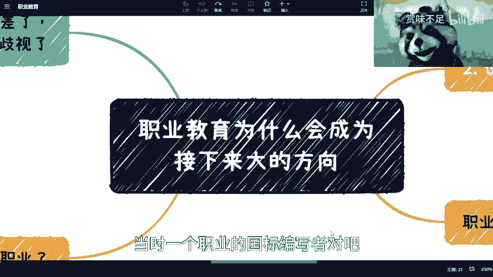
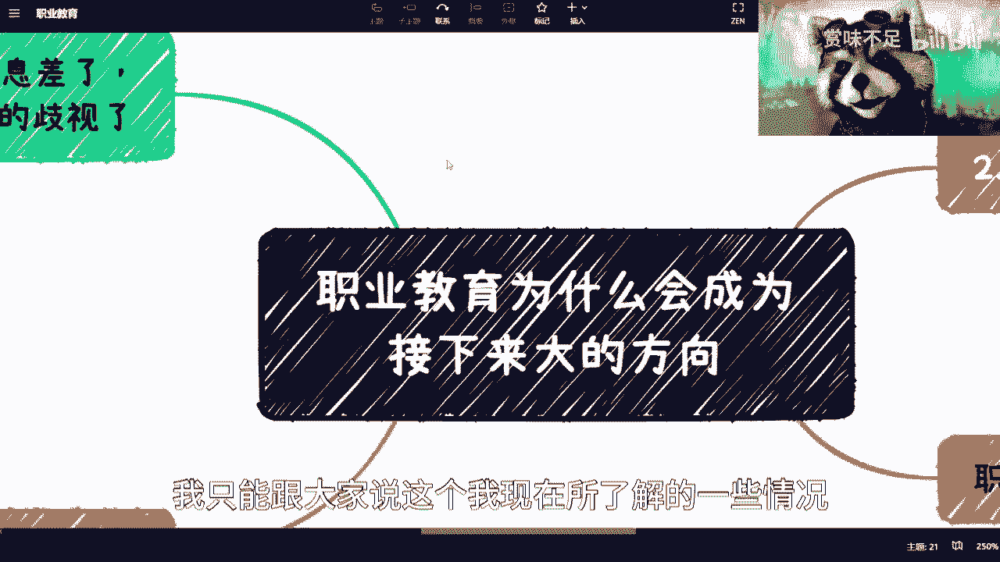
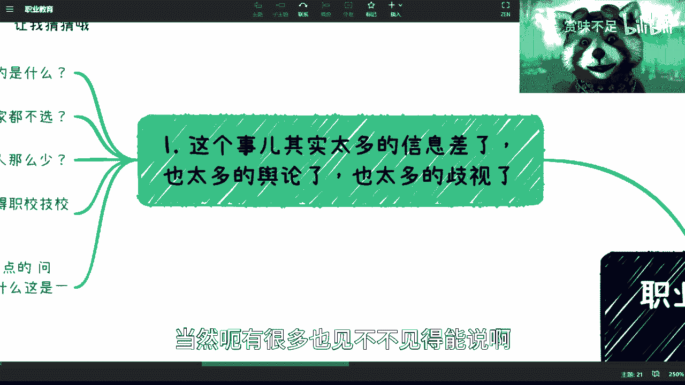
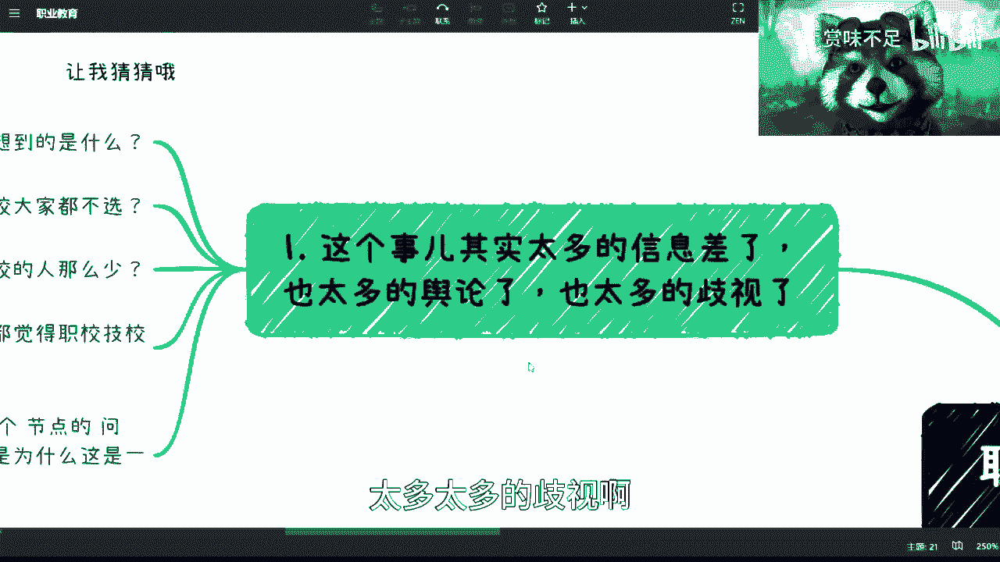
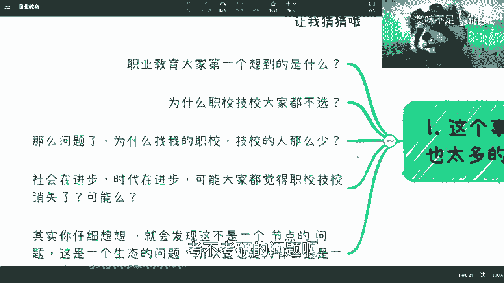
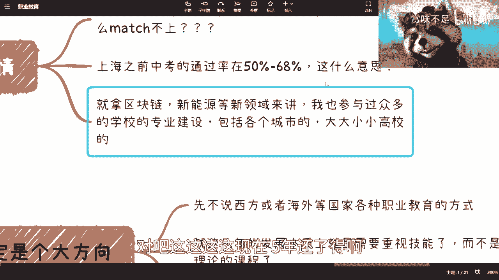
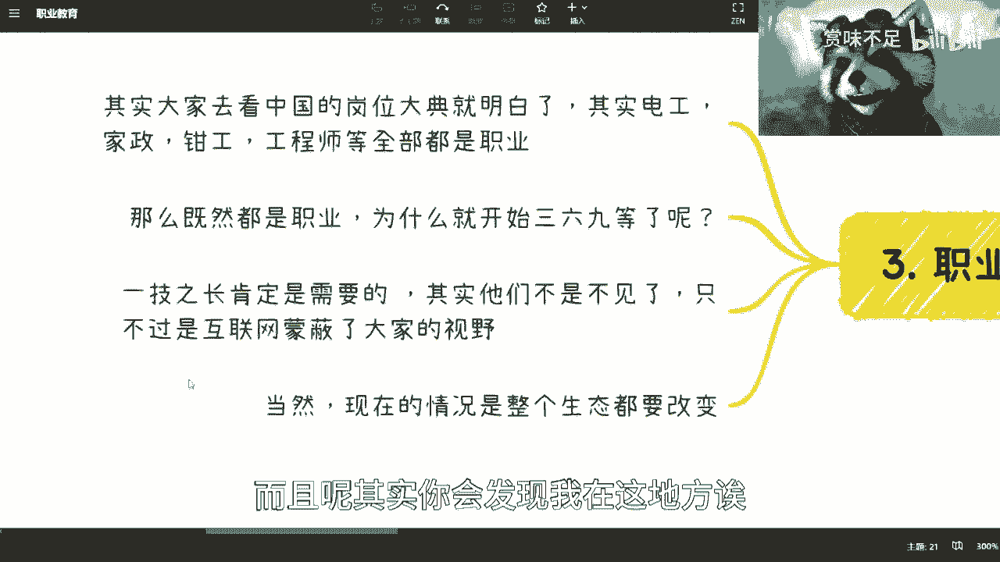
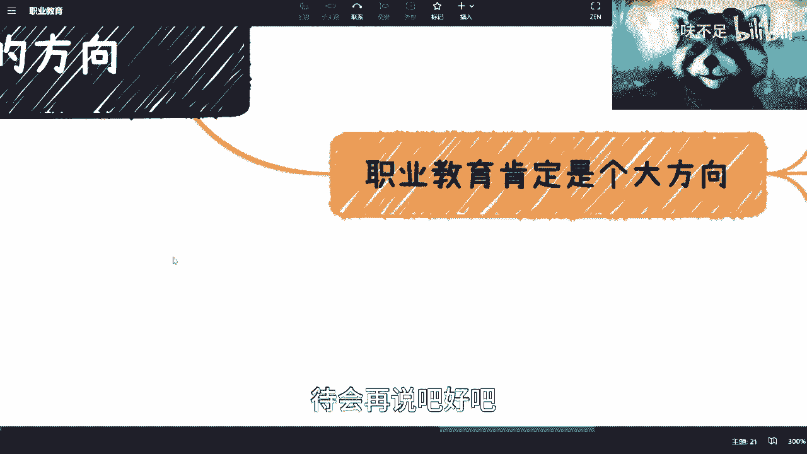
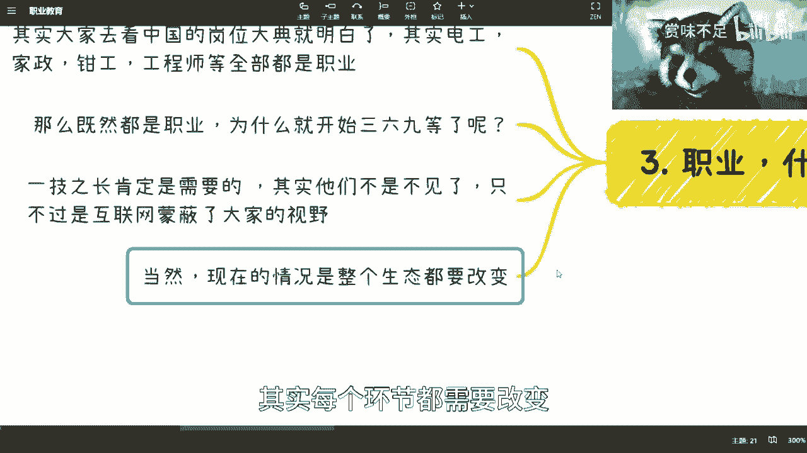
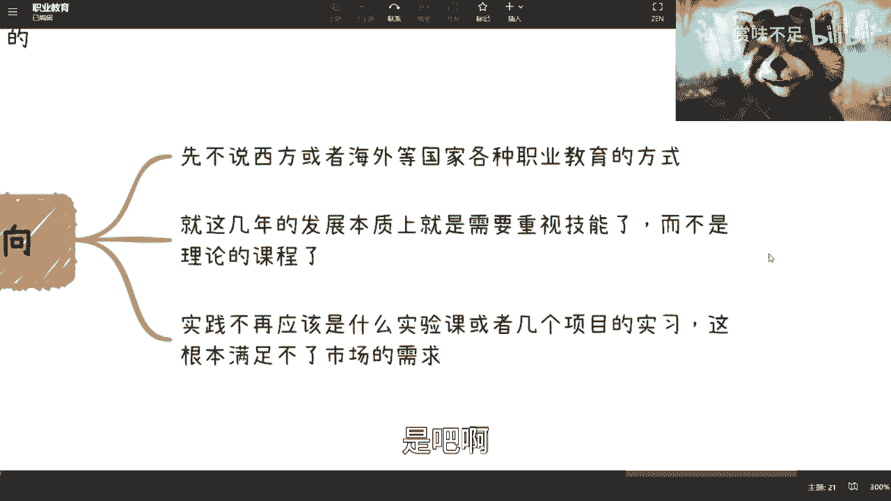

# 课程 P1：为什么要大力发展职业教育？ 🎓

在本节课中，我们将探讨职业教育在中国社会中的现状、面临的挑战以及未来发展的必要性。我们将从多个角度分析职业教育被忽视的原因，并解释为何当前需要大力推动其发展。

---

## 职业教育的社会认知与现实困境

上一节我们介绍了课程概述，本节中我们来看看职业教育在社会中的普遍认知及其面临的现实困境。

长期以来，职业教育常被等同于职校或技校，并伴随负面标签。社会普遍灌输的观念是：职业教育没有出息，选择职业教育意味着被亲友看不起，且未来薪资和发展前景不佳。

这种观念导致许多学生和家长在升学时回避职业教育路径。与之类似，当前许多本科或研究生毕业生对就业市场感到焦虑，因为他们对手中的“学历牌”在实际市场中的价值缺乏清晰预期。

然而，职业教育并未消失，这本身就说明其存在合理的社会需求。中国有14亿人口，若职业教育仅服务于极少数人，或许不合理；但若有数亿人需要它，那么其存在必然有深厚的现实基础。

---

## 就业市场的供需错配与认知偏差

在了解了社会认知问题后，我们进一步分析就业市场中供需双方的错配现象。

以下是当前就业市场中的几个核心矛盾：

1.  **供需双方需求巨大但匹配困难**：招聘活动常出现求职者与岗位无法匹配的情况。这往往源于“双向看不起”——求职者可能眼高手低，非大厂不去；而企业招聘时，常对基础岗位提出过高要求，仿佛在招聘顶尖专家。
2.  **一线城市的升学现实**：以上海为例，中考普高录取率在50%至68%之间。这意味着近一半的初中毕业生无法进入普通高中。他们未来的出路与职业技能培养紧密相关，这并非小众问题。
3.  **新兴领域技能传承的挑战**：在区块链、新能源等新兴领域，技能迭代速度极快。传统教育体系（专科3年、本科4年）难以跟上这种变化。从申请专业到学生毕业，可能已过去5年，而技术环境早已天翻地覆。

---

## 职业教育的本质与重新定义

接下来，我们需要正本清源，重新理解“职业教育”的本质。

首先，所有工作岗位都归属于国家《职业分类大典》。无论是所谓的“蓝领”还是“白领”，其本质都是社会分工中的一种职业。人为地将职业分为三六九等，是特定历史阶段和社会观念造成的。

其次，掌握一技之长是职业教育的核心。许多职校、技校中排名前60%的学生，往往具备扎实的实践技能，这正是许多普通本科甚至研究生所缺乏的。从用人单位角度看，一个能立即上手解决问题的技术工人，其实际价值可能高于仅有名校理论背景的毕业生。

关键在于，社会需要各种技能，电工的重要性并不低于互联网工程师。许多技能型岗位并非消失，只是它们存在于主流视野之外的广阔市场中。

---

## 发展职业教育的系统必要性

最后，我们来总结为什么必须从系统层面推动职业教育发展。

职业教育改革涉及一个复杂的生态系统，包括教育主管部门、学校、家长、学生、企业以及培训机构等多个环节。每个环节都需要改变。

发展的核心方向是推动**职业教育与普通高等教育同等重要**的理念，并探索如“职教本科”等新模式。其根本目标是让教育内容与工业界实际需求紧密结合，培养以掌握**实际技能**为主的人才，而非仅注重理论课程。

当前许多毕业生焦虑的根源在于，所学理论知识与市场所需的实践技能严重脱节。公式可以表示为：

**个人焦虑感 ∝ (所学理论 - 市场所需技能)**

大力发展职业教育，就是为了解决人才供给与市场需求长期错配的问题。如果再不解决，每年将有大量毕业生无法找到合适工作，同时大量企业找不到所需技能的人才。

因此，个人持有的传统学历观念和职业价值观，其适用期已经不长。认清现实，重视技能，是应对未来变化的必要准备。

---

## 课程总结

本节课我们一起学习了职业教育在中国面临的认知困境、就业市场的供需矛盾，以及重新定义职业教育的必要性。我们认识到，发展职业教育并非单一环节的改革，而是需要社会各方协同推进的系统工程。其根本目的是让教育回归实践，培养真正满足市场需求、具备一技之长的人才。