# 为什么说商业环境越来越恶劣，越来越不友好 - P1 - 赏味不足 - BV1Ce411X7TK

哈喽大家好啊，今天礼拜天啊，那我们来讲一个故事啊，双休日都是来讲故事的是吧，那我们为什么说这个商业环境越来越恶劣，越来越不友好，呃你看昨天晚上我也改了我的置顶对吧，那并不是因为我很care。

而是说这个我就算不care，我也得表明我的态度对吧，呃先说个以前的事情啊，以前的事情是什么呢，就是呃我就这么说吧，嗯就是也许很多人觉得啊，这个学校里面教授啊啊什么专家啊对吧，都很牛逼啊，然后怎么样子。

但是我可以跟你们讲啊，牛不牛逼，我不知道啊，这个人品好不好，这是最重要的对吧啊，嗯我就这么说吧，啊我以前知道啊，就是他可能不知道啊，但是我自己知道，就是我呢去了一个地方要合作。

然后呢啊这个有人呢还要就像我那天跟你们说，我去中关村一样的，就以前我可能就跟大家说我要去什么地方，然后呢还专门有人打电话过去啊，然后说我这样不好啊，这个这个人这样不好，那个人啊，这个人那样不好对吧。

然后就是死活啊要把我这个单子弄黄掉啊，然后呢他不知道是什么呢，就是合作方这边毕竟人家是个大厂啊，人家也不是那种就是听一面之词的对吧，但是人家也跟我关系还不错，然后就跟我说了，他说啊那个谁对吧。

然后连夜打电话过来说干嘛干嘛干嘛啊，然后我一听哦，某某某高校教授啊，就我当时还年轻嘛，我当时大概也就二十四五吧，了不起了啊，我就在想哦，就就我这年龄啊，就我这认知啊，我都已经可以威胁到人家教授了。

哎我这自我骄傲一下是吧啊对啊，所以我们回到现在2023年了，我们为什么说商业环境越来越恶劣，越来越不友好，我们来看一下，我正在跟我朋友讨论养仓鼠的事情，笑死我们来看一下。

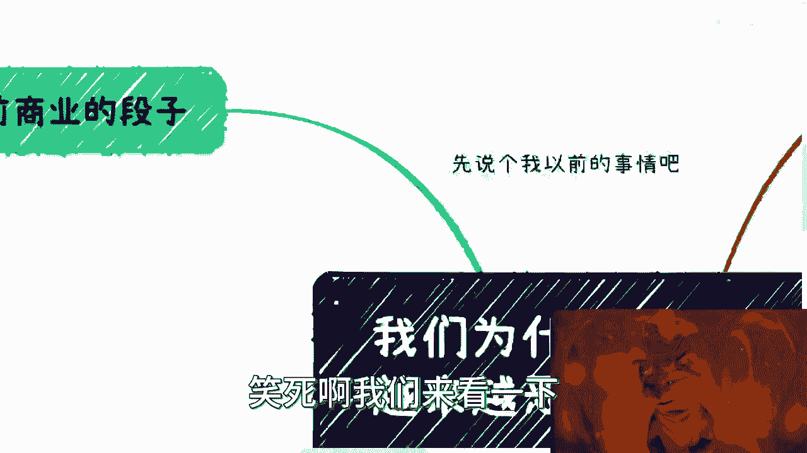

首先先说说以前的段子啊，呃以前投资行业啊，我们去融资，一般呢都会说起一个段子，说什么呢，就说嗯稍等我看一下我的这个C盘容量啊，昨天就是录到一半，他妈的把我卡掉了，我真的好烦啊。

嗯OK就是我们以前一直说一个段子，那就是说你的idea啊，如果被某个大公司啊，不说不说都懂对吧，我就不说大公司，大公司叫什么名字了啊对吧，就是被某大公司抄袭了怎么办啊，然后呢我还记得我最早毕业的时候呢。

我领导啊，当时跟我说对吧，你知道google吗，你知道微软吗，啊他们说当时是怎么说呢，我记得很清楚，就跟我说，他说哎人家一个人当十个人用啊，效率很高对吧，怎么样怎么样怎么样啊，好然后呢，你看哦第一个啊。

第一个说明什么呢，说明就是说抄袭已经成风了对吧，而且关键是没人监管啊，你这还拿出来当段子，这说明什么，说明到处都是抄袭对吧，甚至还以抄袭为荣啊，在很多年前就已经是如此了，所以说呢你看啊。

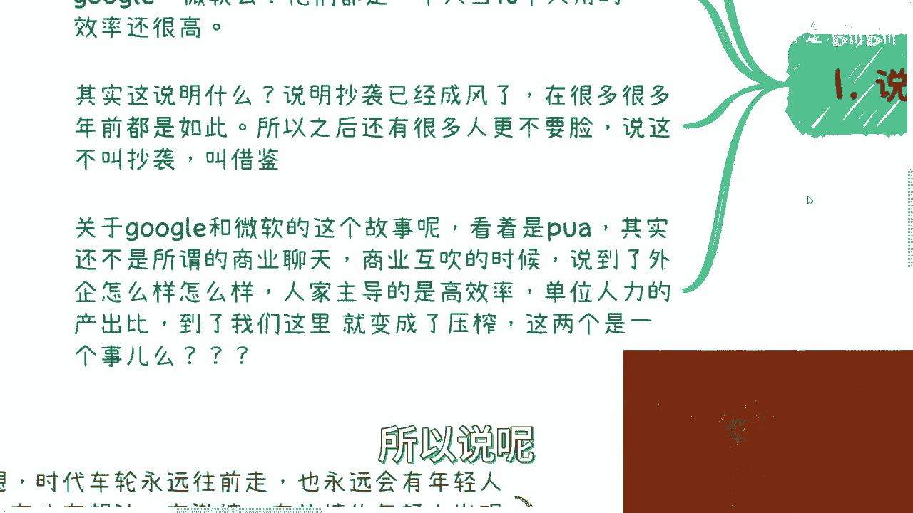

之后一直发展到现在，你但凡没人监管，那这些人只会越来越不要脸对吧，而且你看啊，随着时代推移，他会告诉你们，这不叫抄袭，这他妈叫借鉴，真的我就发现这个人不要不要脸。

到什么程度才能说出这种话啊，那么关于第二点啊，你说关于这个google和微软这个故事呢，哎呀我后来想想也他妈很，你看着是PUA，但其实他PUA这个只是一个结果，但它为什么会PUA。

你想看就是他为什么会得出这个结论，是因为还不是因为那些所谓的他们在商户，商业聊天的时候，商业互吹的时候啊，说到了人家外企怎么样怎么样怎么样，对吧哈，人家我跟你们讲啊，人家主导的是高校对吧。

人家主导的是高的效率啊，单位人力单位时间，单位人力的产出比，我们来到我们这就变成了卧槽，人家一个人当十个人用，我们就压榨你，必须996007，这他妈是一个事吗对吧，那当然咱又说话又说回来啊，话又说回来。

就是这个世界上有多少事情背后的故事，大家是知道的对吧，大众所知道的不都是只是表面的事情吗，这就像什么，你知道吗，我又我又想起一个故事，这就像以前啊，我还记得某本书上面啊。

说什么说什么微软早年怎么怎么改革，怎么怎么改革的，然后呢就是人家也就不太说，因为毕竟人家很多这事情跟自己没关系，何必去说呢，对吧，然后我们就找了一些微软早年的，人家说根本他妈不是这样的，就他妈瞎扯。

对不对，但是问题是你这个书出了你误导多少人啊。

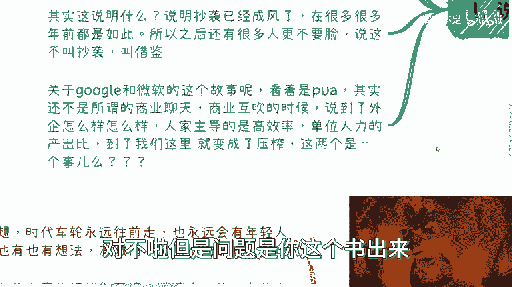

唉但是也没人关心啊，也没人关心啊。

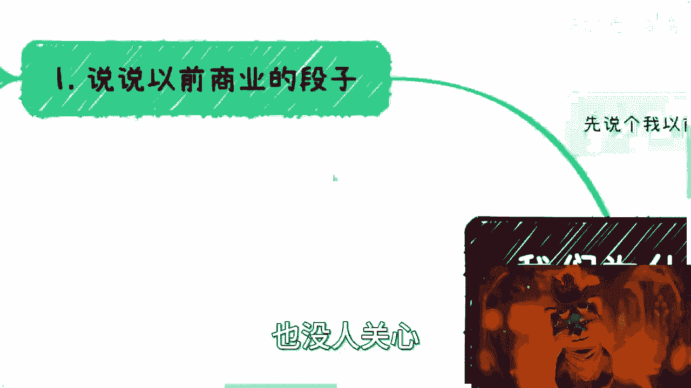

好然后我们来说今年年初啊，GBD盛行的时候，我们当时也说一直在说劣币驱逐良币。

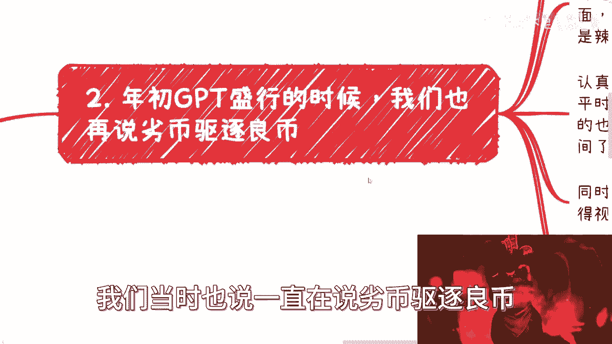

为什么，你想想看啊，很多人当时提到GBT可以帮助生产内容，甚至可以自动生产视频对吧，我相信这个我不用我说，你们也都听到过，对不对啊，可以大量批量的进行上传，对不对好，那我们来看啊，但我们看到的是什么。

我们看到的就是一个更加扭曲的一个商业环境，就是如果来说啊，我们把商业比作成一个人对吧，你拟人化对吧，这人已经千疮百孔，已经是血流光了，你知道吗，就苟活着，就这种感觉对吧，他更加扭曲，为什么。

因为所谓创造者经济，创作者经济，创作者经济本身也是商业当中的一个环节，但是你为什么越来越难啊，两个方面，第一方面是平台扶持整，无论什么平台，我不是特指某平台对吧，无论什么平台，他扶持越来越垄断化。

越来越头部化对吧，另外一方面就是垃圾内容太多，你认真做的，能认真做的人，你得有策划，要拍摄吧，要剪辑吧对吧，我其实平时也看到很多吃播对吧，很多人视频做的真的很好，真的很辛苦，每天剪辑到半夜。

他生病还在那边剪辑，但是他就没有量啊，怎么办呢。

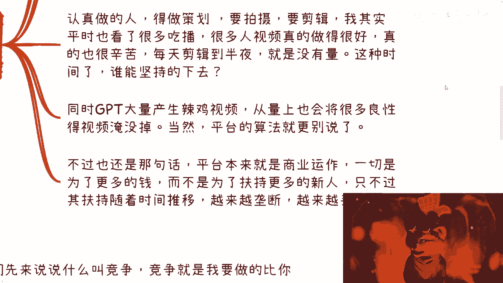

我跟你讲，这种时间长了，谁坚持的下去啊，是个人都坚持不下去啊对吧，那你不是说我兴趣爱好，我他妈就算兴趣爱好，我也坚持不下去，为什么，因为你是一个人做事情我就想得到认可，不是说我一定要赚到钱。

但是我钱也没有练，也没有，我图什么，对不对，那么你同时GBT大量生产垃圾食品，你从量上也会将很多的良性的视频淹没掉，为什么，因为人家认真做一个视频，一个礼拜做一个，垃圾视频，一天生产100个，怎么弄啊。

对哦你说平台会下架的，是会下架的呀，你100个视频里面下架80个，他妈的，一天还有20个，你怎么搞啊。

对不啦，看不到的呀，哦当然了，我这个地方我也再说一句，我不是说垃圾视频一定是那些小姐姐跳舞，或者说什么什么小姐姐吃饭对吧，或者说就是就是有点擦边的对吧，或者说就就贩卖焦虑的，并不是因为我说实话啊。

我也看到过对吧，你擦边的也好，小姐姐跳舞也好对吧，或者说贩卖焦虑也好，人家做的很好的，就是你能看得出来他用心的对吧，你说跳舞啊，你说A跳舞跟B跳舞是大家都跳舞能一样吗，不一样吗，用不用心对吧。

有没有做过功功课，有没有说自己真的是说有一定的呃，这个这个功底或者怎么样才看得出来的，不是说所有跳舞，不是说所有的这个这个穿的少的，就一定都都不好对吧，也不是他同样的它里面就同样的。

他们那个里面也会有劣币驱逐良币的，一样的道理呀对吧，但是我们话再说回来啊，不过你本身来讲啊，你不用指望平台是什么，因为为什么，因为平台本身就是商业运作，它一切就是为了更多的钱。

你不用去跟平台去讲任何东西，因为你跟平台讲，就跟你跟资本家说，你要来同情我，你要从我的角度出发，这他妈不是对牛弹琴吗，对不对啊，而不是就说他不是为了跟扶持更多新人，他只不过就是说扶持随着时间的推移呢。

他越来越垄断，越来越头部化。

你知道吗，这个就是就是你不能说这是什么原因，你或者你也不要去探究这什么道理。

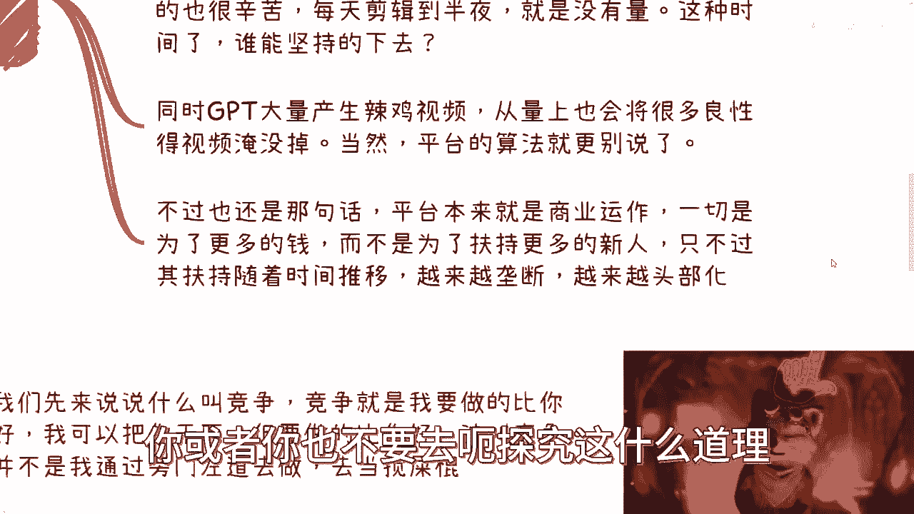

这就是整个就是说商业运作到今天，或者人类社会运作到今天，它就这么一个就是人性的一个一个一个，一个一个一个延续性吧。

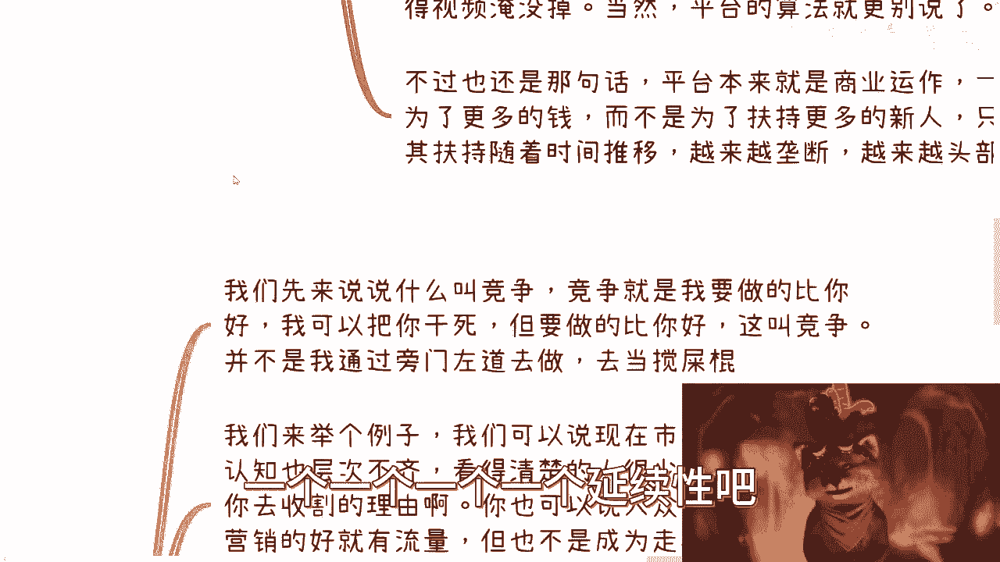

他就这个样子对吧好，然后第二点啊，我们来说为什么越来越恶劣啊。

你看啊，我们先来说说什么叫竞争，竞争就是我要做的比你好，你明白吗，这叫竞争啊对吧，就我发现很多人他不明白什么叫竞争，到现在去竞争，全部变成就是就是背后捅一小刀子，这他妈叫竞争啊，然后我这边左边举报你。

右边举报你，这他妈叫竞争对吧，就是我可以把你干死，我就这么说，我可以把你干死，我可以把你干得倾家荡产，但是前提是我要做的比你好啊对吧，你说我干你，我不留余地，可以，我认可，这叫竞争对吧。

这个叫心服口服对吧，你不是说我去通过旁门左道，我他妈去当搅屎棍，我把整个市场搅得越乱越好，反正他妈的我我做不好，大家也别这样，别这样做好不是这种逻辑啊，啊对吧好你你想想看啊，我们再来讲。

我们再来举个例子，你说我们现在市场很乱，老百姓认知认知也参差不齐，你看得清楚，人也很少，这没毛病啊，但是这不能成为你去，就是张口就来收割的理由啊对吧，你也可以说大众是看看营销的，看重营销，谁营销的好。

谁就有流量，这我也认可对吧，但是这不能成为你就是因为大众这样子，所以你故意要走极端博眼球的理由啊，当然啊以上这些你要问我从商业角度来讲，我有没有问题，我觉得毫无问题，我上上期视频我就说过了，没有问题。

商业上面没有对错对吧，但是你越是如此下去，你抄过来，我抄过去，你举报来举报去，我只靠营销，你也只靠营销，大家一切都他妈是靠靠靠靠谁吹的打，那么你对客户没有实质性帮助，这就是个螺旋下坠下坠啊，你明白吗。

就是早晚大家都要一起同归于尽的，你懂吗啊，就是我跟你们说的画饼也好，我跟你们说的怎么样也好，是因为你们只能基于现在的商业逻辑之上，先存活下去，先让自己赚到钱，但并不是说你们一定需要。

你们内心不知道哪些是好的，哪些是不好的哦，很多人喜欢说兵不厌诈，对是不厌诈，发现，现在市场上根本就没有正规的战争了，你所谓兵不厌诈什么意思啊，意思是说你在整个的一个历史长流当中，你要去做一些进斗争对吧。

你要怎么样子，你可以使用一些小手段，你可以怎么样子，但不是说他妈的全部，你就像你看一部电视剧，你看个电影从头到尾全他妈是炸，那最后一题炸了算了，对不对。

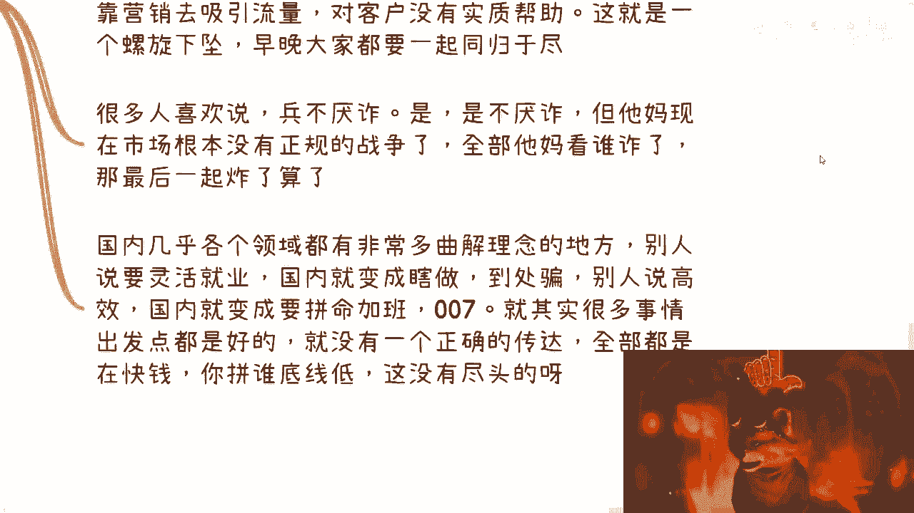

就你这样子往下走，所有人只会有只有一种结果啊。

国内我跟你讲，而且国内几乎各个领域，他都有非常多的曲解理念的地方，你到某些人嘴里就变成了什么瞎转，到处骗啊，别人你别人说高效高效率对吧，到国内就变成什么拼命加班007啊，对不对，就压榨啊。

这其实很多事情你要明白它的核心是好的对吧，他的核心没有毛病啊，但是你会发现没有几个传达正确的思想的，传达正确思想都被良币，都被劣币驱逐掉了，用户也看不到啊，啊全部都他妈在快钱啊，拼谁底线低，我跟你讲。

拼谁底线低，没有尽头的，你不要以为你底线低，比你底线低的人多了去了。

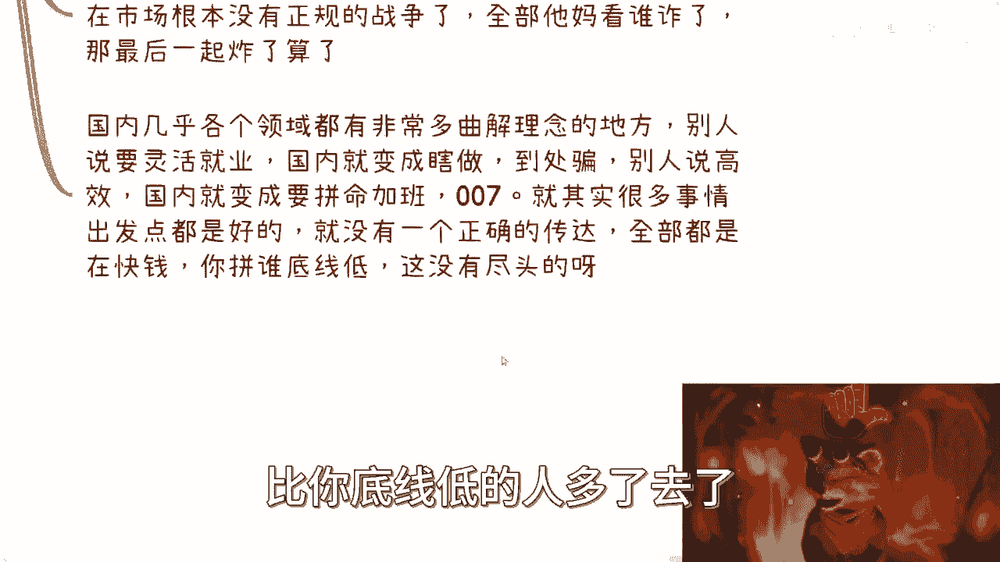

对不对，没有尽头的呀。

啊然后你看啊。

第三个我跟你们讲，时代是往前走的，人呢也是往前走的，这意味着什么，意味着我们要以发展中的眼光，要以整个全局宏观的眼光去看待这个事情，什么意思啊，意思就是说时代车轮永远往前走，也永远会有年轻人出现。

而这些年轻人当中也不乏会有很多有想法的，有激情，有热情的，对不对，好，那么我们往下看啊，他们当中有些人真的是很想做事情的，而且是踏踏实实做事情的，呃当然也有一部分人从小就懂得尔虞我诈，有的人底线很低。

有的人可以不择手段，有的人唯唯诺诺，有的人就是老实人，被人拿枪指着的对吧，各种人都有啊，好但是在这样的欢迎商业环境下面，我们可以看到有人赚到钱，或者有人小小小成功过对吧好，有人赚到。

也就意味着有人总有人赚不到，但是无论怎么样，你会发现我们就是这些所谓的成功者，或者这些所谓的赚到钱的人，大多都是劣币在驱逐良币，为什么，因为在这种商业环境下面，只有劣币，它的赚钱的可能性在更大。

他的赚钱效率才更高，他才有更更有可能的方式，更多的方式来钱对吧，那那有很多人说什么。

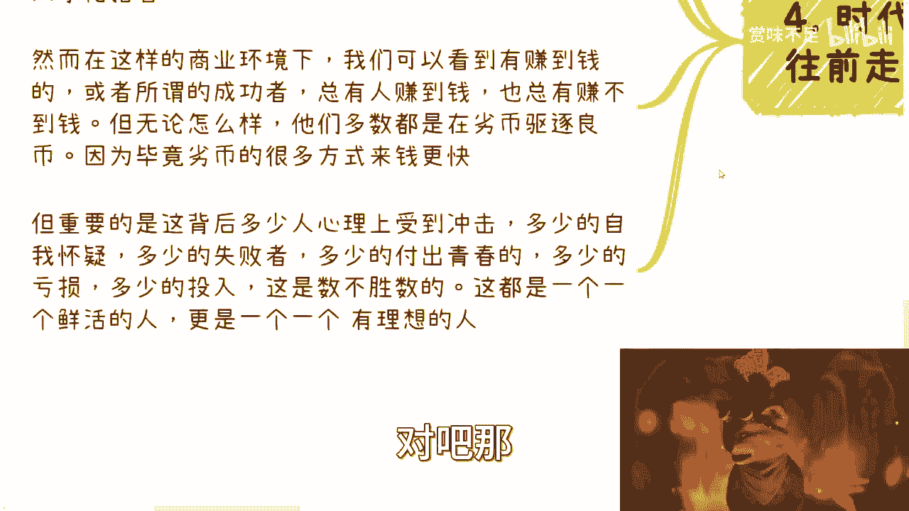

你说这个人是什么逐利的一个区，逐利的一个动物对吧，那很多人他没有办法，你不能说他人那个三观多高尚对吧，他逐利很正常，你不能说他逐利不对对吧，但是他一旦主力，他就会他就会分不清楚到底什么样子是正确。

什么样子是不正确对吧，就像我们说的商业当中是没有对错，但是你良性竞争，恶性竞争你得明白啊，对吧啊，而且最重要的是什么，最重要的是这背后你们想想看这背后，比如说我们看到的所谓所谓成功。

所谓赚到钱的，他都是能有几个人对吧。

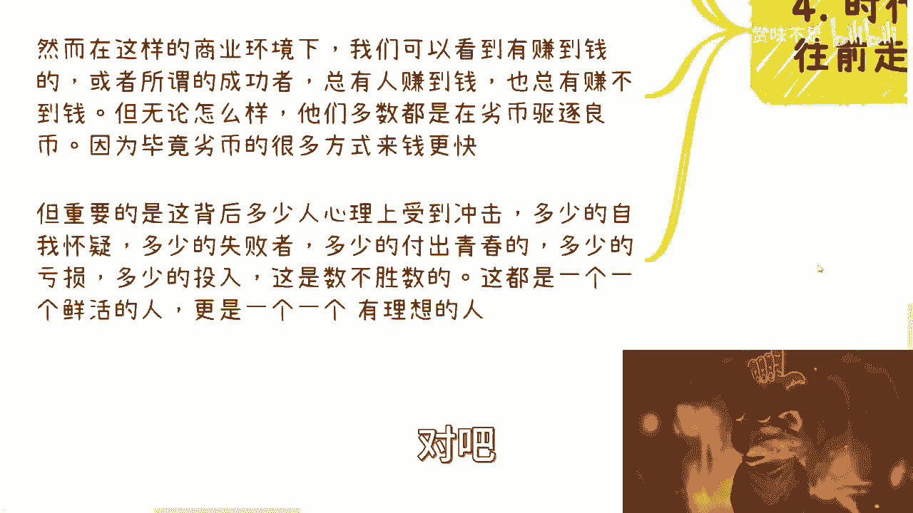

但是这每个人背后可能有成千上万甚至几10万，十几万的人。

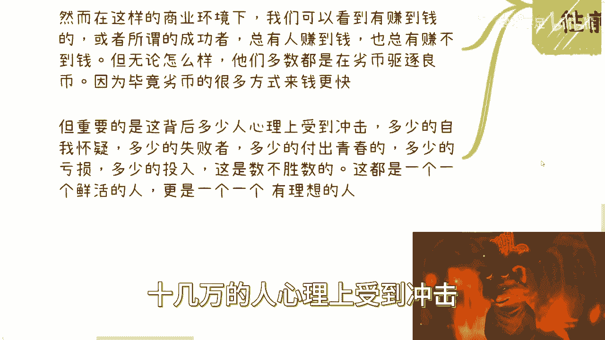

心理上受到冲击，有多少人晚上自我怀有多少的失败者，有多少的付出自己青春的时间，有多少人是亏损的，有多少人是投入资金之后没有任何响应的，数不胜数，但是这一个一个人都是鲜活的，都是跟你们每个人一样的对吧。

都是一个个有理想的人，而且是真正有理想的人。

这些才是我们要去想的，我们要去明白的对吧，就是这就好像什么，你说硬币有两面性没毛病，但是我们现在整个网络整个大部分人看到什么，看到的是他妈的，这不是硬币的两面性吗，他看到的是整个一个球。

而他看到的是这个球的1%，剩下的99%全部在背面，他不知道，他也不管对吧，而他不明白的是。

他不是属于这1%啊，啊他其实属于的是这99%。

对吧，很多事情不说了对吧，很多事情真的不说了，因为很多事情说了，那你就想嘛，我们可以拿一些品牌来举例子，回头这些品牌的公关，我给你们讲，品牌公关以前打我电话没少打过啊，有的态度很好，有的就直接威胁的。

你不要以为你不要以为2023年了啊，大家是什么现代战争，文明战争没有的，你知道吗，没有的，谁他妈打仗还文明啊，啊谁他妈赚钱还文明啊，对不对，他们的威胁我跟你说啊，是很严重的，他们的威胁，而且很没有底线。

没必要，你知道吗，该有经历过的事情我也都经历过啊，你们不要觉得就是说好像哎呀，这个吕老师讲讲东西对吧，讲了永远是讲讲了多少，藏着多少，不是我要藏着多少，我不常行吗，啊我不常能活到现在吗。

你们能看到这些东西吗，是不是唉行吧啊，就这样啊，那个反正你们有什么想要知道的啊，或者说呃主业的未来的规划，副业未来规划，或者你们想要了解一些对吧，更怎么样的事情，反正你们随便怎么样啊。

别举报我就可以好吧，你们整理好问题啊。