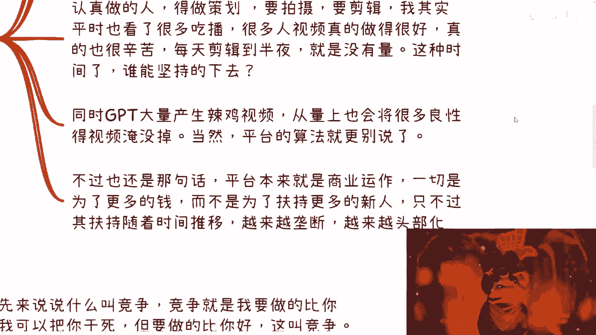
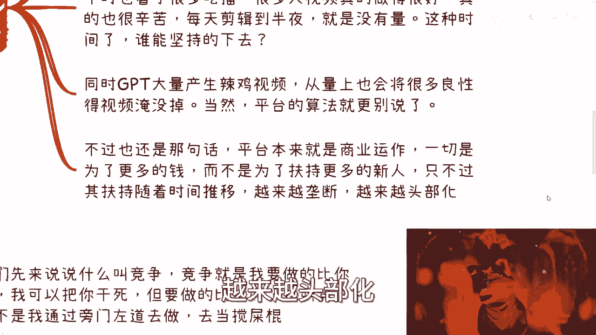
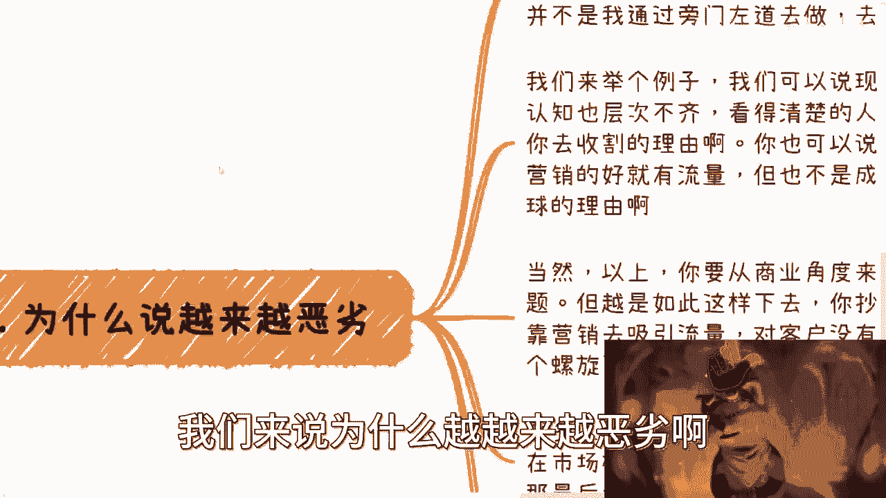
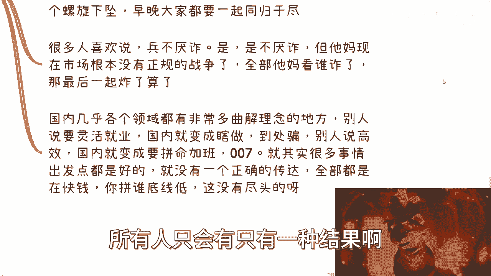
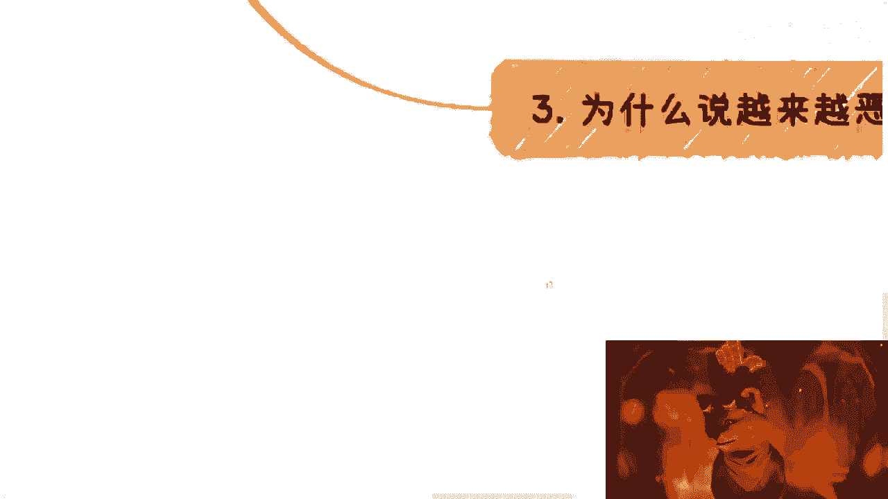
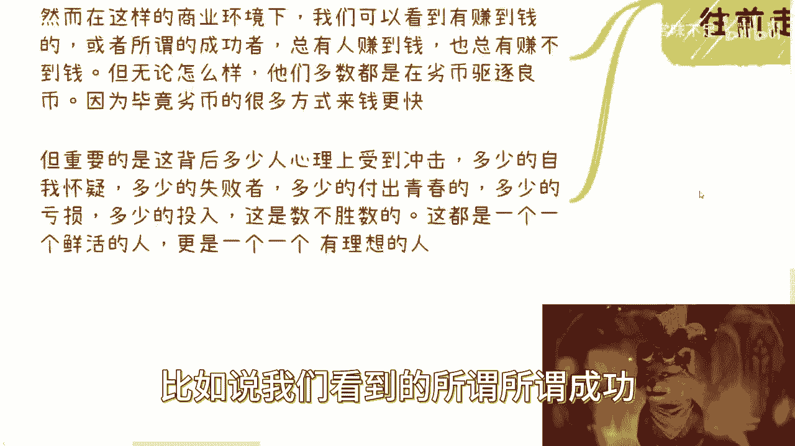
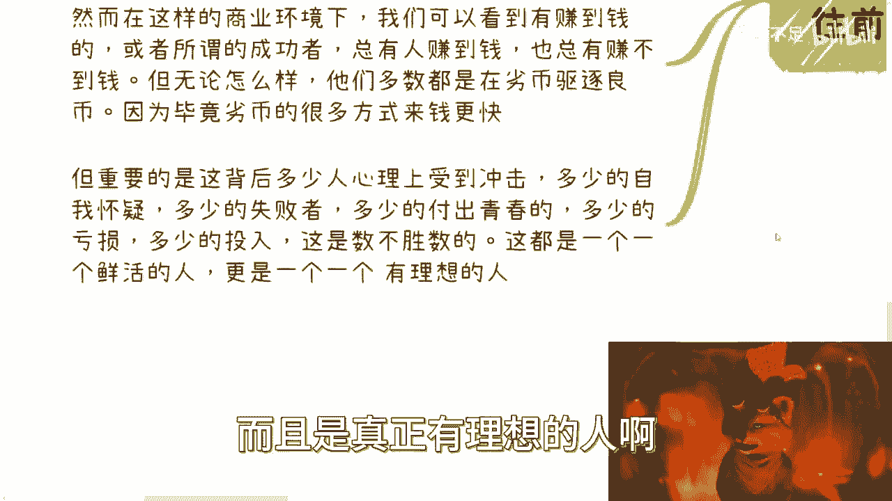
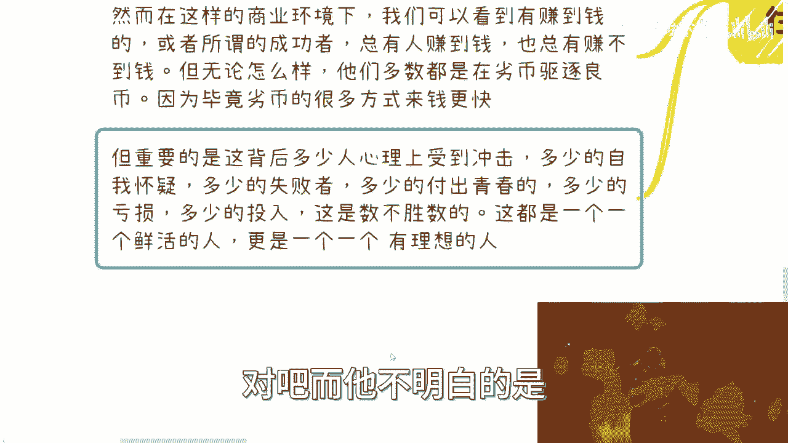
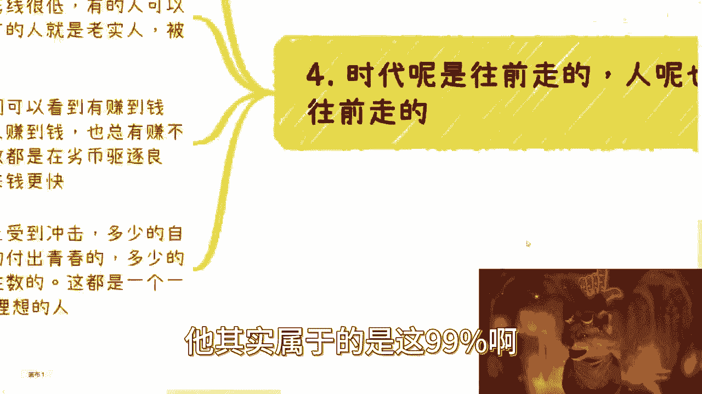

# 商业洞察课程 01：为何商业环境日益恶化？🤔

在本节课中，我们将通过分析多个现实案例与现象，探讨当前商业环境为何被认为越来越不友好和恶劣。我们将从抄袭风气、竞争扭曲、技术滥用及平台生态等多个维度展开，帮助你理解其背后的深层逻辑。

## 个人经历引出的思考

上一节我们介绍了课程主题，本节中我们来看看一个真实的个人经历，它揭示了商业环境中的人为阻碍因素。

多年前，我曾前往一个地方寻求合作。当时，有人专门打电话给合作方（一家大型公司），试图通过贬低我的方式来破坏这次合作。然而，合作方并未偏听偏信，而是将此事告知了我。打电话的人是一位高校教授。那时我仅二十四五岁，此事让我意识到，即便在当时，我的存在似乎已能“威胁”到某些人的地位。

这件事反映出，商业合作中并非完全基于能力与方案，有时会掺杂个人恩怨与不正当的竞争手段。

## 现象一：抄袭成风且缺乏监管🚫

从个人经历回到更普遍的商业现象，我们首先来审视“抄袭”问题。在过去的投资领域，流传着一个经典段子：如果你的创意被某大型公司抄袭了该怎么办？这本身说明，抄袭行为在当时已非常普遍，甚至成为圈内调侃的话题，这意味着缺乏有效监管。

这种现象随着时间的推移而恶化。最初明目张胆的“抄袭”，后来被一些人美其名曰为“借鉴”。这种话语的转变，体现了行为底线的不断下移。

**核心概念**：当抄袭行为缺乏监管（`监管 == 缺失`）时，它会从个别现象演变为普遍风气，并试图通过改变话语体系（如“抄袭” -> “借鉴”）来使自身合理化。

## 现象二：理念的曲解与畸形应用⚙️

上一节我们看到了行为上的异化，本节中我们来看看理念是如何被曲解的。以海外科技公司倡导的“提升效率”为例，其核心是**单位人力的产出比**。然而，这一理念在传播到某些国内环境时，其内涵被严重扭曲。

它从“追求更高效率”变成了“一个人必须当十个人用”，成为推行`996`、`007`等工作制度的理由。这完全背离了提升效率的初衷，变成了单纯的压榨。许多商业理念和成功故事在传播过程中，其真实背景与核心被掩盖或篡改，大众接收到的往往是片面甚至错误的信息。

## 现象三：技术加剧“劣币驱逐良币”🔄

谈完理念的扭曲，我们再将目光投向技术的影响。以年初盛行的`AIGC`（如GPT）技术为例，它本可作为生产工具，但也带来了新的问题。

在内容创作领域，`AIGC`可以批量、低成本地生成内容。这导致了一个严重后果：**劣质内容的海量产出淹没了优质内容**。假设一位认真创作的作者一周产出一个高质量视频（`良币`），而利用`AIGC`的创作者一天可生产100个低质视频（`劣币`）。即使平台下架其中80个，每天仍有20个低质视频涌入市场。

**公式表达**：`良币可见度 = 良币数量 / (劣币数量 * 劣币存活率)`。当分母极大时，良币的可见度趋近于零。

与此同时，许多内容平台的流量分配机制日益倾向于**头部化**和**垄断化**，对新人和中小创作者的扶持减弱。这使得坚持认真创作、但短期内无法获得流量和回报的创作者难以持续。

## 现象四：竞争的本质被扭曲⚔️

技术放大了内容层面的问题，而在更广泛的商业竞争中，其规则也在变质。健康的**竞争**本质是：`我做得比你好`。这意味着通过提升自身产品、服务或效率来赢得市场。

然而，当前许多所谓的“竞争”手段变成了：
*   背后诋毁与举报。
*   专注于“把市场搅乱”，而非自己做好。
*   纯粹依赖营销炒作，而非提供实质性价值。

虽然从纯商业角度看，这些手段可能短期内有效，但长期会导致**螺旋式下坠**：所有参与者都不再专注于创造真实价值，最终损害整个行业的健康与客户的利益，可能走向“同归于尽”的局面。

## 现象五：环境对新生代的影响与全局代价👥

扭曲的竞争环境直接影响着参与其中的人，特别是新生代。时代在发展，总有充满热情和想法的年轻人进入商业领域。但在“劣币驱逐良币”的环境下，**赚钱效率更高、成功可能性更大的路径往往是那些底线更低、手段更非常规的方式**。

这会导致一个严峻的后果：那些愿意踏实做事、坚守原则的“良币”更容易被埋没或淘汰。我们看到的少数“成功者”背后，是数量庞大的失败者、心理受创者以及资源亏损者。整个系统付出的**全局性社会与心理成本**是巨大的。

大多数人只看到了“成功”的`1%`，却忽略了构成基座的`99%`的艰辛与代价，而自己很可能就属于那`99%`。

## 额外的现实：无处不在的压力与威胁⚠️

最后需要指出的是，在这种环境下，揭露问题或坚持原则本身可能会招致压力。例如，一些品牌或机构的公关行为可能并非理性沟通，而是包含直接的威胁，手段没有底线。这迫使许多知情者选择保持沉默，因为“不说出来”可能是在这种环境中得以存续的必要条件。

---

本节课中我们一起学习了当前商业环境日益恶化的多个侧面：从**抄袭缺乏监管**到**理念被曲解应用**，从**技术滥用加剧内容生态恶化**到**竞争规则扭曲背离本质**，再到这种环境对**新生代择业路径的影响**及所付出的**巨大社会成本**。理解这些现象，有助于我们更清醒地认识所处的商业世界，并在其中做出更明智的选择。