# 为什么说老百姓切商业-副业越来越难---P1---赏味不足---BV1v34y1N7AF

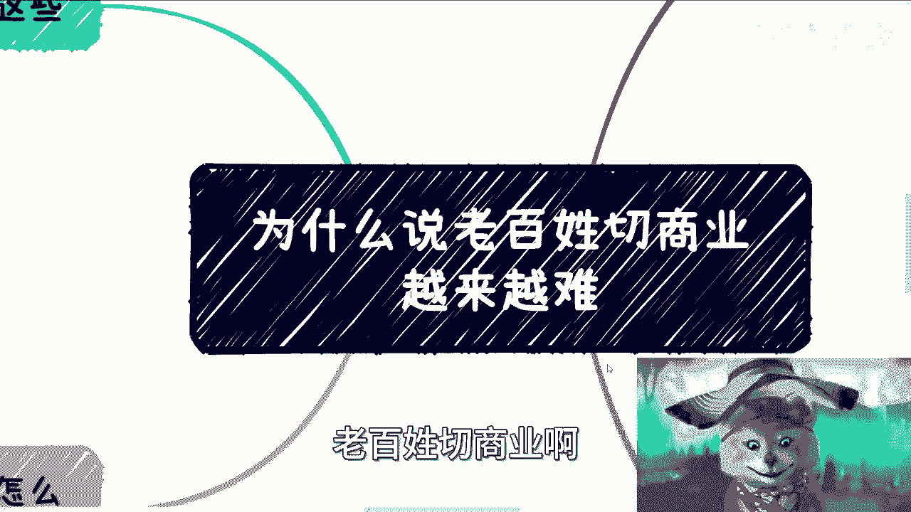

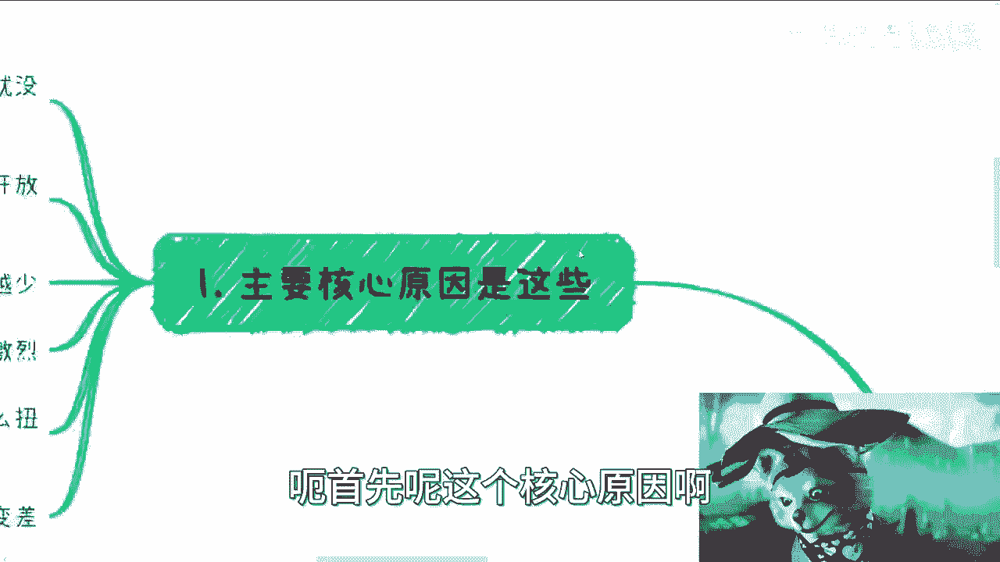

在本节课中，我们将探讨一个普遍现象：为什么普通人想要进入商业领域或开展副业变得越来越困难。我们将从宏观环境、行业现状、合作困境及信息获取等多个维度，系统地分析其背后的核心原因。

## 概述：多重困境的交织

普通人切入商业或副业之所以困难，并非单一原因所致，而是多种因素共同作用的结果。这些因素相互关联，形成了一个对新手而言壁垒重重的环境。

上一节我们概述了问题的复杂性，本节中我们来看看具体有哪些核心原因导致了这种困境。

## 核心原因分析

以下是导致普通人切入商业领域日益艰难的四个核心原因。

### 1. 整体环境不佳 🌍

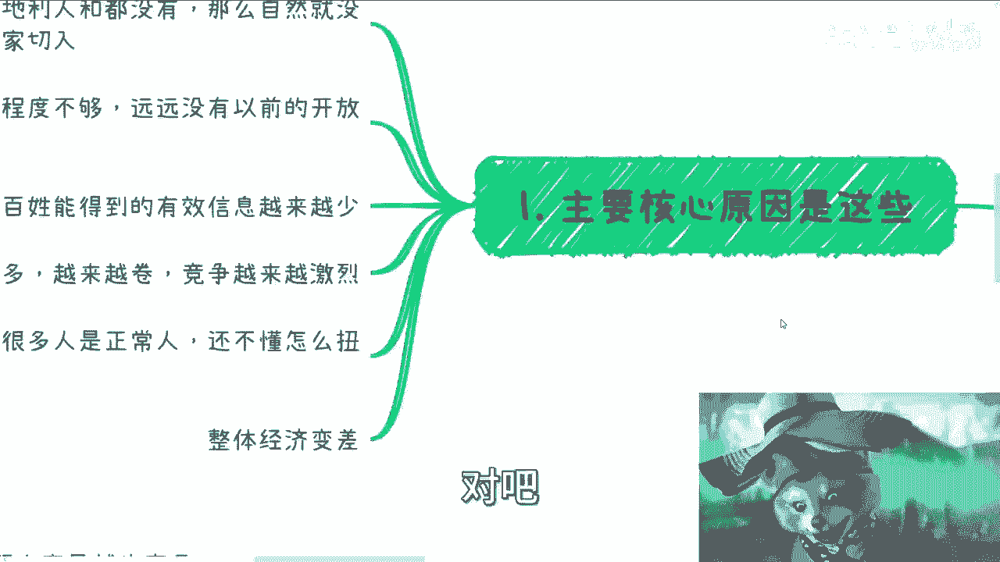

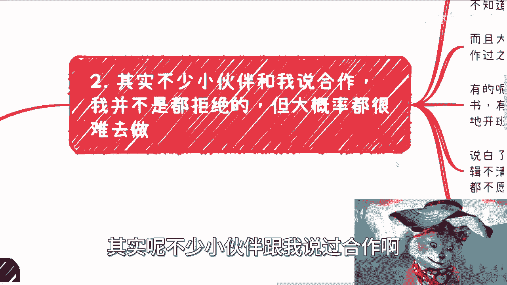

首要原因是宏观环境不景气。这里的“环境”指的是天时、地利、人和等综合条件。当整体经济与社会环境不佳时，市场机会自然会减少，普通人能够切入的缝隙也随之变窄。

### 2. 商业既得利益者开放度降低 🔒

商业领域的既得利益者（如成熟企业、资源掌握者）对外部的开放程度正在变小，而非扩大。这与经济和政策环境的变化密切相关。开放性的降低意味着普通人通过合作或依附进入商业体系的门槛变高。

### 3. 信息差日益扩大 📊

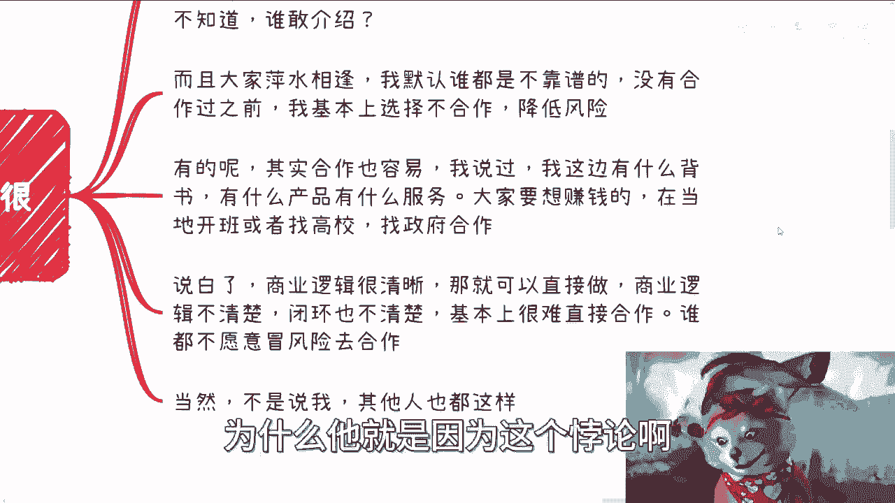

普通人能够获取的有效商业信息正在减少，而信息差却在不断扩大。这意味着，掌握关键信息的人拥有巨大优势，而信息闭塞者则难以找到正确的方向和机会。

### 4. 竞争过度与市场扭曲 🤼

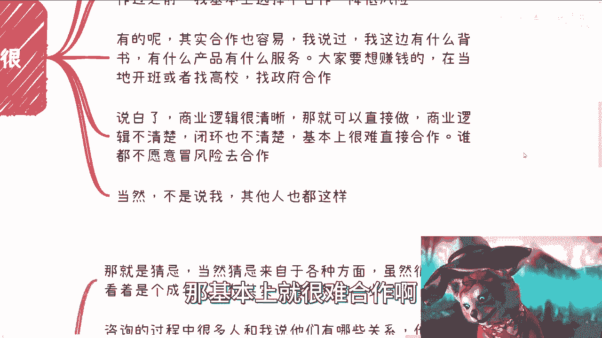

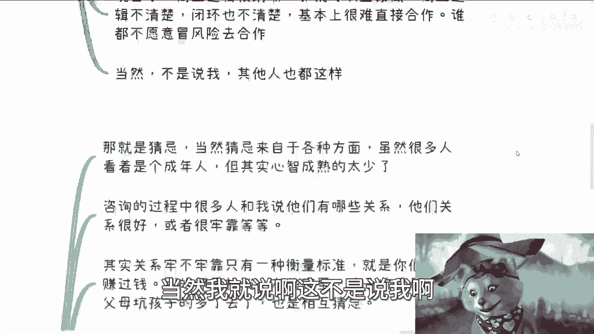

参与竞争的人数过多，导致市场出现两个问题：
*   **竞争白热化**：优秀人才的涌入使得竞争异常激烈。
*   **市场扭曲**：大量不成熟的参与者（可能占80%）涌入市场，其低质量的服务或产品会扰乱市场秩序，使得“良币驱逐劣币”的机制失效。甲方和乙方都难以辨别优劣，整个竞争环境变得扭曲且低效。

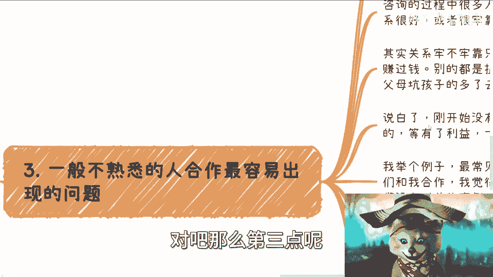

上一节我们分析了宏观层面的原因，本节中我们聚焦于微观层面，看看具体的合作困境如何阻碍普通人。

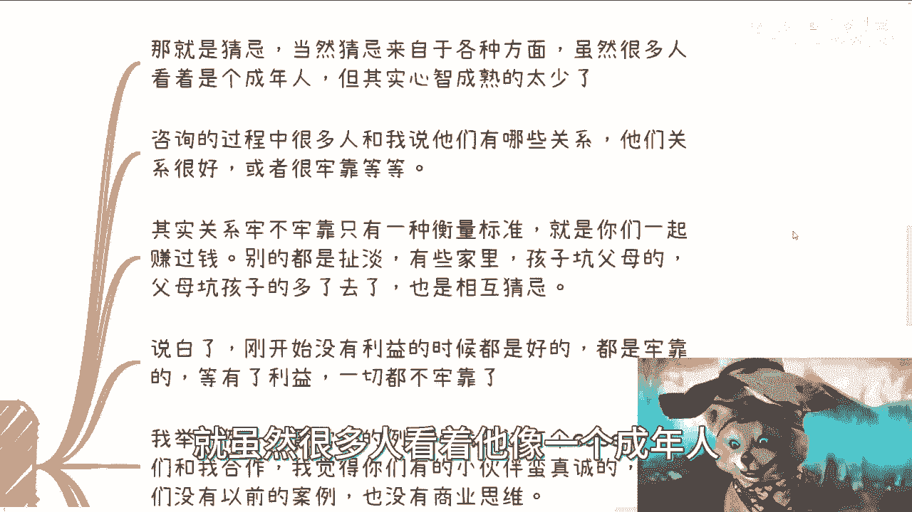

## 合作中的现实困境

在尝试切入商业时，寻求合作是常见路径，但现实中面临重重障碍。

### 1. 合作的“悖论”与高风险

商业人士普遍倾向于不与不熟悉的人合作，以降低风险。这就形成了一个“悖论”：没有合作就无法建立信任和案例，而没有信任和案例又无法促成合作。这个悖论正是横亘在“平行世界”（普通职场与商业世界）之间的一道高墙。

**商业合作的基础逻辑**可以简化为：
```plaintext
明确的商业闭环 + 清晰的利益分配 -> 可合作的契机
```
反之，逻辑不清晰、闭环不完整的合作意向，很难被接受。

### 2. 信任缺失与“格局”考验

与不熟悉的人合作，最大的问题在于“猜忌”。猜忌可能源于合作方的心急、缺钱，或者更根本的——“格局”太小。
*   **格局**：指的是分清“小钱”与“大钱”、“重要”与“不重要”的能力，以及在利益面前保持清醒和长远眼光的定力。
*   **关系的试金石**：关系的牢靠程度，唯一有效的衡量标准是**是否一起赚过钱**（尤其是经历过较大利益的考验）。在足够大的利益面前，许多原本看似牢固的关系都可能瓦解。

### 3. 安全与面子孰轻孰重

在成熟的商业合作中，**安全、可靠、平稳交付**的重要性远大于“人情面子”。合作方首要考虑的是项目能否安全落地，一条可持续的赚钱渠道能否维系。因此，他们需要看到实实在在的**合同**和**过往案例**，而非空口承诺或关系描述。

上一节我们探讨了合作的障碍，本节中我们来看看如何获取关键的商业信息。

## 如何有效获取信息？🔍

关于获取有价值的商业信息，需要避免误区并掌握正确方法。

以下是获取信息的关键原则和路径：

1.  **摒弃幻想**：不要幻想存在一个“神秘渠道”，能轻松告诉你如何赚钱。如果存在，早已失去价值。
2.  **保持警惕**：对网络上的暴利信息保持高度警惕，即使能赚到钱，也可能只是“老百姓互割”的零和游戏。
3.  **信息源多元化**：核心信息应来自四个维度：**资本方、政府、企业、目标行业的从业者/创业者**。
4.  **重在质而非量**：最终的目标不是认识很多人，而是找到**一两个靠谱、可信、能背靠背信任**的深度信息源。关键在于对方愿意说真话，且你有能力辨别真伪。

## 总结与行动建议

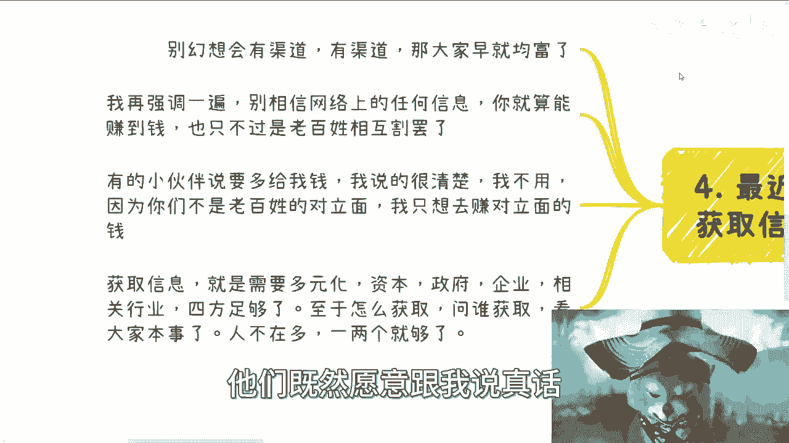

本节课我们一起学习了普通人切入商业/副业日益艰难的多重原因。总结如下：

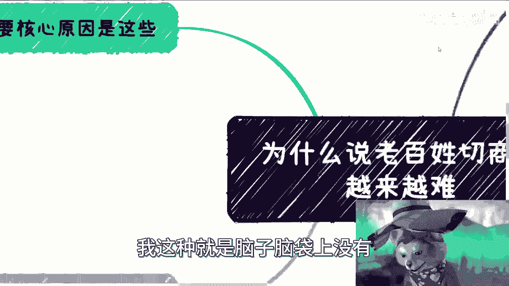

*   **宏观层面**：环境不佳、既得利益者封闭、信息差扩大、竞争扭曲共同筑高了壁垒。
*   **微观层面**：商业合作中存在信任悖论、格局考验以及对安全性的极致追求，使得新手难以获得起步机会。
*   **信息层面**：有效信息获取困难，需要建立深度、可信的信息源网络。

综合来看，普通人的“平行世界”与商业“平行世界”正在加速分离。在经济上行期，大家愿意合作做大蛋糕；而在当前环境下，人人自危，合作门槛极高。

**最后的建议是**：对于有意切入商业领域的大众而言，时间窗口正在收窄。需要抓紧时间，理性评估自身资源（手中的“牌”），并尝试通过专业咨询等方式，更清晰地了解政府、高校、产业等领域的真实运作规则与盈利模式。

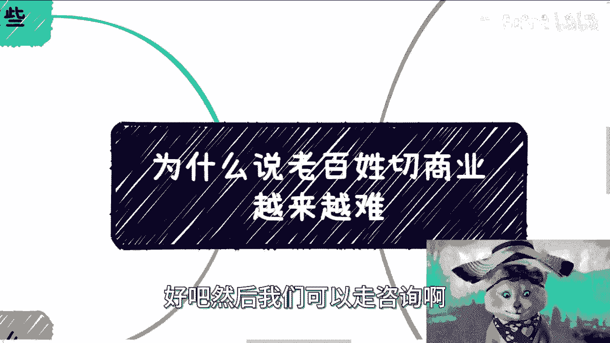

---
**注**：本教程基于原视频内容整理，旨在进行知识梳理与传播，不构成任何投资或创业建议。商业决策需谨慎。