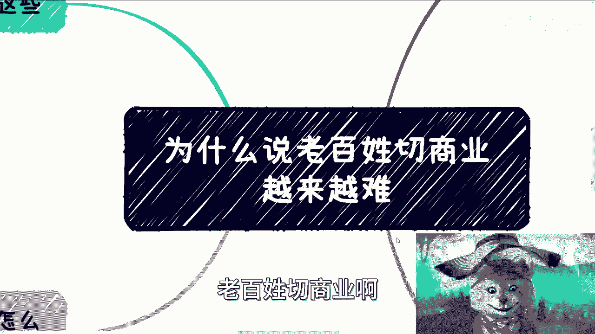
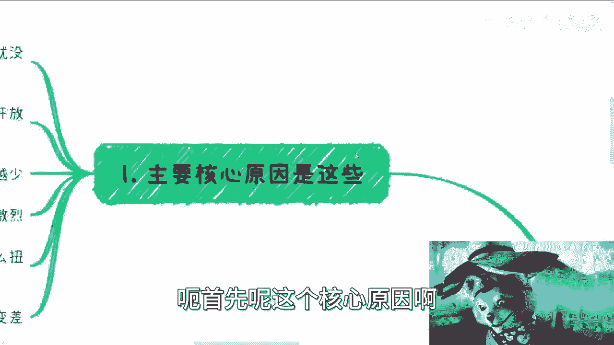
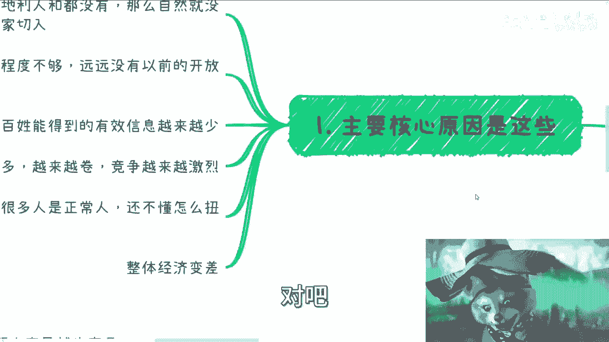
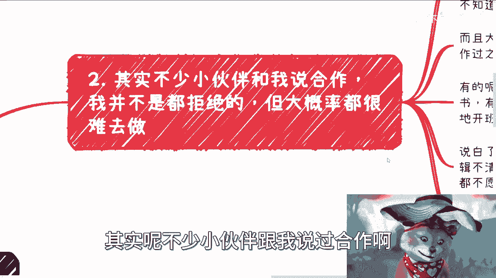
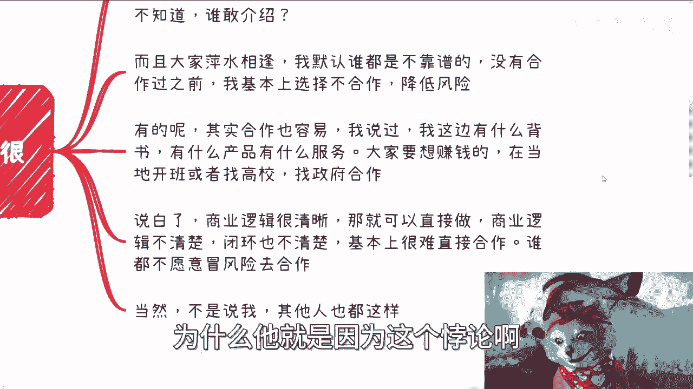
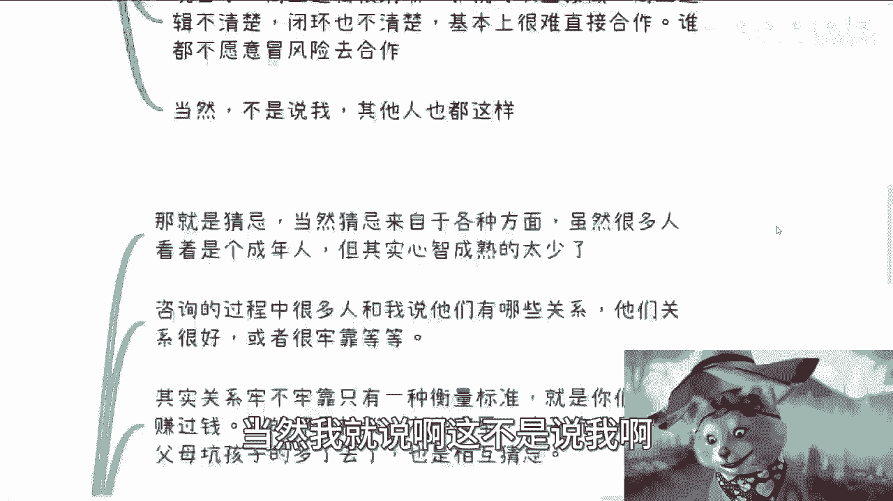
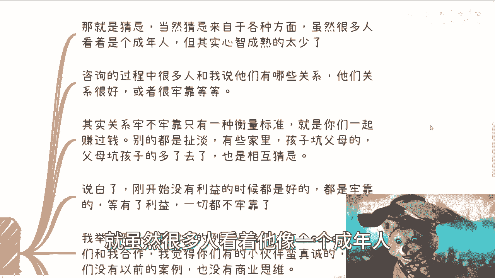
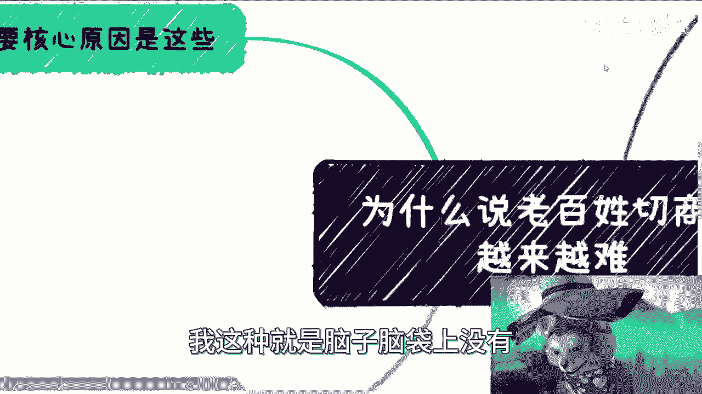

# 为什么说老百姓切商业／副业越来越难 - P1 - 赏味不足 - BV1v34y1N7AF

好啊，那么今天我们来讲的是这个叫什么，老百姓切商业啊。

为什么那个说越来越难啊，嗯首先呢这个核心原因啊。

我这边写了一下，就首先整个环境不好对吧，这个环境不好呢指的是天时地利人和都不好啊，都不好，那么自然就没有这么多的这个机会，让大家去切对吧，我觉得这个毫无疑问啊，呃我看看我的这个小浣熊啊，小熊猫很对吧。

然后第二点呢，商业既得利益者啊，他开放程度也不叫不够吧，就开放程度越来越越来越窄啊，越来越小啊，它远远没有以前的这个开放性，那这个原因呢，也其实和这个叫经济有很大的关系，而且不单跟经济有关。

跟政策也有关系啊，这是第二点，第三点呢信息差会越来越大啊，就是说老百姓会得到的有效信息会越来越少，对吧，第四点就是说人太多对吧，就包括就是说接下来的硕士啊，接下来的应届生啊，接下来很多人啊，他人太多。

那人多了呢，你会发现啊，就是任何一个行业人多了，或者任何一个领域人多了，他会面临两个问题，一一方面呢就是当然你的竞，如果这些人比如说很优秀啊，那么呃你的竞争对手会越来越多对吧。

那同样的大概率安全八二原则的话，80%的人他其实不优秀啊，撸的都是垃圾对吧好，那这80%的人吃了之后呢，你就会发现会把这个市场搅乱掉啊，就是我们称之为每一个市场里面，其实都会有参差不齐的人对吧。

那么当一个行业非常参差不齐的时候，你就会发现就是说呃你说是不是良币驱逐劣币，还是劣币驱逐良币，这个东西已经没有就没有意义了，因为到时候整个的这个甲乙方，他根本就分不清楚谁是劣币，谁是良币，不知道了。

因为乱得很，你知道吧，那么综合原因就是综合的结果，就是竞争越来越激烈，而与此同时呢，竞争也越来越扭曲，因为呃就我们说啊，就是说比如说商业上，大家就我们刚刚说为什么说既得利益者。

他呃这个开放程度会越来越小了，就是因为现在越来越扭曲啊，对啊，就他不敢合作，就是说我们以前说过，就是说能做一件事情的人很多对啊，就比如说今天我这边有个case对吧。

那我相信如果啊比如说明年我这边有很多case，我可以明确跟你们讲，可能有很多case，如果你们愿意，你们也可以跟我给我打工啊，当然我不可，我不会给你们发工资，而更多的是说大家来看就是打多少工资。

给多少钱，比如说我一天给你们多少钱，比如一天是一两千对吧，还是一天一天是四五千对吧，但是你知道吗，问题在哪里，问题在于能做这个活的人，其实我我早就跟你们讲过，商业上很多东西。

它跟学历跟你的知识面没有关系，你懂吗，就是说今天能做这些事情的人很多，就包括就是说我给政府去讲，我给企业去讲啊，能中国只有我能讲吗，那肯定不可能啊，对不对，但为什么他们愿意找我，是因为安全。

是因为稳定对吧，就他们知道我的格局在什么地方，他们知道我在什么场合会说什么话对吧，那你找一些别人，也许他比我牛逼对吧，也许他他这个讲的比我好，也许他要的钱还比我少，但是问题是谁敢合作呢。

随着这个发展对吧，敢合作的越来越少了对吧，所以说现在很多人是正常人啊，他还不懂得怎么扭曲，那么你们但凡进入一个已经很扭曲的，一个环境里面，就自然而然会就要么就不适应，要么就被割嘛对吧。

然后还有另外一个就是整体经济变差啊，那么第二点其实呢不少小伙伴跟我说过合作啊。

我并不是都是拒绝的，但是大概率呢都是拒绝的啊，为什么啊，因为呃当然这不是说我的问题啊，就是所有的你们去找别人合作，其实都一样的，就比如有的你让我介绍资源的对吧，或者问我有没有认识相关的。

比如说叉叉叉对吧，这可能是个机构，可能是个人对吧，可能是个可能是个什么组织，对吧啊这个我没法接受，为什么，因为说白了啊，第一点我去找别人，我我或者说大部分人跟就很多人，大家不是说很熟悉很熟的一个关系。

就我去找别人或者别人来找我，他一定是带有赚钱的目的对吧，也就是说他告诉你怎么赚钱，或者我告诉他怎么赚钱对吧，我不可能现在跑到跑跟任何一个人，比如说某个协会会长对吧，我说哎那谁很久不联系了啊。

我们来扯个蛋，那什么人家当我老能有毛病啊对吧，送到晚片段录600号是吧啊，就是说你一定得明白告诉别人怎么赚钱对吧，你让我介绍，你想想看啊，我连你怎么赚钱，我怎么赚钱啊。

甚至我介绍的这一房子么赚钱都不知道，那他妈谁敢介绍啊对吧，那我觉得是人家觉得我是是吧啊，这第一点第二点你想啊，大家萍水相逢，我就做过商业的人，他都会默认谁都是不靠谱的，你知道吗，就在合作过之前。

在在真正的大家赚过钱之前，我基本上选择不合作就降低风险啊，那这个时候又有人说了，那这不是个悖论嘛，对不对，那不好意思，我告诉你，商业到现在也不叫商业吧，就是你们要想想看。

为什么这么多人就是这么大的一个庞大群体，9年制义务教育到高等教育，而真正从那个平行世界切到商业，平行世界的人少之又少，为什么他就是因为这个悖论吗对吧。

那如果没有这个悖论，大家都好，协会走到今天这一步了，不会的呀，对吧啊，有的呢我跟你讲，其实合作也很容易对吧，比如说我以前也说过对吧，包括我这边背书啊，我有什么产品啊，我做什么服务啊对吧。

那在大家说唉我想赚钱呢，那比如说你在当地开班，或者找高校或者找企业对吧，找什么合作，然后你就告诉我，你说哎吕老师，我们这边有什么东西要做的对吧，你那边能不能提供什么东西，对不对，而你那边能做的话。

一定要是比较确切的合作意向啊，你别到时候被别人白嫖了，你还想来白嫖我，那是不可能的，对不对啊，那么说白了商业逻辑很清晰啊，那就直接做对吧，商业逻辑不清晰，包括闭环也不清晰，那基本上就很难合作啊。

谁都不愿意去冒风险去合作啊，当然我就说啊，这不是说我啊。

就所有的那些这个做商业的人，其实都一样的对吧，那么第三点呢。

一般不熟悉的人呢合作很容易出现问题，为什么你们看啊，就是最大的问题就在于猜忌，而这个猜忌来自于很多地方，就是大概率啊，有的呢是因为自己缺钱，他心急，有的呢就是因为格局小，你知道吧。

就是说他不知道哪些钱是小钱，哪些钱是大钱，他不知道哪些重要，哪些不重要啊，就虽然很多人看着他像一个成年人。

但他的心智非常的幼稚，那么咨询过程当中呢，很多人也会跟他们说，他们有什么呃，就跟我说他们有什么关系对吧，他们关系很好，包括可能很牢靠等等等，其实呃我我不说，就是说极端情况啊，就是普遍来讲关系牢不牢靠。

只有一种衡量标准，就是你们是不是一起战斗过的战友，什么叫一起战斗过的战友呢，就是你们是不是一起赚过钱，就我说的赚过钱，他也是个宏观的角度，不是说今天比如说啊我赚一块钱赚一块钱，大家赚到钱了对吧。

不是而是说我们赚过相对比较大的钱，或者我们相对赚过那些性价比比较高的钱啊，那么利益越大化，你越能看出来这个人怎么样哦，那么别的都是扯淡，你知道吗，就是在有些家里面，你你你会去看到，比如说孩子坑父母啊。

父母坑孩子的也多了去了，为什么，就是因为相互猜忌对吧，因为在利益足够大之前，在利益利益很大的利益面前，或者很多人他没有挣过钱，他可能觉得，比如说几百万已经是很大利益了对吧，那么他就会迷失自我。

他就会就是六亲不认对吧，所以说我以前在那个充电视频里面，我说的也很清楚，什么叫格局大，格局大，就是我们可以没赚过这么多钱，但是我们要去明白，不要见钱眼开，不要就是说看到一些钱好像就搞得啊。

这个自己不就牛逼了对吧，自己好像人上人了，怎么没有用的，我跟你讲哦，因为天外有天，山外有山，人外有人，这点钱算什么啊，我说不好听的，这点钱算什么，这这点钱也不过，就是就是我所在的这个这个地方的。

大概二手房的一半的金额而已，有什么用啊，没用的啊，对了啊，那说白了啊，刚开始的时候呢，很多时候你没有利益都是好的，你看谁都是朋友哦，你看谁关系都是牢靠的，但等了有了利益，一切都是不牢靠的啊，我举个例子。

比如说啊我身边打个比方，比如说我有kiss对吧，我我找你们合作，同时呢，比如说我觉得你们有的小伙伴蛮真诚的对吧，你们呃，但是呢有个最大的问题是，你们可能以前没有案例啊，你们同时也没有商业思维啊。

那么同样的我跟我的合作方可以说，哎我说你看啊这个这个这个团队蛮靠谱的对吧，也做了一些东西，当然我得给他们画画饼嘛对吧，我说也做了一些东西对吧，然后他们的这个供应商，承接执行的这个价格也很便宜对吧。

那么一般来讲啊，对合作方而言，他们就是我的合作方而言啊，如果他们真的做过商业，根本不会看谁的面子，因为面子没有用，面子不值钱，同时面子没有这个产品的安全性，可靠性，靠谱度来了，CP来的重要。

因为大家要的是把一个单子从头到尾做完哦，能够安安全全的就是平平稳稳的去交付，而不是说大家在这里面看谁的面子，因为但凡这当中出一个任何问题，很有可能大家积累了多年，能够赚钱多年的一条线就没了。

那你说孰轻孰重呢，对不对啊，要看他一定会问我要看案例啊，他肯定会就是当然我也不可能跟他开这个口嘛，我当然跟他开这个口，就说明我是对吧，那么如果我开这个口口，那么他一定会跟我说。

哎那陈老师你你你就是既然这么说了对吧，那我们看看安利他们做过什么，你空手空空，空口无凭啊对吧，那么我们也得去看是不是靠谱，是不是安全啊，那么如果啊，这个时候你说我直译要推荐一些陌生的团队，那么我跟你讲。

我只会让别人觉得我们蛇鼠一窝肯定有回扣，对吧，那么他们以后也不可能再跟我合作，因为他们觉得我可能心里有点小九九，就说难听点，就说好听点叫小九九，说难听点就是没有格局啊，所以牢不牢靠。

没有任何没有任何用处，就包括其实那个B站上，有些小伙伴想跟我合作的，他跟我讲了半天，你知道吗，我最后就回一句话，我说你说这些东西我都不关心，为什么我无所谓啊，我根本就不关心你说的这些。

因为你说的这些东西在法律意义上面，完全是没有立足点的，我只关心什么，我只关心，比如说你跟他什么关系好，OK拿合同拿出来，拿案例拿出来，我要明白他是不是安全是不可靠的，你跟我说啊。

这个这个我一个朋友开了个公司，我一看什么野鸡公司，那有什么好合作的了，对吧啊，你跟我说你关系很好，跟我有什么关系啊，对不对，你所有东西要以大局为重啊，好那么最呃第四点就是最近咨询呢。

还是有很多人关于这个获取信息的问题啊，首先我还是强调一下啊，别幻想有渠道问出这种问题，就代表你很无知对吧，别幻想有渠道有渠道，大家早就均富了，会有今天这个样子吗，啊哈有迟到吗，早就均富卡了呀。

大富翁打过不啦，对不啦啊，第二点我再强调一遍，别相信网络上任何的信息，你就算能赚到钱，也只不过是老百姓护哥，你自己仔细去看看，你品一品这句话啊，你品一品这句话啊，有的小伙伴说要多给我钱，我给你讲。

真的有的是要多给我钱的说啊，我赚到钱啊，他说吕老师我给你，我会给你分润的或者怎么样，我说我不要，因为我真不要为什么，因为第一我觉得你能赚到钱，那是你的本事，这不是我对你有什么影响啊，这我我我也承认。

我也没干什么事情啊，这是第一点，我希望的是大家如果真的能赚钱，我们只要去想办法赚DVD面子钱就好了，不要想着从老百姓身上赚钱，千万别去想，没有必要的啊，当然啊当然啊，就是这个只是我的三观啊。

你们你们有如果很多人觉得我只要赚到钱，妈的别管这些东西也可以啊，从商业上来讲，我认可啊，没毛病啊，没毛病啊，好然后第四点就是获取信息，我以前说过，就是一定要多元化啊，一共就四方资本，政府企业。

以及你要你要去做的相关行业的那些创业者，或者从业人员，就这四房够了哦，至于怎么获取，看谁问谁获取，我跟你讲，看大家本事了啊，各显神通，而且我跟你讲人不太多啊，人绝对不在，做一两个就够了。

而且这一两个是什么，得要靠谱得要可信，得要大家背靠背，大家是信任的哦，哦不是说什么哎我今天吕老师说的资本政府好，我这边问问，那边问问，这是一开始要做的，因为你没有目标，但是你要做。

你要最终达到的目标是什么，就是那一两个人就够了啊，就够了，而你要知道的是，他告诉你的是真话，而不是说啊一些官腔，或者一些就是呃就是包装出来的，打哈哈的东西对吧，那那你要有能力去分辨。

同时你要明白这个人跟你的关系好，那么就够了，所以说你想我现在我很清楚，明年可能有哪些单子啊，我也很清楚明年可能往哪个方向发展对吧，但是如果某一天就像我曾经跟你们讲过的，我在疫情大概结束的时候。

我就很迷茫，因为我不知道后面会怎么样子，所以我就花了大概半个月的时间啊，我就是跑了一下，包括重庆啊，杭州啊对吧，然后苏州啊，其他各个地方我找的是谁，我找的就是资本政府企业，包括我所在的呃。

我要去关心的相关的行业，其实对我来讲没什么成本啊，差旅请他们吃个饭就结束了，而这种根本就不算商务局，为什么，因为大家都是朋友，就是我既然会问他们，我就知道他们会跟我说真话，他们既然愿意跟我说真话。

就说明他们愿意相信我，因为你要知道当下这个社会，我这种就是脑子脑袋上没有东西的。

我是无所谓的，但是我去找的人，他们多多少少都是有自己的定位的，有自己的工作的啊，他们要愿意去说，已经是非常难得可贵了啊，因为现在谁去说任何东西都怕第二天被举报，都怕第二天丢了工作对吧。

所以你想想看我们综合看来啊，你说为什么老百姓缺商业越来越难，就是因为你综合看下来怎么去切了它，两个平行宇宙已经开始隔离了，也不用隔离，就隔离的越来越远了，你怎么去切呢，原原本原本经济好。

原本大家可能比如说一直想把这个蛋糕做大的，可能大家都还是愿意合作的，现在呢对吧，人人自危，我说不好听的就是人人自危，就这样子的，为什么我实在没办法，谁知道谁是什么样子的，好吧行。

那就这么着吧啊嗯我总结我总啊，就说我总结一下，就是说呃没有别的意思，我只想告诉大家啊，就是对于大众来讲，时间已经越来越短了好吧，请抓紧时间，就这么一回事儿啊，嗯OK好，然后就是我们一样的啊。

就是你们有什么手上有什么牌对吧，然后你们觉得这个副业啊，商业啊，包括未来的，甚至你们想创业啊对吧，当然创业我是不支持的啊，那么包括就是说你们想要去了解，就是政府高校对吧，商业和等产业等各方面啊。

他们原本是怎么赚钱的等等等啊，各种各样的例子，你们想知道的啊，那么你们可以私信我好吧，然后我们可以走咨询啊。

